```{r}
library(readr)
library(knitr)
library(kableExtra)
library(tidyverse)
library(devtools)
library(dplyr)
library(ggplot2)
# library(myfirstpackage)
# switch ggplot text to Latin Modern Roman
theme_set(
  theme_minimal(base_family = "Latin Modern Roman") +
    theme(
      plot.title = element_text(size = 24, face = "bold"),
      axis.title = element_text(size = 12),
      plot.caption = element_text(size = 10, hjust = 0)
    )
)
```


# Multiple Regression: How Much Is Your Car Worth?

\begin{flushright}
\emph{Essentially, all models are wrong; some are useful.} \\
- George E. P. Box$^1$
\end{flushright}


Multiple regression is arguably the single most important method in all of statistics.
Regression models are widely used in many disciplines. In addition, a good understanding
of regression is all but essential for understanding many other, more sophisticated
statistical methods.

This chapter consists of a set of activities that will enable you to build a multivariate
regression model. The model will be used to describe the relationship between the retail price of 2005 used GM cars and various car characteristics, such as mileage, make, model, presence or absence of cruise control, and engine size. The activities in this chapter allow you work through the entire process of model building and assessment, including:
\vspace{-1em}
\begin{itemize}
\item  Applying variable selection techniques
\item  Using residual plots to check for violations of model assumptions, such as heteroskedasticity, outliers, autocorrelation, and nonnormality distributed errors
\item  Transforming data to better fit model assumptions
\item  Understanding the impact of correlated explanatory variables
\item  Incorporating categorical explanatory variables into a regression model
\item  Applying F-tests in multiple regression.
\end{itemize}

\newpage


## \textcolor{blue}{Investigation: How Can We Build a Model to Estimate Used Car Prices?}

Have you ever browsed through a car dealership and observed the sticker prices on the vehicles? If you have ever seriously considered purchasing a vehicle, you can probably relate to the difficulty of determining whether that vehicle is a good deal or not. Most dealerships are willing to negotiate on the sale price, so how can you know how much to negotiate? For novices (like this author), it is very helpful to refer to an outside
pricing source, such as the Kelley Blue Book, before agreeing on a purchase price.

For over 80 years, Kelley Blue Book has been a resource for accurate vehicle pricing. The company’s website, http://www.kbb.com, provides a free online resource where anyone can input several car characteristics (such as age, mileage, make, model, and condition) and quickly receive a good estimate of the retail price.

In this chapter, you will use a relatively small subset of the Kelley Blue Book database to describe the association of several explanatory variables (car characteristics) with the retail value of a car. Before developing a complex multiple regression model with several variables, let’s start with a quick review of the simple linear regression model by asking a question: Are cars with lower mileage worth more? It seems reasonable
to expect to see a relationship between mileage (number of miles the car has been driven) and retail value. The data set Cars contains the make, model, equipment, mileage, and Kelley Blue Book suggested retail price of several used 2005 GM cars. 

### \textcolor{blue}{Practice:} A Simple Linear Regression Model {-}
\vspace{-1em}
Data set: `Cars`

1. Produce a scatterplot from the Cars data set to display the relationship between mileage (Mileage) and suggested retail price (Price). Does the scatterplot show a strong relationship between Mileage and Price?

2. Calculate the least squares regression line, $\scriptstyle Price = b_0 + b_1(Mileage)$. Report the regression model, the $\scriptstyle {R}^2$ value, the correlation coefficient, the t-statistics, and $\scriptstyle p$-values for the estimated model coefficients (the intercept and slope). Based on these statistics, can you conclude that Mileage is a strong indicator of Price? Explain your reasoning in a few sentences.

3. The first car in this data set is a Buick Century with 8221 miles. Calculate the residual value for this car (the observed retail price minus the expected price calculated from the regression line).


>**MATHEMATICAL NOTE:** For any regression equation of the form $\scriptstyle y_i = \beta_0 + \beta_1x_i + \epsilon_i$ the hypothesis test for the slope of the regression equation ($\scriptstyle \beta_1$) is similar to other t-tests discussed in introductory textbooks. Mathematical details for this hypothesis test are described in Chapter 2.

To test the null hypothesis that the slope coefficient is zero ($\scriptstyle H_0 : \beta_1 = 0$ versus $\scriptstyle H_1 : \beta_1 \ne 0$), calculate the following test statistic:

\begin{equation}
\label{SlopeTest}
t = \frac{b_1 - \beta_1}{\hat{\sigma}_{b_1}}
\tag{3.1}
\end{equation}

where $\scriptstyle b_1$ is the estimated slope calculated from the data and $\scriptstyle \hat{\sigma}_{b_1}$ is an estimate of the standard deviation of $\scriptstyle b_1$. Probability theory can be used to prove that if the regression model assumptions are true, the t-statistic in Equation 3.1 follows a t-distribution with n - 2 degrees of freedom. If the sample statistic, $\scriptstyle b_1$, is far away from $\scriptstyle \beta_1$ = 0 relative to the estimated standard deviation, the t-statistic will be large and the corresponding $\scriptstyle p$-value will be small.

The t-statistic for the slope coefficient indicates that Mileage is an important variable. However, the $\scriptstyle {R}^2$ value (the percentage of variation explained by the regression line) indicates that the regression line is not very useful in predicting retail price. (A review of the $\scriptstyle {R}^2$ value is given in the questions later in this chapter.) As is always the case with statistics, we need to visualize the data rather than focus solely on a $\scriptstyle p$-value. Figure 3.1 shows that the expected price decreases as mileage increases, but the observed points do not appear to be close to the regression line. Thus, it seems reasonable that including additional explanatory variables in the regression model might help to better explain the variation in retail price.


```{r fig31, echo=FALSE, out.height = "3in", fig.align="center", fig.cap="Scatterplot and least squares regression model: Price = 24,765 - 0.1725(Mileage). The regression line shows that for each additional mile a car is driven, the expected price of the car decreases by about 17 cents. However, many points are not close to the regression line, indicating that the expected price is not an accurate estimate of the actual observed price."}
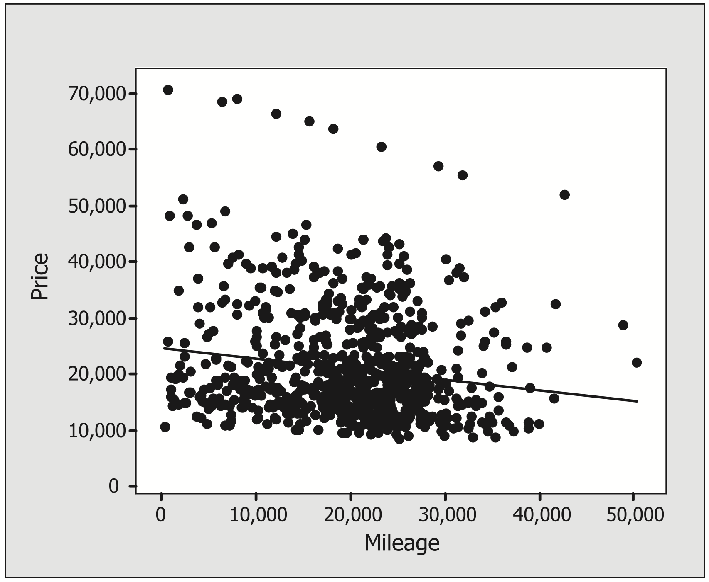
```

In this chapter, you will build a linear combination of explanatory variables that explains the response variable, retail price. As you work through the chapter, you will find that there is not one technique, or “recipe,” that will give the best model. In fact, you will come to see that there isn’t just one “best” model for these data.

Unlike most mathematics classes, where every student is expected to submit the one right answer to an assignment, here it is expected that the final regression models submitted by various students will be at least slightly different. While a single “best” model may not exist for these data, there are certainly many bad models that should be avoided. This chapter focuses on understanding the process of developing a statistical
model. It doesn’t matter if you are developing a regression model in economics, psychology, sociology, or engineering—there are common key questions and processes that should be evaluated before a final model is submitted.


## \textcolor{blue}{Goals of Multiple Regression}

It is important to recognize that multiple regression analysis can be used to serve different goals. The goals will influence the type of analysis that is conducted. The most common goals of multiple regression are to describe, predict, or confirm.

- **Describe**: A model may be developed to describe the relationship between multiple explanatory variables and the response variable.
- **Predict**: A regression model may be used to generalize to observations outside the sample. Just as in simple linear regression, explanatory variables should be within the range of the sample data to predict future responses.
- **Confirm**: Theories are often developed about which variables or combination of variables should be included in a model. For example, is mileage useful in predicting retail price? Inferential techniques can be used to test if the association between the explanatory variables and the response could just be due to chance. Theory may also predict the type of relationship that exists, such as “cars with lower mileage are worth more.” More specific theories can also be tested, such as “retail price decreases linearly with mileage.”

When the goal of developing a multiple regression model is description or prediction, the primary issue is often determining which variables to include in the model (and which to leave out). All potential explanatory variables can be included in a regression model, but that often results in a cumbersome model that is difficult to understand. On the other hand, a model that includes only one or two of the explanatory variables, such as the model in Figure 3.1, may be much less accurate than a more complex model. This tension between finding a simple model and finding the model that best explains the response is what makes it difficult to find a “best” model. The process of finding the most reasonable mix, which provides a relatively simple linear combination of explanatory variables, often resembles an exploratory artistic process much more than a formulaic recipe.

Including redundant or unnecessary variables not only creates an unwieldy model but also can lead to test statistics (and conclusions from corresponding hypothesis tests) that are less reliable. If explanatory variables are highly correlated, then their effects in the model will be estimated with more imprecision. This imprecision leads to larger standard errors and can lead to insignificant test results for individual variables that can be important in the model. Failing to include a relevant variable can result in biased estimates of the regression coefficients and invalid t-statistics, especially when the excluded variable is highly significant or when the excluded variable is correlated with other variables also in the model.^[More details are provided in more advanced textbooks such as M. H. Kutner, J. Neter, C. J. Nachtsheim, and W. Li, Applied Linear Regression Models (New York: McGraw-Hill, 2004).]

## \textcolor{blue}{Variable Selection Techniques to Describe or Predict a Response}

If your objective is to describe a relationship or predict new response variables, variable selection techniques are useful for determining which explanatory variables should be in the model. For this investigation, we will consider the response to be the suggested retail price from Kelley Blue Book (the Price variable in the data). We may initially believe the following are relevant potential explanatory variables:

\vspace{-1em}
\begin{itemize}
\item Make (Buick, Cadillac, Chevrolet, Pontiac, SAAB, Saturn)
\item Model (specific car for each previously listed Make)
\item Trim (specific type of Model)
\item Type (Sedan, Coupe, Hatchback, Convertible, or Wagon)
\item Cyl (number of cylinders: 4, 6, or 8)
\item Liter (a measure of engine size)
\item Doors (number of doors: 2, 4)
\item Cruise (1 = cruise control, 0 = no cruise control)
\item Sound (1 = upgraded speakers, 0 = standard speakers)
\item Leather (1 = leather seats, 0 = not leather seats)
\item Mileage (number of miles the car has been driven)
\end{itemize}

### Stepwise Regression {-}

When a large number of variables are available, **stepwise regression** is an iterative technique that has historically been used to identify key variables to include in a regression model. For example, **forward stepwise regression** begins by fitting several single-predictor regression models for the response; one regression model is developed for each individual explanatory variable. The single explanatory variable (call it $\scriptstyle X_1$) that best explains the response (has the highest $\scriptstyle {R}^2$ value) is selected to be in the model.^[An F-test is conducted on each of the models. The size of the F-statistic (and corresponding $\scriptstyle p$-value) is used to evaluate the fit of each model. When models with the same number of predictors are compared, the model with the largest F-statistic will also have the largest $\scriptstyle {R}^2$ value.]

In the next step, all possible regression models using $\scriptstyle X_1$ and exactly one other explanatory variable are calculated. From among all these two-variable models, the regression model that best explains the response is used to identify $\scriptstyle X_2$. After the first and second explanatory variables, $\scriptstyle X_1$ and $\scriptstyle X_2$, have been selected, the process is repeated to find X3. This continues until including additional variables in the model no longer
greatly improves the model’s ability to describe the response.^[An $\scriptstyle \alpha$-level is often used to determine if any of the explanatory variables not currently in the model should be added to the model. If the $\scriptstyle p$-value of all additional explanatory variables is greater than the $\scriptstyle \alpha$-level, no more variables will be entered into the model. Larger $\scriptstyle \alpha$-level (such as a = 0.2) will include more terms while smaller $\scriptstyle \alpha$-level (such as a = 0.05) will include fewer terms.]

**Backward stepwise regression** is similar to forward stepwise regression except that it starts with all potential explanatory variables in the model. One by one, this technique removes variables that make the smallest contribution to the model fit until a “best” model is found. 

While sequential techniques are easy to implement, there are usually better approaches to finding a regression model. Sequential techniques have a tendency to include too many variables and at the same time it can eliminate important variables.$^3$ With improvements in technology, most statisticians prefer to use more “global” techniques (such as best subset methods), which compare all possible subsets of the explanatory variables.


>**Note:** Later sections will show that when explanatory variables are highly correlated, sequential procedures often leave out variables that explain (are highly correlated with) the response. In addition, sequential procedures involve numerous iterations and each iteration involves hypothesis tests about the significance of  coefficients. Remember that with any multiple comparison problem, an $\scriptstyle \alpha$-level of 0.05 means there is a 5% chance that each irrelevant variable will be found significant and may inappropriately be determined important for the model.


### Selecting the “Best Subset” of Predictors {-}

A researcher must balance increasing $\scriptstyle {R}^2$ against keeping the model simple. When models with the same number of parameters are compared, the model with the highest $\scriptstyle {R}^2$ value should typically be selected. A larger $\scriptstyle {R}^2$ value indicates that more of the variation in the response variable is explained by the model. However, $\scriptstyle {R}^2$ never decreases when another explanatory variable is added. Thus, other techniques are suggested for comparing models with different numbers of explanatory variables.

Statistics such as the adjusted $\scriptstyle {R}^2$, Mallows’ $\scriptstyle C_p$, and Akaike’s and Bayes’ information criteria are used to determine a “best” model. Each of these statistics includes a penalty for including too many terms. In other words, when two models have equal $\scriptstyle {R}^2$ values, each of these statistics will select the model with fewer terms. **Best subsets techniques** use several statistics to simultaneously compare several regression models with the same number of predictors.

The **coefficient of determination**, **$\scriptstyle {R}^2$** is the percentage of variation in the response variable that is explained by the regression line.


\begin{equation}
\label{R2}
\begin{split}
R^2 &= \frac{\sum_{i=1}^{n}(\hat{y}_i - \bar{y})^2}{\sum_{i=1}^{n}({y}_i - \bar{y})^2} \\
    &= 1 - \frac{\sum_{i=1}^{n}({y}_i - \hat{y}_i)^2}{\sum_{i=1}^{n}({y}_i - \bar{y})^2}
\end{split}
\tag{3.2}
\end{equation}


When the sum of the squared residuals $\scriptstyle {\sum_{i=1}^{n}({y}_i - \hat{y})^2}$ are small compared to the total spread of the responses $\scriptstyle {\sum_{i=1}^{n}({y}_i - \bar{y})^2}$, $\scriptstyle {R}^2$ is close to one. $\scriptstyle {R}^2$ = 1 indicates that the regression model perfectly fits the data.

Calculations for $\scriptstyle R^2_{adj}$ are

\begin{equation}
\label{R2Adj}
R^2_{adj}  = 1 - (\frac{n-1}{n-p})\frac{\sum_{i=1}^{n}({y}_i - \hat{y}_i)^2}{\sum_{i=1}^{n}({y}_i - \bar{y})^2}
\tag{3.3}
\end{equation}


Calculations for $\scriptstyle C_p$ are

\begin{equation}
\label{Cp}
C_p  = (n-p)\frac{\hat{\sigma}^2}{\hat{\sigma}^2_{Full}} + (2p-n)
\tag{3.4}
\end{equation}

where $\scriptstyle n$ is the sample size, $\scriptstyle p$ is the number of coefficients in the model (including the constant term), $\scriptstyle \hat{\sigma}^2$ estimates the variance of the residuals in the model, and $\scriptstyle \hat{\sigma}^2_{Full}$ estimates the variance of the residuals in the full model (i.e., the model with all possible terms).

$\scriptstyle R^2_{adj}$  is similar to $\scriptstyle {R}^2$ , except that $\scriptstyle R^2_{adj}$ includes a penalty when unnecessary terms are included in the model. Specifically, when $\scriptstyle p$ is larger, $\scriptstyle (n - 1)/(n - p)$ is larger, and thus $\scriptstyle R^2_{adj}$ is smaller. 

$\scriptstyle C_p$ also adjusts for the number of terms in the model. Notice that when the current model explains the data as well as the full model,   $\scriptstyle \hat{\sigma}^2 / \hat{\sigma}^2_{Full} = 1$. Then $\scriptstyle C_p = (n - p)(1) + 2p - n = p$. Thus, the objective is to find the smallest
$\scriptstyle C_p$ value that is close to the number of coefficients in the model. Mathematical details for these calculations are provided later in this chapter.

### \textcolor{blue}{Practice:} Comparing Variable Selection Techniques {-}
\vspace{-1em}
Dataset: `Cars`

\begin{enumerate}
 \setcounter{enumi}{3}
 \item Use the Cars data to conduct a stepwise regression analysis.

\begin{enumerate}
 \item Calculate seven regression models, each with one of the following explanatory variables: Cyl, Liter, Doors, Cruise, Sound, Leather, and Mileage. Identify the explanatory variable that corresponds to the model with the largest $\scriptstyle {R}^2$ value. Call this variable $\scriptstyle X_1$.

 \item Calculate six regression models. Each model should have two explanatory variables, $\scriptstyle X_1$ and one of the other six explanatory variables. Find the two-variable model that has the highest $\scriptstyle {R}^2$ value. How much did $\scriptstyle {R}^2$ improve when this second variable was included?

 \item Instead of continuing this process to identify more variables, use the software instructions provided to conduct a stepwise regression analysis. List each of the explanatory variables in the model suggested by the stepwise regression procedure.
\end{enumerate}
 
\item Use the software instructions provided to develop a model using best subsets techniques. Notice that stepwise regression simply states which model to use, while best subsets provides much more information and requires the user to choose how many variables to include in the model. In general, statisticians select models that have a relatively low Cp, a large $\scriptstyle {R}^2$, and a relatively small number of explanatory variables. (It is rare for these statistics to all suggest the same model. Thus, the researcher much choose a model based on his or her goals. The activities at the end of the chapter provide additional details about each of these statistics.) Based on the output from best subsets, which explanatory variables should be included in a regression model?

\item Compare the regression models in Questions 4 and 5.

 \begin{enumerate}
 \item Are different explanatory variables considered important?

 \item Did the stepwise regression in Question 4 provide any indication that Liter could be useful in predicting Price? Did the best subsets output in Question 5 provide any indication that Liter might be useful in predicting Price? Explain why best subsets techniques can be more informative than sequential techniques.
\end{enumerate}
\end{enumerate}


Neither sequential nor best subsets techniques guarantee a best model. Arbitrarily using slightly different criteria will produce different models. Best subset methods allow us to compare models with a specific number of predictors, but models with more predictors do not always include the same terms as smaller models. Thus, it is often difficult to interpret the importance of any coefficients in the model.

Variable selection techniques are useful in providing a high $\scriptstyle {R}^2$ value while limiting the number of variables. When our goal is to develop a model to describe or predict a response, we are concerned not about the significance of each explanatory variable, but about how well the overall model fits.

If our goal involves confirming a theory, iterative techniques are not recommended. Confirming a theory is similar to hypothesis testing. Iterative variable selection techniques test each variable or combination of variables several times, and thus the $\scriptstyle p$-values are not reliable. The stated significance level for a t-statistic is valid only if the data are used for a single test. If multiple tests are conducted to find the best equation, the actual significance level for each test for an individual component is invalid.

\textbf{\textcolor{blue}{Key Concept:}}
\textcolor{blue}{If variables are selected by iterative techniques, hypothesis tests should not be used to determine the significance of these same terms.}


## \textcolor{blue}{Checking Model Assumptions}

The simple linear regression model discussed in introductory statistics courses typically has the following form:

\begin{equation}\label{slr}
y_i = \beta_0 + \beta_1 x_i + \epsilon_i \quad \text{for } i = 1, 2, \dots, n \quad \text{where } \epsilon_i \sim N(0, \sigma^2)
\tag{3.5}
\end{equation}


For this linear regression model, the mean response$\scriptstyle \beta_0 + \beta_1x_i$ is a linear function of the explanatory variable, $\scriptstyle x$. The multiple linear regression model has a very similar form. The key difference is that now more terms are included in the model.

\begin{equation}
\label{mlr}
\begin{split}
y_i &= \beta_0 + \beta_1x_{1,i} + {...} + \beta_{p-1}  + \epsilon_i  \\
    &\quad  \text{   for } i = 1, 2, \dots, n \quad \text{where } \epsilon_i \sim N(0, \sigma^2)
\end{split}
\tag{3.6}
\end{equation}


In this chapter, $\scriptstyle p$ represents the number of parameters in the regression model $\scriptstyle (\beta_0 + \beta_1x_{1,i} + {...} + \beta_{p-1})$ and $\scriptstyle n$ is the total number of observations in the data. In this chapter, we make the following assumptions about the regression model:
\vspace{-1em}
\begin{itemize}
\item The model parameters $\scriptstyle (\beta_0 + \beta_1x_{1,i} + {...} + \beta_{p-1})$ and $\scriptstyle \sigma$ are constant.
\item Each term in the model is additive.
\item The error terms in the regression model are independent and have been sampled from a single population (identically distributed). This is often abbreviated as iid.
\item The error terms follow a normal probability distribution centered at zero with a fixed variance, $\scriptstyle \sigma^2$. This assumption is denoted as $\scriptstyle \epsilon_i \sim N(0,\sigma^2)$ for $\scriptstyle i = 1, {...}, ~ n$.
\end{itemize}

Regression assumptions about the error terms are generally checked by looking at the residuals from the data: $\scriptstyle ({y}_i - \hat{y}_i)$. Here, $\scriptstyle y_i$ are the observed responses and $\scriptstyle \hat{y}_i$ are the estimated responses calculated by the regression model. Instead of formal hypothesis tests, plots will be used to visually assess whether the assumptions hold. The theory and methods are simplest when any scatterplot of residuals resembles a single, horizontal, oval balloon, but real data may not cooperate by conforming to the ideal pattern. Figure 3.2 shows examples where the pattern of residuals show a wedge, a curve, or multiple clusters.

```{r fig32, echo=FALSE, out.width="80%", fig.align="center", fig.cap="Common shapes of residual plots. Ideally, residual plots should look like a randomly scattered set of dropped coins, as seen in the oval-shaped plot. If a pattern exists, it is usually best to try other regression models."}
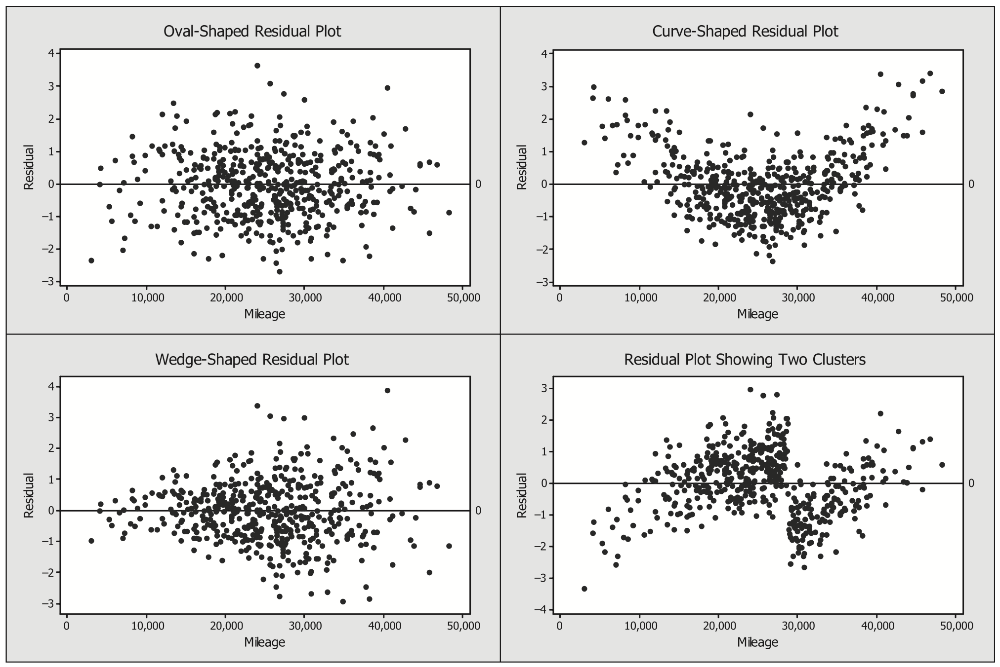
```

Suppose you held a cup full of coins and dropped them all at once. We hope to find residual plots that resemble the random pattern that would likely result from dropped coins (like the oval-shaped plot). The other three plots show patterns that would be very unlikely to occur by random chance. Any plot patterns that are not nice oval shapes suggest that the error terms are violating at least one model assumption, and thus it isl ikely that we have unreliable estimates of our model coefficients. The following section illustrates strategies for dealing with one of these unwanted shapes: a wedge-shaped pattern.

In single-variable regression models, residual plots show the same information as the initial fitted line plot. However, the residual plots often emphasize violations of model assumptions better than the fitted line plot. In addition, multivariate regression lines are very difficult to visualize. Thus, residual plots are essentialwhen multiple explanatory variables are used.

### \textcolor{blue}{Practice:} Heteroskedasticity {-}

**Heteroskedasticity** is a term used to describe the situation where the variance of the error term is not constant for all levels of the explanatory variables. For example, in the regression equation $\scriptstyle Price = 24,765 - 0.173 (Mileage)$, the spread of the suggested retail price values around the regression line should be about the same whether mileage is 0 or mileage is 50,000. If heteroskedasticity exists in the model, the most common remedy is to transform either the explanatory variable, the response variable, or both in the hope that the transformed relationship will exhibit **homoskedasticity** (equal variances around the regression line) in the error terms.

\begin{enumerate}
 \setcounter{enumi}{6}
 \item Using the regression equation calculated in Question 5, create plots of the residuals versus each explanatory variable in the model. Also create a plot of the residuals versus the predicted retail price (often called a **residual versus fit plot**).
 \begin{enumerate}
 \item Does the size of the residuals tend to change as mileage changes?
 \item Does the size of the residuals tend to change as the predicted retail price changes? You should see patterns indicating heteroskedasticity (nonconstant variance).
 \item Another pattern that may not be immediately obvious from these residual plots is the right skewness seen in the residual versus mileage plot. Often economic data, such as price, are right skewed. To see the pattern, look at just one vertical slice of this plot. With a pencil, draw a vertical line corresponding to mileage equal to 8000. Are the points in the residual plots balanced around the line $\scriptstyle Y = 0$?
 \item Describe any patterns seen in the other residual plots.
 \end{enumerate}
\item Transform the suggested retail price to log (Price) and $\scriptstyle \sqrt{Price}$. Transforming data using roots, logarithms, or reciprocals can often reduce heteroskedasticity and right skewness. (Transformations are discussed in Chapter 2. Create regression models and residual plots for these transformed response variables using the explanatory variables selected in Question 5.
\begin{enumerate}
 \item Which transformation did the best job of reducing the heteroskedasticity and skewness in the residual plots? Give the $\scriptstyle {R}^2$ values of both new models.
 \item Do the best residual plots correspond to the best $\scriptstyle {R}^2$ values? Explain.
While other transformations could be tried, throughout this investigation we will refer to the log-transformed response variable as TPrice.
\end{enumerate}
\end{enumerate}

Figure 3.3 shows residual plots that were created to answer Questions 7 and 8. Notice that when the response variable is Price, the residual versus fit plot has a clear wedge-shaped pattern. The residuals have much more spread when the fitted value is large (i.e., expected retail price is close to \$40,000) than when the fitted value is near \$10,000. Using TPrice as a response did improve the residual versus fit plot. Although
there is still a faint wedge shape, the variability of the residuals is much more consistent as the fitted value changes. Figure 3.3 reveals another pattern in the residuals. The following section will address why points in both plots appear in clusters.

```{r fig33, echo=FALSE, out.width="80%", fig.align="center", fig.cap=" Residual versus fit plots using Price and TPrice (the log10 transformation), as responses. The residual plot with Price as the response has a much stronger wedge-shaped pattern than the one with TPrice."}
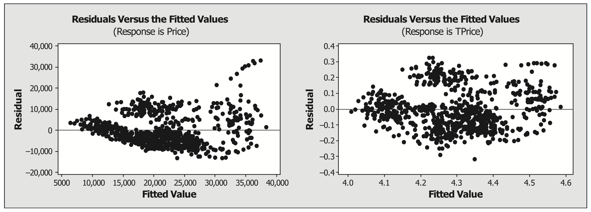
```

### \textcolor{blue}{Practice:} Examining Residual Plots Across Time/Order {-}

**Autocorrelation** exists when consecutive error terms are related. If autocorrelation exists, the assumption about the independence of the error terms is violated. To identify autocorrelation, we plot the residuals versus the order of the data entries. If the ordered plot shows a pattern, then we conclude that autocorrelation exists. When autocorrelation exists, the variable responsible for creating the pattern in the ordered residual plot should be included in the model.

Time (order in which the data were collected) is perhaps the most common source of autocorrelation, but other forms, such as spatial autocorrelations, can also be present. If time is indeed a variable that should be included in the model, a specific type of regression model, called a time series model, should be used.


9. Create a residual versus order plot from the TPrice versus Mileage regression line. Describe any pattern you see in the ordered residual plot. Apparently something in our data is affecting the residuals based on the order of the data. Clearly, time is not the influential factor in our data set (all of the data are from 2005). Can you suggest a variable in the Cars data set that may be causing this pattern?

10. Create a second residual versus order plot using TPrice as the response and using the explanatory variables selected in Question 5. Describe any patterns that you see in these plots.


While ordered plots make sense in model checking only when there is a meaningful order to the data, the residual versus order plots could demonstrate the need to include additional explanatory variables in the regression model. Figure 3.4 shows the two residual plots created in Questions 9 and 10. Both plots show that the data points are clearly clustered by order. However, there is less clustering when the six explanatory variables (Mileage, Cyl, Doors, Cruise, Sound, and Leather) are in the model. Also notice that the residuals tend to be closer to zero in the second graph. Thus, the second graph (with six explanatory variables) tends to have estimates that are closer to the actual observed values.

We do not have a time variable in this data set, so reordering the data would not change the meaning of the data. Reordering the data could eliminate the pattern; however, the clear pattern seen in the residual versus order plots should not be ignored because it indicates that we could create a model with a much higher $\scriptstyle {R}^2$ value if we could account for this pattern in our model. This type of autocorrelation is called **taxonomic autocorrelation**, meaning that the relationship seen in this residual plot is due to how the items in the data set are classified. Suggestions on how to address this issue are given in later sections.

```{r fig34, echo=FALSE, out.width="80%", fig.align="center", fig.cap=" Residual versus order plots using TPrice as the response. The first graph uses Mileage as the explanatory variable, and the second graph uses Mileage, Cyl, Doors, Cruise, Sound, and Leather as explanatory variables."}
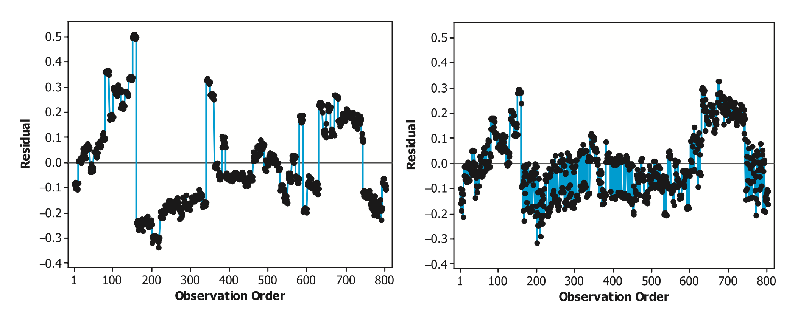
```

### \textcolor{blue}{Practice:} Outliers and Influential Observations {-}

\begin{enumerate}
 \setcounter{enumi}{10}
 \item Calculate a regression equation using the explanatory variables suggested in Question 5 and Price as the response. Identify any residuals (or cluster of residuals) that don’t seem to fit the overall pattern in the residual versus fit and residual versus mileage plots. Any data values that don’t seem to fit the general pattern of the data set are called outliers.
  \begin{enumerate}
    \item  Identify the specific rows of data that represent these points. Are there any consistencies that you can find?
    \item Is this cluster of outliers helpful in identifying the patterns that were found in the ordered residual plots? Why or why not?
    \end{enumerate}
\item  Run the analysis with and without the largest cluster of potential outliers (the cluster of outliers corresponds to the Cadillac convertibles). Use Price as the response. Does the cluster of outliers influence the coefficients in the regression line? 
\end{enumerate}

If the coefficients change dramatically between the regression models, these points are considered **influential**. If any observations are influential, great care should be taken to verify their accuracy. 

In addition to reducing heterskedasticity, transformations can often reduce the effect of outliers. Figure 3.5 shows the residual versus fit plots using Price and TPrice, respectively. The cluster of outliers corresponding to the Cadillac convertibles is much more visible in the plot with the untransformed (Price) response variable. Even though there is still clustering in the transformed data, the residuals corresponding to the Cadillac convertibles are no longer unusually large.

```{r fig35, echo=FALSE, out.width="80%", fig.align="center", fig.cap=" Residual versus fit plots using Price and TPrice as the response. The circled observations in the plot using Price are no longer clear outliers in the plot using TPrice."}
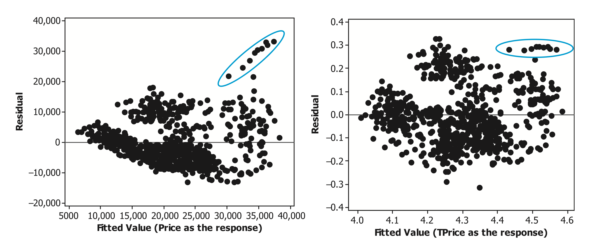
```


In some situations, clearly understanding outliers can be more time consuming (and possibly more interesting) than working with the rest of the data. It can be quite difficult to determine if an outlier was accurately recorded or whether the outliers should be included in the analysis.

If the outliers were accurately recorded and transformations are not useful in eliminating them, it can be difficult to know what to do with them. The simplest approach is to run the analysis twice: once with the outliers included and once without. If the results are similar, then it doesn’t matter if the outliers are included or not. If the results do change, it is much more difficult to know what to do. Outliers should never automatically be removed because they don’t fit the overall pattern of the data. Most statisticians tend to err on the side of keeping the outliers in the sample data set unless there is clear evidence that they were mistakenly recorded. Whatever final model is selected, it is important to clearly state if you are aware that your results are sensitive to outliers.


### \textcolor{blue}{Practice:} Normally Distributed Residuals {-}

Even though the calculations of the regression model and $\scriptstyle {R}^2$ do not depend on the normality assumption, identifying patterns in residual plots can often lead to another model that better explains the response variable.

To determine if the residuals are normally distributed, two graphs are often created: a histogram of the residuals and a normal probability plot. Normal probability plots are created by sorting the data (the residuals in this case) from smallest to largest. Then the sorted residuals are plotted against a theoretical normal distribution. If the plot forms a straight line, the actual data and the theoretical data have the same shape (i.e., the same distribution). (Normal probability plots are discussed in more detail in
Chapter 2.)

\begin{enumerate}
 \setcounter{enumi}{12}
 \item Create a regression line to predict TPrice from Mileage. Create a histogram and a normal probability plot of the residuals.
\begin{enumerate}
  \item Do the residuals appear to follow the normal distribution?
  \item  Are the ten outliers visible on the normal probability plot and the histogram?
\end{enumerate}
\end{enumerate}


Figure 3.6 shows the normal probability plot using six explanatory variables to estimate TPrice. While the outliers are not visible, both plots still show evidence of lack of normality. Simply plugging data into a software package and using an iterative variable selection technique will not reliably create a “best” model.

```{r fig36, echo=FALSE, out.width="80%", fig.align="center", fig.cap=" Normal probability plot and histogram of residuals from the model using TPrice as the response and Mileage, Cyl, Doors, Cruise, Sound, and Leather as the explanatory variables."}
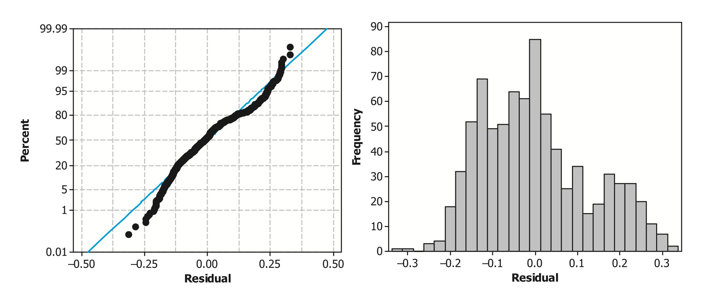
```

\textbf{\textcolor{blue}{Key Concept:}}
\textcolor{blue}{Before a final model is selected, the residuals should be plotted against fitted (estimated) values, observation order, the theoretical normal distribution, and each explanatory variable in the model. Table 3.1 shows how each residual plot is used to check model assumptions. If a pattern exists in any of the residual plots, the $\scriptstyle {R}^2$ value is likely to improve if different explanatory variables or transformations are included in the model.}


```{r tab31, echo=FALSE, results='asis'}
df3.1 <- data.frame(
  Assumption = c(
    "Normality",
    "Zero mean",
    "Equal variances",
    "Independence",
    "Identically distributed"
  ),
  Plot = c(
    "Histogram or normal probability plot",
    "No plot (errors will always sum to zero under these models)",
    "Plot of original data or residual vs. fits",
    "Residuals vs. order",
    "No plot (ensure each subject was sampled from the same population within each group)"
  ),
  check.names = FALSE
)

cat(
  kable(
    df3.1,
    format = "latex",
    booktabs = TRUE,
    escape = FALSE,
    col.names = c("Assumption", "Plot"),
    caption = "Plots that can be used to evaluate model assumptions about the residuals.",
    align = c("l", "l")
  ) %>%
    kable_styling(latex_options = "hold_position")
)
```


### \textcolor{blue}{Practice:} Correlation Between Explanatory Variables {-}

**Multicollinearity** exists when two or more explanatory variables in a multiple regression model are highly correlated with each other. If two explanatory variables $\scriptstyle X_1$ and $\scriptstyle X_2$ are highly correlated, it can be very difficult to identify whether $\scriptstyle X_1$, $\scriptstyle X_2$, or both variables are actually responsible for influencing the response variable, $\scriptstyle Y$.

\begin{enumerate}
 \setcounter{enumi}{13}
 \item Create three regression models using Price as the response variable. In all three cases, provide the regression model, $\scriptstyle {R}^2$ value, t-statistic for the slope coefficients, and corresponding $\scriptstyle p$-values.

\begin{enumerate}
  \item In the first model, use only Mileage and Liter as the explanatory variables. Is Liter an important explanatory variable in this model?
 \item  In the second model, use only Mileage and number of cylinders (Cyl) as the explanatory variables. Is Cyl an important explanatory variable in this model?
 \item In the third model, use Mileage, Liter, and number of cylinders (Cyl) as the explanatory variables. How did the test statistics and $\scriptstyle p$-values change when all three explanatory variables were included in the model?
\end{enumerate}
\item  Note that the $\scriptstyle {R}^2$ values are essentially the same in all three models in Question 14. The coefficients for Mileage also stay roughly the same for all three models—the inclusion of Liter or Cyl in the model does not appear to influence the Mileage coefficient. Depending on which model is used, we state that for each additional mile on the car, Price is reduced somewhere between \$0.152 to \$0.16. Describe how the coefficient for Liter depends on whether Cyl is in the model.

\item  Plot Cyl versus Liter and calculate the correlation between these two variables. Is there a strong correlation between these two variables? Explain.
\end{enumerate}

Recall that Question 4 suggested deleting Liter from the model. The goal in stepwise regression is to find the “best” model based on the $\scriptstyle {R}^2$ value. If two explanatory variables both impact the response in the same way, stepwise regression will rather arbitrarily pick one variable and ignore the other.

\textbf{\textcolor{blue}{Key Concept:}}
\textcolor{blue}{Stepwise regression can often completely miss important explanatory variables when there is multicollinearity.}

Most software packages can create a matrix plot of the correlations and corresponding scatterplots of all explanatory variables. This matrix plot is helpful in identifying any patterns of interdependence among the explanatory variables. An easy-to-apply guideline for determining if multicollinearity needs to be dealt with is to use the **variance inflation factor (VIF)**. 

VIF conducts a regression of each explanatory variable ($\scriptstyle X_i$) on the remaining explanatory variables, calculates the corresponding $\scriptstyle {R}^2$ value ($\scriptstyle {R_i}^2$), and then calculates the following function for each variable Xi : $\scriptstyle 1/(1 - {R_i}^2)$. If the $\scriptstyle {R_i}^2$ value is zero, VIF is one, and Xi is uncorrelated with all other explanatory variables. Montgomery, Peck, and Vining state, “Practical experience indicates that if any of the VIFs exceed 5 or 10, it is an indication that the associated regression coefficients are poorly estimated because of multicollinearity.”^[Details of these methods are described in D.C. Montgomery, E. A. Peck, and G. G. Vining, Introduction to Linear Regression Analysis, 3rd ed. (New York: Wiley, 2001).]

Figure 3.7 shows that Liter and Cyl are highly correlated. Within the context of this problem, it doesn’t make physical sense to consider holding one variable constant while the other variable increases. In general, it may not be possible to “fix” a multicollinearity problem. If the goal is simply to describe or predict retail prices, multicollinearity is not a critical issue. Redundant variables should be eliminated from the model, but highly correlated variables that both contribute to the model are acceptable if you are not interpreting the coefficients. However, if your goal is to confirm whether an explanatory variable is associated with a response (test a theory), then it is essential to identify the presence of multicollinearity and to recognize that the coefficients are unreliable when it exists.

\textbf{\textcolor{blue}{Key Concept:}}
\textcolor{blue}{If your goal is to create a model to describe or predict, then multicollinearity really is not a problem. Note that multicollinearity has very little impact on the $\scriptstyle {R}^2$ value. However, if your goal is to understand how a specific explanatory variable influences the response, as is often done when confirming a theory, then multicollinearity can cause coefficients (and their corresponding $\scriptstyle p$-values when testing their significance) to be unreliable.}


```{r fig37, echo=FALSE, out.width="50%", fig.align="center", fig.cap=" Scatterplot showing a clear association between Liter and Cyl."}
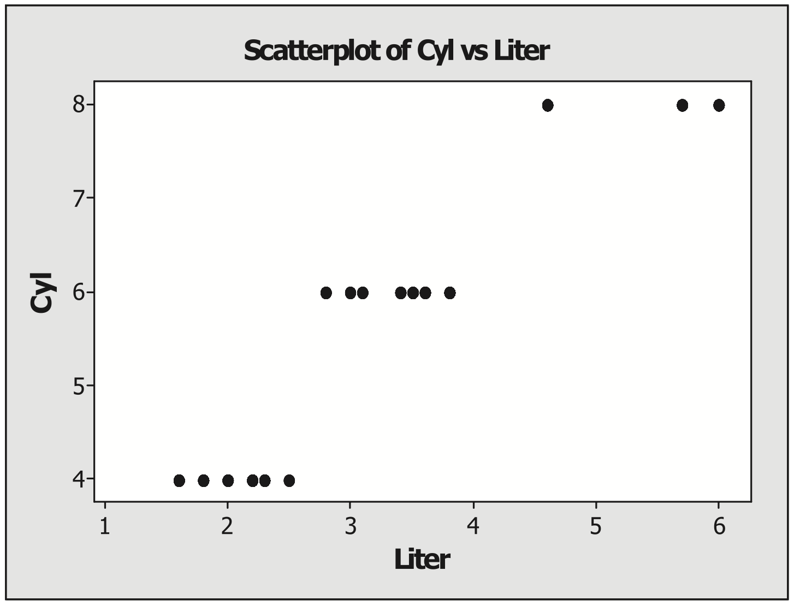
```


The following approaches are commonly used to address multicollinearity:

- **Get more information**: If it is possible, expanding the data collection may lead to samples where the variables are not so correlated. Consider whether a greater range of data could be collected or whether data could be measured differently so that the variables are not correlated. For example, the data here are only for GM cars. Perhaps the relationship between engine size in liters and number of cylinders is not so strong for data from a wider variety of manufacturers.

- **Re-evaluate the model**: When two explanatory variables are highly correlated, deleting one variable will not significantly impact the $\scriptstyle {R}^2$ value. However, if there are theoretical reasons to include both variables in the model, keep both terms. In our example, Liter and number of cylinders (Cyl) are measuring essentially the same quantity. Liter represents the volume displaced during one complete engine cycle; number of cylinders (Cyl) also is a measure of the volume that can be displaced.

- **Combine the variables**: Using other statistical techniques such as principal components, it is possible to combine the correlated variables “optimally” into a single variable that can be used in the model. There may be theoretical reasons to combine variables in a certain way. For example, the volume (size) and weight of a car are likely highly positively correlated. Perhaps a new variable defined as density = weight/volume could be used in a model predicting price rather than either of these individual variables.

In this investigation, we are simply attempting to develop a model that can be used to estimate price, so multicollinearity will not have much impact on our results. If we did re-evaluate the model in light of the fact that Liter and number of cylinders (Cyl) both measure displacement (engine size), we might note that Liter is a more specific variable, taking on several values, while Cyl has only three values in the data set. Thus, we might choose to keep Liter and remove Cyl in the model.

## \textcolor{blue}{Interpreting Model Coefficients}

While multiple regression is very useful in understanding the impacts of various explanatory variables on a response, there are important limitations. When predictors in the model are highly correlated, the size and meaning of the coefficients can be difficult to interpret. In Question 14, the following three models were developed:

 \begin{align*}
 Price &= 9427 - 0.160(Mileage) + 4968(Liter)\\
 Price &= 3146 - 0.152(Mileage) + 4028(Cyl)\\
 Price &= 4708 - 0.154(Mileage) + 1545(Liter) + 2848(Cyl)\\
 \end{align*}


The interpretation of model coefficients is more complex in multiple linear regression than in simple linear regression. It can be misleading to try to interpret a coefficient without considering other terms in the model. For example, when Mileage and Liter are the two predictors in a regression model, the Liter coefficient might seem to indicate that an increase of one in Liter will increase the expected price by \$4968. However, when Cyl is also included in the model, the Liter coefficient seems to indicate that an increase of one in Liter will increase the expected price by \$1545. The size of a regression coefficient and even the direction can change depending on which other terms are in the model.

In this investigation, we have shown that Liter and Cyl are highly correlated. Thus, it is unreasonable to believe that Liter would change by one unit but Cyl would stay constant. The multiple linear regression coefficients cannot be considered in isolation. Instead, the Liter coefficient shows how the expected price will change when Liter increases by one unit, after accounting for corresponding changes in all the other
explanatory variables in the model.


\textbf{\textcolor{blue}{Key Concept:}}
\textcolor{blue}{In multiple linear regression, the coefficients tell us how much the expected response will change when the explanatory variable increases by one unit, after accounting for corresponding changes in all other terms in the model.}

## \textcolor{blue}{Categorical Explanatory Variables}

As we saw in Question 9, there is a clear pattern in the residual versus order plot for the Kelley Blue Book car pricing data. It is likely that one of the categorical variables (Make, Model, Trim, or Type) could explain this pattern.

If any of these categorical variables are related to the response variable, then we want to add these variables to our regression model. A common procedure used to incorporate categorical explanatory variables into a regression model is to define indicator variables, also called dummy variables. Creating indicator variables is a process of mapping one column (variable) of categorical data into several columns (indicator variables) of 0 and 1 data.

Let’s take the variable Make as an example. The six possible values (Buick, Cadillac, Chevrolet, Pontiac, SAAB, Saturn) can be recoded using six indicator variables, one for each of the six makes of car. For example, the indicator variable for Buick will have the value 1 for every car that is a Buick and 0 for each car that is not a Buick. Most statistical software packages have a command for creating the indicator variables automatically.

### Creating Indicator Variables {-}

17. Create boxplots or individual value plots of the response variable TPrice versus the categorical variables Make, Model, Trim, and Type. Describe any patterns you see.

18. Create indicator variables for Make. Name the columns, in order, Buick, Cadillac, Chevrolet, Pontiac, SAAB, and Saturn. Look at the new data columns and describe how the indicator variables are defined. For example, list all possible outcomes for the Cadillac indicator variable and explain what each outcome
represents. 

Any of the indicator variables in Question 18 can be incorporated into a regression model. However, if you want to include Make in its entirety in the model, do not include all six indicator variables. Five will suffice because there is complete redundancy in the sixth indicator variable. If the first five indicator variables are all 0 for a particular car, we automatically know that this car belongs to the sixth category. Below, we will leave the Buick indicator variable out of our model. The coefficient for an indicator variable is an estimate of the average amount by which the response variable will change. For example, the estimated coefficient for the Saturn variable is an estimate of the average difference in TPrice when the car is a Saturn rather than a Buick (after adjusting for corresponding changes in all other terms in the model).

>**Mathematical Note:**
For any categorical explanatory variable with $\scriptstyle g$ groups, only $\scriptstyle g - 1$ terms should be included in the regression model. Most software packages use matrix algebra to develop multiple regression models. If all $\scriptstyle g$ terms are in the model, explanatory variables will be 100% correlated (you can exactly predict the value of one variable if you know the other variables) and the needed matrix inversion cannot be done. If the researcher chooses to leave all $\scriptstyle g$ terms in the model, most software packages will arbitrarily remove one term so that the needed matrix calculations can be completed.

It may be tempting to simplify the model by including only a few of the most significant indicator variables. For example, instead of including five indicator variables for Make, you might consider only using Cadillac and SAAB. Most statisticians would recommend against this. By limiting the model to only indicator variables that are significant in the sample data set, we can overfit the model. 

Models are **overfit** when researchers overwork a data set in order to increase the $\scriptstyle {R}^2$ value. For example, a researcher could spend a significant amount of time picking a few indicator variables from Make, Model, Trim, and Type in order to find the best $\scriptstyle {R}^2$ value. While the model would likely estimate the mean response well, it unlikely to accurately predict new values of the response variable.

This is a fairly nuanced point. The purpose of variable selection techniques is to select the variables that best explain the response variable. However, overfitting may occur if we break up categorical variables into smaller units and then pick and choose among the best parts of those variables. The Model Validation section
discusses this topic in more detail. 

### \textcolor{blue}{Practice:} Building Regression Models with Indicator Variables {-}

19. Build a new regression model using TPrice as the response and Mileage, Liter, Saturn, Cadillac, Chevrolet, Pontiac, and SAAB as the explanatory variables. Explain why you expect the $\scriptstyle {R}^2$ value to increase when you add terms for Make.

20. Create indicator variables for Type. Include the Make and Type indicator variables, plus the variables Liter, Doors, Cruise, Sound, Leather, and Mileage, in a model to predict TPrice. Remember to leave at least one category out of the model for the Make and Type indicator variables (e.g., leave Buick and Hatchback out of the model). Compare this regression model to the other models that you have fit to the data in this investigation. Does the normal probability plot suggest that the residuals could follow a normal distribution? Describe whether the residual versus fit, the residual versus order, and the residual versus each explanatory variable plots look more random than they did in earlier problems.

The additional categorical variables are important in improving the regression model. Figure 3.8 shows that when Make and Type are not in the model, the residuals are clustered. When Make and Type are included in the model, the residuals appear to be more randomly distributed. By incorporating Make and Type, we have been able to explain some of variability that was causing the clustering. In addition, the sizes of the residuals are much smaller. Smaller residuals indicate a better fitting model and a higher $\scriptstyle {R}^2$ value.

Even though Make and Type improved the residual plots, there is still clustering that might be improved by incorporating Model into the regression equation. However, if the goal is simply to develop a model that accurately estimates retail prices, the $\scriptstyle {R}^2$ value in Question 20 is already fairly high. Are there a few more terms that can be added to the model that would dramatically improve the $\scriptstyle {R}^2$ value?

To determine a final model, you should attempt to maximize the $\scriptstyle {R}^2$ value while simultaneously keeping the model relatively simple. For your final model, you should comment on the residual versus fit, residual versus order, and any other residual plots that previously showed patterns. If any pattern exists in the residual plots, it may be worth attempting a new regression model that will account for these patterns. If the regression model can be modified to address the patterns in the residuals, the $\scriptstyle {R}^2$ value will improve. However, note that the $\scriptstyle {R}^2$ value is already fairly high. It may not be worth making the model more complex for only a slight increase in the $\scriptstyle {R}^2$ value.

21. Create a regression model that is simple (i.e., does not have too many terms) and still accurately predicts retail price. Validate the model assumptions. Look at residual plots and check for heteroskedasticity, multicollinearity, autocorrelation, and outliers. Your final model should not have significant clusters, skewness, outliers, or heteroskedasticity appearing in the residual plots. Submit your suggested least squares regression formula along with a limited number of appropriate graphs that provide justification for your model. Describe why you believe this model is “best.”

```{r fig38, echo=FALSE, out.width="85%", fig.align="center", fig.cap=" Residual versus order plots show that incorporating the indicator variables into the regression model improves the random behavior and reduces the sizes of the residuals."}
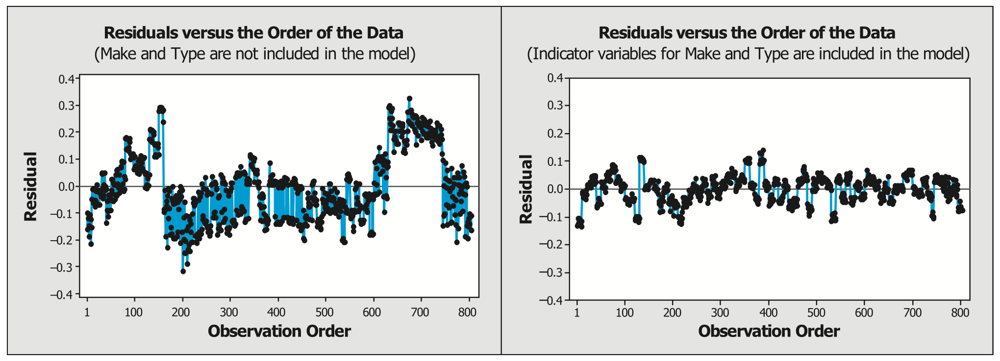
```

## \textcolor{blue}{What Can We Conclude from the 2005 GM Car Study?}

The data are from an observational study, not an experiment. Therefore, even though the $\scriptstyle {R}^2$ value reveals a strong relationship between our explanatory variables and the response, a significant correlation (and thus a significant coefficient) does not imply a causal link between the explanatory variable and the response. There may be theoretical or practical reasons to believe that mileage (or any of the other
explanatory variables) causes lower prices, but the final model can be used only to show that there is an association.

Best subsets and residual graphs were used to develop a model that is useful for describing or predicting the retail price based on a function of the explanatory variables. However, since iterative techniques were used, the $\scriptstyle p$-values corresponding to the significance of each individual coefficient are not reliable.

For this data set, cars were randomly selected within each make, model, and type of 2005 GM car produced, and then suggested retail prices were determined from Kelley Blue Book. While this is not a simple random sample of all 2005 GM cars actually on the road, there is still reason to believe that your final model will provide an accurate description or prediction of retail price for used 2005 GM cars. Of course, as time goes by, the value of these cars will be reduced and updated models will need to be developed.

## \textcolor{blue}{Decomposition of Sum of Squares}

In this section we show that the total variability in the response (`SST`) = $\scriptstyle \sum_{i=1}^n (y_i - \bar{y})^2$ is the sum of `SSR` and `SSE` as shown in equation 3.7.


```{r tab32, results='asis', echo=FALSE}
tbl <- matrix("", nrow = 4, ncol = 7)
tbl[1, 1] <- "Total"
tbl[1, 3] <- "Residual"
tbl[1, 5] <- "Regression"
tbl[2, 1] <- "(SST)"
tbl[2, 3] <- "(SSE)"
tbl[2, 5] <- "(SSR)"
tbl[3, 1] <- "\u2193"
tbl[3, 3] <- "\u2193"
tbl[3, 5] <- "\u2193"
tbl[4, 1] <- "$\\sum_{i=1}^n (y_i - \\bar{y})^2$"
tbl[4, 2] <- "="
tbl[4, 3] <- "$\\sum_{i=1}^n (y_i - \\hat{y}_i)^2$"
tbl[4, 4] <- "$+$"
tbl[4, 5] <- "$\\sum_{i=1}^n (\\hat{y}_i - \\bar{y})^2$"
tbl[4, 7] <- "(3.7)"

kable(tbl, align = "c", escape = FALSE, booktabs = TRUE) %>%
  kable_styling(full_width = FALSE) %>%
  row_spec(0, extra_css = "border-bottom: none;") %>%
  column_spec(1:7, extra_css = "border: none;") %>%
  kable_styling(latex_options = "HOLD_position")

```


Many of the calculations involved in multiple regression are very closely related to those for the simple linear regression model. Simple linear regression models have the advantage of being easily visualized with scatterplots. Thus, we start with a simple linear regression model to derive several key equations used in multiple regression.

Figure 3.9 shows a scatterplot and regression line for a subset of the used 2005 Kelly Blue Book Cars data. The data set is restricted to just Chevrolet Cavalier Sedans. In this scatterplot, one specific observation is highlighted: the point where `Mileage` is 11,488 and the observed `Price` is $\scriptstyle y_i = 14{,}678.1$.

\newpage

```{r fig39, echo=FALSE, out.width="90%", fig.align="center", fig.cap="Scatterplot and regression line for Chevrolet Cavalier Sedans: Price = 15,244 - 0.111(Mileage)."}
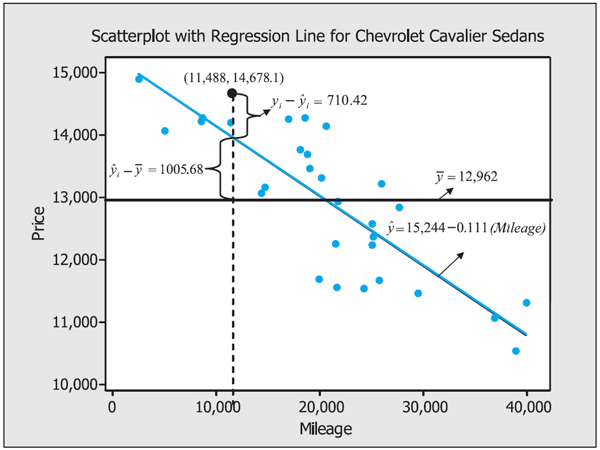
```


In Figure 3.9, we see that for any individual observation the total deviation $\scriptstyle (y_i - \bar{y})$ is decomposed into two parts:

\begin{equation}
\label{3.8}
y_i - \bar{y} = (y_i - \hat{y}_i) + (\hat{y}_i - \bar{y})
\tag{3.8}
\end{equation}

Using our highlighted observation (11,488, 14,678.1), we see that

\begin{align*}
y_i - \bar{y} &= (y_i - \hat{y}_i) + (\hat{y}_i - \bar{y}) \\
14{,}678.1 - 12{,}962 &= (14{,}678.1 - 13{,}967.68) + (13{,}967.68 - 12{,}962) \\
1716.1 &= 710.42 + 1005.68
\end{align*}

Squaring both sides of Equation \ref{3.8} and then summing over all observations results in

\begin{equation}
\begin{split}
\sum_{i=1}^n (y_i - \bar{y})^2 
  & = \sum_{i=1}^n (y_i - \hat{y}_i)^2 + \sum_{i=1}^n (\hat{y}_i - \bar{y})^2
  + 2 \sum_{i=1}^n (y_i -\hat{y})(\hat{y}_i - \bar{y}) \\ 
  & = \sum_{i=1}^n (y_i - \hat{y}_i)^2 + \sum_{i=1}^n (\hat{y}_i - \bar{y})^2  
\end{split}
\tag{3.9}
\end{equation}


To show that Equation 3.9 is true, we can write

\begin{equation}
2 \sum_{i=1}^n (y_i - \hat{y}_i)(\hat{y}_i - \bar{y})
  = 2 \sum_{i=1}^n \hat{y}_i (y_i - \hat{y}_i)  - 2 \bar{y} \sum_{i=1}^n (y_i - \hat{y}_i)
\notag  
\end{equation}


>**MATHEMATICAL NOTE:** Recall that the sum of residuals, $\scriptstyle \sum_{i=1}^n (y_i - \hat{y}_i)$, equals zero. In addition, it can be shown that the sum of the residuals, weighted by the corresponding predicted value, always sums to zero: $\scriptstyle \sum_{i=1}^n \hat{y}_i (y_i - \hat{y}_i) = 0.$ (See Questions 25 through 29.)

### \textcolor{blue}{Practice:} A Closer Look at Least Squares Regression Equations {-}
\vspace{-1em}
Data set: `Cavalier`   

Note that calculus is required for Activity Questions 25 through 29.  

22. Create a regression model to predict Price from Mileage for the Cavalier data. Calculate the total sum of squares (SST), residual sum of squares (SSE), and regression sum of squares (SSR). Verify that SST = SSE + SSR.  

23. Show that $\scriptstyle \sum_{i=1}^n (y_i - \hat{y}_i)(\hat{y}_i - \bar{y}) = 0$ for the model given in the previous question.  

24. Using your final model in Question 21, calculate the total sum of squares (SST), residual sum of squares (SSE), and regression sum of squares (SSR). Verify that SST = SSE + SSR.

25. Set the partial derivative of the residual sum of squares with respect to $\scriptstyle b_0$ to zero, to show that $\scriptstyle b_0 n + b_1 \sum_{i=1}^n x_i = \sum_{i=1}^n y_i.$

26. Set the partial derivative of the residual sum of squares with respect to $\scriptstyle b_1$ to zero, to show that $\scriptstyle b_0 \sum_{i=1}^n x_i + b_1 \sum_{i=1}^n x_i^2 = \sum_{i=1}^n x_i y_i.$

27. The equations in Questions 25 and 26 are called the normal equations for simple linear regression. Use the normal equations to derive the least squares regression coefficients, $\scriptstyle b_0$ and $\scriptstyle b_1$.  

28. Use the fact that $\scriptstyle \sum_{i=1}^n (y_i - \hat{y}_i) = 0$ and $\scriptstyle \hat{y}_i = b_0 + b_1 x_i$ to show that

\begin{equation}
\sum_{i=1}^n \hat{y}_i (y_i - \hat{y}_i)
  = b_1 \Bigl(\sum_{i=1}^n x_i y_i - b_0 \sum_{i=1}^n x_i - b_1 \sum_{i=1}^n x_i^2\Bigr).
  \notag
\end{equation}

29. Use Questions 26 and 28 to show that $\scriptstyle \sum_{i=1}^n \hat{y}_i (y_i - \hat{y}_i) = 0.$

## \textcolor{blue}{F-Tests for Multiple Regression}

### The Analysis of Variance Table for Regression Models{-}

The objective of regression is to create a model that best fits the observed points. Least squares regression models define a “best fit” as a model that minimizes the sum of squared residual values, $\scriptstyle \sum_{i=1}^n (y_i - \hat{y}_i)^2$.

The coefficient of determination, $\scriptstyle {R}^2$, is the percentage of variation in the response variable that is explained by the regression line:

\begin{equation} 
 R^2 = \frac{\sum_{i=1}^n (\hat{y}_i - \bar{y})^2}{\sum_{i=1}^n (y_i - \bar{y})^2} 
     = 1 - \frac{\sum_{i=1}^n (y_i - \hat{y}_i)^2}{\sum_{i=1}^n (y_i - \bar{y})^2} 
 \tag{3.10} 
 \end{equation} 

\textbf{\textcolor{blue}{Key Concept:}}
\textcolor{blue}{The coefficient of determination, $\scriptstyle {R}^2$, is a measure of the usefulness of the explanatory variables in the model. If the explanatory variables are useful in predicting the response, the residual sum of squares, $\scriptstyle \sum_{i=1}^n (y_i - \hat{y}_i)^2$, is small compared to the total spread of the responses, $\scriptstyle \sum_{i=1}^n (y_i - \bar{y})^2$. In other words, the amount of variability explained by the regression model, $\scriptstyle \sum_{i=1}^n (\hat{y}_i - \bar{y})^2$, is a large proportion of the total variability of the responses.}

The sum of squares calculations are often summarized in an analysis of variance (ANOVA) table, as shown in Table 3.2.


```{r anovatable, echo=FALSE}
library(knitr)
library(kableExtra)

anova_tab <- data.frame(
  Source = c("Regression", "Error", "Total"),
  df = c("$\\quad p - 1$", "$\\quad n - p$", "$\\quad n - 1$"),
  SS = c(
    "$\\displaystyle SSR = \\sum_{i=1}^n (\\hat{y}_i - \\bar{y})^2$",
    "$\\displaystyle SSE = \\sum_{i=1}^n (y_i - \\hat{y}_i)^2$",
    "$\\displaystyle SST = \\sum_{i=1}^n (y_i - \\bar{y})^2$"
  ),
  MS = c(
    "$MS_{Regr} = \\tfrac{SSR}{df_{Regr}}$",
    "$MSE = \\tfrac{SSE}{df_{Error}} = \\hat{\\sigma}^2$",
    ""
  ),
  `F-Statistic` = c(
    "$F = MS_{Regr}/MSE$",
    "",
    ""
  ),
  stringsAsFactors = FALSE
)

kable(
  anova_tab,
  caption = " ANOVA table for a least squares regression model, where n is the number of observations and p is the number of terms in the model (including the constant term).",
  align   = "lcccc",
  escape  = FALSE)

```


### Testing the Significance of a Regression Model {-}

Once a model has been developed, we are often interested in testing if there is a relationship between the response and the set of all explanatory terms in the model. To conduct an overall test of model adequacy, we test the following null and alternative hypotheses:

\begin{equation}
H_0: \beta_1 = \beta_2 = \dots = \beta_{p-1} = 0 
\notag
\end{equation}
\begin{equation}
H_a: \text{at least one of the coefficients is not }0 
\notag
\end{equation}

Notice that the $\scriptstyle \beta_0$ term in our regression model is not included in the null or the alternative hypothesis. Table 3.2 provides the details for the calculation of the F-statistic:
\begin{equation}
F = \frac{MS_{Regr}}{MSE}
  = \frac{SSR/(p - 1)}{SSE/(n - p)}
\tag{3.11}
\end{equation}

This statistic follows an $\scriptstyle F_{p-1,\,n-p}$ distribution, where $\scriptstyle n$ is the number of observations and $\scriptstyle p$ is the number of terms in the model (including $\scriptstyle \beta_0$). The same assumptions about the error terms, $\scriptstyle \epsilon_i \overset{\mathrm{iid}}{\sim}N(0,\sigma^2)$, need to be checked before conducting the hypothesis test.

>**NOTE:** There are no model assumptions needed about the error terms to calculate estimates of the coefficients. However, all the model assumptions should be checked before conducting a hypothesis test.

### The Extra Sum of Squares $\scriptstyle F$-Test {-}

We are often interested in testing the contribution of a particular variable (or subset of variables) to the regression sum of squares. The **extra sum of squares $\scriptstyle F$-test** can test the contribution of a specific set of variables by comparing the residuals of a full and a reduced model.

Suppose a model has been fit with $\scriptstyle k$ terms—we call this a **full model**. We may hypothesize that only $\scriptstyle p \ <\  k$ terms really contribute to the regression model—we call this smaller model the **reduced model**. In this situation, we want to test whether
\begin{equation}
H_0: \beta_p = \beta_{p+1} = \dots = \beta_{k-1} = 0 
\notag
\end{equation}
\begin{equation}
H_a: \text{at least one of the coefficients is not }0 
\notag
\end{equation}

The previous ANOVA $\scriptstyle F$-test can be modified to provide an $\scriptstyle F$-test for this hypothesis. Notice that this hypothesis test makes no assumptions about the other terms, $\scriptstyle \beta_0,\  \beta_1,\  \dots, \ \beta_{p-1}$, in the model. In addition, *every term in the reduced model must also be in the full model*.

\begin{equation}
 F = \frac{(SSR_{\text{full}} - SSR_{\text{reduced}})/(k - p)}{MSE_{\text{full}}}
 \tag{3.12}
\end{equation}

This statistic follows an F-distribution with $\scriptstyle k-p$ and $\scriptstyle n-k$ degrees of freedom. The extra sum of squares $\scriptstyle F$-test determines whether the difference between the sum of squared residuals in the full and reduced models is so large that it is unlikely to occur by chance.

### \textcolor{blue}{Practice:} Testing Multiple Coefficients {-} 
Data set: `Cavalier`


Consider the Cavalier data set and the regression model $\scriptstyle y = \beta_0 + \beta_1(Mileage) + \beta_2(Cruise) + \epsilon$   


30. Submit the ANOVA table, $\scriptstyle F$-statistic, and $\scriptstyle p$-value to test the hypothesis $\scriptstyle H_0:\  \beta_1 \ =\  \beta_2 \ =\  0$ versus $\scriptstyle H_a$: at least one of the coefficients is not 0.   

31. Conduct an extra sum of squares test to determine if $\scriptstyle Trim$ is useful. More specifically, use the reduced model in the previous question and the full model to test the hypothesis $\scriptstyle H_0: \beta_3 = \beta_4 = 0$ versus $\scriptstyle H_a$: at least one of the coefficients is not 0.
\begin{equation}
y = \beta_0 + \beta_1(\text{Mileage}) + \beta_2(\text{Cruise}) + \beta_3(\text{LS Sport Sedan 4D}) + \beta_4(\text{Sedan 4D}) + \epsilon \notag
\end{equation}


## \textcolor{blue}{Developing a Model to Confirm a Theory}

If the goal is to confirm a theoretical relationship, statisticians tend to go through the following steps to identify an appropriate theoretical model.

 - Verify that the response variable provides the information needed to address the question of interest. What are the range and variability of responses you expect to observe? Is the response measurement precise enough to address the question of interest?
 
- Investigate all explanatory variables that may be of importance or could potentially influence your results. Note that some terms in the model will be included even though the coefficients may not be significant. In most studies, there is often prior information or a theoretical explanation for the relationship between explanatory and response variables. Nonstatistical information is often essential in developing good statistical models.  

- For each of the explanatory variables that you plan to include in the model, describe whether you would expect a positive or negative correlation between that variable and the response variable.  

- Use any background information available to identify what other factors are assumed to be controlled within the model. Could measurements, materials, and the process of data collection create unwanted variability? Identify any explanatory variables that may influence the response; then determine if information on these variables can be collected and if the variables can be controlled throughout the study. For example, in the Kelley Blue Book data set, the condition of the car was assumed to be the same for all cars. The data were collected for GM cars with model year 2005. Since these cars were relatively new at the time of the study and the cars were considered to be in excellent condition, any model we create for these data would not be relevant for cars that had been in any type of accident. 

- What conditions would be considered normal for this type of study? Are these conditions controllable? If a condition changed during the study, how might it impact the results?

After a theoretical model is developed, regression analysis is conducted one time to determine if the data support the theories.

\textbf{\textcolor{blue}{Key Concept:}}
\textcolor{blue}{The same data should not be looked at both to develop a model and to test it.}

### \textcolor{blue}{Practice:} Testing a Theory on Cars {-}
\vspace{-1em}
Data set: `Cars`  

Assume that you have been asked to determine if there is an association between each of the explanatory variables and the response variable in the Cars data set.  

32. Use any background information you may have (not the `Cars` data set) to predict how each explanatory variable (except Model and Trim) will influence TPrice. For example, will Liter or Mileage have a positive or negative association with TPrice? List each Make and identify which will impact TPrice most and in which direction. 

33. Identify which factors are controlled in this data set. Can you suggest any factors outside the provided data set that should have been included? If coefficients are found to be significant (have small $\scriptstyle p$-values), will these relationships hold for all areas in the United States? Will the relationships hold for 2004 or 2001 cars?

34. Run a regression analysis to test your hypothesized model. Which variables are important in your model? Did you accurately estimate the direction of each relationship? Even if a variable is not significant, it is typically kept in the model if there is a theoretical justification
for it.

## \textcolor{blue}{Interaction and Terms for Curvature}

In addition to using the variables provided in a data set, it is often beneficial to create new variables that are functions of the existing explanatory variables. These new explanatory variables are often quadratic ($\scriptstyle X^2$), cubic ($\scriptstyle X^3$), or a product of two explanatory variables ($\scriptstyle X_1*X_2$), called **interaction terms**.

### Interaction Terms {-}

An **interaction** is present if the effect of one variable, such as Mileage, depends on a second variable, such as Cyl. If an interaction exists, the influence of Cyl changes for different Mileage values, and also the influence of Mileage will depend on Cyl.


```{r figParallel, echo=FALSE, out.width="70%", fig.align="center", fig.cap="Scatterplot and least squares regression line: Price = 15349 + 0.20(Mileage) + 3443(Cyl). For each cylander size, an increase of one mile is expected to reduce the price by 0.20."}
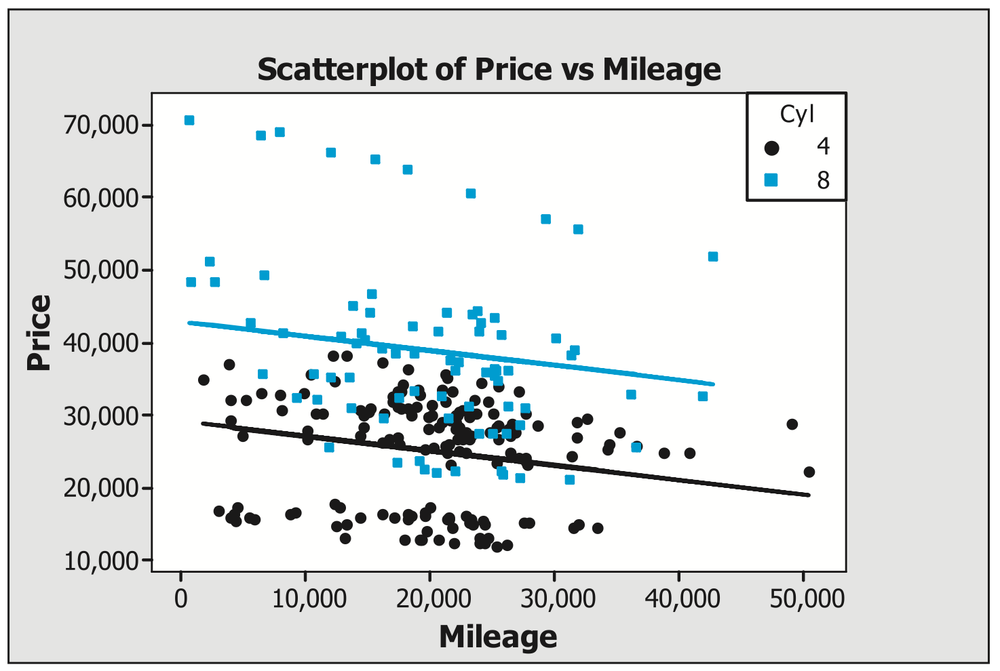
```

The data set `4-8Cyl` includes several four- and eight-cylinder cars from the original Cars data. Figure 3.10 shows a scatterplot and regression line to predict Price using both Mileage and Cyl. The regression model in Figure 3.10 has no interaction term. The parallel lines show that the estimated impact of changing cylinder size does not depend on mileage. Thus, for any given number of miles, when the number of cylinders changes from four to eight, we expect an increase in Price of $\scriptstyle 4 \times 3443 = 13{,}772$.

In the same way, the Mileage coefficient states that holding Cyl constant, we expect Price to decrease by $\scriptstyle 0.20$ for each additional mile on the car.

Figure 3.11 shows a scatterplot and regression line to predict `Price` using `Mileage`, `Cyl`, and a `Mileage*Cyl` interaction term (called `MileCyl`). The lack of parallel lines in the regression model $\scriptstyle \text{Price} = 4533 + 0.340(\text{Mileage}) + 5431(\text{Cyl}) - 0.0995(\text{MileCyl})$ indicates an interaction effect.

Caution should be used in interpreting coefficients when interaction terms are present. The coefficient for `Mileage` can no longer be globally interpreted as reducing `Price` by $\scriptstyle 0.20$ for each additional mile. Now, when there are four cylinders, `Price` is reduced by $\scriptstyle 0.058\ [0.340(1) - 0.0995(1 \times 4) = -0.058]$ with each additional mile. When there are eight cylinders, `Price` is reduced by $\scriptstyle 0.456\ [0.340(1) - 0.0995(1 \times 8) = -0.456]$ with each additional mile. Thus, an additional mile impacts `Price` differently depending on the second variable, `Cyl`.


```{r fig311, echo=FALSE, out.width="65%", fig.align="center", fig.cap="Scatterplot and and least squares regression line: Price = 4533 + 0.340(Mileage) + 5431(Cyl) + 0.0995(MileCyl). If the interaction term (MileCyl) is important, we expect to have regression lines that are not parallel."}
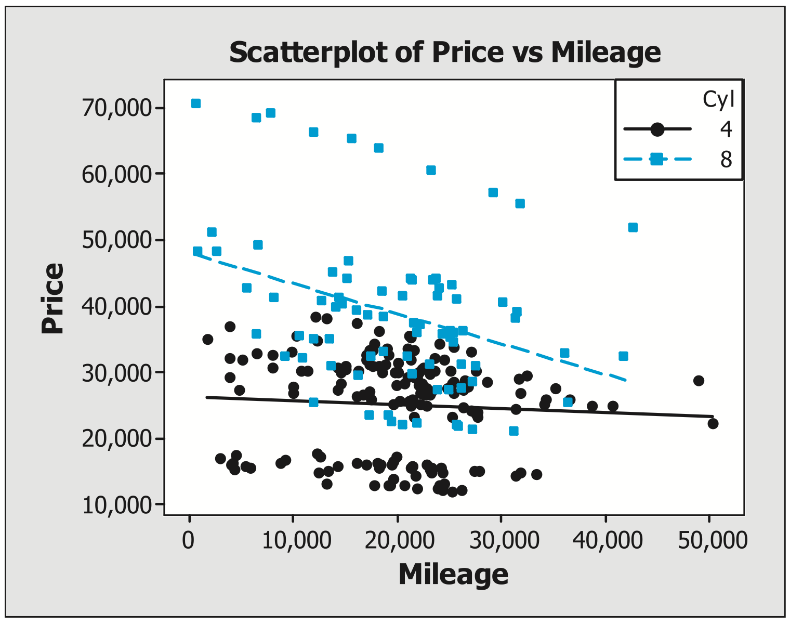
```


### \textcolor{blue}{Practice:} Understanding Interaction Terms {-} 
\vspace{-1em}
Data set: `4-8Cyl`  


\begin{enumerate}
\setcounter{enumi}{34}
\item Use the `4-8Cyl` data set to calculate the two regression equations shown in Figures 3.10 and 3.11.

\begin{enumerate}
\item Does the $\scriptstyle R^2_{\text{adj}}$ value increase when the interaction term is added? Based on the change in $\scriptstyle R^2_{\text{adj}}$, should the interaction term be included in the model?
\item For both models, calculate the estimated price of a four-cylinder car when `Mileage` = 10,000.
\item Assuming `Mileage` = 10,000 for both models, explain how increasing from four to eight cylinders will impact the estimated price.
\item Conduct an extra sum of squares test to determine if the `MileCyl` interaction term is important to the model.
\end{enumerate}

\item  Use the `4-8Cyl` data set to calculate the regression line $\scriptstyle Price = \beta_0 + \beta_1(Mileage) + \beta_3(Cadillac) + \beta_4(SAAB)$. You will need to create indicator variables for `Make` before calculating the regression line.

\begin{enumerate}
\item Create a scatterplot with `Mileage` as the explanatory variable and `Price` as the response. Overlay a second graph with `Mileage` as the explanatory variable and $\scriptstyle \hat y$ as the response. Notice that the predicted values (the $\scriptstyle \hat y$ values) form two separate lines. Do the parallel lines (no interaction model) look appropriate?
\item Conduct one extra sum of squares test to determine if interaction terms (`MileCadillac` and `MileSAAB`) are important to the model (i.e., test the hypothesis $\scriptstyle H_0:\  \beta_5 \ =\  \beta_6 \ =\  0$ versus $\scriptstyle H_a$: at least one of the coefficients is not 0, where $\scriptstyle \beta_5$ and $\scriptstyle \beta_6$ are the coefficients for the two interaction terms). Create a scatterplot with the full regression model to explain the results of the hypothesis test.
\end{enumerate}
\end{enumerate}

### Quadratic and Cubic Terms {-}
 
If a plot of residuals versus an explanatory variable shows curvature, the model may be improved by including a quadratic term. Is the relationship between mileage and retail price linear or quadratic for the Kelley Blue Book data? To test this, a quadratic term `Mileage*Mileage` can be created and included in a regression model.

>**MATHEMATICAL NOTE:**  Even though models with quadratic ($\scriptstyle x^2$) or cubic ($\scriptstyle x^3$) terms are not linear functions of the original explanatory variables, the mean response is linear in the regression coefficients ($\scriptstyle \beta_0, \beta_1, \beta_2, \dots$). For example $\scriptstyle y = \beta_0 + z_1 \beta_1 + z_2 \beta_2 + \epsilon$ would be considered a linear regression model when $\scriptstyle z_1 = x$ and $\scriptstyle z_2 = x^2$.

### \textcolor{blue}{Practice:} Understanding Quadratic Terms {-} 

Data set: `MPG` 

The MPG data compare the miles per gallon of several cars against the speed the car was going as well as displacement. Displacement is a measure of the volume of all the cylinders within an engine. The larger the displacement, the more quickly fuel can move through an engine, giving the vehicle more power.

\begin{enumerate}
  \setcounter{enumi}{36}

  \item Use the \texttt{MPG} data to create a regression model to predict \texttt{MPG} from \texttt{Speed} and \texttt{Displacement}:  
  \[
  \mathrm{MPG} = \beta_0 + \beta_1 \mathrm{Speed} + \beta_2 \mathrm{Displacement}.
  \]
  \begin{enumerate}
    \item What are the regression equation and $\scriptstyle {R}^2$ value?
    \item Look at residual versus \texttt{Speed} and residual versus \texttt{Displacement} plots. Describe any patterns you see.
    \item What does the residual normal probability plot show?
  \end{enumerate}

  \item Create a regression model to predict \texttt{MPG} from \texttt{Speed}:  
  \[
  \mathrm{MPG} = \beta_0 + \beta_1 \mathrm{Speed}.
  \]
  \begin{enumerate}
    \item What are the regression equation and $\scriptstyle {R}^2$ value?
    \item Look at residual versus \texttt{Speed} and residual versus \texttt{Displacement} plots. Describe any patterns in the residual plots.
    \item Describe any patterns in the residual normal probability plot.
    \item Is \texttt{Displacement} an important explanatory variable? Use the residual plots and $\scriptstyle {R}^2$ to give an intuitive explanation.
  \end{enumerate}

  \item Create a model using \texttt{Displacement} to predict \texttt{MPG}:  
  \[
  \mathrm{MPG} = \beta_0 + \beta_1 \mathrm{Displacement}.
  \]
  \begin{enumerate}
    \item What are the regression equation and $\scriptstyle {R}^2$ value?
    \item Look at residual versus \texttt{Speed} and residual versus \texttt{Displacement} plots. Describe any patterns in the residual plots.
  \end{enumerate}

  \item Create a $\scriptstyle {Speed}^2$ term (called \texttt{Speed\_Sq}) and incorporate that term into your regression model to predict \texttt{MPG}:  
  \[
  \mathrm{MPG} = \beta_0 + \beta_1 \mathrm{Speed} + \beta_2 \mathrm{Displacement} + \beta_3 \mathrm{Speed\_Sq}.
  \]
  \begin{enumerate}
    \item What are the regression equation and $\scriptstyle {R}^2$ value?
    \item Look at residual versus \texttt{Speed} and residual versus \texttt{Displacement} plots. Describe any changes when $\scriptstyle {Speed}^2$ is added to the model.
    \item What does the residual normal probability plot show?
  \end{enumerate}

\end{enumerate}

### \textcolor{blue}{Practice:} Creating New Terms to Predict the Retail Price of Cars {-}
\vspace{-1em}
Data set: `Cars`

The potential outliers identified in Question 11 can provide an interesting demonstration of an interaction. Figure 3.12 shows that the slope to predict `Price` from `Mileage` for the ten Cadillac XLR-V8s is much steeper than the slope found when using the other cars. This shows that depreciation for these high-end cars is almost 50 cents a mile, as opposed to 15 cents a mile on average for all car types combined.

\begin{enumerate}
  \setcounter{enumi}{40}

  \item Create a quadratic mileage term. Create two models to predict \texttt{TPrice}, one with only \texttt{Mileage} and another with both \texttt{Mileage} and $\scriptstyle Mileage^2$ (called \texttt{MileSq}).

  \begin{enumerate}
    \item How much does the $\scriptstyle {R}^2$ value increase if a quadratic term is added to the model
    \[
      TPrice = \beta_0 + \beta_1 \texttt{Mileage} \; ?
    \]
    
    \item Look at plots of residuals versus \texttt{Mileage} in both models. Did the addition of the \texttt{MileSq} term improve the residual plots?
  \end{enumerate}

  \item Create an interaction term `Mileage * Cyl` (called `MileCyl`). Use `Mileage`, `Cyl`, and `MileCyl` to predict `Price`. Does this interaction term appear to improve the model? Use residual plots and $\scriptstyle {R}^2$ to justify your answer.

  While there is no “best” model, many final models developed by students in Question 21 tend to include the terms `Cadillac`, `Convertible`, and `Liter`. Since each of these terms is related to the Cadillac XLR-V8, it may be helpful to include an interaction term for `Mileage * Cadillac`, `Mileage * Convertible`, or `Mileage * Liter`. Other `Mileage`, `Make`, or `Type` interactions may also be helpful additions to the model.

  \item Develop additional quadratic and interaction terms. Determine if they improve the regression model in Question 42.

  \item Submit a new regression model that best predicts `TPrice`. Does including quadratic or interaction terms improve your model from what was developed in Question 21?
\end{enumerate}


If an interaction term ($\scriptstyle X_i * X_j$) is included in a final model, it is common practice to include each of the original terms ($\scriptstyle X_i$ and $\scriptstyle X_j$) in the model as well (even if the coefficients of the original terms are close to zero).

## \textcolor{blue}{A Closer Look at Variable Selection Criteria}

The growing number of large data sets as well as increasing computer power has dramatically improved the ability of researchers to find a **parsimonious model** (a model that carefully selects a relatively small number of the most useful explanatory variables). However, even with intensive computing power, the process of finding a “best” model is often more of an art than a science.

As shown earlier, stepwise procedures that use prespecified conditions to automatically add or delete variables can have some limitations:

- When explanatory variables are correlated, stepwise procedures often fail to include variables that are useful in describing the results.

- Stepwise procedures tend to overfit the data (fit unhelpful variables) by searching for any terms that explain the variability in the sample results. This chance variability in the sample results may not be reflected in the entire population from which the sample was collected.  

- The automated stepwise process provides a “best” model that can be easily misinterpreted, since it doesn’t require a researcher to explore the data to get an intuitive feel for the data. For example, stepwise procedures don’t encourage researchers to look at residual plots that may reveal interesting patterns within the data.

### Adjusted $\scriptstyle {R}^2$ {-}

While $\scriptstyle {R}^2$ is useful in determining how well a particular model fits the data, it is not very useful in variable selection. Adding new explanatory variables to a regression model will never increase the residual sum of squares; thus, $\scriptstyle {R}^2$ will increase (or stay the same) even when an explanatory variable does not contribute to the fit.

The **adjusted** $\scriptstyle {R}^2$ ($\scriptstyle R^2_{adj}$) increases only if the improvement in model fit outweighs the cost of adding an additional term in the model:
\begin{equation}
R^2_{adj} = 1 - \left(\frac{n - 1}{n - p}\right)\frac{\sum_{i=1}^n (y_i - \hat{y}_i)^2}{\sum_{i=1}^n (y_i - \bar{y})^2}
= 1 - \left(\frac{n - 1}{n - p}\right)(1 - R^2)
\tag{3.13}
\end{equation}
where $\scriptstyle n$ is the sample size and $\scriptstyle p$ is the number of coefficients in the model (including the constant term).

Intuitively, each additional term in a regression model means that one additional parameter value must be estimated. Each parameter estimate costs an additional degree of freedom. Thus, $\scriptstyle R^2_{adj}$ is an $\scriptstyle {R}^2$ value that is adjusted for degrees of freedom.

### Mallows’ $\scriptstyle C_p$ {-}

Another approach to variable selection is to use Mallows’ $\scriptstyle C_p$ statistic:

\begin{equation}
C_p = (n - p)\left(\frac{\hat{\sigma}^2}{\hat{\sigma}^2_{Full}}\right) + (2p - n)
= (n - p)\left(\frac{MSE}{MSE_{Full}}\right) + (2p - n)
\tag{3.14}
\end{equation}

where $\scriptstyle n$ is the sample size, $\scriptstyle p$ is the number of coefficients in the model (including the constant term), $\scriptstyle \hat{\sigma}^2$ estimates the variance of the residuals in the model, and $\scriptstyle \hat{\sigma}^2_{Full}$ estimates the variance of the residuals in the full model (i.e., the model with all potential explanatory variables in the data set).

If the current model lacks an important explanatory variable, $\scriptstyle \hat{\sigma}^2$ is much larger than $\scriptstyle \hat{\sigma}^2_{Full}$ and $\scriptstyle C_p$ tends to be large. For any models where $\scriptstyle \hat{\sigma}^2$ is similar to $\scriptstyle \hat{\sigma}^2_{Full}$, $\scriptstyle C_p$ provides a penalty, $\scriptstyle 2p - n$, to favor models with a smaller number of terms. For a fixed number of terms, minimizing $\scriptstyle C_p$ is equivalent to minimizing SSE, which is also equivalent to maximizing $\scriptstyle {R}^2$.

The $\scriptstyle C_p$ statistic assumes that $\scriptstyle \hat{\sigma}^2_{Full}$ is an unbiased estimate of the overall residual variability, $\scriptstyle \sigma^2$. If the full model has several terms that are not useful in predicting the response (i.e., several coefficients are essentially zero), then $\scriptstyle \hat{\sigma}^2_{Full}$ will overestimate $\scriptstyle \sigma^2$ and $\scriptstyle C_p$ will be small. $\scriptstyle \hat{\sigma}^2_{Full}$ = $\scriptstyle MSE_{FULL}$ = $\scriptstyle SSE_{FULL}/(n-k)$ where `k` is the number of terms in the full model. When `k` is unnecessarily large, $\scriptstyle \hat{\sigma}^2_{Full}$ is also large.

When the current model explains the data as well as the full model, $\scriptstyle \hat{\sigma}^2 / \hat{\sigma}^2_{Full} = 1$. Then $\scriptstyle C_p = (n - p)(1) + 2p - n = p$ Thus, the objective is often to find the smallest $\scriptstyle C_p$ value that is close to p.

### Akaike’s Information Criterion (AIC) and Bayes’ Information Criterion (BIC) {-}

Two additional model selection criteria are the Akaike information criterion (AIC) and the Bayesian information criterion (BIC). BIC is also called the Schwarz criterion. Both of these criteria are popular because they are also applicable to regression models fit by maximum likelihood techniques (such as logistic regression), whereas $\scriptstyle {R}^2$ and $\scriptstyle C_p$ are appropriate only for least squares regression models. 

Calculations for these two criteria are provided below. These statistics also include a measure of the variability of the residuals plus a penalty term:

\begin{equation}
AIC = n[\log(\hat{\sigma}^2)] + 2p 
\tag{3.15}
\end{equation}

\begin{equation}
BIC = n[\log(\hat{\sigma}^2)] + p[\log(n)] \notag
\tag{3.16}
\end{equation}

where $\scriptstyle n$ is the sample size, $\scriptstyle p$ is the number of coefficients in the model, and $\scriptstyle \hat{\sigma}^2$ estimates the variance of the residuals in the model.  

AIC and BIC are identical except for their penalties, $\scriptstyle 2p$ and $\scriptstyle p[\log(n)]$, respectively. Thus, AIC and BIC will tend to select slightly different models based on $\scriptstyle n$. AIC and BIC both select models that correspond to the smallest value.

\textbf{\textcolor{blue}{Key Concept:}}
\textcolor{blue}{No individual criterion ($\scriptstyle R^2_{adj}$, $\scriptstyle C_p$, AIC, or BIC) is universally better than the other selection criteria. While these tools are helpful in selecting models, they do not produce a model that is necessarily “best.”}

Automated model selection criteria should not be used without taking time to explore the data. Stepwise procedures can be useful in initially screening a very large data set to create a smaller, more manageable data set. Once a manageable data set has been found, it is often best to spend time comparing many models from all potential terms.

### Model Validation {-} 

Often our goal is not just to describe the sample data, but to generalize to the entire population from which the sample was drawn. Even if a regression model is developed that fits the existing sample data very well and satisfies the model assumptions, there is no guarantee that the model will accurately predict new observations.  

Variable selection techniques choose variables that account for the variation in the response. When there are many explanatory variables, it is likely that at least some of the terms selected don’t explain patterns seen in the entire population; they are included simply because of chance variability seen in the sample.

To validate that a regression model is useful for predicting observations that were not used to develop
the model, do the following:  

- Collect new data from the same population as the original data. Use the new data to determine the
predictive ability of the original regression model.  

- Split the original data. For example, randomly select 75% of the observations from the original data
set, develop a model, and check the appropriate model assumptions. Test the predictive ability of the
model on the remaining 25% of the data set. This is often called **cross-validation**.

- When the data set is not large enough to split, try **jackknife validation**. Hold out one observation at a time, develop a model using the $\scriptstyle n-1$ remaining observations, and then estimate the value of the observation that was held out. Repeat this process for each of the n observations and calculate a predictive $\scriptstyle {R}^2$ value to evaluate the predictive ability of the model.  

- Use theory and prior experience to compare your regression model with other models developed with
similar data.

## \textcolor{blue}{Chapter Summary}

In this chapter, we discussed techniques to describe, predict, and test hypotheses about the relationship between a quantitative response variable and multiple explanatory variables. The goals of a regression model will influence which techniques should be used and which conclusions can be drawn. The Cars activities in this chapter focused on developing a model that could describe the relationship between the explanatory variables and response variable as well as predict the value of the response based on a function of the explanatory variables.

Iterative techniques such as best subsets regression are often very useful in identifying which terms should be included in a model. The process of selecting explanatory variables to include in a model often involves iterative techniques, in which numerous models are created and compared at each step in the process. Iterative techniques should not be used when the goal of multiple regression is to test hypotheses. Stepwise regression is used to find the model with the highest $\scriptstyle R^2$ value; however, it does not provide much useful information about the model. For example, important variables (such as Liter in our investigation) are often not included in the stepwise regression models. Best subsets regression is a more useful iterative technique because it allows the researcher to better identify important explanatory variables, even if multicollinearity (highly correlated explanatory variables) exists. Table 3.3 lists the key measures used in variable selection.


```{r table33, results='asis', echo=FALSE} 
# Create the data frame 
df3.3 <- data.frame( 
  Statistic = c("$R^2 = 1 - \\dfrac{\\sum_{i=1}^n (y_i - \\hat{y}_i)^2}{\\sum_{i=1}^n (y_i - \\overline{y})^2}$", 
                "$R^2_{\\text{adj}} = 1 - \\left( \\dfrac{n-1}{n-p} \\right) \\dfrac{\\sum_{i=1}^n (y_i - \\hat{y}_i)^2}{\\sum_{i=1}^n (y_i - \\overline{y})^2}$", 
                "$C_p = (n-p)\\left(\\dfrac{\\hat{\\sigma}^2}{\\hat{\\sigma}_{\\text{Full}}^2} \\right) + (2p-n)$",
                "$\\text{AIC} = n[\\log(\\hat{\\sigma}^2)] + 2p$", 
                "$\\text{BIC} = n[\\log(\\hat{\\sigma}^2)] + p[\\log(n)]$" ), 
  `Selection Criteria` = c( "Larger is better", 
                            "Larger is better", 
                            "Close to $p$ is better", 
                            "Smaller is better", 
                            "Smaller is better" ), 
  check.names = FALSE ) 

# Render as styled LaTeX table 
kable(df3.3,
      format = "latex",
      booktabs = TRUE,
      escape = FALSE,
      col.names = c("Statistic", "Selection Criteria"),
      caption = "Variable selection criteria.",
      align = c("l", "l")
) %>%
  kable_styling(
    latex_options = c("hold_position", "striped", "scale_down"),
    font_size = 10,
    full_width = FALSE,
    position = "center"
  ) %>%
  column_spec(1, width = "10cm") %>%
  column_spec(2, width = "5cm")

```


In Table 3.3
\vspace{-1em}
\begin{itemize}
\item $\scriptstyle n$ is the sample size 
\item $\scriptstyle p$ is the number of coefficients in the model (including $\scriptstyle \beta_0$)
\item $\scriptstyle \hat{\\sigma}^2 = \frac{\\sum_{i=1}^n (y_i - \hat{y}_i)^2}{n - p}$ estimates the variance of the residuals in the current model tested.
\item $\scriptstyle \hat{\sigma}_{\text{Full}}^2$ estimates the variance of the residuals in the full model (the model with all explanatory variables).
\end{itemize}

No individual criterion ($\scriptstyle R^2_{adj}$, $\scriptstyle C_p$, $\scriptstyle AIC$, or $\scriptstyle BIC$) is universally better than the other selection criteria. These tools are helpful in selecting models, but they do not produce a model that is necessarily “best.”

While iterative techniques are useful in reducing a large number of explanatory variables to a more manageable set, a researcher should ask the following questions to evaluate the resulting model:

\vspace{-1em}
\begin{itemize}
\item Were the techniques used to create the model appropriate based on the goals of the regression model?
\item Do the coefficients make sense? Are the magnitudes of the coefficients reasonable? If the coefficients have the opposite sign than expected, multicollinearity may be present, the range of the explanatory variables may be too small, or important explanatory variables may be missing from the model.
\item Do the residual plots identify any outliers or patterns that indicate unexplained structure that should be included in the model?
\end{itemize}

If the goal is to use hypothesis testing to determine how each of the explanatory variables impacts the response, iterative techniques are not appropriate. In addition, hypothesis tests about specific explanatory variables are not reliable when multicollinearity or lack of normality exists.

Model assumptions need to be met if the goal is to test hypotheses. While least squares regression models can be calculated without checking model assumptions, identifying patterns in residual plots that may indicate **heteroskedasticity**, **autocorrelation**, **outliers**, or **lack of normality** is important to creating a good model. If a pattern exists in any of the residual plots, it is likely that another model exists that better explains the response variable. Researchers need to be somewhat creative in deciding which graphs to create and how to adapt a model based on what they see.

Histograms or normal probability plots of residuals are used to determine if the residuals follow the normal distribution. Autocorrelation may exist when patterns appear in the ordered residual plots, indicating that each observation is not independent of the prior observation. Heteroskedasticity occurs when the variance of the residuals is not equal. If the variance increases as the expected value increases, a variance stabilizing transformation, such as the natural log or square root of the response, may reduce heteroskedasticity.

Tests of regression coefficients (as in Question 2) and **extra sum of squares tests** can be used for exploratory purposes or to test a theory. The individual $\scriptstyle t$-test for coefficients can be unreliable if the explanatory variables are correlated. In addition, $\scriptstyle p$-values for this $\scriptstyle t$-test become less reliable as more tests are conducted.

The following hypothesis test can be analyzed with Table 3.2:

\[
H_0\!: \beta_1 = \beta_2 = \cdots = \beta_{p-1} = 0
\]
\[
H_a\!: \text{at least one of the coefficients in the null hypothesis is not 0}
\]

The extra sum of squares test shown in Table 3.4 is used to compare a full model (with $\scriptstyle k$ terms) to a reduced model (with $\scriptstyle p$ terms), where $\scriptstyle k > p$. Every term in the reduced model must also be in the full model.

\[
H_0\!: \beta_p = \beta_{p+1} = \cdots = \beta_{k-1} = 0
\]
\[
H_a\!: \text{at least one of the coefficients in the null hypothesis is not 0}
\]

Interaction terms and squared (or cubed) terms can be tested with the extra sum of squares test to determine if the additional terms improve the regression model. Testing models with all possible interaction and squared terms can become complex very quickly, so these terms are not typically tested unless there is some reason to include them.

```{r tab34, echo=FALSE, results='asis'}

df3.4 <- data.frame(
  Source = c("Reduced model", "Extra $k - p$ terms", "Error", "Total"),
  df = c(
    "$p - 1$", "$k - p$", "$n - k$", "$n - 1$"
  ),
  SS = c(
    "$\\text{SSR}_{\\text{Reduced}}$",
    "$\\text{SSR}_{\\text{Full}} - \\text{SSR}_{\\text{Reduced}}$",
    "$\\text{SSE}_{\\text{Full}}$",
    "$\\text{SST} = \\sum_{i=1}^n (y_i - \\overline{y})^2$"
  ),
  MS = c(
    "$\\dfrac{\\text{SSR}_{\\text{Reduced}}}{df_{\\text{Reduced}}}$",
    "$\\dfrac{\\text{SSR}_{\\text{Full}} - \\text{SSR}_{\\text{Reduced}}}{k-p}$",
    "$\\text{MSE}_{\\text{Full}} = \\dfrac{\\text{SSE}_{\\text{Full}}}{n - k}$",
    ""
  ),
  `F-Statistic` = c(
    "$\\dfrac{MS_{\\text{Reduced}}}{\\text{MSE}}$",
    "$\\dfrac{MS_{\\text{Extra}}}{\\text{MSE}}$",
    "",
    ""
  ),
  check.names = FALSE
)

cat(
  kable(
    df3.4,
    format = "latex",
    booktabs = TRUE,
    escape = FALSE,
    col.names = c("Source", "df", "SS", "MS", "$F$-Statistic"),
    caption = "The extra sum of squares $F$-statistic is the ratio of the mean square for the extra $k-p$ terms to the $\\text{MSE}_{\\text{Full}}$ with $k-p$ and $n-k$ degrees of freedom.",
    align = c("l", "c", "c", "c", "c")
  ) %>%
    kable_styling(latex_options = "hold_position")
)

```

Often the goal is not just to describe the sample data, but to generalize to the entire population from which the sample was drawn. Model validation techniques such as cross-validation and jackknife techniques are used to verify that the regression model applies to a larger population than just the sample data.

In multi-variable data sets, it is possible to obtain seemingly conflicting results. For example, we initially
found a $\scriptstyle p$-value indicating that mileage was a significant predictor of price, but the $\scriptstyle {R}^2$ value for the corresponding model was very small. Attempts to improve a regression model, such as by finding the appropriate data transformation or addressing multicollinearity, are often more of an art form than an automated process. Even highly technical statistical software packages cannot automatically develop a “best” model. Visual interpretation of residual plots typically provides a final model that is much better than a model developed by iterative (algorithmic) statistical software techniques.

Multiple regression involves a large set of tools for developing, assessing, and interpreting a regression model with one response variable and two or more explanatory variables. Numerous texts have been written about this topic, and this chapter does not attempt to be a comprehensive explanation of multiple regression. The goal of this chapter is to provide a foundation so that the reader will understand how a statistician approaches multiple regression as it is actually practiced in many disciplines.

## Exercises

\begin{enumerate}
  \setcounter{enumi}{44}

  \item The initial regression model given in this chapter was Price = 24,765 - 0.1725(Mileage).
    \begin{enumerate}
      \item Give a practical explanation of the coefficient, $\scriptstyle b_1 = 0.1725$, in the context of the \texttt{Cars} data.
      \item The coefficient, $\scriptstyle b_1 = 0.1725$, is a fairly small number. However, the $\scriptstyle p$-value for the corresponding hypothesis test caused us to reject $\scriptstyle H_0:\  \beta_1 \ =\  0$. How could such a small value cause us to reject the null hypothesis?
      \item The $\scriptstyle p$-value caused us to conclude that mileage is important in predicting the retail price. However, the $\scriptstyle {R}^2$ value seemed to indicate that the regression model was not very useful in estimating the retail price. These results may originally appear somewhat contradictory. Explain how these statistics are measuring different aspects of the same regression model, and thus the results do not really contradict each other.
    \end{enumerate}

  \item Assume the basic forward stepwise regression is calculated with a data set that includes five quantitative explanatory variables. How many models were created and evaluated to determine the first term in the model?

  \item Assume the basic forward stepwise regression is calculated with a data set that includes five quantitative explanatory variables. If all five variables are included in the final model, how many models were created and evaluated to determine the final model?

  \item Assume your roommate has taken only one introductory statistics class, but is currently working on a multiple regression project in his economics class. He used best subsets regression on 50 explanatory variables to find a good-fitting final model that included only four explanatory variables. He then used hypothesis tests to show that all four of these explanatory variables significantly impact the response. Write a short note to your roommate, explaining why the hypothesis tests are not valid.

  \item Explain why multicollinearity is a problem for researchers who are hoping to test whether specific explanatory variables impact the response (i.e., confirm a theory). Then explain why multicollinearity is not a problem for researchers who are trying to develop a model that accurately predicts their response.

  \item Explain why none of the previous activities using the \texttt{Cars} data can be used to show that \texttt{Mileage} or \texttt{Cylinder} size causes a change in \texttt{Price}.

  \item Select one residual plot that was created from any of the previous \texttt{Cars} activities. Explain how visual interpretation of the plot was more helpful than the $\scriptstyle {R}^2$ value in drawing appropriate conclusions about model validity.

  \item Explain why researchers often use statistics such as adjusted $\scriptstyle {R}^2$ or Mallows’ $\scriptstyle C_p$ instead of the original $\scriptstyle {R}^2$ value.

  \item \textbf{Brain and Body Weights: Transforming Variables}

Data set: \texttt{Weights}

In the process of studying the effect of sleep on mammals, T. Allison and D. Cicchetti collected the brain weights (in grams) and body weights (in kilograms) of 62 mammals.$^5$ In the data set, you can see the measurements for these two variables for each of the 62 animals studied.

  \begin{enumerate}
    \item Create a scatterplot and regression line to predict \texttt{BrainWt} from \texttt{BodyWt} and appropriate residual plots. Even though the $\scriptstyle {R}^2$ value is reasonable, it is clear that there are extreme outliers on both the $\scriptstyle X$ and $\scriptstyle Y$ axes.
      \item Create a scatterplot and regression line to predict $\scriptstyle \log(\texttt{BrainWt})$ from $\scriptstyle \log(\texttt{BodyWt})$. Create the appropriate residual plots and describe how the transformation impacted the validity of the linear regression model.
      \item The African elephant weighs 6654 kg. Use both models created in Parts A and B to estimate the African elephant’s brain weight. Which model provides a more accurate estimate? Explain how this corresponds to the residual plots created in both questions.
    \end{enumerate}

  \item \textbf{Arsenic and Toenails: Transforming Variables}

Data set: \texttt{Arsenic}

Karagas, Morris, Weiss, Spate, Baskett, and Greenberg collected toenail clippings of several individuals along with samples of each person’s regular drinking water.$^6$ In this pilot study, the researchers attempted to determine if arsenic concentrations in people’s toenails could be used to determine the level of arsenic in their water. Each of the 21 individuals in this study had a private well. High arsenic concentrations are related to cancer, and several studies have found a positive correlation between arsenic concentrations of drinking water and toenail samples.

  \begin{enumerate}
      \item Create a scatterplot and regression line to predict \texttt{ArsWater} from \texttt{ArcToe}. There are extreme outliers along both the $\scriptstyle X$ and $\scriptstyle Y$ axes. However, 6 of the 21 water samples contained no arsenic, and taking the logarithm of \texttt{ArsWater} is not possible.
      \item Create a scatterplot and regression line to predict $\scriptstyle \log(\texttt{ArsWater} + 1)$ from $\scriptstyle \log(\texttt{ArcToe})$. Create the appropriate residual plots and evaluate the validity of the model. While the transformations are helpful, model assumptions are still violated.
      \item Try using a few more variables or transformations to create a better model. This is an example where you are unlikely to find a satisfactory simple regression model.
    \end{enumerate}

  \item \textbf{Socioeconomic Factors and HIV/AIDS}

Data set: \texttt{AIDS}

Is there any combination of socioeconomic factors that can be used to explain the prevalence of HIV/AIDS in the world’s least developed countries? Least developed countries (or fourth world countries) are countries classified by the United Nations as meeting all three of the following criteria: a low income criterion, a human resource weakness criterion, and an economic vulnerability criterion.

The World Health Organization (WHO) attempts to measure the number of people living with HIV/AIDS. Regrettably, it is often difficult to get accurate counts.

The \texttt{AIDS} data set shows the prevalence of HIV/AIDS in adults aged 15 to 49 in least developed countries along with country-level data on several socioeconomic factors. Use this data set to create a multivariate regression model to predict the prevalence of HIV/AIDS from socioeconomic factors.

  \item \textbf{Partisan Politics}

Data set: \texttt{Politics}

Do the population characteristics of each state (e.g., unemployment level, education level, age, income level, religious preferences, health insurance, and voter turnout) influence how people vote? Do these characteristics have an impact on the composition of state legislatures? In 2001, several college students collected data from 50 states on each of these factors from the U.S. Census Bureau.

  \begin{enumerate}
      \item Calculate the percent Democrat in both the lower and the upper house for each state. Then calculate an average of these two percents as an overall \texttt{Percent Democrat} variable. (Data from Nebraska should not be included in the analysis since the state government is composed completely of nonpartisans.)
      \item Formulate hypotheses about how each of the explanatory variables (the population characteristics) will influence voting patterns.
      \item Form a regression model using the composition of the state governments in 2001 to test your theories.
      \item Plot the residuals and check the model assumptions. State your conclusions about each hypothesis.
    \end{enumerate}

  \item \textbf{Iowa Caucuses}

Data set: \texttt{Caucuses}

The \texttt{Caucuses} data set contains the 2008 Democratic and Republican caucus results. Republicans don’t record individual votes, but each precinct allocates its delegates based on the number of people in the precinct supporting each candidate during the caucus. Senator Clinton was expected to win in most polls, but ended up a surprising third after Senators Obama and Edwards. Many political analysts have found that females, less educated people, and older people voted for Senator Clinton, while younger people, more educated people, and African Americans preferred Senator Obama.

  \begin{enumerate}
    \item Use the \texttt{Caucuses} data to test the hypothesis that education level is correlated to a higher percentage of votes for Senator Obama.
      \item Use the \texttt{Caucuses} data to create a multivariate model that “best” predicts the percentage of delegates Senator Obama would win.
    \end{enumerate}

  \item \textbf{Movies}

Data set: \texttt{2008Movies}

The \texttt{2008Movies} file contains data on movies released in 2008.

  \begin{enumerate}
    \item Calculate a regression model to predict box office from run time. Interpret the $\scriptstyle {R}^2$ value and test statistic for the slope in the context of this problem.
      \item Create indicator variables for genre and MPAA rating. Use best subsets regression to determine an appropriate regression model.
        \begin{enumerate}
          \item Validate the model assumptions.
          \item Look at residual plots and check for heteroskedasticity, multicollinearity, autocorrelation, and outliers. Transform the data if it is appropriate.
          \item Submit your suggested least squares regression formula along with a limited number of appropriate graphs that provide justification for your model. Describe why you believe this model is best.
        \end{enumerate}
      \item Conduct an extra sum of squares test to determine if one or more interaction terms (or quadratic terms) should be included in the model. You can choose any terms to test, but enough software output needs to be provided so that the instructor can verify your work.
    \end{enumerate}

\end{enumerate}

### References{-}

\begin{enumerate}
  \item G. E. P. Box and N. R. Draper’s \textit{Empirical Model-Building and Response Surfaces} (New York: Wiley, 1987), p. 424.
   \item More details are provided in more advanced textbooks such as M. H. Kutner, J. Neter, C. J. Nachtsheim, and W. Li, \textit{Applied Linear Regression Models} (New York: McGraw-Hill, 2004).
  \item See D. Montgomery, E. Peck, and G. Vining’s text \textit{Introduction to Linear Regression Analysis}, 3rd ed. (New York: Wiley, 2002) to get a better understanding of the details of variable selection techniques.
  \item Ibid, p. 337.
  \item T. Allison and D. Cicchetti, “Sleep in Mammals: Ecological and Constitutional Correlates,” \textit{Science}, 194 (Nov. 12, 1976): 732–734.
  \item M. Karagas, J. Morris, J. Weiss, V. Spate, C. Baskett, and E. Greenberg, “Toenail Samples as an Indicator of Drinking Water Arsenic Exposure,” \textit{Cancer Epidemiology, Biomarkers and Prevention}, 5 (1996): 849–852.
  \item W. Easterly, \textit{The Elusive Quest for Growth: Economists’ Adventures and Misadventures in the Tropics} (Cambridge, MA: MIT Press, 2001), prologue.
\end{enumerate}


