--- 
title: "Making Decisions with Data"
author: "Shonda Kuiper"
output: pdf_document
documentclass: book
bibliography:
- book.bib
- packages.bib
description: |
  This is a first version of an applied statistics textbook.
  The HTML output format for this example is bookdown::gitbook,
link-citations: true
github-repo: "rstudio/bookdown-demo"
site: bookdown::bookdown_site
---
```{r setup,include=FALSE, warning=FALSE, message=FALSE}
knitr::opts_chunk$set(echo=FALSE)
library(dplyr)
library(readr)
library(knitr)
library(kableExtra)
library(ggplot2)
library(tidyverse)
library(devtools)
library(plotly)
#install_github("Tanvi-Jindal/myfirstpackage")
#library(myfirstpackage)
```

\newpage

**About the book**

This book is designed to help students discover the power, versatility, and broad applicability of statistics. Centered around a collection of practical statistical methods commonly used in both the natural and social sciences, the text emphasizes a hands-on approach to data analysis grounded in real-world applications.

Each chapter features guided activities that lead students through the full process of statistical inquiry—from asking meaningful questions and exploring data to drawing and communicating conclusions. These activities are built around compelling, interdisciplinary problems that reflect the challenges faced by today’s researchers and decision-makers.

The text can serve as a second course for undergraduate students who have completed a one-semester, algebra-based introductory statistics course or a high school Advanced Placement Statistics course. 


**About the author**

Dr. Shonda Kuiper is a Professor of Statistics at Grinnell College. She teaches a variety of statistics courses, with an emphasis on applying statistics across multiple disciplines. Dr. Kuiper also serves as a statistical consultant for student and faculty research. She received her Bachelor of Arts and Sciences degree in mathematics from Wartburg College, and has an MS and a PhD in statistics from Iowa State University.  Dr. Kuiper is a Fellow of the American Statistical Association for her innovative work in statistics education and the recipient of multiple National Science Foundation grants to develop materials for undergraduate statistics courses. In addition to previously holding teaching positions, she served as a senior engineer and later as a consulting statistician for Hallmark Cards, Inc.

\newpage

```{r include=FALSE}
# automatically create a bib database for R packages
knitr::write_bib(c(
  .packages(), 'bookdown', 'knitr', 'rmarkdown'
), 'packages.bib')
```

<!--chapter:end:index.Rmd-->


```{r}
library(dplyr)
library(readr)
library(knitr)
library(kableExtra)
library(ggplot2)
library(tidyverse)
library(devtools)
library(plotly)
#install_github("Tanvi-Jindal/myfirstpackage")
#library(myfirstpackage)
```


# Nonparametric Methods: Schistosomiasis

\begin{flushright}
\emph{Using statistics is no substitute for thinking about the problem} \\
-- Douglas Montgomery\footnote{Douglas Montgomery, \emph{Design and Analysis of Experiments}, Fifth edition, Wiley, 2003, page 21.}
\end{flushright}


Randomization tests, permutation tests, and bootstrap methods are quickly gaining in popularity as methods for conduct statistical inference. Why? These nonparametric methods require fewer assumptions and provide results that are often more accurate than those from traditional techniques using well-known distributions (such as the normal, t, or F distribution). These methods are based on computer simulations instead of distributional assumptions and thus are particularly useful when the sample data are skewed or if the sample size is small. In addition, nonparametric methods can be extended to other parameters of interest, such as the median or  standard deviation, while the well known parametric methods described in introductory statistics courses are often restricted to just inference for the population mean. 

We begin this chapter by comparing two treatments for a potentially deadly disease called Schistosomiasis (shis-tuh-soh-mahy-uh-sis). We illustrate the basic concepts behind nonparametric methods by using randomization tests to:

*	Provide an intuitive description of statistical inference.
*	Conduct a randomization test by hand
*	Use software to conduct a randomization test
*	Compare one-sided and two-sided hypothesis tests
*	Making connections between randomization tests and conventional terminology


After working through the schistosomiasis investigation, you will have the opportunity to analyze several other data sets using randomization tests, permutation tests, bootstrap methods, and rank-based nonparametric tests.

\newpage


## Investigation: Can a New Drug Reduce the Spread of Schistosomiasis?

Schistosomiasis is a disease occurring in humans caused by parasitic flatworms called schistosomes (skis’-tuhsohms). Schistosomiasis affects about 200 million people worldwide and is a serious problem in sub-Saharan Africa, South America, China, and Southeast Asia. The disease can cause death, but more commonly results in chronic and debilitating symptoms, arising primarily from the body’s immune reaction to parasite eggs lodged in the liver, spleen, and intestines.

Currently there is one drug, praziquantel (prā'zĭ-kwän'těl'), in common use for treatment of schistosomiasis; it is cheap and effective. However many organizations are worried about relying on a single drug to treat a serious disease which affects so many people worldwide. Drug resistance may have prompted a 1990s outbreak in Senegal, where cure rates were low.  In 2007, several researchers published work involving a promising drug called K11777  that, in theory, might also treat schistosomiasis. 

In this chapter, we will analyze data from this study where the researchers wanted to find out whether K11777 helps to stop schistosome worms from growing. In one phase of the study, 10 female laboratory mice and 10 male laboratory mice were deliberately infected with the schistosome parasite. Seven days after being infected with schistosomiasis, each mouse was given injections every day for 28 days. Within each sex, 5 mice were randomly assigned to a treatment of K11777 whereas the other 5 mice formed a control group injected with an equal volume of plain water. At day 49, the researchers euthanized the mice and measured both the number of eggs and the numbers of worms in the mice livers. Both numbers were expected to be lower if the drug was effective.

Table 1.1 gives the worm count for each mouse. An individual value plot of the data is shown in Figure 1.1. Notice that the treatment group has fewer worms than the control group for both females and males.


```{r table1, warning=FALSE,echo=FALSE,message=FALSE}

url<-'https://raw.githubusercontent.com/grinnell-statistics/STA310data/refs/heads/master/Mice.csv'
data<-read.csv(url)

mean_values <- colMeans(data[, sapply(data, is.numeric)], na.rm = TRUE)
data_with_mean <- bind_rows(data, mean_values)
data_with_mean[nrow(data_with_mean),1]<-paste('Mean',mean_values[1])


kable(data_with_mean,
      format = "latex",
      booktabs = TRUE,
      caption = "Worm count data for the schistosomiasis study.",
      col.names = c("Treatment","Control","Treatment","Control")) %>%
  kable_styling(latex_options = c("striped", "hold_position"),
                font_size = 10,
                position = "center",
                full_width = FALSE) %>%
  add_header_above(c("Female" = 2, "Male" = 2)) %>%
  row_spec(nrow(data_with_mean), bold = TRUE)
```


```{r graph1, warning=FALSE, echo=FALSE, message=FALSE, fig.height = 2, fig.cap="Individual value plot of the worm count data"}

url<-'https://raw.githubusercontent.com/grinnell-statistics/STA310data/refs/heads/master/Mice.csv'
data<-read.csv(url)

long_data<- data%>% 
  pivot_longer(cols=everything(),
               names_to='group',
               values_to='Number')%>%
  separate(group,into=c("Gender","Type"),sep="\\.")


ggplot(long_data,aes(x=Gender,y=Number,fill=Type,))+
  geom_dotplot(binaxis="y",stackdir="center",position="dodge")+labs(x="Gender",y="Worm Count",fill="Type")
```


>**NOTE**
There is a difference between individual value plots and dotplots. In dotplots (such as Figures 1.3 and 1.4 shown later in this chapter), each observation is represented by a dot along a number line (x-axis). When values are close or the same, the dots are stacked. Dotplots can be used in place of histograms when the sample size is small. Individual value plots, as shown in Figure 1.1, are used to simultaneously display each observation for multiple groups. They can be used instead of boxplots to identify outliers and distribution shape, especially when there are relatively few observations.


### Activity: Describing the Data{-}

1. Use Figure 1.1 to visually compare the number of worms for the treatment and control groups for both the male and the female mice. Does each of the four groups appear to have a similar center and a similar spread? Are there any outliers (extreme observations that don’t seem to fit with the rest of the data)?

2. Calculate appropriate summary statistics (e.g., the median, mean, standard deviation, and range) for each of the four groups. For the female mice, calculate the difference between the treatment and control group means. Do the same for the male mice.


The descriptive analysis in Questions 1 and 2 points to a positive treatment effect: K11777 appears to have reduced the number of parasitic worms in this sample. But descriptive analysis is usually only the first step in ascertaining whether an effect is real; we often conduct a significance test or create a confidence interval to determine if chance alone could explain the effect.

Most introductory statistics courses focus on hypothesis tests that involve using a normal, t-, chi-square or F-distribution to calculate the $p$-value. These tests are often based on the central limit theorem. In the schistosomiasis study, there are only five observations in each group. This is a much smaller sample size than is recommended for the central limit theorem, especially given that Figure 1.1 indicates that the data may not be normally distributed. Since we cannot be confident that the sample averages are normally distributed, we will use a distribution-free test, also called a nonparametric test. Such tests do not require
the distribution of our sample statistic to have any specific form and are often useful in studies with very small sample sizes.


>**MATHMATICAL NOTE**  For any population with mean $\mu$ and finite standard deviation $\sigma$, the **central limit theorem** states that the sample mean $\bar{x}$ from an independent and identically distributed sample tends to follow the normal distribution if the sample size is large enough. The mean of $\bar{x}$ is the same as the population mean, $\mu$, while the standard deviation of x is $\sigma / \sqrt{n}$, where $n$ is the sample size.

We will use a form of nonparametric statistical inference known as a randomization hypothesis test to analyze the data from the schistosomiasis study. **Randomization hypothesis tests** are significance tests that simulate the random allocation of units to treatments many times in order to determine the likelihood of observing an outcome at least as extreme as the one found in the actual study.


\textbf{\textcolor{blue}{Key Concept:}}
\textcolor{blue}{\textbf{Parametric tests} (such as $z$-tests, $t$-tests, or $F$-tests) assume that data come from a population that follows a probability distribution or use the central limit theorem to make inferences about a population. \textbf{Nonparametric tests} (such as randomization tests) do not require assumptions about the distribution of the population or large sample sizes in order to make inferences about a population.}

We will introduce the basic concepts of randomization tests in a setting where units (mice in this example) are randomly allocated to a treatment or control group. Using a significance test, we will decide if an observed treatment effect (the observed difference between the mean responses in the treatment and control) is “real” or if “random chance alone” could plausibly explain the observed effect. The null hypothesis states that “random chance alone” is the reason for the observed effect. In this initial discussion, the alternative hypothesis will be onesided because we want to show that the true treatment mean ($\mu_{treatment}$) is less than the true control mean ($\mu_{control}$). Later, we will expand the discussion to consider modifications needed to deal with two-sided alternatives.


## Statistical Inference Through a Randomization Test

Whether they take the form of significance tests or confidence intervals, inferential procedures rest on the fundamental question for inference: “What would happen if we did this many times?” Let’s unpack this question in the context of the female mice in the schistosomiasis study. We observed a difference in means of 7.6 = 12.00 - 4.40 worms between control and treatment groups. While we expect that this large difference reflects the effectiveness of the drug, it is possible that chance alone could explain this difference. “chance alone” position is usually called the null hypothesis and includes the following assumptions:

* The number of parasitic worms found in the liver naturally varies from mouse to mouse.
* Whether or not the drug is effective, there clearly is variability in the responses of mice to the infestation
of schistosomes.
* Each group exhibits this variability, and even if the drug is not effective, some mice do better than
others.
* The only explanation for the observed difference of 7.6 worms in the means is that the random
allocation randomly placed mice with larger numbers of worms in the control group and mice with
smaller numbers of worms in the treatment group.


In this study, the **null hypothesis** is that the treatment has no effect on the average worm count, and it
is denoted as

\begin{center}
$H_0$: $\mu_{control}$ = $\mu_{treatment}$
\end{center}

Another way to write this null hypothesis is

\begin{center}
$H_0$: the treatment has no effect on average worm count
\end{center}

The research hypothesis (the treatment causes a reduction in the average worm count) is called the **alternative hypothesis** and is denoted $H_a$ (or $H_1$). For example,

\begin{center}
$H_a$: $\mu_{\text{control}}$ > $\mu_{\text{treatment}}$
\end{center}

Another way to write this alternative hypothesis is

\begin{center}
$H_a$: the treatment reduces the average worm count
\end{center}

Alternative hypotheses can be “one-sided, greater than” (as in this investigation), “one-sided, less-than” (the treatment causes an increase in worm count), or “two-sided” (the treatment mean is different, in one direction or the other, from the control mean). We chose to test a one-sided hypothesis because there is a clear research interest in one direction. In other words, we will take action (start using the drug) only if we can show that K11777 reduces the worm count.


\textbf{\textcolor{blue}{Key Concept:}}
\textcolor{blue}{\textbf{The fundamental question for inference}: Every statistical inference procedure (parametric or nonparametric) is based on the question “How does what we observed in our data compare to what would happen if the null hypothesis were actually true and we repeated the process many times?” For a randomization test comparing responses for two groups, this question becomes “How does the observed difference between groups compare to what would happen if the treatments actually had no effect on the individual responses and we repeated the random allocation of individuals to groups many times?”}


### Activity: Conducting a Randomization Test by Hand{-}

3. To get a feel for the concept of a $p$-value, write each of the female worm counts on an index card. Shuffle the 10 index cards, and then draw five cards at random (without replacement). Call these five cards the treatment group and the five remaining cards the control group. Under the null hypothesis (i.e. the treatment has no effect on worm counts), this allocation mimics precisely what actually happened in our experiment, since the only cause of group differences is the random allocation. Calculate the mean of the five cards representing the treatment group and the mean of the five cards representing the control group. Then find the difference between the control and treatment group means that you obtained in your allocation. To be consistent, take the control group mean minus the treatment group mean. Your work should look similar to the following simulation:

```{r graph_CT, echo=FALSE, out.width="80%",fig.align="center"}
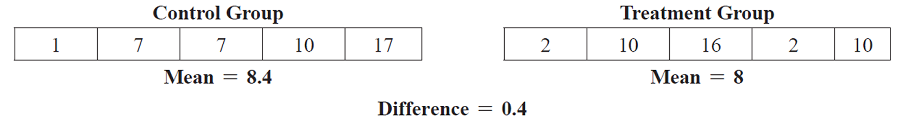
```


4. If you were to do another random allocation, would you get the same difference in means? Explain.

5. Now, perform nine more random allocations, each time computing and writing down the difference in mean worm count between the control group and the treatment group. Make a dotplot of the 10 differences. What proportion of these differences are 7.6 or larger?

6. If you performed the simulation many times, would you expect a large percentage of the simulations to result in a mean difference greater than 7.6? Explain.

The reasoning in the previous activity leads us to the randomization test and an interpretation of the fundamental question for inference. The fundamental question for this context is as follows: “If the null hypothesis were actually true and we randomly allocated our 10 mice to treatment and control groups many times, what proportion of the time would the observed difference in means be as big as or bigger than 7.6?” 

This long-run proportion is a probability that statisticians call the **$p$-value** of the randomization test. The $p$-values for most randomization tests are found through simulations. Despite the fact that simulations do not give exact $p$-values, they are usually preferred over the tedious and time-consuming process of listing all possible outcomes. Researchers usually pick a round number such as 10,000 repetitions of the simulation and approximate the $p$-value accordingly. Since this $p$-value is an approximation, it is often referred to as the **empirical $p$-value**.


\textbf{\textcolor{blue}{Key Concept:}}
\textcolor{blue}{Assuming that nothing except the random allocation process is creating group differences, the $p$-value of a randomization test is the probability of obtaining a group difference as large as or larger than the group difference actually observed in the experiment.}


\textbf{\textcolor{blue}{Key Concept:}} \textcolor{blue}{The calculation of an empirical $p$-value requires these steps:
\begin{itemize}
\item Repeat the random allocation process a number of times (N times).
\item Record, each time, whether or not the group difference exceeds or is the same as the one observed in the actual experiment (let X be the number of times the group difference exceeds or is the same as the one observed).
\item Compute X/N to get the $p$-value, the proportion of times the difference exceeds or is the same as the observed difference.
\end{itemize}}


>**NOTE** Many researchers include the observed value as one of the possible outcomes. In this case, N = 9999 iterations are typically used and the $p$-value is calculated as (X + 1)/(9999 + 1). The results are very similar whether X/10,000 or (X + 1)/(9999 + 1) is used. Including the observed value as one of the possible allocations is a more conservative approach and protects against getting a $p$-value of 0. Our observation from the actual experiment provides evidence that the true $p$-value is greater than zero.


## Performing a Randomization Test Using a Computer Simulation

While physical simulations (such as the index cards activity) help us understand the process of computing an empirical $p$-value, using computer software is a much more efficient way of producing an empirical $p$-value based on a large number of iterations. If you are simulating 10 random allocations, it is just as easy to use index cards as a computer. However, the advantage of a computer simulation is that 10,000 random allocations can be conducted in almost the same amount of time it takes to simulate 10 allocations. In the following steps, you will develop a program to calculate an empirical $p$-value.


### Activity: Using Computer Simulations to Conduct a Hypothesis Test{-}
7. Use the technology instructions with this text to insert the schistosomiasis data into a statistical software package and randomly allocate each of the 10 female worm counts to either the treatment or the control group.

8. Take the control group average minus the K11777 treatment group average.

9. Use the instructions to write a program, function, or macro to repeat the process 10,000 times. Count the number of simulations where the difference between the group averages (control minus K11777) is greater than or equal to 7.6, divide that count by 10,000, and report the resulting empirical $p$-value.

10. Create a histogram of the 10,000 simulated differences between group means and comment on the shape of the histogram. This histogram, created from simulations of a randomization test, is called an empirical randomization distribution. This distribution describes the frequency of each observed difference (between the control and treatment means) when the null hypothesis is true.

11. Based on your results in Questions 9 and 10 and assuming the null hypothesis is true, about how frequently do you think you would obtain a mean difference as large as or larger than 7.6 by random allocation alone?

12. Does your answer to Question 11 lead you to believe the “chance alone” position (i.e., the null hypothesis that the mean worm count is the same for both the treatment and the control), or does it lead you to believe that K11777 has a positive inhibitory effect on the schistosome worm in female mice? Explain.


Figure 1.2 shows a histogram resulting from the previous activity. A computer simulation of Question 9 resulted in a $p$-value of 281/10,000 = 0.0281. This result shows that random allocation alone would produce a mean group difference as large as or larger than 7.6 only about 3% of the time, suggesting that something other than chance is needed to explain the difference in group means. Since the only other distinction between the groups is the presence or absence of treatment, we can conclude that the treatment causes a reduction in worm counts.

We conducted four more simulations, each with 10,000 iterations, which resulted in $p$-values of 0.0272, 0.0282, 0.0268, and 0.0285. When the number of iterations is large, the empirical randomization distribution (such as the histogram created in Question 10) provides a precise estimate of the likelihood of all possible values of the difference between the control and treatment means. Thus, when the number of iterations is large, well-designed simulation studies result in empirical $p$-values that are fairly accurate. The larger the numberof iterations (i .e., randomizations) within a simulation study, the more precise the $p$-value is.


```{r graph2,warning=FALSE,echo=FALSE,message=FALSE, fig.height = 3, fig.cap =  "Histogram showing the results of a schistosomiasis simulation study. In this simulation, 281 out of 10,000 resulted in a difference greater than or equal to 7.6. "}

set.seed(123)
control_values <- c(1,7,7,10,17) 
k11777_values <- c(2,10,16,2,10)


all_values <- c(control_values, k11777_values)


n_control <- length(control_values)
n_k11777 <- length(k11777_values)

# Observed difference
obs_diff <- mean(control_values) - mean(k11777_values)


set.seed(123)
n_sim <- 10000
count_extreme <- 0

values<-c()
for (i in 1:n_sim) {
  random <- sample(all_values)  
  group1 <- random[1:n_control]
  group2 <- random[(n_control + 1):(n_control + n_k11777)]
  
  diff <- mean(group1) - mean(group2)
  values<-c(values,diff)
  if (diff >= 7.6) {
    count_extreme <- count_extreme + 1
  }
}

# Empirical p-value
empirical_p <- count_extreme / n_sim
#paste("Empirical p-value:", empirical_p)

ggplot(data.frame(values), aes(x = values)) +
  geom_histogram(bins = 20, fill = "blue", color = "black") +
  geom_vline(xintercept = 7.6, color = "black", linetype = "dashed", linewidth = 1) +
  labs(
    x = "Control Mean - Treatment Mean",
    y = "Frequency"
  )
```


Because the sample sizes in the schistosomiasis study are small, it is possible to apply mathematical methods to obtain an **exact $p$-value** for this randomization test. An exact $p$-value can be calculated by writing down the set of all possibilities (assuming each possible outcome is equally likely under the null hypothesis) and then calculating the proportion of the set for which the difference is at least as large as the observed difference.

In the schistosomiasis study, this requires listing every possible combination in which five of the 10 female mice can be allocated to the treatment (and the other five assigned to the control). There are 252 possible combinations. For each of these combinations, the difference between the treatment and control means is then calculated. The exact $p$-value is the proportion of times in which the difference in the means is at least as large as the observed difference of 7.6 worms. Of these 252 combinations, six have a mean difference of 7.6 and one has a mean difference greater than 7.6 (namely 8.8). Since all 252 of these random allocations are equally likely, the exact $p$-value in this example is 7/252 = 0.0278. However, most real studies are too large to list all possible samples. Randomization tests are almost always adequate, providing approximate $p$-values that are close enough to the true $p$-value.


>**CAUTION:**
Conducting a two-sample t-test on the female mice provides a $p$-value of 0.011. This $p$-value of 0.011 is accurate only if the observed test statistic (i.e., the difference between means) follows appropriate assumptions about the distribution. Figure 1.2 demonstrates that the distributional assumptions are violated. While the randomization test provides an approximate $p$-value “close to 0.0278,” it provides a much better estimate of the exact $p$-value than does the two-sample t-test. Note that each of the five simulations listed gave a $p$-value closer to the exact $p$-value than the one given by the two-sample t-test. \textit{Be careful not to trust a $p$-value provided by statistical software unless you are certain the appropriate assumptions are met.}


\textbf{\textcolor{blue}{Key Concept:}}
\textcolor{blue}{The larger the number of randomizations within a simulation study, the more precise the $p$-value is. When sample sizes are small or sample data clearly are not normal, a $p$-value derived from a randomization test with 10,000 randomizations is typically more accurate than a $p$-value calculated from a parametric test (such as the t -test).}


Sometimes we have some threshold $p$-value at or below which we will reject the null hypothesis and conclude in favor of the alternative. This threshold value is called a significance level and is usually denoted by the Greek letter alpha ($\alpha$). Common values are $\alpha$ = 0.05 and $\alpha$ = 0.01, but the value will depend heavily
on context and on the researcher’s assessment of the acceptable risk of stating an incorrect conclusion. When the study’s $p$-value is less than or equal to this significance level, we state that the results are statistically significant at level A. If you see the phrase “statistically significant” without a specification of $\alpha$ the writer is most likely assuming $\alpha$ = 0.05, for reasons of history and convention alone. However, it is best to show the $p$-value instead of simply stating a result is significant at a particular $\alpha$-level.

## Two-Sided Tests

The direction of the alternative hypothesis is derived from the research hypothesis. In this K11777 study, we enter the study expecting a reduction in worm counts and hoping the data will bear out this expectation. It is our expectation, hope, or interest that drives the alternative hypothesis and the randomization calculation. Occasionally, we enter a study without a firm direction in mind for the alternative, in which case we use a two-sided alternative. Furthermore, even if we hope that the new treatment will be better than the old treatment or better than a control, we might be wrong—it may be that the new treatment is actually worse than the old treatment or even harmful (worse than the control). Some statisticians argue that a conservative objective approach is toalw ays consider the two-sided alternative. For a **two-sided test**, the $p$-value must take into account extreme values of the test statistic in either direction (no matter which direction we actually observe in our sample data)


\textbf{\textcolor{blue}{Key Concept:}}
\textcolor{blue}{The direction of the alternative hypothesis does not depend on the sample data, but instead is determined by the research hypothesis before the data are collected.}


We will now make our definition of the $p$-value more general to allow for a wider variety of significance testing situations. The **$p$-value** is the probability of observing a group difference as extreme as or more extreme than the group difference actually observed in the sample data, assuming that there is nothing creating group
differences except the random allocation process.


### Activity: A Two-Sided Hypothesis Test{-}

13. Run the simulation study again to find the empirical $p$-value for a two-sided hypothesis test to determine if there is a difference between the treatment and control group means for female mice.

14. Is the number of simulations resulting in a difference greater than or equal to 7.6 identical to the number of simulations resulting in a difference less than or equal to -7.6? Explain why these two values are likely to be close but not identical.

15. Explain why you expect the $p$-value for the two-sided alternative to be about double that for the onesided alternative. Hint: You may want to look at Figure 1.2
16. Using the two-sided alternative hypothesis, the two-sample t-test provides a $p$-value of 0.022.^[When we do not assume equal variances Minitab uses 7 degrees of freedom providing a $p$-value of 0.022 while R uses 7.929 degrees of freedom resulting in a $p$-value of 0.0194.] This $p$-value would provide strong evidence for rejecting the assumption that there is no difference between the treatment and the control (null hypothesis). However, this $p$-value should not be used to draw conclusions about this study. Explain why.

For the above study, a simulation involving 100,000 iterations provided an empirical $p$-value of 0.0554. Again, because this particular data set is small, all 252 possible random allocations can be listed to find that the exact two-sided $p$-value is 14/252 = 0.0556.


## What Can We Conclude from the Schistosomiasis Study?

The key question in this study is whether K11777 will reduce the spread of a common and potentially deadly disease. The result that you calculated from the one-sided randomization hypothesis test should have been close to the exact $p$-value of 0.0278. This small $p$-value allows you to reject the null hypothesis and conclude that the worm counts are lower in the female treatment group than in the female control group. In every study, it is important to consider how random allocation and random sampling impact the conclusions.

\begin{itemize}
\item  {\textbf{Random allocation}: The schistosomiasis study was an \textbf{experiment} because the units (female mice) were randomly allocated to treatment or control groups. To the best of our knowledge this experiment controlled for any outside influences and allows us to state that there is a cause and effect relationship between the treatment and response. Therefore, we can conclude that K11777 did cause a reduction in the average number of schistosome parasites in these female mice.}

\item {\textbf{Random sampling}: Mice for this type of study are typically ordered from a facility that breeds and raises lab mice. It is possible that the mice in this study were biologically related or were exposed to something that caused their response to be different from that of other mice. Similarly, there are risks in simply assuming that male mice have the same response as females, so the end-of-chapter exercises provide an opportunity to conduct a separate test on the male mice. Since our sample of 10 female mice was not selected at random from the population of all mice, we should question whether the results from this study hold for all mice.}
\end{itemize}

More importantly, the results have not shown that this new drug will have the same impact on humans as it does on mice. In addition, even though we found that K11777 does cause a reduction in worm counts, we did not specifically show that it will reduce the spread of the disease. Is the disease less deadly if only two worms are in the body instead of 10? Statistical consultants aren’t typically expected to know the answers to
these theoretical, biological, or medical types of questions, but they should ask questions to ensure that the study conclusions match the hypothesis that was tested. In most cases, drug tests require multiple levels of studies to ensure that the drug is safe and to show that the results are consistent across the entire population of
interest. While this study is very promising, much more work is needed before we can conclude that K11777 can reduce the spread of schistosomiasis in humans.


## Permutation Tests versus Randomization Tests

The random allocation of experimental units (e.g., mice) to groups provides the basis for statistical inference in a randomized comparative experiment. In the schistosomiasis K11777 treatment study, we used a significance test to ascertain whether cause and effect was at work. In the context of the random allocation study design,
we called our significance test a randomization test.

In **observational studies**, subjects are not randomly allocated to groups. In this context, we apply the same inferential procedures as in the previous experiment, but we commonly call the significance test a **permutation test** rather than a randomization test.^[This text defines a randomization test as a permutation test that is based on random allocation. Some statisticians do not distinguish between permutation tests and randomization tests. They call simulation studies permutation tests, whether they are based on observational studies or experiments.] More importantly, in observational studies, the results of the test cannot typically be used to claim cause and effect; a researcher should exhibit more caution in the interpretation of results.


>**Note**The permutation test does not require that the data (or the sampling distribution) follow a normal distribution. However, the null hypothesis in a permutation test assumes that samples are taken from two populations
that are similar. So, for example, if the two population variances are very different, the $p$-value of a permutation test may not be reliable. However, the two-sample t-test (taught in most introductory courses) allows us to assume unequal variances.


\textbf{\textcolor{blue}{Key Concept:}}
\textcolor{blue}{Whereas in experiments units are randomly allocated to treatment groups, observational studies do not impose a treatment on a unit. Because the random allocation process protects against potential biases caused by extraneous variables, experiments are often used to show causation.}


### Age Discrimination Study{-}

Westvaco is a company that produces paper products. In 1991, Robert Martin was working in the engineering department of the company’s envelope division when he was laid off in Round 2 of several rounds of layoffs by the company.$^3$ He sued the company, claiming to be the victim of age discrimination. The ages of the 10 workers involved in Round 2 were: 25, 33, 35, 38, 48, 55, 55, 55, 56, and 64. The ages of the three people laid off were 55, 55, and 64.

Figure 1.3 shows a comparative dotplot for age by layoff category. This dotplot gives the impression that Robert Martin may have a case: It appears as if older workers were more likely to be laid off. But we know enough about variability to be cautious.

```{r graph3, echo=FALSE, out.width="80%", fig.align="center",fig.cap =  "Dotplot of age in years of worker versus layoff (whether he or she was laid off)."}
knitr::include_graphics("docs/Fig1_3.png")
```


### Activity: Is There Evidence of Age Discrimination?{-}

Data set: \texttt{Age}

17. Conduct a permutation test to determine whether the observed difference between means is likely to occur just by chance. Use `Age` as the response variable and `Layoff` as the explanatory variable. Here we are interested in only a one-sided hypothesis test to determine if the mean age of people who were laid off is higher than the mean age of people who were not laid off.

18. Modify the program/macro you created in Question 17 to conduct a one-sided hypothesis test to determine if the median age of people who were laid off is higher than the median age of people who were not laid off. Report the $p$-value and compare your results to those in Question 17.


Since there was no random allocation (i.e., people were not randomly assigned to a layoff group), statistical significance does not give us the right to assert that greater age is *causing* a difference in being laid off. The null hypothesis in this context becomes “The observed difference could be explained as if by random allocation alone.” That is, we proceed as any practicing social scientist must when working with observational data. We “imagine” an experiment in which workers are randomly allocated to a layoff group and then determine if the observed average difference between the ages of laid-off workers and those not laid off is significantly larger than would be expected to occur by chance in a randomized comparative experiment.

While age could be the cause for the difference—hence proving an allegation of age discrimination— there are many other possibilities (i.e., extraneous variables), such as the educational levels of the workers, their competence to do the job, and ratings on past performance evaluations. Rejecting the “as if by random allocation” hypothesis in the nonrandomized context can be a useful step toward establishing causality; however, it cannot establish causality unless the extraneous variables have been properly accounted for. 

In the actual court case, data from all three rounds of layoffs were statistically analyzed. The analysis showed some evidence that older people were more likely to be laid off; however, Robert Martin ended up settling out of court.


## Permutation and Randomization Tests for Matched Pairs Designs
The ideas developed in this chapter can be extended to other study designs, such as a basic two-variable design called a **matched pairs design**. In a matched pairs design, each experimental unit provides both measurements in a study with two treatments (one of which could be a control). Conversely, in the completely randomized situation of the schistosomiasis K11777 treatment study, half the units were assigned to control and half to treatment; no mouse received both treatments.


### Music and Relaxation{-}

Grinnell College students Anne Tillema and Anna Tekippe conducted an experiment to study the effect of music on a person’s level of relaxation. They hypothesized that fast songs would increase pulse rate more than slow songs. The file called Music contains the data from their experiment. They decided to use a person’s pulse rate as an operational definition of the person’s level of relaxation and to compare pulse rates for two selections of music: a fast song and a slow song. For the fast song they chose “Beyond” by Nine Inch Nails, and for the slow song they chose Rachmaninoff’s “Vocalise.” They recruited 28 student subjects for the experiment.

Anne and Anna came up with the following experimental design. Their fundamental question
involved two treatments: (1) listening to the fast song and (2) listening to the slow song. They could have randomly allocated 14 subjects to hear the fast song and 14 subjects to hear the slow song, but their more efficient approach was to have each subject provide both measurements. That is, each subject listened to both songs, giving rise to two data values for each subject, called a matched pairs. Randomization came into play when it was decided by a coin flip whether each subject would listen first to the fast song or the slow song.


>**NOTE** There are several uses of randomness mentioned in this chapter. The emphasis of this chapter is on the use of \textbf{randomization tests} for statistical inference. Most introductory statistics courses discuss random \textbf{sampling} from a population, which allows the results of a specific study to be generalized to a larger
population. In experiments, units are \textbf{randomly allocated to groups} which allows researchers to make statements about causation. In this example, Anne and Anna \textbf{randomize the order} to prescribe two conditions on a single subject.


Specifically, as determined by coin flips, half the subjects experienced the following procedure:

 - one minute of rest; measure pulse (prepulse)] 
 - listen to fast song for 2 minutes; measure pulse for second minute (fast song pulse)]
 - [rest for one minute] 
 - [listen to slow song for 2 minutes; measure pulse for second minute (slow song pulse)].


The other half experienced the procedure the same way except that they heard the slow song first and the fast song second.

Each subject gives us two measurements of interest for analysis: (1) fast song pulse minus prepulse and (2) slow song pulse minus prepulse. In the data file, these two measurements are called `Fastdiff` and `Slowdiff`, respectively.

Figure 1.4 shows a dotplot of the 28 `Fastdiff`-minus-`Slowdiff` values. Notice that positive numbers predominate and the mean difference is 1.857 beats per minute, both suggesting that the fast song does indeed heighten response (pulse rate) more than the slow song. We need to confirm this suspicion with a randomization test.

To perform a randomization test, we mimic the randomization procedure of the study design. Here, the randomization determined the order in which the subject heard the songs, so randomization is applied to the two measurements of interest for each subject. To compute a $p$-value, we determine how frequently we would obtain an observed difference as large as or larger than 1.857.


```{r graph4, echo=FALSE, out.width="80%", fig.align="center",fig.cap =  "Dotplot of the difference in pulse rates for each of the 28 subjects."}
knitr::include_graphics("docs/Fig1_4.png")
```


```{r graph4b, eval=FALSE,echo=FALSE,fig.cap="Dotplot of the difference in pulse rates for each of the 28 subjects."}

data("C1Music")
data<-C1Music

ggplot(data, aes(x = Fastdiff_Minus_Slowdiff)) +
  geom_dotplot(
    binaxis = 'x',
    dotsize = 1
  ) +
  theme_minimal() +
  labs( x = "Fastdiff-Slowdiff",y=NULL) 
```


### Activity: Testing the Effect of Music on Relaxation{-}
Data set: `Music`

19. Before they looked at the data, Anne and Anna decided to use a one-sided test to see whether fast music increased pulse rate more than slow music. Why is it important to determine the direction of the test before looking at the data?

20. Create a simulation to test the Music data. Use the technology instructions provided to randomly multiply a 1 or a -1 by each observed difference. This randomly assigns an order (`Fastdiff -  Slowdiff` or `Slowdiff - Fastdiff`). Then, for each iteration, calculate the mean difference. The $p$-value is the proportion of times your simulation found a mean difference greater than or equal to 1.857.
  a. Create a histogram of the mean differences. Mark the area on the histogram that represents your $p$-value.\\
  b.item Use the $p$-value to state your conclusions in the context of the problem. Address random allocation and random sampling (or lack of either) when stating your conclusions.
  
>**CAUTION**: The type of randomization in Question 20 does not account for extraneous variables such as a great love for Nine Inch Nails on the part of some students or complete boredom with this band on the part of others (i.e., “musical taste” is a possible confounder that randomizing the order of listening cannot randomize away). There will always be a caveat in this type of study, since we are rather crudely letting one Nine Inch Nails song “represent” fast songs.}


## The Bootstrap Distribution


Bootstrapping is another simulation technique that is commonly used to develop confidence intervals and hypothesis tests. Bootstrap techniques are useful because they generalize to situations where traditional methods based on the normal distribution cannot be applied. For example, they can be used to create confidence intervalsand hypothesis tests for any parameter of interest, such as a median, ratio, or standard deviation. Bootstrap methods differ from previously discussed techniques in that they sample **with replacement** (randomly draw
an observation from the original sample and put the observation back before drawing the next observation).

Permutation tests, randomization tests, and bootstrapping are often called **resampling techniques** because, instead of collecting many different samples from a population, we take repeated samples (calledr esamples) from just one random sample.


### Activity: Creating a Sampling Distribution and a Bootstrap Distribution{-}

Data set: `ChiSq`

21. The file ChiSq contains data from a highly skewed population (with mean 0.9744 and standard
deviation 1.3153).
  a. Take 1000 simple random samples of size 40 and calculate each mean (x). Plot the histogram of the 1000 sample means. The distribution of sample means is called the sampling distribution.
  b. What does the central limit theorem tell us about the shape, center, and spread of the sampling distribution in this example?
  c. Calculate the mean and standard deviation of the sampling distribution in Part A. Does the sampling distribution match what you would expect from the central limit theorem? Explain.

22. Take one simple random sample of size 40 from the ChiSq data.
  a. Take 1000 resamples (1000 samples of 40 observations with replacement from the one simple random sample).
  b. Calculate the mean of each resample (x*) and plot the histogram of the 1000 resample means. This distribution of resample means is called the bootstrap distribution.
  c. Compare the shape, center, and spread of the simulated histograms from Part B and Question 21 Part A. Are they similar?

23. Instead of using the sample mean, create a sampling distribution and bootstrap distribution of the standard deviation of the ChiSq data using a sample size of 40. Compare the shape, center, and spread of the simulated histograms and compare the mean and standard deviation of the distributions.


\textbf{\textcolor{blue}{Key Concept:}}
\textcolor{blue}{The bootstrap method takes one simple random sample of size n from a population. Then many resamples (with replacement) are taken from the original simple random sample. Each resample is the same size as the original random sample. The statistic of interest is calculated from each resample and used to create a bootstrap distribution.}


In many real-world situations, the process used in Question 21 is not practical because collecting more than one simple random sample is too expensive or time consuming. While the approach in Question 22 is computer intensive, it is simple and convenient since it uses only one simple random sample. The key idea behind bootstrap methods is the assumption that the original sample represents the population, so resamples from the one simple random sample can be used to represent samples from the population, as is done in Question 22. Thus, the bootstrap distribution provides an approximation of the sampling distribution.

Most traditional methods of statistical inference involve collecting one sample and calculating the sample mean. Then, based on the central limit theorem, assumptions are made about the shape and spread of the sampling distribution. In Question 22 we used one sample to calculate the sample mean and then used the bootstrap distribution to estimate the shape and spread of the sampling distribution.

The central limit theorem tells us about the shape and spread of the sample mean. A key advantage of the bootstrap distribution is that it works for any parameter of interest. Thus, the bootstrap distribution can be used to estimate the shape and spread for any sampling distribution of interest.


>**CAUTION**: When sample sizes are small, one simple random sample may not represent the population very well.Ho wever, with larger sample sizes, the bootstrap distribution does represent the sampling distribution.}


Figure 1.5 shows the sampling distribution and the bootstrap distribution when a sample size of 10 is used to estimate the mean of the `ChiSq` data. Notice that the spreads for both histograms are roughly equivalent. The central limit theorem tells us that the standard deviation of the sampling distribution (the distribution of $\bar{x}$ ) should be $\sigma / \sqrt{n}$ = $1.3153/ \sqrt{10}$ = 0.4159. The standard deviation of the bootstrap distribution is 0.4541, which is a reasonable estimate of the standard deviation of the sampling distribution. In addition, both graphs have similar, right-skewed shapes. The strength of the bootstrap method is that it provides accurate estimates of the shape and spread of the sampling distribution. In general, histograms from the bootstrap distribution will have a similar shape and spread as histograms from the sampling distribution.


```{r graph5, warning=FALSE, echo=FALSE,fig.cap="(a) The sampling distribution of the sample mean. The histogram is based on the mean of 10,000 samples of size 10 from the `ChiSq` data. (b) The bootstrap distribution of the sample mean. The histogram is based on the mean of 10,000 resamples (with replacement) of one simple random sample of the `ChiSq` data with mean 1.238 and standard deviation 1.490."}

knitr::include_graphics("docs/Fig1_5.png")


```


The bootstrap method does not improve our estimate of the population mean. The mean of the sampling distribution in Question 21 will typically be very close to the population mean. But the mean of the bootstrap distribution in Question 22 typically will not be as accurate, because it is based on only one simple random sample. Ideally, we would like to know how close the statistic from our original sample is to the population parameter. A statistic is biased if it is not centered at the value of the population parameter. We can use the bootstrap distribution to estimate the bias of a statistic. The difference between the original sample mean and the bootstrap mean is called the **bootstrap estimate of bias**.


\textbf{\textcolor{blue}{Key Concept:}}
\textcolor{blue}{The estimate of the mean (or any parameter of interest) provided by the bootstrap distribution is not any better than the estimate provided by the observed statistic from the original simple random sample. However, the shape and spread of the bootstrap distribution will be similar to the shape and spread of the sampling distribution. The bootstrap technique can be used to estimate sampling distribution shapes and standard deviations that cannot be calculated theoretically.}

## Using Bootstrap Methods to Create Confidence Intervals

A **confidence interval** gives a range of plausible values for some parameter. This is a range of values surrounding an observed estimate of the parameter—an estimate based on the data. To this range of values we attach a level of confidence that the true parameter lies in the range. An alpha-level, $\alpha$, is often used to specify the level of confidence. For example, when $\alpha$ = 0.05, we have a 100(1 - $\alpha$), = 95$\%$ confidence level. Thus, a 100(1 - $\alpha$), confidence interval gives an estimate of where we think the parameter is and how precisely we have it pinned down.


### Bootstrap t Confidence Intervals {-}

If the bootstrap distribution appears to be approximately normal, it is typically safe to assume that a t-distribution can be used to calculate a 100(1 - $\alpha$), confidence interval for $\mu$, often called a bootstrap t confidence interval:

\begin{equation} 
  \bar{x} \pm t^*\left(S^*\right)
  \tag{1.1} \label{eq:1_1}
\end{equation} 

where $S^*$ is the standard deviation of the bootstrap distribution and $t^*$ is the critical value of the t-distribution with n - 1 degrees of freedom.

The one simple random sample of size n = 10 used to create the bootstrap distribution in Figure 1.5b has a mean of $\bar{x}$ = 1.238 and a standard deviation of s = 1.490. The bootstrap distribution in Figure 1.5b has a mean of $\bar{x}^*$ = 1.249 and a standard deviation of $S^*$ = 0.4541. Notice that Formula (1.1) uses the mean from the original sample but uses the bootstrap distribution to estimate the spread. If we *incorrectly assume* that the sampling distribution in Figure 1.5 is normal, a 95% bootstrap t confidence interval for $\mu$ is given by


\begin{equation} 
  \bar{x} \pm t^*\left(S^*\right) = 1.238 \pm 2.262(0.4541)
  \tag{}
\end{equation}

where $t^*$ = 2.262 is the critical value corresponding to the 97.5th percentile of the t-distribution with n - 1 = 9 degrees of freedom. Thus, the 95% confidence interval for $\mu$ is (0.211, 2.265).

>**MATHMATICAL NOTE** The bootstrap t confidence interval is similar to the traditional one-sample t confidence interval. The key difference is that the bootstrap distribution estimates the standard error of the statistic with S* instead of $s/ \sqrt{n}$.

When the data are not skewed and have no clear outliers, parametric tests are very effective with relatively small sample sizes (10–30 observations may be enough to use the t-distribution). The following formula uses the t-distribution to calculate a 100(1 - $\alpha$), confidence interval for the mean of a normal population:

\begin{equation} 
  \bar{x} + t^*\left(\frac{s}{\sqrt{n}}\right)
  \tag{1.2} \label{eq:1_2}
\end{equation} 

where $s/\sqrt{n}$ is the standard error of $\bar{x}$ and $t^*$ is the critical value of the $t$-distribution with $n - 1$ degrees of freedom. Using the original sample of size 10 with mean 1.238 and standard deviation 1.490, we find that a 95% confidence interval for $\mu$ is  (0.172, 2.304). 

However, this confidence interval is appropriate for sample means only when the sampling distribution is approximately normal. If the data are skewed, even
sample sizes greater than 30 may not be large enough to make the sampling distribution appear normal.


With skewed data or small sample sizes (if the original data are not normally distributed), parametricmethods  (which are based on the central limit theorem) are not appropriate. In Figure 1.5 we see that the sampling distribution is skewed to the right. *Thus, with a sample size of 10, neither the traditional onesample
t confidence interval nor the bootstrap t confidence interval is reliable in this example*. However, with a sample size of 40, the histograms in Questions 21 and 22 should tend to look somewhat normally distributed.


### Bootstrap Percentile Confidence Intervals{-}

Bootstrap percentile confidence intervals are found by calculating the appropriate percentiles of the bootstrap distribution. To find a $100(1 - \alpha)\%$ confidence interval, take the $\alpha/2$ * 100 percentile of each tail of the bootstrap distribution. For example, to find a 95% confidence interval for $\mu$, sort all the observations from the bootstrap distribution and find the values that represents the 2.5th and 97.5th percentiles of the bootstrap distribution. The 2.5th percentile of the bootstrap distribution in Figure 1.5b is 0.546, and the 97.5th percentile is 2.282. Thus, a 95% confidence interval for $\mu$ is (0.546, 2.282).

Notice that the percentile confidence interval is not centered at the sample mean. Since the bootstrap distribution is right skewed, the right side of the confidence interval (2.282 - 1.238 = 1.044) is wider than the left side of the confidence interval (1.238 - 0.546 = 0.692). This lack of symmetry can influence the accuracy of the confidence interval.


\textbf{\textcolor{blue}{Key Concept:}}
\textcolor{blue}{A bootstrap percentile confidence interval contains the middle 100(1 - $\alpha$)$\%$ of the bootstrap distribution. If the bootstrap distribution is symmetric and is centered on the observed statistic (i.e., not biased), percentile confidence intervals work well.$^4$}


### When to Use Bootstrap Confidence Intervals{-}

Bootstrap methods are extremely useful when we cannot use theory, such as the central limit theorem, to approximate the sampling distribution. Thus, bootstrap methods can be used to create confidence intervals for essentially any parameter of interest, while the central limit theorem is limited to only a few parameters (such as the population mean).^[Theoretical methods allow distributional tests for more than just the population mean. However, for purposes of this text it is sufficient to understand that distributional methods tend to be more complicated and are limited to testing only a few parameters that could be of interest.] However, bootstrap methods are not always reliable.

Small sample sizes still produce problems for bootstrap methods. When the sample size is small, (1) the sample statistic may not accurately estimate the population parameter, (2) the distribution of sample means is less likely to be symmetric, and (3) the shape and spread of the bootstrap distribution may not accurately represent those of the true sampling distribution.

In addition, bootstrap methods do not work equally well for all parameters. For example, the end-ofchapter exercises show that bootstrapping often provides unreliable bootstrap distributions for median values because the median of a resample is likely to have only a few possible values. Thus, confidence intervals for medians should be used only with large (n $\geq$ 100) sample sizes.

It is not easy to determine whether bootstrap methods provide appropriate confidence intervals. The bootstrap t and bootstrap percentile confidence intervals are often compared to each other. While the percentile confidence interval tends to be more accurate, neither of the two should be used if the intervals are not relatively
close. If the bootstrap distribution is skewed or biased, other methods should be used to find confidence intervals. More advanced bootstrap methods (such as BCa and tilting confidence intervals) are available that are generally accurate when bias or skewness exists in the bootstrap distribution.[[[$^5$]]]


### Activity:Estimating Salaries of Medical Faculty{-}
Data set: `MedSalaries`

The file `MedSalaries` is a random sample of n = 100 salaries of medical doctors who were teaching at United States universities in 2009.

24. Create a bootstrap distribution of the mean by taking 1000 resamples (with replacement). Create a bootstrap t confidence interval and a bootstrap percentile distribution to estimate the mean salaries.
  a. Create a bootstrap distribution of the standard deviation by taking 1000 resamples (with replacement). Create a bootstrap t confidence interval and a bootstrap percentile distribution to estimate the population standard deviation.
  b. Use Formula (1.2) to create a 95$\%$ confidence interval for the mean. Compare this confidence interval to those in Part A. Would you expect these intervals to be similar? Why or why not?
  c. Explain why Formula (1.2) cannot be used to create a 95\% confidence interval for the standard deviation.

## Relationship Between the Randomization Test and the Two-Sample t-Test

R.A. Fisher, perhaps the preeminent statistician of the 20th century, introduced the randomization test in the context of a two-group randomly allocated experiment in his famous 1935 book, *Design of Experiments*.$^6$ At that time he acknowledged that the randomization test was not practical because of the computational
intensity of the calculation. Clearly, 1935 predates modern computing. Indeed, Efron and Tibshirani describe the permutation test as “a computer-intensive statistical technique that predates computers.”$^7$ Fisher went on to assert that the classical two-sample t-test (for independent samples) approximates the randomization test very well. Ernst cites references to several approximations to the randomization tests using classical and computationally tractable methods that have been published over time.$^8$

If you have seen two-sample tests previously, it is likely to have been in the context of what Ernst calls the population model, which he distinguishes from the randomization model. In a **population model**, units are selected at random from one or more populations. Most observational studies are population models. One simple case of a population model involves comparing two separate population means. In this case, we can take two independent simple random samples and use the classic two-sample t-test to make the comparison.


In a ***randomization model**, a fixed number of experimental units are randomly allocated to treatments. Most experiments are randomization models. In randomization models such as the schistosomiasis example, the two samples are formed from a collection of available experimental units that are randomly divided into two groups. Since there are a fixed number of units, the groups are not completely independent. For example, if one of the 10 male mice had a natural resistance to schistosomiasis and was randomly placed in the treatment group, we would expect the control group to have a slightly higher worm count. Since the two groups are not completely independent, the assumptions of the classic two-sample t-test are violated. Even if the sample sizes in the schistosomiasis study were much larger, the randomization test would be a more appropriate test than the two-sample t-test. However, empirical evidence has shown that the two-sample t-test is a very good approximation to the randomization test when sample sizes are large enough. We are fortunate that, in this age of modern computing, we no longer have to routinely compromise by using the t-test to approximate the randomization test.


\textbf{\textcolor{blue}{Key Concept:}}
\textcolor{blue}{Historically, the two-sample t -test was used to approximate the $p$-value in randomization models because randomization tests were too difficult to compute. However, now that computers can easily simulate random assignment to groups, randomization tests should be used to calculate $p$-values for randomization models, especially if sample sizes are fairly small.}


## Wilcoxon Rank Sum Tests for Two Independent Samples

The **Wilcoxon rank sum test**, also called the two-sample **Mann-Whitney test**, makes inferences about the difference between two populations based on data from two independent random samples. This test ranks observations from two samples by arranging them in order from smallest to largest.

Focusing on ranks instead of the actual observed values allows us to remove assumptions about the normal distribution. Rank-based tests have been used for many years. However, rank-based methods (discussed in this section and the next section) are much less accurate than methods based on simulations. In general, randomization tests, permutation tests, or bootstrap methods should be used whenever possible.

The following example examines whether pitchers and first basemen who play for National League baseball teams have the same salary distribution. The null and alternative hypotheses are written as,

\begin{center}$H_0$: the distribution of the salaries is the same for pitchers and first basemen
\end{center}

\begin{center}
$H_a$: the distribution of the salaries is different for pitchers and first basemen
\end{center}

Table 1.2 shows the salaries of five pitchers and five first basemen who were randomly selected from all National League baseball players. Table 1.3 ranks each of the players based on 2005 salaries. If two players had exactly the same salary, standard practice is to average the ranks of the tied values.


```{r table2,echo=FALSE,message=FALSE}
library(myfirstpackage)
data("C1NLBBSalaries")    # Load the dataset from the package
salaries <- C1NLBBSalaries


df<- salaries[salaries$Position %in% c('Pitcher','First Baseman'),1:4]
colnames(df)[which(colnames(df) == "Salary")] <- "Salary(\\$)"
kable(df, booktabs = TRUE,
      caption = "Randomly selected pitchers and first baseman from 2005 National League baseball teams.")


```


```{r table3}
df1<- salaries[salaries$Position %in% c('Pitcher','First Baseman'),1:4]
df1<-df1%>%mutate(Position= gsub("([A-Za-z])[a-z]*\\s*([A-Za-z])[a-z]*", "\\1\\2", Position), Salary=round(Salary/1000))
df1$Rank<- rank(df1$Salary, ties.method = "first")

df1<-df1[c(2,4,5)]
r1<-df1$Position
r2<-df1$Salary
r3<-df1$Rank
dfs<-data.frame(rbind(r1,r2,r3))
rownames(dfs)<-c("Position", "Salary", "Rank")
colnames(dfs)<-NULL
kable(dfs, booktabs = TRUE,caption="Ranking the 10 randomly selected 2005 National League baseball players.")
```


For the Wilcoxon rank sum test, we define the following terms:

* $n_1$ is the sample size for the first group (5 for the pitcher group in this example)
* $n_2$ is the sample size for the second group (5 for the first baseman group in this example)
* N= $n_1$  + $n_2$ 
* W, the Wilcoxon rank sum statistic, is the sum of the ranks in the first group
(1 + 2 + 3 + 4 + 8 = 18)

If the two groups are from the same continuous distribution, then W has a mean,

\begin{equation} 
  \mu_W = \frac{n_1(N+1)}{2} = \frac{5(11)}{2}=27.5
  \tag{1.3} \label{eq:1_3}
\end{equation} 

and standard deviation$^9$

\begin{equation} 
  \sigma_W = \sqrt{\frac{n_1n_2(N+1)}{12}} = \sqrt{\frac{(5)(5)(11)}{12}}= 4.787
  \tag{1.4} \label{eq:1_4}
\end{equation} 


If W is far from $\mu_W$, then the Wilcoxon rank sum test rejects the hypothesis that the two populations have identical distributions—that is, rejects $H_0$ (no difference in distribution of salaries) in favor of $H_a$ (salary distributions are different based on position). The $p$-value is the probability of observing a sample statistic, W, at least as extreme as the one in our sample. Since 18 is less than the hypothesized mean, 27.5, the $p$-value for the two-sided test in this example is found by calculating 2 * P(W $\leq$ 18).


>**MATHMATICAL NOTE** Computer software such as R, S-plus, or SAS tends to use the exact distribution of W, though Minitab uses a normal approximation for this test. If the data contain ties, the exact distribution for the Wilcoxon rank sum statistic changes and the standard deviation of W should be adjusted. Statistical software will typically detect the ties and use the normal distribution (using the adjusted standard deviation) instead of an exact distribution.$^{10}$


### Activity: *Wilcoxon Rank Sum Tests*{-}
Data set: `NLBB Salaries`
\begin{enumerate}
 \setcounter{enumi}{24}
 \item Using a software package, conduct the Wilcoxon rank sum test to determine if the distribution of salaries is different for pitchers than for first basemen.
 \item Find 2 X P(W $\leq$ 18) assuming W ~ N(27.5, 4.787). How does your answer compare to that from Question 25?
 \item Use a two-sided two-sample t-test (assume unequal variances) to analyze the data. Are your conclusions the same as in Question 25? Create an individual value plot of the data. Are any distributional assumptions violated? Which test is more appropriate to use for this data set?
\end{enumerate}


At first it may seem somewhat surprising that first basemen tend to make more than pitchers. However, in 2005 there were 19 first basemen and 215 pitchers in the National League. Many pitchers did not play much and got paid a low salary, whereas all 19 first basemen were considered quite valuable to their teams.


## Kruskal-Wallis Test for Two or More Independent Samples

The ***Kruskal-Wallis* test** is another popular nonparametric test that is often used to compare two or more independent samples. Like ANOVA, a more common parametric test that will be discussed in later chapters, the Kruskal-Wallis test requires independent random samples from each population. When the data clearly deviate from the normal distribution, the Kruskal-Wallis test will be more likely than a one-way ANOVA to identify true differences in the population. The null and alternative hypotheses for the Kruskal-Wallis test are:

\begin{center}
$H_0$: the distribution of the response variable is the same for all groups\\
$H_a$: some responses are systematically higher in some groups than in others
\end{center}

```{r table4}
dfc<-salaries[salaries$Position %in% c('Catcher'),1:4]

colnames(dfc)[which(colnames(dfc) == "Salary")] <- "Salary(\\$)"
kable(dfc,booktabs=TRUE,caption="Randomly selected catchers from 2005 National League baseball teams.")
```


The Kruskal-Wallis test is also based on ranks. The ranks are summed for each group, and when these group sums are far apart, we have evidence that the groups are different. While the calculations for the Kruskal-Wallis test statistic are provided here, we suggest using statistical software to conduct this significance test. Continuing the baseball salaries example, Table 1.4 displays salaries of five randomly selected catchers from 2005 National League baseball teams.


For the Kruskal-Wallis test, we define the following terms:

* $n_1$ is the sample size for the first group (5 for the pitcher group)
* $n_2$  is the sample size for the second group (5 for the first baseman group)
* $n_3$  is the sample size for the third group (5 for the catcher group)
* N = $n_1$ + $n_2$ + $n_3$
* $R_i$ is the sum of the ranks for the ith group ($R_1$ = 35, $R_2$ = 62, and $R_3$ = 23)


The Kruskal-Wallis test statistic is calculated as,


\begin{equation} 
  H = \frac{12}{N(N + 1)} \sum_{i=1}^k \frac{R_i^2}{n_i} - 3(N + 1) = \frac{12}{(15)(16)}(\frac{35^2}{5}+\frac{62^2}{5}+\frac{23^2}{5}) -3(16) =7.98
  \tag{1.5} \label{eq:1_5}
\end{equation} 

The exact distribution of H under the null hypothesis depends on each ni, so it is complex and time consuming to calculate. Even most statistical software packages use the chi-square approximation with I - 1 degrees of freedom to obtain $p$-values (where I is the number of groups).


>**NOTE:**When the chi-square approximation is used, each group should have at least five observations.


### Activity: Kruskal-Wallis Test{-}
Data set: `NLBB Salaries`

28. Using a software package, run the Kruskal-Wallis test (use all three groups with samples of size 5 per group) to determine if the distribution of salaries differs by position. Create an individual value plot of the data. Do the data look normally distributed in each group?


>**MATHMATICAL NOTE** {If the spread of each group appears to increase as the center (mean or median) increases, transforming the data—such as by taking the log of each response variable—will make the data appear much more normally distributed. Then parametric techniques can often be used on the transformed data. In the baseball salary example, the data are highly right skewed in at least two groups. While a log transformation on salaries is helpful, there is still not enough evidence that the transformed salaries are normally distributed. Thus, nonparametric methods are likely the most appropriate approach to testing whether there is a difference in the distribution of salaries based on position.
}


Nonparametric tests based on rank are usually less powerful (less likely to reject the null hypothesis) than the corresponding parametric tests. Thus, you are less likely to identify differences between groups when they really exist. If you are reasonably certain that the assumptions for the parametric procedure are satisfied, a parametric procedure should be used instead of a rank-based nonparametric procedure. Many introductory texts suggest that, in order to conduct a parametric test, you should have a sample size of 15 in each group and no skewed data or outliers.


## Multiple Comparisons

In introductory texts, statistical inference is often described in terms of drawing one random sample, performing one significance test, and then stating appropriate conclusions—analysis done, case closed. However, there are many situations where inference is not that simple. Performing multiple statistical tests on the same data set can create several problems.

Using a significance level of $\alpha$ = 0.05 (i.e., rejecting $H_0$ in favor of the alternative when the $p$-value is less than or equal to 0.05) helps to ensure that we won’t make a wrong decision. In other words, one time out of 20 we expect to incorrectly reject the null hypothesis. But what if we want to do 20 or more tests on the same data set? Does this mean that we’re sure to be wrong at least once? And if so, how can we tell which findings are incorrect? The following activities explore how researchers can protect themselves from drawing conclusions from statistical findings that could be the result of random chance.


### Activity: Comparing Car Prices{-}

\begin{enumerate}
  \setcounter{enumi}{28}

  \item Open the `Car1` data set and conduct three two-sided hypothesis tests to determine if there is a difference in price. Compare the means: Pontiac versus Buick (test 1), Cadillac versus Pontiac (test 2), and Cadillac versus Buick (test 3). Provide the $p$-value for each of these three tests. Which tests have a $p$-value less than 0.05?

  \item Assuming the null hypotheses are true, each of the three tests in Question 29 has a 5\% chance of inappropriately rejecting the null hypothesis. However, the probability that at least one of the three tests will inappropriately reject the null hypothesis is 14.26\%. Assuming that the null hypothesis is true and that each test is independent, complete the following steps to convince yourself that this probability is correct.
    \begin{enumerate}
      \item Each test will either reject (R) or fail to reject (F). List all eight possible outcomes in the table below.
```{r table30a}
df_kw <- data.frame(
  Case = 1:8,
  `Test_1` = c('F','F','F', '', '', '', '', ''),
  `Test_2` = c('F','F','R', '', '', '', '', ''),
  `Test_3` = c('F','R','F', '', '', '', '', ''),
  Probability = rep('', 8)
)


kable(df_kw,booktabs=TRUE)
```
      
      \item The probability that each test rejects is \( P(R) = 0.05 \), and the probability that each test fails to reject is \( P(F) = 0.95 \). For example, the probability that all three tests fail to reject is \( 0.95^3 = 0.8574 \). The probability that the first two fail to reject and the third does reject is \( 0.95 \times 0.95 \times 0.05 = 0.0451 \). Complete the table. Verify the probabilities sum to 1. The probability that at least one test rejects is \( 1 - 0.8574 = 0.1426 \).
    \end{enumerate}

  \item Repeat Question 30 using ( $\alpha$ = 0.10 ). What is the probability that at least one of the three tests will inappropriately reject the null hypothesis?

  \item To compare all four car makes, six hypothesis tests will be needed. List all six null hypotheses. Assuming independence and that the null hypothesis is true, what is the probability that at least one of the six tests will inappropriately reject the null hypothesis at \( \alpha = 0.05 \)?
\end{enumerate}


### Activity: The Least-Significant Differences Method and the Bonferroni Method{-}
Data set: `Car1`

When the significance level is controlled for each individual test, as was done in Question 29, the process is often called the **least-significant differences method (LSD)**. Notice that using a = 0.05 for all tests has some undesirable properties, especially when a large number of tests being conducted. If 100 independent tests were conducted to compare multiple groups (and there really were no differences), the probability of incorrectly rejecting at least one test would be 1 - 0.95$^{100}$ = 0.994. Thus, using $\alpha$= 0.05 as a critical value for 100 comparisons will almost always lead us to incorrectly conclude that some results are significantly different.

One technique that is commonly used to address the problem with multiple comparisons is called the ***Bonferroni method**. This technique protects against the probability of false rejection by using a cutoff value of $\alpha$/K, where K is the number of comparisons. In Question 29, there are three comparisons (i.e.,three hypothesis tests). Thus, a cutoff value of 0.05/3 = 0.01667 should be used. In other words, when there are three comparisons as in Question 29, the Bonferroni method rejects the null hypothesis when the $p$-value is less than or equal to 0.01667. Using the least-significant differences method ($\alpha$ = 0.05), as was done in Question 29, we would conclude that the prices of Buicks and Chevrolets are significantly different, but using the Bonferroni method we would fail to reject in all three tests.

\begin{enumerate}
  \setcounter{enumi}{32}
  \item Repeat Question 30 using the Bonferroni cutoff value of 0.05/3 = 0.016667 instead of $\alpha$ = 0.05. Find the probability that at least one of the tests rejects.
  \item Using all four groups of cars and $\alpha$ = 0.05 (cutoff of 0.05/6), do any of the six tests reject the null hypothesis with the Bonferroni method?
  \item If there were seven groups, 21 hypothesis tests would be needed to compare all possible pairs. Using $\alpha$ = 0.05 and the Bonferroni’s method (reject $H_0$ if the $p$-value is less than 0.05/21 = 0.00238) what is the probability that at least one of the tests would reject?
\end{enumerate}


>**MATHMATICAL NOTE** Other terms that are commonly discussed with multiple comparisons are **familywise type I error** and ***comparisonwise type I error**. Bonferroni’s method is an example of a technique that maintains the familywise type I error. With the familywise type I error 0.05, assuming that there really is no difference between any of the K pairs, there is only a 5% chance that any test will reject $H_0$. The least-significant differences method is used to maintain a comparisonwise type I error rate: Assuming that a particular null hypothesis test is true, there is a 5% chance we will (incorrectly) reject that particular hypothesis. Montgomery’s Design and Analysis of Experiments text provides more information on multiple comparisons.[[[$^{11}$]]]


### Choosing a Critical Value{-}
The $\alpha$-level represents the probability of a **type I error**. A type I error can be considered a false alarm: Our hypothesis test has led us to conclude that we have found a significant difference when one does not exist. However, it is important to recognize that it is also possible to make a **type II error**, which means our hypothesis test failed to detect a significant difference when one exists. In essence, a type II error can be thought of as an alarm that failed to go off.

Notice that if the Bonferroni method is used with all six tests, the critical value for each individual test is 0.05/6 = 0.00833. Thus, this method often fails to detect real differences between groups, leaving us open to a high rate of type II error while protecting us against type I errors.

Neither the least-significant differences nor the Bonferroni method is ideal. Caution should be used with both techniques, and neither technique should be used with numerous comparisons. The key is to recognize the benefits and limitations of each technique and to properly interpret what the results of each technique tell us. Some researchers suggest limiting the number of tests, using both techniques, and letting the reader decide which conclusions to draw. Both techniques are commonly used when there are fewer than 10 comparisons. However, a researcher should always decide which comparisons to test before looking at the data.


## Chapter Summary
This chapter described the basic concepts behind randomization tests, permutation tests, bootstrap methods, and rank-based nonparametric tests. **Parametric tests** (such as z-tests, t-tests or F-tests) assume that data follow a known a probability distribution or use the central limit theorem to make inferences about a population. **Nonparametric tests** do not require assumptions about the distribution of the population or the central limit theorem in order to make inferences about a population.

The **null hypothesis**, denoted $H_0$, states that in a study nothing is creating group differences except the random allocation process. The research hypothesis is called the **alternative hypothesis** and is denoted $H_a$ (or $H_1$). The $p$-value is the likelihood of observing a statistic at least as extreme as the one observed from the sample data when the null hypothesis is true. A threshold value, called a **significance level**, is denoted by the Greek letter alpha ($\alpha$). When a study’s $p$-value is less than or equal to this significance level, we state that the results are **statistically significant at level $\alpha$**. Exact $p$-values are often difficult to calculate, but ***empirical $p$-values** can often be simulated through a randomization or permutation test. The empirical $p$-value will become more precise as the number of randomizations within a simulation study
increases.

The steps in a **randomization test** are as follows:

* An experiment is conducted in which units are assigned to a treatment and an observed sample statistic is calculated (such as the difference between group means).
* Software is used to simulate the random allocation process a number of times (N iterations).
* For each iteration, the statistic of interest (difference between group means) is recorded, with X being
the number of times the statistic in the iteration exceeds or is the same as the observed statistic in the
actual experiment.
* X/N is computed to find the $p$-value, the proportion of times the statistic exceeds or is the same as the
observed difference.


A ***permutation test** is a more general form of the randomization test. The steps in both tests are identical, except that permutation tests do not require random allocation. Randomization tests and permutation tests can provide very accurate results. These tests are preferred over parametric methods when the sample size is small or when there are outliers in a data set. Since real data sets tend not to come from exactly normal populations, it is important to recognize that even $p$-values from parametric tests are approximate (but typically accurate as long as the sample sizes are large enough, the data are not skewed, there are no outliers, and the data are reasonably normal). A graph such as a boxplot or individual value plot should always be created to determine if parametric methods are appropriate. Randomization tests are gaining popularity because they require fewer assumptions and are just as powerful as parametric tests.

Bootstrap methods take many (at least 1000) resamples with replacement of the original sample to create a bootstrap distribution. If the bootstrap distribution is symmetric and unbiased, bootstrap t or bootstrap percentile confidence intervals can be used to approximate 100(1 - $\alpha$)%, confidence intervals.

The steps in creating **bootstrap confidence intervals** are as follows:

* One sample of size n is taken from a population and the statistic of interest is calculated.
* Software is used to take resamples (with replacement) of size n from the original sample a number of times (N iterations). For each iteration, the statistic of interest is calculated from the resample.
* The **bootstrap distribution**, which is the distribution of all N resample statistics, is used to estimate
the shape and spread of the sampling distribution.
* A **bootstrap t confidence interval** is found by calculating $\bar{x}$ $\pm t^*(S^*)$ where $S^*$ is the standard
deviation of the bootstrap distribution and $t^*$ is the critical value of the t(n - 1) distribution with
100(1 - $\alpha$)%, of the area between - t* and t*.
* A 100(1 - $\alpha$), bootstrap percentile confidence interval is found by taking the $\alpha$ / 2 * 100 percentile of each tail of the bootstrap distribution.


Bootstrap confidence intervals based on small samples can be unreliable. The bootstrap t or percentile confidence interval may be used if,

* the bootstrap distribution does not appear to be biased,
* the bootstrap distribution appears to be normal, and
* the bootstrap t and percentile confidence intervals are similar.

Simulation studies can easily be extended to testing other terms, such as the median or variance, whereas most parametric tests described in introductory statistics classes (such as the z-test and t-test) are restricted to testing for the mean. Simulation studies are an extremely useful tool that can fairly easily be used to calculate accurate $p$-values for research hypotheses when other tests are not appropriate.

Before computationally intensive techniques were easily available, rank-based nonparametric tests, such as the **Wilcoxon rank sum** test and the **Kruskal-Wallis test**, were commonly used. These tests do not require assumptions about distributions, but they tend to be less informative because ranks are used instead of the actual data. Both the Mann-Whitney test and the Kruskal-Wallis test assume that sample data are from independent random samples whose distributions have the same shape and scale. Each sample in the Kruskal-Wallis test should consist of at least five measurements. Rank-based nonparametric tests tend to be
less powerful (less likely to identify differences between groups) than parametric tests (when assumptions do hold) and resampling methods. When the sample sizes are small and there are reasons to doubt the normality assumption, rank-based nonparametric tests are recommended over parametric tests. Randomization tests and
permutation tests are typically preferred over parametric and rank-based tests. Their $p$-values are often more reliable, and they are more flexible in the choice of parameter tested.

One final note of caution: Even though it is possible to analyze the same data with a variety of parametric and nonparametric techniques, statisticians should never search around for a technique that provides the results they are looking for. Conducting multiple tests on the same data and choosing the test that provides the smallest $p$-value will cause the results to be unreliable. If possible, determine the type of analysis that will be conducted before the data are collected.

## Exercises{-}
\vspace{-2em}
\noindent\rule{\linewidth}{0.4pt}

\begin{enumerate}
  \setcounter{enumi}{35}

  \item Is it important in the schistosomiasis study for all 20 mice to come from the same population of mice? Why or why not?
  \item Assume the researchers in this study haphazardly pulled the female mice from a cage and assigned the first five to the treatment and the last five to the control. Would you trust the results of the study as much as if five mice were randomly assigned to each group?
  \item A recent study in the northwest United States found that children who watched more television were
more likely to be obese than children who watched less television. Can causation be inferred from
this study?
  \item What is the difference between a random sample and a randomized experiment?
  \item Explain the difference between a population model and a randomization model.
  \item Explain how the independence assumption of the two-sample t-test is violated in a randomization model.
  \item If the sample size is large, will the histogram of the sample data have a shape similar to that of the normal distribution? Explain.
  \item If the sample size is large, will the sample mean be normally distributed? Explain.
  \item Why should boxplots or other graphical techniques be used to visualize data before a parametric test
is conducted?
  \item Suppose that in our study of schistosomiasis in female mice the $p$-value was 0.85. Would you be able to conclude that there was no difference between the treatment and control means?
  \item \textbf{Using Other Test Statistics} \\
  Data set: \texttt{Mice} 
  
  One major advantage of randomization/permutation tests over classical methods is that they easily allow the use of test statistics other than the mean.
  \begin{enumerate}
    \item Modify the program/macro you created in Question 9 to measure a difference in group medians instead of a difference in means for the female mice. Report the $p$-value and compare your results to those for Question 9.
    \item You might also wonder if there is a difference in the variability in the groups. Modify the macro
you created in Question 9 to test whether the variances of the female groups are equal. Report the
$p$-value and state your conclusions
  \end{enumerate}
  
    
  \item \textbf{Testing Male Mice} \\
  Data set: \texttt{Mice} 
  \begin{enumerate}
    \item Using the data for the male mice, run a simulation to decide whether K11777 inhibits schistosome
viability (i.e., reduces worm count) in male mice. Describe the results, including a histogram
of the simulation results, the $p$-value, and a summary statement indicating your conclusion
about the research question of schistosome viability.
    \item Modify the program/macro you created in Part A to measure a difference in group medians
instead of a difference in means for the male mice. Report the $p$-value and compare your results
to those for Part A.
    \item You might also wonder if there is a difference in the variability in the groups. Modify the macro
you created in Part A to test if the variances of each male group are equal. Report the $p$-value and
state your conclusions.
  \end{enumerate}
  
  
  
  \item \textbf{Bird Nest Study} \\
  Data set: \texttt{Birdnest}
  
  This data set was collected in the spring of 1999 for a class project by Amy Moore, a Grinnell College student. Each record in the data set represents data for a species of North American passerine bird. Passerines are “perching birds” and include many families of familiar small birds (e.g., sparrows and warblers) as well as some larger species like crows and ravens, but do not include hawks, owls, water fowl, wading birds, and woodpeckers. Moore took all North American passerines for which complete evolutionary data were available, which comprised 99 of the 470 species of passerines in North America (part of her study used this evolutionary information). One hypothesis of interest was about the relationship of body size to type of nest. Body size was measured as average length of the species, nest type was categorized as either closed or open. Although nests come in a variety of types (see the `Nesttype` variable), in this data set “closed” refers to nests with only a small opening to the outside, such as the tree-cavity nest of many nuthatches or the pendant-style
nest of an oriole. “Open” nests include the cup-shaped nest of the American robin.
  \begin{enumerate}
      
    \item Moore suspected that closed nests tend to be built by larger birds, but here we will treat the alternative as two-sided, since her suspicion was based on scanty evidence. Use comparative dotplots or boxplots and summary statistics to describe the relationship between average body length and nest type (the `Closed` variable). (Note: `Closed` = 1 for closed nests; `Closed` = 0 for open nests.) Does it appear that Moore’s initial suspicion is borne out by the data?
of the simulation results, the $p$-value, and a summary statement indicating your conclusion about the research question of schistosome viability.
    \item Run a permutation test using a two-sided alternative to determine if type of nest varies by body length and interpret your results. Be sure to state your conclusions in the context of the problem and address how random allocation and random sampling (or lack of either) impact your conclusions.
  \end{enumerate}
  
  
  \item \textbf{Twins Brain Study} \\
  Data set: \texttt{Twins} 
  
  In a 1990 study by Suddath et al., reported in Ramsey and Schafer,$^{12}$ researchers used magnetic resonance imaging to measure the volume of various regions of the brain for a sample of 15 monozygotic twins, where one twin was affected with schizophrenia and the other was unaffected. The twins were from North America and comprised eight male pairs, and seven female pairs ranging
in age from 25 to 44 at the time of the study. The sizes in volume (cm$^3$) of the hippocampus are in the file called `Twins`.
  \begin{enumerate}
      
    \item Should the data be analyzed as match pairs or be treated as if there were two independent
samples?
    \item Use appropriate graphics and summary statistics to describe the difference in brain volume for
affected and unaffected twins.
    \item Use the appropriate permutation test to ascertain if the difference in brain volume described in
Part B is the result of schizophrenia or if it could be explained as a chance difference. Report
your $p$-value and summarize your conclusion.
  \end{enumerate}
  
  
  \item \textbf{Comparing Parametric and Nonparametric Tests} \\
  Data set: \texttt{Birdnest and Music}
  \begin{enumerate}
      
    \item Using a t-test, compute the two-sided $p$-value for the bird nest study in Question 48. and compare the results to what you found with the randomization test.
    \item Using a t-test, compute the one-sided $p$-value for the music study in Question 20 and compare the
results to what you found with the randomization test.
  \end{enumerate}
  
  
  
  
  \item \textbf{Means versus Medians in Rank-Based Tests} \\
  Data set: \texttt{SameMean}
  
  Rank-based nonparametric tests do not answer the same question as the corresponding parametric procedure. Many people assume that these nonparametric tests are testing for group medians. This is not always true. Rank-based tests can be interpreted as testing for the median only if the shapes and scales of the populations are the same. The following exercise illustrates this point by providing an example where the medians and the means are identical but nonparametric tests will reject the null hypothesis.

Use the `SameMean` data to conduct the Kruskal-Wallis test. Calculate the mean and median for each group. What conclusions can you draw from the data?
  
  
  
  
  \item \textbf{Rank Based Bird Nest Tests} \\
  Data set: \texttt{Birdnest}
  \begin{enumerate}
      
    \item Use the Wilcoxon rank sum test to conduct a significance test for the bird nest study discussed in
Question 48.
    \item Use the Kruskal-Wallis test to conduct a significance test for the bird nest study. Determine whether the distribution of bird size (response is Length) is the same for each nest type. Note that when the chi-square approximation is used, each group should have at least five observations. You may need to create an “other” group to combine all nest types with sample sizes less
than five.
  \end{enumerate}
  
  
  
  
  \item \textbf{Bootstrap Confidence Intervals} \\
  Data set: \texttt{ChiSq} 
  
  Take a simple random sample of size 40 from the `ChiSq` data file.
  \begin{enumerate}
      
    \item Create a bootstrap distribution of the mean (or use the distribution you created in Question 22). Calculate a 95% bootstrap t confidence interval for the mean.
    \item Create a bootstrap distribution of the mean (or use the distribution you created in Question 22). Calculate a 95% bootstrap percentile confidence interval for the mean. Are the bootstrap t and percentile confidence intervals for the mean reliable?
    \item Create a bootstrap distribution of the standard deviation (or use the distribution you created in Question 23). Calculate a 95% bootstrap t confidence interval for the standard deviation.
    \item Create a bootstrap distribution of the standard deviation (or use the distribution you created in Question 23). Calculate a 95% bootstrap percentile confidence interval for the standard deviation. Are the bootstrap t and percentile confidence intervals for the standard deviation
reliable?
  \end{enumerate}
  
  
  
  
  
  \item \textbf{Medians and Trimmed Means in Bootstrap Confidence Intervals} \\
  Data set: \texttt{ChiSq}
  \begin{enumerate}
      
    \item Take a simple random sample of size n = 40 from the ChiSq data. Create a bootstrap distribution of the median by taking 1000 resamples (with replacement). Describe the shape of the bootstrap distribution and explain why bootstrap confidence intervals are unlikely to be reliable.
    \item Take a second simple random sample of size n = 40 from the ChiSq data. Create a second bootstrap distribution of the median by taking 1000 resamples (with replacement). Describe the shape of the second bootstrap distribution. With a sample size of 40, why are bootstrap distributions of medians unlikely to be normal?
    \item Bootstrap distributions for medians are unlikely to be normally distributed, and means tend to be influenced by outliers. The trimmed mean is a common measure of center that tends to better represent the average value with bootstrap methods. Trimmed means are calculated by first trimming the upper and lower values of the sample. For example, the 25% trimmed mean is the mean
of the middle 50% of the sample data.

Take a simple random sample of size n = 40 from the ChiSq data. Create a bootstrap distribution of the 25% trimmed mean by taking 1000 resamples (with replacement). In other words, for each resample calculate the mean of the middle 20 observations (remove the smallest 10 and largest 10 values in each resample). Create a histogram of the 1000 trimmed means and describe the shape of this bootstrap distribution. Create a bootstrap t confidence interval and a bootstrap percentile confidence interval to estimate the 25% trimmed mean.
  \end{enumerate}
  
  
  
  
  
  \item \textbf{Medians and Trimmed Means in Bootstrap Confidence Intervals} \\
  Data set: \texttt{MedSalaries} 
  \begin{enumerate}
      
    \item The file `MedSalaries` is a random sample of salaries of medical doctors who were teaching at United States universities in 2009. Create a bootstrap distribution of the median by taking 1000 resamples (with replacement). Describe the shape of the bootstrap distribution. Is it appropriate to create a bootstrap t confidence interval or a bootstrap percentile confidence interval for the median?
    \item Create a bootstrap distribution of the 25% trimmed mean by taking 1000 resamples (with replacement). In other words, calculate the mean of the middle 50 observations from each resample. Describe the shape of the bootstrap distribution. Is it appropriate to create a bootstrap t confidence interval or a bootstrap percentile confidence interval for the 25% trimmed mean?
    \item Create a bootstrap distribution of the 5% trimmed mean by taking 1000 resamples (with replacement). In other words, calculate the mean of the middle 90 observations from each resample. Describe the shape of the bootstrap distribution. Is it appropriate to create a bootstrap t confidence interval or a bootstrap percentile confidence interval for the 5% trimmed mean?
    \item Calculate a bootstrap t confidence interval and bootstrap percentile confidence interval for each of the preceding parts of this exercise if the bootstrap distribution indicates that it is appropriate.
  \end{enumerate}
  
  
  
  
  \item \textbf{Multiple Comparisons} \\
  Data set: \texttt{NLBB Salaries}
  \begin{enumerate}
      
    \item Conduct a permutation test to determine if there is a difference in mean salaries between pitchers and first basemen. Report the $p$-value and your conclusions based on an individual $\alpha$-level of 0.05.
    \item Conduct a permutation test to determine if there is a difference in mean salaries between pitchers and catchers. Report the $p$-value and your conclusions based on an individual $\alpha$-level of 0.05.
    \item Conduct a permutation test to determine if there is a difference in mean salaries between first basemen and catchers. Report the $p$-value and your conclusions based on an individual $\alpha$-level of 0.05.
    \item If each of the previous three tests uses an a-level of 0.05, what is the true probability that at least one of the tests will inappropriately reject the null hypothesis?
    \item What is the individual critical value if you use the Bonferroni method with an overall (familywise) $\alpha$-level of 0.05? Do any of your previous conclusions in the preceding parts of this exercise change if you test for an overall (familywise) comparison? Explain.
  \end{enumerate}
  
  
  
 \end{enumerate} 


### Endnotes{-}

\begin{enumerate}

\item SDouglas Montgomery, Design and Analysis of Experiments (New York: Wiley, 2005), p. 21.
\item Maha-Hamadien Abdulla, Kee-Chong Lim, Mohammed Sajid, James H. McKerrow, and Conor R. Caffrey, “Schistosomiasis
Mansoni: Novel Chemotherapy Using a Cysteine Protease Inhibitor,” PLoS Medicine 4.1 (Jan. 2007).
Online: http://www.pubmedcentral.nih.gov/articlerender.fcgi?tool=pubmed&pubmedid=17214506. Note: Professor
Conor R. Caffrey provided the raw data upon request.
\item This data set is from the text by Ann E. Watkins, Richard L. Scheaffer, and George W. Cobb, Statistics in Action
(Emeryville, CA: Key Curriculum Press, 2004).
\item Bradley Efron, The Jackknife, the Bootstrap, and Other Resampling Plans, Society of Industrial and Applied Mathematics
CBMS-NSF Monographs, 38 (1982).
\item Bradley Efron, “Nonparametric Standard Errors and Confidence Intervals, Canadian Journal of Statistics, 36 (1981).
\item R. A. Fisher, Design of Experiments (Edinburgh, UK: Oliver and Boyd, 1935).
\item Bradley Efron and Robert Tibshirani, An Introduction to the Bootstrap (New York: CRC Press, 1993), p. 202.
\item Michael D. Ernst, “Permutation Methods: A Basis for Exact Inference,” Statistical Science, 19.4 (2004), 676–685.
\item E. L. Lehmann, Nonparametrics Statistical Methods Based on Ranks (Upper Saddle River, NJ: Prentice Hall, 1998).
\item C. Bellera, M. Julien, and J. Hanley, “Normal Approximations to the Distributions of the Wilcoxon Statistics: Accurate
to What N? Graphical Insights,” Journal of Statistics Education, 18.2 (2010).
\item Douglas Montgomery, Design and Analysis of Experiments (New York: Wiley, 2005).
\item Fred L. Ramsey and Daniel W. Schafer, The Statistical Sleuth (Pacific Grove, CA: Duxbury, 2002).
\item S. Petrellese, “Adelphi Settlement in Sex Discrimination Case a ‘Step in Right Direction,”’ Garden City News,
March 29, 2009. Retrieved on Jan. 31, 2010, from http://www.gcnews.com/news/2009-03-27/Front_page/004.html.
\item L. W. Perna, “Sex and Race Differences in Faculty Rank and Tenure,” Research in Higher Education, 42 (2001),
541–567: L. W. Perna, “Sex Differences in Faculty Salaries: A Cohort Analysis,” Review of Higher Education, 24
(2001), 283–307.

\end{enumerate}

<!--chapter:end:01-Randomization.Rmd-->


```{r}
library(dplyr)
library(readr)
library(knitr)
library(kableExtra)
library(ggplot2)
library(tidyverse)
library(devtools)
library(plotly)
#install_github("Tanvi-Jindal/myfirstpackage")
#library(myfirstpackage)
theme_set(
  theme_minimal(base_family = "Latin Modern Roman") +
    theme(
      plot.title = element_text(size = 24, face = "bold"),
      axis.title = element_text(size = 12),
      plot.caption = element_text(size = 10, hjust = 0)
    )
)
```

# Making Connections: The Two-Sample t-Test, Regression, and ANOVA

\begin{flushright}
\emph{In theory, there’s no difference between theory and practice. In practice, there is.} \\
-- Yogi Berra\footnote{Yogi Berra was an American League Baseball player and manager. This quote has also been attributed to computer scientist Jan L. A. van de Snepscheut.}
\end{flushright}


Statistics courses often teach the two-sample t-test, linear regression, and analysis of variance (ANOVA) as very distinct approaches to analyzing different types of data. However, this chapter makes connections among these three techniques by focusing on the statistical models. Statistical software has made it easy to calculate statistics and $p$-values. But without understanding the underlying model assumptions, it is easy to draw incorrect conclusions from the sample data. As studies become more complex, models become fundamental to drawing appropriate conclusions. In this chapter, a simple student experiment involving games and several additional studies are used to do the following:


- Compare the underlying statistical models for the two-sample t-test, linear regression, and
ANOVA
- Discuss the model assumptions for each of these three tests
- Create and interpret normal probability plots
- Transform data in order to better fit the model assumptions
- Discuss the mathematical details of each hypothesis test and corresponding confidence interval


\newpage


## Investigation: Do Distracting Colors Influence the Time to Complete a Game?

In 1935, John Stroop published a paper presenting his research on the reaction time of undergraduate students identifying ink colors.2 He found that students took a longer time identifying ink colors when the ink was used to spell a different color. For example, if the word "\textcolor{blue}yellow\textcolor{black}" was printed in blue ink, students took longer to identify the blue ink because they automatically read the word “yellow.” Even though students were told only to identify the ink color, the automatized behavior of reading interfered with the task and slowed their reaction time.^[Note that many psychologists would call this procedural knowledge instead of automatized behavior. Both are processes that can be done without conscious thought, but automatized behaviors are processes that cannot be slowed down, do not
decline with age, and show no gender differences.]  *Automatized behaviors* are behaviors that can be done automatically without carefully thinking through each step in the process. Stroop’s work, demonstrating that automatized behaviors can act as a distracter for other desired behaviors, is so well known that the effect is often called the *Stroop effect*.

Several students in an introductory statistics class wanted to develop a final project that would test the impact of distracters. They decided to conduct a study to determine if students at their college would perform differently when a distracting color was incorporated into a computerized game. This game challenges people to place an assortment of shaped pegs into the appropriate spaces as quickly as possible. Before any data were collected, these students developed a clear set of procedures.

- 40 students would be randomly selected from the college.^[Since it was not possible to force college students to be involved in this study, these researchers randomly selected students from an online college directory until they had 40 students who were willing to play the game.]
- 20 students would be assigned to the standard game and 20 would be assigned to a game with a color
distracter. The student researchers would flip a coin to randomly assign subjects to a treatment. Once
20 subjects had been assigned to either group, the rest would automatically be assigned to play the
other game.
- Subjects would see a picture of the game and have the rules clearly explained to them before they
played the game. An example of both games is shown in Figure 2.1.
- Subjects would play the game in the same area with similar background noise to control for other
possible distractions.
- The response variable would be the time in seconds from when the participant pressed the “start
game” button to when he or she won the game.

```{r fig.fig1, echo=FALSE, out.width="100%", fig.align="center", fig.cap="An image of the electronic Shapesplosion game with and without color distracters. The instructions for the game were to click and drag each peg to the space with the matching shape."}
knitr::include_graphics("docs/Fig2_1Shapesplosion.jpg")
```

>**NOTE**
It is important to recognize that each subject in this study was assigned to exactly one treatment, either the standard game or the color distracter game. Some researchers may point out that a paired design (where each subject was assigned to both treatments) might have been more efficient. However, for the purposes of this chapter, this study will be treated as the students originally designed it: a study comparing two independent samples.


### Activity: Understanding the Study Design {-} 

1. For this study, identify the units, the population for which conclusions can be drawn, the explanatory variable, and the response variable.

2. Is this study an experiment or an observational study? Explain.

3. The researchers hoped to determine if distracting colors influenced college students’ response times when playing a computerized game. Write out in words and symbols appropriate null and alternative hypotheses. Let $\mu_1$ represent the true mean response time of the color group and $\mu_2$ the true mean response time of the standard group. Use a two-sided alternative hypothesis for this question.

4. Create an individual value plot or a boxplot of the Games1 data from this study. Describe the graph. For example, does it look as if the groups have equal means or equal standard deviations? Are there any unusual observations in the data set? Calculate the mean and standard deviation of the color distracter responses, $\bar{y}_1$ and $s_1$ , as well as the mean and standard deviation of the standard game responses, $\bar{y}_2$ and $s_2$.

Before they began the study, the student researchers compared it to other studies they had seen in the past. One student in the class was an economics major. He had seen hypothesis tests used in regression to analyze whether a certain variable belonged in a regression model. He suggested using regression to test if type of game (color distracter or standard) was important in modeling the time to play the game. Another student, a biology major, had previously completed an experiment in ecology in which her professor had told her to use an F-test and analysis of variance (ANOVA) to determine if a certain variable significantly influenced the results. A third student had seen the two-sample t-test explained in her statistics textbook and believed she should do what the textbook example did.

Each of these approaches seems fairly reasonable, so how can you decide which technique to use? Determining which technique to use depends on developing an appropriate statistical model. Instead of simply stating which student is right, this chapter will analyze the study with all three techniques. Throughout each analysis, the chapter will emphasize the statistical modeling process in order to determine which technique is appropriate.

## The Two-Sample t-Test to Compare Population Means

  \par

### The Statistical Model

Generally, **statistical models** have the following form:

\begin{center}
\textbf{\large observed value = mean response + random error}
\end{center}

The statistical model describes each observed value in a data set as the sum of a mean response for some subgroup of interest (often called a group mean) and a random error term. The mean response is fixed for each group, while the random error term is used to model the uncertainty of each individual outcome. The random error term for each individual outcome cannot be predicted, but in the long run there is a regular pattern that can be modeled with a distribution (such as the normal distribution).

The key question in this study is whether or not the two types of games have different average completion times. The two-sample t-test starts with the assumption that the two group means are equal. This is often written as the null hypothesis $H_0 : \mu_1 - \mu_2 = 0$ or, equivalently, $H_0 : \mu_1 = \mu_2$.

The underlying model used in the two-sample t-test is designed to account for these two group means ($\mu_1$ and $\mu_2$) and random error. The statistical model for the first population, the color distracter group, is:

```{r eval = FALSE, table2_1b, results='asis', echo=FALSE}

# Create table
tbl <- matrix("", nrow = 5, ncol = 7)
tbl[1, 1] <- "observed"
tbl[1, 3] <- "mean"
tbl[1, 5] <- "error"
tbl[2, 1] <- "value"
tbl[2, 3] <- "response"
tbl[2, 5] <- "term"
tbl[3, 1] <- "(random)"
tbl[3, 3] <- "(not random)"
tbl[3, 5] <- "(random)"
tbl[4, 1] <- "\u2193"
tbl[4, 3] <- "\u2193"
tbl[4, 5] <- "\u2193"
tbl[5, 1] <- "$y_{1,j}$"
tbl[5, 2] <- " = "
tbl[5, 3] <- "$\\mu_1$"
tbl[5, 4] <- "$+$"
tbl[5, 5] <- "$\\epsilon_{1,j}$"
tbl[5, 7] <- "for $j = 1, 2, ... ,n_1$"

# Display table
kable(tbl, align = "c") %>%
  kable_styling(full_width = FALSE)%>%
  row_spec(0, extra_css = "border-bottom: none;") %>%
  column_spec(1:7, extra_css = "border: none;")

#kable(tbl, format = "html", align = "c") %>%
#  kable_styling(full_width = FALSE, bootstrap_options = NULL, border_color = "white") %>%
#  row_spec(0, extra_css = "border-bottom: none;") %>%
#  column_spec(1:6, extra_css = "border: none;")
```


```{r table2_1, results='asis', echo=FALSE}


# Create table
tbl <- matrix("", nrow = 5, ncol = 7)
tbl[1, 1] <- "observed"
tbl[1, 3] <- "mean"
tbl[1, 5] <- "error"
tbl[2, 1] <- "value"
tbl[2, 3] <- "response"
tbl[2, 5] <- "term"
tbl[3, 1] <- "(random)"
tbl[3, 3] <- "(not random)"
tbl[3, 5] <- "(random)"
tbl[4, 1] <- "$\\downarrow$"
tbl[4, 3] <- "$\\downarrow$"
tbl[4, 5] <- "$\\downarrow$"
tbl[5, 1] <- "$y_{1,j}$"
tbl[5, 2] <- "="
tbl[5, 3] <- "$\\mu_1$"
tbl[5, 4] <- "$+$"
tbl[5, 5] <- "$\\epsilon_{1,j}$"
tbl[5, 7] <- "for $j = 1, 2, \\dots, n_1$"

# Display table
kable(tbl, format = "latex", booktabs = TRUE, align = "c", escape = FALSE) %>%
  kable_styling(latex_options = c("hold_position"), full_width = FALSE)
```


where j is used to represent each observation in the sample from the first population. For example, $y_{1, 9}$ represents the 9th observation in the first group (the color distracter group). In this data set, there were 20 observations taken from the first population; thus, $n_1$ = 20.

This model states that the color distracter game is expected to be centered at the constant value $\mu_1$ . In addition, each observation is expected to have some variability (random error) that is typically modeled by a normal distribution with a mean equal to zero and a fixed variance s2. Similarly, each observation from the second group, the standard game, can be modeled as the sum of $\mu_2$ plus a random error term, $\epsilon_{2, j}$:

\begin{align*}
y_{2, j} = \mu_2 + \epsilon_{2, j}  ~~\text{ for }~ j = 1, 2, ... ,n_2
\end{align*}

where $n_2 = 20$, $\mu_2$ is the mean of the standard group, and the $\epsilon_{2, j}$ are random variables (typically from a normal distribution) with a mean equal to zero and variance $\sigma^2$ . Often, this statistical model is more succinctly written as: 

\begin{align} \label{2.1}
y_{i, j} = \mu_i + \epsilon_{i, j} ~~\text{ for }~ j = 1, 2 \text{ and } j = 1, 2, ... ,n_2 ~~\text{ where }~  \epsilon_{i, j} \sim N(0,\sigma^2)
\tag{2.1}
\end{align}

>**MATHMATICAL NOTE**
You may recall from your introductory statistics course that adding a constant to each random variable in a population does not change the shape or spread of the population. Since each mean response ($\mu_i$) is fixed (i.e., a constant value), Equation 2.1 can be used to show that $y_{i, j} \sim N(\mu_i,\sigma^2)$.


This model has one assumption that you may not have made when previously conducting a two-sample t-test. Equation 2.1 states that all $\epsilon_{i, j}$ come from a normally distributed population with a mean of zero and
variance s2 . This is called the **equal variance assumption**. Some introductory statistics courses discuss only a two-sample t-test that does not require the equal variance assumption. The equal variance assumption is
made here because it makes sense for this experiment, the data support it ($s_1$ is close to $s_2$), and it allows a direct comparison to ANOVA and regression models.

In Equation 2.1, the mean response of the model is the population mean ($\mu_1$ or $\mu_2$). Just as a sample mean, $\bar{y}_i$, is used to estimate the population means, $\mu_i$, residuals are used to estimate the random error terms. **Residuals** are the difference between the observed response and the estimated mean response. For example, the random error term $\epsilon_{1, 12} = + \bar{y}_{1, 12} - \mu_1$ is estimated by $\hat{\epsilon}_{1, 12} = + \bar{y}_{1, 12} - \bar{y}_1$.


>**NOTE**
A **statistic** is any mathematical function of the sample data. **Parameters** are actual population values that cannot be known unless the entire population is sampled. The mean response is based on population parameters. If a sample data set is used, we do not know the population parameters. Sample statistics (such as the sample mean, $\bar{y}$, and the sample standard deviation, $s$) are used to estimate population parameters ($\mu$ and $\sigma$). Statisticians often use a hat on top of a parameter to represent an estimate of that parameter. For example, an estimate of the population standard deviation is written $s = \hat{\sigma}$ , and an estimate for a mean is written $\bar{y}_1 = \hat{\mu}_1$ or $\bar{y}_2 = \hat{\mu}_2$.


### Activity: Statistical Models for the Two-Sample t-Test {-} 

5. Assume that we have two very small populations that can be written as
$y_{1,1} = 15$, $y_{1,2} = 17$, $y_{1,3} = 16$, $y_{2,1} = 11$, $y_{2,2} = 9$, $y_{2,3} = 10$. Find $\mu_1$, $\mu_2$, $\epsilon_{1, 1}$, $\epsilon_{1, 3}$, and $\epsilon_{2, 1}$. Notice the double subscripts on the observed responses: $y_{1,1}$ is read as “y one one.” The first subscript tells us that the observation was from the first group, and the second subscript tells us the observation number. For example, $y_{1,j}$ is the jth observation from the first group.

6. Use the game study and the data in the file Games1 to identify $n_1$, $n_2$, $y_{1,12}$ , $y_{2,12}$ , $\epsilon_{1, 12}$, and $\epsilon_{2, 12}$,
where $y_{1,12}$ represents the 12th observation from group 1 (the color distracter group). Note that since this is a sample, not a population, we do not know $\mu_1$ or $\mu_2$ , but we can estimate them with $\bar{y}_1 = \hat{\mu}_1$ and $\bar{y}_2 = \hat{\mu}_2$.

### Model Assumptions for the Two-Sample t-Test{-}

Several implicit assumptions are built into the model for the two-sample t-test shown in Equation 2.1:

- Constant parameters: The population values in this model ($\mu_1$ , $\mu_2$ , and $\sigma$) do not change throughout the study.
- Additive terms: The model described in Equation 2.1 shows that the observed responses are the sum of our parameters and error terms. For example, we are not considering models such as
$y_{i, j} = \mu_i * \epsilon_{i, j}$ .
- $\epsilon_{i, j} \sim N(0,\sigma^2)$. This assumption has many key components:
- The error terms are independent and identically distributed (iid).
- The error terms follow a normal probability distribution.
- The error terms have a mean of zero. This implies that the average of several observed values will tend to be close to the true mean. In essence, there is no systematic bias in the error terms.
- The population variance $\sigma^2$ is the same for both groups (color distracter and standard games) being tested.

The first assumption tells us about the mean response. The parameter estimate ($\bar{y}_i$) would not be meaningful if the true parameter value ($\mu_i$) were not constant throughout the study. The second assumption simply states the types of models we are building. In later chapters with more complex models, we will discuss how to use residual plots to determine if the model is appropriate. In this chapter, we will focus on the assumptions about the error terms

>**MATHMATICAL NOTE**
In later chapters, we will show that a curved pattern in a residual versus fit plot suggests that an additive model may not be appropriate. In this example, there are only two fitted values (i.e., expected values), so we cannot see any curved patterns. When the additive assumption is violated, residual plots may also indicate different standard deviations, a nonnormal distribution, or lack of independence. Transforming the data to a new scale can often make the additivity assumption (and several of the other assumptions) more appropriate.

The statistical model described in Equation 2.1 assumes that $\epsilon_{i, j}$ are modeled as **independent and identically distributed** (iid) random variables. The independent error term assumption states that there is no relationship between one observation and the next. For example, knowing that the 8th subject in a group played the game more quickly than average does not provide any information about whether the 7th or 9th person in the group will be above or below the average.

The identically distributed assumption states that each error is assumed to come from the same population distribution. Thus, each subject from a particular group is from the same population. If any error term
based on a particular observation comes from a different population, the two-sample t-test will not be valid. For example, elementary school students may have different expected completion times for the Shapesplosion game than college students. It would be inappropriate to include younger students in a study where the population was assumed to be college students

Model assumptions for the residuals should always be checked with plots of the data. The later activities will describe normality tests in more detail, but in most situations a simple graph of the residuals will
suffice. The two sample t-test actually requires only that the sample means (each $\bar{y}_{i,j}$) be normally distributed. The central limit theorem allows us to assume this is true if group sample sizes are similar and large ($n_1 \ge 15$ and $n_2 \ge 15$) and there does not appear to be any extreme skewness or outliers in the residuals.

Since residuals are defined as the difference between each observed value and the corresponding group mean, they should always sum to zero. Thus, we cannot check residuals to determine whether each of the error
terms is centered at zero. The assumption that the error terms are centered at zero is really stating that there are no other sources of variability that may be biasing our results. In essence, the only difference between the two population means is explained by the mean response. 

To check the assumption that the two populations have the same variance, an informal test can be used. If the ratio of the sample standard deviations is less than 2, we can proceed with the analysis.^[Some texts suggest rejecting the equal variance assumption when the ratio is greater than 3 instead of 2. If the ratio is close to 2 (or 3), many statisticians would suggest conducting a more formal F-test for equal variances.]


**Informal Test for Equal Variances**


$$
\text{if }~~  \frac{\max(s_1, s_2)}{\min(s_1,2)} < 2 
~~ \text{ or, equivalently, if } 
~~ \frac{\max(s^2_1, s^2_2)}{\min(s^2_1,s^2_2)} < 4
$$


then we do not have enough evidence to conclude that the population variances are different.

Several key observations should be made about the individual value plot shown in Figure 2.2:

- The mean completion time is higher for the color distracter group than for the standard group.
- Neither group appears to have clear outliers, skewness, or large gaps.
- The spread (variance) of the two groups appears to be similar.

>**Key Concept**
Every statistical hypothesis test has basic underlying conditions that need to be checked before any valid conclusions can be drawn.

```{r fig2, echo=FALSE, out.height = "3in", fig.align="center", fig.cap="Individual value plot of the data from the color distracter and standard games."}
knitr::include_graphics("docs/Fig2_2.png")
```

### Activity: Checking Assumptions for the t-Test{-}

7. Calculate the residuals in the Games1 data. Plot a histogram of the residuals (or create a normal probability plot of the residuals). Do the residuals appear to be somewhat normally distributed?

8. Use the informal test to determine if the equal variance assumption is appropriate for this study.

9. The variable StudentID represents the order in which the games were played. Plot the residuals versus the order of the data to determine if any patterns exist that may indicate that the observations are
not independent.

10. Use statistical software to conduct a two-sample t-test (assuming equal variances) and find the $p$-value corresponding to this statistic. In addition, use software to calculate a 95% confidence interval for
the difference between the two means ($\mu_1$ - $\mu_2$ ). Equation 2.7 and the later activities provide details on conducting these calculations by hand. If H0 : $\mu_1$ = $\mu_2$ is true, the **$p$-value** states how likely it is that random chance alone would create a difference between two sample means ($\bar{y}_1 - \bar{y}_2$) at least as large as the one observed. Based on the $p$, what can you conclude about these two types of
games?


## The Regression Model to Compare Population Means

### The Linear Regression Model{-}

The simple linear regression model discussed in introductory statistics courses typically has the following form:

\begin{equation} \label{2.2}
y_i = \beta_0 + \beta_1x_i + \epsilon_i ~\text{ for } i = 1, 2, ... , n ~\text{ where } \epsilon_i \sim N(0,\sigma^2)
\tag{2.2}
\end{equation}

A **simple linear regression** model is a straight-line regression model with a single explanatory variable and a single response variable. For this linear regression model, the mean response ($\beta_0 + \beta_1x_i$) is a function of two parameters, $\beta_0$ and $\beta_1$, and an explanatory variable, $x$. The random error terms, $\epsilon_i$, are assumed to be independent and to follow a normal distribution with mean zero and variance $\sigma^2$.

In Equation 2.1, we used double subscripts: $i = 1, 2$ was used to show that there were two distinct groups and $j = 1, 2, ... , n_i$ was used to identify each of the $n_1 = n_2 = 20$ items within the two groups. In the regression model, there is only one set of subscripts: $i = 1, 2, ..., n$, where $n = 40 = n_1 + n_2$. Instead of having two distinct means in the model ($\mu_1$ and $\mu_2$), as in the two-sample t-test, we have one regression model where the parameters, $\beta_0$ and $\beta_1$, are fixed. The categorical explanatory variable, $x$, indicates game type.

A procedure commonly used to incorporate categorical explanatory variables, such as the game type, into a regression model is to define **indicator variables**, also called **dummy variables**, that will take on the role of the x variable in the model. Creating dummy variables is a process of mapping the column of categorical data into 0 and 1 data. For example, the indicator variable will have the value 1 for every observation from the color distracter game and 0 for every observation from the standard game. Most statistical software packages have a command for automatically creating dummy variables.

>**NOTE**
Typically an indicator variable is created for each category. Thus, there would be an indicator variable called Color equal to 1 for the color distracter game and 0 otherwise and another indicator variable called Standard equal to 1 for the standard game and 0 for all other categories. Notice that there is complete redundancy between the two indicator variables: Knowing the value of the Color variable automatically tells us the value of the Standard variable for each subject. Thus, only one of the indicator variables is needed in this model. Although this study has only two categories of games (color and standard), it is common for a categorical explanatory variable to have more than two categories. Chapter 3 provides the opportunity to use indicator variables when there are multiple categories.

>**Key Concept**
Indicator variables can be created to incorporate categorical explanatory variables into a regression model.


### Activity: Calculating a Regression Model and Hypothesis Test for the Slope {-}

11. Use the software instructions and the Games1 data to create indicator variables where $x = 1$ represents the color distracter game and $x = 0$ represents the standard game. Develop a regression model using Time as the response and the indicator variable as the explanatory variable.

12. Use statistical software to calculate the t-statistic and $p$-value for the hypothesis tests $H_0 : \beta_1 = 0$ versus $H_1 : \beta_1 \ne 0$. In addition, construct a 95% confidence interval for $\beta_1$ . Based on these statistics, can you conclude that the coefficient, $\beta_1$, is significantly different from zero? Details for calculating these statistics by hand are provided in the later activities.

13. Repeat the two previous questions, but use an indicator variable where $x = 1$ represents the standard game and $x = 0$ represents the color distracter game. Compare the regression line, hypothesis test, and $p$-value to those from the previous questions. When there are only two categories (color distracter and standard), does the choice of indicator variable impact your conclusions? Why or why not?

In the previous questions, we assigned $x$ to be the dummy variable that indicates the type of game. Notice that the mean response is still a constant (nonrandom) value for each of the two game categories. In other
words, when $x = 1$ the mean response is a fixed value, and when $x = 0$ the mean response is a fixed value. In addition, the “slope” coefficient ($\beta_1$) can be considered as an estimate of the average amount by which the response variable will change from the standard game ($x = 0$) to the color distracter game ($x = 1$).

Although the notation has changed, the regression model and the model used in the two-sample t-test are mathematically equivalent. When a subject is from the color distracter group, the mean response is $\mu_1$ in the t-test and the mean response sets $x = 1$ in the regression model. Thus,

\begin{equation}
\label{2.3} 
\mu_1 = \beta_0 + \beta_1(1)  = \beta_0 + \beta_1 
\tag{2.3}
\end{equation}

When a subject is from the standard group, the mean response is $\mu_2$ in the t-test and the mean response sets $x = 0$ in regression. Thus,

\begin{equation}
\label{2.4} 
\mu_2 = \beta_0 + \beta_1(0)  = \beta_0 
\tag{2.4}
\end{equation}

Equations 2.3 and 2.4 can be combined to show the relationship between the two-sample t-test and regression hypotheses.

\begin{equation}
\label{2.5} 
\mu_1 - \mu_2 = (\beta_0 + \beta_1) -  \beta_0 = \beta_1 
\tag{2.5}
\end{equation}

Thus, stating that $\mu_1 - \mu_2 = 0$ is equivalent to stating that $\beta_1 = 0$

>**Key Concept**
In testing the difference in two population means, testing the null hypothesis $H_0 : \beta_1 = 0$ for a regression model is equivalent to testing the two-sample t-test hypothesis $H_0 : \mu_1 - \mu_2 = 0$ *when using the equal variance assumption*.


### Model Assumptions for Regression{-}

While no distributional assumptions are needed to create estimates of b0 and b1 , it is necessary to check the same model assumptions when conducting a hypothesis test for b1. Just as in the two-sample t-test, the model assumes that the parameters b0 , b1 , and $\sigma^2$ are constant. In addition, Equation 2.2 shows that our model consists of the mean response plus the error term. The regression model also assumes that $\epsilon_i \sim N(0,\sigma^2)$.

This expression represents the following four assumptions:

- The error terms are independent and identically distributed (iid).
- The error terms follow a normal probability distribution.
- The error terms have a mean of zero .
- The error terms in the regression model are assumed to come from a single population with variance $\sigma^2$ (i.e., the variance does not depend on $x$).

In regression, assumptions about the error terms are also checked by residual plots. Here, $y_i$  represents each observed response and $\hat{y}_i = b_0 + b_1x_i$  represents the estimated mean response. So the residuals are simply the observed value minus the estimated value: $\hat{\epsilon}_i = y_i - \hat{y}_i$

Figure 2.3 shows a histogram of the residuals and a plot of the residuals by type of game. The histogram shows that the residuals approximately follow the shape of a normal distribution. The residual versus game type graph shows that there are no obvious outliers and that the spread of both groups is roughly equivalent. Since residuals are just the mean response subtracted from the observed value, the center of the residual plots has shifted to zero. However, the spread of the residual versus game plot is identical to the spread of the individual value plot in Figure 2.2.

```{r fig3, echo=FALSE, out.width="70%", fig.align="center", fig.cap="Histogram of residuals and plot of residuals versus color."}
knitr::include_graphics("docs/Fig2_3.png")
```

>**Key Concept**
No assumptions are needed about the error terms to calculate estimates ($b_1 = \hat{\beta}_1$ and $b_0 = \hat{\beta}_0$) of the slope and intercept of the regression line. These estimates are simply well-known mathematical calculations. However, all the model assumptions should be satisfied in order to properly conduct a hypothesis test or create a confidence interval for $\beta_1$.

### Activity: Checking Model Assumptions {-}

14. Calculate the residuals from the regression line in Question 11. Plot a histogram of the residuals (or create a normal probability plot of the residuals). In addition, create a residual versus order plot and use the informal test to determine if the equal variance assumption is appropriate for this study. Compare these plots to the residual plots created for the two-sample t-test. Why are these graphs so similar?

15. Create a scatterplot with the regression line in Question 11. Use the graph to give an interpretation of the slope and y-intercept, b1 and b0, in the context of the game study.


## ANOVA to Compare Population Means

The term **ANOVA** is an acronym for **ANalysis Of VAriance**. ANOVA models often describe categorical explanatory variables in terms of factors and levels. The explanatory variable, also called a factor, in
this study is the type of game; the two conditions, the two levels of the factor, are color distracter and standard.


### The ANOVA Model

The ANOVA model for the game study can be written as

\begin{equation}
\label{2.6} y_{i,j} = \mu + \alpha_i + \epsilon_{i,j} for i = 1, 2 and j = 1, 2, ... , n where \epsilon_{i,j} \sim N(0,\sigma^2) \tag{2.6}
\end{equation}

The mean response in the ANOVA model is $\mu + \alpha_1$ for the color distracter group and $\mu + \alpha_2$ for the standard group, where $\mu$ is the mean of all the completion times in the study. This overall mean is often called the grand mean or the benchmark value; $\alpha_1$ is the **effect**, or **main effect**, of the color distracter group. **Effects** are a measure of differences between group means. The effect $\alpha_1$ represents the change in the response from the grand mean to the color distracter group mean.^[In this text m is always considered the overall mean of the data. Also throughout this chapter, we are always assuming balanced data.]

To summarize, here is what the symbols in the model represent:

- $y_{i,j}$: observed completion time for subject j from group i
- $\mu$: overall mean (the benchmark value)
- $\alpha_i$: effect of group i (i = 1, 2)
- $\epsilon_{i,j}$: error for the jth subject ( $j = 1, 2, ... , 20$) from the ith group ($i = 1, 2$)

Although the notation varies, the mean response for the ANOVA model is mathematically equivalent to the mean response in the t-test.


 - $\mu_1 = \mu + \alpha_1$: population mean for the color distracter games
 - $\mu_2 = \mu + \alpha_2$: population mean for the standard games


### Activity: The ANOVA Model {-}

16. Explain (or use equations to show) why the ANOVA hypothesis H0 : $\alpha_1$ = $\alpha_2$ is equivalent to the two- sample t-test hypothesis H0 : $\mu_1$ = $\mu_2$ .
*In this text m is always considered the overall mean of the data. Also throughout this chapter, we are always assuming balanced data.

>**MATHMATICAL NOTE** In the ANOVA model, there is the appearance that we are describing two means ($\mu_1$ and $\mu_2$) using three parameters ($\mu$, $\alpha_1$ , and $\alpha_2$). Since it can be shown that $\alpha_2 = -\alpha_1$, there are actually just two parameters ($\mu$ and $alpha_1$) that are estimated. Thus, the null hypothesis stating no effect size can also be written as $H_0: \alpha_1 = \alpha_2 = 0$ or $H_0: \mu_1 = \mu_2 = \mu$.

17. Write the proper ANOVA model [provide the appropriate ij subscripts as in Equation 2.6] for the observation representing the 3rd subject from the color distracter group. Also give the notation for the observation representing the 20th subject from the standard group.

18. Why doesn’t $\mu$ have any subscript in the ANOVA model?

After the data have been collected, the averages for all three meaningful groupings of the data can be calculated. The following mathematical notation is often used to represent the calculated sample averages:

- $\bar{y}_{..}$: **grand mean** (the overall average of the combined results)
- $\bar{y}_{1.}$: average for the color distracter game sample results
- $\bar{y}_{2.}$: average for the standard game sample results

>**Note** Throughout this chapter, $\bar{y}_{1.} = \bar{y}_{1}$ and $\bar{y}_{2.} = \bar{y}_{2}$. The dot notation is often used with more complex models to indicate that the average was taken over all values of that subscript. For example, $bar{y}_{2.}$ averages over all $j = 1, 2, 3, ... , n_2$, observations from the standard game sample results.


The effect of the color distracter game, $\alpha_1$ , can be estimated by $\hat{\alpha}_1 = \bar{y}_{1.} - \bar{y}_{..}$. Similarly, $\hat{\alpha}_2 = \bar{y}_{2.} - \bar{y}_{..}$
estimates the standard game effect, $\alpha_2$. As in regression and the two-sample t-test, each residual $\hat{\epsilon}_{ij}$ is the
difference between an observed value and the corresponding mean response.

$$
\begin{aligned}
\hat{\epsilon}_{ij}  
  &= \text{observed} - (\text{grand mean} + \text{effect of group}_i)\\
  &= y_{i,j} - [\bar{y}_{..} + \hat{\alpha}_i]\\
  &= y_{i,j} - [\bar{y}_{..} + (\bar{y}_{i.} - \bar{y}_{..})]\\
  &= y_{i,j} - \bar{y}_{i.}\\
\end{aligned}  
$$


\textbf{\textcolor{blue}{Key Concept:}}
\textcolor{blue}{Since the mean responses for the two-sample t-test, regression, and ANOVA are mathematically equivalent for this data set, the residual values are also identical for all three models.}


### Activity: Estimating the Model Values {-}

19. Use the `Games1` data to calculate $\bar{y}_{..}$, $\bar{y}_{1.}$, and $\bar{y}_{2.}$.

20. Estimate the effect sizes for the color distracter game and the standard game.

21. The main effects are often visualized with a **main effects plot**. The main effects plot simply plots the average for each factor level and, in this example, shows that the color distracter group exhibited a higher average completion time than the standard group. Main effect plots are not very informative with just one explanatory variable. However, in more complex data sets with several explanatory variables, main effect plots can be quite useful in comparing effect sizes across all the explanatory variables. Use statistical software to create a main effects plot.

22. Calculate the residual for the 20th observation from the standard group, $\hat{e}_{2, 20}$.


### Model Assumptions for ANOVA {-}

The model assumptions for ANOVA are equivalent to those for the two previous tests. In fact, the assumptions discussed in this section are called the six *Fisher assumptions*, after Ronald Fisher, who developed the ANOVA and the corresponding $F$-test.

- The parameters ($\mu$, each $\alpha_i$, and $\sigma^2$) are constant throughout the study.
- Each term in the ANOVA model is added.
- The error terms are independent and identically distributed (iid).
- The error terms follow a normal probability distribution.
- The error terms have a mean of zero.
- Population variances within each factor level (each game type) are equal (i.e., the sample variances can be pooled).

The following questions provide an opportunity to use software to calculate an **$F$-statistic** (the test statistic for $H_0: \alpha_1 = \alpha_2 = 0$ that is calculated using an ANOVA table) and corresponding $p$-value. In addition, you will use graphs to visualize the residuals to check the model assumptions. The later activities will describe the ANOVA calculations in more detail.

### Activity: Checking Assumptions {-}

23. Use statistical software to calculate the $F$-statistic and find the $p$-value. Use the $p$-value to draw conclusions from this study.

24. How does the $p$-value in ANOVA compare to the $p$-value you found for the two-sample $t$-test and the regression model?

25. Take the square root of the $F$-statistic in the ANOVA table. Does this value look familiar? Explain.

26. Check the model assumptions by creating a histogram of the residuals, a plot of the residuals versus the type of game, and a plot of the residuals versus the order of the observations (the order in which data were collected). Are the residuals approximately normal? Are the residual variances similar for the two factor levels? Are there patterns in the residual plots that might indicate that the residuals are not iid?

27. Compare the three statistical models. Describe the connections among the $t$-test, ANOVA, and regression. Why are the $p$-values the same for all three models?

## Comparing Planned Variability to Random Variability

The statistical model (observed value = mean response + random error) assumes that there are only two types of variability that can occur in a study. The difference between subgroup means (i.e., the difference between mean response values) represents the **planned variability** in the study. For example, in the game study we plan to find that the mean for the color distracter group is different from the mean for the standard group. The random error term is used to model the uncertainty of each individual outcome, called the **random variability**.

All three test statistics described in this chapter are based on a ratio. Each hypothesis test is based on comparing the planned variability to the random variability. The numerator in every test represents differences between group means. The denominator is a measure based on the variability of the residuals. If the subgroup means are far apart compared to the random variability, the null hypothesis is rejected and we conclude that the two population means are different.

Figure 2.4 shows boxplots for two fictitious data sets, `Results A` and `Results B`. Notice that the differences between group means are identical. In other words, the numerator of the test statistic (difference between group means) is the same for both data sets.

```{r fig4, echo=FALSE, out.height = "3.5in", fig.align="center", fig.cap="Dotplots representing data from two studies. The difference between the group means is the same in both data sets, but the random variation is not the same. The variability in the residuals is much larger for 'Results A' than for 'Results B'."}
knitr::include_graphics("docs/Fig2_4.png")
```


Even though the difference between group means (planned variability as described by the mean response) is the same, the variability within each group (random variability represented by the error term) is different. The residual variation (the denominator) is much larger for `Results A` than for `Results B`. Thus, the `Results B` data set will correspond to a larger test statistic and a smaller $p$-value, and we are more likely to reject the null hypothesis. Thus, `Results B` provides much stronger evidence that the difference between group means is not due simply to chance, but due to real differences in the two population means.


## Random Sampling and Random Allocation

There is one more type of variability that is not included in the statistical model: **unplanned systematic variability**. This variability is caused by extraneous variables that can bias the results. **Extraneous variables** (such as time of day, prior computer game experience of the subject, number of pegs in the game, or amount of background noise) are not of interest in our study, but they may have an influence on the completion time of the game.

Essentially all studies have numerous extraneous variables that may be biasing the results. The problem is that we typically do not know all possible extraneous variables in a study or if they are biasing the results. **Random sampling** and **random allocation** are used to protect against the unwanted influence of extraneous variables:

- *Random sampling:* How was the sample collected? If the subjects in the sample were randomly selected from the population of interest, inferences can be drawn (generalized) to the entire population.

- *Random allocation:* How were units assigned to treatments? If the units were randomly allocated to treatment groups, a statistically significant result in a well-designed study shows that the treatment *causes* changes in the response variable.


In the computer game study, students were “randomly” selected from the college. If the 40 students were truly a simple random sample of all students currently attending the college, the results of this study would hold for all students in the college. However, even if the researchers used a **sampling frame** (list of the population of all current students at their college) to randomly select 40 students, it would be unlikely that the first 40 subjects selected would agree to participate in the study. Thus, the population for the study would be all current college students who would agree to participate in the study. If the researchers’ version of “random sample” meant a collection of friends who agreed to participate in their study, the conclusions would hold only for the 40 students who volunteered.

The key point is that it is often very difficult to collect a true simple random sample from the population. If the sample is not reflective of the entire population (an appropriate random sample is not collected), the result may contain biases which may invalidate the results.

Random allocation is much easier to do appropriately in this study. Simply flipping a fair coin is enough to randomly assign subjects to a particular type of game. Therefore, since the sample data led us to reject the null hypothesis, we can be quite certain that the type of game *caused* a difference in the average completion time.


 
\textbf{\textcolor{blue}{Key Concept:}} \textcolor{blue}{Random sampling and random allocation do not impact the type of statistical model or technique used, but they do impact the type of conclusions that can be drawn. When units are randomly sampled from a population, we can generalize the conclusions to that population. Well-designed experiments incorporate random allocation in a study and can be used to show causation.}


Random sampling and random allocation can be used to convert unplanned systematic variability into random variability. For example, in the game study, the subjects’ natural ability may bias the results if more talented subjects tend to play one game type over the other. However, if we randomly allocate subjects to a game type, we can expect each group to have an equivalent number of talented subjects. In addition, the variability in natural abilities now tends to look like the random variability that can be modeled with the error term.

In this chapter, we assume this was a well-designed study with no obvious biases. We focus on creating models and better understanding the random error term in order to determine if statistical techniques (two-sample $t$-test, regression, and ANOVA) are appropriate. Later chapters will discuss how to address extraneous variables and properly design studies.

>**NOTE**
Later chapters will explain how studies can be designed to control for the influence of extraneous variables that are suspected of potentially biasing the results. Extraneous variables can be controlled by *limiting the study to conditions that are as consistent as possible*. For example, the researchers could decide to have the subjects play all games with the same number of pegs and play all games in a quiet room at the same time of day. Extraneous variables can also be controlled by *incorporating a new variable into the mean response*. Instead of simply testing for the type of game (color or standard), the researchers could include a second explanatory variable in the study. For example, the researchers could test each student’s ability before the study, group students into experienced and inexperienced groups, and then, within each experience group, randomly assign the type of game each student should play.


## What Can We Conclude from the Game Study?

Validation of model assumptions is essential before drawing conclusions from hypothesis tests. The residual plots created throughout this chapter appear to support the model assumptions. There are no clear trends or outliers in the residual plots. In general, the graphs do not give enough evidence to reject the assumption that the error terms are normally distributed with a mean of zero and a constant variance.

The $p$-value for all three hypothesis tests is 0.0279. When we assume the null hypothesis is true in an experiment, we are assuming that there is nothing creating group differences except the random allocation process. Under this assumption, a group difference at least as extreme as the one actually observed would occur only 2.79% of the time. This allows us to conclude that the type of game does cause a difference in completion times.

Under the conditions of this computer game study, we have shown that the statistical model and assumptions for the two-sample $t$-test (assuming equal variances), regression, and ANOVA models are mathematically equivalent. Thus, testing if there is a difference between means, if the regression slope is not zero, or if the factor effects are significant will lead to the same conclusion because they are exactly the same test.

The tests in this computer game study are identical because there were only two groups (two levels) of one explanatory variable and we assumed the variances of both groups were equivalent. Under these conditions, any of the three tests can be used to draw appropriate conclusions as long as the model assumptions are met. The later activities and end-of-chapter exercises provide more details about the differences among the three tests.

## Normal Probability Plots to Assess Normality

Figure 2.5 shows two histograms of the residuals calculated from the Games1 data. Both histograms use the same data and the same class widths (width of each bar); the only difference is that the bins start at different positions. Note that the histogram on the left looks somewhat skewed while the right graph is fairly symmetric.

These graphs are provided to illustrate that histograms are not always reliable for determining whether the residuals come from a normal distribution. Histograms are especially unreliable with small data sets, where the choice of class sizes can have a significant effect on the appearance of the graph.

An alternative to histograms is normal probability plots. A **normal probability plot** is a scatter-plot of observed data versus the corresponding percentiles of the normal distribution. If the scatterplot forms a straight line, the percentiles of observed data match the percentiles of a normal distribution and we make the assumption that the observed data could have come from a population with a normal distribution.

```{r fig5, echo=FALSE, out.width="80%", fig.align="center", fig.cap="Two histograms of the computer game study residuals."}
knitr::include_graphics("docs/Fig2_5.png")
```

### Activity: Creating Probability Plots {-}
Data set: `Normal`

The following questions ask you to work through the process of calculating and interpreting probability plots.

28. **Calculating a Normal Probability Plot by Hand**  Consider the following sample data set of $n = 5$ observations: 14, 11, 17, 15, 13. Complete the following steps to create a normal probability plot.  

a. Sort the data from smallest to largest. Use a subscript in parentheses, $(i)$, to represent the ordered data. For example $y_{(1)} = 11$ is the smallest observation and $y_{(5)} = 17$ is the largest observed value.  

b. For each $(i)$, calculate the $(i - 0.5)/n$ percentile of the standard normal distribution. For example, corresponding to $(i) = (1)$, the $(1 - 0.5)/5 = 10$th percentile of the standard normal distribution is $-1.28$, since $P(Z \leq -1.28) = 0.10$ when $Z \sim N(0, 1)$. For $(i) = (3)$, the $(3 - 0.5)/5 = 50$th percentile (i.e., the median) of the standard normal distribution is $0$. Repeat this process for the other ordered values, $y_{(2)}, y_{(4)}$, and $y_{(5)}$. 

c. Make a normal probability plot by creating a scatterplot with the percentiles of the observed data along the $x$-axis and the percentiles of the standard normal distribution along the $y$-axis. If the data fall along a straight line, then the data are consistent with the hypothesis that they are a random sample from a population that is normally distributed. The data in this question are a little “heavier” toward the tails (the normal distribution has more observations in the center and fewer observations toward the tails than does this data set), so the probability plot has an S-shaped curve. With only five data points, the shape is not as clear as it would be for a data set with a larger sample size from a “heavy-tailed” population.  

d. If you standardized the data (subtracted the sample mean and then divided by the sample standard deviation), would you expect the shape of the normal probability plot to change?  

e. Does the shape of the normal probability plot change if you multiply each observation in the sample data set by 5?  

f. Does the shape of the normal probability plot change if you divide each observation in the sample data set by 3?  


29. **Plotting Normal Data**  For this problem, use the Normal data set. The first column of data actually is a random sample from a normal distribution.  

a. Use software to create a histogram and normal probability plot of the first column of the Normal data set.  

b. Double the five largest observed values in the Normal data set. Create a histogram and normal probability plot of the “Largest 5 Doubled” data. Describe how the normal probability plot and the histogram change.  

c. Now, double the five smallest observed values in the original Normal data set. Create a histogram and normal probability plot of the “Smallest 5 Doubled” data. Describe how the normal probability plot and the histogram change.  

d. Draw (by hand) a picture of what a normal probability plot might look like for a data set with *fewer* observations in both tails than you would expect from a normal distribution.  

e. Draw (by hand) a picture of what a normal probability plot might look like for a data set with *more* observations in both tails than you would expect from a normal distribution.  

>**NOTE** As with any other hypothesis test, when we fail to reject $H_0$ we do not prove $H_0$ is true. Normal probability plots cannot be used to prove that the data came from a normal distribution ($H_0$), but they can be used to show that the data are consistent with data from a normal population.

Assessing whether or not data could have come from a normal population by examining a normal probability plot requires some experience and may seem subjective. After all, even when data do come from a normal population, sampling variability (random variability) will sometimes lead to a normal probability plot where the data do not lie along a straight line.

### Activity: Understanding Variability in Random Samples {-}

Data set: `Games1`

30. If you have no experience with probability plots, it can be helpful to look at several sample data sets that actually do come from a normal distribution. Use software to draw several random samples of the same size from an actual normal population and create normal probability plots. These plots can be compared to the normal probability plot from the actual data. If the real data plot looks similar to the plots where you know that the population is normal, then your data are consistent with the null hypothesis (i.e., the data came from a normal population). If the real data plot is “extreme” (quite different from the plots coming from a normal population), then the differences are not likely due to chance and you can reject the hypothesis that the data came from a normal population.  

 a. Create a normal probability plot of the residuals of the Games1 data from Question 26.  

 b. Use software to draw a random sample of $n = 40$ from an actual normal probability distribution with mean 0 and standard deviation 1. Create a normal probability plot of the sample data.  

 c. Repeat the previous question eight more times, for a total of nine normal probability plots of “data” from an actual normal probability distribution. Does the plot in Part A resemble the nine plots with data sampled from a normal distribution? If you can’t distinguish the Games1 residuals from the other plots, it would seem reasonable to assume that the Games1 residuals are normally distributed.

## Transformations

### Transformations for ANOVA {-}

It is common for data to not follow a normal distribution or for subgroups to have dramatically different variances. For example, in biological studies it is common for subgroups with larger means to also have larger variances. Consider measuring the weights of various animal species. We expect the weights of mice to have less variability than the weights of elephants, as measurement instruments often get less precise (more variable) as the measurements get larger.

In these types of situations, the data can often be transformed to fit model assumptions. Transformations are monotonic mathematical operations that change the scale of the explanatory variable, the response variable, or both. When groups within a data set have unequal variances or when data are skewed to the right, a square-root or natural-logarithm transformation on the response variable can often change the data to a scale where the equal variance and normality assumptions are more closely satisfied. Then the transformed data can be analyzed using traditional techniques such as ANOVA or regression.

>**MATHEMATICAL NOTE** Monotonic functions preserve the order of the original data. A monotonic increasing function maintains the direction of the data: For any two data points, when $y_i > y_j$ then $f(y_i) > f(y_j)$. A monotonic decreasing function reverses the direction of the data: For any two data points, when $y_i > y_j$ then $f(y_i) < f(y_j)$. If the transformation is not monotonic over the range of sample data (i.e., if the data set contains zeros or negative numbers), simply add a constant to each number to make all numbers positive or nonzero before transforming the data.

Although an infinite number of transformations could be tried, it is best to focus on commonly used transformations such as the ones listed below:

The **square-root transformation** ($y^{1/2} = \sqrt{y}$) is commonly used when the response variable represents counts, such as a count of the number of observed species. Square-root transformations are also very useful when the variances are proportional to the means.

The **log transformation** is often used when the data represent size or weight measurements. In addition, it is useful when the standard deviations are proportional to the means. A common logarithm is based on the number 10 and written $\log_{10}(x)$. This log is defined as $\log_{10}(10^x) = x$. The natural logarithm, $\ln(x)$, is based on the number $e = 2.71828$, so $\ln(e^x) = x$. For statistical tests, it makes no difference whether you use log base 10 ($\log_{10}$) or natural logs ($\ln$), because they differ only by a constant factor. The log base 10 of a number equals 2.303 times the natural log of the number. Log transformations are often preferred over other transformations because the results tend to be easier to interpret.

The **reciprocal transformation** ($y^{-1} = 1/y$) is often useful when the data represent waiting times, such as time until death or time until a battery fails. If most responses are relatively close to zero but a few responses are larger, this transformation will reduce the effect of large response values.

The **arcsine transformation** ($\sin^{-1}(\sqrt{y})$) and **logit transformation** ($\log[y/(1-y)]$) are useful when measurements are proportions between 0 and 1. The arcsine transformation is often difficult to interpret and cannot be subjected to back transformation (described in the next section) to produce an informative interpretation. The logit function can be usefully interpreted and will be discussed in much more detail in Chapter 7.

### Activity: Transforming Emissions Data {-}

Data set: `Emission`

31. The data set Emission provides hydrocarbon emission in parts per million (ppm) at idling speed for cars, based on the year each car was manufactured. These data were randomly sampled from a much larger study on pollution control in Albuquerque, New Mexico.  

a. Create individual value plots or side-by-side boxplots of Emission versus Year. Compare the mean and standard deviation of each group. Do the data within each group look consistent with data from a normal population?  

b. Transform the response by taking the log of Emission. Create individual value plots or side-by-side boxplots of $\log(\text{Emission})$ versus Year. Compare the plot of the transformed data to the plot in Part A. Which plot shows data that better fit the model assumptions?  

c. Calculate an ANOVA table, F-test, and $p$-value to determine if the average log(Emission) varies based on Year. Note that the end-of-chapter exercises and Section 2.9 show that ANOVA can compare more than two groups. In this question, $I = 5$ groups instead of 2 groups. However, the model and calculations are identical except that now $i = 1, 2, 3, 4, 5$ instead of $i = 1, 2$. The null hypothesis is $H_0\!:\! \mu_1 = \mu_2 = \mu_3 = \mu_4 = \mu_5$ versus the alternative $H_a\!:\!$ at least one group mean is different from another.  

d. Create residual plots to evaluate whether the model assumptions for the F-test are violated. 

Notice that although the log transformation was helpful, the data still have outliers. In addition, the equal variance and normality assumptions are still slightly violated. Some statisticians would consider the log-transformed data appropriate for the standard ANOVA. Others would try another transformation, such as taking the log of the transformed data again; this is called a log log transformation. Still others would suggest using a nonparametric test. (Nonparametric tests, such as the Kruskal-Wallis test, are described in Chapter 1.) Nonparametric tests do not require error terms to follow the normal distribution. While any of these analyses would be appropriate, it would not be appropriate to conduct several analyses on the same data and then report only the conclusions corresponding to the test that gave the smallest $p$-value. For example, if we tried three or four hypothesis tests each with an $\alpha$-level = 0.10 and then simply picked the test with the smallest $p$-value, our chances of incorrectly rejecting the null hypothesis would actually be greater than 10%.

If there are very clear outliers, if data are skewed, or if the subgroup variances are clearly different, a transformation applied to the response variable may help the data fit the ANOVA model assumption. When the normality or equal variance assumption does not hold, the one-way ANOVA F-test still tends to be a fairly accurate method if there are equal sample sizes. The F-statistic is much less reliable when there are unbalanced sample sizes and one or more subgroups have a much larger variance than others.$^3$

### Back Transformations {-}

Transformations are not simply a way of playing around with the data until you get the answer you want. It is important to recognize that there is no reason to believe that the original scale used for the measurements is better than other scales. For example, in testing for differences in lengths, should it matter if the original data were collected in meters or in feet? One scale is not better than the other; we transform data simply so that it is easier for our audience to interpret. Some scales, such as pH levels,^[pH is a measure of how acidic or how basic (alkaline) a solution is. It is measured as the negative logarithm (base 10) of the molar concentration of dissolved hydronium ions.] are always presented using a logarithmic scale.

For testing for differences between groups, the $p$-values of transformed data are reliable as long as model assumptions are satisfied. However, other statistical results, such as confidence intervals or the slope coefficient, are typically best understood in the original units. Thus, it is often desirable to back transform the results. **Back transformations** do the opposite of the mathematical function used in the original data transformation. For example, if the natural log transformation was used, a back transformation is conducted by taking the exponent of the number. Unfortunately, it can be very difficult to interpret some statistical results in either the transformed or the back-transformed scale.

Consider conducting a t-test for the difference between the mean car emissions for the pre-63 and the 70–71 groups in Question 31. The standard deviation of the pre-63 group, 592, is more than double that of the 70–71 subgroup, 287.9. We will again assume equal variances in our t-test, but even if a different t-test were chosen, there would be clear evidence of nonnormality. Taking the natural log of Emission addresses the nonnormality problem and also makes the standard deviations very similar. The standard deviation is 0.57 for the transformed pre-63 group and is 0.678 for the transformed 70–71 group. The two-sided hypothesis test gives a $p$-value of 0.001, which provides strong evidence that there is a difference between group means. This test is valid since the model assumptions are met.

The 95% confidence interval for the transformed data is ($-1.434$, $-0.411$). However, this transformed confidence interval is not easy to interpret in terms of actual car emissions. The back-transformed confidence interval is
$$(e^{-1.434}, e^{-0.411}) = (0.238, 0.663)$$

Note that the confidence limits are no longer symmetrical. In addition, this confidence interval no longer is interpreted as the difference between two means, but now represents the confidence interval for the ratio between the two means. The end-of-chapter exercises provide additional examples of interpreting results on the transformed scale (and back-transformed scale).

>**CAUTION**  The back-transformed data do not have the same meaning as the original raw data. For two log-transformed means, $\ln(\bar{y}_1) - \ln(\bar{y}_2) = \ln(\bar{y}_1/\bar{y}_2)$. Thus, back transforming the data ($e^{\ln(\bar{y}_1/\bar{y}_2)} = \bar{y}_1/\bar{y}_2$) results in the ratio of the two means. Results of back transformations based on the square-root, reciprocal, and arcsine transformations often have no practical interpretation.

\textbf{\textcolor{blue}{Key Concept:}} \textcolor{blue}{It can be difficult to properly interpret slope coefficients or confidence intervals using either transformed or back-transformed data. Hypothesis tests for differences between groups do not need to be back transformed.}


### Transformations for Regression {-}

As with ANOVA, there are many situations in regression in which data are skewed, outliers exist, or the variability of the residuals tends to depend on the explanatory variable. Graphing the residuals is often the best way to identify the appropriate transformations. If the statistical model is correct, then no clear patterns (such as a strong curve or fan shape) should be seen in the plots. When there is no clear pattern in the residual plots, it is safe to assume that no statistical model based on the same explanatory variable will be a better fit for the data.

### Activity: Transforming Brain and Body Weight Data {-}

Data set: `Weight`

32. The Weight data set contains the brain weights ($y$) and body weights ($x$) of 32 species.  

a. Create a scatterplot of $y$ versus $x$ with a regression line ($\hat{y} = b_0 + b_1x$), a plot of residuals versus the explanatory variable, a plot of residuals versus predicted (or “fitted”) values ($\hat{y}$), and either a normal probability plot or a histogram of the residuals.  

b. Try various transformations of the explanatory and response variables to create a better linear regression model. Hint: Notice that since both the $x$ and the $y$ variable are right skewed and have outliers, both may need a transformation.

### Choosing the Right Transformation {-}

When a scatterplot of the data reveals a curved (nonlinear) shape, transformations are often used to straighten curved relationships so that a simple linear regression model will fit the data. In some cases, theoretical knowledge or previous studies can provide an indication of a suitable transformation. More formal methods, such as the Box-Cox method and the Box-Tidwell method,$^4$ can also be used to choose a transformation. However, the best indicators of an appropriate transformation are often found by viewing scatterplots and residual plots of the data.

Mosteller and Tukey introduced the ladder of powers and the bulging rule as a way to choose among the family of power transformations.\textsuperscript{5} The following list of transformations is often referred to as the *ladder of powers* because power and logarithmic functions have a natural hierarchy:


\[
\cdots, y^{-2}, y^{-1}, y^{-1/2}, \log(y), y^{1/2}, y, y^2, \cdots
\]

Notice that $\log(y)$ replaces the transformation $y^0 = 1$, since setting everything to a constant value is not useful. Exponents greater than one will cause the function to increase at a faster rate. Exponents less than one (and the log) will cause the function to bend downward. The curves become progressively steeper (sharper) as the exponent moves away from one.

The bulging rule provides a visual method for determining appropriate transformations. Figure 2.6 shows four different curves (bulges) and indicates which powers of $y$ and $x$ would likely straighten the line. For example, the upper left quadrant of Figure 2.6 shows a curve that tends to become more linear if $y$ is transformed to a power greater than one (such as $y^2$ or $y^3$) and $x$ is transformed to a power less than one (such as $\sqrt{x}$, $\log(x)$, or $x^{-1}$).

```{r fig6, echo=FALSE, out.height = "3.5in", fig.align="center", fig.cap="Bulge rule showing appropriate transformations to linearize curved data."}
knitr::include_graphics("docs/Fig2_6.png")
```

Performing a transformation to control problems with unequal variances can increase the nonlinearity between the explanatory and response variables. Transforming the response variable influences both the variation and the linearity, but transforming the explanatory variable influences only the linearity. Thus, it is best to transform the response variable first to deal with nonconstant variance and then consider additional transformations on the explanatory variable to make the model linear. The following steps are useful for choosing an appropriate transformation:

- Create a scatterplot of the original data.
- Use the ladder of powers or other methods to select a transformation for the explanatory variable, response variable, or both.
- Create a scatterplot of the transformed data. If the scatterplot is not linear, try a new transformation. If the scatterplot is linear, conduct the appropriate statistical analysis and create residual plots.
- If the residual plots are not random, try another transformation. If the residuals do appear random (the model assumptions about the error term are satisfied), then the statistical analysis is reliable.

Often there are no appropriate transformations that will satisfy all the model assumptions. Future chapters discuss more advanced techniques that can be used to allow for nonnormal residuals and for nonlinear relationships.

### Activity: Comparing Four $(x, y)$ Data Sets {-}

Data set: `RegrTrans`

33. Do the following for each of the four data sets:  

a. Create a scatterplot of $y$ versus $x$ with a regression line ($\hat{y} = b_0 + b_1 x$), a plot of residuals versus the explanatory variable, a plot of residuals versus predicted (or “fitted”) values ($\hat{y}$), and either a normal probability plot or a histogram of the residuals.  

b. By hand, sketch on the scatterplot a curve that would fit the data better than the regression line. Notice that the plot of residuals versus the explanatory variable emphasizes the patterns in the residuals much better than does the scatterplot of $y$ versus $x$.  

c. Try various transformations of the explanatory and response variables to create a better linear regression model (as validated by graphical analysis of the residuals).

## Calculating Test Statistics

This section is a rather terse description of the mathematical calculations behind the hypothesis tests and confidence intervals described in this chapter. Most introductory textbooks will dedicate an entire chapter to each of these techniques. The logic behind the calculations for regression and ANOVA will be described in more detail in later chapters of this text.

### The Two-Sample $t$-Test with the Equal Variance Assumption {-}

The two-sample $t$-test can be used to test whether two population means are equal. The null hypothesis about the population means ($H_0: \mu_1 = \mu_2$) is rejected if the difference between the sample means, $\bar{y}_1$ and $\bar{y}_2$, is so large that it doesn’t appear reasonable to assume that the groups have the same mean.

The test statistic for the two-sample $t$-test is

\begin{align} 
\label{2.7}
t = \frac{(\bar{y}_1 - \bar{y}_2) - (\mu_1 - \mu_2)}{s_p\sqrt{\frac{1}{n_1} + \frac{1}{n_2}}} 
\quad where \quad
s_p = \sqrt{\frac{(n_1-1)s_1^2 + (n_2-1)s_2^2}{n_1 + n_2 - 2}}
\tag{2.7}
\end{align}

The above test statistic is a function of the following summary statistics from the sample data:

\begin{align}
\bar{y}_1 &= \bar{y}_{1.} = \frac{1}{n_1}\sum_{j=1}^{n_1}y_{1,j} 
& \quad 
\bar{y}_2 &= \bar{y}_{2.} = \frac{1}{n_2}\sum_{j=1}^{n_2}y_{2,j} \\
s_1 &= \sqrt{\frac{1}{n_1 - 1}\sum_{j=1}^{n_1}(y_{1,j} - \bar{y}_{1.})^2} 
& \quad 
s_2 &= \sqrt{\frac{1}{n_2 - 1}\sum_{j=1}^{n_2}(y_{2,j} - \bar{y}_{2.})^2}
\notag
\end{align}

The difference in population means $(\mu_1 - \mu_2)$ is not known, but comes from the statement of the null hypothesis: $\mu_1 - \mu_2 = 0$ (or, equivalently, $\mu_1 = \mu_2$). Thus, the test statistic is simply a ratio of the distance between the two sample means to a measure of variation.

The **pooled standard deviation** (denoted $s_p$) uses a weighted average of the two sample variances in order to estimate the size of the variation in a typical random error term (i.e., $\sigma$, the common standard deviation for the two populations).

Probability theory can be used to prove that if the model assumptions are true, the $t$-statistic in Equation 2.7 follows a $t$-distribution with $(n_1 + n_2 - 2)$ degrees of freedom. If the $t$-statistic is large, the difference between the two means is large compared to the pooled standard deviation. We will reject the null hypothesis that the two means are equal ($H_0$: $\mu_1 = \mu_2$) in favor of $H_a$: $\mu_1 \ne \mu_2$ if the $t$-statistic is so large that it is unlikely to occur when $\mu_1 = \mu_2$. A large $t$-statistic corresponds to a small enough $p$-value, which is found with software or in a $t$-table.

### Activity: Calculating the Two-Sample t-Test {-}

Data set: `Games1`

34. Use Equation 2.7 to calculate the test statistic ($t$) by hand (i.e., without statistical software) for the computer game study. Use software or a $t$-table with $(n_1 + n_2 - 2)$ degrees of freedom to find the $p$-value.

### Regression {-}

Introductory statistics textbooks describe how least squares techniques can be used to calculate the following statistics to estimate $\beta_0$ and $\beta_1$:

\begin{align} 
\label{2.8}
b_1 = \hat{\beta}_1 = \frac{n\sum x_i y_i - \sum x_i \sum y_i}{n\sum x_i^2 - (\sum x_i)^2}, \quad
b_0 = \hat{\beta}_0 = \frac{\sum y_i - b_1 \sum x_i}{n}
\tag{2.8}
\end{align}

where $n = n_1 + n_2$. In most introductory statistics texts, Equations 2.8 for the slope and intercept are simplified to

\begin{align}
b_1 = r \frac{s_y}{s_x}
\qquad \text{and} \qquad
b_0 = \bar{y} - b_1 \bar{x} 
\notag
\end{align}

where the sample correlation coefficient is

\[
r = \frac{1}{n - 1} \sum_{i=1}^{n} \left(\frac{y_i - \bar{y}}{s_y}\right) \left(\frac{x_i - \bar{x}}{s_x}\right)
\]

To test the null hypothesis $H_0\!:\! \beta_1 = 0$ versus $H_a\!:\! \beta_1 \ne 0$, it can be shown that the $t$-statistic for the slope coefficient is

\begin{align} 
\label{2.9}
t = \frac{b_1 - \beta_1}{\hat{\sigma} \sqrt{1 / \sum_{i=1}^{n}(x_i - \bar{x})^2}} \quad \text{where} \quad \hat{\sigma} = \sqrt{\frac{\sum_{i=1}^{n}[y_i - (b_0 + b_1 x_i)]^2}{n-2}}
\tag{2.9}
\end{align}

Notice that $\hat{\sigma}$ is an estimate of the standard deviation of the random errors. If the sample statistic $b_1$ is far away from $\beta_1 = 0$ relative to the size of the estimated standard deviation, $\hat{\sigma}$, then the $t$-statistic will be large and the corresponding $p$-value will be small.

Probability theory can be used to prove that if the regression model assumptions are true, the $t$-statistic in Equation 2.9 follows a $t$-distribution with $n - 2 = n_1 + n_2 - 2$ degrees of freedom.

### Activity: Testing the Slope Coefficient {-}

Data set: `Games1`

35. Without statistical software, use summary statistics and Equation 2.9 to calculate the test statistic under the null hypothesis that $\beta_1 = 0$. Use software or a $t$-table with $n - 2 = n_1 + n_2 - 2$ degrees of freedom to find the $p$-value.

36. Compare the test statistic and $p$-values in Questions 34 and 35.

### Analysis of Variance (ANOVA) {-}

Several calculations will be made to test the hypothesis $H_0\!:\! \mu_1 = \mu_2$ in ANOVA, but again the test statistic is a ratio of the spread between group sample means to the variability in the residuals.

If indeed $\mu_1 = \mu_2$ (i.e., $H_0\!:\! \alpha_1 = \alpha_2 = 0$ is true), then we would expect the variation between the level means to be relatively small compared to the variability in the error terms. If the group means are relatively far apart, the $F$-statistic will be large and we will reject $H_0\!:\! \mu_1 = \mu_2$ in favor of $H_a\!:\! \mu_1 \ne \mu_2$. While the logic is similar to that for the other tests described in this chapter, the test statistic for ANOVA, the $F$-statistic, requires many more calculations, as shown below.

**Sums of squares (SS)** are measures of spread, calculated in an ANOVA table like the one you saw in the software output for Questions 23 through 25. The three sums of squares calculated for the ANOVA table for the computer game study are described below.

**Group sum of squares ($SS_{\text{Group}}$)** measures the difference between group means (also called level means). Group sum of squares represents the variability we want in the model. For the computer game, $SS_{\text{Group}}$ measures the spread between the two game type means, but ANOVA can be extended to more than just two groups.


\begin{equation}
\label{2_10}
\begin{split}
SS_{\text{Group}} & = \sum (\text{each level effect})^2 
    = \sum_{i=1}^{I} \left[ \sum_{j=1}^{n_i} (\bar{y}_{i.} - \bar{y}_{..})^2 \right]\\
    & = \sum_{i=1}^{I} \left[ n_i (\bar{y}_{i.} - \bar{y}_{..})^2 \right] 
    = \sum_{i=1}^{I} n_i \hat{\alpha}_i^2 \\
    &  = \sum_{i=1}^{2} 20 (\bar{y}_{i.} - \bar{y}_{..})^2 
                  \qquad \text{for the computer game study} \\
    & = 20 (\bar{y}_{1.} - \bar{y}_{..})^2 + 20 (\bar{y}_{2.} - \bar{y}_{..})^2
\end{split}
\tag{2.10}
\end{equation}

Recall that $I$ is the number of groups, the $i$th level mean is denoted as $\bar{y}_{i.}$, the grand mean is denoted as $\bar{y}_{..}$, and the corresponding level effect is $\hat{\alpha}_i = \bar{y}_{i.} - \bar{y}_{..}$.


**Error sum of squares ($SS_{\text{Error}}$)** measures the spread of the observed residuals. Recall that each residual is defined as an observed value minus the estimated mean response: $\hat{e}_{i,j} = y_{i,j} - \bar{y}_{i.}$. In any ANOVA model with one explanatory variable, the mean response is the level average.

\begin{equation}
\label{2_11}
\begin{split}
SS_{\text{Error}} & = \sum (\text{each residual effect})^2 
                    = \sum_{i=1}^{I} \left[ \sum_{j=1}^{n_i} (y_{i,j} - \bar{y}_{i.})^2  \right] \\
                  & = \sum_{i=1}^{2} (n_i - 1) \times s_i^2 
                    \qquad \text{since } s_i^2 = \frac{\sum_{j=1}^{n_i} (y_{i,j} - \bar{y}_{i.})^2}{n_i - 1} \\
                  & = \sum_{i=1}^{2} (19) \times s_i^2 
                    \qquad \text{for the computer game study} \\
                  & = 19 \times s_1^2 + 19 \times s_2^2
\end{split}
\tag{2.11}
\end{equation}

**Total sum of squares ($SS_{\text{Total}}$)** measures the overall spread of the responses in the full data set.

\begin{equation}
\label{2_12}
\begin{split}
SS_{\text{Total}} &= \sum (\text{distance between each observation and the grand mean})^2 \\
&= \sum_{i=1}^{I} \left[ \sum_{j=1}^{n_i} (y_{i,j} - \bar{y}_{..})^2 \right] \\
&= (n - 1) \times s^2 \qquad \text{since} \ s^2 = \frac{ \sum_{i=1}^{I} \left[ \sum_{j=1}^{n_i} (y_{i,j} - \bar{y}_{..})^2 \right] }{n - 1} \\
&= (39) \times s^2 \qquad \text{for the computer game study}
\end{split}
\tag{2.12}
\end{equation}

Here, $s^2$ is the overall sample variance and $n = \sum_{i=1}^{I} n_i =$ total sample size.

It can be shown that $SS_{\text{Total}} = SS_{\text{Group}} + SS_{\text{Error}}$. While the specific formula for $SS_{\text{Error}}$ is provided above, it is most easily calculated by subtracting $SS_{\text{Group}}$ from $SS_{\text{Total}}$.

**Degrees of freedom (df)** for each sum of squares are calculated based on how many "free" pieces of information are summed. In this example, there are two levels of the game type factor. We can show that the weighted Type effects must sum to 0 ($n_1 \hat{\alpha}_1 + n_2 \hat{\alpha}_2 = 0$). This implies that knowing the color distracter game effect automatically forces a known effect for the standard game. Thus, $SS_{\text{Group}}$ has only $I - 1 = 2 - 1 = 1$ df. $SS_{\text{Total}}$, like the usual one-sample variance, has $n - 1 = 40 - 1 = 39$ df. It can also be shown that 

\begin{equation}
df_{\text{Total}} = df_{\text{Type}} + df_{\text{Error}}.
\notag
\end{equation}

Thus we see that 

\begin{align*}
df_{\text{Error}} 
&= df_{\text{Total}} - df_{\text{Type}} \\
&= (n - 1) - (I - 1) \\
&= n - I \\
&= n - 2 \\
&= 38.
\end{align*}

**Mean squares** (MS) are measures of “average” spread and are calculated by dividing a sum of squares
(SS) by its associated degrees of freedom (df).

**Group Mean squares ($MS_{\text{Group}}$)** equals $SS_{\text{Group}}/df_{\text{Group}}$. $MS_{\text{Group}}$ is a measure of variability between the levels of each factor and is often called **between-level variability**. It is actually just the variance of the level means.

**Mean square error (MSE)** equals $SS_{\text{Error}}/df_{\text{Error}}$. MSE is a pooled measure of the variability within each level, or the **within-level variability**. Remember that the variance is assumed to be the same for the responses within each level of the factor: $\sigma_1^2 = \sigma_2^2 = \sigma^2$. When $I = 2$, MSE is identical to the pooled variance ($s_p^2$) used in the two-sample $t$-statistic in Equation 2.7.

If $MS_{\text{Group}}$ is much larger than MSE, it is reasonable to conclude that there truly is a difference between level means and the difference we observed in our study was not simply due to chance variation (random error).

The $F$-statistic ($MS_{\text{Group}}$/MSE) is a ratio of the between-level variability to the within-level variability. If indeed $\mu_1 = \mu_2$ (i.e., $H_0\!:\! \alpha_1 = \alpha_2 = 0$ is true), then we would expect the variation between the level means in our sample data to be about the same as the typical variation within levels and the $F$-statistic would be close to one. Larger values of the $F$-statistic would imply that the level means were farther apart than chance error alone could explain. These calculations are often summarized in an **ANOVA table**, as shown in Table 2.1.


```{r tab2, echo=FALSE, results='asis'}
df2.1 <- data.frame(
  Source = c("Group", "Error", "Total"),
  df = c("$I-1$", "$n-I$", "$n-1$"),
  SS = c(
    "$\\displaystyle\\sum_{i=1}^{I} n_i (\\overline{y}_i - \\overline{y}_{..})^2$",
    "$\\displaystyle\\sum_{i=1}^{I} (n_i-1)s_i^2$",
    "$\\displaystyle\\sum_{i=1}^I \\sum_{j=1}^{n_i} (y_{i,j} - \\overline{y}_{..})^2$"
  ),
  MS = c(
    "$\\dfrac{SS_{\\text{Group}}}{df_{\\text{Group}}}$",
    "$\\dfrac{SS_{\\text{Error}}}{df_{\\text{Error}}}$",
    ""
  ),
  F = c(
    "$\\dfrac{MS_{\\text{Group}}}{\\text{MSE}}$",
    "",
    ""
  ),
  check.names = FALSE
)
cat(
  kable(
    df2.1,
    format = "latex",
    booktabs = TRUE,
    escape = FALSE,
    col.names = c("Source", "df", "SS", "MS", "$F$-Statistic"),
    caption = "One-factor (\"one-way\") ANOVA table (one factor with $I$ levels).",
    align = c("l", "c", "c", "c", "c")
  ) %>%
    kable_styling(latex_options = "hold_position")
)
```

Probability theory can be used to prove that if the model assumptions are true, the $F$-statistic follows an $F$-distribution with $df_{\text{Group}}$ and $df_{\text{Error}}$ degrees of freedom. The $p$-value gives the likelihood of observing an $F$-statistic at least this extreme (at least this large), assuming that the population means of the two game types are equal. Thus, when the $p$-value is small (e.g., less than 0.05 or 0.01), the effect size of the type of game is conventionally determined to be statistically significant.

### Activity: Calculating an ANOVA Table {-}

Data set: `Games1`

37. Use $n_1$, $n_2$, $\bar{y}_1$, $\bar{y}_2$, $\bar{y}_{..}$, $s_1$, and $s_2$ to calculate $SS_{\text{Type}}$ (i.e., $SS_{\text{Group}}$), $SS_{\text{Error}}$, $MS_{\text{Type}}$, and MSE for the computer game study.   Since the group for the computer game study is game type (the Type variable in the data set), we will use the more descriptive labels $MS_{\text{Type}}$, $SS_{\text{Type}}$, and $df_{\text{Type}}$ instead of $MS_{\text{Group}}$, $SS_{\text{Group}}$, and $df_{\text{Group}}$. This is common practice and is similar to how statistical software reports results based on variable names.

38. Calculate the overall variance of the completion times in the entire data set and use it to find the total sum of squares ($SS_{\text{Total}}$) for the computer game study. Confirm that $SS_{\text{Total}} = SS_{\text{Type}} + SS_{\text{Error}}$ for the computer game study.

39. Calculate the $F$-statistic and use software or an $F$-distribution table with $df_{\text{Type}}$ and $df_{\text{Error}}$ degrees of freedom to find the $p$-value.

## Confidence Intervals

In previous sections, hypothesis tests were used with sample data to assess the evidence for a claim about a population. They were used to determine if there was evidence to support the claim that the two population means were different. An alternative approach is to use confidence intervals to create an interval estimate of a population parameter (such as the difference between two population means) and provide a level of confidence in the interval estimate.

Each confidence interval discussed in this chapter has the following form:

estimate $\pm$ critical value $\times$ standard error of the estimate

**The estimate** is a sample statistic used to estimate the population parameter. In the computer game study, a confidence interval for the population mean $\mu_1$ would have an estimate of $\bar{y}_1$. A confidence interval for $\mu_1 - \mu_2$ is estimated by $\bar{y}_1 - \bar{y}_2$.

A **confidence level** is the probability that the true parameter value will be captured by the confidence interval. In other words, a 95% confidence level ensures that the method used to calculate the confidence interval will successfully contain the true parameter value 95% of the time.

The **critical value** is a value from a distribution that is used to provide a confidence level for the interval. The critical values used for the two-sample $t$-test and regression are based on the $t$-distribution. The same model assumptions are used in both hypothesis tests and confidence intervals. Thus, the same distribution and degrees of freedom are used in the hypothesis test and confidence interval.

For the game study, a $t$-distribution with 38 degrees of freedom is used. The critical value $t^*_{38}$ for a particular confidence level $C$ is chosen so that $C$\% of the area under the $t$-distribution is between $-t^*_{38}$ and $t^*_{38}$. For example, for a 95% confidence level ($C = 95$), $t^*_{38} = 2.02$, since 95% of the area under a $t$-distribution with 38 df is between $-2.02$ and $2.02$.

If the confidence level were chosen to be 99% ($C = 99$), the confidence interval would be wider than before. A wider interval would have a higher probability of capturing the true mean. The critical value for a 99% confidence interval for the game study is $t^*_{38} = 2.71$.

The **standard error of the estimate** is a measure of the variability of the statistic. For example, a 95% confidence interval for $\mu_1$ is

\[
\bar{y}_1 \pm t^*_{19} \times \hat{\sigma}_{\bar{y}_1}
\]

\[
38.1 \pm 2.09 \times \frac{3.65}{\sqrt{20}}
\]

\[
(36.39, 39.81)
\]

A 95% confidence interval for $\mu_1 - \mu_2$ is

\[
\bar{y}_1 - \bar{y}_2 \pm t^*_{38} \times \hat{\sigma}_{\bar{y}_1 - \bar{y}_2}
\]
\[
38.1 - 35.55 \pm 2.02 \times \sqrt{ \frac{193.65^2 + (19)3.39^2}{20 + 20 - 2} }
\]
\[
(0.29, 4.81)
\]

Note that the “standard error of the estimate” in the confidence interval is identical to the denominator in the test statistic for the corresponding hypothesis test.

### Activity: Calculating a Confidence Interval for the Regression Coefficient {-}

Data set: `Games1`

40. Note that the “standard error of the estimate” in the confidence interval is identical to the denominator in the test statistic for the corresponding hypothesis test. Use this information to *write out the formula* for a 95% confidence interval for $\beta_1$. Use the output from the corresponding $t$-test to find the estimate, the critical value, and the standard error of the regression coefficient. Use this information to calculate a 95% confidence interval for $\beta_1$.

>**MATHEMATICAL NOTE**  The $F$-distribution used in ANOVA is not a symmetric distribution and all values are positive. Confidence intervals for the difference between two means are not calculated with an $F$-distribution. Note that the MSE in ANOVA $= s_p$ from the two-sample $t$-test and the square root of the critical value $\sqrt{F_{1,38}} = t^*_{38}$.

\textbf{\textcolor{blue}{Key Concept:}} \textcolor{blue}{Statistics based on sample data are estimates of population parameters. A confidence interval allows us to calculate an interval that has probability $C$ (often $C=95\%$) of containing the true population parameter.}


## Chapter Summary

When there is only one explanatory variable (factor) with two levels, a $t$-test is typically used to analyze the data. While this chapter has shown that ANOVA or regression analysis techniques provide equivalent results in this setting, they are typically used with different study designs.

The tests used in ANOVA and regression are developed under the assumption that the variances of each group are equal, while a two-sample $t$-test could be used without this assumption. Two-sample $t$-tests are limited to comparing two groups, while ANOVA and regression techniques are often used to analyze data sets with multiple explanatory variables, each having many levels. All three techniques are used when the response variable is quantitative.

While the $t$-test for $\beta_1$ is appropriate, the scatterplot and regression line created in Question 15 show that a regression model does not accurately describe the data. For example, it would be meaningless to predict the expected completion time when $x = 0.5$. Simple linear regression models are typically used when the explanatory variables are quantitative.

Throughout this chapter, you were asked to evaluate **residual plots** to determine whether the model assumptions were met. When model assumptions are not met, the test statistics do not follow the corresponding $t$-distribution or $F$-distribution. Thus, the $p$-values may not be correct. No conclusions should be drawn from any statistical test without checking the appropriate assumptions.

The statistical model and corresponding hypothesis tests assume there are **no extraneous variables** that are biasing the study. Since it is typically impossible to identify all possible sources of bias during a study, **random sampling** and **random allocation** should be used.


```{r tab3, echo=FALSE, results='asis'}
df2.2 <- data.frame(
  Assumption = c(
    "Normality",
    "Zero mean",
    "Equal variances",
    "Independence",
    "Identically distributed"
  ),
  Plot = c(
    "Histogram or normal probability plot",
    "No plot (errors will always sum to zero under these models)",
    "Plot of original data or residual vs. fits",
    "Residuals vs. order",
    "No plot (ensure each subject was sampled from the same population within each group)"
  ),
  check.names = FALSE
)

cat(
  kable(
    df2.2,
    format = "latex",
    booktabs = TRUE,
    escape = FALSE,
    col.names = c("Assumption", "Plot"),
    caption = " Plots that can be used to evaluate model assumptions about the residuals.",
    align = c("l", "l")
  ) %>%
    kable_styling(latex_options = "hold_position")
)
```

In this chapter, we focused on testing the four assumptions about the **error terms** in each model. Table 2.2 shows the residual plots used in this chapter to check model assumptions.


If the model assumptions are violated, **transformations** can often be used to rescale the data to better fit some model assumptions. Several sophisticated mathematical tests are also available to test these model assumptions. While these tests are useful, plots are often just as effective and better assist in understanding the data. Plots should always be used to visualize the data before any conclusions are drawn. Later chapters will provide much more detail on checking assumptions for more complex models.


## Exercises{-}

\begin{enumerate}
  \setcounter{enumi}{40}
  \item Assume you are conducting a $t$-test to determine if there is a difference between two means. You have the following summary statistics: $\bar{x}_1 = 10$, $\bar{x}_2 = 20$, and $s_1 = s_2 = 10$. Without completing the hypothesis tests, explain why $n_1 = n_2 = 100$ would result in a smaller $p$-value than $n_1 = n_2 = 16$.

  \item If the test $H_0\colon \beta_1 = 0$ versus $H_a\colon \beta_1 \ne 0$ results in a small $p$-value, can we be confident that the regression model provides a good estimate of the response value for a given value of $x_i$? Provide an explanation for your answer.

  \item What model assumptions (if any) need to be satisfied in order to calculate $b_0$ and $b_1$ in a simple linear regression model?

  \item Explain why the model $y_i = \beta_0 + \beta_1 x_i$ is not appropriate, but $\hat{y}_i = b_0 + b_1 x_i$ is appropriate.

  \item When there are only two levels (with equal sample sizes) being compared in an $F$-test, explain why $\alpha_1 = -\alpha_2$.

  \item \textbf{Computer Games Again: Extending One-Way ANOVA to More Than Two Levels}

Data set: \texttt{Games2}

Assume that in the computer game study researchers were also interested in testing whether college students could play the game more quickly with their right or left hand. The data set \texttt{Games2} shows a column Type2 with four types of games, based on distracter and which hand was used.

 \begin{enumerate}
      \item Graph the data and compare the center and spread of the completion times for each of the four groups listed under Type2. Does any group have outliers or skewed data?
      \item Conduct an ANOVA with one explanatory variable that has the four levels listed under Type2. Notice that this data set has $I = 4$ groups instead of 2 groups. However, the model and calculations are identical except that now $i = 1, 2, 3, 4$ instead of $i = 1, 2$ and now each group has a sample size of $n_i = 10$. The null hypothesis is $H_0\colon \mu_1 = \mu_2 = \mu_3 = \mu_4$ versus the alternative $H_a\colon$ at least one mean is different from another. Does the ANOVA show that a significant difference exists between group means?
      \item Create residual plots. Are the model assumptions satisfied?
      \item Are there any extraneous variables that might bias the results?
      \item Assuming that the data for this game were collected in the same way as the \texttt{Game1} data, state your conclusions. Be sure to address random sampling and random allocation.
    \end{enumerate}
    
Note that we could consider modeling the completion times as a function of two explanatory variables: the hand used (right or left) and the game type (standard or with color distracter). This would require a two-way ANOVA analysis (discussed in later chapters).

  \item \textbf{Paper Towel Experiment: Comparing Three Factor Levels}

Data set: \texttt{PaperTowel}

As a final project in an introductory statistics class, several students decided to conduct a study to test the strength of paper towels. Television advertisements had claimed that a certain brand of paper towel was the strongest, and these students wanted to determine if there really was a difference. The students purchased rolls of towels at a local store and sampled 26 towels from 3 brands of paper towels: Bounty, Comfort, and Decorator.

Before any data were collected, these students determined that the following should be held as constant as possible throughout the study:

\begin{itemize}
  \item 15 drops of water were applied to the center of each towel.
  \item Paper towels were selected that had the same size.
  \item The towels were held at all four corners by two people.
  \item Weights (10, 25, 50, or 100 grams) were slowly added to the center of each towel by a third person until it broke.
  \item The order in which the 26 paper towels were tested was randomized.
\end{itemize}

The file \texttt{PaperTowel} shows the breaking \texttt{Strength} of each towel. Breaking \texttt{Strength} is defined as the total weight that each towel successfully held. The next additional weight caused the towel to break.

  \begin{enumerate}
    \item For this paper towel study, identify the explanatory variable, the observational units (experimental units or subjects), and the response variable. Write out (in words and symbols) appropriate null and alternative hypotheses.
      \item Graph the data and compare the center and spread of the breaking strength of each of the three brands. Does any group have outliers or skewed data?
      \item Conduct an ANOVA. The null hypothesis is $H_0\colon \mu_1 = \mu_2 = \mu_3$ versus the alternative $H_a\colon$ at least one mean is different from another. Does the ANOVA show that a significant difference exists between brands?
      \item Show that the equal variance assumption is violated in this study. Instead of using Strength as the response variable, use the natural log of Strength to conduct an ANOVA. The null hypothesis is still stated as $H_0\colon \mu_1 = \mu_2 = \mu_3$ versus the alternative $H_a\colon$ at least one mean is different from another. Does the ANOVA show that a significant difference exists between brands?
      \item Compare residual plots and the group standard deviations from the Strength and ln(Strength) $F$-tests. Which test should be used to state your conclusions? Explain.
      \item Assume the students purchased one roll of Bounty paper towels and randomly selected 26 sheets from that one roll. The same holds true for other brands. What is the population for which the results of this study can hold?
      \item Assume the students randomly purchased 26 rolls of Bounty paper towels from various stores and randomly selected one sheet from each roll. The same holds true for other brands. What is the population for which the results of this study can hold?
    \end{enumerate}

  \item \textbf{Dr. Benjamin Spock}

Data set: \texttt{Jury}

Dr. Benjamin Spock was a well-known pediatrician who faced trial in 1968 for his activities as a Vietnam War protester. Specifically, he was charged with conspiring to violate the Selective Service Act by encouraging young men to resist the draft. As part of his defense, his counsel claimed that women were underrepresented on the jury. Women tend to be more sympathetic toward war protesters than men do. The defense counsel claimed that the judge had a history of choosing juries on which women were systematically underrepresented. At that time, jury members in Boston were chosen from a venire (a group of 30 to 200 individuals preselected from the population by the judge’s clerk). By law, people were supposed to be selected for a venire at random. For Dr. Spock’s trial, the judge’s venire had 100 people and only 9 women, none of whom were selected to be on the actual jury.

Dr. Spock’s defense counsel collected data on the percentages of women in venires from this judge’s recent trials together with those of other judges in the Boston area.\textsuperscript{6}

  \begin{enumerate}
    \item Graph the data and compare the center and spread of the percentages of women in the venires of each group (Judge). Does any group have outliers or skewed data?
      \item Conduct an ANOVA with one explanatory variable and seven levels (judge). Notice that this data set now has groups with different sample sizes (i.e., $n_1 \ne n_2 \ne n_3$, etc.). The null hypothesis is $H_0\colon \mu_1 = \mu_2 = \mu_3 = \mu_4 = \mu_5 = \mu_6 = \mu_7$ versus the alternative $H_a\colon$ at least one mean is different from another. Does the ANOVA show that a significant difference exists between group means?
      \item Dr. Spock’s defense counsel collected the data. What questions would you ask the defense about the data collection process before you were convinced that the data could be used in court?
      \item Assuming the data were properly collected, prepare a short statement advising the defense attorney whether the results of this study should be presented in court. If you suggest that the defense should use these results, provide an explanation of how these results are helpful. If you suggest that the defense should not use these results, provide an explanation of how these results are detrimental to the defense. It will be helpful to include a graph with a clear interpretation.
    \end{enumerate}

  \item \textbf{Tread Durability: Comparing Five Tire Brands}

Data set: \texttt{Tires}

The data file \texttt{Tires} relates to five brands of tires chosen at random from local stores. Six tires of each brand were selected and placed in random order on a machine that tested tread durability in thousands of miles.

  \begin{enumerate}
    \item Graph the data and compare the center and spread of the durability measurements for each group (\texttt{Brand} of tire). Does any group have outliers or skewed data?
      \item Conduct an ANOVA. Does the ANOVA show a significant difference exists between group means?
      \item Create residual plots and compare the group standard deviations. Are the model assumptions satisfied?
      \item Brand is used simply to identify different brands within the study. Explain why a simple linear regression model should not be used for the data, even though \texttt{Brand} could be treated as a quantitative variable.
    \end{enumerate}

  \item \textbf{Normal Probability Plots}

Data set: \texttt{Games1}

  \begin{enumerate}
    \item Create a normal probability plot and histogram of the residuals from the \texttt{Games1} data (Question 26) and comment on the normality assumption for the random error term.
      \item Create a normal probability plot or a histogram of the observed responses (completion times $y_i$, where $i = 1, 2, \ldots, n$) from the computer game study.
      \item Explain why residuals should be used instead of the observed responses to test the normality assumption.
    \end{enumerate}

  \item \textbf{Comparing Normal Probability Plots}

  \begin{enumerate}
    \item Use software to draw five random samples, each of size $n = 25$, from an actual normal probability distribution with mean 0 and standard deviation 1. Create a normal probability plot and histogram for each “sample.”
      \item Use software to draw five random samples, each of size $n = 50$, from an actual normal probability distribution with mean 0 and standard deviation 1. Create a normal probability plot and histogram for each “sample.”
      \item Describe how changing sample size impacts our ability to determine if a sample is truly from a normal distribution.
      \item Use software to draw six random samples, each of size $n = 50$, from an actual normal probability distribution. Use means of $-20$ and $15$ and standard deviations of $0.1$, $3$, and $300$. Create a normal probability plot and histogram for each “sample.” Explain why the mean and standard deviation of a population do not impact the normal probability plots.
    \end{enumerate}

  \item \textbf{Transforming ANOVA Data}

Data set: \texttt{Hodgkins}

The data set \texttt{Hodgkins} contains plasma bradykininogen levels (in micrograms of bradykininogen per milliliter of plasma) in three types of subjects (normal, patients with active Hodgkin’s disease, and patients with inactive Hodgkin’s disease). The globulin bradykininogen is the precursor substance for bradykinin, which is thought to be a chemical mediator of inflammation.

  \begin{enumerate}
    \item Create individual value plots or side-by-side boxplots of the bradykininogen levels for each group. Compare the mean and standard deviation of each group. Do the data within each group look consistent with data from a normal population?
      \item Calculate the ANOVA model estimates in order to create a normal probability plot of the residuals. Do the error terms look consistent with data from a normal population?
      \item Transform the data by taking the log of the response. Create individual value plots or side-by-side boxplots of the transformed responses. Compare the mean and standard deviation of each group. Do the transformed data within each group look consistent with data from a normal population?
      \item Calculate the ANOVA model estimates using the transformed data in order to create a normal probability plot of the residuals. Do the error terms look consistent with data from a normal population? You may have to try out more than one transformation before you are satisfied with your answer to this part and Part C.
      \item Using the transformed data, calculate an ANOVA table, $F$-test, and $p$-value to determine if the three patient types differed in their mean bradykininogen levels.
    \end{enumerate}

  \item \textbf{Transformations in Regression}

Data set: \texttt{Weight}

In addition to brain weights and body weights, the \texttt{Weight} data set contains information on lifespan, gestation, and hours of sleep per day.

  \begin{enumerate}
    \item Create a scatterplot of lifespan versus body weight with a regression line ($\hat{y}_i = b_0 + b_1 x_i$), a plot of residuals versus the explanatory variable, a plot of residuals versus predicted (or “fitted”) values ($\hat{y}_i$), and either a normal probability plot or a histogram of the residuals.
      \item Try various transformations of the explanatory and response variables to create a better linear regression model.
      \item Repeat Parts A and B using gestation as the response variable.
      \item Repeat Parts A and B using sleep per day as the response variable.
    \end{enumerate}

  \item \textbf{Computer Games Again: Multiple Comparisons}\footnote{Multiple comparisons are discussed in the activities in Chapter 1.}

Data set: \texttt{Games2}

  \begin{enumerate}
    \item Conduct a $t$-test to determine if there is a difference in mean completion time between ColorLeft and StandardLeft. Report the $p$-value and your conclusions based on an individual $\alpha$-level = 0.05.
      \item Conduct a $t$-test to determine if there is a difference in mean completion time between ColorLeft and ColorRight. Report the $p$-value and your conclusions based on an individual $\alpha$-level = 0.05.
      \item Conduct a $t$-test to determine if there is a difference in mean completion time between ColorRight and StandardLeft. Report the $p$-value and your conclusions based on an individual $\alpha$-level = 0.05.
      \item List three other $t$-tests that could test for differences in mean completion time for different levels of Type2. In other words, what combinations of ColorRight, StandardRight, ColorLeft, and StandardLeft have not yet been tested?
      \item Assume all six hypothesis tests were compared. If each of these tests are independent and each of the tests used an $\alpha$-level = 0.05, what is the true probability that at least one of the tests would inappropriately reject the null hypothesis?
      \item What is the individual critical value if you use the Bonferroni method with an overall (familywise) $\alpha$-level = 0.10. Do any of your previous conclusions in Parts A through C change if you test for an overall (familywise) comparison? Explain.
    \end{enumerate}

  \item \textbf{Interpreting Back Transformations}

Data set: \texttt{Skinfold}\textsuperscript{7}

Celiac disease results in an inability to absorb carbohydrates and fats. Crohn’s disease is another chronic intestinal disease in which the body’s immune system attacks the intestines. Both Crohn’s disease and celiac disease often result in malnutrition or impaired growth in children. A skinfold thickness measurement is a simple technique assessing body fat percentages by pinching the skin near the biceps and then using a calipers to measure the skin thickness.

  \begin{enumerate}
    \item Transform the original data into $\sqrt{\text{Thickness}}$, $\ln(\text{Thickness})$, $\log_{10}(\text{Thickness})$, and the reciprocal ($1/\text{Thickness}$). For each transformation, conduct two-sample $t$-tests for differences between the mean of the Crohn’s disease and celiac disease groups. Create a table with $p$-values and confidence intervals for the difference between the two means.
      \item Back transform the confidence intervals in Part A. For example, square the upper and lower bounds of the confidence interval created from the $\sqrt{\text{Thickness}}$ data. Conduct the appropriate back transformation on the other three confidence intervals as well. Create a table of the four back-transformed confidence intervals. What do these back-transformed confidence intervals tell you?
    \end{enumerate}

Confidence limits for the difference between means often cannot be transformed back to the original scale. When reciprocal transformations have very small bounds, the back transformation provides unreasonably large bounds. For example, a skinfold transformation of $1/0.022 = 45.5$ mm is not realistic. In addition, if the lower bound of a confidence interval is negative when the square-root transformation is used, back transforming the results (by squaring the bounds) will result in a confidence interval that does not contain zero. Thus, there are not reasonable practical interpretations of the back-transformed scales.

The log (this includes the natural log and $\log_{10}$) is often preferable over other transformations because the back transformation has a practical interpretation. The $\log_{10}$ back-transformed confidence interval (0.89, 2.03) provides results that can be interpreted, but not in the original units (millimeters). Notice that the confidence interval does not contain zero, but the results are not significant. Recall from your introductory statistics class that if a two-sided confidence interval contains zero, we fail to reject the null hypothesis for the corresponding two-sided hypothesis test. This is a 95\% confidence interval for the ratio of the means. Thus, a value of one represents no difference between group means.

  \item \textbf{Helicopters Again: Building Polynomial Regression Models}

Data set: \texttt{WingLength2}

If you completed the helicopter research project, this series of questions will help you further investigate the use of regression to determine the optimal wing length of paper helicopters to maximize flight time. It is likely that your data from the project did not appear to lie along a straight line, but rather had a curved pattern. In this exercise, we will use a larger data set collected on six different wing lengths.

Figure 2.7 shows an individual value plot of the data, with five observations for each of the six wing length groups. The curved pattern is quite pronounced, and this makes sense. At some point, the wings are so long that the helicopter does not spin stably or is simply too heavy and falls faster. It appears that there is some optimal wing length around 9 or 10 cm.

```{r fig2.7, echo=FALSE, out.width="80%", fig.align="center", fig.cap="Flight times for paper helicopters when dropped from a height of 8 feet, each with a small paperclip attached at the bottom of the base of the helicopter."}
knitr::include_graphics("docs/Fig2_7.png")
```

```{r fig2.8, echo=FALSE, out.width="80%", fig.align="center", fig.cap="Residuals from an ANOVA and linear regression analysis of the flight times for paper helicopters from six groups: wing lengths 5.5 cm, 6.5 cm (standard), 7.5 cm, 8.5 cm, 19.5 cm, and 10.5 cm."}
knitr::include_graphics("docs/Fig2_8.png")
```

  \begin{enumerate}
    \item Using the \texttt{WingLength2} data set, try several transformations of either the response or the explanatory variable to see if you can alleviate the problem of nonlinearity.
      \item It is likely that you cannot successfully find a transformation to solve the nonlinearity problem. A closer look at the residuals (Figure 2.8) helps to explain why. The residuals from the regression follow a somewhat sinusoidal pattern: down, then up, then down again. This is a pattern that is seen in a typical third-degree polynomial ($y = a x^3 + b x^2 + c x + d$). To create the appropriate regression model, we will introduce a new method called \textit{polynomial regression} (instead of simple linear regression). In polynomial regression, we can fit the model
      \[ \label{2.10}
        y_i = \beta_0 + \beta_1 x_i + \beta_2 x_i^2 + \beta_3 x_i^3 + \varepsilon_i \qquad \text{for } i = 1, 2, \ldots, n \text{ where } \varepsilon_i \sim N(0, \sigma^2)
        \tag{2.10}
      \]
      Using statistical computing software, fit the model in Equation 2.10 and report estimates for $\beta_0, \beta_1, \beta_2,$ and $\beta_3$.
      \item Look at a plot of the residuals from the polynomial regression versus the predicted values ($\hat{y}_i = b_0 + b_1 x_i + b_2 x_i^2 + b_3 x_i^3$) and a normal probability plot of the residuals and comment on the validity of the regression model assumptions for these data.
      \item Given your answer to Part B and the fact that estimated flight times are considered to be a smooth (polynomial) function of wing length according to the relationship $\hat{y}_i = b_0 + b_1 x_i + b_2 x_i^2 + b_3 x_i^3$, estimate the optimal wing length that will lead to maximum flight time. \textit{Note:} Use calculus or visual inspection to identify a maximum that occurs within a reasonable range of wing lengths.
    \end{enumerate}

Polynomial regression allows us to create a function relating the explanatory and response variables, and this can be useful for predicting responses for levels of the explanatory variable that were not actually measured as a part of the experiment. Of course, we should take care not to predict responses for levels of the explanatory variable that are quite far from those used in the experiment. The regression model may not extend past the domain we were able to analyze.

\end{enumerate}


**Endnotes**

\begin{enumerate}
  \item Yogi Berra was an American League Baseball player and manager. This quote has also been attributed to computer scientist Jan L. A. van de Snepscheut.
  \item J. R. Stroop, “Studies of Interference in Serial Verbal Reactions,” \textit{Journal of Experimental Psychology}, 18 (1935): 643–662.
  \item The following articles provide more details on transformations: N. R. Draper and W. G. Hunter, “Transformations: Some Examples Revisited,” \textit{Technometrics}, 11 (1969): 23–40; G. E. P. Box and D. R. Cox, “An Analysis of Transformations (with Discussion),” \textit{Journal of the Royal Statistical Society B}, 26 (1964): 211–252; M. S. Bartlett, “The Use of Transformations,” \textit{Biometrics}, 3 (1947): 39–52; J. L. Dolby, “A Quick Method for Choosing a Transformation,” \textit{Technometrics}, 5 (1963): 317–326.
  \item Details of these methods are described in D.C. Montgomery, E. A. Peck, and G. G. Vining, \textit{Introduction to Linear Regression Analysis}, 3rd ed. (New York: Wiley, 2001).
  \item F. Mosteller and J. W. Tukey, \textit{Data Analysis and Regression} (Reading, MA: Addison-Wesley, 1977).
  \item Data collected from H. Zeisel, “Dr. Spock and the Case of the Vanishing Women Jurors,” \textit{University of Chicago Law Review}, 37.1 (Autumn, 1969): 1–18.
  \item Data from J. M. Bland and D. G. Altman, “Statistics Notes: The Use of Transformation When Comparing Two Means,” \textit{BMJ}, 312 (1996): 1153.
  \item G. E. P. Box, “Teaching Engineers Experimental Design with a Paper Helicopter,” \textit{Quality Engineering}, 4 (1992): 453–459. Adapted with permission.
\end{enumerate}


<!--chapter:end:02-Comparing.Rmd-->


```{r}
library(readr)
library(knitr)
library(kableExtra)
library(tidyverse)
library(devtools)
library(dplyr)
library(ggplot2)
library(myfirstpackage)
# switch ggplot text to Latin Modern Roman
theme_set(
  theme_minimal(base_family = "Latin Modern Roman") +
    theme(
      plot.title = element_text(size = 24, face = "bold"),
      axis.title = element_text(size = 12),
      plot.caption = element_text(size = 10, hjust = 0)
    )
)
```


# Multiple Regression: How Much Is Your Car Worth?

\begin{flushright}
\emph{Essentially, all models are wrong; some are useful.} \\
-- -George E. P. Box\footnote{G.E.P. Box and N.R. Draper’s Empirical Model-Building and Response Surfaces (New York: Wiley, 1987),p. 4 24.}
\end{flushright}


Multiple regression is arguably the single most important method in all of statistics.
Regression models are widely used in many disciplines. In addition, a good understanding
of regression is all but essential for understanding many other, more sophisticated
statistical methods.

This chapter consists of a set of activities that will enable you to build a multivariate
regression model. The model will be used to describe the relationship between the retail price of 2005 used GM cars and various car characteristics, such as mileage, make, model, presence or absence of cruise control, and engine size. The set of activities in this chapter allows you work through the entire process of model building and assessment, including

-  Applying variable selection techniques
-  Using residual plots to check for violations of model assumptions, such as heteroskedasticity, outliers, autocorrelation, and nonnormality distributed errors
-  Transforming data to better fit model assumptions
-  Understanding the impact of correlated explanatory variables
-  Incorporating categorical explanatory variables into a regression model
-  Applying F-tests in multiple regression

\newpage


## Investigation: How Can We Build a Model to Estimate Used Car Prices?

Have you ever browsed through a car dealership and observed the sticker prices on the vehicles? If you have ever seriously considered purchasing a vehicle, you can probably relate to the difficulty of determining whether that vehicle is a good deal or not. Most dealerships are willing to negotiate on the sale price, so how can you know how much to negotiate? For novices (like this author), it is very helpful to refer to an outside
pricing source, such as the Kelley Blue Book, before agreeing on a purchase price.

For over 80 years, Kelley Blue Book has been a resource for accurate vehicle pricing. The company’s Website, http://www.kbb.com, provides a free online resource where anyone can input several car characteristics (such as age, mileage, make, model, and condition) and quickly receive a good estimate of the retail price.

In this chapter, you will use a relatively small subset of the Kelley Blue Book database to describe the association of several explanatory variables (car characteristics) with the retail value of a car. Before developing a complex multiple regression model with several variables, let’s start with a quick review of the simple linear regression model by asking a question: Are cars with lower mileage worth more? It seems reasonable
to expect to see a relationship between mileage (number of miles the car has been driven) and retail value. The data set Cars contains the make, model, equipment, mileage, and Kelley Blue Book suggested retail price of several used 2005 GM cars. 

### Activity: A Simple Linear Regression Model {-}

Data set: `Cars`

1. Produce a scatterplot from the Cars data set to display the relationship between mileage (Mileage) and suggested retail price (Price). Does the scatterplot show a strong relationship between Mileage and Price?

2. Calculate the least squares regression line, $Price = b_0 + b_1(Mileage)$. Report the regression model, the $\mathrm{R}^2$ value, the correlation coefficient, the t-statistics, and $p$-values for the estimated model coefficients (the intercept and slope). Based on these statistics, can you conclude that Mileage is a strong indicator of Price? Explain your reasoning in a few sentences.

3. The first car in this data set is a Buick Century with 8221 miles. Calculate the residual value for this car (the observed retail price minus the expected price calculated from the regression line).


>**MATHMATICAL NOTE** For any regression equation of the form $y_i = \beta_0 + \beta_1x_i + \epsilon_i$ the hypothesis test for the slope of the regression equation (b1) is similar to other t-tests discussed in introductory textbooks. (Mathematical details for this hypothesis test are described in Chapter 2.) 

To test the null hypothesis that the slope coefficient is zero ($H_0 : \beta_1 = 0$ versus $H_1 : \beta_1 \ne 0$), calculate the following test statistic:

\begin{equation}
\label{SlopeTest}
t = \frac{b_1 - \beta_1}{\hat{\sigma}_{b_1}}
\tag{3.1}
\end{equation}

where $b_1$ is the estimated slope calculated from the data and $\hat{\sigma}_{b_1}$ is an estimate of the standard deviation of $b_1$. Probability theory can be used to prove that if the regression model assumptions are true, the t-statistic in Equation 3.1 follows a t-distribution with n - 2 degrees of freedom. If the sample statistic, $b_1$, is far away from $\beta_1$ = 0 relative to the estimated standard deviation, the t-statistic will be large and the corresponding $p$-value will be small.

The t-statistic for the slope coefficient indicates that Mileage is an important variable. However, the $\mathrm{R}^2$ value (the percentage of variation explained by the regression line) indicates that the regression line is not very useful in predicting retail price. (A review of the $\mathrm{R}^2$ value is given in the questions later in this chapter.) As is always the case with statistics, we need to visualize the data rather than focus solely on a $p$-value. Figure 3.1 shows that the expected price decreases as mileage increases, but the observed points do not appear to be close to the regression line. Thus, it seems reasonable that including additional explanatory variables in the regression model might help to better explain the variation in retail price.


```{r fig31, echo=FALSE, out.height = "3in", fig.align="center", fig.cap="Scatterplot and least squares regression model: $Price = 24,765 - 0.1725(Mileage)$. The regression line shows that for each additional mile a car is driven, the expected price of the car decreases by about 17 cents. However, many points are not close to the regression line, indicating that the expected price is not an accurate estimate of the actual observed price."}
knitr::include_graphics("docs/Fig3_1.png")
```

In this chapter, you will build a linear combination of explanatory variables that explains the response variable, retail price. As you work through the chapter, you will find that there is not one technique, or “recipe,” that will give the best model. In fact, you will come to see that there isn’t just one “best” model for these data.

Unlike in most mathematics classes, where every student is expected to submit the one right answer to an assignment, here it is expected that the final regression models submitted by various students will be at least slightly different. While a single “best” model may not exist for these data, there are certainly many bad models that should be avoided. This chapter focuses on understanding the process of developing a statistical
model. It doesn’t matter if you are developing a regression model in economics, psychology, sociology, or engineering—there are common key questions and processes that should be evaluated before a final model is submitted.


## Goals of Multiple Regression

It is important to note that multiple regression analysis can be used to serve different goals. The goals will influence the type of analysis that is conducted. The most common goals of multiple regression are to describe, predict, or confirm.

- **Describe**: A model may be developed to describe the relationship between multiple explanatory variables and the response variable.
- **Predict**: A regression model may be used to generalize to observations outside the sample. Just as in simple linear regression, explanatory variables should be within the range of the sample data to predict future responses.
- **Confirm**: Theories are often developed about which variables or combination of variables should be included in a model. For example, is mileage useful in predicting retail price? Inferential techniques can be used to test if the association between the explanatory variables and the response could just be due to chance. Theory may also predict the type of relationship that exists, such as “cars with lower mileage are worth more.” More specific theories can also be tested, such as “retail price decreases linearly with mileage.”

When the goal of developing a multiple regression model is description or prediction, the primary issue is often determining which variables to include in the model (and which to leave out). All potential explanatory variables can be included in a regression model, but that often results in a cumbersome model that is difficult to understand. On the other hand, a model that includes only one or two of the explanatory variables, such as the model in Figure 3.1, may be much less accurate than a more complex model. This tension between finding a simple model and finding the model that best explains the response is what makes it difficult to find a “best” model. The process of finding the most reasonable mix, which provides a relatively simple linear combination of explanatory variables, often resembles an exploratory artistic process much more than a formulaic recipe.

Including redundant or unnecessary variables not only creates an unwieldy model but also can lead to test statistics (and conclusions from corresponding hypothesis tests) that are less reliable. If explanatory variables are highly correlated, then their effects in the model will be estimated with more imprecision. This imprecision leads to larger standard errors and can lead to insignificant test results for individual variables that can be important in the model. Failing to include a relevant variable can result in biased estimates of the regression coefficients and invalid t-statistics, especially when the excluded variable is highly significant or when the excluded variable is correlated with other variables also in the model.^[More details are provided in more advanced textbooks such as M. H. Kutner, J. Neter, C. J. Nachtsheim, and W. Li, Applied Linear Regression Models (New York: McGraw-Hill, 2004).]

## Variable Selection Techniques to Describe or Predict a Response

If your objective is to describe a relationship or predict new response variables, variable selection techniques are useful for determining which explanatory variables should be in the model. For this investigation, we will consider the response to be the suggested retail price from Kelley Blue Book (the Price variable in the data). We may initially believe the following are relevant potential explanatory variables:

- Make (Buick, Cadillac, Chevrolet, Pontiac, SAAB, Saturn)
- Model (specific car for each previously listed Make)
- Trim (specific type of Model)
- Type (Sedan, Coupe, Hatchback, Convertible, or Wagon)
- Cyl (number of cylinders: 4, 6, or 8)
- Liter (a measure of engine size)
- Doors (number of doors: 2, 4)
- Cruise (1 = cruise control, 0 = no cruise control)
- Sound (1 = upgraded speakers, 0 = standard speakers)
- Leather (1 = leather seats, 0 = not leather seats)
- Mileage (number of miles the car has been driven)

### Stepwise Regression {-}

When a large number of variables are available, **stepwise regression** is an iterative technique that has historically been used to identify key variables to include in a regression model. For example, **forward stepwise regression** begins by fitting several single-predictor regression models for the response; one regression model is developed for each individual explanatory variable. The single explanatory variable (call it $X_1$) that best explains the response (has the highest $\mathrm{R}^2$ value) is selected to be in the model.^[An F-test is conducted on each of the models. The size of the F-statistic (and corresponding $p$-value) is used to evaluate the fit of each model. When models with the same number of predictors are compared, the model with the largest F-statistic will also have the largest $\mathrm{R}^2$ value.]

In the next step, all possible regression models using $X_1$ and exactly one other explanatory variable are calculated. From among all these two-variable models, the regression model that best explains the response is used to identify $X_2$. After the first and second explanatory variables, $X_1$ and $X_2$, have been selected, the process is repeated to find X3. This continues until including additional variables in the model no longer
greatly improves the model’s ability to describe the response.^[An $\alpha$-level is often used to determine if any of the explanatory variables not currently in the model should be added to the model. If the $p$-value of all additional explanatory variables is greater than the $\alpha$-level, no more variables will be entered into the model. Larger $\alpha$-level (such as a = 0.2) will include more terms while smaller $\alpha$-level (such as a = 0.05) will include fewer terms.]

**Backward stepwise regression** is similar to forward stepwise regression except that it starts with all potential explanatory variables in the model. One by one, this technique removes variables that make the smallest contribution to the model fit until a “best” model is found. 

While sequential techniques are easy to implement, there are usually better approaches to finding a regression model. Sequential techniques have a tendency to include too many variables and at the same timeso metimes eliminate important variables.3 With improvements in technology, most statisticians prefer to use more “global” techniques (such as best subset methods), which compare all possible subsets of the explanatory variables.


>**Note** Later sections will show that when explanatory variables are highly correlated, sequential procedures often leave out variables that explain (are highly correlated with) the response. In addition, sequential procedures involve numerous iterations and each iteration involves hypothesis tests about the significanceof  coefficients. Remember that with any multiple comparison problem, an $\alpha$-level of 0.05 means there is a 5% chance that each irrelevant variable will be found significant and may inappropriately be determined important for the model.


### Selecting the “Best Subset” of Predictors {-}

A researcher must balance increasing $\mathrm{R}^2$ against keeping the model simple. When models with the same number of parameters are compared, the model with the highest $\mathrm{R}^2$ value should typically be selected. A larger $\mathrm{R}^2$ value indicates that more of the variation in the response variable is explained by the model. However, $\mathrm{R}^2$ never decreases when another explanatory variable is added. Thus, other techniques are suggested for comparing models with different numbers of explanatory variables.

Statistics such as the adjusted $\mathrm{R}^2$, Mallows’ $C_p$, and Akaike’s and Bayes’ information criteria are used to determine a “best” model. Each of these statistics includes a penalty for including too many terms. In other words, when two models have equal $\mathrm{R}^2$ values, each of these statistics will select the model with fewer terms. **Best subsets techniques** use several statistics to simultaneously compare several regression models with the same number of predictors.

The **coefficient of determination**, **$\mathrm{R}^2$** is the percentage of variation in the response variable that is explained by the regression line.


\begin{equation}
\label{R2}
\begin{split}
R^2 &= \frac{\sum_{i=1}^{n}(\hat{y}_i - \bar{y})^2}{\sum_{i=1}^{n}({y}_i - \bar{y})^2} \\
    &= 1 - \frac{\sum_{i=1}^{n}({y}_i - \hat{y}_i)^2}{\sum_{i=1}^{n}({y}_i - \bar{y})^2}
\end{split}
\tag{3.2}
\end{equation}


When the sum of the squared residuals ${\sum_{i=1}^{n}({y}_i - \hat{y})^2}$ are small compared to the total spread of the responses ${\sum_{i=1}^{n}({y}_i - \bar{y})^2}$, $\mathrm{R}^2$ is close to one. $\mathrm{R}^2$ = 1 indicates that the regression model perfectly fits the data.

Calculations for $R^2_{adj}$ are

\begin{equation}
\label{R2Adj}
R^2_{adj}  = 1 - (\frac{n-1}{n-p})\frac{\sum_{i=1}^{n}({y}_i - \hat{y}_i)^2}{\sum_{i=1}^{n}({y}_i - \bar{y})^2}
\tag{3.3}
\end{equation}


Calculations for $C_p$ are

\begin{equation}
\label{Cp}
C_p  = (n-p)\frac{\hat{\sigma}^2}{\hat{\sigma}^2_{Full}} + (2p-n)
\tag{3.4}
\end{equation}

where $n$ is the sample size, $p$ is the number of coefficients in the model (including the constant term), $\hat{\sigma}^2$ estimates the variance of the residuals in the model, and $\hat{\sigma}^2_{Full}$ estimates the variance of the residuals in the full model (i.e., the model with all possible terms).

$R^2_{adj}$  is similar to $\mathrm{R}^2$ , except that $R^2_{adj}$ includes a penalty when unnecessary terms are included in the model. Specifically, when $p$ is larger, $(n - 1)/(n - p)$ is larger, and thus $R^2_{adj}$ is smaller. 

$C_p$ also adjusts for the number of terms in the model. Notice that when the current model explains the data as well as the full model,   $\hat{\sigma}^2 / \hat{\sigma}^2_{Full} = 1$. Then $C_p = (n - p)(1) + 2p - n = p$. Thus, the objective is to find the smallest
$C_p$ value that is close to the number of coefficients in the model. Mathematical details for these calculations are provided later in this chapter.

### Activity: Comparing Variable Selection Techniques {-}

Dataset: `Cars`

4. Use the Cars data to conduct a stepwise regression analysis.

a. Calculate seven regression models, each with one of the following explanatory variables: Cyl, Liter, Doors, Cruise, Sound, Leather, and Mileage. Identify the explanatory variable that corresponds to the model with the largest $\mathrm{R}^2$ value. Call this variable $X_1$.

b. Calculate six regression models. Each model should have two explanatory variables, $X_1$ and one of the other six explanatory variables. Find the two-variable model that has the highest $\mathrm{R}^2$ value. How much did $\mathrm{R}^2$ improve when this second variable was included?

c. Instead of continuing this process to identify more variables, use the software instructions provided to conduct a stepwise regression analysis. List each of the explanatory variables in the model suggested by the stepwise regression procedure.

5. Use the software instructions provided to develop a model using best subsets techniques. Notice that stepwise regression simply states which model to use, while best subsets provides much more information and requires the user to choose how many variables to include in the model. In general, statisticians select models that have a relatively low Cp, a large $\mathrm{R}^2$, and a relatively small number of explanatory variables. (It is rare for these statistics to all suggest the same model. Thus, the researcher much choose a model based on his or her goals. The activities at the end of the chapter provide additional details about each of these statistics.) Based on the output from best subsets, which explanatory variables should be included in a regression model?

6. Compare the regression models in Questions 4 and 5.

a. Are different explanatory variables considered important?

b. Did the stepwise regression in Question 4 provide any indication that Liter could be useful in predicting Price? Did the best subsets output in Question 5 provide any indication that Liter might be useful in predicting Price? Explain why best subsets techniques can be more informative than sequential techniques.

Neither sequential nor best subsets techniques guarantee a best model. Arbitrarily using slightly different criteria will produce different models. Best subset methods allow us to compare models with a specific number of predictors, but models with more predictors do not always include the same terms as smaller models. Thus, it is often difficult to interpret the importance of any coefficients in the model.

Variable selection techniques are useful in providing a high $\mathrm{R}^2$ value while limiting the number of variables. When our goal is to develop a model to describe or predict a response, we are concerned not about the significance of each explanatory variable, but about how well the overall model fits.

If our goal involves confirming a theory, iterative techniques are not recommended. Confirming a theory is similar to hypothesis testing. Iterative variable selection techniques test each variable or combination of variables several times, and thus the $p$-values are not reliable. The stated significance level for a t-statistic is valid only if the data are used for a single test. If multiple tests are conducted to find the best equation, the actual significance level for each test for an individual component is invalid.

\textbf{\textcolor{blue}{Key Concept:}}
\textcolor{blue}{If variables are selected by iterative techniques, hypothesis tests should not be used to determine the significance of these same terms.}


## Checking Model Assumptions

The simple linear regression model discussed in introductory statistics courses typically has the following form:

\begin{equation}\label{slr}
y_i = \beta_0 + \beta_1 x_i + \epsilon_i \quad \text{for } i = 1, 2, \dots, n \quad \text{where } \epsilon_i \sim N(0, \sigma^2)
\tag{3.5}
\end{equation}


For this linear regression model, the mean response$\beta_0 + \beta_1x_i$ is a linear function of the explanatory variable, $x$. The multiple linear regression model has a very similar form. The key difference is that now more terms are included in the model.

\begin{equation}
\label{mlr}
\begin{split}
y_i &= \beta_0 + \beta_1x_{1,i} + {...} + \beta_{p-1}  + \epsilon_i  \\
    &\quad  \text{   for } i = 1, 2, \dots, n \quad \text{where } \epsilon_i \sim N(0, \sigma^2)
\end{split}
\tag{3.6}
\end{equation}


In this chapter, $p$ represents the number of parameters in the regression model $(\beta_0 + \beta_1x_{1,i} + {...} + \beta_{p-1})$ and $n$ is the total number of observations in the data. In this chapter, we make the following assumptions about the regression model:

- The model parameters $(\beta_0 + \beta_1x_{1,i} + {...} + \beta_{p-1})$ and $\sigma$ are constant.
- Each term in the model is additive.
- The error terms in the regression model are independent and have been sampled from a single population (identically distributed). This is often abbreviated as iid.
- The error terms follow a normal probability distribution centered at zero with a fixed variance, $\sigma^2$. This assumption is denoted as $\epsilon_i \sim N(0,\sigma^2)$ for $i = 1, {...}, ~ n$.

Regression assumptions about the error terms are generally checked by looking at the residuals from the data: $({y}_i - \hat{y}_i)$. Here, $y_i$ are the observed responses and $\hat{y}_i$ are the estimated responses calculated by the regression model. Instead of formal hypothesis tests, plots will be used to visually assess whether the assumptions hold. The theory and methods are simplest when any scatterplot of residuals resembles a
single, horizontal, oval balloon, but real data may not cooperate by conforming to the ideal pattern. An ornery plot may show a wedge, a curve, or multiple clusters. Figure 3.2 shows examples of each of these types of residual plots.

Suppose you held a cup full of coins and dropped them all at once. We hope to find residual plots that resemble the random pattern that would likely result from dropped coins (like the oval-shaped plot). The other three plots show patterns that would be very unlikely to occur by random chance. Any plot patterns that are not nice oval shapes suggest that the error terms are violating at least one model assumption, and thus it is
likely that we have unreliable estimates of our model coefficients. The following section illustrates strategies for dealing with one of these unwanted shapes: a wedge-shaped pattern.

In single-variable regression models, residual plots show the same information as the initial fitted line plot. However, the residual plots often emphasize violations of model assumptions better than the fitted line plot. In addition, multivariate regression lines are very difficult to visualize. Thus, residual plots are essentialwhen multiple explanatory variables are used.

```{r fig32, echo=FALSE, out.width="80%", fig.align="center", fig.cap="Common shapes of residual plots. Ideally, residual plots should look like a randomly scattered set of dropped coins, as seen in the oval-shaped plot. If a pattern exists, it is usually best to try other regression models."}
knitr::include_graphics("docs/Fig3_2.png")
```

### Heteroskedasticity {-}

**Heteroskedasticity** is a term used to describe the situation where the variance of the error term is not constant for all levels of the explanatory variables. For example, in the regression equation $Price = 24,765 - 0.173 (Mileage)$, the spread of the suggested retail price values around the regression line should be about the same whether mileage is 0 or mileage is 50,000. If heteroskedasticity exists in the model, the most common remedy is to transform either the explanatory variable, the response variable, or both in the hope that the transformed relationship will exhibit **homoskedasticity** (equal variances around the regression line) in the error terms.

7. Using the regression equation calculated in Question 5, create plots of the residuals versus each explanatory variable in the model. Also create a plot of the residuals versus the predicted retail price (often called a **residual versus fit plot**).

a. Does the size of the residuals tend to change as mileage changes

b. Does the size of the residuals tend to change as the predicted retail price changes? You should see patterns indicating heteroskedasticity (nonconstant variance).

c. Another pattern that may not be immediately obvious from these residual plots is the right skewness seen in the residual versus mileage plot. Often economic data, such as price, are right skewed. To see the pattern, look at just one vertical slice of this plot. With a pencil, draw a vertical line corresponding to mileage equal to 8000. Are the points in the residual plots balanced around the line $Y = 0$?

d. Describe any patterns seen in the other residual plots.

8. Transform the suggested retail price to log (Price) and $\sqrt{Price}$. Transforming data using roots, logarithms, or reciprocals can often reduce heteroskedasticity and right skewness. (Transformations are discussed in Chapter 2. Create regression models and residual plots for these transformed response variables using the explanatory variables selected in Question 5.

a. Which transformation did the best job of reducing the heteroskedasticity and skewness in the residual plots? Give the $\mathrm{R}^2$ values of both new models.

b. Do the best residual plots correspond to the best $\mathrm{R}^2$ values? Explain.
While other transformations could be tried, throughout this investigation we will refer to the log-transformed response variable as TPrice.


Figure 3.3 shows residual plots that were created to answer Questions 7 and 8. Notice that when the response variable is Price, the residual versus fit plot has a clear wedge-shaped pattern. The residuals have much more spread when the fitted value is large (i.e., expected retail price is close to \$40,000) than when the fitted value is near \$10,000. Using TPrice as a response did improve the residual versus fit plot. Although
there is still a faint wedge shape, the variability of the residuals is much more consistent as the fitted value changes. Figure 3.3 reveals another pattern in the residuals. The following section will address why points in both plots appear in clusters.

```{r fig33, echo=FALSE, out.width="80%", fig.align="center", fig.cap=" Residual versus fit plots using Price and TPrice (the log10 transformation), as responses. The residual plot with Price as the response has a much stronger wedge-shaped pattern than the one with TPrice."}
knitr::include_graphics("docs/Fig3_3.png")
```


### Examining Residual Plots Across Time/Order {-}

**Autocorrelation** exists when consecutive error terms are related. If autocorrelation exists, the assumption about the independence of the error terms is violated. To identify autocorrelation, we plot the residuals versus the order of the data entries. If the ordered plot shows a pattern, then we conclude that autocorrelation exists. When autocorrelation exists, the variable responsible for creating the pattern in the ordered residual plot should be included in the model.

Time (order in which the data were collected) is perhaps the most common source of autocorrelation, but other forms, such as spatial autocorrelations, can also be present. If time is indeed a variable that should be included in the model, a specific type of regression model, called a time series model, should be used.


9. Create a residual versus order plot from the TPrice versus Mileage regression line. Describe any pattern you see in the ordered residual plot. Apparently something in our data is affecting the residuals based on the order of the data. Clearly, time is not the influential factor in our data set (all of the data are from 2005). Can you suggest a variable in the Cars data set that may be causing this pattern?

10. Create a second residual versus order plot using TPrice as the response and using the explanatory variables selected in Question 5. Describe any patterns that you see in these plots.


While ordered plots make sense in model checking only when there is a meaningful order to the data, the residual versus order plots could demonstrate the need to include additional explanatory variables in the regression model. Figure 3.4 shows the two residual plots created in Questions 9 and 10. Both plots show that the data points are clearly clustered by order. However, there is less clustering when the six explanatory variables (Mileage, Cyl, Doors, Cruise, Sound, and Leather) are in the model. Also notice that the residuals tend to be closer to zero in the second graph. Thus, the second graph (with six explanatory variables) tends to have estimates that are closer to the actual observed values.

We do not have a time variable in this data set, so reordering the data would not change the meaning of the data. Reordering the data could eliminate the pattern; however, the clear pattern seen in the residual versus order plots should not be ignored because it indicates that we could create a model with a much higher $\mathrm{R}^2$ value if we could account for this pattern in our model. This type of autocorrelation is called **taxonomic autocorrelation**, meaning that the relationship seen in this residual plot is due to how the items in the data set are classified. Suggestions on how to address this issue are given in later sections.

```{r fig34, echo=FALSE, out.width="80%", fig.align="center", fig.cap=" Residual versus order plots using TPrice as the response. The first graph uses Mileage as the explanatory variable, and the second graph uses Mileage, Cyl, Doors, Cruise, Sound, and Leather as explanatory variables."}
knitr::include_graphics("docs/Fig3_4.png")
```

### Activity: Outliers and Influential Observations {-}

11. Calculate a regression equation using the explanatory variables suggested in Question 5 and Price as the response. Identify any residuals (or cluster of residuals) that don’t seem to fit the overall pattern in the residual versus fit and residual versus mileage plots. Any data values that don’t seem to fit the general pattern of the data set are called outliers.

a. Identify the specific rows of data that represent these points. Are there any consistencies that you can find?

b. Is this cluster of outliers helpful in identifying the patterns that were found in the ordered residual plots? Why or why not?

12. Run the analysis with and without the largest cluster of potential outliers (the cluster of outliers corresponds to the Cadillac convertibles). Use Price as the response. Does the cluster of outliers influence the coefficients in the regression line? 

If the coefficients change dramatically between the regression models, these points are considered **influential**. If any observations are influential, great care should be taken to verify their accuracy. 

In addition to reducing heterskedasticity, transformations can often reduce the effect of outliers. Figure 3.5 shows the residual versus fit plots using Price and TPrice, respectively. The cluster of outliers corresponding to the Cadillac convertibles is much more visible in the plot with the untransformed (Price) response variable. Even though there is still clustering in the transformed data, the residuals corresponding to the Cadillac convertibles are no longer unusually large.

```{r fig35, echo=FALSE, out.width="80%", fig.align="center", fig.cap=" Residual versus fit plots using Price and TPrice as the response. The circled observations in the plot using Price are no longer clear outliers in the plot using TPrice."}
knitr::include_graphics("docs/Fig3_5.png")
```


In some situations, clearly understanding outliers can be more time consuming (and possibly more interesting) than working with the rest of the data. It can be quite difficult to determine if an outlier was accurately recorded or whether the outliers should be included in the analysis.

If the outliers were accurately recorded and transformations are not useful in eliminating them, it can be difficult to know what to do with them. The simplest approach is to run the analysis twice: once with the outliers included and once without. If the results are similar, then it doesn’t matter if the outliers are included or not. If the results do change, it is much more difficult to know what to do. Outliers should never automatically be removed because they don’t fit the overall pattern of the data. Most statisticians tend to err on the side of keeping the outliers in the sample data set unless there is clear evidence that they were mistakenly recorded. Whatever final model is selected, it is important to clearly state if you are aware that your results are sensitive to outliers.


### Normally Distributed Residuals {-}

Even though the calculations of the regression model and $\mathrm{R}^2$ do not depend on the normality assumption, identifying patterns in residual plots can often lead to another model that better explains the response variable.

To determine if the residuals are normally distributed, two graphs are often created: a histogram of the residuals and a normal probability plot. Normal probability plots are created by sorting the data (the residuals in this case) from smallest to largest. Then the sorted residuals are plotted against a theoretical normal distribution. If the plot forms a straight line, the actual data and the theoretical data have the same shape (i.e., the same distribution). (Normal probability plots are discussed in more detail in
Chapter 2.)

13. Create a regression line to predict TPrice from Mileage. Create a histogram and a normal probability plot of the residuals.

a. Do the residuals appear to follow the normal distribution?

b. Are the ten outliers visible on the normal probability plot and the histogram?

Figure 3.6 shows the normal probability plot using six explanatory variables to estimate TPrice. While the outliers are not visible, both plots still show evidence of lack of normality. Simply plugging data into a software package and using an iterative variable selection technique will not reliably create a “best” model.

```{r fig36, echo=FALSE, out.width="80%", fig.align="center", fig.cap=" Normal probability plot and histogram of residuals from the model using TPrice as the response and Mileage, Cyl, Doors, Cruise, Sound, and Leather as the explanatory variables."}
knitr::include_graphics("docs/Fig3_6.png")
```

\textbf{\textcolor{blue}{Key Concept:}}
\textcolor{blue}{Before a final model is selected, the residuals should be plotted against fitted (estimated) values, observation order, the theoretical normal distribution, and each explanatory variable in the model. Table 3.1 shows how each residual plot is used to check model assumptions. If a pattern exists in any of the residual plots, the $\mathrm{R}^2$ value is likely to improve if different explanatory variables or transformations are included in the model.}


```{r tab31, echo=FALSE, results='asis'}
df3.1 <- data.frame(
  Assumption = c(
    "Normality",
    "Zero mean",
    "Equal variances",
    "Independence",
    "Identically distributed"
  ),
  Plot = c(
    "Histogram or normal probability plot",
    "No plot (errors will always sum to zero under these models)",
    "Plot of original data or residual vs. fits",
    "Residuals vs. order",
    "No plot (ensure each subject was sampled from the same population within each group)"
  ),
  check.names = FALSE
)

cat(
  kable(
    df3.1,
    format = "latex",
    booktabs = TRUE,
    escape = FALSE,
    col.names = c("Assumption", "Plot"),
    caption = "Plots that can be used to evaluate model assumptions about the residuals.",
    align = c("l", "l")
  ) %>%
    kable_styling(latex_options = "hold_position")
)
```


### Correlation Between Explanatory Variables {-}

**Multicollinearity** exists when two or more explanatory variables in a multiple regression model are highly correlated with each other. If two explanatory variables $X_1$ and $X_2$ are highly correlated, it can be very difficult to identify whether $X_1$, $X_2$, or both variables are actually responsible for influencing the response variable, $Y$.

14. Create three regression models using Price as the response variable. In all three cases, provide the regression model, $\mathrm{R}^2$ value, t-statistic for the slope coefficients, and corresponding $p$-values.

a. In the first model, use only Mileage and Liter as the explanatory variables. Is Liter an important explanatory variable in this model?
b. In the second model, use only Mileage and number of cylinders (Cyl) as the explanatory variables. Is Cyl an important explanatory variable in this model?
c. In the third model, use Mileage, Liter, and number of cylinders (Cyl) as the explanatory variables. How did the test statistics and $p$-values change when all three explanatory variables were included in the model?

15. Note that the $\mathrm{R}^2$ values are essentially the same in all three models in Question 14. The coefficients for Mileage also stay roughly the same for all three models—the inclusion of Liter or Cyl in the model does not appear to influence the Mileage coefficient. Depending on which model is used, we state that for each additional mile on the car, Price is reduced somewhere between $0.152 to $0.16. Describe how the coefficient for Liter depends on whether Cyl is in the model.

16. Plot Cyl versus Liter and calculate the correlation between these two variables. Is there a strong correlation between these two variables? Explain.

Recall that Question 4 suggested deleting Liter from the model. The goal in stepwise regression is to find the “best” model based on the $\mathrm{R}^2$ value. If two explanatory variables both impact the response in the same way, stepwise regression will rather arbitrarily pick one variable and ignore the other.

\textbf{\textcolor{blue}{Key Concept:}}
\textcolor{blue}{Stepwise regression can often completely miss important explanatory variables when there is multicollinearity.}

Most software packages can create a matrix plot of the correlations and corresponding scatterplots of all explanatory variables. This matrix plot is helpful in identifying any patterns of interdependence among the explanatory variables. An easy-to-apply guideline for determining if multicollinearity needs to be dealt with is to use the **variance inflation factor (VIF)**. 

VIF conducts a regression of each explanatory variable ($X_i$) on the remaining explanatory variables, calculates the corresponding $\mathrm{R}^2$ value (${R_i}^2$), and then calculates the following function for each variable Xi : $1/(1 - {R_i}^2)$. If the ${R_i}^2$ value is zero, VIF is one, and Xi is uncorrelated with all other explanatory variables. Montgomery, Peck, and Vining state, “Practical experience indicates that if any of the VIFs exceed 5 or 10, it is an indication that the associated regression coefficients are poorly estimated because of multicollinearity.”^[Details of these methods are described in D.C. Montgomery, E. A. Peck, and G. G. Vining, Introduction to Linear Regression Analysis, 3rd ed. (New York: Wiley, 2001).]

Figure 3.7 shows that Liter and Cyl are highly correlated. Within the context of this problem, it doesn’t make physical sense to consider holding one variable constant while the other variable increases. In general, it may not be possible to “fix” a multicollinearity problem. If the goal is simply to describe or predict retail prices, multicollinearity is not a critical issue. Redundant variables should be eliminated from the model, but highly correlated variables that both contribute to the model are acceptable if you are not interpreting the coefficients. However, if your goal is to confirm whether an explanatory variable is associated with a response (test a theory), then it is essential to identify the presence of multicollinearity and to recognize that the coefficients are unreliable when it exists.

\textbf{\textcolor{blue}{Key Concept:}}
\textcolor{blue}{If your goal is to create a model to describe or predict, then multicollinearity really is not a problem. Note that multicollinearity has very little impact on the $\mathrm{R}^2$ value. However, if your goal is to understand how a specific explanatory variable influences the response, as is often done when confirming a theory, then multicollinearity can cause coefficients (and their corresponding $p$-values when testing their significance) to be unreliable.}


```{r fig37, echo=FALSE, out.width="50%", fig.align="center", fig.cap=" Scatterplot showing a clear association between Liter and Cyl."}
knitr::include_graphics("docs/Fig3_7.png")
```


The following approaches are commonly used to address multicollinearity:

- **Get more information**: If it is possible, expanding the data collection may lead to samples where the variables are not so correlated. Consider whether a greater range of data could be collected or whether data could be measured differently so that the variables are not correlated. For example, the data here are only for GM cars. Perhaps the relationship between engine size in liters and number of cylinders is not so strong for data from a wider variety of manufacturers.
- **Re-evaluate the model**: When two explanatory variables are highly correlated, deleting one variable will not significantly impact the $\mathrm{R}^2$ value. However, if there are theoretical reasons to include both variables in the model, keep both terms. In our example, Liter and number of cylinders (Cyl) are measuring essentially the same quantity. Liter represents the volume displaced during one complete engine cycle; number of cylinders (Cyl) also is a measure of the volume that can be displaced.
- **Combine the variables**: Using other statistical techniques such as principal components, it is possible to combine the correlated variables “optimally” into a single variable that can be used in the model. There may be theoretical reasons to combine variables in a certain way. For example, the volume (size) and weight of a car are likely highly positively correlated. Perhaps a new variable defined as density = weight/volume could be used in a model predicting price rather than either of these individual variables.

In this investigation, we are simply attempting to develop a model that can be used to estimate price, so multicollinearity will not have much impact on our results. If we did re-evaluate the model in light of the fact that Liter and number of cylinders (Cyl) both measure displacement (engine size), we might note that Liter is a more specific variable, taking on several values, while Cyl has only three values in the data set. Thus, we might choose to keep Liter and remove Cyl in the model.

## Interpreting Model Coefficients

While multiple regression is very useful in understanding the impacts of various explanatory variables on a response, there are important limitations. When predictors in the model are highly correlated, the size and meaning of the coefficients can be difficult to interpret. In Question 14, the following three models were developed:

 \begin{align*}
 Price &= 9427 - 0.160(Mileage) + 4968(Liter)\\
 Price &= 3146 - 0.152(Mileage) + 4028(Cyl)\\
 Price &= 4708 - 0.154(Mileage) + 1545(Liter) + 2848(Cyl)\\
 \end{align*}


The interpretation of model coefficients is more complex in multiple linear regression than in simple linear regression. It can be misleading to try to interpret a coefficient without considering other terms in the model. For example, when Mileage and Liter are the two predictors in a regression model, the Liter coefficient might seem to indicate that an increase of one in Liter will increase the expected price by \$4968. However, when Cyl is also included in the model, the Liter coefficient seems to indicate that an increase of one in Liter will increase the expected price by \$1545. The size of a regression coefficient and even the direction can change depending on which other terms are in the model.

In this investigation, we have shown that Liter and Cyl are highly correlated. Thus, it is unreasonable to believe that Liter would change by one unit but Cyl would stay constant. The multiple linear regression coefficients cannot be considered in isolation. Instead, the Liter coefficient shows how the expected price will change when Liter increases by one unit, after accounting for corresponding changes in all the other
explanatory variables in the model.


\textbf{\textcolor{blue}{Key Concept:}}
\textcolor{blue}{In multiple linear regression, the coefficients tell us how much the expected response will change when the explanatory variable increases by one unit, after accounting for corresponding changes in all other terms in the model.}

## Categorical Explanatory Variables

As we saw in Question 9, there is a clear pattern in the residual versus order plot for the Kelley Blue Book car pricing data. It is likely that one of the categorical variables (Make, Model, Trim, or Type) could explain this pattern.

If any of these categorical variables are related to the response variable, then we want to add these variables to our regression model. A common procedure used to incorporate categorical explanatory variables into a regression model is to define indicator variables, also called dummy variables. Creating indicator variables is a process of mapping the one column (variable) of categorical data into several columns (indicator variables) of 0 and 1 data.

Let’s take the variable Make as an example. The six possible values (Buick, Cadillac, Chevrolet, Pontiac, SAAB, Saturn) can be recoded using six indicator variables, one for each of the six makes of car. For example, the indicator variable for Buick will have the value 1 for every car that is a Buick and 0 for each car that is not a Buick. Most statistical software packages have a command for creating the indicator variables automatically.

### Creating Indicator Variables {-}

17. Create boxplots or individual value plots of the response variable TPrice versus the categorical variables Make, Model, Trim, and Type. Describe any patterns you see.

18. Create indicator variables for Make. Name the columns, in order, Buick, Cadillac, Chevrolet, Pontiac, SAAB, and Saturn. Look at the new data columns and describe how the indicator variables are defined. For example, list all possible outcomes for the Cadillac indicator variable and explain what each outcome
represents. 

Any of the indicator variables in Question 18 can be incorporated into a regression model. However, if you want to include Make in its entirety in the model, do not include all six indicator variables. Five will suffice because there is complete redundancy in the sixth indicator variable. If the first five indicator variables are all 0 for a particular car, we automatically know that this car belongs to the sixth category. Below, we will leave the Buick indicator variable out of our model. The coefficient for an indicator variable is an estimate of the average amount by which the response variable will change. For example, the estimated coefficient for the Saturn variable is an estimate of the average difference in TPrice when the car is a Saturn rather than a Buick (after adjusting for corresponding changes in all other terms in the model).

>**Mathematical Note**
For any categorical explanatory variable with $g$ groups, only $g - 1$ terms should be included in the regression model. Most software packages use matrix algebra to develop multiple regression models. If all $g$ terms are in the model, explanatory variables will be 100% correlated (you can exactly predict the value of one variable if you know the other variables) and the needed matrix inversion cannot be done. If the researcher chooses to leave all $g$ terms in the model, most software packages will arbitrarily remove one term so that the needed matrix calculations can be completed.

It may be tempting to simplify the model by including only a few of the most significant indicator variables. For example, instead of including five indicator variables for Make, you might consider only using Cadillac and SAAB. Most statisticians would recommend against this. By limiting the model to only indicator variables that are significant in the sample data set, we can overfit the model. 

Models are **overfit** when researchers overwork a data set in order to increase the $\mathrm{R}^2$ value. For example, a researcher could spend a significant amount of time picking a few indicator variables from Make, Model, Trim, and Type in order to find the best $\mathrm{R}^2$ value. While the model would likely estimate the mean response well, it unlikely to accurately predict new values of the response variable.

This is a fairly nuanced point. The purpose of variable selection techniques is to select the variables that best explain the response variable. However, overfitting may occur if we break up categorical variables into smaller units and then pick and choose among the best parts of those variables. The Model Validation section
discusses this topic in more detail. 

### Activity: Building Regression Models with Indicator Variables {-}

19. Build a new regression model using TPrice as the response and Mileage, Liter, Saturn, Cadillac, Chevrolet, Pontiac, and SAAB as the explanatory variables. Explain why you expect the $\mathrm{R}^2$ value to increase when you add terms for Make.

20. Create indicator variables for Type. Include the Make and Type indicator variables, plus the variables Liter, Doors, Cruise, Sound, Leather, and Mileage, in a model to predict TPrice. Remember to leave at least one category out of the model for the Make and Type indicator variables (e.g., leave Buick and Hatchback out of the model). Compare this regression model to the other models that you have fit to the data in this investigation. Does the normal probability plot suggest that the residuals could follow a normal distribution? Describe whether the residual versus fit, the residual versus order, and the residual versus each explanatory variable plots look more random than they did in earlier problems.

The additional categorical variables are important in improving the regression model. Figure 3.8 shows that when Make and Type are not in the model, the residuals are clustered. When Make and Type are included in the model, the residuals appear to be more randomly distributed. By incorporating Make and Type, we have been able to explain some of variability that was causing the clustering. In addition, the sizes of the residuals are much smaller. Smaller residuals indicate a better fitting model and a higher $\mathrm{R}^2$ value.

Even though Make and Type improved the residual plots, there is still clustering that might be improved by incorporating Model into the regression equation. However, if the goal is simply to develop a model that accurately estimates retail prices, the $\mathrm{R}^2$ value in Question 20 is already fairly high. Are there a few more terms that can be added to the model that would dramatically improve the $\mathrm{R}^2$ value?

To determine a final model, you should attempt to maximize the $\mathrm{R}^2$ value while simultaneously keeping the model relatively simple. For your final model, you should comment on the residual versus fit, residual versus order, and any other residual plots that previously showed patterns. If any pattern exists in the residual plots, it may be worth attempting a new regression model that will account for these patterns. If the regression model can be modified to address the patterns in the residuals, the $\mathrm{R}^2$ value will improve. However, note that the $\mathrm{R}^2$ value is already fairly high. It may not be worth making the model more complex for only a slight increase in the $\mathrm{R}^2$ value.

21. Create a regression model that is simple (i.e., does not have too many terms) and still accurately predicts retail price. Validate the model assumptions. Look at residual plots and check for heteroskedasticity, multicollinearity, autocorrelation, and outliers. Your final model should not have significant clusters, skewness, outliers, or heteroskedasticity appearing in the residual plots. Submit your suggested least squares regression formula along with a limited number of appropriate graphs that provide justification for your model. Describe why you believe this model is “best.”

```{r fig38, echo=FALSE, out.width="85%", fig.align="center", fig.cap=" Residual versus order plots show that incorporating the indicator variables into the regression model improves the random behavior and reduces the sizes of the residuals."}
knitr::include_graphics("docs/Fig3_8.png")
```

## What Can We Conclude from the 2005 GM Car Study?

The data are from an observational study, not an experiment. Therefore, even though the $\mathrm{R}^2$ value reveals a strong relationship between our explanatory variables and the response, a significant correlation (and thus a significant coefficient) does not imply a causal link between the explanatory variable and the response. There may be theoretical or practical reasons to believe that mileage (or any of the other
explanatory variables) causes lower prices, but the final model can be used only to show that there is an association.

Best subsets and residual graphs were used to develop a model that is useful for describing or predicting the retail price based on a function of the explanatory variables. However, since iterative techniques were used, the $p$-values corresponding to the significance of each individual coefficient are not reliable.

For this data set, cars were randomly selected within each make, model, and type of 2005 GM car produced, and then suggested retail prices were determined from Kelley Blue Book. While this is not a simple random sample of all 2005 GM cars actually on the road, there is still reason to believe that your final model will provide an accurate description or prediction of retail price for used 2005 GM cars. Of course, as time goes by, the value of these cars will be reduced and updated models will need to be developed.

## $F$-Tests for Multiple Regression


### Decomposition of Sum of Squares {-}

Many of the calculations involved in multiple regression are very closely related to those for the simple linear regression model. Simple linear regression models have the advantage of being easily visualized with scatterplots. Thus, we start with a simple linear regression model to derive several key equations used in multiple regression.

Figure 3.9 shows a scatterplot and regression line for a subset of the used 2005 Kelly Blue Book Cars data. The data set is restricted to just Chevrolet Cavalier Sedans. In this scatterplot, one specific observation is highlighted: the point where `Mileage` is 11,488 and the observed `Price` is $y_i = 14{,}678.1$.

In Figure 3.9, we see that for any individual observation the total deviation $(y_i - \bar{y})$ is decomposed into two parts:

\begin{equation}
y_i - \bar{y} = (y_i - \hat{y}_i) + (\hat{y}_i - \bar{y})
\tag{3.7}
\end{equation}

```{r fig39, echo=FALSE, out.width="90%", fig.align="center", fig.cap="Scatterplot and regression line for Chevrolet Cavalier Sedans: Price = 15,244 - 0.111(Mileage)."}
knitr::include_graphics("docs/Fig3_9.png")
```


Using our highlighted observation (11,488, 14,678.1), we see that

\begin{align*}
y_i - \bar{y} &= (y_i - \hat{y}_i) + (\hat{y}_i - \bar{y}) \\
14{,}678.1 - 12{,}962 &= (14{,}678.1 - 13{,}967.68) + (13{,}967.68 - 12{,}962) \\
1716.1 &= 710.42 + 1005.68
\end{align*}

Squaring both sides of Equation \ref{3.7} and then summing over all observations results in

\begin{equation}
\begin{split}
\sum_{i=1}^n (y_i - \bar{y})^2 
  & = \sum_{i=1}^n (y_i - \hat{y}_i)^2 + \sum_{i=1}^n (\hat{y}_i - \bar{y})^2
  + 2 \sum_{i=1}^n (y_i -\hat{y})(\hat{y}_i - \bar{y}) \\ 
  & = \sum_{i=1}^n (y_i - \hat{y}_i)^2 + \sum_{i=1}^n (\hat{y}_i - \bar{y})^2  
\end{split}
\tag{3.8}
\end{equation}


To show that Equation 3.8 is true, we can write

\begin{equation}
2 \sum_{i=1}^n (y_i - \hat{y}_i)(\hat{y}_i - \bar{y})
  = 2 \sum_{i=1}^n \hat{y}_i (y_i - \hat{y}_i)  - 2 \bar{y} \sum_{i=1}^n (y_i - \hat{y}_i)
\notag  
\end{equation}


The key point of the previous calculations is to show that the total variability in the response, $\sum_{i=1}^n (y_i - \bar{y})^2$, can be decomposed into the following:


```{r tab32, results='asis', echo=FALSE}
tbl <- matrix("", nrow = 4, ncol = 7)
tbl[1, 1] <- "Total"
tbl[1, 3] <- "Residual"
tbl[1, 5] <- "Regression"
tbl[2, 1] <- "(SST)"
tbl[2, 3] <- "(SSE)"
tbl[2, 5] <- "(SSR)"
tbl[3, 1] <- "\u2193"
tbl[3, 3] <- "\u2193"
tbl[3, 5] <- "\u2193"
tbl[4, 1] <- "$\\sum_{i=1}^n (y_i - \\bar{y})^2$"
tbl[4, 2] <- "="
tbl[4, 3] <- "$\\sum_{i=1}^n (y_i - \\hat{y}_i)^2$"
tbl[4, 4] <- "$+$"
tbl[4, 5] <- "$\\sum_{i=1}^n (\\hat{y}_i - \\bar{y})^2$"
tbl[4, 7] <- "(3.9)"

kable(tbl, align = "c", escape = FALSE, booktabs = TRUE) %>%
  kable_styling(full_width = FALSE) %>%
  row_spec(0, extra_css = "border-bottom: none;") %>%
  column_spec(1:7, extra_css = "border: none;")

```


<!-- \begin{equation} -->
<!-- \sum_{i=1}^n (y_i - \bar{y})^2 = \sum_{i=1}^n (y_i - \hat{y}_i)^2 + \sum_{i=1}^n (\hat{y}_i - \bar{y})^2 -->
<!-- \tag{3.9} -->
<!-- \end{equation} -->


>**MATHEMATICAL NOTE** Recall that the sum of residuals, $\sum_{i=1}^n (y_i - \hat{y}_i)$, equals zero. In addition, it can be shown that the sum of the residuals, weighted by the corresponding predicted value, always sums to zero: $\sum_{i=1}^n \hat{y}_i (y_i - \hat{y}_i) = 0.$ (See Questions 25 through 29.)

### Activity: A Closer Look at Least Squares Regression Equations {-}

Data set: `Cavalier`   

Note that calculus is required for Activity Questions 25 through 29.  

22. Create a regression model to predict Price from Mileage for the Cavalier data. Calculate the total sum of squares (SST), residual sum of squares (SSE), and regression sum of squares (SSR). Verify that SST = SSE + SSR.  
23. Show that $\sum_{i=1}^n (y_i - \hat{y}_i)(\hat{y}_i - \bar{y}) = 0$ for the model given in the previous question.  
24. Using your final model in Question 21, calculate the total sum of squares (SST), residual sum of squares (SSE), and regression sum of squares (SSR). Verify that SST = SSE + SSR.  
25. Set the partial derivative of the residual sum of squares with respect to $b_0$ to zero, to show that $b_0 n + b_1 \sum_{i=1}^n x_i = \sum_{i=1}^n y_i.$
26. Set the partial derivative of the residual sum of squares with respect to $b_1$ to zero, to show that $b_0 \sum_{i=1}^n x_i + b_1 \sum_{i=1}^n x_i^2 = \sum_{i=1}^n x_i y_i.$
27. The equations in Questions 25 and 26 are called the normal equations for simple linear regression. Use the normal equations to derive the least squares regression coefficients, $b_0$ and $b_1$.  
28. Use the fact that $\sum_{i=1}^n (y_i - \hat{y}_i) = 0$ and $\hat{y}_i = b_0 + b_1 x_i$ to show that

\begin{equation}
\sum_{i=1}^n \hat{y}_i (y_i - \hat{y}_i)
  = b_1 \Bigl(\sum_{i=1}^n x_i y_i - b_0 \sum_{i=1}^n x_i - b_1 \sum_{i=1}^n x_i^2\Bigr).
  \notag
\end{equation}

29. Use Questions 26 and 28 to show that $\sum_{i=1}^n \hat{y}_i (y_i - \hat{y}_i) = 0.$

### The Analysis of Variance Table {-}

The objective of regression is to create a model that best fits the observed points. Least squares regression models define a “best fit” as a model that minimizes the sum of squared residual values, $\sum_{i=1}^n (y_i - \hat{y}_i)^2$.

The coefficient of determination, $\mathrm{R}^2$, is the percentage of variation in the response variable that is explained by the regression line:

\begin{equation} 
 R^2 = \frac{\sum_{i=1}^n (\hat{y}_i - \bar{y})^2}{\sum_{i=1}^n (y_i - \bar{y})^2} 
     = 1 - \frac{\sum_{i=1}^n (y_i - \hat{y}_i)^2}{\sum_{i=1}^n (y_i - \bar{y})^2} 
 \tag{3.10} 
 \end{equation} 

\textbf{\textcolor{blue}{Key Concept:}}
\textcolor{blue}{The coefficient of determination, $\mathrm{R}^2$, is a measure of the usefulness of the explanatory variables in the model. If the explanatory variables are useful in predicting the response, the residual sum of squares, $\sum_{i=1}^n (y_i - \hat{y}_i)^2$, is small compared to the total spread of the responses, $\sum_{i=1}^n (y_i - \bar{y})^2$. In other words, the amount of variability explained by the regression model, $\sum_{i=1}^n (\hat{y}_i - \bar{y})^2$, is a large proportion of the total variability of the responses.}

The sum of squares calculations are often summarized in an analysis of variance (ANOVA) table, as shown in Table 3.2.


```{r anovatable, echo=FALSE}
library(knitr)
library(kableExtra)

anova_tab <- data.frame(
  Source = c("Regression", "Error", "Total"),
  df = c("$\\quad p - 1$", "$\\quad n - p$", "$\\quad n - 1$"),
  SS = c(
    "$\\displaystyle SSR = \\sum_{i=1}^n (\\hat{y}_i - \\bar{y})^2$",
    "$\\displaystyle SSE = \\sum_{i=1}^n (y_i - \\hat{y}_i)^2$",
    "$\\displaystyle SST = \\sum_{i=1}^n (y_i - \\bar{y})^2$"
  ),
  MS = c(
    "$MS_{Regr} = \\tfrac{SSR}{df_{Regr}}$",
    "$MSE = \\tfrac{SSE}{df_{Error}} = \\hat{\\sigma}^2$",
    ""
  ),
  `F-Statistic` = c(
    "$F = MS_{Regr}/MSE$",
    "",
    ""
  ),
  stringsAsFactors = FALSE
)

kable(
  anova_tab,
  caption = " ANOVA table for a least squares regression model, where n is the number of observations and p is the number of terms in the model (including the constant term).",
  align   = "lcccc",
  escape  = FALSE)

```


### Testing the Significance of a Regression Model {-}

Once a model has been developed, we are often interested in testing if there is a relationship between the response and the set of all explanatory terms in the model. To conduct an overall test of model adequacy, we test the following null and alternative hypotheses:

\begin{equation}
H_0: \beta_1 = \beta_2 = \dots = \beta_{p-1} = 0 
\notag
\end{equation}
\begin{equation}
H_a: \text{at least one of the coefficients is not }0 
\notag
\end{equation}

Notice that the $\beta_0$ term in our regression model is not included in the null or the alternative hypothesis. Table 3.2 provides the details for the calculation of the F-statistic:
\begin{equation}
F = \frac{MS_{Regr}}{MSE}
  = \frac{SSR/(p - 1)}{SSE/(n - p)}
\tag{3.11}
\end{equation}

This statistic follows an $F_{p-1,\,n-p}$ distribution, where $n$ is the number of observations and $p$ is the number of terms in the model (including $\beta_0$). The same assumptions about the error terms, $\epsilon_i \overset{\mathrm{iid}}{\sim}N(0,\sigma^2)$, need to be checked before conducting the hypothesis test.

>**NOTE** There are no model assumptions needed about the error terms to calculate estimates of the coefficients. However, all the model assumptions should be checked before conducting a hypothesis test.

### The Extra Sum of Squares $F$-Test {-}

We are often interested in testing the contribution of a particular variable (or subset of variables) to the regression sum of squares. The **extra sum of squares $F$-test** can test the contribution of a specific set of variables by comparing the residuals of a full and a reduced model.

Suppose a model has been fit with $k$ terms—we call this a **full model**. We may hypothesize that only $p < k$ terms really contribute to the regression model—we call this smaller model the **reduced model**. In this situation, we want to test whether
\begin{equation}
H_0: \beta_p = \beta_{p+1} = \dots = \beta_{k-1} = 0 
\notag
\end{equation}
\begin{equation}
H_a: \text{at least one of the coefficients is not }0 
\notag
\end{equation}

The previous ANOVA $F$-test can be modified to provide an $F$-test for this hypothesis. Notice that this hypothesis test makes no assumptions about the other terms, $\beta_0, \beta_1, \dots, \beta_{p-1}$, in the model. In addition, *every term in the reduced model must also be in the full model*.

\begin{equation}
 F = \frac{(SSR_{\text{full}} - SSR_{\text{reduced}})/(k - p)}{MSE_{\text{full}}}
 \tag{3.12}
\end{equation}

This statistic follows an F-distribution with $k-p$ and $n-k$ degrees of freedom. The extra sum of squares $F$-test determines whether the difference between the sum of squared residuals in the full and reduced models is so large that it is unlikely to occur by chance.

### Activity: Testing Multiple Coefficients {-} 
Data set: `Cavalier`


Consider the Cavalier data set and the regression model $y = \beta_0 + \beta_1(Mileage) + \beta_2(Cruise) + \epsilon$   


30. Submit the ANOVA table, $F$-statistic, and $p$-value to test the hypothesis $H_0: \beta_1 = \beta_2 = 0$ versus $H_a$: at least one of the coefficients is not 0.   

31. Conduct an extra sum of squares test to determine if $Trim$ is useful. More specifically, use the reduced model in the previous question and the full model

\begin{equation}
y = \beta_0 + \beta_1(\text{Mileage}) + \beta_2(\text{Cruise}) + \beta_3(\text{LS Sport Sedan 4D}) + \beta_4(\text{Sedan 4D}) + \epsilon \notag
\end{equation}
to test the hypothesis $H_0: \beta_3 = \beta_4 = 0$ versus $H_a$: at least one of the coefficients is not 0.


## Developing a Model to Confirm a Theory

If the goal is to confirm a theoretical relationship, statisticians tend to go through the following steps to identify an appropriate theoretical model.

 - Verify that the response variable provides the information needed to address the question of interest. What are the range and variability of responses you expect to observe? Is the response measurement precise enough to address the question of interest?
 
- Investigate all explanatory variables that may be of importance or could potentially influence your results. Note that some terms in the model will be included even though the coefficients may not be significant. In most studies, there is often prior information or a theoretical explanation for the relationship between explanatory and response variables. Nonstatistical information is often essential in developing good statistical models.  

- For each of the explanatory variables that you plan to include in the model, describe whether you would expect a positive or negative correlation between that variable and the response variable.  

- Use any background information available to identify what other factors are assumed to be controlled within the model. Could measurements, materials, and the process of data collection create unwanted variability? Identify any explanatory variables that may influence the response; then determine if information on these variables can be collected and if the variables can be controlled throughout the study. For example, in the Kelley Blue Book data set, the condition of the car was assumed to be the same for all cars. The data were collected for GM cars with model year 2005. Since these cars were relatively new and the cars were considered to be in excellent condition, any model we create for these data would not be relevant for cars that had been in any type of accident. 

- What conditions would be considered normal for this type of study? Are these conditions controllable? If a condition changed during the study, how might it impact the results?

After a theoretical model is developed, regression analysis is conducted one time to determine if the data support the theories.

\textbf{\textcolor{blue}{Key Concept:}}
\textcolor{blue}{The same data should not be looked at both to develop a model and to test it.}

### Activity: Testing a Theory on Cars {-}

Data set: `Cars`  

Assume that you have been asked to determine if there is an association between each of the explanatory variables and the response in the Cars data set.  

32. Use any background information you may have (not the `Cars` data set) to predict how each explanatory variable (except Model and Trim) will influence TPrice. For example, will Liter or Mileage have a positive or negative association with TPrice? List each Make and identify which will impact TPrice most and in which direction. 

33. Identify which factors are controlled in this data set. Can you suggest any factors outside the provided data set that should have been included? If coefficients are found to be significant (have small $p$-values), will these relationships hold for all areas in the United States? Will the relationships hold for 2004 or 2001 cars?

34. Run a regression analysis to test your hypothesized model. Which variables are important in your model? Did you accurately estimate the direction of each relationship? Note that even if a variable is not significant, it is typically kept in the model if there is a theoretical justification
for it.

## Interaction and Terms for Curvature

In addition to using the variables provided in a data set, it is often beneficial to create new variables that are functions of the existing explanatory variables. These new explanatory variables are often quadratic ($X^2$), cubic ($X^3$), or a product of two explanatory variables ($X_1*X_2$), called **interaction terms**.

### Interaction Terms {-}

An **interaction** is present if the effect of one variable, such as Mileage, depends on a second variable, such as Cyl. If an interaction exists, the influence of Cyl changes for different Mileage values, and also the influence of Mileage will depend on Cyl.

The data set `4-8Cyl` includes several four- and eight-cylinder cars from the original Cars data. Figure 3.10 shows a scatterplot and regression line to predict Price using both Mileage and Cyl. The regression model in Figure 3.10 has no interaction term. The parallel lines show that the estimated impact of changing cylinder size does not depend on mileage. Thus, for any given number of miles, when the number of cylinders changes from four to eight, we expect an increase in Price of $4 \times 3443 = 13{,}772$.

```{r figParallel, echo=FALSE, out.width="70%", fig.align="center", fig.cap="Scatterplot and and least squares regression line: Price = 4533 + 0.340(Mileage) + 5431(Cyl) + 0.0995(MileCyl). If the interaction term (MileCyl) is important, we expect to have regression lines that are not parallel."}
knitr::include_graphics("docs/Fig3_10.png")
```


In the same way, the Mileage coefficient states that holding Cyl constant, we expect Price to decrease by $0.20$ for each additional mile on the car.


Figure 3.10 shows a scatterplot and regression line to predict `Price` using `Mileage`, `Cyl`, and a `Mileage*Cyl` interaction term (called `MileCyl`). The lack of parallel lines in the regression model $\text{Price} = 4533 + 0.340(\text{Mileage}) + 5431(\text{Cyl}) - 0.0995(\text{MileCyl})$ indicates an interaction effect.

Caution should be used in interpreting coefficients when interaction terms are present. The coefficient for `Mileage` can no longer be globally interpreted as reducing `Price` by $0.20$ for each additional mile. Now, when there are four cylinders, `Price` is reduced by $0.058\ [0.340(1) - 0.0995(1 \times 4) = -0.058]$ with each additional mile. When there are eight cylinders, `Price` is reduced by $0.456\ [0.340(1) - 0.0995(1 \times 8) = -0.456]$ with each additional mile. Thus, an additional mile impacts `Price` differently depending on the second variable, `Cyl`.


```{r fig311, echo=FALSE, out.width="65%", fig.align="center", fig.cap="Scatterplot and and least squares regression line: Price = 4533 + 0.340(Mileage) + 5431(Cyl) + 0.0995(MileCyl). If the interaction term (MileCyl) is important, we expect to have regression lines that are not parallel."}
knitr::include_graphics("docs/Fig3_11.png")
```


### Activity: Understanding Interaction Terms {-} 
Data set: `4-8Cyl`  

35. Use the `4-8Cyl` data set to calculate the two regression equations shown in Figures 3.10 and 3.11.

a. Does the $R^2_{\text{adj}}$ value increase when the interaction term is added? Based on the change in $R^2_{\text{adj}}$, should the interaction term be included in the model?

b. For both models, calculate the estimated price of a four-cylinder car when `Mileage` = 10,000.

c. Assuming `Mileage` = 10,000, for both models explain how increasing from four to eight cylinders will impact the estimated price.

d. Conduct an extra sum of squares test to determine if the `MileCyl` interaction term is important to the model.

36. Use the `4-8Cyl` data set to calculate the regression line $Price = \beta_0 + \beta_1(Mileage) + \beta_3(Cadillac) + \beta_4(SAAB)$. You will need to create indicator variables for `Make` before calculating the regression line.

a. Create a scatterplot with `Mileage` as the explanatory variable and `Price` as the response. Overlay a second graph with `Mileage` as the explanatory variable and $\hat y$ as the response. Notice that the predicted values (the $\hat y$ values) form two separate lines. Do the parallel lines (no interaction model) look appropriate?

b. Conduct one extra sum of squares test to determine if interaction terms (`MileCadillac` and `MileSAAB) are important to the model (i.e., test the hypothesis $H_0: \beta_5 = \beta_6 = 0$ versus $H_a$: at least one of the coefficients is not 0, where $\beta_5$ and $\beta_6$ are the coefficients for the two interaction terms). Create a scatterplot with the full regression model to explain the results of the hypothesis test.

### Quadratic and Cubic Terms {-}
 
If a plot of residuals versus an explanatory variable shows curvature, the model may be improved by including a quadratic term. Is the relationship between mileage and retail price linear or quadratic for the Kelley Blue Book data? To test this, a quadratic term `Mileage*Mileage` can be created and included in a regression model.

>**MATHEMATICAL NOTE**  Even though models with quadratic ($x^2$) or cubic ($x^3$) terms are not linear functions of the original explanatory variables, the mean response is linear in the regression coefficients ($\beta_0, \beta_1, \beta_2, \dots$). For example $y = \beta_0 + z_1 \beta_1 + z_2 \beta_2 + \epsilon$ would be considered a linear regression model when $z_1 = x$ and $z_2 = x^2$.

### Activity: Understanding Quadratic Terms {-} 

Data set: `MPG` 

The MPG data compare the miles per gallon of several cars against the speed the car was going as well as displacement. Displacement is a measure of the volume of all the cylinders within an engine. The larger the displacement, the more quickly fuel can move through an engine, giving the vehicle more power.

\begin{enumerate}
  \setcounter{enumi}{36}

  \item Use the \texttt{MPG} data to create a regression model to predict \texttt{MPG} from \texttt{Speed} and \texttt{Displacement}:  
  \[
  \mathrm{MPG} = \beta_0 + \beta_1 \mathrm{Speed} + \beta_2 \mathrm{Displacement}.
  \]
  \begin{enumerate}
    \item What are the regression equation and $\mathrm{R}^2$ value?
    \item Look at residual versus \texttt{Speed} and residual versus \texttt{Displacement} plots. Describe any patterns you see.
    \item What does the residual normal probability plot show?
  \end{enumerate}

  \item Create a regression model to predict \texttt{MPG} from \texttt{Speed}:  
  \[
  \mathrm{MPG} = \beta_0 + \beta_1 \mathrm{Speed}.
  \]
  \begin{enumerate}
    \item What are the regression equation and $\mathrm{R}^2$ value?
    \item Look at residual versus \texttt{Speed} and residual versus \texttt{Displacement} plots. Describe any patterns in the residual plots.
    \item Describe any patterns in the residual normal probability plot.
    \item Is \texttt{Displacement} an important explanatory variable? Use the residual plots and $\mathrm{R}^2$ to give an intuitive explanation.
  \end{enumerate}

  \item Create a model using \texttt{Displacement} to predict \texttt{MPG}:  
  \[
  \mathrm{MPG} = \beta_0 + \beta_1 \mathrm{Displacement}.
  \]
  \begin{enumerate}
    \item What are the regression equation and $\mathrm{R}^2$ value?
    \item Look at residual versus \texttt{Speed} and residual versus \texttt{Displacement} plots. Describe any patterns in the residual plots.
  \end{enumerate}

  \item Create a $\mathrm{Speed}^2$ term (called \texttt{Speed\_Sq}) and incorporate that term into your regression model to predict \texttt{MPG}:  
  \[
  \mathrm{MPG} = \beta_0 + \beta_1 \mathrm{Speed} + \beta_2 \mathrm{Displacement} + \beta_3 \mathrm{Speed\_Sq}.
  \]
  \begin{enumerate}
    \item What are the regression equation and $\mathrm{R}^2$ value?
    \item Look at residual versus \texttt{Speed} and residual versus \texttt{Displacement} plots. Describe any changes when $\mathrm{Speed}^2$ is added to the model.
    \item What does the residual normal probability plot show?
  \end{enumerate}

\end{enumerate}

### Activity: Creating New Terms to Predict the Retail Price of Cars {-}

Data set: `Cars`

The potential outliers identified in Question 11 can provide an interesting demonstration of an interaction. Figure 3.12 shows that the slope to predict `Price` from `Mileage` for the ten Cadillac XLR-V8s is much steeper than the slope found when using the other cars. This shows that depreciation for these high-end cars is almost 50 cents a mile, as opposed to 15 cents a mile on average for all car types combined.

\begin{enumerate}
  \setcounter{enumi}{40}

  \item Create a quadratic mileage term. Create two models to predict \texttt{TPrice}, one with only \texttt{Mileage} and another with both \texttt{Mileage} and $Mileage^2$ (called \texttt{MileSq}).

  \begin{enumerate}
    \item How much does the $\mathrm{R}^2$ value increase if a quadratic term is added to the model
    \[
      TPrice = \beta_0 + \beta_1 \texttt{Mileage} \; ?
    \]
    
    \item Look at plots of residuals versus \texttt{Mileage} in both models. Did the addition of the \texttt{MileSq} term improve the residual plots?
  \end{enumerate}

  \item Create an interaction term `Mileage * Cyl` (called `MileCyl`). Use `Mileage`, `Cyl`, and `MileCyl` to predict `Price`. Does this interaction term appear to improve the model? Use residual plots and $\mathrm{R}^2$ to justify your answer.

  While there is no “best” model, many final models developed by students in Question 21 tend to include the terms `Cadillac`, `Convertible`, and `Liter`. Since each of these terms is related to the Cadillac XLR-V8, it may be helpful to include an interaction term for `Mileage * Cadillac`, `Mileage * Convertible`, or `Mileage * Liter`. Other `Mileage`, `Make`, or `Type` interactions may also be helpful additions to the model.

  \item Develop additional quadratic and interaction terms. Determine if they improve the regression model in Question 42.

  \item Submit a new regression model that best predicts `TPrice`. Does including quadratic or interaction terms improve your model from what was developed in Question 21?
\end{enumerate}


Unless there is a clear reason to include them, researchers typically do not create interaction terms and test whether they should be included in a model. Most of the researcher’s effort should be spent on determining whether the original explanatory variables provided in the data set are related to the response. If an interaction term ($X_i * X_j$) is included in a final model, it is common practice to include each of the original terms ($X_i$ and $X_j$) in the model as well (even if the coefficients of the original terms are close to zero).

## A Closer Look at Variable Selection Criteria

The growing number of large data sets as well as increasing computer power has dramatically improved the ability of researchers to find a **parsimonious model** (a model that carefully selects a relatively small number of the most useful explanatory variables). However, even with intensive computing power, the process of finding a “best” model is often more of an art than a science.

As shown earlier, stepwise procedures that use prespecified conditions to automatically add or delete variables can have some limitations:

- When explanatory variables are correlated, stepwise procedures often fail to include variables that are useful in describing the results.

- Stepwise procedures tend to overfit the data (fit unhelpful variables) by searching for any terms that explain the variability in the sample results. This chance variability in the sample results may not be reflected in the entire population from which the sample was collected.  

- The automated stepwise process provides a “best” model that can be easily misinterpreted, since it doesn’t require a researcher to explore the data to get an intuitive feel for the data. For example, stepwise procedures don’t encourage researchers to look at residual plots that may reveal interesting patterns within the data.

### Adjusted $\mathrm{R}^2$ {-}

While $\mathrm{R}^2$ is useful in determining how well a particular model fits the data, it is not very useful in variable selection. Adding new explanatory variables to a regression model will never increase the residual sum of squares; thus, $\mathrm{R}^2$ will increase (or stay the same) even when an explanatory variable does not contribute to the fit.

The **adjusted** $\mathrm{R}^2$ ($R^2_{adj}$) increases only if the improvement in model fit outweighs the cost of adding an additional term in the model:
\begin{equation}
R^2_{adj} = 1 - \left(\frac{n - 1}{n - p}\right)\frac{\sum_{i=1}^n (y_i - \hat{y}_i)^2}{\sum_{i=1}^n (y_i - \bar{y})^2}
= 1 - \left(\frac{n - 1}{n - p}\right)(1 - R^2)
\tag{3.13}
\end{equation}
where $n$ is the sample size and $p$ is the number of coefficients in the model (including the constant term).

>**MATHEMATICAL NOTE** Intuitively, each additional term in a regression model means that one additional parameter value must be estimated. Each parameter estimate costs an additional degree of freedom. Thus, $R^2_{adj}$ is an $\mathrm{R}^2$ value that is adjusted for degrees of freedom and can be written as

\begin{equation}
R^2_{adj} = 1 - \frac{\text{MSE}}{\text{SST}/(n - 1)} 
\notag
\end{equation}

$R^2_{adj}$ measures the spread of the residuals using MSE, while $\mathrm{R}^2$ measures the spread of the residuals using SSE.

### Mallows’ $C_p$ {-}

Another approach to variable selection is to use Mallows’ $C_p$ statistic:

\begin{equation}
C_p = (n - p)\left(\frac{\hat{\sigma}^2}{\hat{\sigma}^2_{Full}}\right) + (2p - n)
= (n - p)\left(\frac{MSE}{MSE_{Full}}\right) + (2p - n)
\tag{3.14}
\end{equation}

where $n$ is the sample size, $p$ is the number of coefficients in the model (including the constant term), $\hat{\sigma}^2$ estimates the variance of the residuals in the model, and $\hat{\sigma}^2_{Full}$ estimates the variance of the residuals in the full model (i.e., the model with all potential explanatory variables in the data set).

If the current model lacks an important explanatory variable, $\hat{\sigma}^2$ is much larger than $\hat{\sigma}^2_{Full}$ and $C_p$ tends to be large. For any models where $\hat{\sigma}^2$ is similar to $\hat{\sigma}^2_{Full}$, $C_p$ provides a penalty, $2p - n$, to favor models with a smaller number of terms. For a fixed number of terms, minimizing $C_p$ is equivalent to minimizing SSE, which is also equivalent to maximizing $\mathrm{R}^2$.

The $C_p$ statistic assumes that $\hat{\sigma}^2_{Full}$ is an unbiased estimate of the overall residual variability, $\sigma^2$. If the full model has several terms that are not useful in predicting the response (i.e., several coefficients are essentially zero), then $\hat{\sigma}^2_{Full}$ will overestimate $\sigma^2$ and $C_p$ will be small.*

When the current model explains the data as well as the full model, $\hat{\sigma}^2 / \hat{\sigma}^2_{Full} = 1$. Then $C_p = (n - p)(1) + 2p - n = p$ Thus, the objective is often to find the smallest $C_p$ value that is close to p.

### Akaike’s Information Criterion (AIC) and Bayes’ Information Criterion (BIC) {-}

Two additional model selection criteria are the Akaike information criterion (AIC) and the Bayesian information criterion (BIC).† Both of these criteria are popular because they are also applicable to regression models fit by maximum likelihood techniques (such as logistic regression), whereas $\mathrm{R}^2$ and $C_p$ are appropriate only for least squares regression models. 

Calculations for these two criteria are provided below. These statistics also include a measure of the variability of the residuals plus a penalty term:

\begin{equation}
AIC = n[\log(\hat{\sigma}^2)] + 2p 
\tag{3.15}
\end{equation}

\begin{equation}
BIC = n[\log(\hat{\sigma}^2)] + p[\log(n)] \notag
\tag{3.16}
\end{equation}

where $n$ is the sample size, $p$ is the number of coefficients in the model, and $\hat{\sigma}^2$ estimates the variance of the residuals in the model.  

AIC and BIC are identical except for their penalties, $2p$ and $p[\log(n)]$, respectively. Thus, AIC and BIC will tend to select slightly different models based on $n$. AIC and BIC both select models that correspond to the smallest value.

\textbf{\textcolor{blue}{Key Concept:}}
\textcolor{blue}{No individual criterion ($R^2_{adj}$, $C_p$, AIC, or BIC) is universally better than the other selection criteria. While these tools are helpful in selecting models, they do not produce a model that is necessarily “best.”}

Automated model selection criteria should not be used without taking time to explore the data. Stepwise procedures can be useful in initially screening a very large data set to create a smaller, more manageable data set. Once a manageable data set has been found, it is often best to spend time comparing many models from all potential terms.

### Model Validation {-} 

Often our goal is not just to describe the sample data, but to generalize to the entire population from which the sample was drawn. Even if a regression model is developed that fits the existing sample data very well and satisfies the model assumptions, there is no guarantee that the model will accurately predict new observations.  

Variable selection techniques choose variables that account for the variation in the response. When there are many explanatory variables, it is likely that at least some of the terms selected don’t explain patterns seen in the entire population; they are included simply because of chance variability seen in the sample.

To validate that a regression model is useful for predicting observations that were not used to develop
the model, do the following:  

- Collect new data from the same population as the original data. Use the new data to determine the
predictive ability of the original regression model.  

- Split the original data. For example, randomly select 75% of the observations from the original data
set, develop a model, and check the appropriate model assumptions. Test the predictive ability of the
model on the remaining 25% of the data set. This is often called **cross-validation**.

- When the data set is not large enough to split, try **jackknife validation**. Hold out one observation at a time, develop a model using the $n-1$ remaining observations, and then estimate the value of the observation that was held out. Repeat this process for each of the n observations and calculate a predictive $\mathrm{R}^2$ value to evaluate the predictive ability of the model.  

- Use theory and prior experience to compare your regression model with other models developed with
similar data.

## Chapter Summary

In this chapter, we discussed techniques to describe, predict, and test hypotheses about the relationship between a quantitative response variable and multiple explanatory variables. The goals of a regression model will influence which techniques should be used and which conclusions can be drawn. The Cars activities in this chapter focused on developing a model that could describe the relationship between the explanatory variables and response variable as well as predict the value of the response based on a function of the explanatory variables.

Iterative techniques such as best subsets regression are often very useful in identifying which terms should be included in a model. The process of selecting explanatory variables to include in a model often involves iterative techniques, in which numerous models are created and compared at each step in the process. Iterative techniques should not be used when the goal of multiple regression is to test hypotheses. Stepwise regression is used to find the model with the highest R2 value; however, it does not provide much useful information about the model. For example, important variables (such as Liter in our investigation) are often not included in the stepwise regression models. Best subsets regression is a more useful iterative technique because it allows the researcher to better identify important explanatory variables, even if multicollinearity (highly correlated explanatory variables) exists. Table 3.3 lists the key measures used in variable selection.

No individual criterion ($R^2_{adj}$, $C_p$, $AIC$, or $BIC$) is universally better than the other selection criteria. These tools are helpful in selecting models, but they do not produce a model that is necessarily “best.”

While iterative techniques are useful in reducing a large number of explanatory variables to a more manageable set, a researcher should ask the following questions to evaluate the resulting model:

- Were the techniques used to create the model appropriate based on the goals of the regression model?
- Do the coefficients make sense? Are the magnitudes of the coefficients reasonable? If the coefficients have the opposite sign than expected, multicollinearity may be present, the range of the explanatory variables may be too small, or important explanatory variables may be missing from the model.
- Do the residual plots identify any outliers or patterns that indicate unexplained structure that should be included in the model?

If the goal is to use hypothesis testing to determine how each of the explanatory variables impacts the response, iterative techniques are not appropriate. In addition, hypothesis tests about specific explanatory variables are not reliable when multicollinearity or lack of normality exists.

Model assumptions need to be met if the goal is to test hypotheses. While least squares regression models can be calculated without checking model assumptions, identifying patterns in residual plots that may indicate **heteroskedasticity**, **autocorrelation**, **outliers**, or **lack of normality** is important to creating a good model. If a pattern exists in any of the residual plots, it is likely that another model exists that better explains the response variable. Researchers need to be somewhat creative in deciding which graphs to create and how to adapt a model based on what they see.


```{r table33, results='asis', echo=FALSE} 
# Create the data frame 
df3.3 <- data.frame( 
  Statistic = c("$R^2 = 1 - \\dfrac{\\sum_{i=1}^n (y_i - \\hat{y}_i)^2}{\\sum_{i=1}^n (y_i - \\overline{y})^2}$", 
                "$R^2_{\\text{adj}} = 1 - \\left( \\dfrac{n-1}{n-p} \\right) \\dfrac{\\sum_{i=1}^n (y_i - \\hat{y}_i)^2}{\\sum_{i=1}^n (y_i - \\overline{y})^2}$", 
                "$C_p = (n-p)\\left(\\dfrac{\\hat{\\sigma}^2}{\\hat{\\sigma}_{\\text{Full}}^2} \\right) + (2p-n)$",
                "$\\text{AIC} = n[\\log(\\hat{\\sigma}^2)] + 2p$", 
                "$\\text{BIC} = n[\\log(\\hat{\\sigma}^2)] + p[\\log(n)]$" ), 
  `Selection Criteria` = c( "Larger is better", 
                            "Larger is better", 
                            "Close to $p$ is better", 
                            "Smaller is better", 
                            "Smaller is better" ), 
  check.names = FALSE ) 

# Render as styled LaTeX table 
kable(df3.3,
      format = "latex",
      booktabs = TRUE,
      escape = FALSE,
      col.names = c("Statistic", "Selection Criteria"),
      caption = "Variable selection criteria.",
      align = c("l", "l")
) %>%
  kable_styling(
    latex_options = c("hold_position", "striped", "scale_down"),
    font_size = 10,
    full_width = FALSE,
    position = "center"
  ) %>%
  column_spec(1, width = "10cm") %>%
  column_spec(2, width = "5cm")

```


In Table 3.3

 - $n$ is the sample size 
 - $p$ is the number of coefficients in the model (including $\beta_0$)
 - $\hat{\\sigma}^2 = \frac{\\sum_{i=1}^n (y_i - \hat{y}_i)^2}{n - p}$ estimates the variance of the residuals in the current model tested.
 - $\hat{\sigma}_{\text{Full}}^2$ estimates the variance of the residuals in the full model (the model with all explanatory variables).

Histograms or normal probability plots of residuals are used to determine if the residuals follow the normal distribution. Autocorrelation may exist when patterns appear in the ordered residual plots, indicating that each observation is not independent of the prior observation. Heteroskedasticity occurs when the variance of the residuals is not equal. If the variance increases as the expected value increases, a variance stabilizing transformation, such as the natural log or square root of the response, may reduce heteroskedasticity.

Tests of regression coefficients (as in Question 2) and **extra sum of squares tests** can be used for exploratory purposes or to test a theory. The individual $t$-test for coefficients can be unreliable if the explanatory variables are correlated. In addition, $p$-values for this $t$-test become less reliable as more tests are conducted.

The following hypothesis test can be analyzed with Table 3.2:

\[
H_0\!: \beta_1 = \beta_2 = \cdots = \beta_{p-1} = 0
\]
\[
H_a\!: \text{at least one of the coefficients in the null hypothesis is not 0}
\]

The extra sum of squares test shown in Table 3.4 is used to compare a full model (with $k$ terms) to a reduced model (with $p$ terms), where $k > p$. Every term in the reduced model must also be in the full model.

\[
H_0\!: \beta_p = \beta_{p+1} = \cdots = \beta_{k-1} = 0
\]
\[
H_a\!: \text{at least one of the coefficients in the null hypothesis is not 0}
\]

Interaction terms and squared (or cubed) terms can be tested with the extra sum of squares test to determine if the additional terms improve the regression model. Testing models with all possible interaction and squared terms can become complex very quickly, so these terms are not typically tested unless there is some reason to include them.

```{r tab34, echo=FALSE, results='asis'}

df3.4 <- data.frame(
  Source = c("Reduced model", "Extra $k - p$ terms", "Error", "Total"),
  df = c(
    "$p - 1$", "$k - p$", "$n - k$", "$n - 1$"
  ),
  SS = c(
    "$\\text{SSR}_{\\text{Reduced}}$",
    "$\\text{SSR}_{\\text{Full}} - \\text{SSR}_{\\text{Reduced}}$",
    "$\\text{SSE}_{\\text{Full}}$",
    "$\\text{SST} = \\sum_{i=1}^n (y_i - \\overline{y})^2$"
  ),
  MS = c(
    "$\\dfrac{\\text{SSR}_{\\text{Reduced}}}{df_{\\text{Reduced}}}$",
    "$\\dfrac{\\text{SSR}_{\\text{Full}} - \\text{SSR}_{\\text{Reduced}}}{k-p}$",
    "$\\text{MSE}_{\\text{Full}} = \\dfrac{\\text{SSE}_{\\text{Full}}}{n - k}$",
    ""
  ),
  `F-Statistic` = c(
    "$\\dfrac{MS_{\\text{Reduced}}}{\\text{MSE}}$",
    "$\\dfrac{MS_{\\text{Extra}}}{\\text{MSE}}$",
    "",
    ""
  ),
  check.names = FALSE
)

cat(
  kable(
    df3.4,
    format = "latex",
    booktabs = TRUE,
    escape = FALSE,
    col.names = c("Source", "df", "SS", "MS", "$F$-Statistic"),
    caption = "The extra sum of squares $F$-statistic is the ratio of the mean square for the extra $k-p$ terms to the $\\text{MSE}_{\\text{Full}}$ with $k-p$ and $n-k$ degrees of freedom.",
    align = c("l", "c", "c", "c", "c")
  ) %>%
    kable_styling(latex_options = "hold_position")
)

```

Often the goal is not just to describe the sample data, but to generalize to the entire population from which the sample was drawn. Model validation techniques such as cross-validation and jackknife techniques are used to verify that the regression model applies to a larger population than just the sample data.

In multi-variable data sets, it is possible to obtain seemingly conflicting results. For example, we initially
found a $p$-value indicating that mileage was a significant predictor of price, but the $\mathrm{R}^2$ value for the corresponding model was very small. Attempts to improve a regression model, such as by finding the appropriate data transformation or addressing multicollinearity, are often more of an art form than an automated process. Even highly technical statistical software packages cannot automatically develop a “best” model. Visual interpretation of residual plots typically provides a final model that is much better than a model developed by iterative (algorithmic) statistical software techniques.

Multiple regression involves a large set of tools for developing, assessing, and interpreting a regression model with one response variable and two or more explanatory variables. Numerous texts have been written about this topic, and this chapter does not attempt to be a comprehensive explanation of multiple regression. The goal of this chapter is to provide a foundation so that the reader will understand how a statistician approaches multiple regression as it is actually practiced in many disciplines.

## Exercises

\begin{enumerate}
  \setcounter{enumi}{44}

  \item The initial regression model given in this chapter was $\texttt{Price} = 24,\!765 - 0.1725\,(\texttt{Mileage})$.
    \begin{enumerate}
      \item Give a practical explanation of the coefficient, $b_1 = 0.1725$, in the context of the \texttt{Cars} data.
      \item The coefficient, $b_1 = 0.1725$, is a fairly small number. However, the $p$-value for the corresponding hypothesis test caused us to reject $H_0\!: \beta_1 = 0$. How could such a small value cause us to reject the null hypothesis?
      \item The $p$-value caused us to conclude that mileage is important in predicting the retail price. However, the $\mathrm{R}^2$ value seemed to indicate that the regression model was not very useful in estimating the retail price. These results may originally appear somewhat contradictory. Explain how these statistics are measuring different aspects of the same regression model, and thus the results do not really contradict each other.
    \end{enumerate}

  \item Assume the basic forward stepwise regression is calculated with a data set that includes five quantitative explanatory variables. How many models were created and evaluated to determine the first term in the model?

  \item Assume the basic forward stepwise regression is calculated with a data set that includes five quantitative explanatory variables. If all five variables are included in the final model, how many models were created and evaluated to determine the final model?

  \item Assume your roommate has taken only one introductory statistics class, but is currently working on a multiple regression project in his economics class. He used best subsets regression on 50 explanatory variables to find a good-fitting final model that included only four explanatory variables. He then used hypothesis tests to show that all four of these explanatory variables significantly impact the response. Write a short note to your roommate, explaining why the hypothesis tests are not valid.

  \item Explain why multicollinearity is a problem for researchers who are hoping to test whether specific explanatory variables impact the response (i.e., confirm a theory). Then explain why multicollinearity is not a problem for researchers who are trying to develop a model that accurately predicts their response.

  \item Explain why none of the previous activities using the \texttt{Cars} data can be used to show that \texttt{Mileage} or \texttt{Cylinder} size causes a change in \texttt{Price}.

  \item Select one residual plot that was created from any of the previous \texttt{Cars} activities. Explain how visual interpretation of the plot was more helpful than the $\mathrm{R}^2$ value in drawing appropriate conclusions about model validity.

  \item Explain why researchers often use statistics such as adjusted $\mathrm{R}^2$ or Mallows’ $C_p$ instead of the original $\mathrm{R}^2$ value.

  \item \textbf{Brain and Body Weights: Transforming Variables}

Data set: \texttt{Weights}

In the process of studying the effect of sleep on mammals, T. Allison and D. Cicchetti collected the brain weights (in grams) and body weights (in kilograms) of 62 mammals.$^5$ In the data set, you can see the measurements for these two variables for each of the 62 animals studied.

  \begin{enumerate}
    \item Create a scatterplot and regression line to predict \texttt{BrainWt} from \texttt{BodyWt} and appropriate residual plots. Even though the $\mathrm{R}^2$ value is reasonable, it is clear that there are extreme outliers on both the $X$ and $Y$ axes.
      \item Create a scatterplot and regression line to predict $\log(\texttt{BrainWt})$ from $\log(\texttt{BodyWt})$. Create the appropriate residual plots and describe how the transformation impacted the validity of the linear regression model.
      \item The African elephant weighs $6654$ kg. Use both models created in Parts A and B to estimate the African elephant’s brain weight. Which model provides a more accurate estimate? Explain how this corresponds to the residual plots created in both questions.
    \end{enumerate}

  \item \textbf{Arsenic and Toenails: Transforming Variables}

Data set: \texttt{Arsenic}

Karagas, Morris, Weiss, Spate, Baskett, and Greenberg collected toenail clippings of several individuals along with samples of each person’s regular drinking water.$^6$ In this pilot study, the researchers attempted to determine if arsenic concentrations in people’s toenails could be used to determine the level of arsenic in their water. Each of the $21$ individuals in this study had a private well. High arsenic concentrations are related to cancer, and several studies have found a positive correlation between arsenic concentrations of drinking water and toenail samples.

  \begin{enumerate}
      \item Create a scatterplot and regression line to predict \texttt{ArsWater} from \texttt{ArcToe}. There are extreme outliers along both the $X$ and $Y$ axes. However, $6$ of the $21$ water samples contained no arsenic, and taking the logarithm of \texttt{ArsWater} is not possible.
      \item Create a scatterplot and regression line to predict $\log(\texttt{ArsWater} + 1)$ from $\log(\texttt{ArcToe})$. Create the appropriate residual plots and evaluate the validity of the model. While the transformations are helpful, model assumptions are still violated.
      \item Try using a few more variables or transformations to create a better model. This is an example where you are unlikely to find a satisfactory simple regression model.
    \end{enumerate}

  \item \textbf{Socioeconomic Factors and HIV/AIDS}

Data set: \texttt{AIDS}

Is there any combination of socioeconomic factors that can be used to explain the prevalence of HIV/AIDS in the world’s least developed countries? Least developed countries (or fourth world countries) are countries classified by the United Nations as meeting all three of the following criteria: a low income criterion, a human resource weakness criterion, and an economic vulnerability criterion.

The World Health Organization (WHO) attempts to measure the number of people living with HIV/AIDS. Regrettably, it is often difficult to get accurate counts.

The \texttt{AIDS} data set shows the prevalence of HIV/AIDS in adults aged $15$ to $49$ in least developed countries along with country-level data on several socioeconomic factors. Use this data set to create a multivariate regression model to predict the prevalence of HIV/AIDS from socioeconomic factors.

  \item \textbf{Partisan Politics}

Data set: \texttt{Politics}

Do the population characteristics of each state (e.g., unemployment level, education level, age, income level, religious preferences, health insurance, and voter turnout) influence how people vote? Do these characteristics have an impact on the composition of state legislatures? In 2001, several college students collected data from $50$ states on each of these factors from the U.S. Census Bureau.

  \begin{enumerate}
      \item Calculate the percent Democrat in both the lower and the upper house for each state. Then calculate an average of these two percents as an overall \texttt{Percent Democrat} variable. (Data from Nebraska should not be included in the analysis since the state government is composed completely of nonpartisans.)
      \item Formulate hypotheses about how each of the explanatory variables (the population characteristics) will influence voting patterns.
      \item Form a regression model using the composition of the state governments in 2001 to test your theories.
      \item Plot the residuals and check the model assumptions. State your conclusions about each hypothesis.
    \end{enumerate}

  \item \textbf{Iowa Caucuses}

Data set: \texttt{Caucuses}

The \texttt{Caucuses} data set contains the $2008$ Democratic and Republican caucus results. Republicans don’t record individual votes, but each precinct allocates its delegates based on the number of people in the precinct supporting each candidate during the caucus. Senator Clinton was expected to win in most polls, but ended up a surprising third after Senators Obama and Edwards. Many political analysts have found that females, less educated people, and older people voted for Senator Clinton, while younger people, more educated people, and African Americans preferred Senator Obama.

  \begin{enumerate}
    \item Use the \texttt{Caucuses} data to test the hypothesis that education level is correlated to a higher percentage of votes for Senator Obama.
      \item Use the \texttt{Caucuses} data to create a multivariate model that “best” predicts the percentage of delegates Senator Obama would win.
    \end{enumerate}

  \item \textbf{Movies}

Data set: \texttt{2008Movies}

The \texttt{2008Movies} file contains data on movies released in 2008.

  \begin{enumerate}
    \item Calculate a regression model to predict box office from run time. Interpret the $\mathrm{R}^2$ value and test statistic for the slope in the context of this problem.
      \item Create indicator variables for genre and MPAA rating. Use best subsets regression to determine an appropriate regression model.
        \begin{enumerate}
          \item Validate the model assumptions.
          \item Look at residual plots and check for heteroskedasticity, multicollinearity, autocorrelation, and outliers. Transform the data if it is appropriate.
          \item Submit your suggested least squares regression formula along with a limited number of appropriate graphs that provide justification for your model. Describe why you believe this model is best.
        \end{enumerate}
      \item Conduct an extra sum of squares test to determine if one or more interaction terms (or quadratic terms) should be included in the model. You can choose any terms to test, but enough software output needs to be provided so that the instructor can verify your work.
    \end{enumerate}

\end{enumerate}

### Endnotes{-}

\begin{enumerate}
  \item G. E. P. Box and N. R. Draper’s \textit{Empirical Model-Building and Response Surfaces} (New York: Wiley, 1987), p. 424.
  \item More details are provided in more advanced textbooks such as M. H. Kutner, J. Neter, C. J. Nachtsheim, and W. Li, \textit{Applied Linear Regression Models} (New York: McGraw-Hill, 2004).
  \item See D. Montgomery, E. Peck, and G. Vining’s text \textit{Introduction to Linear Regression Analysis}, 3rd ed. (New York: Wiley, 2002) to get a better understanding of the details of variable selection techniques.
  \item Ibid, p. 337.
  \item T. Allison and D. Cicchetti, “Sleep in Mammals: Ecological and Constitutional Correlates,” \textit{Science}, 194 (Nov. 12, 1976): 732–734.
  \item M. Karagas, J. Morris, J. Weiss, V. Spate, C. Baskett, and E. Greenberg, “Toenail Samples as an Indicator of Drinking Water Arsenic Exposure,” \textit{Cancer Epidemiology, Biomarkers and Prevention}, 5 (1996): 849–852.
  \item W. Easterly, \textit{The Elusive Quest for Growth: Economists’ Adventures and Misadventures in the Tropics} (Cambridge, MA: MIT Press, 2001), prologue.
\end{enumerate}


<!--chapter:end:03-MultRegr.Rmd-->

---
output:
  pdf_document: default
  html_document: default
  word_document: default
---

```{r}
library(readr)
library(knitr)
library(kableExtra)
library(tidyverse)
library(devtools)
library(dplyr)
library(ggplot2)
library(myfirstpackage)
# switch ggplot text to Latin Modern Roman
theme_set(
  theme_minimal(base_family = "Latin Modern Roman") +
    theme(
      plot.title = element_text(size = 24, face = "bold"),
      axis.title = element_text(size = 12),
      plot.caption = element_text(size = 10, hjust = 0)
    )
)
```


# The Design and Analysis of Factorial Experiments: Microwave Popcorn

\begin{flushright}
\emph{However beautiful the strategy, you should occasionally look at the results.} \\
-- -- Winston Churchill\footnote{    }
\end{flushright}


Statistics ought to be viewed as a whole: understanding the process of formulating *questions*, properly designing a study, actively collecting meaningful data, and then deciding how to properly organize and draw conclusions from the data. Advancements in technology have made data collection and computationally intensive statistical techniques much more feasible. At one time, many statisticians had narrowly defined roles and were considered as primarily “number crunchers.” Today, statisticians characteristically work on interdisciplinary teams that emphasize scientific inference and understanding data in context.

Instead of emphasizing formulas, computation, and mathematical theory, this chapter uses a simple popcorn experiment to demonstrate the numerous challenges that can occur in designing experiments and collecting data.In this chapter, we will discuss the following:

* Key features of a well‑designed experiment and proper data collection
* Proper determination of response variables, experimental factors, and levels  
* Building on the one‑way ANOVA discussed in Chapter 2 to describe multivariate factorial designs  
* Evaluating multiple hypotheses based on main effects and interaction terms  
* Calculating each of the between‑group and within‑group variances needed in ANOVA tables for balanced factorial designs  
* Calculating effects and developing mathematical models  
* Using multiple comparison tests with ANOVA tables  

\newpage

## Investigation: Which Microwave Popcorn Is the Best?

Popcorn is a staple for many college students. While many students like popcorn because it is inexpensive and easy to prepare, it is also a whole grain food that’s low in fat and calories. According to The Popcorn Institute, Americans consume an average of 54 quarts of popcorn a year per person.

Two popcorn lovers, who also happened to be taking a statistics course, decided to test whether there is a difference in quality between microwave popcorn brands. Yvonne and Tue wanted to know if a cheaper brand of popcorn was just as good as more expensive popcorn. These students could have chosen to conduct a study that could be analyzed with a two‑sample *t*‑test if they had simply compared two brands of popcorn. However, if they did a two‑sample *t*‑test, they would need to hold many factors constant, such as the type of microwave, cooking time, and storage procedures. Since Yvonne and Tue believed that some of these factors could also impact the quality of the popcorn, they decided to include some of these additional factors in their study.

Modeling real‑world phenomena often requires more than just one factor to explain changes in the response. **Factorial designs** are any statistical designs that are structured to use factors (i.e., explanatory variables) to organize meaningful groups of treatment conditions. A two‑sample *t*‑test can be considered a special case of a factorial design that has just one factor (popcorn brand in this case) and two levels (Brand A and Brand B). Factorial designs are very powerful statistical tools because they allow a researcher to simultaneously test the effects of multiple factor‑level combinations on a response of interest.


\textbf{\textcolor{blue}{Key Concept:}}  
\textcolor{blue} {In factorial designs, each explanatory variable is called a **factor** and specific conditions within each factor are called **levels**. In any study, these factor‑level combinations are called **conditions**; in experiments, they are often called **treatments**. Factorial designs are often used to test the effects of multiple factors simultaneously, where each factor has two or more levels.}  


## Elements of a Well-Designed Experiment

Unfortunately, many people mistakenly believe that statistics is only a process of performing mathematical calculations on data in order to examine the validity of a hypothesis. Proper experimental design is just as important as, if not more important than, the choice of statistical calculations. In fact, designing experiments and collecting appropriate data are often the most difficult and time-consuming aspects of conducting experiments.


\textbf{\textcolor{blue}{Key Concept:}}  
\textcolor{blue}{A good design attempts to answer the question(s) of interest as clearly and efficiently as possible. Any statistical analysis is only as good as the quality of the data.}  


An **experiment** is defined as a study in which purposeful changes are made to controlled conditions in order to identify changes in a response. An experiment imposes a treatment on subjects or experimental units, while an **observational study** simply collects data under varying conditions without imposing any changes. Well-designed experiments are conducted under controlled conditions to make it easier to isolate the impact of each treatment combination. In observational studies, the conditions in the study are rarely the only characteristic that makes the two (or more) populations different. Thus, unknown factors that may bias the results are unfortunately built into an observational study.

 
\textbf{\textcolor{blue}{Key Concept:}}  
\textcolor{blue}{Both experiments and observational studies use sample data to draw conclusions about a larger population, process, or system. It is often much easier to show cause and effect relationships in a well-designed experiment because conditions are controlled.}


>**NOTE** Some texts state that only experiments can be used to show cause and effect relationships. However, poorly designed experiments should not be used to show causation. In addition, observational studies (such as those testing a relationship between smoking and lung cancer) can be used to show causation if (1) there is a strong association between the explanatory and response variables, (2) higher doses are associated with stronger responses (e.g., more cigarettes increase the likelihood of getting cancer), (3) there are consistent results across many studies, and (4) there are credible explanations for the cause and effect relationship.  


**Experimental design** is the process of planning an experiment that collects the right amount and type of data to answer a question of interest. Several decisions need to be made about how an experiment is to be constructed and executed to ensure that the experimental results are valid. Taking the time to properly design an experiment will improve the precision of answers to research questions. In addition, well-designed experiments often are much more efficient and obtain stronger conclusions than other studies.

The first step in designing an experiment is to clearly define a problem and state the objectives of the experiment. This is often much more difficult than it first appears. Before any data are collected, it is essential that everyone involved understand the objectives of the experiment, what measurements will be taken, what material is needed, and what procedures will be used. Good experimental design typically involves gaining background knowledge outside the field of statistics.

There are many possible ways to conduct an experiment to determine the effect of brand on the quality of popcorn. While microwave popcorn is something these students were quite familiar with, they needed to determine which brands to compare, the appropriate cooking time (which could vary by microwave), and how to define and measure “good” popcorn.

### Identifying a Response Variable {-}

Many possible measurements could be taken on microwave popcorn. Yvonne and Tue could have created a taste rating or a texture rating, measured the volume of the kernels, counted the number of popped kernels, or calculated the percentage of “old maids,” the kernels that did not pop after the bag had been cooked.

Identifying the response variable corresponds to determining what measurements should be taken. Each experiment should ensure that the response variable provides the information needed and that the response measurement is precise enough to address the question of interest. Yvonne and Tue determined that their definition of “quality” popcorn would be popcorn that had the highest percentage of popped kernels per bag. Notice that if Yvonne and Tue had counted only the popped kernels, and not the unpopped kernels, they might have gotten a distorted response, since some brands may tend to have more kernels per bag.

Yvonne and Tue initially discussed randomly sampling 20 kernels from each popped bag and calculating the percentage of popped kernels. However, the size and shape differences between popped and un-popped kernels would have made it rather difficult to simply pull out a random sample. Thus, in order to ensure their counts were as accurate as possible, they decided to count every kernel in every bag of their experiment.

It is also useful to discuss the range and variability of responses expected to be observed. For example, if we conducted a study under conditions that typically gave only two outcomes, either 0% or 100%, the response would be categorical (such as yes/no or popped/not popped), and then an analysis based on categorical response variables should be used. Studies with categorical response variables can be analyzed with techniques such as the chi-square test or logistic regression, which are discussed in Chapters 6 and 7, respectively.

The percentage of popped kernels was considered a quantitative response variable in this experiment. Background research showed that some popcorn companies expected between 94% and 97% popped kernels, but based on their prior popcorn eating experience, Yvonne and Tue expected the percentage to be a little lower. In Yvonne and Tue’s study, they roughly estimated that responses should be between 60% and 99% popped kernels, with an average close to 90%.

  
\textbf{\textcolor{blue}{Key Concept:}}  
\textcolor{blue}{Care needs to be taken before a study is conducted to ensure that the response measurement is accurate and applicable to the research question.}

### Identifying the Factors and Levels{-}

The next step in designing an experiment is to investigate any factors that may be of importance or may potentially bias the results. Yvonne and Tue had two microwaves that they typically used to make popcorn, one in their dorm lounge and one in their room. The lounge microwave had a “popcorn” setting, which cooked for 1 minute 45 seconds, though the package instructions for each brand suggested varying cooking times. Most microwaves also have power settings. Should popcorn always be popped at the highest power setting?

With a little research, these students found that the quality of popcorn can also be affected by how it is stored. Popcorn stored in a moisture-rich environment, such as a refrigerator, tends to have a higher percentage of popped kernels. However, too much moisture may cause the popcorn to have a gummy texture. Finally, Yvonne and Tue wanted to compare a relatively expensive brand of popcorn (Pop Secret) to a relatively inexpensive brand (Fastco). Each of these brands also has a variety of flavors, such as butter, kettle corn, and caramel.

Notice that the discussion of factors and potential levels is based not on statistical calculations, but on nonstatistical knowledge. Nonstatistical knowledge is often essential in choosing factors, determining factor levels, and interpreting the results of a study.

Yvonne and Tue decided on three factors of interest, factors that would be included in the study to determine if different levels impact the results:

Factor 1: popcorn Brand at two levels, Fastco and Pop Secret  
Factor 2: Microwave at two levels, Lounge and Room  
Factor 3: cooking Time at two levels, 105 seconds and 135 seconds

It can sometimes be difficult to identify a reasonable range for each factor. Yvonne and Tue had noticed that some brands of popcorn tended to burn at around 150 seconds (2.5 minutes). Even though cooking popcorn longer than 135 seconds might increase the percentage of popped kernels, Yvonne and Tue decided to avoid cooking times likely to cause burning.

Yvonne and Tue then listed suspected extraneous variables, other factors that need to be controlled during the experiment to eliminate potential biases. Yvonne and Tue decided to hold some extraneous variables constant. In particular, they used only the highest power setting on each microwave, they stored all the popcorn on a shelf in their room, and they used only the butter flavor of each brand. There were other variables they could not control, such as age of the popcorn, which manufacturing plant prepared each bag of popcorn, and how different retail stores had stored the popcorn. To account for the extraneous variables they could not control (or had not even thought of), it would be best to randomly select bags of popcorn from the entire population. Instead, Yvonne and Tue did their best to randomly select several bags of Fastco and Pop Secret butter popcorn from a variety of stores in town. This was not a true random sample, and Yvonne and Tue had to be careful in making any statements about how the results of their study extended to a larger population. In addition, when possible, each bag of popcorn in the study was randomly allocated to a factor-level combination. While bags of popcorn can be randomly assigned to a cooking time and microwave, they cannot be randomly assigned to a popcorn brand.

  
\textbf{\textcolor{blue}{Key Concept:}}  
\textcolor{blue}{A good design controls for known extraneous variables (often by holding them constant throughout the study) and then uses random sampling and random allocation to control for any other unknown or uncontrollable extraneous variables.}

### Choosing a Design {-}

In addition to determining what conditions to test and what measurements to take, in order to create a good experimental design, a researcher must properly define units and determine how units are structured. An **experimental unit** is the smallest part of experimental material that is assigned (randomly, if possible) to a factor-level combination within a study. Since Yvonne and Tue counted every kernel of popcorn, some may incorrectly assume that each kernel is a unit. In an experiment, units are randomly assigned to treatments. In this study, each kernel was not randomly assigned to a condition, but each bag of popcorn was randomly assigned to be popped in a particular microwave for a particular length of time. Thus, bags of popcorn are considered the units for Yvonne and Tue’s study.

  
\textbf{\textcolor{blue}{Key Concept:}}  
\textcolor{blue}{If (1) units are as similar as possible, (2) units are randomly assigned to treatment combinations, and (3) large enough sample sizes are used, then we can conclude that statistically significant differences in the response can be explained by the different treatment combinations.}

This chapter will focus on **completely randomized factorial designs**. In completely randomized designs, each unit is assigned to exactly one factor-level combination. Only one measurement is collected for each unit. In the following section, we will use Yvonne and Tue’s data to simultaneously test for the effects of two brands, two cooking times, and two microwaves on the percentage of popped kernels.

  
>**NOTE:** While this chapter focuses only on completely randomized factorial designs, it is important to recognize the difference between completely randomized, **block and split-plot** or (**repeated measures**) designs. If each unit is assigned to only one factor-level combination, it is appropriate to use a completely randomized design. If each unit is assigned to several conditions or multiple measurements are taken on each unit, a more complex design structure, such as a block or split-plot (repeated measures) design, may be needed.

> Block and split-plot (repeated measures) designs also work with different types of factors. The factors of interest in this chapter all have fixed effects. **Fixed effects** correspond to factors where each level is selected because it is of specific interest to the researcher. **Random effects** correspond to factors where the levels are randomly selected from a larger population. All factors in a completely randomized design are also **crossed**; this means that every level of each factor can be tested in combination with every level of every other factor. Alternatively, **nested factors** are factors for which some levels cannot occur simultaneously with other factor levels. Random effects and nested factors can be analyzed with block and split-plot (repeated measures) designs; they are described in Chapter 5.


  
\textbf{\textcolor{blue}{Key Concept:}}  
\textcolor{blue}{If possible, a straightforward design and analysis are usually better than a complex design and analysis. If the design is too complicated and the data are not collected properly, even the most advanced statistical techniques may not be able to draw appropriate conclusions from an experiment.}

### Determining Sample Sizes for Completely Randomized Designs{-}

When more units are tested, it is more likely that the statistical analysis will identify true differences between conditions. However, every unit tested has a cost, and it is important to carefully determine how many units are practical to test. Is it worth testing additional units to gain a better understanding of the unit-to-unit variability?

Yvonne and Tue estimated that they could each count the kernels in one bag (popped and unpopped) in 10 to 15 minutes. They also thought that they could get a few close friends to count a few bags in exchange for free popcorn. Care should always be taken when measuring results. If the result is a subjective measurement (such as the taste of popcorn or the quality of artwork), very clear procedures should be written and, if possible, the same people should record each measurement. In this popcorn study, counting the percentage of popped kernels per bag is an objective measurement. As long as Yvonne and Tue have trustworthy friends, there should be no problem in having several people help count popcorn kernels.^[Ideally, they would have preferred to have at least two people count each bag to ensure against errors, but that would have doubled the time needed to conduct the experiment. Repeatability and reliability (often called gauge R&R) studies are a technique discussed in many quality control texts as a way to ensure that different people or processes provide similar results.] They estimated that they could conduct 32 tests in about four hours.

The choice of 32 tests, instead of a round number like 30, is also related to a well-designed experiment. Yvonne and Tue found that, based on their choice of factors and levels, there were a total of eight treatment combinations. Table 4.1 lists the eight possible treatment conditions that can be "assigned" to each bag of popcorn. Yvonne and Tue wanted to have a balanced design, a design where the same number of units is assigned to (or randomly selected from) each condition. Balanced designs are often easier to analyze and more likely to identify true differences in the effects of different conditions.$^3$ If Yvonne and Tue wanted to conduct a balanced design, they needed to conduct tests in a multiple of 8 (16, 24, etc.).

```{r tab41, echo=FALSE, results='asis'}
df4.1 <- data.frame(
  `Treatment Combination` = 1:8,
  `Popcorn Brand` = c(
    "Fastco", "Pop Secret", "Fastco", "Pop Secret",
    "Fastco", "Pop Secret", "Fastco", "Pop Secret"
  ),
  `Microwave Location` = c(
    "Lounge", "Lounge", "Room", "Room",
    "Lounge", "Lounge", "Room", "Room"
  ),
  `Cooking Time` = c(
    105, 105, 105, 105, 135, 135, 135, 135
  ),
  check.names = FALSE,
  stringsAsFactors = FALSE
)

cat(
  kable(
    df4.1,
    format = "latex",
    booktabs = TRUE,
    caption = "All possible treatment conditions for the three-factor popcorn study.",
    align = c("c","c","c","c")
  ) %>%
    kable_styling(latex_options="hold_position")
)
```

  
>**MATHMATICAL NOTE:**  Table 4.1 lists the variables in standard order. Listing conditions in **standard order** is a simple technique that ensures that each factor combination is listed exactly once. The first variable alternates levels every row. For the second variable, levels alternate every other row. The third variable alternates every fourth row. This same process can work for multiple factors with multiple levels. If there were four factors, each with two levels, the fourth column would alternate every eight rows. For studies with more than two levels, simply ensure that the current variable lists each level exactly once for all prior combinations.


### Activity: Determining the Number of Treatment Combinations {-}
1. Assume we want to use three cooking times for popping the popcorn instead of two. List the possible treatment combinations that can be assigned. How many are there?

2. Without listing all possibilities, calculate how many treatment combinations would exist for a design that tested five brands with three microwaves at four cooking times.

## Analyzing a Two-Way Factorial Design

Since several factors are included in this experiment, there are also several hypotheses to be tested. Yvonne and Tue actually had six research questions, which will be discussed in Section 4.4. But to keep the calculations simple, in this section we will assume that only two factors were tested (*Brand* and *Time*). This leads to three hypotheses corresponding to the *Brand* and *Time* factors.

1. $H_{0,1}: \mu_{\text{Fastco}} = \mu_{\text{PopSecret}}$; there is no difference in the mean response (*PopRate*) between the two *Brands*.$^*$^[$^*$This is often written as $H_{0,1}$: there is no *Brand* effect or $H_{0,1}: \alpha_{\text{Fastco}} = \alpha_{\text{PopSecret}} = 0$, where $\alpha$ is called the effect size. For example, $\alpha_{\text{Fastco}} = \mu_{\text{Fastco}} - \mu$, where $\mu$ is the overall grand mean of the responses.]  
   $H_{a,1}: \mu_{\text{Fastco}} \ne \mu_{\text{PopSecret}}$; the two *Brand* means are different.

2. $H_{0,2}: \mu_{105} = \mu_{135}$; there is no difference in the mean *PopRate* for the two *Times*.  
   $H_{a,2}: \mu_{105} \ne \mu_{135}$; the two *Time* means are different.

3. $H_{0,3}$: *Brand* has no influence on how *Time* affects *PopRate*. This is equivalent to stating $H_{0,3}$: *Time* has no influence on how *Brand* affects *PopRate* or $H_{0,3}$: the effect of *Time* is the same for both *Brands* or $H_{0,3}$: there is no interaction between *Time* and *Brand*.  
   $H_{a,3}$: *Brand* influences how *Time* affects *PopRate* or $H_{a,3}$: there is an interaction between *Time* and *Brand*.

Factorial designs are efficient because much more information can be calculated, such as $p$-values for multiple hypothesis tests, without requiring more experimental units than for the typical two-sample $t$-test. Factorial designs are very beneficial in situations where experimental units are expensive or difficult to obtain. The next sections will discuss how to organize and draw conclusions for each of the above hypotheses in a factorial design with two factors, also called a **two-way factorial design**.


### Activity: Visualizing the Data {-}
3. Use Figure 4.1 to compare the \textit{PopRate} for each of the four factor-level combinations. Do the four groups appear to have similar means or similar standard deviations? Are there any outliers (extreme observations that don't seem to fit the rest of the data)? Describe any patterns you see in the data.  
4. Calculate the average *PopRate* for each *Brand* and each *Time*. Calculate the overall average *PopRate*.  
5. Use the data set labeled `Popcorn` to calculate appropriate summary statistics (the median, mean, standard deviation, range, etc.) for each of the four groups. For the Fastco brand, calculate the difference between the average *PopRate* for the two cooking times. Do the same for the Pop Secret brand.


### Notation for Multiple Explanatory Variables {-}

Table 4.2 shows the `Popcorn` data set organized by the *Brand* and *Time* factors. Each of the four treatment combinations has eight observations. The data are also provided in the file `Popcorn`.

```{r fig41, warning=FALSE, echo=FALSE,out.width="80%", message=FALSE, fig.cap="Individual value plot of the PopRate (100 $\times$ count of popped kernels/total kernels) for each Brand and cooking Time factor-level combination. Points have jittering (small fluctuations) so that all values are visible."}
library(ggplot2)
#pop <- read.csv("Popcorn2.csv")
data("C4Popcorn")
pop<-C4Popcorn

pop$Brand <- factor(pop$Brand, levels = c("Fastco", "Pop Secret"))
pop$Time <- factor(pop$Time, levels = c(105, 135))

ggplot(pop, aes(x = interaction(Brand, Time, sep = "\n"), y = PopRate)) +
  geom_jitter(width = 0.17, size = 2.6) +
  labs(
    title = "Individual Value Plot of PopRate",
    y = "PopRate",
    x = "Time\nBrand"
  ) +
  scale_y_continuous(limits = c(65, 95), breaks = seq(65, 95, 5)) +
  theme_minimal(base_family = "serif") +
  theme(
    plot.title = element_text(size = 18, hjust = 0.5),
    axis.title.x = element_text(size = 13),
    axis.title.y = element_text(size = 15),
    axis.text.x = element_text(size = 13),
    axis.text.y = element_text(size = 12),
    panel.background = element_rect(fill = "white", colour = "black", linewidth = 1),
    plot.background = element_rect(fill = "grey90", colour = "black", linewidth = 1),
    panel.border = element_rect(fill = NA, colour = "black", linewidth = 1)
  )
```

```{r tab42, echo=FALSE, results='asis'}
df4.2 <- data.frame(
  `Fastco_105` = c(82.60, 87.50, 75.30, 80.20, 73.80, 77.60, 88.50, 83.56, 81.13),
  `Fastco_135` = c(81.07, 90.80, 84.06, 71.50, 81.34, 92.60, 74.30, 83.36, 82.38),
  `PopSecret_105` = c(77.70, 72.54, 65.98, 72.56, 74.51, 80.83, 88.97, 70.44, 75.44),
  `PopSecret_135` = c(91.41, 83.78, 79.70, 90.05, 78.71, 90.56, 94.28, 82.90, 86.42)
)

# Labels for row names
row_labels <- c(rep("", 8), "Mean Response")

# Bind the row labels as first column
tab <- cbind(row_labels, df4.2)

# Custom column names
colnames(tab) <- c("", "105 seconds", "135 seconds", "105 seconds", "135 seconds")

cat(
  kable(
    tab,
    format = "latex",
    booktabs = TRUE,
    escape = FALSE,
    caption = "Popcorn study data: the `PopRate` for each bag of popcorn with sample mean
corresponding to each factor-level combination.",
    align = c("l", rep("c", 4)),
    row.names = FALSE
  ) %>%
    add_header_above(
      c(
        " " = 1,
        "Fastco" = 2,
        "Pop Secret" = 2
      )
    ) %>%
    add_header_above(
      c(" " = 1, "Microwave Popcorn Brand" = 4)
    ) %>%
    kable_styling(latex_options = "hold_position")
)

```

Table 4.3 is useful in visualizing the differences and similarities among the meaningful groups within this data set: the overall average, the two *Brand* groups, the two *Time* groups, and the four factor-level combinations. Table 4.3 also includes mathematical notation representing each mean. For example, $\bar{y}_{11}$ represents the mean of the 8 responses from the first *Brand*, Fastco, and the first *Time* group, 105 seconds. $\bar{y}_{2.}$ represents the mean of the 16 responses from the second *Brand* group, Pop Secret. $\bar{y}_{..}$ represents the overall mean of all 32 responses.

```{r tab43, echo=FALSE, results='asis'}
df4.3 <- data.frame(
  Brand = c("Fastco", "Pop Secret", "Cooking Time Means"),
  `105 seconds` = c("$\\overline{y}_{11.} = 81.13$", "$\\overline{y}_{21.} = 75.44$", "$\\overline{y}_{.1.} = 78.3$"),
  `135 seconds` = c("$\\overline{y}_{12.} = 82.38$", "$\\overline{y}_{22.} = 86.42$", "$\\overline{y}_{.2.} = 84.4$"),
  `Brand Means` = c("$\\overline{y}_{1..} = 81.8$", "$\\overline{y}_{2..} = 80.9$", "$\\overline{y}_{...} = 81.3$"),
  check.names = FALSE
)

cat(
  kable(
    df4.3,
    format = "latex",
    booktabs = TRUE,
    escape = FALSE,
    caption = " Popcorn study sample means: the mean \\texttt{PopRate} (per 100 kernels) for each of the nine meaningful groups of sample data.",
    align = c("l","c","c","c")
  ) %>%
    add_header_above(
      c(" " = 1, "Factor-Level Group Means Cooking Time" = 2, " " = 1)
    ) %>%
    kable_styling(latex_options = "hold_position")
)
```

  
>**MATHEMATICAL NOTE:**The dot in the subscript indicates that the average was taken over all values of that subscript. The key is to recognize that groups are identified by their subscripts. *Brand* is the first subscript, and *Time* is the second. Each individual observation for each *Brand* and *Time* factor-level combination is represented by the third subscript. For example, the 4th observation in Table 4.2 for the Fastco brand (brand 1) and the 135-second time (time 2) group is $y_{124} = 71.50$. The average of the 8 observations in the Fastco brand (brand 1) and 135-second time group is represented by $\bar{y}_{12} = 82.38$. In addition, $\bar{y}_{1.}$ is the average response of all 16 of the Fastco brand (brand 1) observations, while $\bar{y}_{.1}$ is the average response of all 16 of the 105-second times (time 1 observations). $\bar{y}_{..}$ is the average *PopRate*, averaged over all observations for both *Brand* and cooking *Time*. That is, $\bar{y}_{..}$ is the overall average *PopRate*.


### Activity: Understanding Notation {-}
>6. Which notation would be used to describe the sample average of the 135-second group?  
7. Explain the difference between $\bar{y}_{21}$ and $\bar{y}_{12}$.

### Comparing Variances {-} ^[If you have studied ANOVA tables before, you may find it surprising that we focus on mean squares (MS) and do not discuss sums of squares (SS) or degrees of freedom (df). The focus of this section is the concepts and logic behind ANOVA. ANOVA is the process of comparing between group and within group variability. These types of variability are represented by the mean squares. Chapter 2 and the extended activities discuss sums of squares and degrees of freedom.]

Figure 4.1 and Table 4.3 indicate that the difference between the *Time* means is much larger than the difference between the *Brand* means. In addition, the difference between *Time* means is much larger for the Pop Secret brand than for the Fastco brand. In this section, we will conduct an analysis, called analysis of variance, to find $p$-values for testing each of the three hypotheses stated earlier about the underlying mean responses.

Analysis of variance (ANOVA) is conducted by comparing the variability between groups to the variability within groups. For example, does the variability between *Brand* means (between groups) appear to be large compared to the variation of responses within the two *Brand* levels (within groups)? In ANOVA, these measures of variability are called mean squares. For example, the variability between brands is called mean square brand and is denoted $MS_{\text{Brand}}$. In actual practice, the following ANOVA calculations are done with computer software instead of by hand. The reason for working through these equations in detail is to better illustrate the logic behind using ANOVA to determine if between group variability is significant (i.e., to determine whether we can reject any of the null hypotheses).

**Between-Group Variability** To create a measure of the variability between *Brand* means ($MS_{\text{Brand}}$) calculate the weighted variance of the *Brand* group means, using the size of each group as the weight. The weighted variance of the *Brand* group means is calculated with the following equation:

\begin{align}
MS_{\text{Brand}} = \frac{\sum_{i=1}^{2} n_i \times (\bar{y}_{i.} - \bar{y}_{..})^2}{2-1}
\notag
\end{align}

\begin{align}\label{4.1}
= \frac{16 \times (81.8 - 81.3)^2 + 16 \times (80.9 - 81.3)^2}{2-1}
\tag{4.1}
\end{align}

where $n_i$ is the number of observations for brand $i$. In this study, $n_i = 16$ observations are taken for each brand. Notice that Equation \ref{4.1} looks similar to a typical variance calculation:

- There are two observed group means: 81.8 and 80.9.
- The spread is measured by summing the squared distance between each observed group mean and the overall mean and then dividing by the number of group means minus one.

As with any variance calculation, we are finding an average squared distance (mean squared distance, denoted $MS_{\text{Brand}}$). The difference between this calculation and a typical variance calculation is the use of weights:

- Each observed mean is based on a group of size 16; this group sample size ($n_i = 16$) is multiplied by each squared distance.

  
>**MATHMATICAL NOTE:** In our study, we have a balanced design (i.e., equal sample sizes in every group). However, the formulas throughout this section allow for studies with unequal sample sizes (called unbalanced designs).


The calculation of the variability between the *Time* means ($MS_{\text{Time}}$) is very similar to Equation \ref{4.1}:

\begin{align}\label{4.2}
MS_{\text{Time}} = \frac{\sum_{j=1}^{2} n_j \times (\bar{y}_{.j} - \bar{y}_{..})^2}{2-1}
\tag{4.2}
\end{align}

The first two hypotheses at the beginning of this section correspond to questions about main factors incorporated into the experiment, *Brand* and *Time*. The third hypothesis focuses on whether the impact of one variable (*Time*) depends on a second variable (*Brand*). This is called an interaction effect.

Table 4.3 provides some evidence of interaction between *Brand* and *Time*. For the Fastco brand popcorn, the longer cooking time increases the percentage of popped kernels by $\bar{y}_{12.} - \bar{y}_{11.} = 82.38 - 81.13 = 1.25$, while the increase for the Pop Secret brand is many times larger: $\bar{y}_{22.} - \bar{y}_{21.} = 86.42 - 75.44 = 10.98$.

To test for an interaction effect (the third hypothesis), we first measure the variability between all four groups (each *Brand* and *Time* combination) and then subtract the squared values for the main factors.

\begin{align}\label{4.3}
MS_{\text{BrandTime}} = \frac{\sum_{i=1}^{2}\sum_{j=1}^{2} n_{ij}(\bar{y}_{ij.} - \bar{y}_{..})^2 - \sum_{i=1}^{2} n_{i.}(\bar{y}_{i.} - \bar{y}_{..})^2 - \sum_{j=1}^{2} n_{.j}(\bar{y}_{.j} - \bar{y}_{..})^2}{4 - 1 - 1 - 1}
\tag{4.3}
\end{align}

The key aspect of Equation \ref{4.3} is that it calculates the squared distance between the four factor-level group means and the overall mean after accounting for the main factor group means. Thus, this calculation is an estimate of how spread out the four group means are after accounting for any influence of the main factor means.

The denominator of the mean square for interaction is based on the denominators from $MS_{\text{Brand}}$ in Equation \ref{4.1} and $MS_{\text{Time}}$ in Equation \ref{4.2}. In this example, there are four factor-level group means. Thus, the denominator is calculated as $4 - 1 -$ (denominator from $MS_{\text{Brand}}$) $-$ (denominator from $MS_{\text{Time}}$) $= 4 - 1 - 1 - 1$. Details for deriving mean squares are provided in the extended activities.

  
\textbf{\textcolor{blue}{Key Concept:}}
\textcolor{blue}{
The interaction term is not simply a measure of the spread between the four factor-level group means. It measures the remaining spread of the means after adjusting for differences between the main factor means.}


**Within-Group Variability** The best estimate of the variability within each group (MSE) is simply a weighted average of the sample variances within each of the four factor-level groups:

\begin{align}
\text{MSE} &= 
\frac{\sum_{i=1}^{2}\sum_{j=1}^{2}(n_{ij} - 1)s_{ij}^2}{(n_{11} - 1) + (n_{12} - 1) + (n_{21} - 1) + (n_{22} - 1)} \notag \\[2em]
&= \frac{(8 - 1)s_{11}^2 + (8 - 1)s_{12}^2 + (8 - 1)s_{21}^2 + (8 - 1)s_{22}^2}
{(8 - 1) + (8 - 1) + (8 - 1) + (8 - 1)}
\tag{4.4}\label{4.4}
\end{align}

where $s_{ij}^2$ is the sample variance for the group representing brand $i$ and time $j$. The implicit assumption here is that the variances of the possible responses with each of the four group populations are all the same, so it makes sense to “pool” the sample variances into a single estimate of overall response variability. This **equal variance assumption** is key to the validity of the ANOVA statistical method. If the variability within each group is quite different, the MSE may not be an appropriate estimate. It is often useful to create individual value plots or side-by-side boxplots of the groups to check if the spreads of the sample groups are roughly similar.

  
>**MATHMATICAL NOTE:** If groups of data from each factor-level combination have very different sample sizes and at least one group has a small sample size (e.g., less than 5 units per group), then ANOVA may not be appropriate. If the group(s) with the smallest sample size (s) has an unusually high variance, the MSE is likely to underestimate the true variance and ANOVA is likely to incorrectly reject the null hypothesis (conclude that there are differences when there really are no differences between group means). If the group(s) with the smallest sample size(s) has an unusually small variance, the **MSE** is likely to overestimate the true variance. The larger MSE may cause us to incorrectly fail to reject the null hypothesis (fail to detect true differences).


Equation \ref{4.4} is often called the **mean square error** (MSE) of the responses, because “error” represents the unit-to-unit variability in the response that can’t be explained by any of the main factors or interactions. We are now ready to calculate a test statistic corresponding to each of the three hypotheses at the beginning of this section.

**The F-Statistic** The F-statistic is a ratio of the between-group variability (variation between factor-level averages) to the within-group variability (pooled estimate of variability within each factor-level combination): (MS for factor)/MSE. Mathematical theory proves that if the assumptions of the ANOVA model hold, the F-statistic follows an F-distribution with degrees of freedom corresponding to the denominators of the MS for the factor being tested and the MSE. The $p$-value gives the likelihood of observing an F-statistic at least this large, assuming that the true population factor has equal level means. Thus, when the $p$-value is small, we conclude that there is a difference between the level means. Additional details are provided in the extended activities at the end of the chapter.

  
\textbf{\textcolor{blue}{Key Concept:}}
\textcolor{blue}{An F-statistic is simply the ratio of the between-group variability to the within-group variability.}


### Activity: Calculating F-Statistics {-}
>8. Use Equation \ref{4.1} to estimate $MS_{\text{Brand}}$, the variability between *Brand* means.  
9. Calculate the variability between *Time* means, $MS_{\text{Time}}$. Explain the key differences between Equation \ref{4.1} and Equation \ref{4.2}.  
10. Use Equation \ref{4.3} to estimate $MS_{\text{BrandTime}}$.  
11. Calculate the $F$-statistics corresponding to the three hypothesis tests: $\frac{MS_{\text{Brand}}}{\text{MSE}}$, $\frac{MS_{\text{Time}}}{\text{MSE}}$, $\frac{MS_{\text{BrandTime}}}{\text{MSE}}$.  
12. What do you think are the largest and smallest possible values of any $F$-statistic?  
13. Use the technology instructions provided on the CD to check your answers. Submit the software output. Note that a $p$-value for each $F$-statistic is provided. State your conclusions about each of the three hypotheses based on these $p$-values.  
Don’t be surprised if your hand calculations in Question 11 differ somewhat from the software output here. The data in Table 4.3 were rounded to one decimal place, so calculations in Questions 8 through 11 are not as accurate as statistical software.  
14. Explain why a large $F$-statistic corresponds to a small $p$-value by referring to the definition of an $F$-statistic: a ratio of between-group variability to within-group variability.  
15. **Checking Assumptions** As described in Chapter 2, assumptions need to be checked to ensure that the $p$-value for each ANOVA $F$-test is reliable:
- The observations within each group (each factor-level combination) are independent and identically distributed.
- Each group has equal variances.
- The residual values follow a normal distribution with a mean of zero.
a. Examine the individual value plot in Figure 4.1 and comment on the assumptions for these hypothesis tests. Is there evidence of any skewness or outliers that may cause us to doubt the normal assumption for the *PopRate* within each factor-level combination of *Brand* and *Time*?
b. Does Figure 4.1 indicate that the spread of each group appears roughly similar, so the equal variance assumption seems reasonable? Another informal check of the equal variance assumption can be done by calculating the ratio of the maximum sample standard deviation to the minimum sample standard deviation. If this ratio is less than two, we can generally assume that there is not strong evidence against the equal variance assumption. Compare the standard deviations of the four treatment level combinations to determine if
\begin{align}
\frac{\max(s_{ij})}{\min(s_{ij})} < 2
\notag
\end{align}
c. Create a normal probability plot or histogram of the residuals from Question 13. Does it appear that the residuals follow a normal distribution?

  
>**CAUTION:** Some statisticians will reject the equal variance assumption when the ratio of standard deviations is greater than 3 instead of 2. Others recommend that formal tests be used to test for equal variances. However, some tests, such as Bartlett’s test, are very sensitive to nonnormality. Box criticized using Bartlett’s test as a preliminary test for equal variances, saying, “To make the preliminary test on variances is rather like putting to sea in a rowing boat to find out whether conditions are sufficiently calm for an ocean liner to leave port.”$^4$ Levene’s test of homogeneity of variance is less sensitive to departures from normality.$^5$


### Interpreting Interaction Terms {-}

In Question 13, the $p$-value corresponding to the third hypothesis test listed at the beginning of this section was 0.04. This demonstrates an interaction: the effect of one variable (*Time*) on the response depends on a second variable (*Brand*). Figure 4.2 provides a side-by-side boxplot and an interaction plot of the *Popcorn* data. **An interaction plot** is simply a plot of the four factor-level group means shown in Table 4.3. These plots show that for both brands, the average *PopRate* increases when the cooking time changes from 105 to 135 seconds. However, the change in means for the Fastco brand is very small compared to the change observed in the Pop Secret brand.

```{r fig42, fig.cap="Side-by-side boxplots and an interaction plot of the PopRate for each Brand and cooking Time factor-level combination.", warning=FALSE, echo=FALSE, fig.width=5, message=FALSE}
library(readr)
library(dplyr)
library(ggplot2)
library(patchwork)

#df <- read_csv("Popcorn2.csv", show_col_types = FALSE)
data("C4Popcorn")
df<-C4Popcorn
df <- df %>% mutate(Time = factor(Time))

p1 <- ggplot(df, aes(x = Time, y = PopRate, fill = Brand)) +
  geom_boxplot(
    position = position_dodge(width = 0.7),
    width    = 0.6,
    color = "black"
  ) +
  scale_fill_manual(
    "",
    values = c("Fastco" = "#00BFC4", "Pop Secret" = "gray30")
  ) +
  labs(x = "Time", y = "PopRate") +
  theme_minimal(base_family = "serif") +
  theme(
    panel.background = element_rect(fill = "white", colour = "black", linewidth = 1),
    panel.border = element_rect(fill = NA,       colour = "black", linewidth = 1),
    plot.background = element_rect(fill = "grey90",  colour = "black", linewidth = 1),
    legend.background = element_rect(fill = "white",   colour = "black"),
    legend.position = c(0.85, 0.85),
    axis.title = element_text(face = "bold"),
    plot.margin = margin(20, 20, 20, 20)
  )

means <- df %>%
  group_by(Brand, Time) %>%
  summarise(meanRate = mean(PopRate), .groups = "drop")

p2 <- ggplot(means, aes(x = Time, y = meanRate,
                        group   = Brand,
                        color   = Brand,
                        shape   = Brand,
                        linetype= Brand,
                        fill    = Brand)) +
  geom_line(size = 1) +
  geom_point(size = 3) +
  scale_color_manual(
    "",
    values = c("Fastco" = "black", "Pop Secret" = "#00BFC4")
  ) +
  scale_linetype_manual(
    "",
    values = c("Fastco" = "solid", "Pop Secret" = "dashed")
  ) +
  scale_shape_manual(
    "",
    values = c("Fastco" = 21, "Pop Secret" = 22)
  ) +
  scale_fill_manual(  # for the point fills
    "",
    values = c("Fastco" = "black",      "Pop Secret" = "#00BFC4")
  ) +
  labs(x = "Time", y = "PopRate") +
  theme_minimal(base_family = "serif") +
  theme(
    panel.background = element_rect(fill = "white", colour = "black", linewidth = 1),
    panel.border = element_rect(fill = NA,  colour = "black", linewidth = 1),
    plot.background = element_rect(fill = "grey90", colour = "black", linewidth = 1),
    legend.background = element_rect(fill = "white", colour = "black"),
    legend.position = c(0.75, 0.25),
    axis.title = element_text(face = "bold"),
    plot.margin = margin(20, 20, 20, 20)
  )

print(p1 | p2)
```

The interaction plot is helpful in visualizing how the effect of one factor can depend on another factor, especially when there are multiple factors in the study. When the lines in an interaction plot are essentially parallel, the effect of the first variable is not influenced by a second variable. Nonparallel lines indicate an interaction between main factors (e.g., the effect of *Time* depends on *Brand*). However, the interaction plot does not show the within group variability, so only the $p$-value from the ANOVA can be used to determine if the interaction is significant. The $p$-value of 0.04 shows that the observed interaction effect is so large that it is unlikely to have occurred just by chance. We conclude that $H_{a,3}$ is true: *Brand* influences the effect of *Time* on *PopRate*.

## Analyzing a Three-Way Factorial Design

One advantage of ANOVA is that the analysis can easily be extended to multiple factors with many levels. In this section, all three factors in the popcorn study (*Brand*, *Time*, and *Microwave*) will be simultaneously examined for their influence on *PopRate* with a three-way ANOVA (also called a three-factor ANOVA).

Using only the 32 observations from the *Popcorn* data, a three-way ANOVA will allow us to simultaneously test the following six hypotheses:

1. $H_{0,1}: \mu_{\text{Fastco}} = \mu_{\text{PopSecret}}$

   $H_{a,1}: \mu_{\text{Fastco}} \ne \mu_{\text{PopSecret}}$

2. $H_{0,2}: \mu_{105} = \mu_{135}$

   $H_{a,2}: \mu_{105} \ne \mu_{135}$

3. $H_{0,3}$: *Brand* has no influence on how *Time* affects *PopRate*

   $H_{a,3}$: there is an interaction between *Brand* and *Time*

4. $H_{0,4}: \mu_{\text{Room}} = \mu_{\text{Lounge}}$

   $H_{a,4}: \mu_{\text{Room}} \ne \mu_{\text{Lounge}}$

5. $H_{0,5}$: *Microwave* has no influence on how *Brand* affects *PopRate*

   $H_{a,5}$: there is an interaction between *Microwave* and *Brand*

6. $H_{0,6}$: *Microwave* has no influence on how *Time* affects *PopRate*

   $H_{a,6}$: there is an interaction between *Microwave* and *Time*


>**NOTE:** It is also reasonable to test for a three-way interaction. $H_{a,7}$, the size of the effect of *Time* for each level of *Brand*, also depends on a third variable, *Microwave*. In practice, the three-way interaction effect may be difficult to interpret and some researchers choose not to include them in their analysis. The impacts of including additional tests are described in Chapter 5.

### Activity: Conducting a Three-Way ANOVA {-}
16. Create individual value plots of the eight possible factor-level groups listed in Table 4.1.
a. Do you see any patterns in the *PopRate* among these groups?
b. Does the spread of the responses within each group look roughly similar?
c. Are there any outliers or unusual observations for any group(s)?

17. Calculate the eight group standard deviations. If the largest standard deviation is no more than two times the smallest standard deviation, it is typically appropriate to assume equal variances for the population of responses within each group. Is it appropriate to assume equal variances in this *Popcorn* study?
18. Use a statistical software package to simultaneously test all six hypotheses given at the beginning of this section.
a. Submit the appropriate software output.
b. Create a normal probability plot (described in Chapter 2) or a histogram of the residuals. Are the residuals consistent with the assumption of a normal distribution?
c. Use the $p$-value corresponding to each hypothesis to state your conclusions.
d. Address how random sampling and random allocation influence your conclusions.
19. Determine whether $MS_{\text{Brand}}$, $MS_{\text{Time}}$, and $MS_{\text{BrandTime}}$ are the same as in Question 13. Explain why the $F$-statistics corresponding to these three hypotheses have changed.

In completely randomized designs, all $F$-statistics corresponding to the tests for each main factor and interaction use the same denominator. The mean square for each main factor ($MS_{\text{Brand}}$, $MS_{\text{Time}}$, and $MS_{\text{Microwave}}$) is a measurement of the variability between level means. Since this is a balanced design, when the level means for a factor are farther apart, the corresponding mean square and $F$-statistics are larger. Thus, the main effects plot shown in Figure 4.3 allows us to quickly see that the *Time* factor is the most significant (has the smallest $p$-value) and the *Brand* factor is the least significant.

```{r fig43, echo=FALSE, out.width="80%", fig.align="center", fig.cap="Main effect plots and interaction plots for a three-factor ANOVA."}
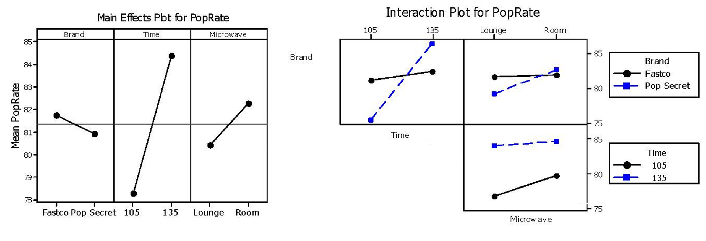
```

Figure 4.3 also provides interaction plots corresponding to the three hypotheses tests about interactions. Using the same logic, Figure 4.3 shows that the hypothesis test corresponding to the *Brand* and *Time* interaction will have the smallest $p$-value. While both the effect of *Time* and the effect of *Brand* are somewhat influenced by *Microwave*, the effect of *Time* is most influenced by changing *Brand*.

## What Can We Conclude from the Popcorn Study?

Yvonne and Tue’s study illustrated how essential it is to carefully plan out a study before any data are collected. If the data are not collected properly, typically there is *no* statistical analysis that can draw accurate conclusions. When the study is well designed and the data are reliable, analysis is often straightforward with statistical software.

The units in this study (*Bags*) were randomly assigned to *Time* and *Microwave* factor-level combinations. The ANOVA results allowed us to conclude that *Time* causes a difference in *PopRate*. In addition, we found evidence that there is a *Brand* and *Time* interaction.

The bags of popcorn in this study were not a true random sample of all popcorn produced by these two brands. Thus, we need to be careful about making any conclusions that extend to a larger population. Because of the efforts the students made to properly collect random samples from various stores around their college town, the author of this chapter would feel fairly comfortable stating that the conclusions hold for these two brands of butter-flavored microwave popcorn in their town at the time of this study.


## Paper Towels: Developing a Statistical Model for a Two-Way Factorial Design

As a final project in an introductory statistics class, several students decided to conduct a study to test the strength of paper towels. Several television advertisements had claimed that a certain brand of paper towel was the strongest, and these students wanted to determine if there really was a difference. The students sampled 26 towels from two brands of paper towels, Comfort and Decorator.

>**NOTE:** Recall that random sampling is needed to extend the results to a larger population. If the students randomly sampled 26 towels from just one roll, the conclusions would hold only for that roll. Ideally they should have randomly purchased 26 rolls of each brand from multiple locations and then randomly selected one towel per roll.

Before any data were collected, these students determined that the following conditions should be held as constant as possible throughout the study:

- Paper towels were selected that had the same size.
- The towels were held at all four corners by two people.
- Weights (10, 25, 50, 100, or 250 grams) were slowly added to the center of each towel by a third person until it broke.

In this study, there are two factors. One has two levels, Comfort (Brand C) or Decorator (Brand D), and the other has three levels (0, 5, or 15 drops of water applied to the center of the paper towel). This leads to $2 \times 3 = 6$ conditions, called **factor-level combinations** or **factorial combinations**:

- Brand C and 0 drops of water
- Brand C and 5 drops of water
- Brand C and 15 drops of water
- Brand D and 0 drops of water
- Brand D and 5 drops of water
- Brand D and 15 drops of water

Twenty-six sheets were tested at each of the six factor-level combinations. Thus, there are 156 experimental units used in this study. The response variable is the breaking strength of each paper towel in grams. Breaking strength is defined as the total weight that each towel successfully held. The next additional weight caused the towel to break.

The three null hypotheses corresponding to this two-factor design are as follows:

1. $H_{0,1}$: there is no difference in mean strength between the two brands of towel\\
   $H_{a,1}$: the two brand means are different

2. $H_{0,2}$: there is no difference in mean strength when 0, 5, or 15 drops of water are used\\
   $H_{a,2}$: the mean strength of at least one water amount group is different from the others

3. $H_{0,3}$: the amount of water has no influence on how brand affects strength\\
   or $H_{0,3}$: the effect of the amount of water on strength is the same for both brands\\
   or $H_{0,3}$: there is no interaction between brand and water\\
   $H_{a,3}$: there is an interaction between brand and water

Table 4.4 represents some of the data for the paper towel study. Each of the six cells has 26 observations. The complete data set is in the file `PaperTowels`. While not all observations are shown, Table 4.4 helps us understand the data structure. After the data have been collected, the averages for all meaningful groups of the data can be calculated as shown in Table 4.5.


### Activity: Algebraic Notation {-}

Data set: `PaperTowels`

20. What values in Table 4.4 are represented by $y_{213}$ and $y_{122}$?
21. Give the proper algebraic notation for the observation representing the 3rd paper towel with Brand D
and 15 drops of water.
22. What are the values of $\bar{y}_{.3.}$ and $\bar{y}_{21.}$?
23. Complete Table 4.5 by calculating the three missing averages.

```{r tab44, echo=FALSE, results='asis'}
df4.4 <- data.frame(
  `Brand of Towel` = c(
    "\\textbf{Comfort, Brand C} \\\\ ($i = 1$)", "", "", "", "",
    "\\textbf{Decorator, Brand D} \\\\ ($i = 2$)", "", "", "", ""
  ),
  `0 drops ($j=1$)` = c(3200, 3400, 2800, "$\\vdots$", 3100, 2400, 2400, 2000, "$\\vdots$", 1700),
  `5 drops ($j=2$)` = c(2000, 1800, 1700, "$\\vdots$", 1800, 875, 600, 825, "$\\vdots$", 700),
  `15 drops ($j=3$)` = c(375, 475, 500, "$\\vdots$", 325, 400, 450, 325, "$\\vdots$", 300),
  check.names = FALSE
)

cat(
  kable(
    df4.4,
    format = "latex",
    booktabs = TRUE,
    escape = FALSE,
    col.names = c("Breaking Strength of Paper Towels (grams)", "0 drops ($j=1$)", "5 drops ($j=2$)", "15 drops ($j=3$)"),
    caption = "Strength of paper towels (grams of weight added before the towel broke). The \\texttt{Brand} factor has two levels: $i = 1$ represents Comfort and $i = 2$ represents Decorator towels. The \\texttt{Water} factor has three levels: $j = 1, 2,$ and 3 represent 0 drops, 5 drops, and 15 drops of water, respectively.",
    align = c("l", "c", "c", "c"),
    row.names = FALSE
  ) %>%
    add_header_above(c(" " = 1, "Amount of Water" = 3), escape = FALSE) %>%
    kable_styling(latex_options = "hold_position") %>%
    column_spec(1, width = "3.5cm")
)
```

```{r tab45, echo=FALSE, results='asis'}
df4.5 <- data.frame(
  Strength = c(
    "Brand C", "Brand D", "Water Average"
  ),
  `0 drops` = c(
    "$\\overline{y}_{11.} = 3205.8$", "$\\overline{y}_{21.} = 2219.2$", "$\\overline{y}_{.1.} = 2712.5$"
  ),
  `5 drops` = c(
    "", "$\\overline{y}_{22.} = 704.8$", ""
  ),
  `15 drops` = c(
    "", "$\\overline{y}_{23.} = 446.2$", "$\\overline{y}_{.3.} = 423.6$"
  ),
  `Brand Average` = c(
    "$\\overline{y}_{1..} = 1772.8$", "$\\overline{y}_{2..} = 1123.4$", "$\\overline{y}_{...} = 1448.1$"
  ),
  check.names = FALSE
)

cat(
  kable(
    df4.5,
    format = "latex",
    booktabs = TRUE,
    escape = FALSE,
    caption = " Average \\texttt{Strength} of paper towels (grams).",
    align = c("l", rep("c", 4))
  ) %>%
    add_header_above(
      c(" " = 1, "Amount of Water" = 3, " " = 1)
    ) %>%
    kable_styling(latex_options = "hold_position")
)
```


### Calculating Effects {-}

As the data structure becomes more complex, a statistical model becomes more useful for describing the population(s) from which the data may have come. Generally, statistical models consist of a mean response and a random error term (details are provided in Chapter 2). The mean response describes the expected (mean) breaking strength. Figure 4.4 is useful in visualizing the meaningful groups within this model that contribute to the mean response of the model: the grand mean, the two brand groups, the three water amount groups, and the six factor-level combination groups.

The random error term follows an overall pattern that can be modeled with a probability distribution (e.g., the normal distribution). The error term incorporates the reality that observations will vary within each factor-level combination. Even when the same weights are applied to the same brand of paper towel, using the same water amount, the observed breaking strength may not be the same.

The labels (e.g., the grand mean, group effects, and random errors) and symbols in Figure 4.4 are described below:

 - $y_{ijk}$: the $k$th observed breaking strength ($k = 1, 2, \ldots, 26$) for brand $i$ and water amount $j$
 - $\mu$: overall mean breaking strength of the entire population of paper towels across brands and water amounts (also called the grand mean)
 - $\alpha_i$: brand effect ($i = 1, 2$), where $\alpha_1$ is the effect of Brand C and $\alpha_2$ is the effect of Brand D
 - $\beta_j$: amount of water effect ($j = 1, 2, 3$), where $\beta_1$ represents the effect of 0 drops of water
 - $(\alpha\beta)_{ij}$: interaction effect, where $(\alpha\beta)_{23}$ represents the Brand D/15 drops of water interaction effect
 - $\varepsilon_{ijk}$: the random error—the difference between the $k$th observed value ($k = 1, 2, \ldots, 26$) and the population mean breaking strength for brand $i$ and water amount $j$

```{r fig44, echo=FALSE, out.width="80%", fig.align="center", fig.cap="Two-way factorial diagram."}
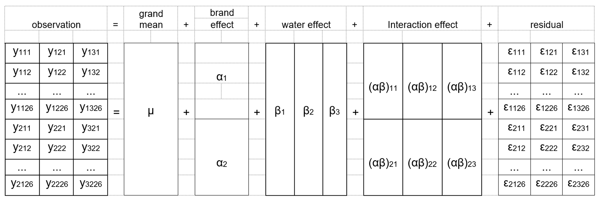
```

Notice that each of the $2 \times 3 \times 26 = 156$ observed strength measurements represents one of the 156 equations in Figure 4.4. The structure of the data is now used to write down a statistical model for the data:
\begin{align}\label{4.5}
y_{ijk} = \mu + \alpha_i + \beta_j + (\alpha\beta)_{ij} + \epsilon_{ijk} \quad \text{for } i = 1,2,\ j = 1,2,3, \text{ and } k = 1,2,\ldots,26 \tag{4.5}
\end{align}


\textbf{\textcolor{blue}{Key Concept:}}
\textcolor{blue}{Identifying the meaningful groups within each data set (the data structure) is the first step in developing a statistical model of the population(s) from which the data come.}


Table 4.5 shows that the *Strength* average changes from 1772.8 to 1123.4 with a change from Brand C to Brand D paper towels. This difference is smaller than the differences due to changes in the water amount. **Main effects** are calculated to measure the impact of changing the levels of each factor in the model. A main effect is the difference between the factor-level average and the grand mean. For example,

\begin{align}
\hat{\alpha}_1 &= \text{effect of Brand C} = \text{Brand C mean} - \text{grand mean} \notag \\
&= \bar{y}_{1.} - \bar{y}_{..} = 1772.8 - 1448.1 = 324.7 \notag
\end{align}

\begin{align}\label{4.6}
\hat{\beta}_3 &= \text{effect of 15 drops of water} = \text{15 drops mean} - \text{grand mean} \notag \\
&= \bar{y}_{.3} - \bar{y}_{..} = 423.6 - 1448.1 = -1024.5 \tag{4.6}
\end{align}


\>**NOTE:** $\mu$, $\alpha_i$, $\beta_j$, and $(\alpha\beta)_{ij}$ in Equation \ref{4.4} are population parameters. Statistics such as $\hat{\alpha}_i$ and $\hat{\beta}_j$ in Equation \ref{4.6} are used to estimate the population effect sizes.


### Activity: Estimating Main Effects {-}

Data set: `PaperTowels`

24. Use the `PaperTowels` data to estimate the effect of Brand D and explain any symmetry that you find with the effect of Brand C calculated above.
25. A **main effects plot** is a graph that plots the average response for each level of each factor. To properly compare the effect sizes, the vertical axis should be the same for each factor. Use statistical software to create a main effects plot. Identify and label the following values on the plot: $\bar{y}_{1.}$, $\bar{y}_{.3}$, $\bar{y}_{..}$, $\hat{\alpha}_1$, and $\hat{\beta}_3$.


>**NOTE:** This is still a balanced design, since $n_{ij}$ is the same for each factor-level combination. However, since the sample sizes are not the same in every group level (78 towels for each brand mean and 52 towels for each water level), the factor with the largest difference between means does not necessarily correspond to the smallest $p$-value.


In addition to determining the main effects for each factor, it is often critical to identify how multiple factors interact in affecting the results. An interaction occurs when one factor affects the response variable differently depending on a second factor. To calculate the effect of the brand and water interaction, take the average for a particular factor combination minus the grand mean and the corresponding main effects.

Interaction effect of Brand C and 15 drops of water interaction effect
= average of Brand C, 15 drops group
- (effect of Brand C + effect of 15 drops + grand mean)
\begin{align}
= \bar{y}_{13.} - [\hat{\alpha}_1 + \hat{\beta}_3 + \bar{y}_{..}] \notag \\
= \bar{y}_{13.} - [(\bar{y}_{1.} - \bar{y}_{...}) + (\bar{y}_{.3} - \bar{y}_{...}) + \bar{y}_{...}] \notag \\
= 401.0 - [324.7 + (-1024.5) + 1448.1] \notag \\
= -347.3 \hspace{1cm} \tag{4.7}
\end{align}

The estimate of the Brand C and 15 drops of water interaction effect in Equation \ref{4.7} tells us that the best estimate of any paper towel strength from this group should be reduced by an additional 347.3 after we take into account all other influencing factors (the grand mean and main effects).


### Activity: Calculating Interaction Effects {-}

Data set: `PaperTowels`

26. Show that $\bar{y}_{ij.} - \bar{y}_{i.} - \bar{y}_{.j} + \bar{y}_{..}$ is equivalent to the $j$th interaction effect.
27. Calculate the other five interaction effects. Hand draw Figure 4.4 and fill out the effect sizes with observed values (i.e., replace $\mu$, $\alpha_i$, $\beta_j$, and $(\alpha\beta)_{ij}$ with estimates from the data). Do not fill out the observations or the error terms ($y_{ijk}$ or $\varepsilon_{ijk}$).
28. Create an interaction plot. Does there appear to be evidence of an interaction effect?
29. Draw a diagram similar to Figure 4.4 for a two-way factorial design with four levels of the first factor, three levels of the second factor, and two observations per factor-level combination in Equation \ref{4.4}.
30. Residuals, or observed random error terms, are defined as the observed responses, $y_{ijk}$, minus the estimate for the mean response (the sum of the grand mean, the two main effects, and the interaction effect). Calculate the residual values for $y_{213}$ and $y_{122}$.

The effect for Brand C might be positive (Brand C has a higher average breaking strength than Brand D), but then the effect for Brand D must be negative and exactly the same size as the effect for Brand C. The two effects sum to zero. This is called a **restriction** on the model terms. The entire set of restrictions for the model in Equation \ref{4.4} is provided below.

\begin{align}
\sum_{i=1}^{2} \alpha_i = \alpha_1 + \alpha_2 = 0, \qquad \sum_{j=1}^{3} \beta_j = \beta_1 + \beta_2 + \beta_3 = 0 \notag
\end{align}
\begin{align}
\sum_{i=1}^{2} (\alpha\beta)_{ij} = (\alpha\beta)_{1j} + (\alpha\beta)_{2j} = 0 \quad \text{for all } j \notag \\
\sum_{j=1}^{3} (\alpha\beta)_{ij} = (\alpha\beta)_{i1} + (\alpha\beta)_{i2} + (\alpha\beta)_{i3} = 0 \quad \text{for all } i \tag{4.8} \label{4.8}
\end{align}

More specifically, the restrictions state that the interaction effects involving Brand C must sum to zero (i.e., $(\alpha\beta)_{11} + (\alpha\beta)_{12} + (\alpha\beta)_{13} = 0$). In the same way, all interactions corresponding to the 15 drops of water groups must also sum to zero. All six restrictions corresponding to the interactions can be checked in Question 27. The residual values sum to zero within each group of interest. This will always be true whenever calculating effects. This is not surprising, since effects measure the deviation of a particular group mean from the overall mean.

## Paper Towels: The Relationship Between Effects and ANOVA

Each of the three hypothesis tests in the paper towel study is tested on a separate line in an ANOVA table. The $F$-statistics for an ANOVA were already calculated earlier in this chapter by comparing between group and within group variability. This section will show the relationship between calculating effects and the ANOVA table. For each null hypothesis, the statement “the means are equal for all levels of a factor” is equivalent to the statement “factor effects are zero.”

The **sum of squares** (SS) for a main factor in the multi-factor ANOVA is identical to the one-factor SS described in Chapter 2. The sum of squares (the numerator of the mean square calculation) is the sum of all squared effects corresponding to that factor. For the *Brand* effect, this is written mathematically as

\begin{align}
\text{SS}_{\text{Brand}} &= \sum (\text{Brand effect on each of the 156 observations})^2 \notag \\
&= \sum_{i=1}^{2} 78(\bar{y}_{i..} - \bar{y}_{...})^2
\notag
\end{align}

This equation can be generalized. Instead of 78 elements in each *Brand* group, we can indicate $n_i$ elements. Instead of 2 levels for *Brand*, we can indicate $I$ levels. The first factor, *Brand*, can be labeled factor $A$; the second factor, *Water*, can be labeled factor $B$; etc. Then

\begin{align}\label{4.9}
\text{SS}_{\text{Brand}} = \text{SS}_A = \sum_{i=1}^{I} n_i(\bar{y}_{i..} - \bar{y}_{...})^2 \qquad \text{for} \quad I=2 \text{ (number of Brand levels)}
\tag{4.9}
\end{align}

Similarly, $\text{SS}_{\text{Water}} = \text{SS}_B$ is the sum of squares for the *Water* effect on each observation.

\begin{align}\label{4.10}
\text{SS}_{\text{Water}} = \text{SS}_B = \sum (\text{Water effect on each of the 156 observations})^2 \notag \\
= \sum_{j=1}^{3} 52(\bar{y}_{.j.} - \bar{y}_{...})^2 \notag \\
= \sum_{j=1}^{J} n_j(\bar{y}_{.j.} - \bar{y}_{...})^2 \qquad \text{for} \quad J=3 \text{ (number of Water levels)}
\tag{4.10}
\end{align}

The sum of squares for the interaction term, $\text{SS}_{AB}$, is

\begin{align}\label{4.11}
\text{SS}_{AB} &= \sum (\text{interaction effect on each of the 156 observations})^2 \notag \\
&= \sum_{i=1}^{I} \sum_{j=1}^{J} n_{ij} (\text{ith level effect})^2 \notag \\
&= \sum_{i=1}^{2} \sum_{j=1}^{3} 26 (\bar{y}_{ij.} - \bar{y}_{i..} - \bar{y}_{.j.} + \bar{y}_{...})^2
\tag{4.11}
\end{align}

The **error sum of squares** ($\text{SS}_{\text{Error}}$) measures the spread of the observed residuals. Each residual is defined as an observed value minus the estimated value: $\hat{\epsilon}_{ijk} = y_{ijk} - \bar{y}_{ij.}$.

\begin{align}\label{4.12}
\text{SS}_{\text{Error}} &= \sum (\text{each residual effect})^2 \notag \\
&= \sum_{i=1}^{I} \sum_{j=1}^{J} \sum_{k=1}^{n_{ij}} (y_{ijk} - \bar{y}_{ij.})^2 \notag \\
&= \sum_{i=1}^{I} \sum_{j=1}^{J} \left[(n_{ij} - 1) \times s_{ij}^2 \right] \notag \\
&= 25 \times s_{11}^2 + 25 \times s_{12}^2 + 25 \times s_{13}^2 + 25 \times s_{21}^2 + 25 \times s_{22}^2 + 25 \times s_{23}^2
\tag{4.12}
\end{align}

The **total sum of squares** ($\text{SS}_{\text{Total}}$) measures the overall spread of the responses in the full data set.

\begin{align}\label{4.13}
\text{SS}_{\text{Total}} &= \sum (\text{distance between each observation and the grand mean})^2 \notag \\
&= \sum_{i=1}^{I} \sum_{j=1}^{J} \sum_{k=1}^{n_{ij}} (y_{ijk} - \bar{y}_{...})^2 \notag \\
&= (N-1) \times s^2
\tag{4.13}
\end{align}


>**MATHMATICAL NOTE:** 
The variance within each factor-level group is calculated as
\[
s_{ij}^2 = \frac{\sum_{k=1}^{n_{ij}} (y_{ijk} - \bar{y}_{ij.})^2}{n_{ij} - 1}
\]
and the overall sample variance of the response variable is
\[
s^2 = \frac{\sum_{i=1}^{I} \sum_{j=1}^{J} \sum_{k=1}^{n_{ij}} (y_{ijk} - \bar{y}_{...})^2}{N-1}
\]
where $N = 156$ is the total sample size.


### Degrees of Freedom {-}

**Degrees of freedom** (df) are determined by how many “free” pieces of information are available when calculating effects. For example, Equation \ref{4.8} shows that each of the main effects must sum to zero. Thus, knowing the effects of any two levels of *water* forces a known effect for the last level. In our example, the effect of 0 drops of water increases the expected mean strength by 1264.4. Similarly, the effect of using 5 drops of water is -239.9. The the effects must sum to zero ($\hat{\beta}_1 + \hat{\beta}_2 + \hat{\beta}_3 = 1264.4 - 239.9 - 1024.5 = 0$).


\textbf{\textcolor{blue}{Key Concept:}}
\textcolor{blue}{For any main factor with $J$ levels, one effect is fixed if we know the other $J-1$ effects. Thus, when there are $J$ levels for a main factor of interest, there are $J-1$ degrees of freedom (free pieces of information).}


### Activity: Calculating Degrees of Freedom for Interaction Terms {-}

Data set: `PaperTowels`

31. Table 4.6 is a table with two rows and three columns, similar to the interaction effect term in the two-way factorial diagram in Figure 4.4. However, for this question we will assume that only two effects are known: $\widehat{(\alpha\beta)}_{11} = 2$ and $\widehat{(\alpha\beta)}_{12} = -5$.

```{r tab6, echo=FALSE, results='asis'}
df4.6 <- data.frame(
  " " = c("Brand C", "Brand D"),
  "0" = c("2", ""),
  "5" = c("$-5$", ""),
  "15" = c("", ""),
  check.names = FALSE
)
cat(
  kable(
    df4.6,
    format = "latex",
    booktabs = TRUE,
    escape = FALSE,
    caption = "Interaction effects.",
    align = c("l", "c", "c", "c")
  ) %>%
    kable_styling(latex_options = "hold_position")
)
```

a. Equation \ref{4.8} states that all the $AB$ effects within Brand C add up to zero [$\widehat{(\alpha\beta)}_{11} + \widehat{(\alpha\beta)}_{12} + (\widehat{(\alpha\beta)}_{13} = 0$]. Use this rule to calculate $\widehat{(\alpha\beta)}_{13}$.

b. Equation \ref{4.8} also states that all the $AB$ effects within 0 water amount add up to zero (the same for 5 and 15 drops of water). Use this rule to calculate $\widehat{(\alpha\beta)}_{21}$, $\widehat{(\alpha\beta)}_{22}$, and $\widehat{(\alpha\beta)}_{23}$.

c. Consider a different interaction table with two rows and three columns. Explain why it is not possible to have effects of $\widehat{(\alpha\beta)}_{11} = 4$, $\widehat{(\alpha\beta)}_{13} = -4$, and $\widehat{(\alpha\beta)}_{22} = 6$ and still follow the restrictions in Equation 4.8.

d. What are the degrees of freedom corresponding to any interaction term (in a balanced completely randomized design) with two levels of factor $A$ and three levels of factor $B$? In other words, under the restrictions in Equation \ref{4.8}, what is the number of free pieces of information (the number of cells in Table 4.6 that are not fixed)?

32. Table 4.7 is another table of interaction effects, with five rows and three columns (five levels of factor $A$ and three levels of factor $B$). Again, we will assume that only some of the effects are known.

```{r tab47, echo=FALSE, results='asis'}
df4.7 <- data.frame(
  c("3", "$-2$", "1", "3", ""),
  c("1", "6", "4", "5", ""),
  c("", "", "", "", ""),
  check.names = FALSE
)

cat(
  kable(
    df4.7,
    format = "latex",
    escape = FALSE,
    caption = "Interaction effects.",
    align = c("c", "c")
  ) %>%
    kable_styling(latex_options = "hold_position")
)
```

a. Use Equation \ref{4.8} to calculate the effect corresponding to each of the remaining cells.

b. In Table 4.7, eight cells are filled. If only seven cells were filled, would it be possible to calculate the effects corresponding to all remaining cells?

c. What are the degrees of freedom corresponding to any interaction term (in a balanced completely randomized design) with five levels of factor $A$ and three levels of factor $B$? In other words, what is the minimum number of cells that must be filled in order to allow us to use Equation \ref{4.8} to estimate all other effects?

33. Use the previous two questions to determine the degrees of freedom for an interaction term for a balanced completely randomized design using three levels of factor $A$ and four levels of factor $B$.

For the $AB$ interaction term, there are $I \times J$ effects that are calculated. In the popcorn study, $I \times J = 2 \times 3 = 6$. Each effect represents one piece of information. In addition:

- All the $AB$ effects within Brand C add up to zero [$(\alpha\beta)_{11} + (\alpha\beta)_{12} + (\alpha\beta)_{13} = 0$]. Within Brand C, if two effects are known, the third will be fixed (the same holds for Brand D). Thus, these restrictions eliminate $I = 2$ free pieces of information (free cells in an interaction effects table).
- Similarly, all the $AB$ effects within 0 water amount add up to zero [$(\alpha\beta)_{11} + (\alpha\beta)_{21} = 0$]. The same restriction holds for all other levels of factor $B$ (for 5 and 15 drops of water). Thus, an additional $J = 3$ pieces of information are no longer free. However, one piece of information is already fixed from the requirement that the sum of all brand effects is zero. Thus, only $J-1 = 3-1=2$ free pieces of information are taken for water amounts.

The degrees of freedom for the interaction effect are
\begin{align}\label{4.14}
\text{df}_{AB} &= \text{number of interaction effects} - [\text{df}_A + \text{df}_B + 1] \notag \\
&= IJ - [(I-1) + (J-1) + 1] \notag \\
&= IJ - I - J + 1 \notag \\
&= (I-1)(J-1)
\tag{4.14}
\end{align}


>**MATHMATICAL NOTE:** Calculating interaction degrees of freedom as $(I-1)(J-1)$ in Equation \ref{4.14} is quite easy. However, the reason Equation \ref{4.14} also shows interaction df $= IJ - [(I-1) + (J-1) + 1]$ is that this follows the calculation of the interaction effect shown in Equation \ref{4.7}: $\bar{y}_{ij.} - [(\bar{y}_{i.} - \bar{y}_{...}) + (\bar{y}_{.j.} - \bar{y}_{...}) + \bar{y}_{...}]$. The key point is to recognize that knowing how the effects are calculated drives formulas for both sum of squares and degrees of freedom. This is also true for more complex designs beyond the scope of this chapter.


\textbf{\textcolor{blue}{Key Concept:}}
\textcolor{blue}{For each term in a model, degrees of freedom represent the number of cells in a factor diagram that must be filled before all other cells can be filled with no added information. Thus, degrees of freedom are the number of “free” effects before the restrictions allow us to predict all other effects.}

```{r tab48, echo=FALSE, results='asis'}
df4.8 <- data.frame(
  Source = c(
    "$A$", "$B$", "$AB$", "Error", "Total"
  ),
  df = c(
    "$I - 1$", "$J - 1$", "$(I-1)(J-1)$", "$IJ(K-1)$", "$N-1$"
  ),
  SS = c(
    "$\\displaystyle\\sum_{i=1}^{I} n_i (\\overline{y}_{i..} - \\overline{y}_{...})^2$",
    "$\\displaystyle\\sum_{j=1}^{J} n_j (\\overline{y}_{.j.} - \\overline{y}_{...})^2$",
    "$\\displaystyle\\sum_{i=1}^{I}\\sum_{j=1}^{J} n_{ij}(\\overline{y}_{ij.} - \\overline{y}_{i..} - \\overline{y}_{.j.} + \\overline{y}_{...})^2$",
    "$\\displaystyle\\sum_{i=1}^I\\sum_{j=1}^J [(n_{ij} - 1) \\times s^2_{ij}]$",
    "$\\displaystyle\\sum_{i=1}^I\\sum_{j=1}^J\\sum_{k=1}^K (y_{ijk} - \\overline{y}_{...})^2$"
  ),
  MS = c(
    "$\\dfrac{SS_A}{df_A}$",
    "$\\dfrac{SS_B}{df_B}$",
    "$\\dfrac{SS_{AB}}{df_{AB}}$",
    "$\\text{MSE} = \\dfrac{SSE}{df_{\\text{Error}}}$",
    ""
  ),
  F = c(
    "$\\dfrac{MS_A}{\\text{MSE}}$",
    "$\\dfrac{MS_B}{\\text{MSE}}$",
    "$\\dfrac{MS_{AB}}{\\text{MSE}}$",
    "",
    ""
  ),
  check.names = FALSE
)
cat(
  kable(
    df4.8,
    format = "latex",
    booktabs = TRUE,
    escape = FALSE,
    col.names = c("Source", "df", "SS", "MS", "$F$-Statistic"),
    caption = "Two-way ANOVA table.",
    align = c("l", "c", "c", "c", "c")
  ) %>%
    kable_styling(latex_options = "hold_position")
)
```


### Activity: Analyzing the Paper Towel Data {-}

Data set: `PaperTowels`

34. **Checking Assumptions** In the statistical model in Equation \ref{4.4}, the following assumptions need to be validated about the random error terms, $\varepsilon_{ijk}$, before any formal hypothesis test can be developed:
- The error terms are independent and identically distributed.
- The error terms follow a normal probability distribution, denoted as $\epsilon \sim N(0, \sigma^2)$.

Note that the second assumption includes an equal variance assumption about the random errors from the different factor-level groups: $\sigma_{11}^2 = \sigma_{12}^2 = \sigma_{13}^2 = \sigma_{21}^2 = \sigma_{22}^2 = \sigma_{23}^2$.

a. The independence assumption implies that there is no relationship between one observation and the next. The identically distributed assumption means that each observation sampled within each brand/water combination is from a population with the same mean and variance. If all 26 paper towels were sampled from one roll to assess the Brand C/5 drops factor combination, would you be concerned about violating the independence and/or the identically distributed assumption? Why or why not?

b. Calculate the sample means and standard deviations of all six factor-level combinations. Clearly, some groups have much larger variation than others. In addition, the variation within each group increases as the average breaking strength increases. To address this issue, a transformation of the data can often be used that will “stabilize” the variances so that the equal variance assumption is reasonable on this new scale. (Chapter 2 describes transformations in more detail.)

c. Transform the response variable using natural log ($\log(\text{Strength})$) and $\sqrt{\text{Strength}}$. Did both transformations improve the equal variance assumption?

35. **Visualizing the Data** Draw individual value plots or side-by-side boxplots of the square-root transformed responses in the six factor-level groups.
a. Is there any extreme skewness or outliers that would cause us to question the normality assumption?
b. Without doing any statistical calculations, do you expect to reject the three null hypotheses for the paper towel study? Justify your answer by visually comparing the variation (i.e., the spread) in the strength between groups to the variation within groups.

36. **Analyzing the Data** Use computer software to conduct an analysis on the square-root transformed $PaperTowels$ data to test for differences between brands, water levels, and interactions. Use the ANOVA as well as appropriate graphs to state your conclusions about the paper towel study.

## Contrasts and Multiple Comparisons

Chapter 2 describes a study where researchers tested whether a color distracter influenced the completion time of an online computer game. In addition to a color distracter, they were also interested in whether subjects could play the game more quickly with their right or left hand. Chapter 2 was restricted to one-factor ANOVAs. Thus, in that chapter the data were sorted into four groups: StandardRight, ColorRight, StandardLeft, and ColorLeft. Instead of testing for evidence against a general hypothesis test ($H_0$: $\mu_{SR} = \mu_{CR} = \mu_{SL} = \mu_{CL}$), the two-way ANOVA allows us to test three more specific hypotheses of interest.


### Activity:Comparing One-Way and Two-Way ANOVA {-}

Data set: `Games2`

37. The data set **Games2** shows a column *Type2* with four types of games based on distracter and which hand was used. Conduct an ANOVA using *Type2* (just one explanatory variable with four levels) to test for differences in completion time. What is the $p$-value corresponding to the null hypothesis $H_0$: $\mu_{SR} = \mu_{CR} = \mu_{SL} = \mu_{CL}$ versus the alternative $H_a$: at least one mean is different from another?
38. Conduct a two-way ANOVA using *Type*, *Hand*, and the *Type* $\ast$ *Hand* interaction to test for differences in completion time. List the three null and alternative hypotheses and provide a $p$-value for each test.
39. Since the same response variable is used for both Question 37 and Question 38, it should not be surprising that the total sum of squares is identical for both questions. Compare the other sums of squares in the ANOVAs from Questions 37 and 38. How is $SS_{\text{Type2}}$ related to $SS_{\text{Type}}$, $SS_{\text{Hand}}$, and $SS_{\text{TypeHand}}$?

Since Question 37 leads us to reject $H_0$: $\mu_{SR} = \mu_{CR} = \mu_{SL} = \mu_{CL}$, it seems reasonable to conduct a multiple comparisons test (conduct multiple tests to identify differences between each group mean and every other group mean).


>**NOTE:** There are six possible comparisons when there are four group means. Chapter 1 discussed familywise type I error and comparisonwise type I error. The **least-significant differences method** is a technique using comparisonwise type I error: If the $p$-value is less than $\alpha$, reject $H_0$ in favor of $H_a$. Assuming that a particular null hypothesis is true, the least-significant differences method has an $\alpha\%$ chance of (incorrectly) rejecting that hypothesis. When multiple tests are conducted on the same data set, the least-significant differences method leads to type I errors: rejecting null hypotheses when they should not be rejected.

>**Bonferroni’s method** is an example of a technique that maintains familywise type I error: If the $p$-value is less than $\alpha/K$ (where $K$ is the number of pairs), reject $H_0$ in favor of $H_a$. With the familywise type I error = $\alpha$, assuming that there really is no difference between any of the $K$ pairs, there is only an $\alpha\%$ chance that any test will reject $H_0$. This leads to type II errors: failing to reject null hypotheses when they should be rejected. Chapter 1 describes the need for multiple comparison procedures and describes both the least-significant difference and the Bonferroni method in more detail.


Question 38 can be thought of as testing for orthogonal contrasts. An **orthogonal contrast** is a linear combination of treatment means where the coefficients add up to zero. For example, before they collected any data, the researchers in the game study were interested in several specific comparisons:

- Comparing standard to color games: $H_{01}$: (1)$\mu_{SR}$ + (-1)$\mu_{CR}$ + (1)$\mu_{SL}$ + (-1)$\mu_{CL}$ = 0. This is mathematically equivalent to $H_{01}$: $(\frac{1}{2})\mu_{SR} + (\frac{1}{2})\mu_{SL} = (\frac{1}{2})\mu_{CR} + (\frac{1}{2})\mu_{CL}$ or $H_{01}$: $\mu_{S} = \mu_{C}$.
- Comparing right to left hand: $H_{02}$: (1)$\mu_{SR}$ + (1)$\mu_{CR}$ + (-1)$\mu_{SL}$ + (-1)$\mu_{CL}$ = 0. This is mathematically equivalent to $H_{02}$: $\mu_{R} = \mu_{L}$.
- Testing for an interaction: $H_{03}$: (1)$\mu_{SR}$ + (-1)$\mu_{CR}$ + (-1)$\mu_{SL}$ + (1)$\mu_{CL}$ = 0.

Each of these linear combinations of population means can be estimated by a contrast:

\begin{align}
\text{Contrast 1 (C1)} &= (1)\bar{y}_{SR} + (-1)\bar{y}_{CR} + (1)\bar{y}_{SL} + (-1)\bar{y}_{CL} \notag \\
\text{Contrast 2 (C2)} &= (1)\bar{y}_{SR} + (1)\bar{y}_{CR} + (-1)\bar{y}_{SL} + (-1)\bar{y}_{CL} \notag \\
\text{Contrast 3 (C3)} &= (1)\bar{y}_{SR} + (-1)\bar{y}_{CR} + (-1)\bar{y}_{SL} + (1)\bar{y}_{CL}
\notag
\end{align}

The coefficients of each of the linear combinations sum to zero:

\begin{align}
\text{Coefficients for contrast 1} &= C_{11} + C_{21} + C_{31} + C_{41} = (1) + (-1) + (1) + (-1) = 0 \notag \\
\text{Coefficients for contrast 2} &= C_{12} + C_{22} + C_{32} + C_{42} = (1) + (1) + (-1) + (-1) = 0 \notag \\
\text{Coefficients for contrast 3} &= C_{13} + C_{23} + C_{33} + C_{43} = (1) + (-1) + (-1) + (1) = 0
\notag
\end{align}


\textbf{\textcolor{blue}{Key Concept:}}
\textcolor{blue}{For any null hypothesis test comparing $G$ group means $H_0$: $\mu_1 = \mu_2 = \cdots = \mu_G$ versus the alternative $H_a$: at least one group mean is different from another, a contrast is an estimate of a linear combination of the group means: Contrast 1 ($C_1$) = ($C_{11}$)$\bar{y}_1$ + ($C_{21}$)$\bar{y}_2$ + $\cdots$ + ($C_{G1}$)$\bar{y}_G$, where the coefficients sum to zero: $C_{11} + C_{21} + \cdots + C_{G1} = 0$.}


>**MATHMATICAL NOTE:** 
Any set of $G$ group means (four group means in our case; $H_0$: $\mu_{SR} = \mu_{CR} = \mu_{SL} = \mu_{CL}$) being compared in a between group sum of squares can be used to create $G-1$ mutually orthogonal contrasts ($H_{01}, H_{02}, H_{03}$). Any two contrasts are said to be orthogonal if the dot product (sum of the cross products) of their coefficient vectors is zero. Contrasts must be orthogonal to ensure that they are independent. This independence allows us to partition the variation in ANOVA, so that the sum of squares corresponding to all $G-1$ contrasts will sum to the between group sum of squares.

Often contrasts are incorporated into the ANOVA analysis. The $F$-statistic for a contrast is simply the mean square for a particular between groups measure (for example, $MS_{C1}$ is the mean square for $C_1$) divided by the pooled within group variances (MSE). We can write the mean square for a contrast as

\begin{align}\label{4.15}
MS_{C1} = \frac{(C1)^2}{\sum_{g=1}^{G} \frac{C_{g1}^2}{n_g}}
\tag{4.15}
\end{align}

where $C_{g1}$ is the contrast coefficient and $n_g$ is the sample size for each group. In the game study,

\begin{align}
C1 &= (1)\bar{y}_{SR} + (-1)\bar{y}_{CR} + (1)\bar{y}_{SL} + (-1)\bar{y}_{CL} \notag \\
   &= (1)34 + (-1)36 + (1)37.1 + (-1)40.2 \notag \\
   &= -5.1 \notag
\end{align}

Thus, the mean square for contrast 1 ($MS_{C1}$) based on Question 37 is identical to the mean square for game type ($MS_{\text{Type}}$) in Question 38:

\begin{align}
MS_{C1} &= \frac{1^2}{10} + \frac{(-1)^2}{10} + \frac{1^2}{10} + \frac{(-1)^2}{10} \notag \\
        &= \frac{(-5.1)^2}{0.4} \notag \\
        &= 65.025 = MS_{\text{Type}} \notag
\end{align}


### Activity: Calculating Contrasts {-}
Data set: `Games2`

40. Use Equation \ref{4.15} to calculate $MS_{C2}$ and $MS_{C3}$. Show your work.
41. Compare $MS_{C2}$ and $MS_{C3}$, the mean squares found in Question 38.


\textbf{\textcolor{blue}{Key Concept:}}
\textcolor{blue}{Orthogonal contrasts allow multiple comparisons of linear combinations of group means. The key advantage of contrasts is that they do not have inflated type I or type II errors. However, contrasts should always be determined *before* any data are collected. Looking at the data in order to develop contrasts will bias your results.}


>**MATHMATICAL NOTE:** There are a few other common techniques for multiple comparisons. **Scheffé’s method** produces simultaneous confidence intervals for any and all contrasts, including contrasts suggested by the data (this is often called post hoc data exploration). Instead of the traditional formula for confidence intervals, Scheffé suggested using a wider confidence interval (i.e., one less likely to reject the null hypothesis) to account for the multiple testing. This method often fails to reject null hypotheses even when there are differences between groups, but it can be useful when other pairwise comparison tests are not appropriate. Remember from your introductory statistics course: If zero is in the confidence interval, you fail to reject the corresponding hypothesis test; if zero is not in the confidence interval, you should reject the corresponding hypothesis test. **Tukey’s honest significant difference (HSD)** uses a studentized range distribution instead of the F-distribution to create confidence intervals for differences between meaningful pairs. When there are a large number of pairwise comparisons, Tukey’s method is typically preferred over Bonferroni’s method.$^6$


## Chapter Summary

This chapter emphasized the importance of a well-designed experiment. A statistician often needs to communicate with people in other fields in order to properly define the research question, choose appropriate factors and levels, and determine the number of samples needed for the study.

A $p$-value never tells the whole story; $p$-values can be meaningless if assumptions are not met or if there are extraneous variables in the data. Before any conclusions are drawn from a statistical analysis using ANOVA, it is important to use graphs or formal tests to validate the the equal variance and normality assumptions.

When equal variance or normality assumptions are violated, the $F$-statistics do not follow an $F$-distribution and the $p$-values may not be accurate. Empirical studies have shown that ANOVA tends to be fairly “robust” to departures from the assumptions of equal variances and normality. If the model assumptions are not met, researchers should try transforming the data to better fit the model assumptions. If no transformation appears to help, researchers should clearly explain that the $p$-values may not be reliable.

The independence and identically distributed assumptions are also essential. A good experimental design has the following characteristics:
\begin{itemize}
    \item It avoids systematic error (bias is minimized by controlling for extraneous variables and using randomization).
    \item It has broad validity (results hold for more than just the units tested in the study).
    \item It allows for direct comparison between treatment conditions.
    \item It is precise (the chance unit-to-unit variability is small).
    \item It allows estimation of unit-to-unit variability.
    \item It can show causation (most observational studies cannot).
\end{itemize}

ANOVA tables are used to test for differences in means among meaningful groups of data. The analysis is called an analysis of variance because each mean square value is an estimate of a meaningful group within the data. The extended activities demonstrated how to calculate an ANOVA table; they emphasized main effects and interaction effects. An interaction between two variables occurs when the effect of one variable depends on the second variable. While this chapter emphasized a two-factor ANOVA, the same process holds for all completely randomized designs with fixed factors.

This chapter introduced the basics of a very powerful statistical technique. The ability to simultaneously test for the effects of multiple variables on a response allows statisticians to better model real-world situations. A well-designed experiment can test multiple hypotheses with a relatively small sample size. If used properly, these techniques efficiently and reliably help us better understand the world we live in. The end-of-chapter exercises and future chapters provide the opportunity for you to experience for yourself how these techniques are used in biology, chemistry, engineering, psychology, and many other disciplines.


## Exercises

\begin{enumerate}
  \setcounter{enumi}{41}

  \item \textbf{Design Your Own Study 1}

Assume that you are asked to help design a study for an owner of four organic grocery stores, each located in a different city. The owner is interested in knowing whether placing an advertisement in the main Sunday paper will promote business (increase total sales) in the stores. You are considering the following three options: no advertisement, offering a coupon for one free item (with purchase), offering a coupon for special prices on several items. For simplicity, we will assume that each coupon is effective for seven days (Sunday through Saturday). Write a brief outline for an experimental design.
  \begin{enumerate}
    \item Identify any extraneous variables that may potentially bias your results. How will these potential biases be addressed?
    \item List the two factors and corresponding levels in your experimental design.
    \item Specify the response variable you will use.
    \item Specify the units and sample size for this study.
    \item List each factor-level combination and the order in which things will be tested at each location. Describe how you determined the order of each factor-level combination.
    \item List the factors and the corresponding degrees of freedom that will occur in the ANOVA table.
  \end{enumerate}

  \item \textbf{Design Your Own Study 2}

Assume that you have a small garden and are interested in knowing whether particular species of tomato plants will yield more tomatoes. You are also interested in knowing if adding fertilizer will increase the growth of tomatoes. You will try three species of tomatoes with and without fertilizer and measure the total weight of the tomatoes produced. Write a brief outline for an experimental design.
  \begin{enumerate}
    \item Identify any extraneous variables that may potentially bias your results. How will these potential biases be addressed?
    \item Specify the units and sample size for this study.
    \item List each factor-level combination and the order in which things will be tested. Describe how you determined the order of each factor-level combination.
    \item List the factors and the corresponding degrees of freedom that will occur in the ANOVA table.
  \end{enumerate}

  \item Assume that you are working on a study with two factors, each with two levels. Sketch an interaction plot where there is an interaction effect but there are no main effects. Hint: Assume that both levels of the first factor have a mean of 50. Also assume that both levels of the second factor have a mean of 50. However, all four factor-level combination means will need to be something other than 50.

  \item \textbf{Microwave Popcorn Again: Three-Way Factorial Design}\\
  Data set: \texttt{Popcorn}
  \begin{enumerate}
    \item Use the data structure of the three-way factorial design to write a statistical model for the microwave popcorn study. Since there are three factors of interest in the study, the model will need three terms, such as $\alpha_i$, $\beta_j$, and $\gamma_k$, to represent each main effect and interaction effect. Use $y_{ijkl}$ to represent an individual observation.
    \item Table 4.9 gives a three-way ANOVA table. Fill in the formulas for $SS_C$, $SS_{BC}$, $MS_C$, $MS_{BC}$, and the $F$-statistic.
    \item Calculate the effect sizes for \textit{Brand, Microwave,} and \textit{Time}. Create a main effects plot and explain how the graph helps us to visualize the effect size.
    \item Calculate the effects for the \textit{Brand*Microwave} interaction. Show your work in calculating only the \textit{Fastco*Room} interaction effect by hand. Clearly interpret the meaning of these effects as it relates to this experiment.
  \end{enumerate}

```{r tab49, echo=FALSE, results='asis'}
df4.9 <- data.frame(
  Source = c(
    "$A$", "$B$", "$C$", "$AB$", "$AC$", "$BC$", "Error", "Total"
  ),
  df = c(
    "$I - 1$", "$J - 1$", "$K - 1$",
    "$(I-1)(J-1)$", "$(I-1)(K-1)$", "$(J-1)(K-1)$",
    "subtraction", "$N-1$"
  ),
  SS = c(
    "$\\displaystyle\\sum_{i=1}^{I} n_i (\\overline{y}_{i...} - \\overline{y}_{....})^2$",
    "$\\displaystyle\\sum_{j=1}^{J} n_j (\\overline{y}_{.j..} - \\overline{y}_{....})^2$",
    "",
    "$\\displaystyle\\sum_{i=1}^I\\sum_{j=1}^J n_{ij}(\\overline{y}_{ij..} - \\overline{y}_{i...} - \\overline{y}_{.j..} + \\overline{y}_{....})^2$",
    "$\\displaystyle\\sum_{i=1}^I\\sum_{k=1}^K n_{ik}(\\overline{y}_{i.k.} - \\overline{y}_{i...} - \\overline{y}_{.k..} + \\overline{y}_{....})^2$",
    "",
    "subtraction",
    "$\\displaystyle\\sum_{i=1}^I\\sum_{j=1}^J\\sum_{k=1}^K\\sum_{l=1}^L (y_{ijkl} - \\overline{y}_{....})^2$"
  ),
  MS = c(
    "$\\dfrac{SS_A}{df_A}$",
    "$\\dfrac{SS_B}{df_B}$",
    "",
    "$\\dfrac{SS_{AB}}{df_{AB}}$",
    "$\\dfrac{SS_{AC}}{df_{AC}}$",
    "",
    "$\\text{MSE} = \\dfrac{SSE}{df_{\\text{Error}}}$",
    ""
  ),
  F = c(
    "$\\dfrac{MS_A}{\\text{MSE}}$",
    "$\\dfrac{MS_B}{\\text{MSE}}$",
    "",
    "$\\dfrac{MS_{AB}}{\\text{MSE}}$",
    "$\\dfrac{MS_{AC}}{\\text{MSE}}$",
    "",
    "",
    ""
  ),
  check.names = FALSE
)
cat(
  kable(
    df4.9,
    format = "latex",
    booktabs = TRUE,
    escape = FALSE,
    col.names = c("Source", "df", "SS", "MS", "$F$-Statistic"),
    caption = "Three-way ANOVA table.",
    align = c("l", "c", "c", "c", "c")
  ) %>%
    kable_styling(latex_options = "hold_position")
)
```

  \item \textbf{Movies: Unbalanced Data}\\
  Data set: \texttt{Movies}
  \begin{enumerate}
    \item Write a statistical model that predicts gross earnings based on \textit{Genre} and \textit{Rating}. Use $\alpha_i$ to represent the effect of \textit{Rating} and $\beta_j$ to represent the effect of \textit{Genre}. Notice that the sample size varies for every group.
    \item Use statistical software to test for the effects of \textit{Rating} and \textit{Genre}. Do not include an interaction term. Check the model assumptions, perform any necessary transformations, and state your conclusions.
    \item Try to use statistical software to test for the effects of \textit{Rating, Genre,} and \textit{Rating*Genre}. Note that the analysis cannot be conducted because many of the interaction factor combinations have no observations. Group several of the \textit{Genre} variables so that there are at least two observations in each \textit{Rating*Genre} group. Now use your new groupings to test for the effects of \textit{Rating, Genre,} and \textit{Rating*Genre}.
  \end{enumerate}

  \item \textbf{Cholesterol}\\
  Data set: \texttt{Cholesterol}

Cholesterol is a waxy substance found in blood and cell membranes. All animals need some cholesterol in their system; however, too much cholesterol can cause heart attacks and strokes. A study was conducted to determine how exercise, diet, and three types of drugs impact cholesterol levels. Seventy-two patients at a nearby hospital who had been diagnosed with high cholesterol (a level greater than 240 milligrams per deciliter) consented to be in the study. Each of the 72 patients was randomly assigned to a specific treatment, and after six months the patients’ cholesterol levels were measured again. These measurements are provided in the \texttt{Cholesterol} data set.

  \begin{enumerate}
    \item List two potential nuisance variables for the study. Suggest methods you would use to account for these two nuisance variables.
    \item Create appropriate graphs/charts to check for equal variances and normality. Does it appear that it is appropriate to use ANOVA to analyze these data? Show your work and give concise but appropriate explanations.
    \item Make the assumption that ANOVA is appropriate for the data above (i.e., do not transform any data). Using software, conduct an ANOVA for the data that will analyze all main effects, as well as all two-way interactions. Clearly and concisely interpret the results. Create appropriate graphs/charts that describe the data. Interpret these charts/graphs. Be selective in which graphs/charts to supply---too many graphs/charts can detract from your presentation.
  \end{enumerate}

  \item \textbf{Don't Touch That!}\\
  Data set: \texttt{Bacteria}

Antibacterial agents have become very popular in the marketplace, in products from gels to plastic children’s toys. However, even now, you are surrounded by bacteria. Scientists have known for many years that bacteria are able to adhere to solid surfaces and form a resistant coat; however, it was not until the 1970s that the concept of biofilms became prevalent in the scientific community.$^7$ These films make completely removing bacteria from a surface nearly impossible.

Why should you care? Before the discovery of vaccines and antibiotics, humans succumbed to a myriad of acute infectious diseases. However, the majority of these have been eradicated or controlled, making bacterial infections from biofilms among the most threatening.$^8$ Today, battles against biofilm-forming bacteria are on the front lines of medical research. Interestingly, biofilms coat every surface that you see around you.

Two students, Isaac and Courtney, sampled surfaces around their campus to analyze the prevalence of bacteria. They compared different types of surfaces in both residential and academic buildings.

Data were collected by wiping surfaces with a wet Q-tip and swabbing the result on a standard nutrient agar plate. Locations were all tested on April 24, 2009 over the course of a two-hour period. The plates were incubated at 37°C for 48 hours before colony-forming units (CFUs) were counted as a measure of bacteria levels. Figure 4.5 shows several of the plates from this study. When CFUs exceeded 400 per plate, one fourth of the plate was counted and the total was calculated from that sample.

```{r fig45, echo=FALSE, out.width="80%", fig.align="center", fig.cap="Pictures of representative plates from Isaac and Courtney’s samples around campus: (A) a bathroom door handle in Norris, (B) a desk in Noyce (the large cluster is a mold spot, not counted as a CFU), (C) a desk in Yellow House (the white film is a fungus, not counted as a CFU), (D) a desk in ARH, and (E) a bathroom door handle in the Cowles apartment. Photos courtesy of Derek R. Blanchette."}
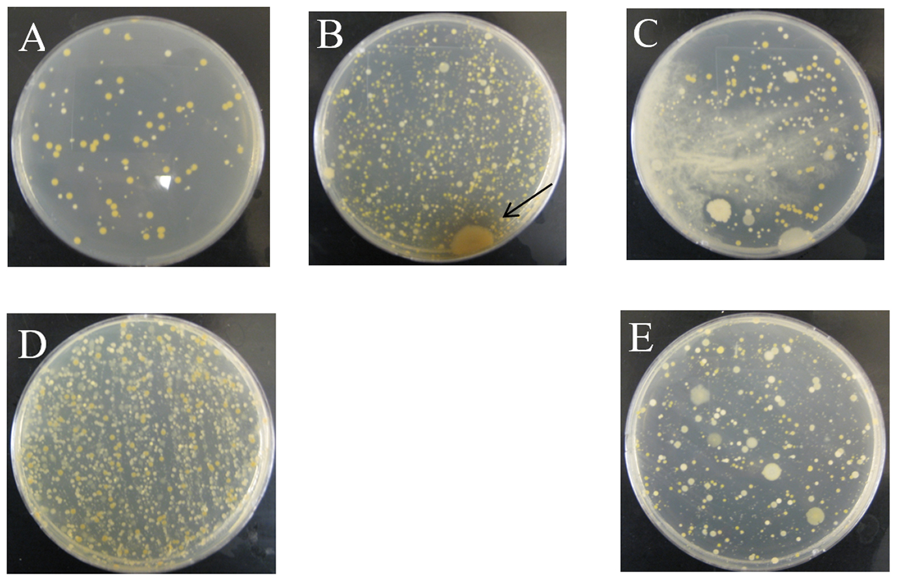
```


Six different buildings were swabbed, with two buildings representing each type of facility:
\begin{itemize}
    \item Academic buildings: Noyce and ARH
    \item Public residential buildings: Norris and Dibble
    \item Private residences: Cowles apartment 7110 and Yellow House (1478 Park St.)
\end{itemize}
Within each building, two faucets, two door handles, and two desk surfaces were swabbed.

  \begin{enumerate}
    \item Make the assumption that ANOVA is appropriate for the data (i.e., do not transform any data). Using software, conduct an ANOVA for the data that will analyze all main effects, as well as all two-way interactions. Treat the six buildings as six levels of the \textit{Building} factor. Treat faucet, desk, and door as three levels of the \textit{Location} factor.
    \item Create appropriate graphs/charts to check for equal variances and normality. Does it appear that it is appropriate to use ANOVA to analyze these data?
    \item Transform the response to the natural log of \texttt{Count} and redo the analysis. How do the results change? Create appropriate graphs to display the main effects and the interaction effects. Describe how the academic buildings (ARH and Noyce) compare to the other buildings.
  \end{enumerate}

  \item \textbf{Soda Fizz}\\
  Data set: \texttt{Soda}

Soda fizz is caused by carbon dioxide that is dissolved into liquid under pressure of up to 1200 pounds per square inch. When the consumer opens the package, pressure is released, the carbon dioxide gas is liberated from the liquid, and gas bubbles rise to the surface. This creates the desired tingling taste.$^9$ Since soda fizz is caused by the release of a gas, temperature may have an effect on amount of fizz, as gas volume generally increases with increased temperature. Furthermore, since the fizz is caused by gas bubbles being released from the liquid, the tilt of the cup being poured into may also impact the amount of fizz.

Two students, Julie and Daphne, conducted an experiment to test the effects of soda type (Pepsi vs. 7-Up), angle of the cup (cup flat on the table or slightly tipped), and soda temperature (refrigerated at 5°C vs. room temperature at 21°C) on the height of fizz produced when soda was poured out of a can into a cup. For each of the 24 trials, these students poured a can of either Pepsi or 7-Up into a clear cup and measured the peak fizz (in centimeters) produced, using a ruler on the outside of the cup.

  \begin{enumerate}
    \item Create appropriate graphs/charts to check for equal variances and normality. Does it appear that it is appropriate to use ANOVA to analyze these data? Show your work and give concise but appropriate explanations.
    \item Conduct a transformation on the data. Instead of using \texttt{Fizz} as the response, use the natural log of \texttt{Fizz}. Using software, conduct an ANOVA for the Soda data. Analyze all main effects, as well as all two-way interactions. Create appropriate graphs that describe the data. Clearly and concisely interpret the results.
  \end{enumerate}

  \item \textbf{Age and Memory}\\
  Data set: \texttt{MemoryA}

Michael Eysenck tested 100 subjects (50 people between the ages of 55 and 65, 50 younger people) to determine if there was a relationship between age and memory. Each subject was shown 27 words and asked to recall as many of those words as possible. He also tested whether five different techniques impacted memory. Each subject was given one of five types of instructions:

Counting: count the number of letters in each word \\
Rhyming: think of a word that rhymes with each word \\
Adjective: think of an adjective to describe each word \\
Imagery: create an image of each word \\
Intentional: remember as many words as possible

The subjects in the first four groups were not aware that they would later be asked to recall each word. The data set called \texttt{Age} provides the number of words that each subject properly wrote down after being asked to recall the list.

  \begin{enumerate}
    \item Create appropriate graphs/charts to check for equal variances and normality. Does it appear that it is appropriate to use ANOVA to analyze these data? Show your work and give concise but appropriate explanations.
    \item Take the square root of the response and conduct an ANOVA on the transformed data to analyze all main effects and two-way interactions. Create appropriate graphs that describe the data. Clearly and concisely interpret the results.
  \end{enumerate}

  \item \textbf{More Paper Towels}\\
  Data set: \texttt{Towels2}
  \begin{enumerate}
    \item In fact, three brands of paper towels were actually tested with three amounts of water. The data for the complete study are provided in \texttt{Towels2}. Write a statistical model corresponding to this data set.
    \item Conduct an ANOVA on the \texttt{Towels2} data set. Transform the data if appropriate. Explain any changes from the degrees of freedom and sum of squares values found in Question 36. Create main effects and interaction plots and use the $p$-values to state your conclusions.
  \end{enumerate}

  \item \textbf{Paper Cups: Fractional Factorial Designs}
  Data set: \texttt{Cups}

Have you ever wondered how paper cups are made? During the process, different temperatures, adhesives, pressure settings, paper stocks, types of machine, machine speeds, and many other variables can impact the quality of the cup that is made. Some cup-making machines can produce over 300 cups per minute. However, it can take a few hours to find the optimal running conditions. This can lead to a significant amount of wasted time and materials, as operators adjust the machine settings until good-quality cups are produced.

A manager of a manufacturing company, shift managers, cup machine operators, and a lone statistician decided to identify which factors were most influential in keeping their cups from leaking. Over 30 possible factors were identified, but after some thoughtful discussions the group settled on six variables that should be tested for their effects on leaking cups. One of the six factors of interest was which paper supplier to use. Since the company was considering changing suppliers, funds were available to do some product testing before a purchase was made. However, each trial (each run of production under specified factor conditions) would cost the company thousands of dollars in lost production time, material costs, and employee costs. The following is a list of questions representing the main factors in this study.

  \begin{itemize}
    \item Should the side-seam temperature be set at 70\% or 90\% when the cup is folded and the sides are sealed together?
    \item Should the side seam be sealed with an additional adhesive? This adds to production cost, but could be worthwhile if it improves the quality of the cup.
    \item Should the bottom temperature be set at 80\% or 94\% when the bottom is attached to each cup?
    \item Should the bottom pressure be set at 1000 or 1120 when the bottom is attached to each cup?
    \item Which supplier, Royal or Imperial, should be used? The suppliers have very similar prices.
    \item Should the paper stock come with an additional coating? This coating adds to production cost, but could be worthwhile if it improves the quality of the cup.
    \end{itemize}

The company agreed to conduct 32 tests, but wanted to test all six factors and all corresponding two-way interactions. Fractional factorial designs are very useful for this type of exploratory data analysis. The details of fractional factorial designs are beyond the scope of this text. However, balanced data are a key concept behind these designs. For example, in the Cups data, every factor has two levels and each level has 16 observations. In addition, within the first factor level (the 16 observations where side-seam temperature is set to 70\%), every other factor is still balanced (every other factor has 8 observations at each level).

  \begin{enumerate}
    \item Use software to conduct an ANOVA to analyze the \texttt{Cups} data set. This ANOVA should include six terms corresponding to the six main factors and 15 interaction terms.
    \item Create a main effects plot comparing the effects of each main factor. Explain how the $p$-values correspond to what you see in the main effects plot.
    \item Create a graph of all interaction plots. Explain how the $p$-values correspond to what you see in the interaction plots.
    \item Create a probability plot or histogram of the residuals to determine if the residuals are consistent with data from a normal distribution. Do residuals appear to follow the normal distribution?
    \item State your conclusions for this study. Provide an answer to each of the six key questions listed above, using $p$-values and plots. In addition, provide an interpretation of any significant interaction effects. Your explanations should be understandable to both managers and machine operators. Assume you are the lone statistician involved in this study. Be sure to clearly identify the population for which these conclusions hold and also state whether causation has been shown.
  \end{enumerate}

\end{enumerate}


### Endnotes{-}

\begin{enumerate}

\item Sir Winston Churchill (1874–1965) was the British prime minister during World War II, won the Nobel Prize in
Literature in 1953, and was made an honorary U.S. citizen in 1963.
\item http://www.popcorn.org
\item D. Montgomery, \textit{Design and Analysis of Experiments}, 7th ed. (New York: Wiley, 2009) is one of several design of
experiments texts that will describe that balanced designs are more powerful (more likely to reject the null hypothesis
when there truly is a difference between groups) than unbalanced designs.
\item G. E. P. Box, “Non-normality and Tests on Variances,” \textit{Biometrika}, 40 (1953): 318–335.
\item H. Levene, I. Olkin et al. (eds.), \textit{Contributions to Probability and Statistics: Essays in Honor of Harold Hotelling}
(Stanford: Stanford University Press, 1960), pp. 278–292. In addition, see M. B. Brown and A. B. Forsythe, “Robust
Tests for Equality of Variances,” Journal of the American Statistical Association, 69 (1974): 364–367.
\item D. Montgomery, \textit{Design and Analysis of Experiments}, 7th ed. (New York: Wiley, 2009) is one of several design of
experiment texts that describe multiple comparison techniques in more detail.
\item J. W. Costerton, G. G. Geesey, and K. J. Cheng, “How Bacteria Stick,” \textit{Scientific American}, 238.1 (1978): 86–95;
J. R. Lawrence, D. R. Korber, B. D. Hyde, J. W. Costerton, and D. E. Caldwell, “Optical Sectioning of Microbial
Biofilms,” \textit{Journal of Bacteriology}, 173 (1991): 6558–6567.
\item J. W. Costerton, P. S. Stewart, and E. P. Greenberg, “Bacterial Biofilms: A Common Cause of Persistent Infections,”
\textit{Science}, 284 (1999): 1318–1322.
\item Michelle Bryner, “Why Does Soda Fizz?” \textit{Live Science}, May 2009.
\item M. W. Eysenck, “Age Differences in Incidental Learning,” \textit{Developmental Psychology}, 10 (1974): 936–941.
\item J. Theios, “Reaction Time Measurements in the Study of Memory Processes,” in H. Bower (ed.), \textit{The Psychology of
Learning and Motivation}, vol. 7 (New York: Academic Press, 1973), pp. 44–85.
\item R. G. Pachella, “The Interpretation of Reaction Time in Information-Processing Research,” in B. H. Kantowitx (ed.),
\textit{Human Information Processing—Tutorials in Performance and Cognition} (Hillsdale, NJ: Erlbaum, 1974), pp. 41–82.
\item G. Cobb, \textit{Introduction to Design and Analysis of Experiments} (Emeryville, CA: Key College Publishing, 1998),
adapted from p. 2.
\item D. Montgomery, \textit{Design and Analysis of Experiments}, 7th ed. (New York: Wiley, 2009), p. 21.
\item Ibid, p. 22.

\end{enumerate}


<!--chapter:end:04-DOE.Rmd-->


```{r}
library(dplyr)
library(readr)
library(knitr)
library(kableExtra)
library(ggplot2)
library(tidyverse)
library(devtools)
library(plotly)
install_github("Tanvi-Jindal/myfirstpackage")
library(myfirstpackage)
theme_set(
  theme_minimal(base_family = "Latin Modern Roman") +
    theme(
      plot.title = element_text(size = 24, face = "bold"),
      axis.title = element_text(size = 12),
      plot.caption = element_text(size = 10, hjust = 0)
    )
)
```

# Categorical Data Analysis: Is a Tumor Malignant or Benign?


<span style="float:right;"> *It is commonly believed that anyone who tabulates numbers is a statistician. This is like believing that anyone who owns a scalpel is a surgeon.*</span>  
<span style="float:right;"> —Robert Hooke1</span>


This chapter introduces inference techniques for data in which both the explanatory and
response variables are categorical. The term categorical data analysis often refers to
analysis of data in which the response variable is categorical. However, in this chapter
we will restrict our focus to cases where both the explanatory and the response variables are
categorical and where there is no natural ordering to the categories.

Most of the hypothesis tests discussed in previous chapters use the normal distribution to
model the mean response. In this chapter, proportions, odds ratios, and relative risk will be
used to summarize categorical data. We will start by looking at cancer cell data to determine
if there is a relationship between the shape of the cell nuclei and the proportion of malignant
cells. In this chapter, we will discuss how to do the following:

* Conduct a simulation study, chi-square test, and Fisher’s exact test
* Calculate and properly interpret summary statistics such as relative risk and the odds ratio
* Determine which test to use based on various sampling schemes and questions of interest

## Investigation: Is Cell Shape Associated with Malignancy?

Cancer is a disease that occurs when abnormal cells grow in the body. When DNA (a substance in every
cell) is damaged, normal cells will often repair the damaged DNA. Cancer cells are cells in which the
DNA is not repaired. DNA can be damaged by many things, including viruses, tobacco smoke, alcohol, and too much sunlight. Cells with damaged DNA can also be inherited. Cancer cells can continue to grow and divide and usually form tumors (a lump or mass) somewhere in the body. Cancer cells can also [[[outlive It]]

is important to note that not all tumors are cancerous. If a lump is detected, part of it can be removed surgically and a biopsy conducted to determine if the mass is benign or malignant. Benign tumors are scar tissue or abnormal growths that do not spread and are typically harmless. Malignant (or invasive) cancer cells are cells that can travel, typically through the bloodstream or lymph nodes, and begin to replace normal cells in other parts of the body. If a tumor is malignant, it is essential to remove or destroy all cancerous cells in order to keep them from spreading. If a tumor is benign, surgery is typically not needed and the harmless tumor can remain.

A biopsy requires surgery to remove a section (or all) of the tumor and will leave a scar. Fine needle
aspiration (FNA) is a technique in which a small sample of the tumor is taken using a needle and visually inspected through a microscope. Since many tumors are benign, it is often preferable to have an FNA, which is less invasive and less traumatic than a biopsy.

Breast cancer is the second leading cause of cancer death among women in the United States. The
American Cancer Society estimated that, in the United States in 2010, 39,840 women and 390 men died from
breast cancer and 207,090 women were diagnosed with breast cancer.2 This type of cancer is often detected by finding a lump (or mass) in the breast.

Wolberg and Mangasarian developed a technique to accurately diagnose breast masses using only visual
characteristics of the cells within the tumor.3 This system is used at University of Wisconsin hospitals to assist doctors in diagnosis of breast cancer.4 Each FNA sample is placed on a slide, and characteristics of the cellular nuclei within the tumor are examined under a microscope. Several measurements, such as size, shape, and texture, are collected for each of the nuclei visible on the slide, and then an algorithm is used to determine the likelihood that a mass is benign or malignant.

In this chapter, we will focus on just a few characteristics from a relatively small data set that was collected at University of Wisconsin hospitals in Madison. We will start by determining if the shape of a cell nucleus can help us to determine whether a tumor is malignant or benign.
Typically, healthy cell nuclei have round or ellipsoid shapes.Figure 5.1 shows a sample of malignant cells that appear to have grown such that the perimeters of the cell nuclei have somewhat concave points.

```{r fig51, echo=FALSE, out.width="80%", fig.align="center", fig.cap="Segmented bar graph of nucleus shape and malignancy."}
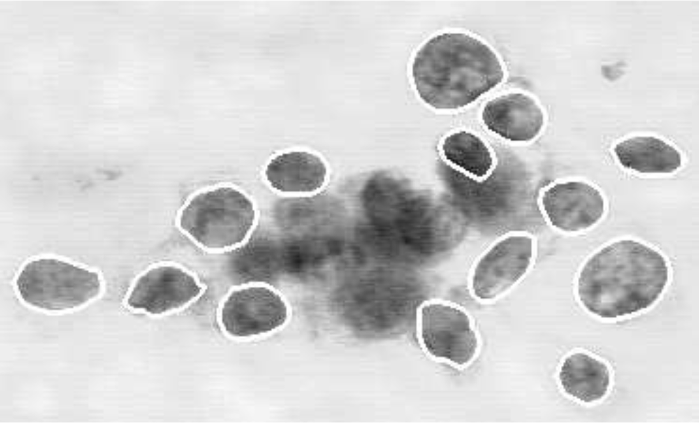
```

Figure 5.1 An image of malignant cells where nuclei are outlined with a curve-fitting program.  Reprinted by permission. Mangasarian, Street & Wolberg, “Breast Cancer Diagnosis and Prognosis via Linear Programming,” INFORMS Journal Operations Research, 43.4, 1995. © 1995, Institute for Operations Research and the Management Sciences (INFORMS).

## Summarizing Categorical Data

Table 5.1 shows data from 37 FNA slide samples. Slides with smooth ellipsoid-shaped nuclei were classified as round, and slides with poorly shaped cell nuclei were classified as concave. A biopsy was also conducted on each of these samples to determine if each was malignant or benign.

```{r tab51, echo=FALSE, results='asis'}
tab6.1 <- data.frame(
  Shape = c("Round","Concave","Total"),
  Benign = c(9,4, 13),
  Malignant = c(7, 17, 24),
  Total = c(16, 21, 37),
  check.names = FALSE,
  stringsAsFactors = FALSE
)

cat(
  kable(
    tab6.1,
    format = "latex",
    booktabs = TRUE,
    escape = FALSE,
    caption = "The numbers of benign and malignant tumors for round and concave cell nuclei.",
    align = c("l","r","r","r")
  ) %>%
  add_header_above(c(" "=1, "Type"=2, " "=1)) %>%
  kable_styling(latex_options="HOLD_position")
)
```

In Table 5.1, both the variables are categorical. A **categorical variable** is one for which the measurement consists of categories, such as college major, political affiliation, personality type, gender, or pass/fail grade. When a variable is categorical, each subject or unit must fit in one and only one category. A **binary variable** is a special type of categorical variable that has just two possible categories.

Summarizing quantitative data such as age, weight, and income often includes calculating the mean value.
However, Table 5.1 cannot be used to calculate the mean Shape or mean Type value. Since these categorical variables have no ordinal or interval meaning, it is not appropriate to focus on the mean response; rather, we focus on the proportion (or percent) of responses that fall into each category.

A table that counts the number of observations in each group, such as Table 5.1, is called a **contingency table** (or cross-tabulation table). A contingency table with two variables is called a **two-way contingency table**. Table 5.1 is also called a **2 x 2 table**, since there are two row groups and two column groups. In Table
5.1, the Shape of the cell is called the **row variable**, since each horizontal row represents one shape group.
Similarly, the Type of the cell is called the **column variable**.

>**NOTE**Categorical data that have a natural ordering, such as level of agreement (strongly disagree, disagree indifferent, agree, strongly agree) or evaluation of a product (poor, fair, good, or excellent), are called **ordinal data**. Categorical data that do not have a natural ordering, such as gender or major, are called **nominal data**. Techniques for nominal data will give identical results for any ordering of the categories, whereas results based on techniques for ordinal data do depend on the ordering of the data. This chapter is restricted to examples of nominal data analysis techniques.


\textbf{\textcolor{blue}{Key Concept:}}
\textcolor{blue}{Analysis of categorical response variables requires calculating the proportion of responses in each category rather than calculating means.}


### Activity: Descriptive Statistics and Graphs {-}

1. Identify the observational units, the explanatory variable, and the response variable in the cancer cell data in Table 5.1.
2. Calculate the proportion of round cell samples that are malignant and the proportion of concave cell
samples that are malignant.
3. Create a segmented bar graph using Table 5.1. Typically, the explanatory variable should be along the
horizontal axis. Assuming this is a random sample from a larger population, does the graph show evi-
dence that nucleus shape is related to the likelihood of a cell being malignant? Explain.

Bar graphs are often useful in comparing two categorical variables. Figure 5.1 shows a **segmented bar graph** (also called a stacked bar graph) for the cancer cell data. This graph shows the conditional percentages for each nucleus shape. About 80% of the concave nuclei are malignant, whereas about 45% of the round nuclei are malignant.

```{r fig52, echo=FALSE, fig.width=6, fig.height=4, message=FALSE, fig.cap="Segmented bar graph of nucleus shape and malignancy."}
library(ggplot2)
library(tidyr)
library(scales)

#df <- read.csv("Table5.1.csv", stringsAsFactors = FALSE)
data("C6Table6.1")
df<-C6Table6.1
colnames(df)[1] <- "Shape"
df_long <- pivot_longer(
  df,
  cols      = c("Benign", "Malignant"),
  names_to  = "Diagnosis",
  values_to = "Count"
)
df_long$Shape <- factor(df_long$Shape, levels = c("Round", "Concave"))

ggplot(df_long, aes(x = Shape, y = Count, fill = Diagnosis)) +
  geom_col(position = "fill", color = "black", width = 0.6) +
  scale_y_continuous(labels = percent_format(accuracy = 1), expand = c(0, 0)) +
  scale_fill_manual(
    "",
    values = c(
      "Benign"    = "#00BFC4",
      "Malignant" = "gray30"
    )
  ) +
  labs(x = NULL, y = "Percent") +
  theme_minimal(base_family = "serif") +
  theme(
    panel.background   = element_rect(fill = "white", colour = "black", linewidth = 1),
    panel.border       = element_rect(fill = NA,       colour = "black", linewidth = 1),
    plot.background    = element_rect(fill = "grey90", colour = "black", linewidth = 1),
    legend.background  = element_rect(fill = "white",  colour = "black"),
    legend.position    = "inside",                             # new
    legend.position.inside = c(0.85, 0.8),                     # new
    plot.margin        = margin(20, 20, 20, 20)
  )

```

## A Simulation Study: How Likely Is It That the Observed Sample Would Occur by Chance?

Figure 5.2 shows that our sample of 37 slides indicates a relationship between the shape of the cell nuclei and malignancy. However, statistical inference is needed to draw conclusions about the entire population from which these samples were selected. In this section, we will conduct a hypothesis test to determine if the sample data provide evidence that the proportion of malignant cells is greater for concave nuclei than for round nuclei.

The hypothesis test in this example is one-sided because we have a medical reason to suspect that concave nuclei are more likely to be malignant. For this example, the null and alternative hypotheses can be written as

\begin{align}\label{5.1}
H_0: p_C = p_R \quad\text{vs.}\quad H_a: p_C > p_R 
\tag{5.1}
\end{align}

where $p_C$ is the true proportion of concave nuclei that are malignant and $p_R$ is the true proportion of round nuclei that are malignant.

If the null hypothesis, $H_0$, is true, the two populations (of concave and round cells) have the same proportion of malignant cells and the observed difference between round and concave cells in our sample is due simply to the random sampling process. In other words, the samples just randomly happened to have more malignant cells in the concave nucleus population than in the round nucleus group.

The **$p$-value** for this test is the probability of obtaining a difference in sample proportions ($\hat p_C - \hat p_R$) as large as or larger than the one observed in this sample when the null hypothesis is true. If the $p$-value is small, it is unlikely that the null hypothesis is true and we conclude that the alternative hypothesis ($p_C > p_R$) is true.

One way to estimate this $p$-value is to simulate taking samples many times under the following three conditions:

• Assume that malignancy is unrelated to cell nucleus shape (i.e., assume that both cell nucleus shapes have the same proportion of malignant cells).  
• A total of 13 benign and 24 malignant cells were observed.  
• A total of 16 round cell nuclei and 21 concave cell nuclei were observed.

### Activity: Conducting a Simulation Study with Cards {-}

4. Use 37 index cards to represent this sample of 37 cancer cells. On 24 of the cards write M for “malignant,” and on 13 of the cards write B for “benign.” Shuffle the cards and randomly select 21 cards. These
21 cards can represent the concave nucleus group. How many of the 21 concave cards are also malignant?

5. Repeat the simulation process in Question 4 nine more times. Does it seem likely that 17 or more malignant cells would occur in the concave group by chance alone? While simulations can be done by hand with cards, this process is very time consuming, as a large number of simulations are needed to get a true feel for the likelihood of an outcome (many statisticians suggest 10,000 simulations). Instead of repeating the above process 10,000 times by hand, we will use a computer program to conduct a simulation.

### Activity: Computer Simulation {-}

6. Use the technology instructions provided on the CD to conduct one simulation. In this simulation, you should have one column listing 24 malignant and 13 benign cells. Randomly select 21 rows to represent
the concave nucleus shapes. Count the number of observations that fall into the concave malignant group.

7. Repeat the computer simulation process in Question 6 nine more times, each time recording the number of malignant cells you sampled in the concave nucleus group. How does this simulation compare to
your index card simulation? Would you expect to get exactly the same number of samples with 17 or more malignant cells? Why or why not?

8. Use the software instructions to repeat the computer-simulated randomization process a total of 10,000 times. Create a histogram of the 10,000 simulated counts in the concave malignant group. Estimate the
p-value by dividing the number of counts greater than or equal to 17 by 10,000.

```{r tab52, echo=FALSE, results='asis'}
cols <- c("0", "...", "7", "8", "9", "10", "11", "12",
          "13","14","15","16","17","18","19","20","21")
row1 <- c("0","...","0","1","8","118","551","1508",
          "2483","2655","1734","722","197","21","2","0","0")
df6.2 <- rbind(
  "Concave Malignant Cells"   = cols,
  "Observed Number of Trials" = row1
)
colnames(df6.2) <- cols

raw_tbl <- kable(
  df6.2,
  format = "latex",
  booktabs = TRUE,
  escape = FALSE,
  col.names = rep("", ncol(df6.2)),
  align = c("l", rep("r", ncol(df6.2))), 
  caption = paste0(
      "10,000 simulated trials based on Question 8. ",
      "The $p$–value is $P(X\\ge17)=0.022=(2+21+197)/10,000$, where $X$ ",
      "is the number of concave malignant cells.")
) %>% column_spec(1, width = "2cm") 

lines <- strsplit(raw_tbl, "\n")[[1]]
lines <- lines[!grepl("^\\s*&", lines)]
cat(paste(lines, collapse="\n"), "\n")
```

Table 5.2 shows 10,000 simulated trials, based on Question 8. This simulation had 220 observations greater than or equal to 17, providing a p-value of $P(X \geq 17)= 0.022$, where X is the number of concave
malignant cells. Thus, we can conclude that if the null hypothesis were true (the proportion of malignant cells was the same for cells with round and concave nuclei), the likelihood of finding 17 or more malignant cells out of the 21 cells with concave nuclei would be approximately 220 out of 10,000. This small p-value shows
that the difference in our sample proportions is so large that it is unlikely to have occurred by chance. Thus, we reject the null hypothesis and conclude that cells with concave nuclei are more likely to be malignant than cells with round nuclei.

Using simulations to approximate p-values has many advantages. Often simple programs or macros can be written to quickly simulate thousands of samples. Computer programs can be modified to fit a variety of situations, while parametric tests with theoretical assumptions can be somewhat rigid and require large sample sizes. Simulations only provide approximate p-values. However, increasing the number of simulations improves the precision of the p-value; 10,000 simulations usually provides precise p-values.

>**NOTE**This simulation study is an example of a permutation test. Chapter 1 describes that permutation hypothesis
tests are significance tests that simulate the act of randomly rearranging units into groups.


\textbf{\textcolor{blue}{Key Concept:}}
\textcolor{blue}{Simulation studies are gaining in popularity because computer simulations can quickly and easily find accurate p-values. In addition, unlike most tests that have distributional assumptions, simulation studies do not have minimum sample size requirements and are often more accurate than distribution-based tests for studies with small sample sizes.}


## Fisher’s Exact Test

While the use of simulations to determine $p$-values is quickly gaining in popularity, sometimes the exact $p$-value can be calculated based on an appropriate probability model. **Fisher’s exact test** uses the **hypergeometric distribution** to calculate exact probabilities.

Just as in the simulation study, we are interested in testing $H_0: p_C = p_R$ vs. $H_a: p_C > p_R$. In addition, we use the same three assumptions to find the $p$-value, the probability that 17 or more of the malignant cells occur in the concave nucleus group when $H_0$ is true. Table 5.3 provides the same data as Table 5.1, but notation has been included to extend this test to any 2 × 2 table.

In any 2 × 2 table, there are a total of $N$ observations that can be classified as either a success or a failure. $M$ represents the number of success, and thus $N - M$ is the number of failures. We are interesting in finding the probability of observing $x$ successes in a random selection of $n$ observations. For the cancer cell data in

```{r tab53, echo=FALSE, results='asis'}
tab6.3 <- data.frame(
  Shape     = c("Round", "Concave", "Total"),
  Benign    = c("9", "4", "13"),
  Malignant = c("7", "$17 = x$", "$24 = M$"),
  Total     = c("16", "$21 = n$", "$37 = N$"),
  check.names      = FALSE,
  stringsAsFactors = FALSE
)

cat(
  kable(
    tab6.3,
    format = "latex",
    booktabs = TRUE,
    escape = FALSE,
    caption = "The numbers of benign and malignant tumors for round and concave cell nuclei.",
    align = c("l","r","r","r")
  ) %>%
  add_header_above(c(" "=1, "Type"=2, " "=1)) %>%
  kable_styling(latex_options="HOLD_position")
)
```

Table 5.3, $x$ represents the event of interest (observing 17 concave malignant cells), $N = 37$ represents the total number of observations, $M = 24$ is the total number of malignant cells (number of successes), and $n$ is the total number of observations in the concave group.

>**MATHEMATICAL NOTE** In this section, we simply discuss how to conduct Fisher’s exact test with statistical software. The extended activities shows that Fisher’s exact test uses the hypergeometric distribution to calculate exact $p$-values. For any 2 × 2 contingency table when there are $N$ total observations with $M$ total successes, the probability of observing $x$ successes, $P(X = x)$, in a sample of size $n$[[[ is]]]


\begin{align}
\frac{\text{number of ways to select $x$ successes and $n - x$ failures}}{\text{number of ways to select $n$ subjects}}
 &= \frac{\binom{M}{x}\,\binom{N - M}{n - x}}{\binom{N}{n}} \notag
\end{align}

where $\binom{M}{x} = M \text{“choose”} x = \frac{M!}{x!(M - x)!}$.^[For any positive integer, the notation n! is read “n factorial” and is defined as $n!= n(n- 1)(n- 2) \cdot\cdot\cdot (3)(2)(1)$. For example, “3 factorial” is $3 \times 2 \times 1= 6$ and “four factorial” is $4!= 4 \times 3 \times 2 \times 1= 24$. In addition, $0!= 1$.] Similar calculations hold for $\binom{N - M}{n - x}$ and $\binom{N}{n}$."

### Activity: Calculating Fisher’s Exact Test {-}

9. In this cancer study, assume N= 37 observations with M = 24 successes. If n = 21 observations are selected, use the technology instructions provided on the CD to calculate the exact probabilities
P(X = 17), P(X = 18), P(X = 19), P(X = 20), and P(X= 21).

10. Assuming N= 37, M= 24 successes, and n = 21, create a histogram of the probabilities for x. Compare the probabilities in Question 9 to the probabilities in Question 8. Since Question 8 was a simulation of the hypergeometric distribution, these histograms should look very similar.

11. What is the exact p-value P(X $\geq$ 17)? How does this exact p-value compare to the simulated p-value?

12. There is nothing special about how a success or failure is defined. Assume we have a table of N = 37 observations with M = 13 successes (here a benign cell is considered a success). For a sample of size 16 (round nuclei), find P(X $\geq$ 9). How does this answer compare to your answer in
Question 11?

13. Assume we have a table of N = 37 observations with M = 13 successes (here a benign cell is considered a success). For a sample of size 21 (concave nuclei), find P(X $\geq$ 4). How does this answer compare to your answer in Question 11?


Both the simulation in Section 5.3 and Fisher’s exact test can be considered permutation tests. The simulation study provides an approximation to Fisher’s exact test. Fisher’s exact test provides a $p$-value for this problem of $P(X \geq 17)= 0.0225$. If there truly were no difference between the likelihood of malignancy for the two nucleus shapes (which would mean the null hypothesis $H_0$ was true), random sampling would produce this outcome (17 or more malignant cells in the concave group) 2.25% of the time. This small probability provides evidence that $H_0$ should be rejected.

>**MATHEMATICAL NOTE** In this section, we simply discuss how to conduct Fisher’s exact test with statistical software. The extended activities shows that Fisher’s exact test uses the hypergeometric distribution to calculate exact $p$-values. For any 2 × 2 contingency table when there are $N$ total observations with $M$ total successes, the probability of observing $x$ successes, $P(X = x)$, in a sample of size $n$ is Fisher’s exact test and the corresponding simulation study were derived here using a rather strong assumption about the null hypothesis. Both tests were completed under the assumption that we had observed 13 benign and 24 malignant cells and that these totals would be the same in every randomization. Statisticians call this a **conditional test of independence**. In other words, both the row and the column totals are known (fixed) before the study is conducted. However, the extended activities will show that Fisher’s exact test can be used for any 2 $\times$ 2 table, even when the margin totals are not fixed.$^5$


\textbf{\textcolor{blue}{Key Concept:}}
\textcolor{blue}{Fisher’s exact test uses the hypergeometric distribution to provide exact p-values even for small sample sizes and succes/failure proportions near 0% or 100%}

## Two-Sided Hypothesis Tests

In Fisher’s exact test and the simulation study, 17 or more concave malignant cells corresponded to a difference in sample proportions of $\hat p_C - \hat p_R = 0.8095 - 0.4375 = 0.372$ or more. The $p$-value was the probability of calculating a sample statistic *greater than or equal to* $\hat p_C - \hat p_R = 0.372$ given that $p_C = p_R$.

Before this sample was collected, the researchers had medical reasons to believe that the cells with concave nuclei (i.e., the malformed nuclei) might be more likely to be malignant. If there had been no specific reasoning to justify a one-sided hypothesis, a two-sided hypothesis test would have been more appropriate:

\begin{align}\label{5.2}
H_0: p_C = p_R \quad\text{vs.}\quad H_a: p_C \neq p_R 
\tag{5.2}
\end{align}

The $p$-value for a two-sided hypothesis is the probability of calculating a sample statistic *at least as extreme as* $\hat p_C - \hat p_R = 0.372$ given that $p_C = p_R$. That is, if the null hypothesis is true, what is the probability that $\hat p_C - \hat p_R \ge 0.372$ or $\hat p_C - \hat p_R \le -0.372$.

Question 14 helps to show that the difference in proportions, $\hat p_C - \hat p_R \le -0.372$, corresponds to 10 or fewer concave malignant cells. Table 5.2 can then be used to calculate the approximate $p$-value for the two-sided hypothesis test:

\begin{align}
\text{p-value}
&= P(\hat p_C - \hat p_R \le -0.372) + P(\hat p_C - \hat p_R \ge 0.372) \notag \\ \notag
&= P(X \le 10) + P(X \ge 17) \\ \notag 
&= \frac{1 + 8 + 118 + 197 + 21 + 2}{10{,}000} \\ \notag
&= 0.0347 \notag
\end{align}

Based on this simulation, the two-sided hypothesis test should reject the null hypothesis and conclude that $p_C \neq p_R$.

### Activity: Calculating a Two-Sided Hypothesis Test {-}

14. The three conditions in Section 5.3 stay the same for both the one-sided and the two-sided tests. The total number of malignant cells must be 24, the number of concave cells is 21, and the number of round cells is 16. Thus, when $Y =$ the number of concave malignant cells, $\hat p_C - \hat p_R = Y/21 - (24 - Y)/16$.  
a. Find $\hat p_C - \hat p_R$ when $Y = 17$.  
b. Find $\hat p_C - \hat p_R$ when $Y = 9, Y = 10,$ and $Y = 11$.  
Notice that the two-sided test is not completely balanced; there is no count, $Y$, that exactly corresponds to $\hat p_C - \hat p_R = -0.372$. However, any $Y \le 10$ will satisfy $\hat p_C - \hat p_R \le -0.372$.  

15. Repeat Question 8 to estimate the $p$-value for the two-sided hypothesis test.  

16. Use the hypergeometric distribution to find the $p$-value for the two-sided hypothesis test.

>**NOTE**Two-sided tests can be somewhat cumbersome. Many statisticians suggest simply approximating a two-sided $p$-value by doubling the one-sided $p$-value. For example, the $p$-value for $H_0: p_C = p_R$ vs. $H_a: p_C \neq p_R$ is $2 \times P(X \ge 17) = 2(0.0225) = 0.045$.  

## Chi-Square Test

Fisher’s exact test has the advantage of providing exact p-values. Before technology was available to provide quick and easy ways to conduct Fisher’s exact test and simulation studies, the chi-square test was typically used.

You may recall from previous statistics courses that the chi-square test requires that certain assumptions be met before any analysis is done. For example, large sample sizes are needed, especially if the proportion of successes in either group is close to 0% or 100%. If the sample size is large enough, the distribution of the chi-square test statistic will resemble the chi-square distribution.

\textbf{\textcolor{blue}{Key Concept:}}
The steps to conduct a chi-square test are similar to those for the hypothesis tests discussed in most introductory statistics classes.^[For 2 × 2 tables, the chi-square test statistic is identical to the square of the Z-statistic when testing for equal population proportions. In addition, the p-values for the two tests will be identical.] To conduct a chi-square test you will need to do the following:

-  State the null and alternative hypotheses.

- Calculate the test statistic.

- Calculate the p-value.

- Check model assumptions.

- Draw conclusions within the context of the study.


**Step 1: State the null and alternative hypotheses:**

The null and alternative hypotheses can be written in exactly the same terms as for the two-sided per-
mutation test:

\begin{align}
H_0: p_C &= p_R \quad\text{vs.}\quad H_a: p_C \neq p_R 
\notag
\end{align}


The null hypothesis is equivalent to stating that the distributions (of malignant cells) are the same
across all groups of nucleus shapes. This test is often called a test of homogeneity.

>**MATHEMATICAL NOTE** In this section, we simply discuss how to conduct Fisher’s exact test with statistical software. The extended activities shows that Fisher’s exact test uses the hypergeometric distribution to calculate exact $p$-values. For any 2 × 2 contingency table when there are $N$ total observations with $M$ total successes, the probability of observing $x$ successes, $P(X = x)$, in a sample of size $n$ [[[is Some]]] texts suggest using the chi-square test for homogeneity if separate samples are selected from more than one population and using the chi-square test for independence when data are collected from a single sample. Even though this study is based on one sample of 37 slides, the extended activities will show that both the test of homogeneity and the test of independence are appropriate. The calculations for both tests are identical; however, the hypotheses and conclusions are different. We choose to present the test of homogeneity in this section so that the hypotheses and conclusions coincide with those for the
two-sided permutation tests.


**Step 2: Calculate the test statistic:**

The chi-square test statistic is a measure of the difference between the observed counts in Table 5.1
and the expected counts that are calculated under the assumption that the null hypothesis is true (shown
in Table 5.4).

In this study, 7 out of the 16 round nuclei were malignant ($\hat p_R = 7/16= 0.4375$) and 17 out of the
21 concave nuclei were malignant ($\hat p_C = 17/21= 0.8095$). Assuming that the proportion of malignant
cells is the same for both nucleus shapes, the best estimate of the overall proportion of cells that are
malignant is $(7 + 17)/(16 + 21)= 24/37= 0.64865$.

Each expected cell count is calculated by multiplying the estimated proportion times the
­ appropriate sample size (the total number of concave nuclei or total number of round nuclei).
There are 16 round nuclei in our study, so the expected count of round malignant cell nuclei is
$16(24/37)= 10.38$. In general, the expected counts are calculated as row total $\times$ column total/
overall total.

### Activity: Calculating Expected Counts {-}
17. Calculate the expected count of concave malignant cell nuclei.  

18. Assuming the null hypothesis is true, what is the estimated proportion of benign cells in the population? If you select a sample with 16 round cells, what is the expected count of round benign cells?

Table 5.4 shows a table of expected counts under the assumption that the null hypothesis is true: the different cell nucleus shapes have the same proportion of malignant cells. Where:

\begin{align}
\text{expected count} \;=\; \frac{\text{row total} \times \text{column total}}{\text{overall total}}.
\notag
\end{align}

For example:

\begin{align}
10.38 = \frac{16 \times 24}{37}, \notag
\quad
5.62 = \frac{16 \times 13}{37}. \notag
\end{align}

```{r tab54, echo=FALSE, results='asis'}
library(knitr)
library(kableExtra)

# Table 6.4: expected counts
tab6.4 <- data.frame(
  Shape = c("Round",    "Concave", "Total"),
  Benign = c(  5.62,       7.38,     13),
  Malignant = c( 10.38,      13.62,     24),
  Total= c( 16,      21,     37),
  check.names = FALSE,
  stringsAsFactors = FALSE
)

kable(
  tab6.4,
  format = "latex",
  booktabs = TRUE,
  caption = "Table of expected counts for the cancer cell study.",
  align = c("l","r","r","r","r"),
  escape = FALSE
) 
```

>**NOTE**In a chi-square test, the expected counts are calculated from the totals of the observed data. Totals in the table of observed counts (like Table 5.1) and the table of expected values (like Table 5.4) are identical, except for possible round-off error.  
\normalsize

The chi-square test statistic is calculated to measure if the observed data are consistent with the null
hypothesis. The chi-square statistic is

\begin{align} \label{5.3}
\chi^2 = \sum \frac{(\text{observed count} - \text{expected count})^2}{\text{expected count}} 
\tag{5.3}
\end{align}

This statistic is the sum of each squared difference between the observed count and the expected count,
weighted by the expected count. The *observed count* represents the observed cell count from Table 5.1, and the *expected count* represents the expected cell count from Table 5.4.

The chi-square statistic for the cancer cell study is

\begin{align}
\chi^2
&= \frac{(9 - 5.62)^2}{5.62} + \frac{(7 - 10.38)^2}{10.38} + \frac{(4 - 7.38)^2}{7.38} + \frac{(17 - 13.62)^2}{13.62} \\[6pt] \notag
&= 2.03 + 1.10 + 1.55 + 0.84 = 5.52 \notag
\end{align}

The chi-square test statistic is always positive. If the observed and expected counts are identical, then the test statistic $\chi^2 = 0$. If the observed data are far from the expected data, the test statistic will be large and the null hypothesis will be rejected. The chi-square test is not used to show that one proportion is greater or less than another proportion, but to show that the proportions are not equal. Thus, the chi-square test is a two-sided test.

>**NOTE** The chi-square test can be extended to categorical data with more than two rows and more than two col-
umns. Notice that the table of expected values and the chi-square test statistic in Equation (5.3) can be calculated with additional rows and columns


**Step 3: Calculate the *p*-value:**
The p-value will help us determine if a test statistic of $\chi^2 = 5.52$ or larger is likely to occur by chance. If the null hypothesis is true, the $\chi^2$ test statistic will follow a chi-square distribution where the degrees of freedom are calculated as (number of rows - 1) $\times$ (number of columns - 1). In the cancer cell study, there are two rows of data (round and concave) and two columns of data (benign and malignant); thus, the test statistic has $(2- 1) \times (2- 1) = 1$ degree of freedom.

### Activity: Conducting a Chi-Square Test {-}

19. Use a statistical software package to conduct a chi-square test for the cancer cell data.

a. Submit the computer output showing the observed and expected tables, the test statistic, and the
p-value.

b. Assuming the data were a simple random sample from a larger population, what conclusions can
you draw about the population?

c. Can you conclude that the shape of the cell nucleus causes a change in the likelihood that a cancer
cell is malignant? Why or why not?


**Step 4: Check model assumptions:**
Just like most hypothesis tests, the chi-square test requires that each observation be independent. In addition, the chi-square test requires a large enough sample size in each of the cells to ensure that the test statistic can be accurately represented by the chi-square distribution. Some statisticians have slightly different technical assumptions for the sample size needed, but here are two general rules:  

- For 2 × 2 contingency tables, the sample size should be large enough that the expected count in each of the 2 × 2 cells in the table is at least 5.  
- For tables with more than two rows or two columns, all expected counts should be greater than 1 and the average expected count should be greater than or equal to 5.

In the cancer cell study, all the expected counts are greater than 5, so it is appropriate to use the chi-square test.

>**NOTE** In this example, some of the expected counts are just slightly greater than 5. In this case, some texts might suggest using a chi-square test with a continuity correction. However, simulation studies and Fisher’s exact test can now be easily calculated with computers and provide more accurate p-values. Thus, there really is no longer a need to use a chi-square continuity correction to estimate the p-value.  


**Step 5: Draw conclusions within the context of the study:**

The chi-square test provides a p-value of 0.019 for the cancer cell study. This indicates that we should reject the null hypothesis in favor of the alternative. Thus, the chi-square test leads to the same conclusion as the two-sided simulated permutation test and the two-sided Fisher’s exact test: Each nucleus shape has a different proportion of malignant cells.

The p-value of 0.019 for the chi-square test is somewhat close to the result of the simulation study conducted in Section 5.3, where we found a two-sided p-value of 0.0347. Every person conducting a chi-square test on the data in Table 5.1 should get the same p-value, while each simulation study will provide a slightly different p-value. Many students mistakenly assume that the variation in the p-value for the simulation study indicates that it is less accurate than the p-value for the chi-square test. But, in fact, the simulation study is more accurate than the chi-square test. Fisher’s exact test shows that the two-sided hypothesis test for the cancer cell study has an exact p-value of 0.0357. With larger sample sizes, the p-values for chi-square tests will be closer to the exact p-values.

### Activity: Simulating the Chi-Square Test Statistic {-}

20. **Degrees of Freedom** Create a 2 × 2 contingency table with the same totals in the margins as in Table 5.1. Assume you counted 16 concave malignant nuclei in Question 6. Fill in the rest of the table cells. Note that you can complete the other three table counts (the concave benign, round malignant, and round benign) with just one known count value. Thus, only one table cell count is truly free—once one cell is determined, the other three are fixed. This demonstrates why 2 × 2 contingency tables have only 1 degree of freedom.  

21. **Degrees of Freedom** Create a 3 × 2 contingency table with row totals of 25, 30, and 25 and column totals of 30 and 50. How many table cell counts are truly free (i.e., what is the smallest number of table cell counts that, when filled in, will completely specify the rest of the cells)? Describe how the formula (number of rows - 1) × (number of columns - 1) relates to the number of free cells in a two-way contingency table of any size. It may be helpful to create a 3 × 3 table or a 3 × 4 table to convince yourself that this rule continues to hold.

## What Can We Conclude from the Cancer Study?

The cancer cell data in Table 5.1 were analyzed with a simulation study (more specifically, a permutation test), a chi-square test, and Fisher’s exact test. All tests suggested that the null hypothesis should be rejected, and thus we conclude that concave and round cell nuclei are associated with different proportions of malignant cells.

This study was not an experiment, since there was no random allocation of units to particular conditions. Thus, while we expect that there is an association between nucleus shape and malignancy, we cannot conclude that nucleus shape *causes* different proportions of malignancy.

The individuals who provided these 37 slide samples were not a true random sample of all North Americans, but a sample of patients who volunteered to be part of the study at the University of Wisconsin hospitals. Subjects in medical studies are rarely true random samples from the general population. We cannot be certain that these results hold for a larger population of people. However, it seems reasonable for researchers to believe that cancer cells from patients in Wisconsin are similar to cancer cells from other patients in other hospitals. Thus, we can cautiously conclude that this study provides some evidence that the different nucleus shapes are associated with different proportions of malignant cells.

## Relative Risk and the Odds Ratio

The **proportion** of malignant nuclei in this study is 24/37 = 0.6486. This overall proportion of malignancy is often called the **risk** (or baseline risk) of malignancy. The **conditional proportion** is the proportion of malignant cells calculated for each cell shape. Thus, the round nuclei have a conditional proportion (of malignancy) = 7/16 = 0.4375, and the concave cells have a conditional proportion (of malignancy) = 17/21 = 0.8095.

The hypothesis tests in this chapter have focused on determining whether concave and round nuclei have the same proportion of malignancy. However, it is important to recognize that there are limitations in testing for differences in proportions. For example, assume that we have two studies. In the first study,

\begin{align}
\hat p_1 - \hat p_2 &= 0.52 - 0.48 = 0.04
\notag
\end{align}

In the second study,

\begin{align}
\hat p_1 - \hat p_2 &= 0.05 - 0.01 = 0.04 
\notag
\end{align}

Both studies could test whether an observed difference in proportions of 0.04 is significant. However, in the second study *$\hat p_1$* is five times larger than *$\hat p_2$*.

An alternative calculation that is commonly used for data with categorical response and explanatory variables is the relative risk. In the following calculations, we arbitrarily decided to define a malignant cell as a success.

\begin{align}\label{5.4}
\text{Relative risk} &= \frac{\text{proportion of successes in group 1}}{\text{proportion of successes in group 2}} = \frac{\hat p_1}{\hat p_2} \tag{5.4}
\end{align}

In the cancer cell study, the relative risk is 0.8095/0.4375 = 1.85. Thus, the risk of malignancy is 1.85 times greater for the concave group than for the round group.

The **odds** (more specifically, odds of success) can also be used to compare proportions and tend to have meaning over a broader range of potential outcomes.

\begin{align}\label{5.5}
\text{Odds} &= \frac{\text{number of successes}}{\text{number of failures}} \tag{5.5}
\end{align}


The odds of malignancy in the concave group are 17 to 4, meaning that we expect 17 successes (malignant cells) for every 4 failures (benign cells). This is often stated as follows: The odds of malignancy in the concave group are 4.25 (17 ÷ 4) to 1 (4 ÷ 4). The odds of malignancy in the round group are 7 to 9. The **odds ratio** is used to compare the odds of two groups.

\begin{align}\label{5.6}
\text{Odds ratio} &= \frac{\text{odds of group 1}}{\text{odds of group 2}} = \frac{\hat\theta_1}{\hat\theta_2} \tag{5.6}
\end{align}

The odds ratio in the cancer cell study is $\frac{17/4}{7/9} = 5.5.$. Thus, the odds of malignancy are 5.5 times greater for the concave group than for the round group. When the odds ratio = 1, the odds for both groups are equal.

>**NOTE** In relative risk and odds ratio calculations, the group that has the lower proportion (or lower odds) is typically considered group 2 (in the denominator). That way, the relative risk and odds ratio are always numbers larger than one and easier to interpret.  


\textbf{\textcolor{blue}{Key Concept:}}
\textcolor{blue}{In studies where the proportions are far away from 0.5, the hypothesis test for the difference in proportions may not best represent your question of interest. When both conditional proportions are small, the relative risk and odds ratio are preferable, since they take the base line rate (overall proportion of successes) into account.} 


### Activity: Calculating Additional Summary Statistics {-}
Data set: `Table 5.1`

22. Use the data from Table 5.1 and define a benign cell as a success and round cells to be group 1. Calculate and interpret the relative risk and the odds ratio.  

23. Show that the null hypothesis $H_0: p_1 = p_2$ is mathematically equivalent to the null hypothesis $H_0: \theta_1/\theta_2 = 1$, where $p$ represents the proportion successful and $\theta$ represents the odds of success for any two groups (labeled 1 and 2).  

24. **Shortcut for Calculating the Odds Ratio** Use the counts in Table 5.1 to calculate the following:

\begin{align}
\frac{\text{(count of round benign)(count of concave malignant)}}{\text{(count of round malignant)(count of concave benign)}}
\notag
\end{align}

   Does this calculation match any statistic in Question 22? This product of diagonals can always be used as a shortcut to calculate the odds ratio.

>**NOTE** The odds ratio does not depend on the choice of success or failure. In addition, the odds ratio provides identical results when the explanatory and response variables are switched.  


### Cautions About Relative Risk Reduction in Medical Studies {-}

Zocor is a drug used to lower cholesterol in order to reduce the chances of a heart attack. A five-year study was conducted to investigate the effectiveness of Zocor, using 4444 people.$^6$ People in this study were aged 35-70 and had a high risk of heart attack. In addition, all the subjects were Caucasian and 81% were males. Based on this study, television and print advertisements stated, “A clinical study among people with high cholesterol and heart disease found 41% fewer deaths from heart attack among those taking Zocor.$^7$

### Activity: Comparing Relative and Absolute Risk Reduction {-}
Data set: `Table 5.1`  

25. Does the advertisement claim that the study shows a 41% reduction in heart attacks among all people that use Zocor? Explain.  

26. What does 41% fewer deaths mean in terms of the chances of having a heart attack? (Select one.)  
a. 2222 died from heart attacks in the placebo group, and 41% fewer (1289 out of 2222) died from heart attacks in the treatment group.  
b. 1000 died from heart attacks in the placebo group, and 41% fewer (580) died from heart attacks in the treatment group.  
c. 100 died from heart attacks in the placebo group, and 41% fewer (58) died from heart attacks in the treatment group.  
d. It is impossible to tell based on the quote from the advertisement.  

27. The actual study found that 189 out of 2223 in the placebo group died from heart attacks and 111 out of 2221 in the treatment (Zocor) group died from heart attacks.  
a. Use the Zocor study data to create a two-way table. Use Placebo and Treatment (Zocor) as the row variables. Use Death and Survival as the column variables.  
b. Calculate the percentage of deaths in the placebo group and the percentage of deaths in the treatment group.  
c. Calculate the difference between the two percentages calculated in Part b.  
d. Calculate and interpret the relative risk of death from a heart attack.

The difference between the two percentages calculated in Question 27b, 8.5% - 5% = 3.5%, is called the **absolute risk reduction**. The 41% fewer deaths is actually calculated as


\begin{align}
\frac{8.5\% - 5\%}{8.5\%} \approx 41\% 
\notag
\end{align}


The statistic 41% is called the **relative risk reduction**. While both statistics, 3.5% and 41%, are appropriate, it is important to recognize how easily these numbers can be misunderstood. The advertisement states things so as to make the reduction in deaths due to heart attacks appear greater than it is in absolute terms: a reduction of 8.5% to 5% for the risk of death from heart attack for the next five years for a restricted sample of people with heart disease.

## Sampling Designs

Contingency tables are widely used and easy to interpret. However, it is important to recognize that the appropriate statistical analysis cannot be determined simply by looking at a table of data; it is determined by how the data were collected. While there are numerous ways to collect data, this section will focus on three key sampling designs often used in observational studies.

1. In **cross‑classification studies**, information is collected simultaneously on both variables in the study. This often occurs when all data are collected from one sample and then placed into a classification table. The row totals and the column totals are not known prior to the data collection. The total sample size, N, may or may not be known before the data are collected.  

2. In **cohort studies**, individuals (or units) who differ with respect to a certain explanatory variable are selected (or assigned to groups) and then a response variable is measured. These predetermined groups are called cohorts, and if the response variable is measured over time the design is called a prospective design.* In cohort studies, the totals corresponding to the explanatory variable are known before the responses are collected.  

3. In **case‑control studies**, individuals (or units) are selected according to a response variable (and often called the cases and the controls). Then the individuals are classified according to some explanatory variable. Case‑control studies are often retrospective studies, since historical data are typically used to collect information on the explanatory variable. In case‑control studies, the totals corresponding to the response variable are known before data are collected on the explanatory variable.  

Prospective studies typically provide stronger evidence of a relationship between the explanatory variable and the response variable. However, they tend to be expensive, to require a long time to gather data, and to be sensitive to attrition. When responses can be rare, such as getting lung cancer, case‑control studies are preferred over cohort studies because case‑control studies can ensure a large enough sample size within each group of responses. However, when data are selected based on the response variable, such as in case‑control studies, studies can be particularly susceptible to difficulties with confounding.

### Activity: Retrospective Studies and the Odds Ratio {-}

In a retrospective study of lung cancer patients in 20 London hospitals, Richard Doll identified a relationship between smoking and lung cancer.^[Retrospective cohort studies also exist. In these designs, past (medical) records are often used to collect data. As with prospective cohort studies, the objective is to first establish groups based on an explanatory variable. However, since these are past records data on the response variable can be collected at the same time.] Table 5.5 shows a partial set of data from his study. The data were collected on 60 female patients with lung cancer and 60 control females.

```{r tab55, echo=FALSE, results='asis'}
library(knitr)
library(kableExtra)

# Table 6.5: Doll’s case‐control smoking data
tab6.5 <- data.frame(
  Females = c("Smoker", "Nonsmoker", "Total"),
  Yes = c(41, 19, 60),
  No = c(28, 32, 60),
  Total= c(69, 51,120),
  check.names = FALSE,
  stringsAsFactors = FALSE
)

kable(
  tab6.5,
  format = "latex",
  booktabs = TRUE,
  caption = " Data from Richard Doll’s case‐control study on smoking and lung cancer.",
  align = c("l","r","r","r"),
  escape = FALSE
) %>%
  add_header_above(c(" "=1, "Have Lung Cancer"=3)) %>%
  kable_styling(latex_options="hold_position")
```

28. What is the proportion of females in this study who have lung cancer? What is the proportion of smokers who got lung cancer? What is the proportion of nonsmokers who got lung cancer? What is the relative risk when having lung cancer is defined as a success?  

29. Notice that Doll predetermined the distribution of the response variable (this is done in case‑control studies). Explain why each of the proportions in Question 28 cannot appropriately be extended to a larger population. (Hint: Is it appropriate to conclude that 60/120 = 50% of female patients in the 20 London hospitals have lung cancer? Is it appropriate to assume that a good estimate of the percentage of female nonsmoking patients in the hospitals who have lung cancer is 37.2%?)  

Note that tests for equal proportions are not appropriate if the response totals are fixed prior to the study. In addition, the next section will show that since the response totals are not random, a test of independence should not be used. Fisher’s exact test and a simulation study could be used. The following questions will show why it is appropriate to conduct a hypothesis test about the odds ratio.


30. Calculate the odds of lung cancer for smokers. Calculate the odds of lung cancer for nonsmokers. Calculate and interpret the odds ratio of lung cancer. Does the odds ratio indicate a relationship between smoking and lung cancer?  
31. Calculate and interpret the odds ratio of being a smoker. Does the odds ratio depend on what variable is considered the response?

\textbf{\textcolor{blue}{Key Concept:}}
\textcolor{blue}{The statistics used to estimate an overall proportion (and risk) cannot be interpreted or generalized to a larger population in studies where the response totals (i.e., the distribution of the response variable) are fixed by the researcher. Thus, the conditional proportions and relative risk cannot be generalized to a larger population. Since the odds ratio is invariant to the choice of explanatory and response variables, it can be used when the totals of the response variable are controlled by the researcher. For 2 × 2 contingency tables, Fisher’s exact test can be used with any sampling design and any sample size.}


### Tests for the Homogeneity of Odds {-}

Questions 28–31 showed that when the response variable totals are fixed before the study is conducted, the proportions are not representative of a larger population. Thus, tests for the homogeneity of proportions are not appropriate. This section shows the steps in a test for the homogeneity of odds using the data in Table 5.5.

**Step 1: State the null and alternative hypotheses:**

\begin{align}
H_0: \frac{\theta_S}{\theta_N} &= 1 \notag \\ 
H_a: \frac{\theta_S}{\theta_N} &> 1 \notag
\end{align}

**Step 2: Calculate the test statistic:**

We calculate the odds of cancer for the smoking group to be

\begin{align}
\hat\theta_S = \frac{\hat p_S}{1 - \hat p_S} = 1.46 \notag
\end{align}

Similarly, the odds of cancer for the nonsmoking group are

\begin{align}
\hat\theta_N = \frac{\hat p_N}{1 - \hat p_N} = 0.594 \notag
\end{align}

The odds ratio is $\frac{\hat\theta_S}{\hat\theta_N} = 2.466.$

It can be shown (in more advanced texts) that when sample sizes are large, the natural log of the odds ratio is approximately normal with the following standard deviation:

\begin{align}
S_{LO} 
&= \sqrt{\frac{1}{n_S\,\hat p\,(1 - \hat p)} + \frac{1}{n_N\,\hat p\,(1 - \hat p)}} 
= \sqrt{\frac{1}{69(0.5)(0.5)} + \frac{1}{51(0.5)(0.5)}} = 0.3693
\notag
\end{align}

where $n_S$ and $n_N$ are the total number of smokers and the total number of nonsmokers in the study, respectively, and $\hat p$ is the overall proportion of people with lung cancer in the study. Also recall that testing whether $\theta_S/\theta_N = 1$ is equivalent to testing whether $\ln(\theta_S/\theta_N) = 0$.

Thus, a test statistic is calculated as

\begin{align}
Z 
&= \frac{\ln\bigl(\hat\theta_S / \hat\theta_N\bigr) - 0}{S_{LO}}
= \frac{0.90266}{0.3693} = 2.44 \notag
\end{align}

**Step 3: Calculate the p-value:**

\begin{align}
P(Z > 2.44) = 0.0073 
\notag
\end{align}

**Step 4: Check model assumptions:**

It is reasonable to assume that each patient in the study is independent of the others. A general rule is that as long as the sample size in each cell is greater than or equal to 5, the normality assumption is appropriate.

**Step 5: Draw conclusions within the context of the study:**

In this study, the small p-value leads us to reject the null hypothesis and conclude that the odds ratio is greater than one. In other words, if the population odds of cancer were identical for both smokers and nonsmokers, a sample odds ratio as large or larger than 2.466 was very unlikely to occur by random chance. This study is not an experiment; thus, it is inappropriate to conclude that smoking causes larger odds of cancer. This is not a true random sample of patients in the 20 London hospitals. However, it is reasonable to cautiously expect that these patients are representative of all hospital patients in the 20 London hospitals.

## Comparing Tests of Homogeneity and Independence

The calculations involved in the tests of homogeneity and independence are identical; however the type of question asked will impact the conclusions that can be drawn.

The **test of homogeneity** is used to determine if proportions are equal across two or more populations. The hypothesis test related to the cancer cell study

\begin{align}
H_0: p_L &= p_H \notag \\ 
H_a: p_L &\neq p_H \notag
\end{align}

fits this situation. Tests of homogeneity are appropriate whenever one of the variables is clearly defined as the response variable. As shown in the previous section, a test of homogeneity of proportions is not acceptable when the response totals are known in advance. However, a test of the homogeneity of odds is appropriate even if the response totals are fixed.

The **test of independence** is used to determine if two random variables within a population are independent. It is not necessary to determine which variable is the explanatory variable and which is the response variable. If any of the marginal (i.e., row or column) totals are known (fixed) in advance, at least one of the variables is not random, and thus the test of independence is not appropriate. The null and alternative hypotheses can be written as

\begin{flalign*}
  &H_0:\;\text{the row and column variables are independent (more specifically, }H_0:\text{ nucleus shape and malign-} && \\
  & \text{ancy are independent)} &&\\
  &H_a:\;\text{the two variables are not independent} &&
\end{flalign*}

>**NOTE**Tests of homogeneity and independence are not restricted to chi-square tests. For example, the two-proportion z-test is also a test of homogeneity.

In both tests, the null hypothesis is that there is no relationship between the row variable and the column variable. Tests of independence are essentially testing if the probability of a success for one variable depends on the value of a second variable. They are appropriate whenever both the row and the column variables are random (e.g., the column totals are not predetermined by the researcher), as in cross-classification studies.

Tests of homogeneity are appropriate whenever it is clear that one variable should be treated as the response and the other as the explanatory variable. Thus, tests of homogeneity can be used with all three study designs listed earlier. However, case-control study designs (where the response totals are fixed) are appropriate only for testing homogeneity of odds (not homogeneity of proportions). Table 5.6 summarizes the appropriate hypothesis tests for each sampling design. Specific examples of each type of sampling design are provided in the end-of-chapter exercises.


```{r tab56, echo=FALSE, results='asis'}
tab6.6 <- data.frame(
  `Marginal Totals` = c(
    "Total N Fixed", "Response Totals Fixed", "Explanatory Totals Fixed","Hypothesis Test",
    "Test of Independence","Test of Homogeneity of Proportions","Test of Homogeneity of Odds","Fisher's Exact Test"
  ),
  `Cross-Classification` = c("Either is OK","No","No","Cross-Classification","Yes","Yes","Yes","Yes"),
  `Cohort` = c("Yes","No","Yes","Cohort","No","Yes","Yes","Yes"),
  `Case-Control`= c("Yes","Yes","No","Case-Control","No","No","Yes","Yes"),
  `Hypergeometric Experiment` = c("Yes","Yes","Yes","Hypergeometric Experiment","No","No","No","Yes"),
  `Randomized Experiment` = c("Yes","No","Yes","Randomized Experiment","No","Yes","Yes","Yes"),
  check.names = FALSE,
  stringsAsFactors = FALSE
)

kable(
  tab6.6,
  format= "latex",
  booktabs = TRUE,
  caption = " Sampling designs and appropriate hypothesis tests.",
  align = c("l", rep("c", ncol(tab6.6)-1)),
  escape = FALSE
) %>%
  add_header_above(c(" "=1, "Sampling Designs"=5), bold = TRUE) %>%
  column_spec(1, width = "2cm") %>%    
  column_spec(5, width = "3cm") %>%    
  column_spec(6, width = "2.5cm") %>%   
  row_spec(4, bold = TRUE) %>%   
  kable_styling(latex_options="hold_position")

```

In the cancer cells study, we concluded that different cell nucleus shapes are associated with different
proportions of malignant cells. In this study, the researchers had a clear explanatory variable ($Shape$) and response variable ($Type$). Thus, the test of homogeneity is appropriate. However, a test of independence is also appropriate, since each subject was selected from one larger population: patients with suspicious tumors at the University of Wisconsin hospitals. After the patients were selected, the biopsy and FNA were conducted and each observed slide was classified as either malignant or benign and either round or concave.

\textbf{\textcolor{blue}{Key Concept:}}
\textcolor{blue}{Although chi-square tests homogeneity and independence involve exactly the same mathematical calculations, the conclusions can be different. The choice of test is based on (1) how the sampling was conducted and (2) whether there are clearly defined explanatory and response variables. A test of homogeneity is appropriate whenever the response variable is clearly defined from the beginning of the study. If one sample is selected from one population and each observation is grouped into categories for both variables (i.e., neither explanatory nor response totals are known in advance), the test of independence is appropriate.}


While the chi-square test of independence is frequently used, the conclusions from this test are not very informative. The test does not prove that two variables are independent, but only identifies that we have significant evidence that two variables are dependent. No measurement of the degree of independence (or indication of whether this level of dependence is of practical importance) is given.

## Chi-Square Goodness-of-Fit Tests

Many statistical techniques are based on specific model assumptions. For example, many procedures discussed throughout this text for calculating hypothesis tests and confidence intervals assume that the error terms follow a normal distribution. If the model assumptions are violated, the tests should not be considered reliable.

Goodness-of-fit tests are used to determine how well our observed data “fit” the model assumptions. In other words, we want to determine how “close” the observed values are to those values that we would expect under a specific (theoretical) distribution.

Before a goodness-of-fit test can be used, we need some prior knowledge (or benchmark values) about a theoretical model. The chi-square goodness-of-fit test is applied to data that are placed into groups. Sample data are placed into classes (observed groups), and a theoretical model is used to calculate the expected number of observations in each group. In this section, we will use goodness-of-fit tests to determine if the observed counts (or proportions) are consistent with hypothetical counts (or proportions).

\textbf{\textcolor{blue}{Key Concept:}}
\textcolor{blue}{{In a chi-square goodness-of-fit test with $n$ observations:}

\textcolor{blue}{$\bullet$ Each of the $n$ observations fits into exactly one of $G$ categories.}   
\textcolor{blue}{$\bullet$ The null hypothesis specifies the expected probability ($p_i$) for each cell.}   
\textcolor{blue}{$\bullet$ Expected counts are calculated as $n$ × $p_i$.}  
\textcolor{blue}{$\bullet$ The test statistic is $\chi^2 = \sum \frac{(\text{observed count} - \text{expected count})^2}{\text{expected count}}$.}   
\textcolor{blue}{$\bullet$ If each of the expected cell counts is at least 5, the $p$-value is calculated from the chi-square distribution with $G$ – 1 degrees of freedom.}


### Activity: Playing a Dice Game {-}

Your friend offers to play a simple game with you. He has a six‑sided die and will roll it 30 times. Each time he rolls a 5 or 6, you will pay him \$5. Each time he rolls a 1, 2, 3, or 4, he will pay you \$5. The results of your friend’s 30 rolls for this game are shown in Table 5.7.

```{r tab57, echo=FALSE, results='asis'}
# Table 6.7: one‐row table
df6.7 <- data.frame(
  `1` = 2, `2` = 5, `3` = 3,
  `4` = 3, `5` = 8, `6` = 9,
  check.names = FALSE
)
rownames(df6.7) <- "Observed"

kable(
  df6.7,
  format = "latex",
  booktabs  = TRUE,
  caption = "Observed results of 30 rolls of a die.",
  align = c("l", rep("r", 6)),
  row.names = TRUE,
  escape = FALSE
) %>%
  kable_styling(latex_options = "hold_position")
```

If you had agreed to play this game, you would have owed your friend some money. Table 5.7 is called a one-way table with six cells. We can consider these results a random sample from all possible rolls of this die, and we can assume that each roll is independent. If the die was fair, we would assume (our null hypothesis would be) that each of the six outcomes was equally likely.

32. From visual inspection of the results, do you have any reason to suspect the die wasn’t fair? Explain.

33. In this example, there are *G* = 6 groups (cells). Assuming the die is fair, the probability that a roll results in a 1 is $p_1 = 1/6$, the probability that a roll results in a 2 is $p_2 = 1/6$, etc. In goodness-of-fit tests, the expected values are found from some hypothesized distribution that determines the probability for each of the *G* groups.  

In this case, we assume $p_1 = p_2 = p_3 = p_4 = p_5 = p_6 = 1/6$. The expected count for each of the 6 groups can be found from *n* × *p*<sub>i</sub>. Assuming all outcomes are equally likely, fill out the expected counts in Table 5.8.

```{r tab58, echo=FALSE, results='asis'}
# Table 6.8: two‐row table (Observed vs Expected)
df6.8 <- data.frame(
  `1` = c(2, ""),
  `2` = c(5, ""),
  `3` = c(3, ""),
  `4` = c(3, ""),
  `5` = c(8,""),
  `6` = c(9, ""),
  check.names = FALSE
)
rownames(df6.8) <- c("Observed", "Expected")

kable(
  df6.8,
  format  = "latex",
  booktabs = TRUE,
  caption = " Observed and expected results of 30 rolls of a die.",
  align = c("l", rep("r", 6)),
  row.names = TRUE,
  escape = FALSE
) %>%
  kable_styling(latex_options = "hold_position")
```

34. Conduct a chi-square test to determine if there is a significant difference between what was observed and what was expected.  
a. State the null and alternative hypotheses in words.  
b. Calculate the chi-square statistic using Equation 5.3.  
c. In goodness-of-fit tests such as this, where all parameters are well defined, the *degrees of freedom is equal to the number of cells minus 1*. In this example, if we know how many 1s, 2s, 3s, 4s, and 5s were rolled, the number of 6s is fixed. Calculate the *p*-value for this study.  
d. Are there enough observations to assume the chi-square distribution is appropriate?  
e. Do you have evidence to believe your friend used an unfair die? Clearly state your conclusions.

>**CAUTION:**
The chi-square goodness-of-fit test is applied to grouped data (i.e., data put into classes). Continuous data can easily be placed into groups. However, it is important to recognize that the value of the chi-square test statistic depends on how the data are grouped.

## Chapter Summary

This chapter focused on analyzing and drawing conclusions from categorical data. Fisher’s exact test, simulation studies, and chi-square tests were used to analyze various data sets. Like most hypothesis tests, each of these tests is valid only if care is taken to ensure that the appropriate assumptions are met. All tests assume that the observations are independent.

**Fisher’s exact test** is appropriate for any sample size and any sampling design involving 2 × 2 contingency tables. **Simulation studies** are used to approximate Fisher’s exact test. While simulation studies are approximate, conducting 10,000 iterations will typically provide precise p‑values.

Simulation studies have the advantage of being very adaptable. For example, they can easily be modified to any number of categories within a study. (The research project at the end of the chapter provides an example of a simulation study where the independent observation assumption is violated.)

When sample sizes are large enough, the chi-square test statistic will follow the chi-square distribution. In order for the p‑values from **chi-square tests** to be appropriate, the following conditions should be satisfied:   

* For 2 × 2 contingency tables, the sample size should be large enough that the expected count in each cell of the table is at least 5.
* For tables with more than two rows or two columns, all expected counts should be greater than 1 and the average expected count should be greater than or equal to 5.

Chi-square tests are always two‑sided hypothesis tests. However, they can be easily extended to contingency tables with more than two rows and two columns. If there are more than two rows and two columns, the chi-square test does not specifically test the significance of each cell. However, the end‑of‑chapter exercises show that it is reasonable to look at each cell’s contribution to the chi-square statistic.

Three key sampling designs were described in this chapter.   

* In a **cross-classified design**, information is collected simultaneously on both variables in the study. The row totals and the column totals are not known prior to the data collection.
* In **cohort studies**, the totals corresponding to the explanatory variable are known before the responses are collected.
* In **case-control studies**, the totals corresponding to the response variable are known before data are collected on the explanatory variable.

Testing the **equivalence of two proportions** ($H_0: p_1 = p_2$) is mathematically equivalent to testing whether the **odds ratio** is equal to 1 ($H_0: \theta_1/\theta_2 = 1$), where $p$ represents the proportion successful and $\theta$ represents the odds of success for any two groups (labeled 1 and 2). However, when the proportions of interest are very small, it may be more appropriate to look at the odds ratio than at the proportions. Tests for equal proportions are not appropriate for case-control studies, because the fixed response totals cause the sample proportions to not accurately represent the population.

Chi-square tests for homogeneity and independence involve exactly the same mathematical calculations; however, the hypotheses and conclusions are different. A **test of homogeneity of proportions** is appropriate whenever the explanatory and response variables are clearly defined from the beginning of the study. While the explanatory totals may be known in advance, the response totals cannot be fixed before the data are collected. **Tests of independence** are appropriate if one sample is selected from one population, and thus neither explanatory nor response totals are known in advance (i.e., both explanatory and response totals can be considered random).

This chapter was limited to studies involving only one categorical explanatory variable and one categorical response variable. Additional tests such as the Mantel–Haenszel procedure can be used to test for equal proportions or odds with two explanatory variables. The following chapters discuss more general procedures, using logistic and Poisson regression to analyze data with a categorical response variable and multiple categorical or quantitative explanatory variables.


## Exercises

\begin{enumerate}
  \setcounter{enumi}{34}

  \item \textbf{Cancer and Smoking: Fisher’s Exact Test and Simulation Studies}    

  Data set: `Table 5.5`    

  Answer the following questions for the data displayed in Table 5.5.  
  \begin{enumerate}
    \item Was either the explanatory (row) or the response (column) variable fixed before the study was conducted?
    \item Is this an example of an experiment or an observational study?
    \item Is this a cross-classification, cohort, or case-control study? Explain.
    \item Create a segmented bar chart for the data.
    \item Create a simulation study to test the one-sided hypothesis that smokers are more likely to have lung cancer. Provide a \textit{p}-value and state your conclusions.
    \item Use Fisher’s exact test to test the one-sided hypothesis that smokers are more likely to have lung cancer. Provide a \textit{p}-value and state your conclusions.
  \end{enumerate}

  \item \textbf{Statistics Enrollment for Humanities and Science Majors}    

  Data set: `Table 5.9`    

  A study was conducted by introductory statistics students to see whether majors in the sciences are as likely to take a statistics course as majors in the humanities. They sampled 50 seniors from among humanities majors and another 50 seniors from among science majors and asked if they had taken a statistics course or were scheduled to take one before they graduated. Their data are provided in Table 5.9.  
  
```{r tab9, echo=FALSE, results='asis'}
# Table 6.9: enrollment study
df6.9 <- data.frame(
  Yes = c(23, 32),
  No  = c(27, 18),
  check.names = FALSE
)
rownames(df6.9) <- c("Humanities Major", "Science Major")

kable(
  df6.9,
  format = "latex",
  booktabs  = TRUE,
  caption = "Results from the statistics enrollment study.",
  align = c("l", "r", "r"),
  row.names = TRUE,
  escape = FALSE
) %>%
  kable_styling(latex_options = "hold_position")
```

  \begin{enumerate}
    \item Was either the explanatory (row) or the response (column) variable fixed before the study was conducted?
    \item Is this an example of an experiment or an observational study?
    \item Is this a cross-classification, cohort, or case-control study?
    \item Create a segmented bar chart for the data.
    \item Create a simulation study to test the one-sided hypothesis that science majors are more likely to take a statistics course. Provide a \textit{p}-value. Assuming that students took care to collect a simple random sample of seniors from each division, what conclusions can be drawn?
    \item Use Fisher’s exact test to test the one-sided hypothesis that science majors are more likely to take a statistics course. Provide a \textit{p}-value. Assuming that students took care to collect a simple random sample of seniors from each division, what conclusions can be drawn?
  \end{enumerate}

  \item \textbf{Statistics Enrollment for Humanities and Science Majors 2}    

  Data set: `Table 5.9`    
  \begin{enumerate}
    \item Use Exercise E2 to determine if a chi-square test of homogeneity or a test of independence is appropriate for the data in Table 5.9. Give an explanation for your answer.
    \item Use the data in Table 5.9 to determine if the same proportion of humanities and science majors take a statistics course. Assuming that students took care to collect a simple random sample of seniors from each division, what conclusions can be drawn?
    \item Use a simulation study to determine if a difference in proportions at least as large as the one in the sample data is likely to occur by chance (using a two-sided hypothesis test). Assuming that students took care to collect a simple random sample of seniors from each division, what conclusions can be drawn?
  \end{enumerate}

  \item \textbf{A Lady Tasting Tea}    

  Data set: `Table 5.10`    

  At a summer tea party in the late 1920s, a lady claimed that she could determine by taste if tea had been poured into the milk or if milk had been poured into the tea. Sir Ronald Fisher discussed how to test this lady’s claim. The lady was asked to taste several cups in random order and identify each as tea first or milk first. Although the actual results were not published, rumor has it that the lady correctly identified every single cup. 
  
  Let’s assume that the lady was given 14 cups in random order. She was told that half the cups had tea first and the other half had milk first. Table 5.10 provides hypothetical results.  
  
```{r tab10, echo=FALSE, results='asis'}
df6.10 <- data.frame(
  `Lady Guesses Tea First` = c( 7, 0,  7),
  `Lady Guesses Milk First` = c( 0, 7,  7),
  Total = c( 7, 7, 14),
  check.names = FALSE
)
rownames(df6.10) <- c("Tea First", "Milk First", "Total")

kable(
  df6.10,
  format = "latex",
  booktabs = TRUE,
  caption = "Results of the hypothetical tea‐tasting study.",
  row.names = TRUE,
  escape = FALSE
) %>%
  kable_styling(latex_options = "hold_position") %>%
  column_spec(2, width = "2.5cm") %>% 
  column_spec(3, width = "2.5cm")   
```  
  Note that the study was designed with exactly seven tea first and seven milk first cups; thus, the row
totals are fixed. In addition, since the lady was told this, it is reasonable to set her answers to have
exactly seven tea first guesses and seven milk first guesses. Thus, the column totals are also fixed.

  \begin{enumerate}
    \item Use Table 5.6 to determine the name of this type of study design.
    \item Which type of statistical tests can be used with this study design?
    \item Conduct a hypothesis test to determine if the lady could correctly identify the order in which items were poured into a cup. Submit a \textit{p}-value and clearly state your conclusions.
    \item Conduct a hypothesis test to determine if the lady could correctly identify the order in which items were poured into a cup. However, instead of using Table 5.10, assume she made four mistakes: two mistakes in each direction. Based on these new data, submit a \textit{p}-value and clearly state your conclusions.
  \end{enumerate}

  \item \textbf{Donner Party}    

  Data set: `Table 5.11`    

  Members of the Donner party attempted a new route between Fort Bridger, Wyoming, and the Humboldt River, Nevada. This new route took much longer than expected, and the entire party was trapped in the Sierra Nevada in the winter of 1846–1847. By the time they were rescued in the spring, many members had died. Table 5.11 lists the gender and survival status of all adults who were trapped during this trip.  
  \begin{enumerate}
    \item Plot the data with a segmented bar graph. Describe the overall patterns seen in the data.
    \item Is this an example of an experiment or an observational study?
    \item Is this a cross-classification, cohort, or case-control study?
    \item Create a simulation study to test the one-sided hypothesis that females were more likely to survive. Provide a \textit{p}-value and clearly state your conclusions
    
```{r tab11, echo=FALSE, results='asis'}
# Table 6.11: survivor status of Donner party
df6.11 <- data.frame(
  Survived = c(23, 25, 48),
  Died     = c(30,  9, 39),
  Total    = c(53, 34, 87),
  check.names = FALSE
)
rownames(df6.11) <- c("Male", "Female", "Total")

kable(
  df6.11,
  format = "latex",
  booktabs = TRUE,
  caption = "Survival status of Donner party members.",
  align = c("l", "c", "c", "c"),
  row.names = TRUE,
  escape = FALSE
) %>%
  kable_styling(latex_options = "hold_position")
```
    \item Use Fisher’s exact test to test the one-sided hypothesis that females were more likely to survive. Provide a \textit{p}-value and clearly state your conclusions.
    \item D. K. Grayson stated, “The differential fate of the members of the Donner Party lends strong support to the argument that females are better able than males to withstand conditions marked by famine and extreme cold.” Does the small \textit{p}-value lead us to conclude that females have stronger survival abilities than males? Can you suggest any other reasonable explanation?
  \end{enumerate}

  \item \textbf{Statistics Enrollment: Testing for Homogeneity of Odds}    

  Data set: `Table 5.9`    
  
  \begin{enumerate}
    \item Calculate and interpret the odds ratio for the data in Table 5.9.
    \item Use the data from Table 5.9 and define taking a statistics course (yes) as a success. Conduct a hypothesis test for the homogeneity of odds. State the one-sided null and alternative hypotheses.
    \item Calculate the test statistic (the \textit{Z} statistic).
    \item Provide the \textit{p}-value and state your conclusions within the context of the study.
  \end{enumerate}

  \item \textbf{Cancer Cells: Testing for Homogeneity of Odds}    

  Data set: `Table 5.1`    
  
  Use the data from Table 5.1 and define a benign cell as a success. Conduct a hypothesis test for the homogeneity of odds.  
  \begin{enumerate}
    \item State the null and alternative hypotheses.
    \item Calculate the odds ratio and the test statistic (the \textit{Z} statistic).
    \item Provide the \textit{p}-value and state your conclusions within the context of the study.
  \end{enumerate}

  \item \textbf{Playing a Dice Game}    

  In the extended activity in Section 5.10, you conducted a goodness-of-fit test to determine if the die was fair. Now conduct a simulation study to determine if there is a significant difference between what was observed and what was expected. Simulate rolling 30 dice 10,000 times. Count the number of times you have 17 or more 5s and 6s in the 30 rolls. Calculate a \textit{p}-value and explain why it is not surprising that the \textit{p}-value is very different than what was observed in Question 34.

  \item \textbf{Comparing Treatments for Drug Addiction: A 3 × 2 Contingency Table}    

  Data set: `Table 5.12`    
  
  Many people with cocaine addictions also suffer from mood disorders like depression or a manic-depressive disorder. To aid in the process of trying to break a patient’s addiction to cocaine, a common antidepressant known as lithium is often given to patients in drug treatment centers. A randomized, comparative experiment was performed to determine whether another commonly prescribed antidepressant, desipramine, could be used to reduce the likelihood of patients’ using cocaine again or whether antidepressant therapy helped at all. The 72 patients selected for study over a 3-year period were randomly assigned to one of three treatments: desipramine, lithium, or a placebo. After the end of the 6-week treatment period, these patients were interviewed to determine if they had been successful in stopping their cocaine habit. A success was defined as having stopped using cocaine for 3 weeks or more during the 6-week treatment period. The data from the study are shown in Table 5.12.  
  
  The null and alternative hypotheses can be written as  
  \begin{flalign*}
  &H_0: p_D = p_L = p_C&& \\
  &H_a: \text{at least one treatment group has a different proportion of successes than the others}&&
  \end{flalign*}
  
```{r tab12, echo=FALSE, results='asis'}
# Table 6.12: antidepressant study
df6.12 <- data.frame(
  Success = c(14,  6,  4, 24),
  Failure = c(10, 18, 20, 48),
  Total   = c(24, 24, 24, 72),
  check.names = FALSE
)
rownames(df6.12) <- c(
  "Disipramine (D)",
  "Lithium (L)",
  "Placebo/Control (C)",
  "Total"
)

cat(
  kable(
    df6.12,
    format   = "latex",
    booktabs = TRUE,
    escape   = FALSE,
    caption  = "Results from a study of the effect of treatment with different antidepressant drugs (or a placebo) on the success of cocaine addicts in remaining drug-free for at least 3 weeks during a 6-week treatment period.",
    align    = c("l", "c", "c", "c"),
    row.names= TRUE
  ) %>%
  kable_styling(latex_options="hold_position")
)
```

  where $p_D$, $p_L$, and $p_C$ represent the true proportions of successes in the D, L, and C groups,
respectively.
  \begin{enumerate}
    \item Was either the explanatory (row) or the response (column) variable fixed before the study was conducted?
    \item Is this an example of an experiment or an observational study?
    \item Use Part (a) to determine if a chi-square test of homogeneity or a test of independence is appropriate for this study.
    \item Create a segmented bar chart for the data.
    \item Conduct a chi-square test to determine if this difference between success rates is likely to occur by chance. Calculate a table of expected counts assuming that the null hypothesis is true. (If the
treatment group makes no difference in the success or failure of the patient in remaining free
from cocaine, we would expect the success rates of all three groups to be the same.)
    \item Are the sample sizes large enough to assume that the chi-square distribution is appropriate? Explain.
    \item What are the test statistic, the degrees of freedom, and the \textit{p}-value?
    \item Can we conclude that for this group of 72 people the treatment did cause a difference in success rates?
    \item These 72 people were not randomly selected from a larger population. Can we conclude that these results hold for a larger group of people?
  \end{enumerate}

  \item \textbf{Friday Night Collisions: Drawing Conclusions from a Goodness-of-Fit Test}    

  Data set: `Table 5.13`    
  
  A local organization conducted a traffic study to determine if traffic collisions were more likely on Friday and Saturday nights than on other nights. The city council was considering a proposal that bars in a specific district be closed earlier in an effort to reduce late-night accidents in the area. The assumption was that a larger number of traffic accidents would correspond to the heaviest bar traffic (which occurred on the weekends). Table 5.13 shows data collected on traffic accidents that had occurred in that district over the past two years.  
  
```{r tab13, echo=FALSE, results='asis'}
# Table 6.13: collision study
df6.13 <- data.frame(
  Sun = 5,
  Mon = 7,
  Tues = 3,
  Wed = 11,
  Thurs = 8,
  Fri = 16,
  Sat = 12,
  check.names = FALSE
)
rownames(df6.13) <- "Observed Collisions"

cat(
  kable(
    df6.13,
    format = "latex",
    booktabs = TRUE,
    escape = FALSE,
    caption = " Results from the collision study.",
    align = c("l", rep("r", 7)),
    row.names= TRUE
  ) %>%
  kable_styling(latex_options="hold_position")
)
```
  \begin{enumerate}
    \item Conduct a chi-square test to determine if the proportion of accidents is the same each day of the week. Write the null and alternative hypotheses and clearly state your conclusions. Do we have evidence to show that weekends are more likely to have accidents than other days?
    \item Which day contributes most to the chi-square statistic? In other words, of the seven days, which day has the largest \((\text{observed} - \text{expected})^2/\text{expected}\) value? Note that taking the square root of
this value has some similarities to calculating standardized residuals.
    \item Another way to conduct the study would be to start with the null hypothesis that weekends are twice as likely to have accidents as weekdays. Thus, the null hypothesis states that 1/9 of the accidents occur on each weekday, 2/9 of the accidents occur on Friday, and 2/9 of the accidents occur on Saturday. Conduct a chi-square test and clearly state your conclusions.
  \end{enumerate}

  \item \textbf{Zocor Again}    

  Data set: `Table 5.14`    
  
  The extended activities in Section 5.7 discussed a clinical study on Zocor, a drug used in lowering cholesterol, to determine if there was a difference between the treatment (Zocor) and the placebo in reducing the number of deaths from heart attacks. Table 5.14 shows the original data from this study.  
  
```{r tab14, echo=FALSE, results='asis'}
# Table 6.14: Zocor study
df6.14 <- data.frame(
  Died = c(189, 111, 300),
  Survived = c(2034, 2110, 4144),
  Total = c(2223, 2221, 4444),
  check.names = FALSE
)
rownames(df6.14) <- c("Placebo", "Treatment", "Total")

cat(
  kable(
    df6.14,
    format = "latex",
    booktabs = TRUE,
    escape = FALSE,
    caption = " Results of the Zocor study.",
    align = c("l", "r", "r", "r"),
    row.names = TRUE
  ) %>%
  kable_styling(latex_options="hold_position")
)
```
  
  \begin{enumerate}
    \item Conduct a chi-square test to test the hypothesis that the proportion of deaths is different depending on the drug (treatment or placebo). Write the null and alternative hypotheses and clearly state your conclusions.
    \item The extended activities showed that the percentage of deaths from heart attacks only changed from 8.5\% to 5\% over a five-year time period. Is this difference of 3.5\% too small to be of practical importance? Why or why not?
  \end{enumerate}

  \item \textbf{The Pill Scare: Understanding Relative Risk Reduction}    

  Data set: `Table 5.15` 
  
  In October 1995, the United Kingdom Committee on Safety of Medicines (CSM) issued a warning to 190,000 general practitioners, pharmacists, and directors of public health about oral contraceptive pills containing gestodene or desogestrel. The warning, based on three unpublished epidemiological research studies, stated, “It is well known that the pill may rarely produce thrombosis (blood clots) involving veins of the legs. New evidence has become available indicating that the chance of thrombosis occurring in a vein increases about two-fold for some types of pills compared to others.”$^{12}$ Table 5.15 provides data from one of the studies.  

```{r tab15, echo=FALSE, results='asis'}
# Table 6.15: venous thrombosis
df6.15 <- data.frame(
  Yes = c(127, 132, 259),
  No = c(249, 402, 651),
  Total = c(376, 534, 910),
  check.names = FALSE
)
rownames(df6.15) <- c(
  "Third Generation Pill\n(contains gestodene or desogestrel)",
  "Second Generation Pill\n(does not contain gestodene or desogestrel)",
  "Total"
)

cat(
  kable(
    df6.15,
    format  = "latex",
    booktabs = TRUE,
    escape = FALSE,
    caption = " Impact of third generation contraceptive pills on venous thrombosis.",
    align = c("l", "r", "r", "r"),
    row.names = TRUE
  ) %>%
  add_header_above(c(" "=1, "Venous Thrombosis"=2, " "=1)) %>%
  kable_styling(latex_options="hold_position") %>%
  column_spec(1, width = "6cm")  
)
```

Since the occurrence of venous thrombosis is very rare (1 in 7000 for people using the second
generation pill),$^{13}$ 259 subjects were selected who had thrombosis and 651 similar subjects (from
hospitals and community) who did not have thrombosis. Then these subjects were classified by the
type of contraceptive they used.

  \begin{enumerate}
    \item Was either the explanatory (row) or the response (column) variable fixed before the study was conducted?
    \item Is this an example of an experiment or an observational study?
    \item Is this a cross-classification, cohort, or case-control study?
    \item Create a segmented bar chart for the data.
    \item Use a two-sided hypothesis and Fisher’s exact test to determine if the type of contraceptive impacts the likelihood of thrombosis. Do you expect that researchers took care to collect a simple random sample of subjects? What conclusions can be drawn?
    
    The warning contained no numerical information other than the fact that the chance of blood clots
was likely to double when birth control pills contained gestodene or desogestrel. This warning was
widely publicized throughout the press, and evidence suggests that, as a result of this warning, many
women ceased contraception altogether. Evidence shows a strong association between the warn-
ing and an increase in the number of unintended pregnancies and abortions (especially in women
younger than 20 years old). This resulted in an estimated increase in cost of £21 million for maternity
care and £4 to £6 million for abortion provision.$^{14}$
    \item Remember that the actual occurrence of venous thrombosis is only 1 in 7000. If third-generation pills double the chances of venous thrombosis, the likelihood of occurrence is still only 2 in 7000. Explain the difference between absolute risk reduction and relative risk reduction in this study.
    \item Death from venous thrombosis related to third-generation pills is estimated to be 1 in 11 million, much lower than the probability of death resulting from pregnancy.$^{15}$ In 2005, the lifetime risk of maternal death in developed countries was 1 in 7300.$^{16}$ The CSM warning did suggest that patients see a doctor before altering their contraceptives; however, it appears that many women simply stopped taking any contraceptives. Write a brief statement to the press, general practitioners, pharmacists, and directors of public health about this study.
  \end{enumerate}

  \item \textbf{Baby Weights: Goodness-of-Fit Tests with Quantitative Data}    

  Data set: \texttt{BabyWeight}    
  
  The file \texttt{BabyWeight} provides newborn weights for a simple random sample of 135 infants born in the United States in 1995. Can we conclude that the population from which this sample came is normally distributed?  
  \begin{enumerate}
    \item Find the 10th, 20th, 30th, … percentiles of the standard normal distribution. For example, the 10th percentile of the standard normal distribution is –1.28155.
    \item Standardize the sample data (subtract the sample mean and divide by the sample standard deviation). Place the sample data into categories based on the standard normal percentile groups, and report the number of data values in each category. For example, in the first group you would count the number of standardized sample observations that are less than or equal to –1.28155 to get the observed number of data points for that group. How many data points would you expect in each group?
    \item Conduct a chi-square goodness-of-fit test and clearly state your conclusions.
    
    With this goodness-of-fit test, we are testing the form of the distribution instead of particular param-
eter values. Before doing many types of hypothesis tests or calculating confidence intervals, it is
appropriate to determine if the data fit certain model assumptions, such as a certain distributional
form. Often this process includes determining if the data were sampled from a normal distribution, as
in this question. The steps in conducting a goodness-of-fit tests are as follows:
  
  $\bullet$ Group the observed responses ( y) into k arbitrarily chosen classes. In this exercise, we used evenly
  spaced percentiles of the normal distribution to create classes, but other classes (and more or fewer
  classes) could also be used. Classes must be distinct so that each observation can fall into only one
  class. If the result of the test is very sensitive to the choice of classes, then you cannot have much
  confidence in your conclusions.
  
  $\bullet$ Calculate the expected frequencies based on some theoretical assumption about the distribution of
  the population (the random variable Y).
  
  $\bullet$ Calculate the chi-square statistic. If the observed frequencies are very different from the expected frequencies, the test       statistic will be large and we can reject the theoretical model.
  
  Note that we can never prove that the population actually follows a normal (or any other theoretical)
  model. We can only prove that a proposed model is wrong or fail to reject the model. Care should be
  taken not to state that we have proven that any population actually follows a particular distribution.

  \end{enumerate}

  \item \textbf{Simulating the Chi-Square Distribution}    

  Data set: `Table 5.1`    
  
  \begin{enumerate}
    \item Calculate the chi-square test statistic for the simulated table in Question 20. Since the table cell counts (at least for the concave malignant group) were assumed to be randomly generated, this test statistic can be thought of as one random sample drawn from a chi-square distribution with 1 degree of freedom.
    \item Use software to generate 10,000 possible counts for the concave malignant group, using the cancer cell data. Calculate the chi-square test statistic for each of the 10,000 simulations. Create a histogram of the 10,000 chi-square test statistics. Describe the shape of this simulated chi-square distribution with 1 degree of freedom. Since 37 observations is still a fairly small sample size, the simulated distribution does not look completely like the theoretical chi-square distribution. Larger sample sizes will cause the simulated distribution to look much more like the true chi-square distribution.
    \item Use statistical software to randomly generate 10,000 values from a chi-square distribution with 1 degree of freedom. Compare this distribution to the one generated in Part (b). Do they look the same?
    \item Repeat Part (b) for a larger sample size. Assume that there are 160 round and 210 concave nuclei. In
addition, assume that there are 240 malignant and 130 benign cells. As in Part (b), generate 10,000
possible counts for the concave malignant group for this new table. Calculate the chi-square test
statistic for each of the 10,000 simulations. Create a histogram of the 10,000 chi-square test statis-
tics. Describe the shape of this simulated chi-square distribution with 1 degree of freedom.
The theoretical chi-square distribution is continuous. As shown in Part (b) and (c), when the
number of counts in each cell is small, the test statistic does not accurately follow a chi-square
distribution. While the chi-square test works best with large sample sizes, most statisticians agree
that the cell counts in Part (b) are sufficient to be modeled by the chi-square distribution.
  \end{enumerate}
  
\end{enumerate}


### Endnotes {-}

\begin{enumerate}

\item R. Hooke (1918–2003) from his book \textit{How to Tell the Liars from the Statisticians} (New York: Marcel-Dekker, 1983),
\item American Cancer Society, \textit{Cancer Facts and Figures 2008}, Atlanta, GA, http://www.cancer.org/acs/groups/con-
tent/@epidemiologysurveilance/documents/document/acspc026210.pdf? accessed 2/25/11.
\item W. Wolberg and O. Mangasarian, “Multisurface Method of Pattern Separation for Medical Diagnosis Applied to
Breast Cytology,” \textit{Proceedings of the National Academy of Sciences of the United States of America}, 87.23 (Dec.
1990): 9193–9196.
\item N. Street, W. Wolberg, and O. Mangasarian, “Nuclear Feature Extraction for Breast Tumor Diagnosis,” \textit{International
Symposium on Electronic Imaging: Science and Technology}, 1905 (1993): 861–870.
\item For a more complete discussion of sampling schemes and appropriate tests see F. Ramsey and D. Schafer, \textit{The
Statistical Sleuth} (Pacific Grove, CA: Duxbury, 2002) or A. Agresti, “A Survey of Exact Inference for Contingency
Tables,” \textit{Statistical Science}, 7. 1 (1992): 131–177.
\item T. R. Pedersen et al., “Randomized Trial of Cholesterol Lowering in 4444 Patients with Coronary Heart Disease:
The Scandinavian Simvastatin Survival Study (4S),” \textit{Lancet}, 344 (1994): 1383–1389.
\item S. Woloshin, L. Schwartz, and H. G. Welch, \textit{Know Your Chances: Understanding Health Statistics} (Berkeley: Uni-
versity of California Press, 2008), p. 42.M06\_KUIP6018\_01\_SE\_C06.indd 202 18/08/11 3:59 PM Endnotes 203
\item R. Doll and A. B. Hill, “Smoking and Carcinoma of the Lung: Preliminary Report,” \textit{British Medical Journal}, 2.4682
(1950): 739–748.
\item D. Salsburg, \textit{The Lady Tasting Tea} (New York: Freeman, 2001).
\item “Donner Party Deaths: A Demographic Assessment,” \textit{Journal of Anthropological Research}, 46 (1990): 223–242.
\item D. M. Barnes, “Breaking the Cycle of Addiction,” \textit{Science}, 241 (1988): 1029–1030.
\item A. Furdei, “The Public Health Implications of the 1995 ‘Pill Scare,’” \textit{Human Reproduction Update}, 5.6 (1999): 621–626.
\item G. Gigerenzer et al., “Helping Doctors and Patients Make Sense of Health Statistics,” \textit{Psychological Science in the
Public Interest}, Oct. 8, 2008.
\item A. Furdei, “The Public Health Implications of the 1995 ‘Pill Scare,’” \textit{Human Reproduction Update}, 5.6 (1999):
621–626.
\item Ibid.
\item \textit{Maternal Mortality in 2005}, http://www.who.int/whosis/mme\_2005.pdf, accessed 11/3/10.
\item N. J. Gotelli and G. R. Graves, \textit{Null Models in Ecology} (Washington, DC: Smithsonian Institution Press, 1996).
Gotelli and Graves define their concept this way: “[A] null model is a pattern-generating model that is based on
randomization of ecological data or random sampling from a known or imagined distribution. The null model is
designed with respect to some ecological or evolutionary process of interest. Certain elements of the data are held
constant, and others allowed to vary stochastically to create assemblage patterns. The randomization is designed to
produce a pattern that would be expected in the absence of a particular ecological mechanism” (pp. 3–4). Gotelli
and Graves motivate the scientist’s interest in null models, stating that if the data are consistent with a properly
constructed null model, we can infer that the biological mechanism is not operating, but if the data are inconsistent
with the null model, “this provides some positive evidence in favor of the mechanism” (p. 6).

\end{enumerate}

<!--chapter:end:05-Categorical.Rmd-->


```{r}
library(dplyr)
library(readr)
library(knitr)
library(kableExtra)
library(ggplot2)
library(tidyverse)
library(devtools)
library(plotly)
install_github("Tanvi-Jindal/myfirstpackage")
library(myfirstpackage)
theme_set(
  theme_minimal(base_family = "Latin Modern Roman") +
    theme(
      plot.title = element_text(size = 24, face = "bold"),
      axis.title = element_text(size = 12),
      plot.caption = element_text(size = 10, hjust = 0)
    )
)
```

# Logistic Regression: The Space Shuttle Challenger

\begin{flushright}
\emph{The best thing about being a statistician is that you get to play in everyone’s backyard.} \\
—John Tukey\footnote{D. Leonhardt, “John Tukey, 85, Statistician, Coined the Word ‘Software’,” New York Times Archives on the Web, 7/28/2000, stat.bell-labs.com/who/tukey/nytimes.html. John Tukey (1915–2000) had a formal background in chemistry and mathematics. Conducting data analysis during World War II peaked his interest in statistics, and he became one of the most influential statisticians of the 20th century.}
\end{flushright}


There are many investigations where a researcher is interested in developing a regression model when the response variable is dichotomous (has only two categories). Dichotomous responses can be represented with binary data (data with values of only zero or one). Logistic regression is used to examine the relationship between one or more explanatory variables and a binary response variable.

In this chapter, we will look at several studies, including O-ring failure data provided by the National Aeronautics and Space Administration (NASA) after the space shuttle Challenger disaster, in order to introduce the following logistic regression techniques:

* Calculating and interpreting the logistic regression model  
* Using the Wald statistic and likelihood ratio tests to determine the significance of individual explanatory variables  
* Calculating the log-odds function and maximum likelihood estimates  
* Conducting goodness-of-fit tests to evaluate model appropriateness  
* Assessing regression model performance by looking at a classification table, showing correct and incorrect classification of the response variable  
* Extending logistic regression to cases with multiple explanatory variables  

## Investigation: Did Temperature Influence the Likelihood of an O-Ring Failure?

On January 28, 1986, the NASA space shuttle program launched its 25th shuttle flight from Kennedy Space Center in Florida. Seventy-three seconds into the flight, the external fuel tank collapsed and spilled liquid oxygen and hydrogen. These chemicals ignited, destroying the shuttle and killing all seven crew members on board. Reports to President Reagan and videos of the event are available at the Kennedy Space Center website.*  

Investigations showed that an O-ring seal in the right solid rocket booster failed to isolate the fuel supply. Figure 6.1 shows the space shuttle Challenger just after ignition with the fuel tank and two 149.16-foot-long solid rocket boosters. Figure 6.2 shows a diagram of a solid rocket booster. Because of its size, the rocket boosters were built and shipped in separate sections. A forward, center and aft field joint connected the sections. Two O-rings (one primary and one secondary), which resemble giant rubber bands 0.28 inch thick but 37 feet in diameter, were used to seal the field joints between each of the sections.

An O-ring seal was used to stop the gases inside the solid rocket booster from escaping. However, the cold outside air temperature caused the O-rings to become brittle and fail to seal properly. Gases at 5800 °F escaped and burned a hole through the side of the rocket booster.

```{r fig61, echo=FALSE, out.width="110%", fig.align="center", fig.cap="Picture of the space shuttle Challenger just after ignition. Each solid rocket booster had six O-rings, two at each field joint. The O-rings at the right aft field joint failed."}

```

*The Report of the Presidential Commission on the Space Shuttle Challenger Accident*, also known as the Rogers’ Commission Report, states:

> ““O-ring resiliency is directly related to its temperature. . . . A warm O-ring that has been compressed
will return to its original shape much quicker than will a cold O-ring when compression is relieved.
. . . A compressed O-ring at 75 degrees Fahrenheit is five times more responsive in returning to its
uncompressed shape than a cold O-ring at 30 degrees Fahrenheit. . . . At the cold launch temperature
experienced, the O-ring would be very slow in returning to its normal rounded shape. . . . It would
remain in its compressed position in the O-ring channel and not provide a space between itself and the
upstream channel wall. Thus, it is probable the O-ring would not . . . seal the gap in time to preclude
joint failure due to blow-by and erosion from hot combustion gases. . . . Of 21 launches with ambient 
temperatures of 61 degrees Fahrenheit or greater, only four showed signs of O-ring thermal distress:
i.e., erosion or blow-by and soot. Each of the launches below 61 degrees Fahrenheit resulted in one
or more O-rings showing signs of thermal distress.”$^2$

```{r fig62, echo=FALSE, out.width="100%", fig.align="center", fig.cap="Diargam of a solid rocket booster."}

```

A lamentable aspect of this disaster is that the problem with the O-rings was already understood by
some engineers prior to the Challenger launch. In February 1984, the Marshall Configuration Control
Board sent a memo about the O-ring erosion that occurred on STS 41-B (the 10th space shuttle flight and
the 4th mission for the Challenger shuttle). Messages continued to increase in intensity, as evidenced by
a 1985 internal memo from Thiokol Corporation, the company that designed the O-ring. Employees from
Thiokol wrote the following to their Vice President of Engineering: “This letter is written to ensure that
management is fully aware of the seriousness of the current O-Ring erosion problem in the SRM joints
from an engineering standpoint.”$^3$

With the temperature on January 28, 1986, expected to be 31°F, Thiokol Corporation recommended
against the Challenger launch. However, this flight was getting significant publicity because a high school
teacher, Christa McAuliffe, was on the flight. The flight had already been delayed several times, and there
was no quick solution to the O-ring concern. The engineers were overruled, and the decision was made to go
ahead with the launch. The eventual presidential investigation stated,
>“The decision to launch the Challenger was flawed. Those who made that decision were unaware of
the recent history of problems concerning the O-rings and the joint and were unaware of the initial
written recommendation of the contractor advising against the launch at temperatures below 53
degrees Fahrenheit and the continuing opposition of the engineers at Thiokol after the management
reversed its position. They did not have a clear understanding of Rockwell’s concern that it was not
safe to launch because of ice on the pad. If the decision makers had known all of the facts, it is highly
unlikely that they would have decided to launch 51-L on January 28, 1986.”$^4$

It seems that even though some engineers did comprehend the severity of the problem, they were unable
to properly communicate the results. Prior to the ill-fated Challenger flight, the solid rocket boosters for 24
shuttle launches were recovered and inspected for damage. Even though O-ring damage was present in some
of the flights, the O-rings were not damaged enough to allow any gas to escape. Since damage was very
minimal, all 24 prior flights were considered a success by NASA.

```{r tab61, echo=FALSE, results='asis'}
# Table 6.1: O‑ring damage on 24 space shuttle launches
df6.1 <- data.frame(
  `Flight Number` = 1:24,
  Date = c(
    "4/12/1981", "11/12/1981", "3/22/1982", "6/27/1982",
    "11/11/1982", "4/4/1983",  "6/18/1983", "8/30/1983",
    "11/28/1983","2/3/1984",  "4/6/1984",  "8/30/1984",
    "10/5/1984", "11/8/1984", "1/24/1985","4/12/1985",
    "4/29/1985","6/17/1985","7/29/1985","8/27/1985",
    "10/3/1985","10/30/1985","11/26/1985","1/12/1986"
  ),
  `Ambient Temperature (°F)` = c(
    66,70,69,80,68,67,72,73,70,57,63,70,78,67,53,67,75,70,81,76,79,75,76,58
  ),
  `Successful Launch` = c(
    1,0,1,"*",1,1,1,1,1,0,0,0,1,1,0,1,1,1,1,1,1,0,1,0
  ),
  check.names = FALSE,
  stringsAsFactors = FALSE
)
cat(
  kable(
    df6.1,
    format = "latex",
    booktabs = TRUE,
    escape = FALSE,
    caption  = "O‑ring damage on 24 space shuttle launches.",
    align = c("c","c","c","c")
  ) %>%
  column_spec(1, width = "2cm")  %>%
  column_spec(3, width = "3cm")  %>%
  column_spec(4, width = "2cm")  %>%
  kable_styling(latex_options="hold_position"),
  "\n\n* Flight 4 is a missing data point because the rockets were lost at sea.\n"
)
```

Table 6.1 shows the temperature at the time of each launch and whether any damage was visible in any of the O‑rings. In this chapter, we will define a successful launch as one with no evidence of any O‑ring damage. In Table 6.1, **Successful Launch** is a categorical variable, with 0 representing a launch where O‑ring damage occurred and 1 indicating a successful launch with no O‑ring damage. Throughout the rest of this investigation, the relatively small data set in Table 6.1 will be used to demonstrate techniques that can be used to determine if the likelihood of O‑ring damage is related to temperature.

### Activity: Describing the Data{-}
1. Based on the description of the Challenger disaster O‑ring concerns, identify which variable in the space shuttle data set in Table 6.1 should be the explanatory variable and which should be the response variable.  

2. Imagine you were an engineer working for Thiokol Corporation prior to January 1986. Create a few graphs of the data in Table 6.1. Is it obvious that temperature is related to the success of the O‑rings? Submit any charts or graphs you have created that show a potential relationship between temperature and O‑ring damage.  

In this chapter, we will develop a regression model using a binary response variable, Successful Launch. For the space shuttle data set, y = 1 represents a successful flight with no O-ring damage and y = 0 represents a flight with some O-ring damage. Binary response data occur in many fields; for example, we may want to know

* whether a disease is present or absent
* whether or not a person is a good credit risk for a loan
* whether or not a high school student should be admitted to a particular college
* whether or not an individual is involved in substance abuse

The next section describes why the least squares regression model is not appropriate when the response is binary. Logistic regression is used to examine the relationship between one or more explanatory variables and a binary response variable. Like other regression models, logistic regression models often have explanatory variables that are quantitative, but they can be categorical as well

## Review of the Least Squares Regression Model

In Chapters 2 and 3, you saw that the ordinary least squares regression model has the form
\begin{align}
y_i &= \beta_0 + \beta_1 x_i + \epsilon_i
\quad\text{for } i = 1, 2, 3, \dots, n
\tag{6.1}
\end{align}

where $n$ is the number of observations, $y_i$ is the $i$th value of a \textit{continuous response variable}, $\beta_0$ and $\beta_1$ are regression coefficients, $x_i$ is the $i$th value of the explanatory variable, and $\epsilon_i$ represents normally distributed errors with a constant variance. Equation (6.2) states that the mean response (the expected response at each particular $x_i$) is equal to the linear predictor $\beta_0 + \beta_1 x_i$ for each observed value $x_i$:

\begin{align}
E(Y_i \mid x_i) &= \beta_0 + \beta_1 x_i 
\quad\text{for } i = 1, 2, 3, \dots, n
\tag{6.2}
\end{align}

where $\beta_0$ and $\beta_1$ are parameters that can be estimated with sample data. In addition to assuming that the regression model has a linear predictor, we assume that the error terms in the least squares regression model are independent and follow the normal distribution with a zero mean and a fixed standard deviation:

\begin{align}
\epsilon_i &\overset{\mathrm{iid}}{\sim} N(0, \sigma^2) 
\quad\text{for } i = 1, 2, 3, \dots, n
\tag{6.3}
\end{align}

Equation (6.3) states that each independent and identically distributed error term follows a normal probability
distribution that is centered at zero and has a constant variance.

>**NOTE**
When there is only one explanatory variable, as in Equation (6.1), ordinary least squares regression is often called simple linear regression. As shown in Chapter 3, the model is called least squares regression because the line minimizes the sum of the squared residuals (the difference between an observed value and the expected response). Least squares estimates for $\beta_0$ and $\beta_1$ (represented as $b_0 = \hat\beta_0$ and $b_1 = \hat\beta_1$) can be calculated even when the normality and equal variance assumptions are violated. However, these assumptions about the error terms are needed to conduct hypothesis tests and construct confidence intervals for $\beta_0$ and $\beta_1$.


### Activity: Building a Least Squares Regression Model{-}
3. Use the data in Table 6.1 to create a scatterplot with a least squares regression line for the space shuttle data. Calculate the predicted response values $\hat y = b_0 + b_1 x$ when the temperature is 60°F and when the temperature is 85°F.

## The Logistic Regression Model

When the response variable is binary, the response is typically defined as a probability of success, instead of 0 or 1. For example, in Question 3, when the temperature is 60°F, the least squares regression line estimates that the probability of a successful launch is 0.338. The expected response at each particular $x_i$ is defined as

\begin{align}
\pi_i &= P(Y_i = 1) = \text{probability that a launch has no O-ring damage at temperature } x_i \notag \\
      &= E(Y_i \mid x_i) \notag \\
      &= \beta_0 + \beta_1 x_i \quad \text{for } i = 1,2,3,\dots,n \tag{6.4}
\end{align}

While the linear model ($\beta_0 + \beta_1 x_i$) in Equation (6.4) is simple, it is not appropriate to use, since probabilities must be between 0 and 1. For example, with a temperature value $x_i = 50$, the least squares regression model in Question 3 would predict a probability of $-0.036$. In order to restrict the predictions to values between 0 and 1, an S-shaped function called the log-odds function will be used.

Logistic regression uses the following model to fit an S-shaped relationship between $\pi$ and $x$:

\begin{align}
\ln\bigl(\frac{\pi_i}{1 - \pi_i}\bigr) &= \beta_0 + \beta_1 x_i 
\tag{6.5}
\end{align}

where ln represents the natural log, $\beta_0$ and $\beta_1$ are regression parameters, and $\pi_i$ is the probability of a successful launch for a given temperature ($x_i$). The ratio $\pi/(1 - \pi)$ is called the odds, the probability of success over the probability of failure. Thus, the function ln[$\pi/(1 - \pi)$] is called the log-odds of $\pi$ or the logistic or logit transformation of $\pi$.* Figure 6.3 shows both the least squares regression model and the logistic regres-
sion model for the space shuttle data.

>**MATHEMATICAL NOTE:** In Chapter 6, the odds of an outcome are defined as $\pi/(1 - \pi)$, the probability of a success (no O-ring damage) over the probability of a failure (O-ring damage). For example, if a computer randomly selects a day of the week, the odds of selecting Saturday (Saturday is considered a success) are 1 to 6, since

\begin{align}
\text{odds} = \frac{\pi}{1 - \pi} = \frac{1/7}{(1 - (1/7))} = \frac{1}{6}.
\notag
\end{align}

Similarly, the odds are 6 to 1 against Saturday being selected (any day but Saturday is a success).


```{r fig63, warning=FALSE, echo=FALSE, fig.width=4, fig.height=2.68, message=FALSE, fig.cap="Space shuttle data with a simple linear regression model and a logistic regression model."}


url<-'https://raw.githubusercontent.com/grinnell-statistics/STA310data/refs/heads/master/Shuttle.csv'
shuttle<- read.csv(url)
ggplot(shuttle, aes(x = Temperature, y = Success)) +
  geom_jitter(width = 0, height = 0.02, size = 2, shape = 21, fill = "black", color = "black") +
  # logistic fit
  stat_smooth(
    aes(color = "logistic model"),
    method = "glm",
    method.args = list(family = "binomial"),
    se = FALSE,
    size = 1
  ) +
  # simple linear fit
  stat_smooth(
    aes(color = "simple linear model"),
    method = "lm",
    se = FALSE,
    size = 1
  ) +
  # legend colors
  scale_color_manual(
    "",
    values = c(
      "logistic model" = "#00BFC4",
      "simple linear model" = "black"
    )
  ) +
  # labels and y‐axis limits
  labs(
    x = "Ambient Temperature",
    y = "Probability of a Successful Launch"
  ) +
  scale_y_continuous(limits = c(-0.05, 1.05), expand = c(0, 0)) +
  theme_minimal(base_family = "serif") +
  theme(
    # graph
    panel.background = element_rect(fill = "grey95", colour = "black", linewidth = 1),
    panel.border = element_rect(fill = NA, colour = "black", linewidth = 1),
    # background
    plot.background = element_rect(fill = "grey90", colour = "black", linewidth = 1),
    legend.position = c(0.2, 0.8),
    # legend & text
    legend.background = element_rect(fill = "white", colour = "black"),
    plot.title = element_text(size = 16, hjust = 0.5),
    plot.margin = margin(t = 20, r = 20, b = 20, l = 15, unit = "pt")
  )

```

Throughout this chapter, we will use terms such as \textit{log-odds} or \textit{log-likelihood}, but we actually use natural logs (ln) in
our calculations.

Equation (6.5) can be solved for $\pi_i$ to show that

\begin{align}
\pi_i &= \frac{e^{\beta_0 + \beta_1 x_i}}{1 + e^{\beta_0 + \beta_1 x_i}} \tag{6.6}
\end{align}

>**MATHEMATICAL NOTE:**
Binary logistic regression assumes that for each $x_i$ value, the response variable $Y_i$ follows a Bernoulli distribution (described in the extended activities). This means we assume that (1) each $Y_i$ is independent, (2) each $Y_i$ falls into exactly one of two categories represented by either a zero or a one, and (3) for each $x_i$, $P(Y_i = 1) = \pi_i$ and $P(Y_i = 0) = 1 - \pi_i$ (more specifically written as $P(Y_i = 1 \mid x_i) = \pi_i$ and $P(Y_i = 0 \mid x_i) = 1 - \pi_i$). This third assumption states that for any given explanatory variable (a specific temperature value), the probability of success (no O-ring failures) is constant.


It is possible to use least squares regression techniques to estimate $\beta_0$ and $\beta_1$ in logistic regression models. However, the assumptions needed for hypothesis tests and confidence intervals using the ordinary least squares regression model are not met. Specifically, even after the log-odds transformation, Figure 6.3 demonstrates that the residuals are not normally distributed and the variability of the residuals depends on the explanatory variable.

Residuals (observed values minus expected values) are used to estimate the error terms. Visual inspection of residual plots is often used to check for normality. Recall from previous work in regression that if the residuals are normally distributed, the scatterplot of the residuals versus the explanatory variable should resemble a randomly scattered oval of points. For example, it should resemble the random scatter you would see if you happened to drop 23 coins (one for each residual value).

In logistic regression, the residuals are $y_i - \hat\pi_i$. If the observed response $y_i = 0$, then the residual value is $-\hat\pi_i$. If the observed response $y_i = 1$, then the residual value is $1 - \hat\pi_i$. This leads to the two curves shown in Figure 6.4. When the temperature is low in the space shuttle data (around 55°F, as seen in Figure 6.3), the observed responses tend to be zero and the predicted responses ($\hat\pi_i$’s) are small positive numbers. Thus, the residual values ($-\hat\pi_i$’s) are negative and close to zero. When the temperature is high, the observed responses tend to be one, the predicted responses are close to one, and the residual values are positive and close to zero.

```{r fig64, echo=FALSE, fig.width=4, fig.height=2.68, message=FALSE, fig.cap="A scatterplot of the residuals from the space shuttle logistic regression model and a sample of what a scatterplot of normally distributed residuals might look like."}
# install.packages("pactchwork")
library(patchwork)
# fit logistic model and compute residuals
# shuttle <- read.csv("Shuttle.csv", stringsAsFactors = FALSE)
data("C7Shuttle")
shuttle<-C7Shuttle
log_mod <- glm(Success ~ Temperature, data = shuttle, family = binomial)
shuttle$resid <- shuttle$Success - predict(log_mod, type = "response")
set.seed(42)
df_norm <- data.frame(
  Temperature = shuttle$Temperature,
  Resid       = rnorm(
    nrow(shuttle),
    mean = mean(shuttle$resid),
    sd   = sd(shuttle$resid)
  )
)
# theme
base_theme <- theme_minimal(base_family = "serif") +
  theme(
    panel.background = element_rect(fill = "white", colour = "black", linewidth = 1),
    panel.border = element_rect(fill = NA,      colour = "black", linewidth = 1),
    plot.background  = element_rect(fill = "grey90", colour = "black", linewidth = 1),
    plot.title = element_text(size = 16, hjust = 0.5),
    plot.margin = margin(t = 20, r = 20, b = 20, l = 15, unit = "pt")
  )

# 1. Residual plot for the logistic model
p1 <- ggplot(shuttle, aes(x = Temperature, y = resid)) +
  geom_point(size = 2) +
  geom_hline(yintercept = 0) +
  labs(
    title = "Residual Plot for the\nLogistic Model",
    x = "Ambient Temperature",
    y = "Residuals"
  ) +
  scale_y_continuous(limits = c(-1, 1), expand = c(0, 0)) +
  base_theme

# 2. Normally distributed residuals 
p2 <- ggplot(df_norm, aes(x = Temperature, y = Resid)) +
  geom_point(size = 2) +
  geom_hline(yintercept = 0) +
  labs(
    title = "Normally Distributed\nResiduals",
    x = "Ambient Temperature",
    y = "Residuals"
  ) +
  scale_y_continuous(limits = c(-2, 2), expand = c(0, 0)) +
  base_theme

# combine side by side
p1 + p2 + plot_layout(ncol = 2)
```


\textbf{\textcolor{blue}{Key Concept:}} \textcolor{blue}{When the response in a regression model is binomial, $\pi_i = P(Y_i = 1)$ is the probability of a success (a launch has no O-ring damage at temperature $x_i$). In simple linear regression models with a binomial response,}

\begin{align}
y_i &= \pi_i + \epsilon_i = \beta_0 + \beta_1 x_i + \epsilon_i \quad \text{for } i = 1,2,3,\dots,n \tag{6.7}
\end{align}

\textcolor{blue}{With the logit transformation, logistic regression models with a binomial response have the following form:}

\begin{align}
y_i &= \pi_i + \epsilon_i = \frac{e^{\beta_0 + \beta_1 x_i}}{1 + e^{\beta_0 + \beta_1 x_i}} + \epsilon_i \quad \text{for } i = 1,2,3,\dots,n \tag{6.8}
\end{align}

\textcolor{blue}{While the logit transformation results in a nice S-shaped curve, the error terms in Equations (6.7) and (6.8) are not constant and are not normally distributed. Thus, hypothesis tests and confidence intervals cannot be calculated using least squares regression.}


## The Logistic Regression Model Using Maximum Likelihood Estimates

Logistic regression is a special case of what is known as a generalized linear model. Generalized linear models expand linear regression models to cases where the normal assumptions do not hold. All generalized linear models have three components:

\begin{itemize}
  \item \textbf{A linear predictor:} In the shuttle example, there is only one explanatory variable, $x = \text{Temperature}$, so the linear predictor in Equation (6.5) is $\beta_0 + \beta_1 x$. However, just as in other multiple regression models, the linear predictor can include many explanatory variables, including indicator variables and interaction terms as well as other transformed variables.
  \item \textbf{A random component:} Each error term is assumed to be independent. However, in generalized linear models, the error terms are not required to follow a normal distribution. In addition, generalized linear models do not require that the variability of the error terms be constant.
  \item \textbf{A link function:} A link function is a function that fits the expected response value to a linear predictor. In Equation (6.5), the link function is the log-odds function, $\ln[\pi/(1 - \pi)]$. The link function depends on the distribution of the response variable. In logistic regression, the response variable is binary. Other link functions for binary response data do exist, but the log-odds function is the most common because it is the easiest to interpret.
\end{itemize}

Generalized linear models can also be used when the response variable follows other distributions. For example, $y$ may follow a Poisson or gamma distribution. Textbooks on generalized linear models derive link functions for each of these types of response variables. In least squares regression where the response has a normal distribution, as in Equation (6.1), the link function is simply the identity function. In other words, the response needs no transformation in simple linear regression models.

Clearly the logistic regression model in Figure 6.3 is nonlinear. So it may seem somewhat surprising to consider logistic regression as a generalized linear model. The reason we still call this model linear is that the link function, the log-odds transformation, is modeled with a linear predictor, $\beta_0 + \beta_1 x$.

Instead of using least squares estimates, generalized linear models use the method of maximum likelihood to estimate the coefficients $\beta_0$ and $\beta_1$. The extended activities provide more detail on calculating maximum likelihood estimates in logistic regression. In the space shuttle example, we will simply use a computer software package to find maximum likelihood estimates of $\beta_0$ and $\beta_1$.

>**NOTE:**In least squares regression, we often transform the response variable ($y$) so that the data fit model assumptions. In addition to linearizing data, transforming $y$ impacts the variability and the distribution of the error terms. In generalized linear models, the link function transforms the expected response ($\pi$) to fit a linear predictor. For those who have had calculus, link functions are also differentiable and invertible.


### Activity: Using Software to Calculate Maximum Likelihood Estimates {-}
4. Solve Equation (6.5) for $\pi_i$ to show that Equation (6.6) is true.  

5. Use Equation (6.6) to create six graphs. In each graph, plot the explanatory variable ($x$) versus the expected probability of success ($\pi$) using $\beta_0 = -10$ and $-5$ and $\beta_1 = 0.5$, $1$, and $1.5$. Repeat the process for $\beta_0 = 10$ and $5$ and $\beta_1 = -0.5$, $-1$, and $-1.5$.  
   a. Do not submit the graphs, but explain the impact of changing $\beta_0$ and $\beta_1$.  
   b. For all of these graphs, what value of $\pi$ appears to have the steepest slope?  

6. Use statistical software to calculate the maximum likelihood estimates of $\beta_0$ and $\beta_1$. Compare the maximum likelihood estimates to the least squares estimates in Question 3.

Figure 6.3 shows a logistic regression model using maximum likelihood estimates of $\beta_0$ and $\beta_1$. Using Equation (6.6) and the maximum likelihood estimates from Question 6, we can estimate the probability that a launch has no O-ring damage at temperature $x_i$:

\begin{align}
\hat\pi_i 
&= \frac{e^{b_0 + b_1 x_i}}{1 + e^{b_0 + b_1 x_i}} \\
&= \frac{e^{-15.043 + 0.232 x_i}}{1 + e^{-15.043 + 0.232 x_i}} \\
&\quad \text{for } i = 1,2,3,\dots,n \tag{6.9}
\end{align}

Notice that $\pi$ in Equation (6.6) has been replaced by $\hat\pi$ in Equation (6.9) because the parameters in the linear regression model ($\beta_0$ and $\beta_1$) have been estimated with our sample data; $b_0 = \hat\beta_0 = -15.043$ and $b_1 = \hat\beta_1 = 0.232$.

### Activity: Estimating the Probability of Success with Maximum Likelihood Estimates {-}

7. Use Equation (6.9) to predict the probability that a launch has no O-ring damage when the temperature is 31°F, 50°F, and 75°F.

At this point, it seems reasonable to question why the O-rings were not considered a higher risk at the time of the 1986 Challenger launch. After all, the odds of a successful launch (no O-ring damage) at the expected temperature of 31°F are about 1 to 2555 and the predicted odds change dramatically based on temperature. It is important to recognize that the previous launches did not result in the same disaster as the Challenger launch because the O-rings showed only “minor” damage. This wasn’t enough for gas to escape—only an indicator that the O-rings might not be as resilient as expected.

>**CAUTION**Estimating a value for a temperature of 31°F is extrapolating beyond our data set. Just as in least squares regression, caution should be used when making predictions outside the range of explanatory variables that are available.


## Interpreting the Logistic Regression Model

Interpretation of logistic regression models is often done in terms of the odds of success (odds of a launch with no O-ring damage). When the temperature is 59°F, the odds of a successful launch with no O-ring damage are $\hat\pi/(1 - \hat\pi) = 0.2066/(1 - 0.2066) = 0.2605 \approx 0.25 = 1/4$. Thus, at 59°F, we state that the odds of a successful launch are about 1 to 4. When the temperature is 60°F, the odds of a successful launch are $\hat\pi/(1 - \hat\pi) = 0.3285 \approx 0.333 \approx 1/3$. At 60°F, we state that the odds of a successful launch are about 1 to 3.

The slope is not as easy to interpret for a logistic regression model as for a simple linear regression model. While ordinary least squares regression focuses on $\beta_1$, logistic regression measures the change in the odds of success by the term $e^{b_1}$, which is called the odds ratio. If we increase $x_i$ by 1 unit in a logistic regression model, the predicted odds that $y = 1$ (i.e., the launch will not have any O-ring damage) will be multiplied by $e^{b_1}$. For example, when the temperature changes from 59°F to 60°F, the odds increase by a multiplicative factor of $e^{b_1} = e^{0.232} = 1.2613$. In other words,

\begin{align}
\text{odds of success at 59°F} \times e^{b_1} 
&= 0.2605(1.2613) \notag \\
&= 0.3285 \notag \\
&= \text{odds of success at 60°F} \notag
\end{align}

For any temperature value $x_i$, this relationship can also be stated as

\begin{align}
\text{odds ratio} = e^{b_1} &= \frac{\text{odds}(x_i + 1)}{\text{odds}(x_i)} \tag{6.10}
\end{align}

>**MATHEMATICAL NOTE:**
Taking the exponent of Equation (6.5), we can write the odds of success as
\begin{align}
\text{odds} = \biggl(\frac{\pi_i}{1 - \pi_i}\biggr) &= e^{\beta_0 + \beta_1 x_i} = e^{\beta_0}(e^{\beta_1})^{x_i} \tag{6.11}
\end{align}

Thus, as $x_i$ increases by 1,
\begin{align}
e^{\beta_0}(e^{\beta_1})^{x_i + 1} &= e^{\beta_0}(e^{\beta_1})^{x_i}(e^{\beta_1}) \tag{6.12}
\end{align}


\textbf{\textcolor{blue}{Key Concept:}} \textcolor{blue}{The slope in a logistic regression model is typically described in terms of the odds ratio $e^{b_1}$. If we increase $x_i$ by 1 unit, the predicted odds will be multiplied by $e^{b_1}$. In our example, if the temperature increases by one degree, we increase the odds of a successful launch by $e^{b_1} = e^{0.232} = 1.2613$ times. Similarly, if we decrease $x_i$ by 1 unit, the predicted odds will be multiplied by $e^{-b_1} = 1/e^{b_1}$.}

### Activity: Interpreting a Logistic Regression Model {-}
8. Calculate the odds of a launch with no O-ring damage when the temperature is 60°F and when the temperature is 70°F.  

9. When $x_i$ increases by 10, state in terms of $e^{b_1}$ how much you would expect the odds to change.  
10. The difference between the odds of success at 60°F and 59°F is about 0.3285 – 0.2605 = 0.068. Would you expect the difference between the odds at 52°F and 51°F to also be about 0.068? Explain why or why not.  

11. Create a plot of two logistic regression models. Plot temperature versus the estimated probability using maximum likelihood estimates from Question 6, and plot temperature versus the estimated probability using least squares estimates from Question 3.

Thus far, we have developed a model to estimate the odds of a successful launch with no O-ring failures. However, we have not yet discussed the variability of the estimates or how confident we can be of the results. In the next section, we will discuss two hypothesis tests that can be used to determine if the odds of a successful launch are related to temperature. In other words, can we conclude that the logistic regression coefficient $b_1$ is not equal to zero?

\textbf{\textcolor{blue}{Key Concept:}} \textcolor{blue}{The probability, the odds, and the log-odds are three closely related calculations. Even though any of the three could be used to express the concepts of interest, the log-odds are often used to estimate the coefficients, while interpretation of logistic regression models typically relies on expected probabilities and odds because they are easier to interpret.}

## Inference for the Logistic Regression Model

### Assumptions for Logistic Regression Models {-}

Inference for logistic regression uses statistical theory that is based on limits as the sample size approaches infinity. The techniques, based on what is called asymptotic theory, work well with large sample sizes, but are only approximate with outliers or small sample sizes. It is common for logistic regression models to be developed for data sets of any size, but savvy statisticians will always use caution when interpreting the results for data sets with small sample sizes (such as the space shuttle example).

### The Wald Statistic {-}

Wald’s test is often used to test the significance of logistic regression coefficients. Just as in least squares regression, we set up a hypothesis test to determine if there is a relationship between the explanatory and response variables:

\begin{align}
H_0: b_1 = 0 \quad \text{vs.}\quad H_a: b_1 \neq 0
\end{align}

Wald’s test is similar to the one-sample Z-test seen in introductory statistics courses. The Wald statistic is calculated as

\begin{align}
Z = \frac{b_1 - 0}{\text{se}(b_1)} = \frac{0.232}{0.108} = 2.14 \tag{6.13}
\end{align}

>**NOTE:**
Some texts use a chi-square statistic instead of the Z-statistic given in Equation (6.13). Most probability textbooks explain that the square of the test statistic in Equation (6.13) follows a chi-square distribution with 1 degree of freedom. Both techniques provide identical p-values.


where $b_1$ is the maximum likelihood estimate of $\beta_1$ and se($b_1$) is the standard error of $b_1$. The maximum likelihood estimate, $b_1$, is asymptotically normally distributed (i.e., $b_1$ is normally distributed when the sample size is large). Thus, the Z-statistic in Equation (6.13) will follow a standard normal distribution when the null hypothesis is true and the sample size is large. In this model, we see that the estimated slope coefficient $b_1 = 0.232$ has a p-value of $P(|Z| \geq 2.14) = 0.032$.

Wald confidence intervals can also be created. In logistic regression, the confidence interval is often discussed in terms of the odds ratio. For example, a 95% confidence interval for $\beta_1$ is given as

\begin{align}
(e^{b_1 - Z^* \text{se}(b_1)}, e^{b_1 + Z^* \text{se}(b_1)}) = (e^{0.232 - 1.96(0.108)}, e^{0.232 + 1.96(0.108)}) = (e^{0.02}, e^{0.44}) = (1.02, 1.56) \tag{6.14}
\end{align}

where 1.96 = Z^* represents a value corresponding to a 95% confidence interval for a normal distribution with mean of 0 and standard deviation of 1. When $b_1 = 0$, and thus the odds ratio $e^{b_1} = 1$, the odds of success for temperature $x_i$ are the same as the odds of success for any other temperature. Thus, $e^{b_1} = 1$ tells us that there is no association between the explanatory variable and the response.

\textbf{\textcolor{blue}{Key Concept:}} \textcolor{blue}{When a 95% Wald confidence interval for the odds ratio does not contain 1, we reject the null hypothesis $H_0: \beta_1 = 0$ (using an alpha-level of 0.05) and conclude that the odds of success do depend on the explanatory variable $x_i$. If the interval does contain 1, we fail to reject $H_0: \beta_1 = 0$.}

The Minitab output in Figure 6.5 shows Wald’s test and the corresponding confidence interval for the
odds ratio. In the space shuttle example, the 95% confidence interval does not include $e^{\beta_1} = 1$; thus, we can reject the null hypotheses and conclude that the odds of a successful launch do depend on the temperature. Even though computer software provided a small p-value and a confidence interval that does not include 1, it is important to note that there are only 23 observations in this study. While Wald’s test is reasonable with very large sample sizes, with smaller sample sizes it is known to have a tendency to result in a type II error—failing to reject the null hypothesis when it should be rejected.^[?Recall that Z in Equation (6.13) is a statistic calculated from the sample data and Z* in Equation (6.11) is called a critical value. Z* represents a value based on a desired level of confidence. Z* is known before the data are collected, while Z is based on the sample data]

We can also calculate the odds ratio of a successful launch between 60°F and 70°F. When $x_i$
increases by 10°F, the odds are multiplied by $(e^{b_1})10 = 1.2613^{10} = 10.19$. Thus, we have approximately 10 times higher odds of a successful launch when the temperature is 70°F than when it is 60°F. A 95% confidence interval for the odds ratio of a successful launch between 60°F and 70°F can be given by $(1.02^10, 1.56^10) = (1.22, 85.40)$. This 95% confidence interval has a very wide range; the odds of success at 70°F could be just slightly larger than the odds at 60°F or 85 times as large as the odds at 60°F. This large range suggests that our estimate of the odds ratio, 10.19, is highly variable. More data are needed to better understand the true odds ratio.

### Activity: Wald Confidence Intervals and Hypothesis Tests {-}
12. Calculate the odds ratio of a successful launch between 31°F and 60°F. Provide a confidence interval
for this odds ratio and interpret your results.

13. The coefficients in Equation (6.9) were calculated when a successful launch was given a value of 1. Conduct a logistic regression analysis where 1 indicates an O-ring failure and 0 represents a successful launch.

a. Explain any relationships between the model shown in Equation (6.9) and this new model.
b. How did the regression coefficients change?
c. How did the odds ratio change?
d. Create a 95% Wald confidence interval for the new odds ratio and interpret the results.

```{r fig65, echo=FALSE, out.width="100%", fig.align="center", fig.cap="Software output for the space shuttle study."}
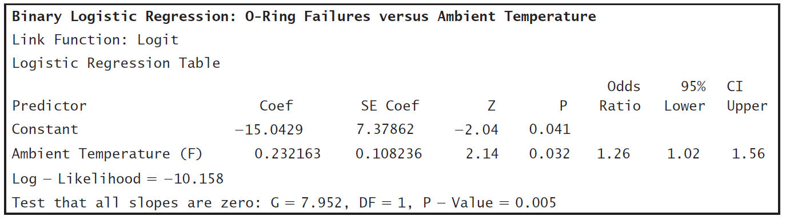
```

### The Likelihood Ratio Test {-}

The **likelihood ratio test (LRT)** is derived by calculating the difference between the adequacy of the full and restricted log-likelihood models. A **full model** (sometimes called an **unrestricted model**) includes all parameters under consideration in the model. In this example, there are only two parameters, $\beta_0$ and $\beta_1$, but the full model could include more parameters if more explanatory variables were in the model. The **restricted model** (also called a **reduced model**) is a model with fewer terms than the full model. In our example, only $\beta_0$ is in the restricted model (no explanatory variables are in this model). When no explanatory variables are in the restricted model, the restricted model is also called a **null model**. If the full model has a significantly better fit (the expected values are closer to the observed values) than the restricted model, we reject the null hypothesis $H_0: \beta_1 = 0$ and conclude that $H_a: \beta_1 \neq 0$.

The log-likelihood (restricted) function, described in the extended activities, is a measure of the fit of the model that includes only the intercept:

\begin{align}
\text{Restricted Model:} \quad \pi_i = \frac{e^{\beta_0}}{1 + e^{\beta_0}}
\notag
\end{align}

For the restricted model, the null hypothesis is true and $\pi_i$ is constant for any x-value. The log-likelihood (full) function measures the fit of the model that includes all of the parameters of interest:

\begin{align}
\text{Full Model:} \quad \pi_i = \frac{e^{\beta_0 + \beta_1 x_i}}{1 + e^{\beta_0 + \beta_1 x_i}}
\notag
\end{align}

When the null hypothesis $H_0: \beta_1 = 0$ is true, it can be shown that

\begin{align}
G = 2 \times \text{log-likelihood(full model)} - 2 \times \text{log-likelihood(restricted model)} \sim \chi^2_1 
\tag{6.15}
\end{align}

The G-statistic measures the difference between the fits of the restricted and full models. In essence, we are measuring how much better the fit is when an explanatory variable (temperature) is added to the logistic model. If the p-value corresponding to the G-statistic is small, the difference in fits is so large that it is unlikely to occur by chance, and thus we conclude that Ha: b1 0 (the fit of the full model is significantly better than that of the restricted model).

Degrees of freedom for the LRT equal the number of parameters in the full model minus the number of
parameters in the restricted model. In our case, this is 2 - 1 = 1. Different software packages will present this test in slightly different ways. In the Minitab output in Figure 6.5, the log-likelihood of the full model (-10.158) and the G-statistic (7.952) are provided.

Other statistics packages may not give the G-statistic, but they will give enough information so that
the LRT can be calculated. The R output shown in Figure 6.6 gives the null deviance [K - 2 * log-
likelihood (restricted model)] and the residual deviance [K - 2 * log-likelihood (full model)], where
K is a constant value.

Note that
\begin{align}
G &= 2 \times \text{log-likelihood(full model)} - 2 \times \text{log-likelihood(restricted model)} \notag \\
&= \text{null (restricted model) deviance} - \text{residual (full model) deviance} \notag \\
&= 7.952. \notag 
\end{align}

### Activity: The Likelihood Ratio Test {-}
14. Use statistical software to calculate the LRT for the space shuttle data. Submit the p-value and state your conclusions.

The G-statistic is relatively large, indicating that we have some evidence to reject $H_0: beta_1 = 0$ and conclude that temperature is related to the odds of a successful launch with no O-ring damage. When sample sizes are large and there is only one explanatory variable in the model, the p-values for the LRT and Wald’s test will be approximately the same. In the space shuttle example, the LRT and Wald’s test have somewhat different p-values.

The likelihood ratio test is more reliable and is often preferred over Wald’s test for small sample sizes. However, unlike the LRT, Wald’s test can have one-sided alternative hypothesis tests as well as nonzero hypothesized values. It is difficult to determine the actual sample size needed for Wald’s test or the LRT to perform well. Some statisticians suggest a minimum sample size of 100 observations.$^7$ Thus, it is best to label each p-value as approximate when using these tests with a small sample size.

\textbf{\textcolor{blue}{Key Concept:}}
\textcolor{blue}{With a large sample size, Wald’s test and the likelihood ratio test provide accurate tests for $H_0: \beta_1 = 0$ versus $H_a: \beta_1 \neq 0$. While the LRT test tends to be more reliable with smaller sample sizes, use caution when interpreting the results for data sets with small sample sizes (such as the space shuttle example).}

## What Can We Conclude from the Space Shuttle Study?

The space shuttle example is an observational study, since the launches were not “randomly assigned” to the temperature groups, so we cannot conclude solely from this data set that low temperatures caused O-ring damage. Wald’s test and the likelihood ratio test both provided some evidence that the odds of a successful launch are related to temperature. However, a sample size of 23 is not large enough for us to be confident that the p-values are reliable. The logistic regression model provides some indication that the probability of a successful launch is related to temperature. Other information, such as scientists understanding that cold temperatures cause O-rings to be more brittle, also strengthens the conclusion.

## Logistic Regression with Multiple Explanatory Variables

Wolberg and Mangasarian developed a technique to accurately diagnose breast masses using only visual characteristics of the cells within the tumor. A sample is placed on a slide, and characteristics of the cellular nuclei within the tumor, such as size, shape, and texture, are examined under a microscope to determine whether the cancer cells are benign or malignant. Benign tumors are scar tissue or abnormal growths that do not spread and are typically harmless. Malignant (or invasive) cancer cells are cells that can travel, typically through the bloodstream or lymph nodes, and begin to replace normal cells in other parts of the body. If a tumor is malignant, it is essential to remove or destroy all cancerous cells in order to keep them from spreading. If a tumor is benign, surgery is typically not needed and the harmless tumor can remain.

In Chapter 6, we used contingency tables with only two variables, cell shape and type, to better understand how to analyze two categorical variables. This section will describe the process of variable selection in logistic regression, using the radius and the concavity of cell nuclei to estimate the probability that a tumor is malignant. In this data set, radius is actually the average radius (in micrometers, $\mu$m) of all visible cell nuclei from a slide, but we will refer to this variable simply as the cell radius for the tumor. The concavity of the cell nuclei is an indicator of whether the visible cell nuclei from the sample have the nice round shape of typical healthy cells or whether cells appear to have grown in such a way that the perimeters of the cell nuclei tend to have concave points.

### Activity: Estimating the Probability of Malignancy in Cancer Cells {-}

Data set: `Cancer2`

15. Create a logistic regression model using Radius and Concave as explanatory variables to estimate the probability that a mass is malignant.  
   a. Using Radius as the first explanatory variable, $x_1$, and Concave as the second explanatory variable, $x_2$, submit the logistic regression model. In other words, find the coefficients for the model

\begin{align}
   y_i &= \frac{e^{\beta_0 + \beta_1 x_{1,i} + \beta_2 x_{2,i}}}{1 + e^{\beta_0 + \beta_1 x_{1,i} + \beta_2 x_{2,i}}} + \epsilon_i \quad \text{for } i = 1,2,\dots,n
\end{align}

   b. Submit the likelihood ratio test results, including the log-likelihood (or deviance) values.  
   c. Concave = 0 represents round cells and Concave = 1 represents concave cells. Calculate the event probability when Radius = 4 and the cells are concave. Also calculate the event probability when Radius = 4 and the cells are not concave.

16. Create a logistic regression model using only Radius as an explanatory variable to estimate the probability that a mass is malignant.  
   a. Submit the logistic regression model and the likelihood ratio test results, including the log-likelihood (or deviance) values.  
   b. Calculate the event probability when Radius = 4.

When there are multiple explanatory variables in a logistic regression model, such as in the model created in Question 15, the likelihood ratio test compares the full model to the null model, which excludes the radius and concavity terms. Thus, the null hypothesis is that the coefficient corresponding to each of the explanatory variables is zero. In Question 15, the LRT is testing

$$H_0: \beta_1 = \beta_2 = 0 \quad \text{vs.}\quad H_a: \text{at least one of the coefficients is not zero}$$

The G-statistic for this hypothesis test is 527.42 with 3 - 1 = 2 degrees of freedom (the number of parameters in the full model minus the number of parameters in the restricted model) and a corresponding p-value < 0.001. Thus, we can reject $H_0$ and conclude that at least one of the explanatory variables is significantly related to the probability that the cells are malignant.

The coefficients in multiple logistic regression models are discussed in terms of the odds of success. Any coefficient ($b_j$) indicates how the response will change corresponding to the $j$th explanatory variable, conditional on all other explanatory variables in the model. When the $j$th explanatory variable is increased by one unit, the odds of success will be multiplied by $e^{b_j}$. When an explanatory variable ($x_j$) is binary, as Concave is, $e^{b_j}$ represents the odds ratio between the two groups. However, just as in ordinary least squares regression with multiple explanatory variables, these coefficients are conditional on the other terms in the model.

## The Drop-in-Deviance Test

Figure 6.7 provides the expected probabilities for the model created in Question 15. The probability of a cell being malignant appears to depend on Radius. In addition, it appears that concavity is an important variable in the model, since concave cells tend to have a higher estimated probability of being malignant. In Chapter 3, variable selection is described as a process of determining which explanatory variables should be included in a regression model. Ideally, we would like the simplest model (i.e., the model with the fewest terms) that best explains the response (i.e., the model that has the smallest residuals). In this example, we want to determine if the model in Question 16 can estimate the probability of malignancy just as accurately as the slightly more complex model in Question 15. If the models have similar abilities to estimate the probability of malignancy, then we will prefer the simpler model.

The logic for determining whether additional terms should be in a logistic regression model is essentially the same as for the LRT discussed in connection with the space shuttle study. The log-likelihood (or deviance) can be used to measure how well any model fits the data. If a full model with two explanatory variables, $x_1$ and $x_2$, has a much better fit than a restricted model with just one explanatory variable, $x_1$, we can conclude that $x_2$ is significant and should be included in the model.

If the LRT shows no significant difference between the full and the restricted model, the coefficient of
the second variable, $x_2$, can be set to zero and we can conclude that including the additional variable in the
model does not improve our ability to estimate the probability of success (in this case, success represents a
malignant cell).

In the cancer study, we can compare the full log-likelihood (or deviance) from the two-term model in
Question 15 to the restricted log-likelihood (or deviance) from the one-term model in Question 16.

\begin{align}
G &= 2 \times \text{log-likelihood (full model)} - 2 * \text{log-likelihood (restricted model)} \notag \\
&= 2(-112.008) - 2(-165.005) \notag \\
&= \text{null (restricted model) deviance} - \text{residual (full model) deviance} \notag \\
&= 105.994 \tag{6.16}
\end{align}

Just as in the LRT described in connection with the shuttle example, degrees of freedom are calculated as the number of parameters in the full model minus the number of parameters in the restricted model. Thus, we can test whether $Concave$ ($x_2$) should be included in the model by finding the $p$-value, which is the percentage of the $\chi^2$ distribution with 3 - 2 = 1 degree of freedom that exceeds $G$. The $p$-value corresponding to Equation (6.16) is less than 0.0001. We have strong evidence that the explanatory variable, $Concave$, is important in the model when $Radius$ is already included. Thus, the logistic regression model in Question 15 is preferred over the model in Question 16.

```{r fig66, echo=FALSE, fig.width=4, fig.height=2.68, message=FALSE, fig.cap=" A scatterplot of the observed data and estimated probabilities for both round cells (Concave= 0) and concave cells (Concave= 1)."}
library(tidyr)
# fut two logistic models
# df <- read.csv("Cancer2.csv", stringsAsFactors = FALSE)
data("C7Cancer2")
df<-C7Cancer2
mod_round  <- glm(Malignant ~ radius,
                  data   = df,
                  family = binomial,
                  subset = (concavity == 0))
mod_concav <- glm(Malignant ~ radius,
                  data   = df,
                  family = binomial,
                  subset = (concavity == 1))
grid <- data.frame(radius = seq(min(df$radius), max(df$radius), length.out = 200))
grid$`Round Cells`  <- predict(mod_round, newdata = grid, type = "response")
grid$`Concave Cells`<- predict(mod_concav, newdata = grid, type = "response")
pred <- pivot_longer(
  grid,
  cols      = c("Round Cells", "Concave Cells"),
  names_to  = "Type",
  values_to = "Probability"
)

# plot
ggplot() +
  # two logistic curves
  geom_line(
    data = pred,
    aes(x = radius, y = Probability, color = Type),
    size = 1
  ) +
  # observed Malignant (0/1) points
  geom_point(
    data  = df,
    aes(x = radius, y = Malignant, color = "Observations"),
    shape = 23, size = 3, fill = "black"
  ) +
  # legend
  scale_color_manual(
    "",
    breaks = c("Round Cells", "Concave Cells", "Observations"),
    values = c(
      "Round Cells"    = "lightblue",
      "Concave Cells"  = "#00BFC4",
      "Observations"   = "black"
    ),
    guide = guide_legend(
      override.aes = list(
        linetype = c(1, 1, 0),  # lines for the two curves, not for points
        shape = c(NA, NA, 23) # the diamond for observations
      )
    )
  ) +
  # axis labels
  labs(
    x = "Radius",
    y = "Estimated Probabilities"
  ) +
  # theme
  theme_minimal(base_family = "serif") +
  theme(
    panel.background  = element_rect(fill = "white",  colour = "black", linewidth = 1),
    panel.border = element_rect(fill = NA,       colour = "black", linewidth = 1),
    plot.background  = element_rect(fill = "grey90", colour = "black", linewidth = 1),
    legend.background = element_rect(fill = "white",  colour = "black"),
    legend.position = c(0.75, 0.25), 
    plot.margin = margin(t = 20, r = 20, b = 15, l = 15, unit = "pt")
  )
```

When the LRT is used for variable selection, it is often called the **change-in-deviance test** or **drop-in-deviance test**. This test is valid only when the restricted model is nested within the full model. A restricted model is **nested** in a full model when every explanatory variable in the restricted model is also in the full model.

\textbf{\textcolor{blue}{Key Concept:}}
\textcolor{blue}{To use the drop-in-deviance test to determine if $x_i$ should be included in a model:}

>\textcolor{blue}{1. Calculate the deviance (or $-2 \times$ log-likelihood) for the full (i.e., unrestricted) model with all variables of interest.}

>\textcolor{blue}{2. Calculate the deviance (or $-2 \times$ log-likelihood) for the reduced (i.e., restricted) model (e.g., the model including all the variables in step 1 except for $x_i$).}

>\textcolor{blue}{3. Calculate $G = 2 \times$ log-likelihood (full model) $-2 \times$ log-likelihood (restricted model) = deviance (restricted model) $-$ deviance (full model).}

>\textcolor{blue}{4. Calculate the degrees of freedom, the number of parameters in the full model minus the number of parameters in the restricted model.}

>\textcolor{blue}{5. Find the $p$-value, the percentage of the $\chi^2$ distribution that exceeds $G$.}

>\textcolor{blue}{6. If the $p$-value is small, reject $H_0: \beta_i = 0$ and conclude that $x_i$ should be included in the model. If the $p$-value is large, the explanatory variable, $x_i$, can be eliminated from the model.}


>**MATHEMATICAL NOTE**
The drop-in-deviance can also be used to simultaneously test multiple variables. For example, let’s assume that there were four Shape measurements (round, slightly concave, moderately concave, and severely concave). These four levels would be used to create three indicator variables. If we are interested in testing whether $Shape$ is important, we should test all three coefficients simultaneously. The steps in testing three coefficients simultaneously are identical to the steps listed above except that instead of just testing for $x_j$, we are simultaneously testing for $x_2$, $x_3$, and $x_4$. Then the null hypothesis would be $H0: \beta_2 = \beta_3 = \beta_4 = 0$, where each of these coefficients corresponds to one $Shape$ indicator variable in the full model.


Drop-in-deviance tests are often used in combination with stepwise regression techniques in order to
identify the best model for prediction. In the end-of-chapter exercises, backward elimination procedures
analogous to those used in multiple least squares regression will be used to find an appropriate model. The procedure starts with all explanatory variables of interest in the model. Variables that do not appear to besign ificant (or do not significantly reduce the size of the residuals) are removed in a stepwise process. The process is continued until all variables in the model are significant (or the model consists of only variables that are important in reducing the size of the residuals).

Just as in least squares regression, there is often no “best” multivariate logistic regression model. Different stepwise procedures, sampling variability, the desired balance between the accuracy and the simplicity of the model, and choice of terms tested all can influence the final model that is selected. While there should be careful justification for selecting a final model, caution should be used before stating that any selected model is “the best.”

>**CAUTION**
Recall that stepwise techniques are useful for developing models if the goal is to estimate or predict a
response. However, they are not appropriate if the goal of developing a regression model is theory test-
ing. Stepwise procedures involve multiple testing on the same variables. This leads to unreliable p-values when testing the coefficients of individual explanatory variables. Thus, it is inappropriate to use stepwise procedures to find a good model and then test each coefficient on your final model to determine if the individual explanatory variables are significant.


>**NOTE**
Some software packages have programs that will automatically suggest a model for logistic regression
(just as is done for stepwise procedures in least squares regression). While this chapter focuses only on the drop-in-deviance test, there are other techniques that can be used in variable selection.
\begin{align}
\textbf{Akaike’s Information Criterion (AIC)} &= -2 \times \text{log-likelihood} + 2 \times p \notag \\
\textbf{Bayesian Information Criterion (BIC)} &= -2 \times \text{log-likelihood} + p \times ln(n) \notag
\end{align}
where p is the number of estimated parameters (the number of explanatory variables plus 1) and n is the
sample size. Both the AIC and the BIC adjust for the number of parameters in the model and are more
likely to select models with fewer variables than the drop-in-deviance test. Both techniques suggest choosing a model with the smallest AIC or BIC value


## Measures of Association

When sample sizes are small, a model may have a strong association (a clear pattern is visible) but not have enough evidence to show that the independent variable is significant. Conversely, if there were thousands of observations in a data set, a hypothesis test might conclude that an independent variable was significant even though there was only a very weak association. Thus, researchers typically report both significance tests and a measure of association when discussing results. While there is no widely accepted equivalent to $R^2$ in logistic regression, this section will describe calculations that can be used to measure the strength of association.

To measure the strength of association in the space shuttle logistic regression model, pair each observed success with every observed failure. In the shuttle example, there are 16 successes and 7 failures; thus, there are $16 \times 7 = 112$ pairs. For each pair, use the logistic regression model to estimate the probability of success for both the observed success and the observed failure. If the observation corresponding to a success has a higher estimated probability, the pair is called a **concordant pair**. If the observation corresponding to a success has a lower estimated probability, the pair is called a **discordant pair**. **Tied pairs** occur when the observed success has the same estimated probability as the observed failure.

\begin{itemize}
  \item To find \textbf{Somers’ $D$}, take the number of concordant pairs minus the number of discordant pairs and then divide by the total number of pairs.
  \item To find \textbf{Goodman-Kruskal gamma} (also called Goodman and Kruskal’s gamma), take the number of concordant pairs minus the number of discordant pairs and then divide by the total number of pairs excluding ties.
  \item To find \textbf{Kendall’s tau-a}, take the number of concordant pairs minus the number of discordant pairs and then divide by the total number of pairs of observations including pairs with the same response value.
\end{itemize}

If all possible pairs were concordant, then Somers’ $D$ would equal 1. If the model had no predictive power, we would expect half the pairs to be concordant and half to be discordant. This would correspond to Somers’ $D = 0$. Thus, a value of 0 for Somers’ $D$ (as well as Goodman and Kruskal’s gamma) indicates no effect of the explanatory variable on the response variable.

### Activity: Measures of Association {-}

Data set: `Shuttle`

19. The first and eleventh launches form a pair, since at 63°F there was an O-ring failure and at 66°F there was a success (no O-ring failure). This is a concordant pair, since the probability of success is higher when there was an observed success. Estimate the probability of success for each temperature.

20. Calculate the expected probabilities of the first (66°F) and 22nd (75°F) observations. Is this a concordant or discordant pair?

21. Identify two launches in the space shuttle data that represent a tied pair.

22. Various statistical software packages tend to provide different measures of association. Use statistical software to calculate the Goodman-Kruskal gamma, Somers’ $D$, or Kendall’s tau-a for the space shuttle data.

Minitab output for the space shuttle data is provided in Figure 6.8. The output shows that 75.9% of the pairs were concordant, while 19.6% of the pairs were discordant. This provides some evidence of association between temperature and probability of a successful launch.

\begin{align}
\text{Somers’ D} &= (85 - 22)/112 = 0.56 \notag \\
\text{Goodman-Kruskal gamma} &= (85 - 22)/(112 - 5) = 0.59 \notag \\
\text{Kendall’s Tau-a} &= (85 - 22)/(253) = 0.25 \notag \\
\text{where } 253 &= 23 \times 22/2, \text{the total number of pairs} \notag
\end{align}

Somers’ D and the Goodman-Kruskal gamma are very close to each for other because there are very
few tied pairs. There are no $p$-values corresponding to these measures, but they are useful for compar-
ing different models with different explanatory variables or comparing models based on different link
functions.

```{r fig67, echo=FALSE, out.width="110%", fig.align="center", fig.cap="Minitab output showing measures of association for the space shuttle data."}
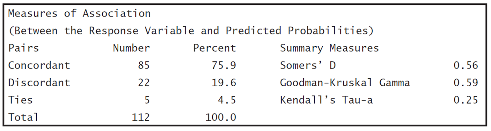
```


## Review of Means and Variances of Binary and Binomial Data

If you have worked with discrete probability models, you will recognize that binary data follow a Bernoulli distribution if the following conditions are true:

- Each observation, $y_i$, is independent.
- Each $y_i$ falls into exactly one of two categories represented by either a zero or a one.
- The probability of success, $P(Y_i = 1) = \pi_i$, is constant for each observation.

The Bernoulli distribution can be displayed as in Table 6.2. 
Table 6.2 is often represented with the following mathematical function to model the Bernoulli distribution:

\begin{align}
P(Y = k) &= \pi^k (1 - \pi)^{1-k} \quad \text{for } k = 0, 1 \tag{6.17}
\end{align}

The expected value (mean) of $y$ is the average outcome:

\begin{align}
E(Y) &= 0 \times P(Y = 0) + 1 \times P(Y = 1) = 0 \times (1 - \pi) + 1 \times \pi = \pi \tag{6.18}
\end{align}

Each outcome is not equally likely. Thus, each outcome is weighted by its probability. The variance of $y$ is the average value of the squared deviation of the observed value, $y$, and the expected value, $\pi$:

\begin{align}
\mathrm{Var}(Y) &= E[(Y - \pi)^2] = (0 - \pi)^2 \times P(Y = 0) + (1 - \pi)^2 \times P(Y = 1) = \pi (1 - \pi) \tag{6.19}
\end{align}

```{r tab62, echo=FALSE, results='asis'}
# Table 6.2: The Bernoulli model
tab <- data.frame(
  "Value of y" = "Probability",
  "0" = "$1 - \\pi$",
  "1" = "$\\pi$",
  check.names  = FALSE,
  stringsAsFactors = FALSE
)

cat(
  kable(
    tab,
    format  = "latex",
    booktabs = TRUE,
    escape = FALSE,
    caption = "Table 6.2 The Bernoulli model.",
    align = c("l", "c", "c")
  ) %>%
  kable_styling(latex_options = "hold_position")
)

```

In the above equations, $\pi$ is the same for every observational unit and the results for each observational unit are independent of each other. However, in regression we focus on the expected value of $y$ given $x$, $E(Y \mid x_i)$. This represents the expectation that the probability of success depends on an explanatory variable. In the space shuttle example, the expected probability of a successful launch will change depending on the temperature. For any given temperature value, $x_i$, the probability of success is constant, $\pi_i$, and the observations are independent. Thus, for a particular $x_i$, the corresponding mean and variance are

\begin{align}
E(Y \mid x_i) &= \pi_i \quad \text{and} \quad \mathrm{Var}(Y \mid x_i) = \pi_i (1 - \pi_i) 
\tag{6.20}
\end{align}

Thus, in logistic regression with Bernoulli response variables, the variance of $Y$ will depend on $x$. This violates
the key assumption of constant variance in least squares regression models.

Logistic regression is also appropriate when the response is a count of the number of successes. A count follows a binomial distribution if the following conditions are true:

- There are $n_i$ independent observations at a given level of $x$ ($x_i$).
- $\pi_i = P(Y_i = 1 \mid x_i)$ is the probability of success, and this probability is constant for any given $x_i$ ($0 \le \pi_i \le 1$).
- Each response has only two possible outcomes. However, instead of recording a 0 or a 1 value for each outcome, we typically record $Y$ as the count of successes (or proportion of successes) at a particular $x_i$ value.

Many introductory textbooks show that if the data follow a binomial distribution, the probability that there are $k$ successes in $n_i$ independent observations is:

\begin{align}
P(Y = k \mid x_i) &= \binom{n_i}{k} \,\pi_i^k (1 - \pi_i)^{n_i - k} \quad \text{for } k = 0, 1, \dots, n_i \tag{6.21}
\end{align}

where $\displaystyle \binom{n_i}{k} = \frac{n_i!}{k!\,(n_i - k)!}$ is called the binomial coefficient and is read as “$n_i$ choose $k$.”

Using a technique similar to that for the Bernoulli distribution, it can be shown that the conditional mean (probability of success) and variance of binomial response variables are

\begin{align}
E(Y \mid x_i) &= n_i \times \pi_i \quad \text{and} \quad \mathrm{Var}(Y \mid x_i) = n_i \times \pi_i (1 - \pi_i) 
\tag{6.22}
\end{align}

### Activity: Understanding the Binomial Distribution{-}

23. Assume that for a particular temperature $x_i = 70^\circ\mathrm{F}$ the true probability of success is $\pi_i = 0.75$. If there are four launches made at $x_i = 70^\circ\mathrm{F}$, use Equation (6.21) to find the probability that all four launches are successful, $P(Y_i = 4 \mid x_i = 70)$. Also find the probability that one of the four launches is successful, $P(Y_i = 1 \mid x_i = 70)$.

24. When there are four observations ($n_i = 4$) and $\pi_i = 0.75$, use the basic formula for calculating means  
to find  
\begin{flalign*}
E(Y_i \mid x_i) &= \mu_{x_i} = \sum_{k=0}^{4} k \times P(Y_i = k \mid x_i).
\end{flalign*}

25. When $n_i = 4$ and $\pi_i = 0.75$, find $\mathrm{Var}(Y_i \mid x_i)$.

## Calculating Logistic Regression Models for Binomial Counts

In the previous examples, $y$ was considered a binary random variable (either 0 or 1). In this example, logistic regression will be used when the response is a count of the number of successes (i.e., the response is binomial). Table 6.3 shows the cancer cell data with the $Radius$ variable grouped into five levels. Clearly grouping is not necessary for logistic regression, but this grouping is done to demonstrate how to conduct logistic regression when the response is binomial.

```{r tab63, echo=FALSE, results='asis'}
# Table 6.3: Cancer cell data by radius group
df6.3 <- data.frame(
  i = c("1","2","3","4","5",""),
  `Median radius $(x_i)$` = c("2.5","3.5","4","4.5","6.5","Total"),
  `Benign $(n_i - y_i)$` = c("113","140","85","17","2","357"),
  `Malignant $(y_i)$`  = c("2","12","34","43","121","212"),
  `Total $(n_i)$` = c("115","152","119","60","123","569"),
  `Proportion Malignant` = c("0.017","0.079","0.286","0.717","0.984",""),
  check.names = FALSE,
  stringsAsFactors = FALSE
)

cat(
  kable(
    df6.3,
    format = "latex",
    booktabs = TRUE,
    escape = FALSE,
    caption = "Cancer cell data classified into groups based on the size of the radius.",
    align = c("r","r","r","r","r","r"),
    row.names = FALSE
  ) %>%
  kable_styling(latex_options="hold_position")
)
```

### Activity: Binomial Logistic Regression {-}

Data set: `Table 6.3`

26. Create a logistic regression model based on Equation (6.8) to predict the probability of a malignant cell from the grouped radius data in Table 6.3.  
a. What are the maximum likelihood estimates $b_0$ and $b_1$?  
b. Substitute $b_0$ and $b_1$ into Equation (6.9) to estimate the probability of malignancy when the radius is 4.5.  
c. Use Wald’s test and the $G$-statistic to determine if this model provides evidence that the probability of malignancy is related to cell radius.

Figure 6.9 plots the observed percentages of malignant cells and the corresponding logistic regression model. Notice that the observed and expected probabilities are fairly close. However, the observed percentage of malignant cells was higher than expected when the cell radius was 4.5.

```{r fig68, echo=FALSE, fig.width=4, fig.height=2.68, message=FALSE, fig.cap="A logistic regression model, with $\\hat \\pi_i$ estimated from Equation (6.8) using maximum likelihood estimates, plotted with the observed probability of malignancy for the grouped data in Table 6.3."}
# fit model
#df <- read.csv("CancercellsTable.csv", stringsAsFactors = FALSE)
data("C7CancercellsTable")
df<-C7CancercellsTable
names(df) <- make.names(names(df))
#names(df)[names(df) == "Median Radius"] <- "Median.Radius"
#names(df)[names(df) == "Porportion Malignant"] <- "Proportion.Malignant"
mod <- glm(cbind(Malignant, Benign) ~ Median.Radius,
           data = df,
           family = binomial)
radius_grid <- seq(min(df$Median.Radius), max(df$Median.Radius), length = 200)
pred_df <- data.frame(Median.Radius = radius_grid)
pred_df$predicted <- predict(mod, newdata = pred_df, type = "response")

# plot
ggplot() +
  # logistic curve
  geom_line(
    data = pred_df,
    aes(x = Median.Radius, y = predicted),
    color = "#00BFC4",
    linetype = "dashed",
    size = 1
  ) +
  # observed group proportions
  geom_point(
    data = df,
    aes(x = Median.Radius, y = Proportion.Malignant),
    size = 3
  ) +
  # labels
  labs(
    title = "Observed Cancer Cell Probabilities\nwith a Logistic Regression Model",
    x = "Radius",
    y = "Probability of Malignancy"
  ) +
  scale_y_continuous(limits = c(0, 1), expand = c(0, 0)) +
  scale_x_continuous(expand = c(0, 0)) +
  # theme
  theme_minimal(base_family = "serif") +
  theme(
    plot.title       = element_text(size = 16, face = "bold", hjust = 0.5, lineheight = 1.1),
    panel.background = element_rect(fill = "white", colour = "black", linewidth = 1),
    panel.border     = element_rect(fill = NA,  colour = "black", linewidth = 1),
    plot.background  = element_rect(fill = "grey90",  colour = "black", linewidth = 1),
    axis.title       = element_text(face = "bold"),
    legend.position  = "none"
  )
```

## Calculating Residuals for Logistic Models with Binomial Counts

When the response variable follows a binomial distribution as in Table 6.3, Pearson residuals and deviance residuals are often calculated. These residuals are calculated to evaluate how well a model fits the data. 

Using our estimate $\hat\pi_i = \frac{e^{b_0 + b_1 x_i}}{1 + e^{b_0 + b_1 x_i}}$ for $\pi_i$, we find the Pearson residual by taking the number of observed successes ($y_i$) minus the estimated number of expected successes ($n_i \times \hat\pi_i$) and then dividing by the estimated standard deviation:

\begin{align}
\text{Pearson residual for the $i$th radius value}
= \frac{y_i - n_i \,\hat\pi_i}{\sqrt{n_i \,\hat\pi_i\,(1 - \hat\pi_i)}}
\tag{6.23}
\end{align}

Since the variance is not constant, each residual is weighted by its own estimated standard deviation.

>**NOTE** We can calculate the Pearson residual using count data because we know that for any individual radius, $x_i$, the response variable, $y_i$, follows a binomial distribution with an estimated mean $n_i \times \hat\pi_i$ and variance $n_i \times \hat\pi_i \times (1 - \hat\pi_i)$.  


### Activity: Evaluating Residuals in Binomial Logistic Regression {-}

Data set: `Table 6.3`

27. Create a logistic regression model to predict the probability of a malignant cell from the grouped radius data in Table 6.3.

 a. Use software to calculate the Pearson residuals.  
 b. Create a histogram and/or a normal probability plot of these residuals. Are the residuals normally distributed?  
 c. Create a scatterplot of the Pearson residuals versus radius. How accurate are the estimates when radius is 2.5 and when radius is 4.5?

28. For each observation, the deviance residual measures the change in deviance from the full to the null model. Each deviance residual is the square root of the deviance goodness–of–fit statistic for each cell (or distinct radius value). The deviance residual is
\begin{align}
D_i \,\pm\, \sqrt{2 \Bigl[
y_i \ln\bigl(\tfrac{y_i}{n_i\,\hat\pi_i}\bigr)
\;+\;(n_i - y_i)\ln\bigl(\tfrac{n_i - y_i}{n_i - n_i\,\hat\pi_i}\bigr)
\Bigr]}
\tag{6.24}
\end{align}
where the sign is positive if the observed $y_i$ is higher than the estimated mean and negative if the observed $y_i$ is less than the estimated mean. Repeat Question 27 but use the deviance residual instead of the Pearson residual.

## Assessing the Fit of a Logistic Regression Model with Binomial Counts

A goodness‐of‐fit test measures how well a model fits the observed data. We will discuss three goodness‐of‐fit tests for logistic regression based on the chi‐square distribution. As discussed in Chapter 6, a chi‐square goodness‐of‐fit test is an asymptotic test that measures the accumulated distance between observed values and expected values (i.e., values predicted by our model). In each of the three tests, the null and alternative hypotheses are

\begin{align}
H_0:\;&\text{the logistic regression model provides an adequate fit to the data} \notag \\
H_a:\;&\text{the model does not adequately fit the data} \notag
\end{align}

If the predicted values in the model are relatively close to the observed data values (i.e., the model is a good fit for the data), then the test statistic will be small and the $p$-value will be large. If the test statistic is large, it suggests “lack of fit”; $H_0$ should be rejected and other models should be tried to better fit the data.

\textbf{\textcolor{blue}{Key Concept:}}
\textcolor{blue}{Goodness‐of‐fit tests assess the overall fit of a logistic regression model. If $H_0$ is rejected, the model is not a good fit. Failing to reject $H_0$ does not guarantee that the model is a “best fit” or even a good fit, but rather that we simply don’t have enough evidence to prove that it’s a poor fit.}

Test 1: The **Pearson chi‐square goodness‐of‐fit test** is the traditional chi‐square goodness‐of‐fit test seen in many introductory statistics courses. Degrees of freedom are calculated as the number of groups (classes) minus the number of parameters being estimated. In our case, groups are classified by median radius; we have five groups and are estimating two parameters ($\beta_0$ and $\beta_1$), so there are $5 - 2 = 3$ degrees of freedom.

Test 2: The **deviance goodness‐of‐fit test** (also called the likelihood ratio chi‐square test) is based on the sum of squared deviance residuals. The test statistic follows a chi‐square probability distribution where the degrees of freedom are calculated as the number of groups minus the number of parameters being estimated. The Pearson test statistic and the deviance test statistic tend to be similar. For determining a model, the deviance goodness‐of‐fit test is preferred over the Pearson test.$^9$

>**NOTE**  
The sum of squared Pearson residuals is equal to the Pearson chi‐square test statistic. When there is one explanatory variable, the likelihood ratio test is equivalent to the deviance goodness‐of‐fit test. The residual deviance and the degrees of freedom given in R are identical to those given in the deviance goodness‐of‐fit test statistic in Minitab.  


Test 3: Hosmer and Lemeshow developed a test similar to the Pearson chi‐square goodness‐of‐fit test. The key distinction is that the groups are formed differently. While the Pearson test uses the *explanatory variable* to form groups, the **Hosmer‐Lemeshow test** uses the *predicted values* to sort the data and form groups (the default is 10 groups). In Table 6.3, we predetermined the five groups, so the Pearson and Hosmer‐Lemeshow tests are identical in this example. However, when the explanatory variable is continuous (not grouped), the Hosmer‐Lemeshow test is more reliable than the Pearson chi‐square goodness‐of‐fit test.

### Activity: Calculating Residuals by Hand {-}

Data set: `Cancercells`

29. Calculate the Pearson chi‐square goodness‐of‐fit test by hand for the Cancercells data.  
   a. Complete Table 6.4 by using the logistic regression model from Question 26 to calculate the expected (predicted) cell counts.  
```{r tab64, echo=FALSE, results='asis'}
# Table 6.4: Observed vs. expected under logistic regression
df6.4 <- data.frame(
  i                   = c("1","2","3","4","5",""),
  `Median radius`     = c("2.5","3.5","4","4.5","6.5","Total"),
  `Benign`   = c("113","140","85","17","2","357"),
  `Malignant`= c("2","12","34","43","121","212"),
  `Total`    = c("115","152","119","60","123","569"),
  `Benign`   = c(
    "115($1-\\hat\\pi_1$) = 113.967",
    "","", "","", "357"
  ),
  `Malignant`= c(
    "115($\\hat\\pi_1$) = 115(0.00898) = 1.033",
    "$152\\hat\\pi_2 = 16.13$", "", "", "", "212"
  ),
  `Total`    = c("115","152","119","60","123","569"),
  check.names     = FALSE,
  stringsAsFactors= FALSE
)

cat(
  kable(
    df6.4,
    format    = "latex",
    booktabs  = TRUE,
    escape    = FALSE,
    caption   = paste0(
      "Observed and expected values using the logistic regression model ",
      "for the Cancercells data, where $\\hat\\pi_i$ is estimated from the ",
      "logistic regression model $\\hat\\pi_i = e^{b_0 + b_1 x_i}/(1 + e^{b_0 + b_1 x_i})$."
    ),
    align        = c(rep("c",8)),
    row.names    = FALSE
  ) %>%
  add_header_above(c(" "=2, "Observed"=3, "Expected"=3)) %>%
  kable_styling(latex_options="hold_position") %>%
  column_spec(2, width = "2cm") %>%
  column_spec(6, width = "2.5cm") %>%
  column_spec(7, width = "2.5cm")  
)
```
   b. Calculate the Pearson chi‐square test statistic:  
 \begin{align}
 \chi^2 &= \sum \frac{(\text{observed count} - \text{expected count})^2}{\text{expected count}}
 \tag{6.25}
 \end{align}
   using the observed count and expected count from Table 6.4. Note that there are 10 observed and 10 expected cells.  
   c. Find the $p$-value by using software or looking up the statistic in a chi‐square probability distribution table.  
   d. Interpret the results and clearly state how your conclusions are impacted by random sampling and random allocation to treatments in the original study design. Remember that a small $p$-value provides evidence that the model is *not* a good fit.

30. Calculate the deviance chi‐square goodness‐of‐fit test by hand for the Cancercells data given in Table 6.3. Expected counts, degrees of freedom, and $p$-values are found the same way as in the Pearson test. The only difference is in the calculation of the test statistic:  
   \begin{align}
   \text{Deviance chi-square test statistic} = D^2 = 2 \times \sum \biggl[\text{observed count} \times \ln\bigl(\frac{\text{observed count}}{\text{expected count}}\bigr)\biggr]
   \tag{6.26}
   \end{align}
   Describe differences (if any) between your conclusions here and those from the Pearson test in Question 29.

Figure 6.10 shows the Minitab output for the logistic regression model fit and the three goodness-of-fit tests.
Note that all three goodness-of-fit tests show small p-values, indicating that we can reject $H_0$ and con-
clude that the model is *not a good fit*. In addition, the cell counts shown in Question 29 reveal that the sample
size is large enough for us to believe the tests are reliable. Thus, other models should be tried. The logistic
regression model shown in Figure 6.10 looks reasonable, but there are many possible explanations as to why
the data are not considered a good fit:

* The groups based on median radius may not be appropriate. For example, radii of 1.51 and 2.49 were
considered part of the same group. We could create more groups with smaller class sizes. Clearly we lose
information whenever data are grouped into categories, so using the original data is likely the best option.

* Additional explanatory variables may need to be included in the model. Just as in ordinary regres-
sion, it may be appropriate to include interaction terms or transformations (such as the square, cube,
or log) of the explanatory variable(s).

* The binomial model may not appropriately model the response variable or a transformation other
than the logit transformation may need to be tried. *Notice that the logit model assumes symmetry; the curves in the S are the same shape and symmetric around the midpoint of the data.*   

```{r fig69, echo=FALSE, out.width="100%", fig.align="center", fig.cap="Software output for the Cancercells study"}
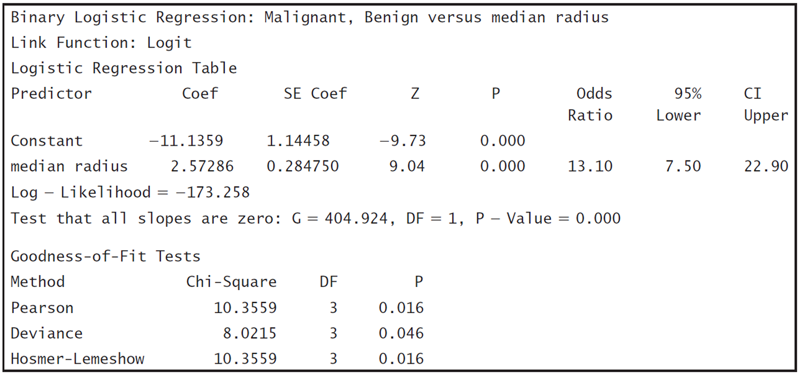
```

* A few outliers may be significantly influencing the results. For example, when the median radius is
4.5, the observed probability is not very close to the expected value. This point greatly contributes to
the large chi-square statistics in Questions 29 and 30.

Since chi-square tests are based on asymptotic theory, the p-values are not reliable unless there is a large enough sample size. A general rule for analyzing a 2 $\times$ 2 table of counts is that the expected count for each cell must be at least 5. For larger tables, the expected counts for all cells must be at least 1, and the average of expected cell counts should be greater than 5.

When the data are sparse (the observed, and therefore the expected, cell counts are too small), chi-square tests may tend to fail to reject the null hypothesis which states that the model is a good fit for the data.$^10$ In other words, these tests may not have good power for detecting particular types of lack of fit. The Hosmer-Lemeshow test is designed to correct for this problem (when there are continuous explanatory variables) by grouping the data. Hosmer and Lemeshow suggest that you have a sample size of at least 400 before using their test.$^11$

### Activity: Goodness‐of‐Fit Tests for Continuous Explanatory Variables {-}

Data set: `Cancer2`

31. Use computer software to create a logistic regression model to predict the probability of a malignant cell using the continuous variable $Radius$ as the explanatory variable. Conduct the three goodness‐of‐fit tests for this model.

The goodness-of-fit tests in Question 31 look very different from those calculated with the grouped data
in Figure 6.10. Remember that for goodness-of-fit tests, the degrees of freedom are calculated as the number of groups minus the number of parameters being estimated. There are two parameters estimated, and the stated 454 degrees of freedom for the Pearson and deviance tests indicate that 456 groups were formed (based on each distinct radius value given in the data). Since there are 569 observations in this data set, the Pearson and deviance goodness-of-fit tests do not meet the sample size requirements for a reliable test (most of the cells have only one observation).

In Question 31, the Pearson and deviance goodness-of-fit tests fail to reject $H_0$: the logistic regression model provides an adequate fit to the data. However, the violation of the sample size requirement makes these tests inappropriate to use.

The Hosmer-Lemeshow test in Question 31 has only 8 degrees of freedom, since the default is to form 10
groups based on the fitted values. To form the groups, statistical software sorts the estimated probabilities and then attempts to create 10 groups of equal size. The observed and expected values are given in the software output. Notice that there are still two cells with expected values less than 1. 

Recent studies have shown that the Hosmer-Lemshow test is somewhat sensitive to the way groups are formed, and other more specific tests have been developed.$^12$ However, since the p-value is much bigger than $\alpha = 0.05$, there does not appear to be strong evidence that the model is not a good fit.

Hosmer and Lemeshow state that slight violations of the sample size requirements are acceptable.$^13$ They suggest that if there is a sample size concern, you simply group a few columns. For example, in Question 31, grouping columns 1 and 2 and grouping columns 9 and 10 would satisfy the sample size requirements.

### Activity: Goodness‐of‐Fit Tests for Continuous Explanatory Variables {-}

Data set: `Cancer2`

32. Conduct the Hosmer‐Lemeshow goodness‐of‐fit test again, but this time adjust the group size (or number of groups) so that the sample size requirement is not violated. Did the $p$-value of this new Hosmer‐Lemeshow test change your conclusions?

\textbf{\textcolor{blue}{Key Concept:}}
\textcolor{blue}{The Pearson, deviance, and Hosmer‐Lemeshow tests assess model fit with chi‐square tests. When one or more explanatory variables are continuous (which is often the case), the deviance and Pearson chi‐square tests are not useful because there are not enough observations in each observed and expected cell (the number of distinct values of the explanatory variable is nearly equal to the number of observations). The Hosmer‐Lemeshow test can be used with continuous explanatory variables because it uses the predicted values to group the data. }

## Diagnostic Plots

Just as in least squares regression, residual plots are useful in understanding logistic models. Goodness‐of‐fit tests are useful, but, as stated earlier, they tend to fail to reject the null hypothesis even when the model is not appropriate. When these chi‐square tests fail to conclude that a model is inappropriate, residual plots can be used to verify that the model fit is appropriate. In addition, if the goodness‐of‐fit tests do reject the null hypothesis (conclude that the model is not appropriate), residual plots can help identify where the issues of model fit occur.

Large residual values are useful in identifying observations that are not explained well by the model. In addition to residuals, several scatterplots can be used to identify outliers and influential observations. Before creating these plots, we will need to define a few additional terms.

A **covariate pattern** is a set of all observations with identical explanatory variables. In the space shuttle example, there are four observations where the temperature is 70°F. These four observations form a covariate pattern. In the Cancer2 data set, a covariate pattern is a group of observations with both the same *Radius* value and the same *Concave* value.

**Delta chi-square** ($\Delta \chi^2$) is a measure of the change in the Pearson goodness-of-fit statistic (x2) when a
particular observation (or covariate pattern if there is more than one observation with the same explanatory
values) is eliminated. In other words, for a particular xi value, delta chi-square is $\Delta \chi^2_i = \chi^2 \;-\;\chi^2_{(i)}$, where $\chi^2_{(i)}$ is the Pearson goodness‐of‐fit statistic with the $i$th observation (or covariate pattern) eliminated. 

**Delta deviance** ($\Delta D^2$) is a measure of the change in the deviance goodness-of-fit statistic (D2) when a
particular observation (or covariate pattern) is eliminated. In other words, for a particular $x_i$ value, delta chi-
square is $\Delta D^2_i = D^2 \;-\; D^2_{(i)}$, where $D^2_{(i)}$ is the deviance goodness‐of‐fit statistic with the $i$th observation (or covariate pattern) eliminated.

**Delta beta** measures the difference in the regression coefficient when a particular observation (or covariate pattern) is removed.

Figure 6.11 shows the delta chi‐square, delta deviance, and delta beta values plotted against the expected probabilities ($\hat\pi_i$). The determination as to whether or not an observation (covariate pattern) is an outlier or overly influential is somewhat subjective. Outliers typically appear as extreme values in the upper corners of the scatterplot. As a rough estimate, $\Delta\chi^2$ or $\Delta D^2$ greater than 4 and delta beta values greater than 1 may be considered unusual observations. With large sample sizes, $\Delta\chi^2$ and $\Delta D^2$ approximately follow the chi‐square distribution, and the 95th percentile of the chi‐square distribution with 1 degree of freedom equals 3.84. Figure 6.11 has one covariate pattern that has a fairly large $\Delta\chi^2$ and $\Delta D^2$ values. It corresponds to the two launches that occurred at 75°F. Notice in Figure 6.11 that a failure at 75°F appears to be somewhat unusual. In this example, the $\Delta\chi^2$ and $\Delta D^2$ values are not extreme enough to be of major concern (all values are close to or less than 4).


```{r fig610, echo=FALSE, fig.width=6, fig.height=4, message=FALSE, fig.cap="Scatterplots of delta deviance, delta chi-square, and delta beta values versus the expected probabilities from the space shuttle data. Circled values represent launches at 75°F."}
library(patchwork)

# fit model
# df <- read.csv("Shuttle.csv", stringsAsFactors = FALSE)
data("C7Shuttle")
df<-C7Shuttle
mod_full <- glm(Success ~ Temperature, data = df, family = binomial)

# compute values
dev_full <- mod_full$deviance
chisq_full <- sum(residuals(mod_full, type = "pearson")^2)
beta_full  <- coef(mod_full)["Temperature"]
temps <- sort(unique(df$Temperature))
diag_list <- lapply(temps, function(t) {
  df2  <- subset(df, Temperature != t)
  m2 <- glm(Success ~ Temperature, data = df2, family = binomial)
  dev2 <- m2$deviance
  ch2 <- sum(residuals(m2, type = "pearson")^2)
  b2 <- coef(m2)["Temperature"]
  pi_t <- predict(mod_full,
                  newdata = data.frame(Temperature = t),
                  type    = "response")
  data.frame(
    Temperature = t,
    prob  = pi_t,
    delta_dev   = abs(dev_full   - dev2),
    delta_chisq = abs(chisq_full - ch2),
    delta_beta  = abs(beta_full  - b2)
  )
})
diag_df <- do.call(rbind, diag_list)

# find max pt
highlight_devmax <- diag_df[which.max(diag_df$delta_dev),   , drop = FALSE]
highlight_chisqmax <- diag_df[which.max(diag_df$delta_chisq), , drop = FALSE]
highlight_betamax  <- diag_df[which.max(diag_df$delta_beta),  , drop = FALSE]

# theme
my_theme <- theme_minimal(base_family = "serif") +
  theme(
    panel.border = element_rect(fill = NA,       colour = "black", linewidth = 1),
    plot.margin = margin(10, 10, 10, 10)
  )

# plot 1: Delta Deviance vs Probability
p1 <- ggplot(diag_df, aes(x = prob, y = delta_dev)) +
  geom_point(size = 2) +
  geom_point(
    data = highlight_devmax,
    aes(x = prob, y = delta_dev),
    shape  = 21, fill = NA, color = "#00BFC4",
    size = 4, stroke = 1.2
  ) +
  labs(x = "Probability", y = "Delta Deviance") +
  my_theme

# plot 2: Delta Chi‑Square vs Probability
p2 <- ggplot(diag_df, aes(x = prob, y = delta_chisq)) +
  geom_point(size = 2) +
  geom_point(
    data = highlight_chisqmax,
    aes(x = prob, y = delta_chisq),
    shape = 21, fill = NA, color = "#00BFC4",
    size = 4, stroke = 1.2
  ) +
  labs(x = "Probability", y = "Delta Chi‑Square") +
  my_theme

# plot 3: Delta Beta vs Probability
p3 <- ggplot(diag_df, aes(x = prob, y = delta_beta)) +
  geom_point(size = 2) +
  geom_point(
    data = highlight_betamax,
    aes(x = prob, y = delta_beta),
    shape = 21, fill = NA, color = "#00BFC4",
    size = 4, stroke = 1.2
  ) +
  labs(x = "Probability", y = "Delta Beta") +
  my_theme

# combine to grid
(p1 | p2) /
(p3 | plot_spacer())
```

Figure 6.12 shows the delta chi‐square and delta beta values plotted against the **leverage** values. Leverages are values between 0 and 1 that depend only on the explanatory variables (not the response). Large leverage values indicate that the observation (covariate pattern) has extreme explanatory values and may have a large influence on the regression coefficients.

```{r fig612, echo=FALSE, fig.width=4, fig.height=2.4, message=FALSE, fig.cap=" Scatterplots of delta chi-square and delta beta values versus leverage from the space shuttle data. The extreme value along the y-axis represents the launches at 75°F. There do not appear to be any extreme leverage values."}
library(ggplot2)
library(patchwork)
# fit regression
#df <- read.csv("Shuttle.csv", stringsAsFactors = FALSE)
data("C7Shuttle")
df<-C7Shuttle
mod <- glm(Success ~ Temperature, data = df, family = binomial)
df$hat           <- hatvalues(mod)
df$delta_chisq   <- residuals(mod, type = "deviance")^2
df$delta_beta    <- abs(dfbeta(mod)[, "Temperature"])

# theme
my_theme <- theme_minimal(base_family = "serif") +
  theme(
    panel.border     = element_rect(fill = NA,       colour = "black", linewidth = 1),
    panel.background = element_blank(),
    plot.background  = element_blank(),
    panel.grid.major = element_line(color = "grey80"),
    panel.grid.minor = element_blank(),
    axis.title       = element_text(face = "bold"),
    plot.margin      = margin(10, 10, 10, 10)
  )

# plot 1: Delta Chi‑Square vs Leverage
p1 <- ggplot(df, aes(x = hat, y = delta_chisq)) +
  geom_point(size = 2) +
  labs(x = "Leverage", y = "Delta Chi‑Square") +
  my_theme

# plot 2: Delta Beta vs Leverage
p2 <- ggplot(df, aes(x = hat, y = delta_beta)) +
  geom_point(size = 2) +
  labs(x = "Leverage", y = "Delta Beta") +
  my_theme

# combine to grid
p1 | p2

```

\textbf{\textcolor{blue}{Key Concept:}}
\textcolor{blue}{The contribution of a single observation depends on both its residual and its leverage. The delta chi‐square and delta deviance values can be used to detect observations that have a strong influence on the goodness‐of‐fit statistics. A large delta beta value indicates a covariate pattern with large leverage and/or large residual values.}

### Activity: Identifying Outliers and Influential Observations {-}

Data set: `Cancer2`

33. Run a logistic regression model with both explanatory variables *Radius* and *Concave*.  
 a. Create histograms of the standardized Pearson residuals and deviance residuals.  
 b. Create scatterplots of delta deviance, delta chi‐square, and delta beta (standardized) versus the expected probabilities.  
 c. Create scatterplots of delta deviance, delta chi‐square, and delta beta (standardized) versus the leverage.  
 d. Identify any observations (covariate patterns) that appear to be outliers or influential observations.

## Maximum Likelihood Estimation in Logistic Regression  

Maximum likelihood estimation is a fairly complex topic. The goal of this section is simply to provide an example of how to calculate maximum likelihood estimates with binomial data. After completing this section, you should have a better understanding of how the LRT and the deviance test are calculated. However, as stated earlier, maximum likelihood estimates are very computationally intensive and are best left to computer algorithms.

>**MATHEMATICAL NOTE** When the assumptions about the residuals in the least squares regression model described in Section 6.2 are satisfied, the maximum likelihood estimates of $\beta_0$ and $\beta_1$ are identical to the least squares estimates.  


### Maximum Likelihood Estimator for Binary Data {-}

Consider a set of independent binary responses $y_1, y_2, \dots, y_n$. Since each observed response is independent and follows the Bernoulli distribution shown in Equation (6.17), the probability of a particular outcome can be found as  

\begin{align}
P(Y_1 = k_1,\,Y_2 = k_2,\,\dots,\,Y_n = k_n) 
&= P(Y_1 = k_1)\,P(Y_2 = k_2)\,\cdots\,P(Y_n = k_n) \notag \\
&= \pi^{k_1}(1 - \pi)^{1-k_1}\,\pi^{k_2}(1 - \pi)^{1-k_2}\,\cdots\,\pi^{k_n}(1 - \pi)^{1-k_n} \notag \\
&= \pi^{\sum_{i=1}^n k_i}\,(1 - \pi)^{\sum_{i=1}^n (1 - k_i)}
\tag{6.27}
\end{align}

where $k_1, k_2, \dots, k_n$ represent a particular observed series of 0 or 1 outcomes and $\pi$ is a probability, $0 \le \pi \le 1$. Once $k_1, k_2, \dots, k_n$ have been observed, they are fixed values. Maximum likelihood estimates are functions of sample data that are derived by finding the value of $\pi$ that maximizes the likelihood function. For a given observed data set $y_1, y_2, \dots, y_n$, when Equation (6.27) is a function of $\pi$, it is called the likelihood function and denoted $L(\pi)$.

>**NOTE:** Equation (6.27) is often called a joint probability function when considered as a function of the data. However, when the data are assumed to be fixed and Equation (6.27) is considered a function of $\pi$, it is called a likelihood function.  


The **maximum likelihood estimate** is the value of $\pi = P(Y = 1)$ that maximizes Equation (6.27). For simplicity, it is common to find the value of $\pi$ that maximizes the log of the likelihood function. Recall that the value of $\pi$ that maximizes the likelihood function, $L(\pi)$, will also maximize the log-likelihood function, $\ln L(\pi)$.

\begin{align}
\ln L(\pi)
&= \ln\!\bigl(\pi^{\sum_{i=1}^n k_i}\,(1 - \pi)^{\sum_{i=1}^n (1 - k_i)}\bigr) \notag \\
&= \sum_{i=1}^n k_i \ln(\pi)\;+\;\bigl(n - \sum_{i=1}^n k_i\bigr)\ln(1 - \pi)
\tag{6.28}
\end{align}

\textbf{\textcolor{blue}{Key Concept:}}
\textcolor{blue}{The principle of maximum likelihood estimation is to choose a value of $\pi$ such that the observed data set is most likely to occur (i.e., the likelihood function is maximized). }

To find the maximum value of $\ln L(\pi)$, we take the derivative of $\ln L(\pi)$ and set the first derivative equal to 0:

\begin{align}
\frac{d[\ln L(\pi)]}{d\pi}
&= \sum_{i=1}^n k_i \,\frac{1}{\pi} \;+\;\bigl(n - \sum_{i=1}^n k_i\bigr)\,\frac{-1}{(1 - \pi)} = 0
\tag{6.29}
\end{align}

*?Calculus required

Then we solve the following equivalent equation in terms of $\pi$:

\begin{align}
(1 - \pi)\sum_{i=1}^n k_i \;-\;\pi\bigl(n - \sum_{i=1}^n k_i\bigr) = 0
\tag{6.30}
\end{align}

This provides the maximum likelihood estimator of $\pi = P(Y = 1)$:

\begin{align}
\displaystyle \hat{\pi} = \frac{\sum_{i=1}^n k_i}{n}
\tag{6.31}
\end{align}

In this example, the maximum likelihood estimator is the same as our well-known frequentist approach to estimating $\pi = P(Y = 1)$. However, this is not always the case.

>**MATHEMATICAL NOTE:**  
The second derivative of $\ln L(\pi)$ can also be calculated to show that the function is concave down. Thus, $\hat{\pi}$ is a local maximum and not a local minimum. Likelihood functions with just one parameter typically have only one critical value, which is the maximum value. When more than one parameter is involved, more care needs to be taken to ensure that the critical values are actually maximum likelihood estimates.  


### Activity: Calculating Maximum Likelihood Estimates {-}

34. For binomial response data that follow the binomial distribution, the log-likelihood function for one observation ($y_1$) is  
\begin{align}
\ln[P(Y_1 = k)]
&= \ln\!\bigl(\binom{n_1}{k}\,\pi_1^k\,(1 - \pi_1)^{n_1 - k}\bigr) \notag \\
&= C \;+\;k\ln(\pi_1)\;+\;(n_1 - k)\ln(1 - \pi_1)
\tag{6.32}
\end{align}
Where $C$ is a constant that does not influence $\pi_1$, we can drop $C$ from the above equation without any impact on the maximum likelihood estimate. Assume that you observed $y_1 = 5$ malignant cells out of a sample of $n_1 = 12$. Substituting these values into Equation (6.32) and dropping $C$ simplifies the log-likelihood function to $\ln[P(Y_1 = 5)] = 5\ln(\pi_1) + 7\ln(1 - \pi_1).$
a. Plot the log-likelihood function for several values of $\pi_1$ between 0 and 1. Use the plot to estimate the value of $\pi_1$ that will maximize the log-likelihood function.  
b. If you have had calculus, set the derivative of the log-likelihood function to 0 and solve for $\pi_1$. What is the maximum likelihood estimate for $\pi_1$?

### Maximum Likelihood Estimator for Logistic Regression Models {-}

The previous example did not address cases in logistic regression where the observations depend on one or more explanatory variables. To use maximum likelihood estimation in logistic regression, from Equation (6.6) we see that  

\[
\pi_i = \frac{e^{\beta_0 + \beta_1 x_i}}{1 + e^{\beta_0 + \beta_1 x_i}}.
\notag
\]  

Replacing this value for $\pi$ in Equation (6.28) gives  

\begin{align}
\ln L(\beta_0, \beta_1)
&= \sum_{i=1}^n k_i \ln\!\bigl(\tfrac{e^{\beta_0 + \beta_1 x_i}}{1 + e^{\beta_0 + \beta_1 x_i}}\bigr)
\;+\;\bigl(n - \sum_{i=1}^n k_i\bigr)\ln\!\Bigl[1 - \bigl(\tfrac{e^{\beta_0 + \beta_1 x_i}}{1 + e^{\beta_0 + \beta_1 x_i}}\bigr)\Bigr]
\tag{6.33}
\end{align}

To find the maximum likelihood estimates of $\beta_0$ and $\beta_1$, take the derivative of Equation (6.33) with respect to $\beta_0$ and respect to $\beta_1$. This will provide two equations and two unknowns. However, the two equations will not be linear and cannot be solved directly.

>**MATHEMATICAL NOTE:**Finding estimates for $\beta_0$ and $\beta_1$ that maximize the log-likelihood function is an iterative technique that quickly becomes complex even for small data sets and is not typically done by hand. Iterative techniques start with initial estimates of $\beta_0$ and $\beta_1$. An iterative technique such as the Newton–Raphson method repeatedly provides new estimates for $\beta_0$ or $\beta_1$ that increase the log-likelihood until the log-likelihood does not notably change.$^{15}$  


## Chapter Summary

Throughout this chapter, we have discussed how to conduct logistic regression for binary response data. When the observed response variable is binary, $y_i = 1$ typically represents a success (or outcome of interest) and $y_i = 0$ represents a failure. In the logistic regression model, the estimated response is typically defined as the log-odds of the probability of a success:
\begin{align}
\ln\left(\frac{\pi_i}{1-\pi_i}\right) = \beta_0 + \beta_1 x_i \quad \text{for} \quad i = 1, 2, \ldots, n
\notag
\end{align}

where $\pi_i = E[y_i | x_i] = P(y_i = 1)$. Solving the above equation for $\pi_i$ shows that the \textbf{probability of success} can be calculated with the following equation:
\begin{align}
\hat{\pi}_i = \frac{e^{b_0 + b_1 x_i}}{1 + e^{b_0 + b_1 x_i}}
\notag
\end{align}

where $b_0$ and $b_1$ are **maximum likelihood estimates** of the regression coefficients. While the logit transformation can create a nice S-shaped curve, the model assumptions for least squares regression are violated. \textit{Thus, hypothesis tests and confidence intervals should not be calculated using least squares regression.} For hypothesis testing, both logistic and least squares regression assume a linear predictor and independent observations. In addition, outliers and highly correlated explanatory variables can influence hypothesis test results in both logistic and least squares regression. However, logistic regression does not assume that the error terms are normally distributed or have equal variances. Logistic regression hypothesis tests are based on asymptotic tests and require large sample sizes.

**Wald’s test** and the **likelihood ratio test** can be used to test the significance of individual explanatory variables. If Wald’s test and the likelihood ratio test provide different results, the results of the likelihood ratio test should be used. However, the likelihood ratio test can only test whether the slope is equal to zero ($H_0: \beta_1 = 0$ versus $H_a: \beta_1 \neq 0$) while Wald’s test allows us to test for any value of the slope and also allows for one-sided hypothesis tests and confidence intervals.

Goodness-of-fit tests, such as the **Pearson chi-square test**, the **deviance test**, and the **Hosmer-Lemeshow test**, can be used to assess how well the model fits the data. Only the Hosmer-Lemeshow test should be used when an explanatory variable is continuous. Even though there is no widely accepted equivalent to $R^2$ in logistic regression, **Somers’ $D$**, **Goodman-Kruskal gamma**, and **Kendall’s tau-a** are used to measure the strength of association by means of a classification table showing correct and incorrect classifications of the response variable.

The slope in logistic regression is typically described using the **odds ratio**, $e^{b_1}$. If we increase the explanatory variable by one unit, the predicted odds will be multiplied by $e^{b_1}$. If the explanatory variable is also categorical, $e^{b_1}$ is interpreted as the odds ratio between the two groups.

**Variable selection** is a process of determining which explanatory variables should be included in a regression model. We prefer to select the model with the fewest number of terms that still best explains the response. The **drop-in-deviance** test compares the log-likelihood (or deviance) of a full model (a model with several terms) and a restricted model (a model with a smaller subset of the terms from the full model). If the test shows no significant difference between the full and the restricted model, we conclude that the additional terms in the full model can be eliminated. The drop-in-deviance test can be used sequentially until all terms that do not improve the model have been removed from the model.


## Exercises
\begin{enumerate}
  \setcounter{enumi}{34}

  \item \textbf{Bird Nest Study}

Data set: \texttt{Birdnest}

The file \texttt{Birdnest} contains data for 99 species of North American passerine birds. Passerine are “perching birds” and include many families of familiar small birds (e.g., sparrows and warblers), as well as some larger species like crows and ravens, but do not include hawks, owls, water fowl, wading birds, and woodpeckers. One hypothesis of interest was about the relationship of body size to type of nest. Body size was measured as average length of the species. Although nests come in a variety of types (see the \texttt{Nesttype} variable), in this data set nest type was categorized into either closed or open. “Closed” refers to nests with only a small opening to the outside, such as the tree cavity nest of many woodpeckers or the pendant-style nest of an oriole. “Open” nests include the cup-shaped nest of the American robin. (Note: closed? = 1 for closed nests; closed? = 0 for open nests.)

  \begin{enumerate}
    \item Create a logistic regression model using bird length (\texttt{Length}) to estimate the probability that a bird species has a closed nest type. Interpret the model in terms of the odds ratio.
    \item Use the Wald statistic to create a 95\% confidence interval for the odds ratio.
    \item Test $H_0$: $\beta_1 = 0$ versus $H_a$: $\beta_1 \ne 0$ using both Wald’s test and the likelihood ratio test. State your conclusion based on these tests.
    \item Conduct the Hosmer-Lemeshow test to assess how well the model fits the data.
    \item Explain why the Pearson chi-square test is not reliable for this example.
    \item Report and interpret Somers’ $D$, Goodman-Kruskal gamma, or Kendall’s tau-a for this logistic regression model.
  \end{enumerate}

  \item \textbf{Survival of the Donner Party: Logistic Regression and Chi-Square Tests}

Data set: \texttt{Donner}

In 1846, a group of 87 people (called the Donner Party) were heading west from Springfield, Illinois, for California.$^{16}$ The leaders attempted a new route through the Sierra Nevada and were stranded there throughout the winter. The harsh weather conditions and lack of food resulted in the death of many people within the group. Social scientists have used the data to study the theory that females are better able than men to survive harsh conditions.

  \begin{enumerate}
    \item Create a logistic regression model using \texttt{Gender} to estimate the probability of \texttt{Survival}.
    \item Interpret the model in terms of the odds ratio. Use the Wald statistic to create a 95\% confidence interval for the odds ratio.
    \item Calculate and interpret the likelihood ratio test.
    \item Test $H_0$: $\beta_1 = 0$ versus $H_a$: $\beta_1 \ne 0$ using both Wald’s test and the likelihood ratio test. State your conclusion based on these tests.
    \item Report and interpret Somers’ $D$, Goodman-Kruskal gamma, or Kendall’s tau-a for this logistic regression model.
    \item Create a two-way contingency table using \texttt{Gender} and \texttt{Survival} as row and column variables. Conduct a chi-square test for equal proportions (e.g., is the proportion of survival the same for males and females?). In addition, use this two-way table to create the odds ratio. How does the analysis of the two-way table compare to the logistic regression analysis?
    \item D. K. Grayson states, “The differential fate of the members of the Donner Party lends strong support to the argument that females are better able than males to withstand conditions marked by famine and extreme cold.” While there is some evidence that \texttt{Gender} is associated with \texttt{Survival}, explain why the data cannot be used to show that being female \textit{causes} a higher probability of survival.
  \end{enumerate}

  \item \textbf{Drug Treatment and Criminal Conviction: Logistic Regression and Two-Way Tables}

Data set: \texttt{Convict}

A study was conducted to determine if a relationship existed between criminal conviction and years of education.$^{17}$ Sixty people who had taken part in a drug rehabilitation program were classified by years of education. Each person was categorized as having a “short” education (15 years or less) or a “long” education (more than 15 years); also recorded was whether or not they had a post-treatment conviction.

  \begin{enumerate}
    \item Create a logistic regression model using years of education to estimate the probability of conviction. Interpret the model in terms of the odds ratio.
    \item Interpret the results of Wald’s test and the LRT.
    \item Conduct Fisher’s exact test and a chi-square test of independence (discussed in Chapter 6) using the \texttt{Convict} data. How do these tests compare to the logistic regression model?
    \item Report and interpret Somers’ $D$, Goodman-Kruskal gamma, or Kendall’s tau-a for this logistic regression model.
  \end{enumerate}

  \item \textbf{Severe Idiopathic Respiratory Distress}

Data set: \texttt{SIRDS}

A study was conducted to determine if a relationship existed between infant birthweight and the likelihood of that infant surviving severe idiopathic respiratory distress syndrome (SIRDS).$^{18}$ Data from 50 infants who displayed this syndrome are in the \texttt{SIRDS} file.

  \begin{enumerate}
    \item Create a logistic regression model using birthweight to estimate the probability of survival. Interpret the model in terms of the odds ratio.
    \item Use the Wald statistic to create a 90\% confidence interval for the odds ratio.
    \item Test $H_0$: $\beta_1 = 0$ versus $H_a$: $\beta_1 \ne 0$ using both Wald’s test and the likelihood ratio test. State your conclusion based on these tests.
    \item Conduct the Hosmer-Lemeshow test to assess how well the model fits the data. Ensure that you have appropriate sample sizes in each group.
    \item Explain why the Pearson and deviance goodness-of-fit tests are not appropriate.
    \item Report and interpret Somers’ $D$, Goodman-Kruskal gamma, or Kendall’s tau-a for this logistic regression model.
    \item Create histograms of the standardized Pearson residuals and deviance residuals.
    \item Create scatterplots of delta deviance, delta chi-square, and delta beta (standardized) versus the expected probabilities.
    \item Create scatterplots of delta deviance, delta chi-square, and delta beta (standardized) versus the leverage.
    \item Identify any observations (covariate patterns) that appear to be outliers or influential observations.
  \end{enumerate}

  \item \textbf{Tattoos: The Drop-in-Deviance Test}

Data set: \texttt{Tattoos}

Lunn and McNeil show a data set comparing two methods of surgical tattoo removal.$^{19}$ In addition to which method was used, the depth of the tattoo and the patient’s gender were recorded. In this data set, Removal = 1 represents a successful removal and Removal = 0 represents a poor removal.

  \begin{enumerate}
    \item Create a logistic regression model using \texttt{Method, Gender,} and \texttt{Depth} to estimate the probability that a tattoo was removed successfully. Based on Wald’s test, which variables appear to be significant? Based on the likelihood ratio test ($H_0$: $\beta_1 = \beta_2 = \beta_3 = 0$ versus $H_a$: at least one of the coefficients is not zero), can we conclude that at least one of these terms is significant?
    \item Create a logistic regression model using only \texttt{Gender} and \texttt{Depth} to estimate the probability that a tattoo was removed successfully. Based on Wald’s test, which variables appear to be significant? Based on the likelihood ratio test, can we conclude that at least one of these terms is significant?
    \item Use the drop-in-deviance test to compare the models in Parts (a) and (b). Can you conclude that \texttt{Method} is related to the probability of success?
    \item Construct a model using only \texttt{Method} to predict the probability of a successful removal. What do Wald’s test and likelihood ratio test reveal?
    \item Explain why the drop-in-deviance test in Part (c) is better than the approach in Part (d) for determining if \texttt{Method} is related to the probability of a successful tattoo removal.
  \end{enumerate}

  \item \textbf{Lung Cancer and Birdkeeping: The Drop-in-Deviance Test}

Data set: \texttt{Birdkeeping}

Hoskel, Kromhout, and Brand conducted a case-control study to determine if keeping birds increased the chances of getting lung cancer.$^{20}$ It is believed that people who keep birds may inhale more allergens and dust particles and thus may be more likely to get lung cancer. They collected data on 49 people with lung cancer and 98 people with similar demographics who did not have lung cancer.

\textit{Gender}: 1 represents females \\
\textit{Status}: 1 represents high economic status \\
\textit{Age}: owner’s age \\
\textit{Smoked}: number of years the person has been smoking \\
\textit{Cigarettes}: number of cigarettes smoked per day \\
\textit{Bird}: 1 represents owning a bird \\
\textit{LungCancer}: 1 represents having lung cancer

The first five variables (\texttt{Gender, Status, Age, Smoked, Cigarettes}) are known to impact the likelihood of having lung cancer and are assumed to be important in modeling the likelihood of having lung cancer. We are primarily interested in determining if the odds of lung cancer change based on whether an individual is a bird keeper.

  \begin{enumerate}
    \item Create a logistic regression model using all six explanatory variables to estimate the probability of having lung cancer. Based on Wald’s test, which variables appear to be significant? Based on the likelihood ratio test, can we conclude that at least one of these terms is significant?
    \item Create a logistic regression model using the first five variables (\texttt{Gender, Status, Age, Smoked, Cigarettes}) to estimate the probability of having lung cancer. 
    \item Use the drop-in-deviance test to compare the models in Parts (a) and (b). Can you conclude that birdkeeping is related to the probability of having lung cancer?
    \item Construct a model using only the variable \texttt{Bird} to estimate the probability of having lung cancer. What do Wald’s test and the likelihood ratio test reveal?
    \item Explain why the drop-in-deviance test in Part (c) is better than the approach in Part (d) for determining if birdkeeping is related to the probability of having lung cancer.
  \end{enumerate}

  \item \textbf{Surviving Third-Degree Burns}

Data set: \texttt{Burns}

Fan, Heckman, and Ward analyzed third-degree burn data from the University of Southern California General Hospital Burn Center.$^{21}$ In the \texttt{Burns} data set, 435 patients (adults ages 18–85) were grouped according to the size of the third-degree burns on their body. The explanatory variable is listed as the midpoint of set intervals: ln (area in square centimeters + 1). The response in this data set is whether or not the patient survived (1 represents a survival).

  \begin{enumerate}
    \item Create a logistic regression model using area to estimate the probability of survival.
    \item Calculate the observed and expected probabilities. Plot both of these probabilities against the median area.
    \item Interpret the model in terms of the odds ratio. Use the Wald statistic to create a 95\% confidence interval for the odds ratio.
    \item Test $H_0$: $\beta_1 = 0$ versus $H_a$: $\beta_1 \ne 0$ using both Wald’s test and the likelihood ratio test. State your conclusion based on these tests.
    \item Conduct the Pearson, deviance, and Hosmer-Lemeshow goodness-of-fit tests to assess how well the model fits the data. Interpret the results.
    \item Report and interpret Somers’ $D$, Goodman-Kruskal gamma, or Kendall’s tau-a for this logistic regression model.
    \item What conclusions can you draw from this study?
  \end{enumerate}

  \item \textbf{Multiple Explanatory Variables in the Bird Nest Study}

Data set: \texttt{Birdnest}

The \texttt{Birdnest} data discussed in Exercise 1 contain many characteristics of North American passerines (“perching birds”).

  \begin{enumerate}
    \item Create a logistic regression model using bird length (\texttt{Length}) and average number of eggs (\texttt{No.eggs}) to estimate the probability that a bird species has a closed nest type.
    \item Use the drop-in-deviance test to determine if the model with \texttt{Length} and \texttt{No.eggs} should be used instead of the model with only \texttt{Length} as an explanatory variable (as shown in Exercise 1).
    \item Use the drop-in-deviance test to create and interpret a best model to estimate the probability of the nest being closed (closed = 1). Start with a full model that includes body length in centimeters (\texttt{Length}), average number of eggs in a clutch (\texttt{No.eggs}), egg color (\texttt{Color}), incubation time of the eggs in days (\texttt{Incubation}), and number of days the chicks stay in the nest (\texttt{Nestling}).
  \end{enumerate}

  \item \textbf{Survival of the Donner Party: Multiple Explanatory Variables}

Data set: \texttt{Donner}

  \begin{enumerate}
    \item Create a logistic regression model using \texttt{Gender} and \texttt{Age} to estimate the probability of survival. Create a plot of the estimated probability of survival using \texttt{Age} as the explanatory variable and grouping the data by \texttt{Gender}. Use the plot and the model to interpret the coefficients in terms of the odds ratios.
    \item Create and interpret a logistic regression model using \texttt{Gender, Age,} and \texttt{Gender*Age} to estimate the probability of survival. Create a plot of the estimated probability of survival using \texttt{Age} as the explanatory variable and grouping the data by \texttt{Gender}.
    \item Explain any key differences between the plots created in Parts (a) and (b). Discuss how adding the interaction term \texttt{Gender*Age} impacts the model.
    \item Assuming that the model in Part (b) is your final model, use the Hosmer-Lemeshow test to assess the model goodness-of-fit.
  \end{enumerate}

  \item \textbf{Variable Selection Techniques and Multicollinearity}

Data set: \texttt{Cancer2}

  \begin{enumerate}
    \item Create a logistic regression model using \texttt{Radius, Concave, Radius*Radius,} and \texttt{Radius*Concave} as explanatory variables to estimate the probability that a mass is malignant. Submit the logistic regression model and the likelihood ratio test results, including the log-likelihood (or deviance) values.
    \item Even though Part (a) Wald’s test shows the highest $p$-value for \texttt{Radius}, it is typically best to attempt to keep the simplest terms in the model. Generally, keeping simpler terms in the model makes the model easier to interpret.\footnote{When several variables can potentially be in a model, many texts suggest conducting backward elimination on only the primary variables of interest. After backward elimination on these terms is complete, include appropriate interaction terms and terms for curvature and again conduct backward elimination on these more complex terms.} Thus, we suggest as a first attempt keeping \texttt{Radius} in the model and eliminating the variable with the next highest $p$-value. Create a logistic regression model using \texttt{Radius, Concave,} and \texttt{Radius*Concave} as explanatory variables to estimate the probability that a mass is malignant. Submit the logistic regression model and the likelihood ratio test results, including the log-likelihood (or deviance) values. Conduct the drop-in-deviance test to determine if \texttt{Radius*Radius} should be included in the model.
    \item Use a scatterplot to compare \texttt{Radius} to \texttt{Radius*Radius} and calculate the correlation between these two terms. Are these variables highly correlated?
    \item Chapter 3 discusses \textbf{multicollinearity} (highly correlated explanatory variables). Explain whether you believe \texttt{Radius} is important in the logistic regression model. Why is the $p$-value for \texttt{Radius} so large in Part (a) but very small in Part (b)?
    \item Create a logistic regression model using only \texttt{Radius} and \texttt{Concave} as explanatory variables to estimate the probability that a mass is malignant. Submit the logistic regression model and the likelihood ratio test results, including the log-likelihood (or deviance) values. Conduct the drop-in-deviance test to determine if \texttt{Radius*Concave} should be included in the model.
    \item Create a logistic regression model using only \texttt{Concave} as an explanatory variable to estimate the probability that a mass is malignant. Submit the logistic regression model and the likelihood ratio test results, including the log-likelihood (or deviance) values. Conduct the drop-in-deviance test to determine if \texttt{Radius} should be included in the model.
    \item Submit a final model and provide a justification for choosing that model.
  \end{enumerate}

  \item \textbf{\textit{(Challenge)} And the Winner Is...: Variable Selection Techniques}

Data set: \texttt{Oscars}

In 2009, three Grinnell students (Allie Greenberg, Hannah Lytle, and Phillip Brogdon) conducted an analysis to estimate the probability of winning the Academy Award for Best Picture. The Academy Awards, or “Oscars,” are given annually to honor high achievement in the film industry. The Academy consists of over 6000 members who nominate their colleagues and vote to decide on the winners of this prestigious award.

In their analysis, these students included all films nominated for Best Picture from 1979 to 2008. Winning Best Picture was considered the response (1 represents a win), and the explanatory variables included whether or not the picture won any of 17 other awards that were given out during that year’s ceremony.

  \begin{enumerate}
    \item Create a logistic regression model using all 17 explanatory variables. Which variables appear to be most significant?
    \item Create and compare multiple logistic regression models. Submit the model with the fewest number of terms that best estimates the probability of winning the Best Picture award.
    \item \textit{Academy Award for Best Picture in 2009 went to \textit{Hurt Locker}}. Use your final model in Part (b) to predict the likelihood that \textit{Hurt Locker} would win the Best Picture award. \textit{Avatar} and \textit{The Blind Side} were also nominated. Use your final model to estimate the probability that each of these movies would win Best Picture.
  \end{enumerate}

  \item \textbf{And the Winner Is... 2: Variable Selection Techniques}

Data set: \texttt{Oscars2}

While the previous information is interesting, there are some limitations in its use. The winners of the 17 other awards are known only a few minutes before the Best Picture award is announced. Instead of using other Academy Awards to predict the probability of Best Picture, it may be more useful to use other award ceremonies to predict the likelihood of winning Best Picture. Hannah, Allie, and Phillip also collected the following data:

Number of Golden Globe nominations \\
Number of Golden Globe wins \\
Number of Screen Actors Guild (SAG) nominations \\
Number of SAG wins

  \begin{enumerate}
    \item Create a logistic regression model using all four explanatory variables. Which variables appear to be most significant?
    \item Using only the \texttt{Oscars2} data set, submit the model with the fewest number of terms that best estimates the probability of winning the Best Picture award.
    \item Compare your model in Part (b) of Exercise 11 to the one from Part (b) above. Explain which model is better.
    \item Combine the \texttt{Oscars} and \texttt{Oscars2} data sets to include a total of 21 explanatory variables. Create the model with only a few variables that best estimates the probability of winning the Best Picture award. Is this new model better than the one created in Part (b) of Exercise 11?
  \end{enumerate}

\end{enumerate}


### Endnotes{-}

\begin{enumerate}

\item D. Leonhardt, “John Tukey, 85, Statistician, Coined the Word ‘Software’,” New York Times Archives on the Web, 7/28/2000, stat.bell-labs.com/who/tukey/nytimes.html. John Tukey (1915–2000) had a formal background in chemistry and mathematics. Conducting data analysis during World War II peaked his interest in statistics, and he became one of the most influential statisticians of the 20th century.
\item \textit{Report of the Presidential Commission on the Space Shuttle Challenger Accident, in Compliance with Executive Order 12546 of February 3, 1986}, http://science.ksc.nasa.gov/shuttle/missions/51-l/docs/rogers-commission/table-of-contents.html.
\item \textit{Report of the Presidential Commission on the Space Shuttle Challenger Accident}, http://history.nasa.gov/
rogersrep/v4part7.htm.
\item \textit{Report of the Presidential Commission on the Space Shuttle Challenger Accident}, http://history.nasa.gov/
rogersrep/v1ch5.htm.
\item See S. Menard, \textit{Applied Logistic Regression Analysis}, 2nd ed. (Thousand Oaks, CA: Sage Publications, 2002).
\item See A. Agresti, \textit{An Introduction to Categorical Data Analysis}, 2nd ed. (New York: Wiley, 2007) or D. W. Hosmer and S. Lemeshow, \textit{Applied Logistic Regression}, 2nd ed. (New York: Wiley, 2007).
\item J. S. Long, \textit{Regression Models for Categorical and Limited Dependent Variables} (Thousand Oaks, CA: Sage Publications, 1997). Other texts will show that sometimes exact logistic regression models can be created in data sets with only a small number of observations for binary outcomes.
\item W. Wolberg and O. Mangasarian, “Multisurface Method of Pattern Separation for Medical Diagnosis Applied to Breast Cytology,” \textit{Proceedings of the National Academy of Sciences of the United States of America}, 87.23 (Dec. 1990): 9193–9196.
\item S. Menard, \textit{Applied Logistic Regression Analysis}, 2nd ed. (Thousand Oaks, CA: Sage Publications, 2002).
\item A. Agresti, \textit{An Introduction to Categorical Data Analysis}, 2nd ed. (New York: Wiley, 2007).
\item D. W. Hosmer and S. Lemeshow, \textit{Applied Logistic Regression}, 2nd ed. (New York: Wiley, 2000).
\item D. W. Hosmer, T. Hosmer, S. Le Cessie, S. Lemeshow, “A Comparison of Goodness-of-fit Tests for the logistic Regression Model,” Stat Med, 16 (1997): 965–980.
\item D. W. Hosmer and S. Lemeshow, \textit{Applied Logistic Regression} (New York: Wiley, 1989), p. 143.
\item Ibid.
\item For more details, see D. C. Montgomery, E. A. Peck, and G. G. Vining, \textit{Introduction to Linear Regression Analysis}, 4th ed. (Hoboken, NJ: Wiley, 2006), Appendix C.14.1.
\item D. K. Grayson, “Donner Party Deaths: A Demographic Assessment,” \textit{Journal of Anthropological Research}, 46, 3 (1990). Also see http://www.xmission.com/\~octa/DonnerParty/Roster.htm.
\item S. Wilson and B. Mandelbrote, “Drug Rehabilitation and Criminality,” \textit{British Journal of Criminology}, 18 (1978): 381–386.
\item P. K. van Vliet, and J. M. Gupta, “Sodium Bicarbonate in Idiopathic Respiratory Distress Syndrome,” \textit{Archives of Disease in Childhood}, 48 (1973): 249–255.
\item Data are modified from A. D. Lunn and D. R. McNeil, \textit{The SPIDA Manual} (Sydney: Statistical Computing Laboratory, 1988).
\item P. A. Holst, D. Kromhout, and R. Brand, “For Debate: Pet Birds as an Independent Risk Factor for Lung Cancer,” \textit{British Medical Journal}, 297.6659 (1988): 6659 1319–1321.
\item J. Fan, N. E. Heckman, and M. P. Wand, “Local Polynomial Kernel Regression for Generalised Linear Models and Quasi-Likelihood Functions,” \textit{Journal of the American Statistical Association}, 90 (1995): 47 141–150.
\item “Young Americans Say Alcohol, Marijuana, Cigarettes, and Lottery Tickets Are Easily Accessible,” Annenberg Public Policy Center of the University of Pennsylvania, http://www.appcpenn.org/Downloads/
Adolescent\_Risk/Tobacco/risk\_report.pdf, accessed 11/30/07.
\item G. C. Homans, “Social Behavior as Exchange,” in Peter Kivisto, ed., \textit{Social Theory: Roots and Branches}, 2nd ed. (Los Angeles: Roxbury, 2003), pp. 295–304.
\item Ibid, p. 297.
\item 2005 Iowa Youth Survey Report, http://www.iowayouthsurvey.org/images/2005\_county\_reports/79.Poweshiek.pdf, accessed 9/9/07.
\item D. L. Franko, D. Thompson, S. G. Affenito, B. A. Barton, and R. H. Striegel-Moore, “What Mediates the Relationship Between Family Meals and Adolescent Health issues?” \textit{Health Psychology}, 27.2 (2008): S109–S117.
\item Ibid, p. 3.
\item Ibid, p. 5.

\end{enumerate}


<!--chapter:end:06-LogRegr.Rmd-->

```{r}
library(dplyr)
library(readr)
library(knitr)
library(kableExtra)
library(ggplot2)
library(tidyverse)
library(devtools)
library(plotly)
install_github("Tanvi-Jindal/myfirstpackage")
library(myfirstpackage)
theme_set(
  theme_minimal(base_family = "Latin Modern Roman") +
    theme(
      plot.title = element_text(size = 24, face = "bold"),
      axis.title = element_text(size = 12),
      plot.caption = element_text(size = 10, hjust = 0)
    )
)
```

# Survival Analysis: Melting Chocolate Chips

\begin{flushright}
\emph{Far better an approximate answer to the right question, which is often vague, than the exact answer to the wrong question, which can always be made precise.} \\
— John Tukey
\end{flushright}


Survival analysis methods are used to investigate the time until a target event of interest (e.g., death, drug relapse, or college graduation) occurs, and they are used in a variety of disciplines such as medicine, sociology, and education. Although survival analysis techniques do not get the same amount of exposure in the literature as other statistical methods such as regression analysis or analysis of variance, it is important to consider their use whenever the response variable of interest is the *time* until an event occurs.

In this chapter, you will have the opportunity to perform a simple experiment to investigate the time required for different types of chocolate chips to melt. A set of activities related to this experiment will introduce you to a variety of methods for exploring the times until a target event occurs, also referred to as survival or time-to-event data. Upon completion of the activities, you should be able to do the following:

* Recognize special characteristics of survival data  
* Summarize survival data and estimate survival probabilities using the Kaplan–Meier estimator  
* Compute descriptive statistics, including the mean and percentiles, for a sample of event times  
* Construct confidence intervals for survival probabilities  
* Compare survival experiences for different groups of subjects  
* Investigate periods of time when subjects are at low and high risk of experiencing an event of interest  

The extended activities and research project provide opportunities to evaluate research articles discussing applications of survival analysis, hazard functions, and various types of incomplete data.  

## Investigation: How Long Does It Take for Chocolate Chips to Melt?

If you enjoy eating chocolate chips, then you can probably appreciate their sweet flavor and smooth texture as they melt in your mouth. Chocolatiers and food scientists are well aware that the material composition of chocolate affects the flavor, texture, and duration of the melting process, thereby resulting in a “good” or “bad” tasting experience. These individuals continually strive to improve the manufacturing process, as well as the properties of chocolate. By developing heat-resistant varieties that can withstand higher temperatures, they work to increase the time before the chocolate melts.2 For food scientists and chocolate confectioners, melting chocolate can be serious business.

The purpose of the following investigation is to explore the time required for chocolate chips to melt. Toperform  the study, we will conduct an experiment that requires students to place a chip in their mouth and wait for it to melt. The experiment will be somewhat restrictive because the time allowed to run the study will be limited. Suppose we allow only 60 seconds for the study. It is possible that not all the chocolate chips will melt. For those chips that have not melted by the time 60 seconds has elapsed, we will have only partial
information on melting times, and we will indicate that these times are incomplete. As we’ll see, incomplete times can create difficulties when we are trying to compute simple quantities like the average melting time or trying to estimate the proportion of chips that take longer than a particular time to melt.

To obtain a larger set of chip melting times that you can use for the activities and extended activities in this chapter, your class might participate in the following experiment to collect chocolate chip melting times. In addition, you will then be able to examine differences in the melting times by the type of chocolate
chip (white or milk chocolate). In this experiment, you will place a chocolate chip in your mouth, hold it between your tongue and the roof of your mouth, and record the time required for it to completely dissolve (i.e., melt), without actually biting into the chip. Although this activity may appear rather trivial, it is meant to serve as a simple, yet illustrative, approach to generating real time-to-event data and exploring methods used to investigate survival data. Our hope is that when we examine additional examples of real survival data
later in the chapter, you will be able to relate the features of those examples back to the features of the chip
melting time data.

With the melting times for different types of chips and the methods you will learn in this chapter, you will be able to do the following:

* Estimate the proportion of chips that remain unmelted beyond a specific point in time  
* Estimate the average time it takes for white or milk chocolate chips to melt  
* Determine if the type of chip is related to the chip melting experience. For example, do milk and white chocolate chips melt at the same rates over time?  
* For those chocolate chips that have not melted by a particular time, determine at what rate they are melting in the next “instant” of time

  
>**NOTE** 
For this activity, you will need a time-keeping device that every student can clearly see, a bag of white chocolate chips, and a bag of milk chocolate chips.  


### Activity: Melting Chocolate Chips {-}

1. Perform the chocolate chip melting activity outlined below. Be sure to record chip color, melting time, and whether the chip completely melted by 60 seconds. Combine all class data into one data file for future analysis purposes, and name this file `MeltingChips`.  
   a. Devise a system for randomly assigning each student to have a white or milk chocolate chip (this can be done by flipping a coin, for example).  
   b. When the instructor gives approval, place the white or milk chocolate chip in your mouth and record the time until it completely melts. Note that the group should come to a reasonable consensus on a clear definition of “completely melts” prior to the activity to ensure consistency in the recorded times.  
   c. Create a data set in the following manner: Treat the study as if it could be done only for a specified period of time (you may need to experiment, but 60 seconds has worked well). If the actual time required for the chip to melt is less than 60 seconds, then the actual time will be complete and you submit (chip type, actual time, 1). If the chip has not melted by 60 seconds, then you regard the observation as incomplete and submit (chip type, 60, 0). Observations of any chips that are swallowed prior to 60 seconds should be regarded as incomplete as well, and you submit (chip type, actual swallowed time, 0).

  
>**NOTE** 
If your class does not perform the chip melting activity, then you can use the data set MeltingChipsJS
supplied by the authors to complete the activities and extended activities. Be certain to verify which
data set (MeltingChips or MeltingChipsJS) your instructor would like you to use in the following
activities.^[This data file contains the results of the chip melting activity administered by the second author of this textbook to his
introductory survival analysis course. The maximum time allowed was 75 seconds]


## Overview of Survival Analysis Studies and Data

The collection of lengths of times required for the chips to melt is an example of **survival data**, also called **time-to-event data** or **failure-time data**. Survival data are the times until individuals experience an event of interest. The specific event of interest can be, for example, death, graduation, or test completion, while the individual experiencing the event may be living, such as a person or an animal, or inanimate, such as a light bulb, computer, or chocolate chip.

**Survival analysis** is a field of statistics covering methods and techniques for examining and investigating survival data, and it is used in diverse fields including medicine, education, and psychology. In studies that use survival analysis techniques, the response variable of interest, denoted $T$, is the time until the event of interest occurs, also called the **failure time**, **survival time**, or **time-to-event random variable**. For example, the time taken for a chocolate chip to melt is a time-to-event random variable, and the recorded melting times are the observed values of $T$. In the material that follows, we will discuss many ways to summarize and describe the observed values of $T$ that you might get from an experiment or study. Additional examples of survival time random variables (with their related fields in parentheses) that will be discussed include:

* Time until drivers blocked by traffic honk their horn (sociology or psychology)  
* Time until students graduate from college (education)  
* Age at which first alcoholic drink is taken (public health)  
* Time until former inmates are rearrested (criminology)

When a study involves measuring the time until a target event occurs and when it possesses a clearly
defined **beginning of time** as well as a **meaningful scale** for measuring time, then it is appropriate to use
survival analysis methods and techniques. The beginning of time is a point at which no individual under study
has yet to experience the event (e.g., the date on which a student enrolls in a post-secondary institution when
the investigation concerns the time until college graduation), while a meaningful scale might be seconds,
minutes, days, weeks, and so on

  
>**NOTE**
Time-to-event data are fundamentally different from time series data. **Time series data** are measurements on the same observational units collected at different time points. For example, time series data may be the number of chips that melt at 40 seconds, 50 seconds, and so on. Time-to-event data are time durations until the observational unit experiences the target event.  


  
\textbf{\textcolor{blue}{Key Concept:}}
\textcolor{blue}{The response variable in a survival analysis study is the time until the event of interest occurs. Survival analysis methods are appropriate for data from experiments or studies that possess a well-defined event of interest, a clearly defined beginning of time, and a meaningful scale for measuring time.}


### Incomplete Event Times: Censoring {-}

One feature common to many survival data sets that needs to be appropriately addressed is that some event times are **incomplete**; i.e., we have only partial information about the time until the event of interest occurs. We’ll refer to event times that are known exactly as **complete**. There are several reasons why observations may be incomplete, but in this chapter we will focus on a mechanism called **right censoring**, which occurs when observation begins at a defined starting time and ends before the outcome of interest is observed. The chocolate chip data could have right-censored observations if a chip did not melt in the allotted time or if a student accidentally swallowed a chip. For example, a chip that did not melt by 60 seconds would have a right-censored (incomplete) time of 60 seconds. Other types of incomplete data will be discussed in the extended activities.

In written reports and journals, it is common to display a right-censored event time with a + placed to the right of the observed time. For example, a recorded melting time of 60+ seconds would indicate that the chip was observed for 60 seconds, but did not (completely) melt. Another way to record an event time is to assign a pair of numbers consisting of an observed value for the survival time variable, $T$, and a value for a censoring status variable, $C$. The censoring variable might, for example, take the value of 0 if the event of interest was not observed and the value of 1 if it was (this 0–1 coding choice is arbitrary, although common). Although more formal, this method of recording survival data is particularly relevant when the times need to be entered into data files. This coding scheme was adopted for the in-class chip melting activity performed earlier.

Incomplete observations can introduce systematic error, also called **bias**, into the estimated quantities (like the mean or median) if not handled appropriately—for example, if right-censored observations are treated as complete or are removed from the study. Descriptive statistics of survival time, such as the mean, may be grossly underestimated if right censoring is present but ignored. Survival analysis methods and techniques to accommodate data with incomplete observations have been developed, and some of these will be covered in the sections that follow.

  
>**NOTE** 
Be sure to read the description of any file containing survival data so that you know which value of the censoring variable corresponds to a right-censored time and which value corresponds to a complete time.  


### Activity: Melting Chocolate Chips {-}

2. For the chip melting study, describe the event of interest, the time-to-event random variable $T$, the beginning of time, and the scale for measuring time.  

3. Examine your class data. How many of your melting times are complete? How many are censored?

  
\textbf{\textcolor{blue}{Key Concept:}}
\textcolor{blue}{Survival data may contain right-censored observations; that is, an individual may not experience the event by the end of the study, or the individual may drop out of the study before the event time is observed. An event time that is right censored can be displayed with a + to the right of the recorded time or represented by using a pair of values that include the observed recorded time and a value to indicate that the time is censored.}


## The Survival Function

Now that we have discussed particular features of time-to-event data and looked at some notation and terminology, we turn to methods for examining and summarizing survival data. The primary function used to characterize the values of a time-to-event random variable $T$ is the survival function $S(t)$, given by

\begin{align}
S(t) &= P(T > t)
\notag
\end{align}

$S(t)$ provides the probability that a randomly selected individual in the population will survive (not experience the event of interest) beyond time $t$. Another interpretation of $S(t)$ is that it provides the proportion of subjects in a population who have yet to experience the event of interest by time $t$.

In the context of the chocolate chip melting times, the survival function $S(t) = P(T > t)$ provides the probability that a randomly selected chip in the population of all chips will take longer than the specified time $t$ to melt. So, for example, $S(45) = P(T > 45)$ gives the probability that a randomly selected chip will take longer than 45 seconds to melt. Equivalently, $S(45)$ provides the proportion of chips in the population that have not melted after 45 seconds.

At the beginning of time, no one has experienced the event, so the proportion of subjects in the population who have yet to experience the target event is 100% and $S(0) = 1$. Then as time progresses, individuals will experience the event (e.g., chocolate chips will melt, college students will graduate, former inmates will be arrested again), so the survival function will decline toward its lower bound of 0 (although it may not actually reach this value).

  
\textbf{\textcolor{blue}{Key Concept:}}
\textcolor{blue}{The survival function provides the probability that an individual will survive beyond a given time t. That is, the probability that an individual does not experience the event of interest until after time t. S(t) does not indicate the probability that an individual experiences the event at time t.}


### The Empirical Survival Function{-}

To determine the exact proportion of chips that take longer than $t$ seconds to melt, we would need to know the melting times of the entire population of chips or know the exact probability distribution for $T$. In practice, we hardly ever know the exact probability distribution for $T$. In the real world, we will collect (or be given) a sample of survival times, and we will need to find an estimator for $S(t)$.

  
>**NOTE** This is very similar to what was done in your first statistics course. An exact value, such as the population mean $\mu$, is estimated using a function of sample data, $\bar x$.  


To illustrate the calculation of various quantities in the following sections, we will use a small sample
of melting times (in seconds) of milk chocolate chips for 7 students, where the maximum time allowed for
the experiment was 60 seconds. These times are displayed in Table 9.1. Statistical software will be used
for the in-class chip melting activity data, as well as the additional data sets described in the extended
activities.

```{r tab9.1, echo=FALSE, results='asis'}
df9.1 <- rbind(
  Student = as.character(1:7),
  Time = as.character(c(35, 30, 60, 45, 25, 55, 30))
)

kable(
  df9.1,
  format = "latex",
  booktabs = TRUE,
  caption = "Table 9.1 Hypothetical chocolate chip melting times for a sample of 7 students.",
  col.names = rep("", 7),
  align = c("l", rep("c", 7)),
  row.names = TRUE,
  escape = FALSE
) %>%
  kable_styling(latex_options = "hold_position")
```

To estimate the proportion of chocolate chips that have not melted after 45 seconds, $\hat S(45)$, we simply
calculate the sample proportion:

\begin{align}
\hat S(45) &= \frac{\text{number of chips that have not melted after 45 seconds}}{\text{total number of chips in the sample}} \notag \\
&= \frac{2}{7} \notag
\end{align}

When all observations are complete, we can generalize this calculation to any time $t$ using an estimator of $S(t)$ called the empirical survival function, denoted by $\hat S(t)_{E}$ and given by

\begin{align}\label{9.1}
\hat S(t)_{E}
&= \frac{\text{number of individuals yet to experience the event at time }t}{\text{total number of individuals in the study}} \notag \\
&= \frac{\text{number of event times greater than }t}{\text{total number of individuals in the study}}
\tag{9.1}
\end{align}

When all observations are complete, the empirical survival function works well. However, this estimator may not be as precise when the data contain censored (i.e., incomplete) observations.

Now suppose that some of the milk chocolate chip melting times displayed in Table 9.1 are incomplete. Let’s assume that students 1 and 7 withdrew from the study (they accidentally swallowed the chips before they melted), while student 3 had not experienced a melted chip by the end of the experiment. Then students 1, 3, and 7 have censored times, and the melting times can be displayed as shown in Table 9.2, where the + denotes right-censored observations.

```{r tab9.2, echo=FALSE, results='asis'}
df9.2 <- rbind(
  Student = as.character(1:7),
  Time = c("35+", "30", "60+", "45", "25", "55", "30+")
)

kable(
  df9.2,
  format = "latex",
  booktabs = TRUE,
  caption = "Table 9.2 Hypothetical chocolate chip melting times for a sample of 7 students, with incomplete times for students 1, 3, and 7.",
  col.names = rep("", 7),
  align = c("l", rep("c", 7)),
  row.names = TRUE,
  escape = FALSE
) %>%
  kable_styling(latex_options = "hold_position")
```

### Activity: Empirical Survival Function {-}

4. Use Equation \ref{9.1} and the 7 milk chocolate melting times in Table 9.1 to compute $\hat S(25)_{E}$, $\hat S(30)_{E}$, $\hat S(40)_{E}$, and $\hat S(60)_{E}$.  

5. With the melting times provided in Table 9.2, use the following two approaches to calculate the estimated probability that it takes more than 45 seconds for a chocolate chip to melt, based on the empirical survival function $\hat S(45)_{E}$:  
   a. Treat all the censored times as complete (actual observed) times, and use Equation \ref{9.1} to calculate $\hat S(45)_{E}$.  
   b. Eliminate all censored observations, and then use Equation \ref{9.1} and the remaining complete observations to calculate $\hat S(45)_{E}$.  

Note the different answers obtained in Parts (a) and (b) of Question 5. By treating the censored times as complete times, we assume that the event times are shorter than they actually are, thereby underestimating the true probability of survival (not melting). By disregarding the censored times, we lose information about melting times from the sample (consider the extreme case where all melting times are 60+). Treating the censored observations as complete or ignoring them will _bias_ any estimates based on the remaining complete times.

### The Kaplan–Meier Estimator {-}

When a data set contains incomplete observations, the best estimator of the survival function is the **Kaplan–Meier estimator**, $\hat S(t)_{\text{KM}}$. While this estimator is typically calculated with statistical software, this section will describe the logic behind how the Kaplan–Meier estimator is put together.

The first step in creating the Kaplan-Meier estimator is to establish a series of time intervals. Order the
complete event times from smallest to largest and label the smallest complete time as $t_1$, the second smallest
as $t_2$, and so on. We will denote the number of distinct *complete* event times by m, where m is less than or
equal to n, the total number of *observed* event times (complete and incomplete).

The complete times, $t_1$ through $t_m$, are used to define intervals beginning at one complete event time and
ending just prior to the next complete event time, with some minor modifications for the first and last intervals
as outlined below:

* By convention, the 0th interval begins at time $t_0 = 0$ and ends just prior to the time when the first event occurs, time $t_1$. This interval is given by $[0,\,t_1)$.
* The next interval begins with the complete time $t_i$ and ends just prior to the next complete event time $t_{i+1}$. Time intervals of the form $[t_i,\,t_{i+1})$ are created for $i = 1,2,\dots,m-1$.
* If the largest observed event time is censored, then this time is denoted by $t_m$ and the interval extends to $t_m$ and is open on the right; i.e., the interval is given by $[t_m,\,t_n)$. If the largest observed event time is complete, then the last interval is technically not an interval and just consists of a single point; that is, the interval is given by $[t_m,\,t_m]$.

### Activity: Time Intervals for the Chip Melting Times {-}

6. Consider the chocolate chip melting time data in Table 9.2. What is $m$? List $t_1$ through $t_m$ for the chip melting times.  

7. The first two intervals for the chocolate chip melting times are $[0,25)$ and $[25,30)$. Write out the remaining intervals. Notice that any incomplete times, such as 30+ and 35+, are ignored in creating intervals.  

8. Determine $d_i$, the number of melted chips in each interval, and $n_i$, the number of chips at risk of melting in each interval (all chips with complete or censored times that have not yet occurred), for $i = 0,1,2,3,4$.

```{r tab9.3, echo=FALSE, results='asis'}
df9.3 <- data.frame(
  `Interval i` = c(0, 1, 2, 3, 4),
  `Time Interval` = c("[0,25)","[25,30)","[30,45)","[45,55)","[55,60)"),
  `Number at Risk $(n_i)$`= c("7","7","6","",""),
  `Number Censored` = c("0","0","2","",""),
  `Number of Events that Occured $(d_i)$` = c("0","1","1","",""),
  `$\\hat{p}_i$`= c("0/7","1/7",  "1/6","",""),
  `$1 - \\hat{p}_i$` = c("1","6/7","5/6","",""),
  `$\\hat{S}(t)_{KM}$` = c("1","6/7","5/7","",""),
  check.names = FALSE,
  stringsAsFactors = FALSE
)

kable(
  df9.3,
  format = "latex",
  booktabs = TRUE,
  caption = "Table 9.3 Counts and estimated probabilities of melting for melting times.",
  align = c("r", "l", rep("c", 6)),
  escape = FALSE
) %>%
  kable_styling(latex_options = "hold_position") %>%
  column_spec(5, width = "2.5cm") 

```

Table 9.3 displays some of the quantities required to compute the Kaplan–Meier estimates. After the time intervals, the number of events of interest ($d_i$) and the number at risk ($n_i$) have been calculated, three more calculations are still needed for each interval: $\hat p_i$, $1 - \hat p_i$, and $\hat S(t_i)_{\text{KM}}$.

After the time intervals have been appropriately defined, we estimate $\hat p_i$, the conditional probability of experiencing the event in the $i$th time interval, given that the event has not occurred by the start of the interval. That is, we compute

\begin{align}
\hat p_i &= \frac{d_i}{n_i}
\notag
\end{align}

where $d_i$ is the number of subjects who experienced the target event in interval $i$ and $n_i$ is the total number of subjects (with complete and censored times) who are eligible (at risk) to experience the target event at the *beginning* of the $i$th time interval.

Now if $\hat p_i$ is the probability of an individual experiencing the event in the $i$th time interval, given that the
individual has not experienced the event in the previous time intervals, then $1 - \hat p_i$
i is the probability of *not* experiencing the event (i.e., *surviving*) through the ith time interval, given that the individual has not experienced the event prior to the $i$th time interval.

For example, the estimate of the conditional probability that a chip will *not* melt between the 25th second
and the 30th second, given that it has remained unmelted through the 25th second, is given by

\begin{align}
1 - \hat p_1 &= 1 - \frac{d_1}{n_1} \notag \\
&= 1 - \frac{1}{7} \notag \\
&= \frac{6}{7} \notag
\end{align}

That is, $6/7$, or about 86%, of the chips that have not melted just prior to the 25th second will remain unmelted (survive) between the 25th and the 30th second.

### Activity: Estimated Conditional Melting Probabilities {-}

Use the chocolate chip data in Table 9.2 to answer the following questions:

9. What is the value of $\hat p_1$? Interpret this value.  
10. $\hat p_1$ is the estimate of the conditional probability that a chip will melt between the 25th second and the 30th second, given that it has remained unmelted through the 25th second. Show that about 14% of the chips that have not melted just prior to the 25th second will melt between the 25th and the 30th second.  
11. Calculate the remaining estimated conditional probabilities $\hat p_3$ and $\hat p_4$. Place these values in the appropriate cells in Table 9.3 and interpret the values.  
12. Calculate the remaining estimated conditional probabilities $1 - \hat p_3$ and $1 - \hat p_4$. Place these values in the appropriate cells in Table 9.3 and interpret the values.

The final step in constructing the Kaplan–Meier estimated survival probabilities is to multiply together each conditional probability of surviving through the $i$th time interval to get the *unconditional* probability of surviving through the $i$th time interval.

For example, the Kaplan–Meier estimate of the probability that a chip will remain unmelted through the 25th second is given by

\begin{align}
\hat S(25)_{\mathrm{KM}} = (1 - \hat p_0)\,(1 - \hat p_1) &= (1)\,\bigl(1 - d_1/n_1\bigr) \notag \\
&= 1 - \tfrac{1}{7} \notag \\ 
&= \tfrac{6}{7} \notag
\end{align}

Therefore, 6/7, or about 86%, of the chips remain unmelted (survive) beyond the 25th second.

  
\textbf{\textcolor{blue}{Key Concept:}}
\textcolor{blue}{The Kaplan–Meier estimator provides the proportions of subjects in the sample that survive beyond a given time. To compute the Kaplan–Meier estimator for a data set with $n$ individuals, define the following quantities:}  
  $m$: the number of distinct uncensored event times, where $m \le n$. By distinct we mean that two or more identical times contribute only once to determine $m$.  
  $t_1, t_2, \dots, t_m$: the ordered complete times (i.e., those times when the event of interest actually occurred), ordered from smallest to largest. By convention, $t_0 = 0$.  
  $n_i$: the number at risk of experiencing the event at time $t_i$ (i.e., just prior to the start of the time interval $[t_i,\,t_{i+1})$), for $i = 0,1,\dots,m-1$.  
  $d_i$: the number experiencing the event at time $t_i$ (i.e., in time interval $[t_i,\,t_{i+1})$), for $i = 0,1,\dots,m-1$. 
  
\textcolor{blue}{Then the Kaplan–Meier estimator of the survival function is given by}

\begin{align}\label{9.2}
\hat S(t)_{\mathrm{KM}} &= \prod_{t_i \le t} \bigl(1 - d_i/n_i\bigr)
\tag{9.2}
\end{align}

\textcolor{blue}{where $\prod$ is the symbol for taking the products of terms $(1 - d_i/n_i)$ for all $i$ such that the complete event times $t_1,\dots,t_m$ are less than or equal to the time of interest $t$. Also, $\hat S(t)_{\mathrm{KM}} = 1$ for all times $t < t_1$.}


  
>**MATHEMATICAL NOTE** The Kaplan–Meier estimator is derived using the multiplication rule from introductory probability. Let $A_i$ be defined as any event occurring after interval $i$. Then, for example,

\begin{align}
\hat S(25)_{\mathrm{KM}} &= (1 - \hat p_1)\,(1 - \hat p_0) \\
&= P(A_1 \mid A_0)\,P(A_0)
\end{align}
and
\begin{align}
\hat S(30)_{\mathrm{KM}} &= (1 - \hat p_2)\,(1 - \hat p_1)\,(1 - \hat p_0) \\
&= P(A_2 \mid A_1)\,P(A_1 \mid A_0)\,P(A_0)
\end{align}


### Activity: Kaplan–Meier Estimates {-}

Refer to the entries in Table 9.3 to answer the following questions.  

13. Use the remaining chocolate chip melting times to complete Table 9.3.  

14. What is the estimate for $S(45)$ in Table 9.3? That is, what proportion of chips in the sample has not melted after 45 seconds?  

15. Use the entries in Table 9.3 to estimate the proportion of chips that have melted by 35 seconds.  

16. Use the entries in Table 9.3 to estimate the proportion of chips that have not melted after 50 seconds.  

17. Assume that no censoring is present in the melting times (see the entries in Table 9.1). Estimate $S(25)$, $S(30)$, $S(45)$, and $S(55)$ using both the empirical survival function and the Kaplan–Meier estimator, and compare your answers. What do your answers suggest about the Kaplan–Meier estimator when no censoring is present?

### Graphing the Kaplan–Meier Curve {-}

Once the survival probabilities have been estimated, a graph of the Kaplan–Meier curve can be constructed to display the relationship between time and the estimated probability of surviving. The Kaplan–Meier curve is an approximation to the true survival curve, which is a graphical representation of $S(t)$. The values of $\hat S(t)_{\mathrm{KM}}$ are plotted against the complete event times $t_1, t_2, \dots, t_m$. Figure 9.1 shows the Kaplan–Meier curve for the chocolate chip melting times displayed in Table 9.2.

Notice that the value of $\hat S(30)_{\mathrm{KM}}$ remains the same across each time interval. From Table 9.3, we see that, for example, $\hat S(30)_{\mathrm{KM}} = 5/7$; i.e., the proportion of chips in the sample that have not melted after 30 seconds is 5/7, or 71%. This value remains constant for time $t$ in the interval $[30,45)$. From Figure 9.1 we can observe that the Kaplan–Meier curve is a decreasing series of steps, with drops occurring at each complete event time $t_i$. This type of plot is called a *step function* because it looks like a series of steps. The height of each step corresponds to the value of $\hat S(t_i)_{\mathrm{KM}}$ for $t$ inside $[t_i,\,t_{i+1})$, where $i = 0,\dots,m-1$ (with the convention that $t_0 = 0$).

We can see that the estimated probability that a randomly selected chip remains unmelted decreases as time increases or, stated another way, the proportion of unmelted chips decreases over time. Another feature of Figure 9.1 is that the proportion of chips that remain unmelted after 60 seconds is nonzero, so the last step of the Kaplan–Meier curve extends to the right up to 60 seconds.

You’ll notice a box to the right of the graph, labeled “Table of Statistics,” that contains the mean and
median survival times for the sample, as well as the interquartile range (IQR). We’ll discuss these descriptive
statistics in Section 9.4.

```{r fig91, echo=FALSE, out.width="70%", fig.align="center", fig.cap="Kaplan-Meier estimated proportions (estimated survival probabilities) of chocolate chips."}
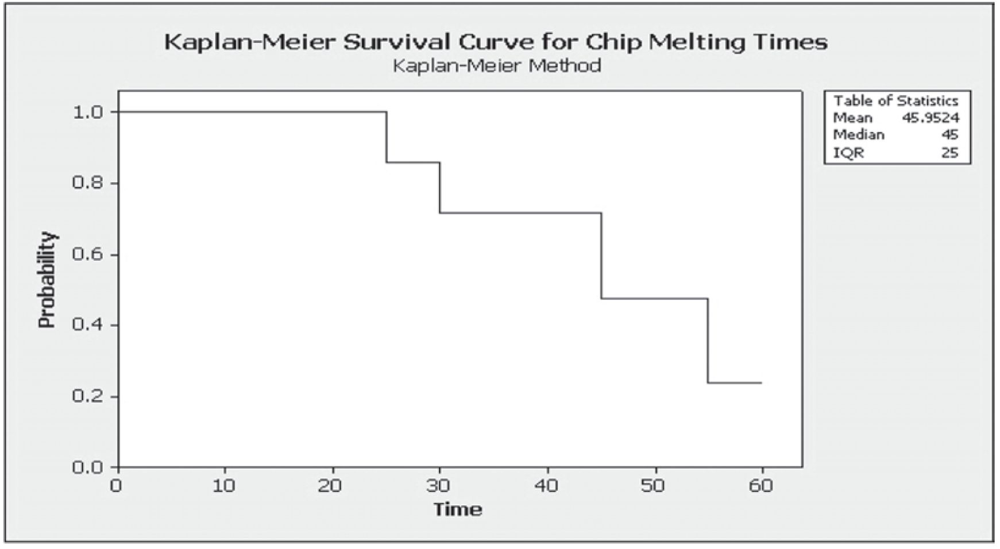
```

### Activity: Kaplan–Meier Curves {-}
18. Compare the values of $\hat S(t)_{\mathrm{KM}}$ in Table 9.3 to those in Figure 9.1. How would the Kaplan–Meier curve in Figure 9.1 change if the largest observed melting time were not censored?  

19. Use the technology instructions provided on the CD to construct the Kaplan–Meier curve for the white and the milk chocolate chips from the chocolate chip melting activity. Compare these two curves. Do the melting proportions for the different types of chips appear similar over time? We’ll discuss formal methods for comparing survival curves for the populations of white and milk chocolate chips in Section 9.6.

### Additional Chip Melting Experiences {-}

In the class data, you observed two possible chip melting *experiences* over time, corresponding to the milk and white chocolate chips. Figure 9.2 presents four additional Kaplan–Meier curves corresponding to different chip melting experiences.

The Kaplan–Meier curve corresponding to the first scenario, displayed in Part (a), reveals that no chips melt until after the 49th second. Then for any time, say $t$, between the 49th and the 87th second, the estimated proportion of chocolate chips that remain unmelted decreases somewhat slowly, indicating a possible resistance by the chocolate chips to melt. For the period of time between the 87th and the 96th second, the estimated proportion of chips that remain unmelted decreases rapidly, suggesting that the chocolate chips are very susceptible to melting. For any time beyond the 96th second, the estimated proportion of chips that remain unmelted remains constant at about 20%. This means that there are some chips that have not melted by the end of the observation period (i.e., their melting times are censored); however, note that 20% does not necessarily refer to the proportion of chips with censored melting times.

The Kaplan–Meier curve corresponding to the second melting scenario, displayed in Part (b), shows that chips begin completely melting after 30 seconds, and the proportion of chips that remain unmelted beyond any time between 30 and 65 seconds decreases rapidly, indicating a period of time when the chips are melting quite quickly. The estimated probability that a chip remains unmelted beyond the 65th second is 0, since all chips have melted by this point.

Part (c) displays the Kaplan–Meier curve for the third melting scenario, and we can observe that the chips do not begin completely melting until after 35 seconds. Then during the next 5 seconds, the estimated proportion of chips that remain unmelted declines rapidly (approximately 50% of the chips melt between the 35th and the 40th second). Then for an extended period of time between the 40th and the 85th second, the melting stabilizes, so the proportions of chips that survive are identical. Then melting resumes for the next 15 seconds. For any time beyond the 100th second, it is estimated that about 9% of the chips have not melted.

```{r fig92, echo=FALSE, out.width="90%", fig.align="center", fig.cap="Kaplan-Meier survival curves for different chip melting experiences."}
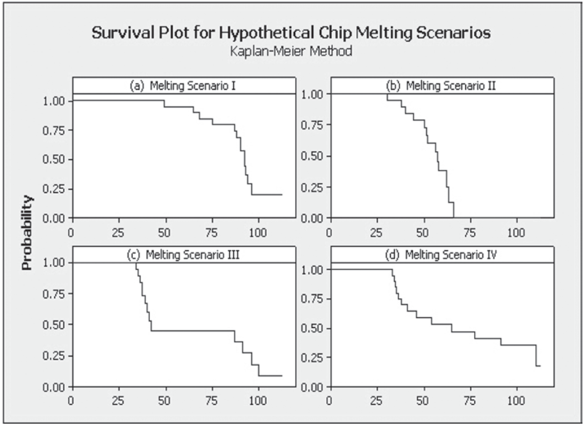
```

### Activity: Chip Melting Experiences {-}

20. Discuss the fourth chip melting scenario, illustrated by the Kaplan–Meier curve in Part (d) of Figure 9.2.

## Descriptive Statistics for Survival Data

So far we have focused on using the Kaplan–Meier curve to estimate the proportion of chips that remain unmelted after 25 seconds, after 30 seconds, and so on. While the survival function is useful, we may also be interested in finding an estimate for the *mean* and *median* time-to-event for a population of individuals. For example, what is the typical time required for a chocolate chip to melt? Or how long does it take for half of the chips to melt?

It may seem odd that we have spent a great deal of time discussing survival probabilities and their estimates *before* discussing descriptive statistics. The primary reason for this ordering of topics in survival analysis is that descriptive measures of survival data require the Kaplan–Meier estimated survival probabilities.

It may be tempting to use the same calculations for means and medians that you learned in your previous statistics course. However, consider the mean time until a chocolate chip melts. If we use the sample mean $\bar x$ to estimate this quantity, then once again we run into the same problem as when we estimated chip melting rates—how are censored observations to be treated? For example, if censored observations are treated as complete, then the resulting estimate of the mean melting time will *underestimate* the true average melting time. We will need to incorporate the Kaplan–Meier estimated survival probabilities to deal with censored observations.

### Estimating the Mean Survival Time {-}

The estimated mean survival time is the total area under the Kaplan–Meier curve. This can be found by adding up the areas of the bars formed by the height of the curve between two adjacent complete survival times, with a slight adjustment if the largest observed event time is censored. Consider the rectangular bars displayed in Figure 9.3. The area of each bar is found by taking the width of each interval $t_{i+1} - t_i$ (the duration of each time period) and multiplying by the estimated probability of surviving through the interval $\hat S(t_i)_{\mathrm{KM}}$ (the height of the bar). If the largest observed event time is censored (i.e., $t_n > t_m$), then the last interval extends from $t_m$ to $t_n$. Hence, we have the following expressions for computing the estimated mean survival time:

If the largest observed event time is complete (i.e., $t_n = t_m$), then the estimator of the mean survival time, denoted by $\hat \mu$, is given by

\begin{align}\label{9.3}
\hat \mu 
&= \sum_{i=0}^{m-1} \hat S(t_i)_{\mathrm{KM}} \,\bigl(t_{i+1} - t_i\bigr) \notag \\
&= \hat S(t_0)_{\mathrm{KM}}(t_1 - t_0) + \hat S(t_1)_{\mathrm{KM}}(t_2 - t_1) + \dots + \hat S(t_{m-1})_{\mathrm{KM}}(t_m - t_{m-1})
\tag{9.3}
\end{align}

If the largest event time $t_n$ is censored (i.e., $t_n > t_m$), then the estimator of the mean survival time is given by

\begin{align}\label{9.4}
\hat \mu 
&= \sum_{i=0}^{m-1} \hat S(t_i)_{\mathrm{KM}} \,(t_{i+1} - t_i) + \hat S(t_m)_{\mathrm{KM}}(t_n - t_m)
\tag{9.4}
\end{align}

Equations \ref{9.3} and \ref{9.4} can be thought of as a weighted average of the time-to-event data, where the Kaplan–Meier curve $\hat S(t_i)_{\mathrm{KM}}$ acts as weights (probabilities) for the time-to-event intervals. Each term in the summation of Equations \ref{9.3} and \ref{9.4} represents the area of a rectangle formed by the width of the $i$th time interval $t_{i+1} - t_i$ and the height of the Kaplan–Meier curve $\hat S(t_i)_{\mathrm{KM}}$. For example, the width of the left-most rectangle in Figure 9.3 outlined by the vertical dotted line is 25 seconds, and the height of the rectangle is 1. So the first term in the sum of Equation \ref{9.3} is $\hat S(t_0)_{\mathrm{KM}}(25 - 0) = (1)(25) = 25$.

```{r fig93, echo=FALSE, out.width="70%", fig.align="center", fig.cap="Kaplan-Meier estimated proportions. Vertical lines appear at the complete melting times, and grid marks are overlaid on the graph. The dimension of each square in the grid is 5 seconds (width) by 0.1 (height)."}
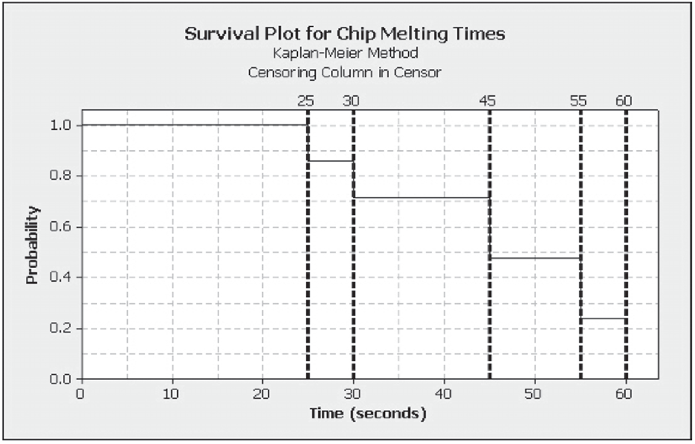
```

  
\textcolor{blue}{The mean survival time is estimated using the time intervals and the Kaplan–Meier estimated probabilities.}


### Activity: Estimated Mean Chip Melting Time {-}

21. Examine Figure 9.3. Visually estimate the mean survival time (i.e., the estimated average time taken for the chocolate chips in the sample to melt) by computing a rough approximation to the area under the Kaplan–Meier curve.  

22. For the sample of chocolate chip melting times in Table 9.2, which equation, \ref{9.3} or \ref{9.4}, is appropriate for estimating the mean survival time of the chips? Based on your answer, calculate the estimated mean using the quantities in Table 9.3.

### Estimating Percentiles of the Survival Time Distribution {-}

Suppose we want the time at which 50% of the chocolate chips have melted. This quantity is called the median survival time (or, more precisely, the *estimated median survival time*, since we are working with a sample of survival times). Other times at which a certain percentage of subjects have experienced the event of interest are known as *percentiles of the survival time distribution*.

The $p$th percentile of the distribution for the survival time random variable $T$ is defined to be the time by which $p\%$ of the subjects in the population have experienced the target event. The estimate of the $p$th percentile, denoted by $\hat t_{(p)}$, is defined to be the smallest *complete* event time in the sample such that at least $p\%$ of the subjects in the sample have experienced the event of interest before $\hat t_{(p)}$, and no more than $(100 - p)\%$ of the subjects in the sample experience the event after $\hat t_{(p)}$. Depending on the number of distinct complete event times, the value of $\hat t_{(p)}$ can be found either by inspecting the Kaplan–Meier curve or by finding the solution to the following equation:

\begin{align}\label{9.5}
\hat t_{(p)} &= \text{smallest complete event time }t_i\text{ in the sample such that } \hat S(t_i)_{\mathrm{KM}} \le 1 - \frac{p}{100}
\tag{9.5}
\end{align}

For example, to find the estimate for the 70th percentile of the chocolate chip melting times in Figure 9.1, we find the smallest complete event time $t_i$ such that at least 70% of the chips have melted: Since $\hat S(t_i)_{\mathrm{KM}} \le 1 - 0.7 = 0.3$, we draw a horizontal line at $\hat S(t) = 0.3$, and eventually we reach the vertical step that occurs at $t_4 = 55$. Since $t_4 = 55$ is the smallest complete event time that satisfies $\hat S(t_i)_{\mathrm{KM}} \le 0.3$, $\hat t_{(70)} = 55$. See Figure 9.4.

  
\textcolor{blue}{Percentile estimates of the survival time distribution are found using the Kaplan–Meier estimated probabilities.}


### Activity: Estimated Median Chip Melting Time {-}

23. For the chocolate chip melting time data in Table 9.2, calculate the estimated median survival time $\hat t_{(50)}$. Since right-censored data are typically right skewed, the median survival time is usually preferred to the mean.  

24. Refer back to the Kaplan–Meier curve displayed in Figure 9.1. The mean and median survival times for the sample of chip melting times are provided in the “Table of Statistics” box on the graph. The interquartile range (IQR) is also provided. Recall that the IQR is the third quartile (75th percentile) minus the first quartile (25th percentile). Verify by hand that the IQR for the sample of times is 25 seconds.  

25. Use the technology instructions provided on the CD to determine the estimated mean and median survival times separately for the milk and white chocolate chip melting time data from your class activity. Discuss the differences you observe between the two descriptive measures and between the two types of chips.

```{r fig94, echo=FALSE, out.width="70%", fig.align="center", fig.cap="Kaplan-Meier estimated proportions. The horizontal dotted line represents $\\hat S(55)_{\\mathrm{KM}} = 0.3$ and the vertical dotted line represents $\\hat t_{(70)} = t_4 = 55$."}
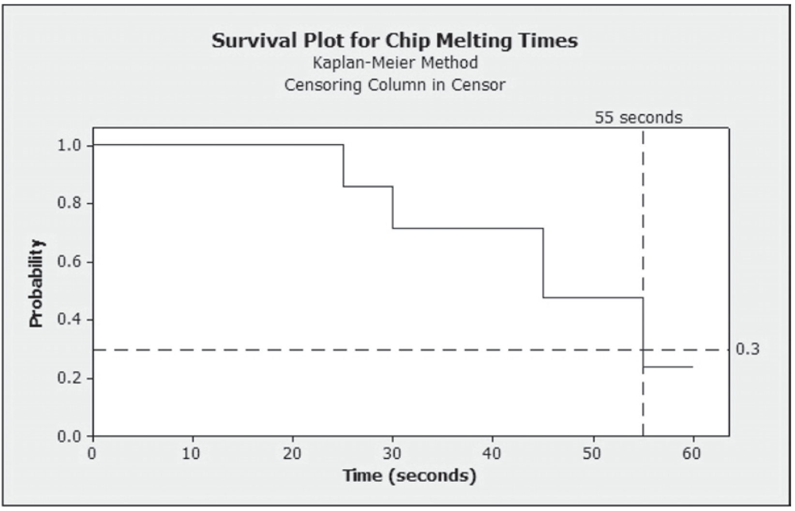
```

  
>**MATHEMATICAL NOTE** Based on the definition of the estimated percentile in Equation \ref{9.5}, it is possible that particular estimated percentiles do not exist. The $p$th percentile will not exist (and your software may return NA) if there does not exist a complete time $t_p$ such that $\hat S(t_p)_{\mathrm{KM}} \le 1 - \tfrac{p}{100}$. For example, in the MeltingChipsJS data set, more than 25% of the milk chocolate chips had not melted by the end of the study (75 seconds). Thus, there is no estimate of the 75th percentile and the IQR cannot be calculated.


## Confidence Intervals for Survival Probabilities

Just like any other sample statistic (e.g., the sample mean $\bar x$), the estimates of the survival probabilities are subject to sampling variability. For example, different samples of chocolate chips (and/or students) would likely lead to different melting times, which would lead to different Kaplan–Meier estimates. Although a point estimate, such as $\hat S(25)_{\mathrm{KM}}$, is useful for descriptive purposes, we may also want to construct a range of possible values that the estimated survival probability can take—i.e., a range that we can be reasonably sure contains the true survival probability $S(25)$. In other words, we want to construct a confidence interval for the true survival probability $S(t)$ at time $t = 25$ seconds.

In your first course in statistics, you saw that a confidence interval for a population parameter (e.g., a population mean $\mu$) has the following form:

\begin{align}\label{9.6}
\text{point estimate} \;\pm\; \text{critical value}\;\times\;\text{standard error of the estimate}
\tag{9.6}
\end{align}

where the point estimate is a single estimate of the parameter (such as $\bar x$ for $\mu$), the critical value is taken from a reference distribution like the standard normal distribution or the $t$-distribution, and the standard error of the estimate is a measure of the variability in the point estimate. The expression for a confidence interval for $S(t)$ at a fixed time $t$ has a very similar form.

We know that the sampling distribution of $\bar x$ is approximately normal for large sample sizes. A similar result can be stated concerning the sampling distribution of $\hat S(t)_{\mathrm{KM}}$ for fixed $t$. Some advanced theory tells us that, for larger sample sizes, the sampling distribution of $\hat S(t)_{\mathrm{KM}}$ at a fixed time $t$ is approximately normal. This fact allows us to use critical values from the standard normal distribution.

Using the critical value from a standard normal distribution and the standard error of $\hat S(t)_{\mathrm{KM}}$, we can put together the confidence interval for $S(t)$ at a fixed time $t$. The usual procedure is to construct a confidence interval for $S(t)$ at all the complete event times $t_1,\dots,t_m$.

The 100$(1-\alpha)\%$ confidence interval for $S(t)$ at a fixed time $t$ is given by

\begin{align}\label{9.7}
\hat S(t)_{\mathrm{KM}} \;\pm\; Z_{\alpha/2}\,\mathrm{se}\bigl(\hat S(t)_{\mathrm{KM}}\bigr)
\tag{9.7}
\end{align}

where $Z_{\alpha/2}$ is the critical value from the standard normal distribution with $\alpha/2$ area under the curve to its right (i.e., corresponding to confidence level $100(1-\alpha)\%$) and $\mathrm{se}\bigl(\hat S(t)_{\mathrm{KM}}\bigr)$ is the standard error of the Kaplan–Meier estimator at time $t$, discussed in the following section.

### The Standard Error of the Kaplan–Meier Estimator {-}

The variability in the values of $\hat S(t)_{\mathrm{KM}}$ at a fixed time $t$ in each interval $[t_{i-1},\,t_i)$ is measured by the estimated **variance of the Kaplan–Meier estimator**, denoted $\widehat{\mathrm{Var}}\bigl(\hat S(t)_{\mathrm{KM}}\bigr)$ and calculated using the expression

\begin{align}\label{9.8}
\widehat{\mathrm{Var}}\bigl(\hat S(t)_{\mathrm{KM}}\bigr)
&= \bigl(\hat S(t)_{\mathrm{KM}}\bigr)^2 \;\biggl(\sum_{t_i \le t}\frac{d_i}{n_i(n_i - d_i)}\biggr)
\tag{9.8}
\end{align}

where $d_i$ is the number of subjects who experienced the event of interest in time interval $[t_{i-1},\,t_i)$ and $n_i$ is the number who are at risk at each complete event time $t_i$.$^3$

The **standard error of the Kaplan–Meier estimator** at time $t$, denoted by $\mathrm{se}\bigl(\hat S(t)_{\mathrm{KM}}\bigr)$, is the square root of $\widehat{\mathrm{Var}}\bigl(\hat S(t)_{\mathrm{KM}}\bigr)$:

\begin{align}\label{9.9}
\mathrm{se}\bigl(\hat S(t)_{\mathrm{KM}}\bigr)
&= \sqrt{\widehat{\mathrm{Var}}\bigl(\hat S(t)_{\mathrm{KM}}\bigr)}
\tag{9.9}
\end{align}


As we will see, when we construct the confidence intervals for $S(t)$, the estimated variance $\widehat{\mathrm{Var}}\bigl(\hat S(t)_{\mathrm{KM}}\bigr)$ [and standard error $\mathrm{se}\bigl(\hat S(t)_{\mathrm{KM}}\bigr)$] will need to be calculated for each complete event time $t_1,\dots,t_m$; that is, we need to calculate

\begin{align}
\widehat{\mathrm{Var}}\bigl(\hat S(t_1)_{\mathrm{KM}}\bigr),\;\widehat{\mathrm{Var}}\bigl(\hat S(t_2)_{\mathrm{KM}}\bigr),\;\dots,\;\widehat{\mathrm{Var}}\bigl(\hat S(t_m)_{\mathrm{KM}}\bigr).\notag
\end{align}

For example, the Kaplan–Meier estimated survival probability at the complete time $t=25$ for the data in Table 9.2 is $\hat S(25)_{\mathrm{KM}} = 6/7$. Using Equation \ref{9.8} and the quantities in Table 9.3, we find that the variance estimate $\widehat{\mathrm{Var}}\bigl(\hat S(25)_{\mathrm{KM}}\bigr)$ at time $t=25$ is given by

\begin{align}
\widehat{\mathrm{Var}}\bigl(\hat S(25)_{\mathrm{KM}}\bigr)
&= \bigl(\hat S(25)_{\mathrm{KM}}\bigr)^2 \;\biggl(\sum_{t_i \le 25}\frac{d_i}{n_i(n_i - d_i)}\biggr) \\
&= \Bigl(\tfrac{6}{7}\Bigr)^2 \;\biggl(\frac{0}{7(7-0)} + \frac{1}{7(7-1)}\biggr) \\
&= 0.0175 
\notag
\end{align}

Then the standard error of $\hat S(25)_{\mathrm{KM}}$ at time $t=25$ is $\mathrm{se}\bigl(\hat S(25)_{\mathrm{KM}}\bigr) = \sqrt{0.0175} = 0.1323$. 

With the computed standard error, we can use Formula \ref{9.7} to construct a confidence interval for a survival probability. For example, the 95% confidence interval for $S(25)$—the probability that a randomly selected milk chocolate chip takes longer than 25 seconds to melt—is calculated as

\begin{align}
\hat S(25)_{\mathrm{KM}} \;\pm\; Z_{0.025}\,\mathrm{se}\bigl(\hat S(25)_{\mathrm{KM}}\bigr)
\quad=\quad
\frac{6}{7}\;\pm\;1.96\,(0.1323)
\quad=\quad
(0.60,\;1.12).
\notag
\end{align}

Observe that the upper limit for the confidence interval for $S(25)$ exceeds 1. Since the confidence interval given by Formula \ref{9.7} is for a *survival probability*, the interval limits should technically not fall outside the range [0,1]. However, it is possible to obtain a lower limit less than 0 and/or an upper limit greater than 1, especially for smaller sample sizes. This is a drawback of using Formula \ref{9.7} to construct confidence intervals. When confronted with a situation (as is the case here) where the interval limit(s) is (are) outside the range [0,1], it is common practice to truncate the limit(s) at the appropriate minimum value of 0 or maximum value of 1.

The interpretation of confidence interval limits for *survival probabilities* is similar to the standard interpretation of confidence intervals for other parameters of interest (think back to confidence intervals for a population mean or proportion). For the chip melting times provided in Table 9.2, we can state with 95% confidence that the probability that a chocolate chip will take longer than 25 seconds to melt is between 0.60 and 1.00. Or, equivalently, we are 95% confident that the true proportion of chips that have not melted after 25 seconds is between 60% and 100%.

The Kaplan–Meier curve and associated 95% confidence intervals for the chocolate chip melting time data are displayed in Figure 9.5. Observe the times where the upper limit has been constrained to equal 1 and the lower limit has been constrained to equal 0.

```{r fig95, echo=FALSE, out.width="65%", fig.align="center", fig.cap="Kaplan-Meier curve with 95% confidence intervals. Note that Minitab graphs use the same line type and color for both the Kaplan-Meier curve and the confidence limits; however, the middle line will always be the Kaplan-Meier curve."}
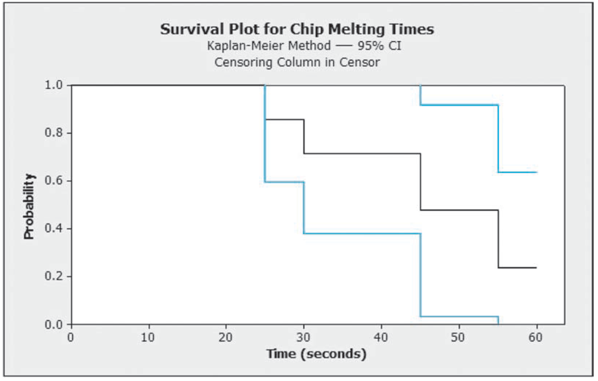
```

  
>**NOTE** There are alternative formulas for computing confidence intervals for survival probabilities that constrain the limits to lie between 0 and 1, but we’ll leave it to interested readers to investigate them on their own.  


  
\textbf{\textcolor{blue}{Key Concept:}}  
\textcolor{blue}{Confidence intervals provide a range of values that we can be reasonably sure contain the true survival probabilities.}

### Activity: Standard Errors and Confidence Intervals for Survival Probabilities {-}

Use the estimated survival probabilities and the entries in Table 9.3 to answer Questions 26 through 28, and use `MeltingChips` or `MeltingChipsJS` to answer Questions 29 through 31.  

26. Provide a brief explanation of why the estimated variance of $\hat S(0)_{\mathrm{KM}}$, and hence the standard error of $\hat S(0)_{\mathrm{KM}}$, is equal to 0.  

27. Find the remaining standard errors of $\hat S(t)_{\mathrm{KM}}$ at times $t = 30$, $t = 45$, and $t = 55$ for the chocolate chip melting time data.  

28. Using your above answers and the appropriate entries in Table 9.3, construct 95% confidence intervals for the survival probabilities $S(t)$ at each of the remaining complete melting times, and interpret their values.  

29. Use software to construct the 95% confidence intervals for the survival probabilities for the milk chocolate chip melting time data from your class activity. Graph the Kaplan–Meier curve and the confidence intervals for $S(t)$.  

30. Based on the width of the confidence intervals (upper limit minus lower limit), how useful do you think these intervals are for providing estimates of the true melting times? How could we improve the usefulness of these intervals? (Hint: Refer back to Equation \ref{9.8}. What could you change to make the intervals narrower?)  
31. On the same graph, plot both Kaplan–Meier estimates and 95% confidence intervals for the white and milk chocolate chip melting time data from your class activity. Explain whether or not the two types of chocolate appear to have different survival functions.  

  
>**NOTE** The confidence interval for $S(t)$ is valid for a single fixed time at which the inference is to be made. For this reason, confidence intervals are sometimes referred to as *pointwise intervals*. Each interval constructed using Formula \ref{9.7} is relevant only for $t$ within the $i$th interval. Therefore, it is not correct to state that we are 95% confident that the entire true survival curve $S(t)$ falls between the confidence bands in Figure 9.5. If we want a confidence band for an entire survival function $S(t)$ within which we can guarantee with a specified level of confidence that the entire curve falls, alternative confidence bands need to be computed.  


## Comparing Survival Functions

In Question 19 you were asked to comment on the differences in melting experiences between white and milk chocolate chips. Now we will look at how to formally compare the survival experiences of two or more groups. This is equivalent to investigating whether survival experience depends on another (categorical) variable of interest. To compare the survival experiences of milk and white chocolate chips, we will ask, “Does melting experience depend on the type of chip?”

To illustrate the comparison techniques, we’ll use a sample of *white* chocolate chip melting times for 9 other students:

\begin{align}
\text{45+ 35 48 64+ 72 42 55+ 43 62}
\notag
\end{align}

First, we visually inspect the Kaplan–Meier curves for both groups. Figure 9.6 shows that the Kaplan–Meier curve for the white chocolate chip melting times tends to be above the milk chocolate chip curve. This means that, over time, the proportion of unmelted white chocolate chips is generally larger than the proportion of unmelted milk chocolate chips; that is, white chocolate chips generally take longer to melt than milk chocolate chips. While Figure 9.6 appears to show a difference in the curves based on our sample data, a formal hypothesis test is needed to determine if the difference in the *sample data* is large enough to conclude that the survival curves for the *populations* of white and milk chocolate chips are different.

```{r fig96, echo=FALSE, out.width="65%", fig.align="center", fig.cap="Kaplan-Meier curves for the hypothetical melting times of milk and white chocolate chips."}
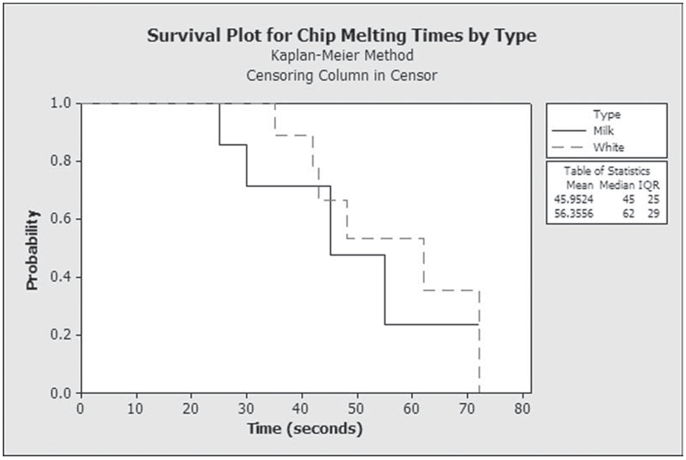
```


### The Log-Rank Test {-}

The log-rank test is a formal statistical inference procedure used to determine if the population survival curves are significantly different over the range of time $t$—that is, to determine if the survival experiences significantly differ. The null hypothesis is that the survival experiences of both populations are equal—that is, $H_0:\;S_1(t) = S_2(t)$ for all times t during which at least one of the groups has at least one subject at risk of
experiencing the event. The alternative hypothesis is that the survival experiences are not identical for at least one value of $t$ (i.e., $H_a:\;S_1(t)\neq S_2(t)$ for some $t$).

Assuming that we have two independent populations and that the survival experiences for group 1 and group 2 are identical, the log-rank test compares the total number of *observed* events to the total number of *expected* events in group 1. Observed counts that disagree significantly with the expected counts lead to rejection of the null hypothesis that the survival experiences are identical.

Table 9.4 contains the melting data for both the milk and the white chocolate chips. To calculate the log-rank test statistic, define the following terms:

* $m$: the number of distinct ordered complete event times $t_1, t_2, \dots, t_m$ for both groups combined (we will not consider $t_0 = 0$).
* $n_{1i}$: the number of subjects at risk of experiencing the event at time $t_i$ in group 1, for $i = 1,\dots,m$.  
* $n_{2i}$: the number of subjects at risk of experiencing the event at time $t_i$ in group 2.  
* $n_i = n_{1i} + n_{2i}$: the total number of individuals in both groups at risk at time $t_i$.  
* $d_{1i},\,d_{2i},\,d_i$: the observed number of event occurrences at each of the complete event times for group 1, group 2, and the combined groups, respectively.

```{r tab9.4, echo=FALSE, results='asis'}
df9.4 <- rbind(
  `Group 1 (milk chocolate)` = c("35+", "30", "60+", "45", "25", "55", "30+", "", ""),
  `Group 2 (white chocolate)` = c("45+", "35", "48", "64+", "72", "42", "55+", "43", "62")
)
colnames(df9.4) <- rep("", ncol(df9.4))

kable(
  df9.4,
  format = "latex",
  booktabs = TRUE,
  caption = "Table 9.4 Hypothetical melting times of the milk and white chocolate chips.",
  align = c("l", rep("c", ncol(df9.4))),
  row.names = TRUE,
  escape = FALSE
) %>%
  kable_styling(latex_options = "hold_position")
```

The partially completed Table 9.5 contains the appropriate quantities to compute the log-rank test statistic. The total number of complete event times for both types of chips is $m = 10$. All 16 milk and white chocolate chips were at risk of melting prior to the beginning of the first time interval $[25,30]$, so $n_{11} = 7$, $n_{21} = 9$, and $n_1 = 16$. Since 1 milk chocolate chip melted in the first time interval $[25,30]$ and no white chocolate chips melted in that interval, $d_{11} = 1$, $d_{21} = 0$, and $d_1 = 1$.

```{r tab9.5, echo=FALSE, results='asis'}
df9.5 <- data.frame(
  `Interval i` = 1:10,
  `Time Interval` = c(
    "[25, 30)", "[30, 35)", "[35, 42)", "[42, 43)",
    "[43, 45)", "[45, 48)", "[48, 55)", "[55, 62)",
    "[62, 72)", "[72, 72]"
  ),
  `$n_i$` = c(16, 15, 13, 11, 10, 9, "", "", "", ""),
  `Number Censored` = c(0, 1, 1, 0, 0, 1, "", "", "", ""),
  `$d_i$` = c(1, 1, 1, 1, 1, 1, "", "", "", ""),
  `$d_{1i}$` = c(1, 1, 0, 0, 0, 1, "", "", "", ""),
  `$d_i/n_i$` = c("1/16", "1/15", "1/13", "1/11", "1/10", "1/9", "", "", "", ""),
  `$n_{1i}$` = c(7, 6, 4, 3, 3, 3, "", "", "", ""),
  `$n_{2i}$` = c(9, 9, 9, 8, 7, 6, "", "", "", ""),
  `$E_{1i}$` = c("7/16", "6/15", "4/13", "3/11", "3/10", "3/9", "", "", "0", "0"),
  `$V_{1i}$` = c("0.246", "0.240", "0.213", "0.198", "0.210", "0.222", "", "", "0", "0"),
  check.names = FALSE,
  stringsAsFactors = FALSE
)

cat(
  kable(
    df9.5,
    format = "latex",
    booktabs = TRUE,
    caption = "Table 9.5 Selected quantities for the combined groups of chocolate chips.",
    align = c("r", "l", rep("c", ncol(df9.5) - 2)),
    escape = FALSE
  ) %>%
  kable_styling(latex_options = "hold_position")
)
```

The expected number of event occurrences in group 1 at time $t_i$, denoted $E_{1i}$, is given by

\begin{align}\label{9.10}
E_{1i} &= \frac{n_{1i}\,d_i}{n_i}
\tag{9.10}
\end{align}

The quantity $d_i/n_i$ is the overall proportion of individuals at time $t_i$ who experience the event, and $n_{1i}$ is the
number of individuals in group 1 who are at risk at time $t_i$.

  
>**MATHEMATICAL NOTE**  Equation \ref{9.10} is based on the assumption that the number of occurrences for group 1 at time $t_i$ follows a hypergeometric distribution.$^6$


Next, we need to compare the observed and expected counts at time $t_i$, which can be done by taking the
difference between the counts and dividing by an appropriate scaling factor. This scaling quantity is the vari-
ance of the number of event occurrences at time ti. Again, based on the assumption that the number of event
occurrences at time $t_i$ for group 1 follows a hypergeometric distribution, the variance for the number of event
occurrences for group 1 at time $t_i$, denoted $V_{1i}$, is given by

\begin{align}
V_{1i} &= \frac{n_{1i}\,n_{2i}\,d_i\,(n_i - d_i)}{n_i^2\,(n_i - 1)}
\notag
\end{align}

### Activity: Calculating the Expected Number and Variance of Melted Chips {-}
Refer to the entries in Table 9.5.  
32. Show that the expected number of melted milk chocolate chips in the first interval is 7/16 = 0.4375.
33. Show that the variance in the first interval is 0.246.

Table 9.5 contains values of $E_{1i}$ and $V_{1i}$ for the first six time intervals for the milk chocolate chip and white chocolate chip melting time data. Remember that we need to compare the total observed and total expected counts over all the complete event times, so we compare $\sum_{i=1}^m d_{1i}$, and the sum of the expected event occurrences, $\sum_{i=1}^m E_{1i}$, over all $m$ complete event times. We put this together to obtain the statistic

\begin{align}\label{9.11}
\chi &= \frac{\sum_{i=1}^m d_{1i} - \sum_{i=1}^m E_{1i}}{\sqrt{\sum_{i=1}^m V_{1i}}}
\tag{9.11}
\end{align}

where $\sum_{i=1}^m V_{1i}$ is the variance of the total number of event occurrences over the $m$ complete event times. Basically, Equation \ref{9.11} is nothing more than a $z$-score; i.e., it tells us how many standard deviations the total observed number of event occurrences is above or below its mean.

Although we can use Equation \ref{9.11} to make our decision regarding the null hypothesis of equal survival functions, it is more common to see the square of the statistic in Equation \ref{9.11} reported in statistical software output. The square of the statistic in Equation \ref{9.11}, called the log-rank test statistic (for two groups), is given by

\begin{align}\label{9.12}
\chi^2 &= \frac{\bigl(\text{total observed events in group 1} - \text{total expected events in group 1}\bigr)^{2}}%
             {\text{variance in the total number of all complete events}} \notag \\
       &= \frac{\left(\sum_{i=1}^m d_{1i} - \sum_{i=1}^m E_{1i}\right)^{2}}{\sum_{i=1}^m V_{1i}}
\tag{9.12}
\end{align}

If the sample size is reasonably large, then under the assumption that the two survival curves are identical, $\chi^2$ approximately follows a chi-square distribution with 1 degree of freedom. If the observed and expected numbers of events are far apart, the test statistic will correspond to a small $p$-value; thus, we will reject $H_0: S_1(t) = S_2(t)$ and conclude that the two population survival functions are different.

  
>**MATHEMATICAL NOTE** The test statistic $\chi^2$ is said to *asymptotically* follow a chi-square distribution, which means that as the total sample size approaches infinity, the distribution of the statistic will closely follow the chi-square distribution with 1 degree of freedom. Unfortunately, there is no generally accepted rule as to what constitutes a large sample size; however, simulation studies have shown that even for small sample sizes (10 per group), the statistic will be approximately chi-square if the amount of censoring is roughly the same in each group.$^7$


### Activity: Log-Rank Test Statistic {-}

34. Calculate the missing quantities in Table 9.5. Note that $E_{19}$, $E_{1,10}$, $V_{19}$, and $V_{1,10}$ are all equal to 0. This is because all the milk chocolate chips have melted by 62 seconds.  
35. Use Equation \ref{9.12} and the entries in Table 9.5 to verify that the value of the log-rank test statistic is 1.007. Note that your answer may vary slightly because of rounding.

The $p$-value corresponding to the value of $\chi^2$ is 0.316. Hence, we do not have strong enough evidence to conclude that the melting experiences (survival curves) of the populations of white and milk chocolate chips significantly differ. Note that we should be cautious about interpreting the results of this test because the sample size of 16 is fairly small. We should always supplement the results of the test with graphs of the Kaplan–Meier curves.

If the difference between the total observed and expected number of event occurrences is large, then the
test statistic is much greater than 0 and the resulting p-value will be small. Then the null hypothesis will be
rejected

### Activity: Log-Rank Test for Chip Melting Activity {-}

36. Use software to conduct the log-rank test to determine if the melting experiences for the white and milk chocolate chips in your chip melting activity are different. What do you conclude about the survival experiences for the two types of chips?

### The Wilcoxon Test {-}

Another test for comparing survival curves, commonly used in practice and reported in software output, is the **Wilcoxon test**. The Wilcoxon test is similar to the log-rank test in the sense that it also compares the observed and expected number of event occurrences; however, the Wilcoxon test statistic is a slight variant of the log-rank test statistic. It places more weight on differences in the survival curves at earlier times (when the number at risk will be larger), so it can be better at detecting differences in the survival curves at earlier time periods. Note that when survival curves cross, neither test may be able to detect a significant difference in survival experiences. This underscores the importance of graphing the survival curves and describing the survival experiences based on observation.

Although the results of the log-rank and Wilcoxon tests will typically agree, it is possible for the two tests to yield different results. In practice, when the tests yield different results, you should report the results of both tests. When the tests yield similar conclusions, results of either test can be provided.$^8$

The log-rank test and the Wilcoxon test can be implemented with many statistical packages. For the chip melting data in Table 9.4, the results for the tests comparing survival curves are shown in Figure 9.7.

```{r fig97, echo=FALSE, out.width="80%", fig.align="center", fig.cap="Software output for the log-rank and Wilcoxon tests."}
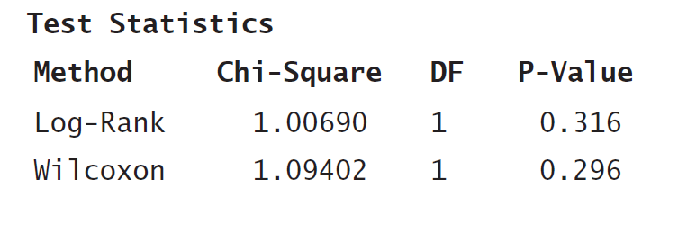
```

Observe that the results of the two different tests are in agreement. Thus, even though the two curves
based on the sample data look fairly different, we do not have enough evidence to conclude that the popula-
tion survival functions for white and milk chocolate chips are different.

  
\textbf{\textcolor{blue}{Key Concept:}}  
\textcolor{blue}{The log-rank and Wilcoxon tests provide formal inferential methods for comparing the survival experiences of two or more groups.}


  
>**NOTE**
The log-rank (and Wilcoxon) test can easily be applied to more than two groups. Although the details are not given here, the test statistic follows a chi-square distribution with $k - 1$ degrees of freedom, where $k =$ number of groups.$^9$


### Beyond Different Survival Experiences: Regression Models for Survival Data {-}

The log-rank and Wilcoxon tests are useful procedures for determining whether the survival experiences of two or more independent groups are different. This is basically equivalent to testing whether there is a significant effect of a categorical explanatory variable on survival. However, the tests do not allow us to determine the extent to which the survival experiences differ or, equivalently, to estimate the effects of the categorical explanatory variables on survival. Furthermore, the tests cannot be used to appropriately assess the effects of quantitative variables on survival. Consider the chocolate chip activity, and suppose we had additional information on the age of the chip. Are older chips likely to melt earlier than newer chips? Can we predict how long a chip that is a month old will take to melt? How do we incorporate censored melting times? These are questions that need to be addressed using regression-type models that exploit the relationship between the survival time random variable, $T$, and the explanatory variables of interest.

Regression models for survival data will not be discussed in this chapter; however, we will briefly mention two main approaches: regression models that explicitly model the log of the survival time variable, $T$, as a function of the explanatory variables, sometimes referred to as **parametric regression models** or **accelerated failure time models**, and those that model the hazard function (to be discussed) as a function of the explanatory variables, known in the literature as the **proportional hazards model** or the **Cox regression model**.$^10$

## What Can We Conclude About Melting Chocolate Chips?

The goal in the previous sections and activities was to motivate introductory topics in survival analysis by conducting a simple experiment with chocolate chip melting times. As we have seen, the Kaplan–Meier estimator of the survival function forms the basis of several quantities used to summarize and investigate chip melting times, including descriptive measures like the mean and median.

We were also able to compare the melting experiences of white and milk chocolate chips using the log-rank test. Since the chip melting activity was an experimental study (students were randomly assigned to white or milk chocolate chips), if the result of the log-rank test is significant, then we can conclude that the type of chip affects the melting time (i.e., that type of chip causes differences in the melting experiences).

Note that the group sizes (i.e., the numbers of white and milk chocolate chips) could be small (depending on the number of students participating in the activity), and we need to be cautious about interpreting the results of the log-rank test if this is the case.

Although simple in scope, the chip melting time data you collected have the same general features as other survival data that will be introduced in the extended activities and that are of more practical importance and interest to researchers in various fields. Real studies that implement survival analysis methods are common in medicine, health, and the social sciences, and in the remainder of this chapter we will use data from real surveys and studies to see how survival analysis methods can be applied in a variety of disciplines.


## The Hazard Function

The remaining sections and extended activities introduce additional methods for analyzing survival data and additional types of incomplete data. Although the Kaplan-Meier estimator is useful for examining the proportion of individuals yet to experience the target event at a specific moment in time, it does not assess the risk, or potential, at that particular moment that an individual who has not previously done so will experience the target event. Risk can be addressed using the hazard function and the closely related cumulative hazard function, which will be discussed in the following sections. In the final section of this chapter, we’ll introduce some other types of incomplete survival data, including left- and interval-censored data and truncated data


Recall the chip melting experiment, and suppose that 45 seconds have passed. Among the chips that have not melted (have survived), at what rate will the chips melt (fail) in the next 5 seconds? In the next second? In the next instant of time? Would this rate be the same for chips that have not melted after 60 seconds? These types of questions address when individuals (or chips, in this example) are likely to experience the target event, given that they have not previously experienced the event. To answer such questions, we will need to use another function of survival time called the hazard function, denoted $h(t)$.

In survival analysis, the (conditional) risk of experiencing the target event is associated with the rate at which individuals who have survived up to a particular time will experience failure at that moment. Earlier, when we discussed the construction of the Kaplan–Meier estimator, we introduced the risk set of individuals. The individuals in the risk set have survived (not experienced the event) up through time $t_{i-1}$ and are available to experience the target event in the time interval $[t_{i-1},\,t_i)$ for $i = 2, \dots, m$. So anybody in the risk set at time $t_{i-1}$ runs the risk of experiencing, or has the potential to experience, the target event in the next interval of time.

As the unit of time becomes finer and finer, until we are looking for a rate of failure in the next *instant* of time, we approach a quantity known as the hazard rate or conditional failure rate. The hazard rate at time $t$, also known as the (population) hazard function, denoted $h(t)$, is defined as the *instantaneous* rate of failure at time $t$ for all subjects in the population who have survived until time $t$.

The formal definition of the population hazard function requires the use of calculus. Those of you who have the necessary background and wish to do so may read about $h(t)$ in more detail in the next section. Otherwise, you can skim or skip the next section. At this point it is enough to understand that the hazard function (population or estimated) is used to describe when subjects are likely to experience the event of interest and can help us identify periods of high and low risk of event occurrence.

  
>**NOTE**
If the notion of an “instantaneous” rate troubles you, imagine the situation when you are driving your car and you glance down at the speedometer to see how fast you are traveling. If the speedometer reads 65 miles per hour at the instant you glance at it, this is the instantaneous rate at which you are traveling in distance per hour.  


### The Population Hazard Function {-}

To reiterate, the population hazard function, $h(t)$, is the rate at which individuals in the population experience the target event in the next *instant* of time (time $t$), conditional on having survived (not experienced the event) up to time $t$. Although you are probably comfortable with the idea of a small interval of time like one second or even a tenth of a second, it may be a bit harder to imagine an interval of time that lasts an instant. In calculus, an instant of time is regarded as an interval of time whose width approaches (but never reaches) 0. The hazard function, $h(t)$, is defined as

\begin{align}\label{9.13}
h(t) &= \lim_{\Delta t \to 0} \frac{P\bigl(t \le T < t + \Delta t \mid T \ge t\bigr)}{\Delta t}
\tag{9.13}
\end{align}

where $\Delta t$ indicates a small change in time $t$.

From this expression, we see that the hazard is the conditional probability of experiencing the event per unit of time $\Delta t$. Note that since $h(t)$ is a rate, it may take on values greater than 1. The only restriction on the hazard function is that $h(t) \ge 0$.

In some situations, a graph of $h(t)$ can be constructed and examined for periods of high and low risk; however, an expression for $h(t)$ requires an assumption about the probability distribution of the time-to-event random variable $T$ (as well as some calculus and knowledge of intermediate concepts in mathematical statistics). In fields such as engineering, a distribution for $T$ may be assumed, where, for example, $T$ might be defined as the time until a computer processing chip fails, and then graphs of $h(t)$ [as well as $S(t)$] can be constructed.

Although we will not provide any computational examples of $h(t)$, we’ll provide two hypothetical hazard curves and describe them in the context of melting chocolate chips.^[Calculus is suggested for this section] Figure 9.8 displays two hazard functions that are used in practice when simplifying assumptions about the data can be made. The hazard function in Part (a) illustrates constant risk, while the hazard function in Part (b) illustrates increasing risk. Part (a) displays a situation or study where the subjects have a constant risk of experiencing the target event. In the context of melting chips, the constant hazard rate of 0.40 (i.e., $h(t)=0.4$) shown in Part (a) would correspond to a period throughout which events (melting chips) occur with equal frequency during any equal period of time. Now examine Part (b). The hazard function is increasing over time; furthermore, the hazard rate is linearly related to time. This implies that the risk of chips melting increases as a function of time, corresponding to a period of time during which the proportion of unmelted chips is decreasing.

```{r fig98, echo=FALSE, out.width="80%", fig.align="center", fig.cap="Possible forms of the population hazard function."}
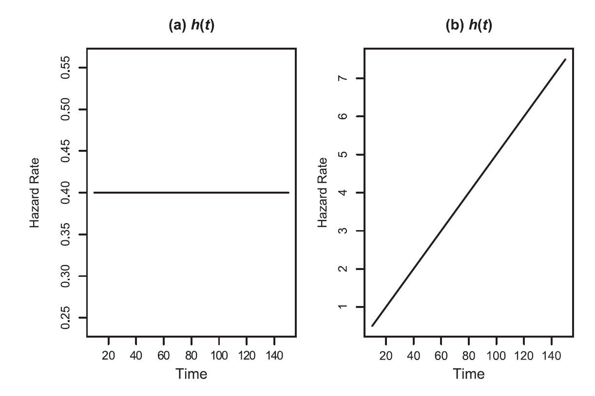
```

Equation \ref{9.13} may look something like the formal definition of the derivative of some function (although it probably isn’t clear what that function is). It turns out that $h(t)$ is related to the derivative of a function of the (population) survival function $S(t)$ by the expression

\begin{align}\label{9.14}
h(t) &= -\frac{d}{dt}\,\ln\bigl[S(t)\bigr]
\tag{9.14}
\end{align}

That is, the hazard function is equal to the negative of the derivative of the natural logarithm of the survival function. This identity is not very obvious, and we skip the mathematical details here. The important thing to note is that since $S(t)$ is a function based on the distribution of the time-to-event random variable $T$, $h(t)$ is also a function based on the distribution of $T$. Hence, if we know the exact distribution of $T$, we can calculate the hazard function using calculus.


\textbf{\textcolor{blue}{Key Concept:}}  
\textcolor{blue}{The population hazard function describes how the conditional risk of experiencing the event changes over time for individuals in the population.}


### The Estimated Hazard Function {-}

  
>**NOTE** The R statistical package is suggested for calculating and graphing the estimated hazard and estimated cumulative hazard functions discussed in this section and Section 9.9.  


We are not likely to know the true hazard rate at any particular moment in time unless we can make some assumption about the time-to-event variable $T$. Typically we have only observed event times that can be used to estimate the true hazard rates. Whereas the population hazard function, $h(t)$, is the rate at which individuals in the population experience the target event in the next *instant* of time (time $t$), conditional on surviving to time $t$, the estimated hazard function assesses the conditional failure rate during the $i$th interval of time $[t_i,\,t_{i+1})$ for those individuals in the sample who have survived to time $t_i$.

The estimates of hazard are based on quantities used to find the Kaplan–Meier estimated probabilities, so we will first construct time intervals $[t_i,\,t_{i+1})$ for $i = 1,\dots,m-1$ as if we were constructing the Kaplan–Meier estimator, where $t_0 = 0$ and $m$ is the number of complete event times (see Section 9.3 for details).

Recall that the estimated conditional probability of experiencing the target event in the $i$th interval $[t_i,\,t_{i+1})$ is given by

\begin{align}
\hat p_i &= \frac{d_i}{n_i}
\notag
\end{align}

for $i=0,1,\dots,m-1$. Recall that $\hat p_i$ represents the proportion of remaining subjects in the sample at the beginning of the $i$th interval who experience the target event in the time interval $[t_i,\,t_{i+1})$.

If we divide $\hat p_i = d_i/n_i$ by the width of the time interval $t_{i+1}-t_i$, then the resulting quantity

\begin{align}\label{9.15}
\frac{\hat p_i}{t_{i+1} - t_i}
\tag{9.15}
\end{align}

yields the *average* conditional probability of event occurrence per unit of time within $[t_i,\,t_{i+1})$. This quantity is the **estimated hazard rate** or **estimated hazard function** for $t_i \le t < t_{i+1}$, denoted by $\hat h(t)_{\mathrm{KM}}$, and measures the estimated conditional probability of experiencing the event *per* unit of time in $[t_i,\,t_{i+1})$. When no interval of time is specified, $\hat h(t)_{\mathrm{KM}}$ will be used to refer to the estimated hazard function for any $t$ within the entire observed range of time.

Table 9.3 contained the observed number of melted chips, number of chips at risk, and so on, for the chip melting times. In Table 9.4, columns containing the width of each interval of time $t_{i+1} - t_i$, and the estimated hazard rate $\hat h(t)_{\mathrm{KM}}$ for each time interval have been appended, and values have been computed for the first three rows. We interpret the estimated hazard rates $\hat h(t)_{\mathrm{KM}} = 0$ for $t_0 \le t < t_1$, $\hat h(t)_{\mathrm{KM}} = 0.0286$ for $t_1 \le t < t_2$, and $\hat h(t)_{\mathrm{KM}} = 0.0111$ for $t_2 \le t < t_3$ in the following manner: Since no chips melt within the time interval $[0,25)$, 0% of the unmelted chips melt per second during that interval. Within the time interval $[25,30)$, we estimate that, of the chips that have not yet melted after 25 seconds, about 2.9% will melt per second. The estimated hazard rate is not defined for the last interval $[55,60)$, since the width of the last interval cannot be determined because 60+ is a censored melting time.

### Activity: Chip Melting Hazard Rates {-}
37. Compute the missing entries in Table 9.6.  

38. Among chips that have not yet melted after 30 seconds, estimate the rate at which the chips will melt in the next 15 seconds.  

39. Excluding the first time interval, during which period (interval) of time are chips at their highest risk of melting? Lowest risk?  

40. Do the values of $\hat h(t)_{\mathrm{KM}}$ suggest that the estimated hazard function is a strictly increasing or strictly decreasing function, or do they suggest that the function can increase and decrease over time?

We can plot the estimated hazard rates versus time to view the estimated **hazard curve** for the sample of survival times. The Kaplan–Meier curve and estimated hazard function for the chocolate chip melting times are shown in Figure 9.9. Note that, because of the small sample size, the plot is extremely rough and the pattern is somewhat erratic. This curve is an approximation to the corresponding true hazard function for the population of all chocolate chip melting times. From Figure 9.9 we observe that the lowest risk of melting occurs between 30 and 45 seconds (among chips that have remain unmelted up through 30 seconds). The highest risk of melting occurs between the 45th and the 55th second. Note that the estimated hazard rate is not defined before the first complete event time and after the last complete time.

```{r fig99, echo=FALSE, out.width="80%", fig.align="center", fig.cap="Estimated survival probabilities and estimated hazard rates for the chocolate chip data."}
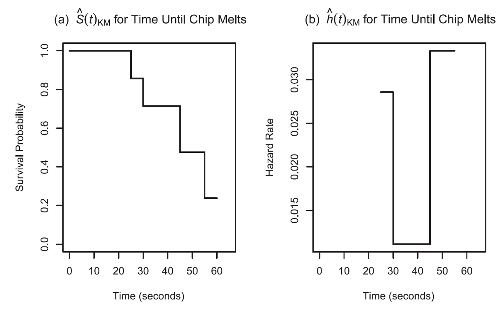
```


### Activity: Estimated Hazard Rates {-}
Examine Figure 9.9, the entries in Table 9.6, and Formula \ref{9.15} to address the following questions:  
  41. In general, can $\hat h(t)_{\mathrm{KM}}$ take on a negative value in any time interval? Briefly explain. What does this suggest about the minimum value of $\hat h(t)_{\mathrm{KM}}$?  
  42. Is there a maximum value that $\hat h(t)_{\mathrm{KM}}$ can take on within a (finite) interval of time? Briefly explain.

Note some additional features of the estimated hazard function:

* The estimated hazard curve extends only to the last complete event time, $t_m$; that is, if the last time interval is of the form $[t_m, t_n)$, where the largest observed event time, $t_n$, is censored, then no hazard rate is defined during that interval. The reason is that the width of this last interval cannot be determined. In this respect the estimated hazard curve is unlike the Kaplan–Meier curve, which would extend to the largest observed event time if it were censored.  
* The estimated hazard curve $\hat h(t)_{\mathrm{KM}}$ will typically have an erratic pattern, especially when the number of event times is large. It can be difficult to provide a general summary of the hazard rate over time.  

### Age at First Alcoholic Drink {-}

When do individuals have their first drink of alcohol? The legal age for consuming alcohol is 21 years, but some individuals claim to have had their first alcoholic drink when they were as young as 1 year old! We can investigate the age at which individuals had their first drink of alcohol using data from the National Comorbidity Survey of 1990–1992. Participants were asked to recall the age at which they had their first drink of alcohol. Those who could recall the age at which they had their first drink had complete event times (i.e., the age at which they had their first drink). Individuals who had not had a drink by the time of the interview had a right-censored event time (their age at the time of the interview). Individuals who could not recall the age at which they had their first drink were not included in the sample.

### Activity: Age at First Alcoholic Drink {-}
Data set: `Firstdrink`  

43. Investigate the time until first drink by creating a Kaplan–Meier curve (with a confidence interval) for the data. What do you observe about the survival probabilities?  

44. Use the software instructions provided to plot the estimated hazard rates for the age at first drink data. We will examine the plot in the following paragraphs. Note that Minitab computes the estimated hazard rates using an expression different from Formula \ref{9.15} (it restricts the rate to fall between 0 and 1), so it is recommended that the R software be used to construct the plot of the estimated hazard function.  

From the Kaplan–Meier curve in Figure 9.10, we can observe that the estimated proportion of individuals who had not taken their first drink decreases rapidly after age 13. What does this mean in terms of the estimated hazard rates? Examine Figure 9.10, which was produced using the R statistical software. Part (a) displays the Kaplan–Meier curve $\hat S(t)_{\mathrm{KM}}$, while Part (b) displays the estimated hazard curve $\hat h(t)_{\mathrm{KM}}$.

Although not practical, we could interpret the estimated hazard rate for each time interval as was done for
the chip melting data. Instead, if possible, we should try to summarize some of the aspects of the estimated
hazard curve in terms of periods of low and/or high risk of event occurrence.

As mentioned earlier, the estimated hazard curve exhibits a rough and erratic pattern. But we can observe
a sharp increase in $\hat h(t)_{\mathrm{KM}}$ from about 13 years to about 18 years. This seems to suggest that individuals who have not yet tried alcohol are at high risk of having their first drink during their adolescent and teenage years,
possibly because of peer pressure from their friends in junior and senior high school. The estimated hazard
curve drops right after age 18, but note the age at which it spikes back up again! For those individuals who
have not yet had alcohol by age 21, the estimated hazard rate suddenly jumps to its highest point, indicating
that drinking is likely to occur among 21-year-olds who have never had alcohol before. After age 22, the
estimated hazard decreases until about 25 years, when there is another sudden increase. The curve generally
decreases after age 26 and levels off at about 34 years of age.

```{r fig910, echo=FALSE, out.width="80%", fig.align="center", fig.cap="Estimated survival probabilities and estimated hazard rates for the age at first drink data."}
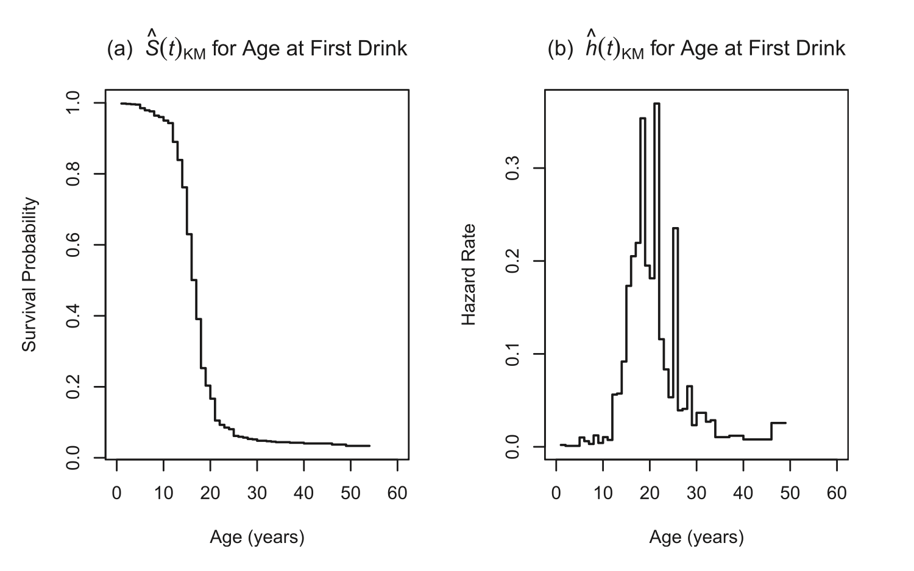
```

  
\textbf{\textcolor{blue}{Key Concept:}}  
\textcolor{blue}{The estimated hazard rate assesses conditional risk at a specific moment in time for individuals in the sample. It is defined as the rate at which individuals in the sample who have not already experienced the target event will do so in the next small interval of time. The estimated hazard function shows how the conditional risk of event occurrence changes over time for a sample of subjects.}


### College Graduation {-}

How long does it take for students to graduate from college? At what time(s) during their college career are they most likely to graduate? Perhaps you have just started college and have a few years to go, or maybe you’re planning to graduate soon. We can investigate the number of years needed to complete the requirements for a bachelor’s degree using data from individuals who participated in the National Educational Longitudinal Survey (NELS) from 1988 to 2002. To illustrate how survival analysis techniques can be used to answer these questions, we will use data on a sample of 1000 participants from the NELS data set who began college prior to the year 2000. Note that this sample includes individuals who began study at any community college or bachelor’s degree–granting postsecondary institution, even though some students who began their postsecondary education at a two-year college may not have been intending to pursue a bachelor’s degree.

The time-to-event random variable is the number of years taken to complete the requirements for a bachelor’s degree. If an individual had obtained a bachelor’s degree by the interview date, then her or his event time is complete. If the student had dropped out or had not graduated by the interview date, then her or his time is right censored.

### Activity: College Graduation {-}
Data set: `Graduate`

45. Use the software instructions provided to plot the estimated hazard rates for the college graduation data.  

46. Although the estimated hazard curve may not exhibit a distinguishable pattern, discuss some important features of the curve.  
47. Indicate periods of time during their college career when students are at their lowest and highest risk of graduating college. Does your answer match your common understanding of when students typically graduate from college?

## The Cumulative Hazard Function

The coarse nature of the estimated hazard function can make it difficult to describe or summarize how the conditional risk of event occurrence changes over time. An alternative method for assessing and describing how hazard rates change over time is to investigate the accumulation of the hazard rates over time and look for patterns in the **cumulative hazard**. The function that allows us to examine accumulated hazard over time is called the **cumulative hazard function**. By examining the cumulative hazard function, we can detect when the hazard is increasing, decreasing, or remaining relatively constant.

### Motorist Reaction Times {-}

Have you ever been frustrated because you were stuck behind a car that was stopped in front of you for no apparent reason? Did you feel inclined to honk your horn (or make some other gesture)? In a study on aggressive behavior displayed by motorists, Diekmann and his colleagues investigated the time it took for 57 motorists intentionally blocked at a green light by a Volkswagen Jetta to show signs of aggression.^12 Signs of aggression included honking their horn or beaming their headlights at the Jetta. The time-to-event variable is the time (measured in seconds to the nearest hundredth of a second) until the motorist honked (or beamed the headlights) at the Jetta. If the motorist did not honk or flash the headlights by the time the Jetta moved, then the motorist’s event time was right censored.

The Kaplan–Meier survival curve and the estimated hazard function for the motorist reaction time data are displayed in Figure 9.11. The estimated hazard function behaves erratically and displays several spikes, making it very difficult to assess how the hazard rate is changing over time.

```{r fig911, echo=FALSE, out.width="65%", fig.align="center", fig.cap="Estimated survival probabilities and estimated hazard rates for the time until the motorist displays aggressive behavior."}
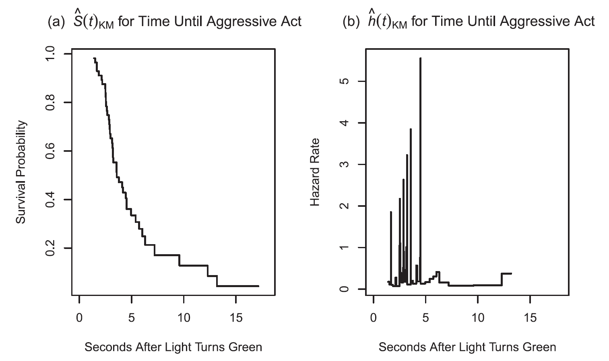
```

Similar to the survival function and hazard function, we can define a cumulative hazard function for a population and a sample. We will denote the population cumulative hazard function by $H(t)$, and the estimator of the cumulative hazard function by $\widehat H(t)_{\mathrm{KM}}$. The definition of $H(t)$ is given by

> $H(t)$ = the accumulation of the hazard rate $h(t)$ for time $T$ between 0 and $t$ for subjects in the population

A background in calculus is necessary to fully understand and appreciate the definition of the cumulative hazard function $H(t)$. We present it at the end of this section as a mathematical note. In this section we will look at the reasons for examining the cumulative hazard function, and then in Section 9.8 we will discuss computation of the estimated cumulative hazard function.

An important point to make is that the cumulative hazard function $H(t)$ is neither a probability nor a rate. It is an accumulation of (hazard) rates over time. Since $H(t)$ is cumulative, it never decreases (and rarely remains constant). Furthermore, we can gain a better idea of how hazard changes over time by examining the nature of the change in $H(t)$—that is, whether the rate of change in $H(t)$ is increasing or decreasing.

To better understand what is meant by an increase or decrease in the rate of change in $H(t)$, consider Figure 9.12. The dashed line represents the population cumulative hazard function $H(t)$, and the values of the slopes of the four solid lines represent estimates of the rates of increase in $H(t)$ over the corresponding four time periods. Observe that $H(t)$ increases over the entire range of time, but the rates of increase (the values of the four slopes) vary over the course of time. The slopes of the first three lines are decreasing, implying that the rate of change in $H(t)$ decreases until about time $t = 4$. The slope of the fourth line is greater than the previous slope, indicating that the rate of change _increases_ after time $t = 4$.

```{r fig912, echo=FALSE, out.width="60%", fig.align="center", fig.cap="Cumulative hazard function displaying various rates of change over time"}
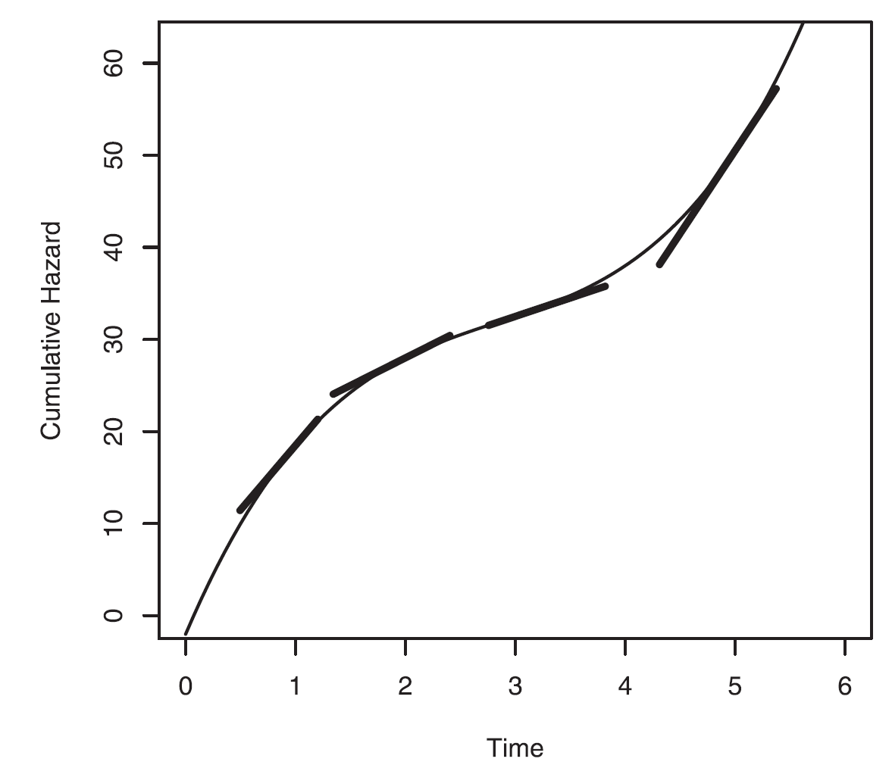
```

In general, we can examine how the rate of change in the cumulative hazard function changes over time to understand how the hazard function, $h(t)$, changes over time.

* If the _rate_ of change in $H(t)$ is _increasing_ (over an interval of time), then $h(t)$ is increasing (over the same interval of time).
* If the _rate_ of change in $H(t)$ is _decreasing_, then $h(t)$ is decreasing.  
* If the _rate_ of change in $H(t)$ is _constant_ (and greater than 0), then $h(t)$ is constant (and greater than 0).  
* If the _rate_ of change in $H(t)$ is 0, then $h(t)$ is 0.  

Figure 9.13 presents the hazard functions originally shown in Figure 9.8 and their corresponding cumulative hazard functions. We can see that if the hazard rate is constant over time [Part (a)], then the cumulative hazard function [Part (c)] will increase at a _constant_ rate—that is, there is a perfect positive linear relationship between values of t and values of H(t). If the hazard rate is increasing linearly over time [Part (b)], then the rate of change in H(t) is increasing [Part (d)].

  
>**MATHEMATICAL NOTE**
Assuming a particular probability distribution for $T$, the mathematical definition of $H(t)$ requires integral calculus and is given by
\begin{align}\label{9.16}
H(t) &= \int_{0}^{t} h(x)\,dx
\tag{9.16}
\end{align}
>In general, $H(t)$ increases as $t$ increases [$H(t)$ is constant only when $h(t) = 0$]. Also note that $H(t)$ is neither a rate nor a probability (it is an accumulation of rate over time).  


```{r fig913, echo=FALSE, out.width="80%", fig.align="center", fig.cap="Population hazard functions and their corresponding cumulative hazard functions."}
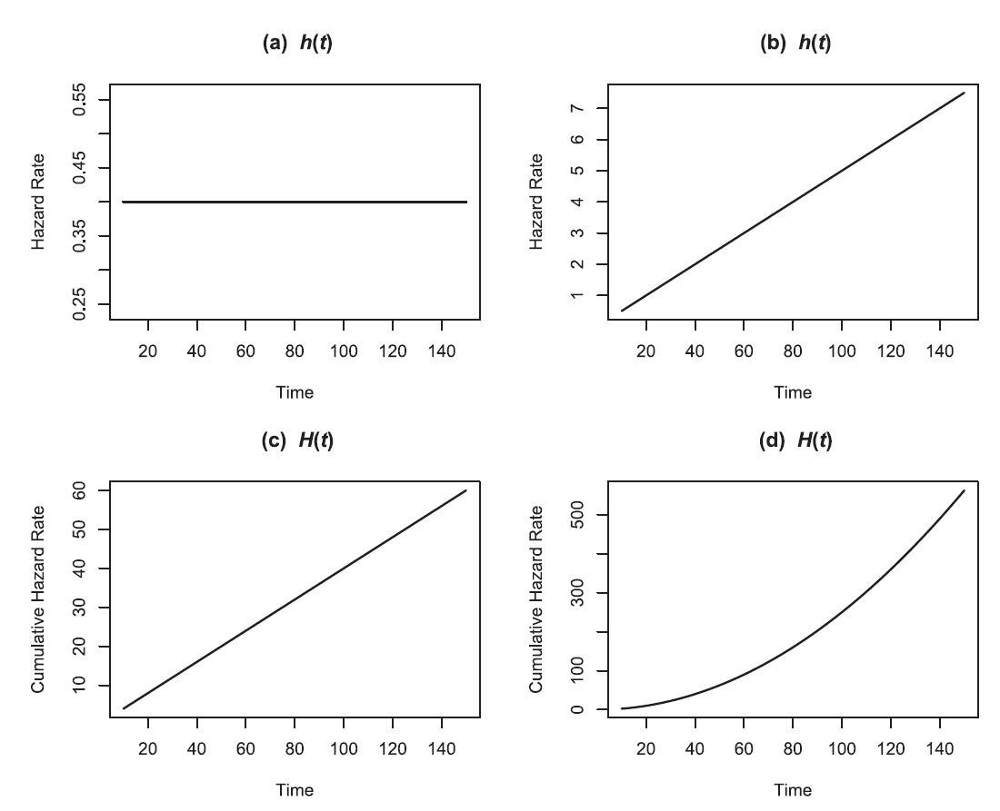
```

### Estimator of the Cumulative Hazard Function{-}

Since $H(t)$ is an accumulation of the population hazard $h(t)$ between time 0 and time $t$, it makes intuitive sense that an estimator of $H(t)$ should also accumulate (or sum up) the estimated hazard rates computed between time 0 and time $t$. This is the approach we will take.

Once again, we will start with intervals of time defined as if we were computing the Kaplan–Meier estimator. Then, given the estimated hazard rates $\hat h(t)_{\mathrm{KM}}$ for $t_i \le t < t_{i+1}$, we can calculate the total estimated hazard during each time interval $[t_i,\,t_{i+1})$ for $i = 1,\dots,m-1$, given by

\[
\text{Total estimated hazard during }[t_i,\,t_{i+1}) \;=\; \hat h(t)_{\mathrm{KM}} \times (t_{i+1} - t_i)
\]

where $\hat h(t)_{\mathrm{KM}}$ is the estimated hazard rate for $t_i \le t < t_{i+1}$ and $t_{i+1} - t_i$ is the width of the $i$th interval.  Then the Nelson–Aalen estimator of $H(t)$, denoted $\widehat H(t)_{\mathrm{NA}}$, is simply the sum of these total estimated hazard quantities up to a particular time $t$, given by

\begin{align}\label{9.17}
\widehat H(t)_{\mathrm{NA}} &= \sum_{t_i \le t} \bigl[\hat h(t)_{\mathrm{KM}}\times (t_{i+1} - t_i)\bigr]
\tag{9.17}
\end{align}

Note the following details about $\widehat H(t)_{\mathrm{NA}}$, depending on whether the last observed event time is censored
or complete:
• If the largest observed event time, denoted $t_n$, is censored, then $\widehat H(t)_{\mathrm{NA}}$ will peak (reach its highest
point) at the last complete event time, $t_m$, and then extend to tn—that is, it will be constant over the
interval [$t_m$, $t_n$) (see Figure 9.14 for example).
• Otherwise, if the last observed event time is complete, then $\widehat H(t)_{\mathrm{NA}}$ will simply reach its highest value
at the complete time, $t_m$.

```{r fig914, echo=FALSE, out.width="100%", fig.align="center", fig.cap="Estimated hazard function and estimated cumulative hazard function for the chip melting data."}
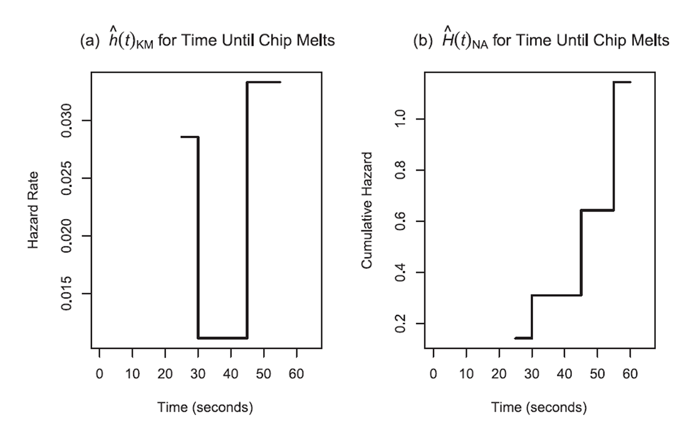
```

### Activity: Estimated Cumulative Hazard Function {-}

48. Use Equation \ref{9.17} and the quantities in Table 9.6 to compute $\widehat H(t)_{\mathrm{NA}}$ for the chip melting times from Table 9.2 by hand.  

As discussed earlier in connection with the population cumulative hazard function $H(t)$, we can also examine how the rate of change in the estimated cumulative hazard, $\widehat H(t)_{\mathrm{NA}}$, changes over time, to investigate changes in the estimated hazard function over time.

- If the _rate of change_ in $\widehat H(t)_{\mathrm{NA}}$ is _increasing_ (over an interval of time), then $\hat h(t)_{\mathrm{KM}}$ is increasing (over the same interval of time).  
- If the _rate of change_ in $\widehat H(t)_{\mathrm{NA}}$ is _decreasing_, then $\hat h(t)_{\mathrm{KM}}$ is decreasing.  
- If the _rate of change_ in $\widehat H(t)_{\mathrm{NA}}$ is _constant_ (and greater than 0), then $\hat h(t)_{\mathrm{KM}}$ is constant (and greater than 0).  
- If the _rate of change_ in $\widehat H(t)_{\mathrm{NA}}$ is 0, then $\hat h(t)_{\mathrm{KM}}$ is 0.  

Figure 9.14 displays the estimated hazard curve for the chip melting times (shown earlier in Figure 9.9) in Part (a) and the estimated cumulative hazard function in Part (b). Because of the small number of intervals, it is difficult to determine if the rate of change in $\widehat H(t)_{\mathrm{NA}}$ is increasing or decreasing.

Let’s return to the motorist reaction time data. As we’ve already seen, the estimated hazard function dis-
played several spikes, but the overall pattern was difficult to summarize. Figure 9.15 displays the estimated
hazard and cumulative hazard functions.

```{r fig915, echo=FALSE, out.width="100%", fig.align="center", fig.cap="Estimated hazard function and estimated cumulative hazard function for the aggressive motorist behavior."}
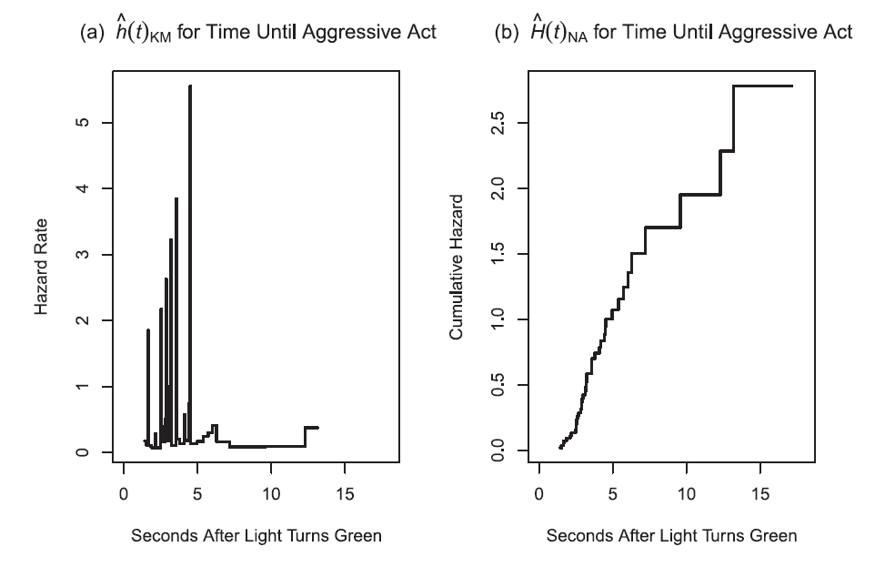
```

We can summarize the rates of increase and decrease in the estimated cumulative hazard function shown in Part (b) of Figure 9.15 and describe the changes in the estimated hazard function. The rate of
change in the estimated cumulative hazard is slowest between seconds 1.5 and 2.5 and is then followed by a higher rate of change for the next 2.5 seconds. Between the 5th and the 8th second the rate of change in
the estimated cumulative hazard decreases, and then after the 8th second the rate of change remains fairly constant. From this general description of H n(t)NA we can summarize the changes in the estimated hazard rates. Hazard increases between seconds 1.5 and 2.5, but is somewhat low, and then increases substantially between the 2.5th and the 5th second. We might consider this period of time to be the “boiling point” of frustration, when motorists who have not done so already are most likely to become impatient and decide to honk their horn or flash their high beams. Between the 5th and the 8th second, hazard decreases, afterwhich it levels  off.


\textbf{\textcolor{blue}{Key Concept:}}
\textcolor{blue}{The cumulative hazard function is a useful graphical display for describing the accumulation of hazard
over time and for showing particular time periods when risk is high.}


### Time to Rearrest for Former Inmates {-}

For 36 months, Henning and Frueh followed criminal activities of 194 inmates released from a medium security prison.$^13$ We can use the data from their study to investigate the time until the former inmates were rearrested. If the former inmate had been rearrested for a criminal act before 36 months (after initial prison release) had passed, then that former inmate’s event time is complete. If the former inmate had not been rearrested for a criminal act after 36 months had passed or had completely dropped out of the study, then that former inmate’s event time is right censored. In addition to the time until rearrest, measurements are also available on the following variables:

- *person*: a dichotomous variable identifying former inmates who had a history of person-related crimes—that is, those with one or more convictions for offenses such as aggravated assault or kidnapping  

- *property*: a dichotomous variable indicating whether former inmates had been convicted of a property-related crime  

 - *cenage*: the “centered” age of the individual—that is, the difference between the age of the individual on release and the average age of all inmates in the study  

### Extended Activity: Estimated Cumulative Hazard Function {-}

Data set: `Rearrest`

49. Use statistical software to construct the estimated hazard function and the cumulative hazard function for the time to rearrest data.  

50. The estimated hazard function will be difficult to describe, but try to explain how the risk of rearrest changes over time based on the estimated cumulative hazard function. When does the risk of being rearrested appear to be the highest? The lowest?

>**NOTE** 
In this chapter, we have focused primarily on estimating the population survival, hazard, and cumulative hazard functions based on a sample of survival times. The models that we have fit to data are sometimes referred to as **nonparametric** since we haven’t assumed anything about the shape of the distribution of the survival time random variable $T$ (e.g., whether $T$ is normally distributed). You may wonder what we can do if the distribution of $T$ is known. A class of models called **parametric models** can sometimes be used to represent the survival function, hazard function, and cumulative hazard function if we know (or have a pretty good idea about) the exact distribution of $T$ (this was mentioned briefly in the discussion of the survival function). With the exception of a few simple graphical examples and brief descriptions, our discussion of parametric models has been very limited, and we have not provided any explicit formulas for $S(t)$, $h(t)$, or $H(t)$.$^{14}$  


## Additional Types of Incomplete Data

Throughout our discussions of survival analysis techniques, we’ve assumed that any incomplete data are due to right censoring. In Section 9.2, you learned that right censoring occurs when observation of an individual begins at a defined starting time and ends before the outcome of interest is observed. In this section, we’ll describe two other censoring mechanisms, left censoring and interval censoring, and two selection processes that determine whether individuals will be included in the study, left truncation and right truncation.

### Left Censoring and Interval Censoring {-}

**Left censoring** occurs when the event of interest is known to have occurred before the study began.^[Technically, left censoring can occur after a study has started if the event of interest occurred prior to a particular recorded time. For example, a subject may experience an event of interest during the course of a study (such as contracting a disease) but not know the exact time of the event (knowing only that it occurred prior to testing positive for the disease).] For an individual with a left-censored survival time, we know that the study start time is greater than the time at which the event of interest occurred.

To see the difference between right censoring and left censoring, examine Figure 9.16. Figure 9.16 displays the target event times of four subjects. For now, we’ll assume that time is measured in months. We’ll discuss subjects 1, 3, and 4 first. Subject 1 entered the study at time 2 and experienced the target event at time 8, so subject 1 has a complete target event time of 6 months. Subject 3 entered the study at time 3, but dropped out of the study at time 7. Hence, subject 3 has a right-censored event time of 4 months. This means that subject 3’s event time is _at least_ 4 months. Finally, subject 4 entered the study at time 2 and had not experienced the event by the end of the study at time 9. Subject 4 has a right-censored event time of 7 months.

```{r fig916, echo=FALSE, out.width="80%", fig.align="center", fig.cap="Observed survival times for four subjects. X indicates the target event occurred at displayed time; O indicates the target event was not observed (event time is censored); < indicates when Subject 2 was first observed in the study."}
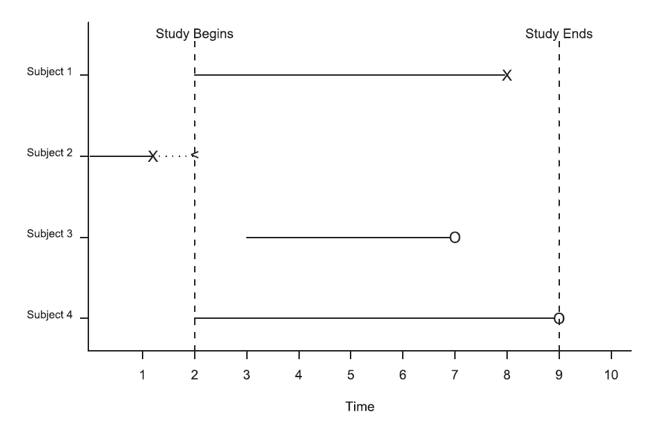
```

Subject 2 is rather interesting. Subject 2 experienced the event prior to the beginning of the study but was not observed until time 2. In other words, subject 2’s observed event time is _greater_ than her exact event time. Her event time is left censored.

**Interval censoring** occurs when the event of interest is known to have occurred between two time points, but the precise time is not known.

### Activity: Left Censoring and Interval Censoring {-}

51. **Counting to Ten** A child development researcher is interested in the age at which children first learn to count to 10. A particular child in the study was 2 years old and had already learned to count to 10 when the researcher interviewed her parents; however, the parents couldn’t remember exactly how old she was when she first counted to 10. Briefly explain why this particular child’s event time is left censored.  

52. **Type 2 Diabetes** In a study to determine whether exposure to oral contraceptives increases the risk of developing type 2 diabetes among Latina women with prior gestational diabetes mellitus (GDM), women who had recently given birth and had been previously diagnosed with GDM were screened for type 2 diabetes at intervals ranging from every three months to every year during the period of the study (1987–1994).$^{15}$ Briefly explain why the times to develop type 2 diabetes were interval censored.


\textbf{\textcolor{blue}{Key Concept:}}
\textcolor{blue}{
Left and interval censoring are two additional mechanisms that lead to incomplete observations. Left censoring occurs when the exact time an event occurred is unknown; it is known only that the event occurred prior to a particular time $t$. Interval censoring occurs when the event time is known only to have occurred between two time points.}


### Chapter Summary

The goal of this chapter was to provide an overview of time-to-event data and expose you to some introductory techniques for exploring survival data. A sample of event times can be summarized using the Kaplan–Meier curve, in conjunction with descriptive measures such as the mean and median.

The Kaplan–Meier estimator of the probability of survival beyond time $t$ is given by
\begin{align}
\hat S(t)_{\mathrm{KM}} &= \prod_{t_i \le t} \Bigl(1 - \frac{d_i}{n_i}\Bigr).
\end{align}

Other descriptive statistics can be computed for the observed event times, including the mean survival time and percentiles of survival time.  If the largest complete event time is identical to the largest observed event time, the estimator of the mean survival time is
\begin{align}
\hat \mu &= \sum_{i=0}^{m-1} \hat S(t_i)_{\mathrm{KM}}\,(t_{i+1} - t_i).
\end{align}

If the largest event time is censored, the estimator of the mean survival time is
\begin{align}
\hat \mu &= \sum_{i=0}^{m-1} \hat S(t_i)_{\mathrm{KM}}\,(t_{i+1} - t_i)
+ \hat S(t_m)_{\mathrm{KM}}\,(t_n - t_m).
\end{align}

To estimate the time at which $p\%$ of the subjects had yet to experience the target event, the $p$th percentile of survival time can be calculated as
\begin{align}
\hat t_{(p)} &= \text{smallest complete event time }t_i\text{ such that }
\hat S(t_i)_{\mathrm{KM}} \le 1 - \frac{p}{100}.
\end{align}

To provide a range of possible values for the true survival probabilities, confidence intervals based on the Kaplan–Meier estimates can be constructed for $S(t)$ at fixed points in time.  The $100(1 - \alpha)\%$ confidence interval for the survival probability $S(t)$ at fixed time $t$ is given by
\begin{align}
\hat S(t)_{\mathrm{KM}} \pm Z_{\alpha/2}\,\mathrm{se}\bigl(\hat S(t)_{\mathrm{KM}}\bigr),
\end{align}
where
\begin{align}
\mathrm{se}\bigl(\hat S(t)_{\mathrm{KM}}\bigr)
&= \sqrt{
\bigl(\hat S(t)_{\mathrm{KM}}\bigr)^2 
\sum_{t_i \le t} \frac{d_i}{n_i\,(n_i - d_i)}
}.
\end{align}

The survival experiences of two or more groups of subjects can be compared with the log-rank test or Wilcoxon test.  Given sample event times for two groups, the log-rank test statistic for comparing the survival curves for two independent populations is
\begin{align}
\chi^2 &= \frac{\Bigl(\sum_{i=1}^m d_{1i} - \sum_{i=1}^m E_{1i}\Bigr)^2}
{\sum_{i=1}^m V_{1i}}.
\end{align}

The hazard function assesses the risk that a subject will experience a target event in the next instant given that the subject has not previously experienced the event.  The estimated hazard function, constructed from a sample of event times, is given by
\begin{align}
\hat h(t)_{\mathrm{KM}} &= \frac{\hat p_i}{t_{i+1} - t_i},
\end{align}
where $\hat p_i = d_i / n_i$ is the estimated conditional probability of experiencing the event in the interval $[t_i,\,t_{i+1})$.

One drawback of the estimated hazard function is that it can exhibit a very erratic pattern, which makes summarizing the data more difficult.  An alternative function that can be used to identify periods of constant risk, as well as periods when risk is changing, is the cumulative hazard function, given by
\begin{align}
\widehat H(t)_{\mathrm{NA}}
&= \sum_{t_i \le t}
\bigl[\hat h(t_i)_{\mathrm{KM}}\,(t_{i+1} - t_i)\bigr].
\end{align}

The estimated cumulative hazard function provides the accumulation of estimated hazard up to a particular time $t$.  These formulas assume right censoring only.  If left or interval censoring or left or right truncation are present in your data, alternative methods must be used.


## Exercises
\begin{enumerate}
  \setcounter{enumi}{52}

  \item \textbf{Journal Articles.}

The \textit{Journal of the American Medical Association} has published quite a few research articles that investigate survival data. The following are some suggested articles that you might examine:
\begin{itemize}
  \item T. G. Liou, F. R. Adler, B. C. Cahill, S. C. FitzSimmons, D. Huang, J. R. Hibbs, and B. C. Marshall, ``Survival Effect of Lung Transplantation Among Patients with Cystic Fibrosis,'' \textit{Journal of the American Medical Association}, 286 (2001): 2683–2689.
  \item K. Shear, E. Frank, P. R. Houck, and C. F. Reynolds III, ``Treatment of Complicated Grief: A Randomized Controlled Trial,'' \textit{Journal of the American Medical Association}, 293 (2005): 2601–2608.
  \item M. S. Sulkowski, R. D. Moore, S. H. Mehta, R. E. Chaisson, and D. L. Thomas, ``Hepatitis C and Progression of HIV Disease,'' \textit{Journal of the American Medical Association}, 288 (2002): 199–206.
\end{itemize}

Select an article that implements survival analysis methods, and answer the following:
  \begin{enumerate}
    \item Provide a brief description of the objective of the survival analysis study.
    \item Describe the time-to-event variable and define the beginning of time. Discuss whether right censoring is present in the data. If any other types of incomplete data were used, briefly explain. (Other types of incomplete data were discussed in Section 9.9.)
    \item Describe any survival analysis techniques used in the paper that were covered in this chapter (e.g., the Kaplan-Meier estimator). Also list the names of other techniques used in the study that were not covered.
    \item Briefly summarize the results and conclusions of the study.
  \end{enumerate}

  \item Six rats were exposed to carcinogens by injecting tumor cells into their feet. The times to develop a tumor of a given size were observed. The investigator decided to terminate the experiment after 30 weeks. Rats A, B, and D developed tumors after 10, 15, and 25 weeks, respectively. Rats C and E had not developed tumors by the end of the study. Rat F died accidentally without any tumors after 19 weeks of observation.
  \begin{enumerate}
    \item Describe the time-to-event random variable.
    \item Which rats had complete event times?
    \item Which rats had censored event times? What type of censoring occurred? Be as specific as possible.
  \end{enumerate}

  \item For the studies described below:
  \begin{itemize}
    \item Describe the event of interest, beginning of time, time metric, and time-to-event random variable.
    \item State which type(s) of censoring (i.e., left, right, or interval) may be present in each study, and briefly explain your answers.
  \end{itemize}
  \begin{enumerate}
    \item Survival/sacrifice experiments are designed to determine whether a suspected agent accelerates the time until tumor onset in experimental animals. For such studies, each animal is assigned to a prespecified dose of a suspected carcinogen and then examined at sacrifice or death for the presence or absence of a tumor. Since a lung tumor is occult (detectable only by microscopic examination or chemical analysis), the time until tumor onset is not directly observable. Instead, we observe only a time of sacrifice or death.
    \item Beadle and colleagues report a study carried out to compare the cosmetic effects of radiotherapy alone versus radiotherapy and chemotherapy on women with early breast cancer.$^{18}$ To compare the two treatment regimens, a retrospective study of 46 radiation only and 48 radiation plus chemotherapy patients was made. After treatment, patients were observed initially every 4–6 months. As their recovery progressed, the interval between visits lengthened. At each visit, the clinician recorded a measure of breast retraction on a 3-point scale (none, moderate, severe). Researchers were particularly interested in moderate or severe breast retraction.
    \item A study was conducted to determine the age at which marijuana was first used among high school boys in California.$^{19}$ Researchers asked 191 high school boys the question ``When did you first use marijuana?'' Possible answers were exact age, ``I never used it,'' and ``I have used it but cannot recall just when the first time was.''
  \end{enumerate}

  \item Immediately after a heart transplant, patients are randomly assigned to two treatment therapies to improve recovery from the transplant, therapy 1 and therapy 2. The patients are then followed for up to 5 years after their surgery. Define the time-to-event random variable $T$ as the time (in months) until recovery after a heart transplant. For each of the following study descriptions that involve $T$, sketch the graph of the survival curve (or curves) with as much detail as necessary. Please note that Parts (a) through (d) are independent of each other.
  \begin{enumerate}
    \item Therapy 1 is not very effective shortly after surgery, but everybody recovers before the study period is over.
    \item Therapy 2 is very effective shortly after surgery, but becomes less effective after 3 years. Not every patient fully recovers by the end of the study period.
    \item Two curves on the same plot: Therapy 1 is consistently more effective than therapy 2 over time.
    \item Two curves on the same plot: Therapy 1 is more effective than therapy 2 for the first $2\frac{1}{2}$ years, and then therapy 2 is more effective than therapy 1 for the remaining duration of the study.
  \end{enumerate}

  \item The times in minutes required for students at a West Coast university to get ready in the morning are\\
  \hspace*{1em} $60 \quad 12 \quad 35 \quad 30+ \quad 5 \quad 20$\\
  where the $+$ denotes a right-censored time for a student who reported that he took at least 30 minutes.
  \begin{enumerate}
    \item Construct the Kaplan-Meier estimator for $S(t)$ using the observed times to get ready. Sketch a graph of the curve.
    \item Using your answer to Part (a), estimate the proportion of university students who take longer than 30 minutes to get ready.
    \item Estimate the mean time to get ready in the morning using an appropriate expression.
  \end{enumerate}

  \item The Kaplan-Meier curve in Figure 9.17 displays hypothetical estimated survival probabilities of death due to brain cancer, where time (from diagnosis) until death is measured in months.
  \begin{enumerate}
    \item Is the largest event time censored or complete? How do you know?
    \item Use the curve to estimate the mean time until death due to brain cancer.
  \end{enumerate}

```{r fig917, echo=FALSE, out.width="90%", fig.align="center", fig.cap="Kaplan-Meier curve for survival times after brain cancer diagnosis."}
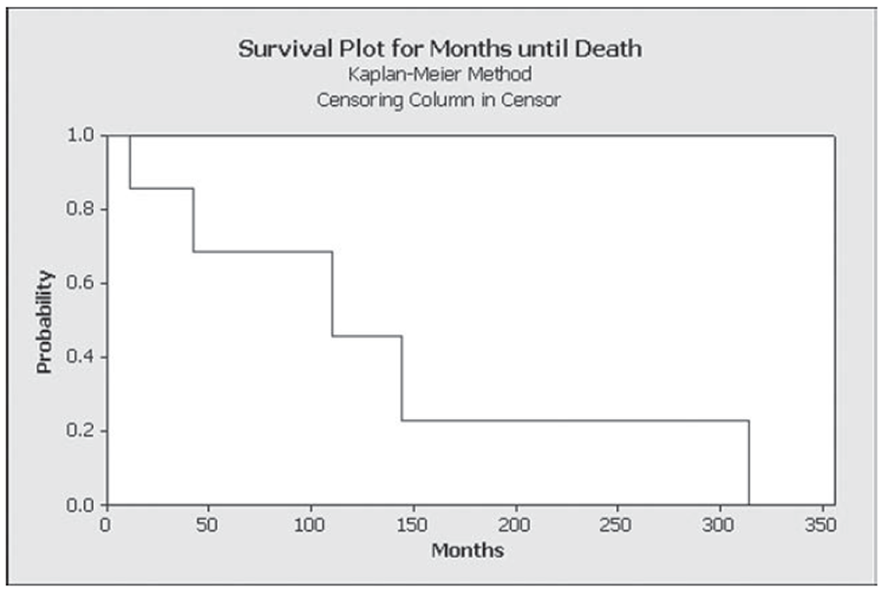
```

  \item Acute myelogenous leukemia (AML) is a cancer that starts inside bone marrow (the soft tissue inside bones that helps form blood cells). The cancer grows from cells that would normally turn into white blood cells. A clinical trial to evaluate the efficacy of maintenance chemotherapy for AML was conducted at Stanford University. After reaching a status of remission through treatment by chemotherapy, the patients who entered the study were randomly assigned to two groups; the first group received maintenance chemotherapy, and the second group did not. The objective of the study was to investigate whether maintenance chemotherapy prolonged time until relapse (measured in weeks from the time of randomization to the two groups). Table 9.7 contains quantities related to the construction of the Kaplan-Meier estimates for survival probabilities of patients with AML who received maintenance chemotherapy.
  \begin{enumerate}
    \item Fill in the remaining quantities in Table 9.7.
    \item Examine the table. How many patients in the study who received maintenance chemotherapy had censored event times?
    \item Estimate the probability that a randomly selected patient who received maintenance chemotherapy remains in remission (does not relapse) for more than 40 weeks.
    
```{r tab9.7, echo=FALSE, results='asis'}
df9.7 <- data.frame(
  `i` = 0:7,
  `Interval` = c(
    "[0, 9)", "[9, 13)", "[13, 18)", "[18, 23)",
    "[23, 31)", "[31, 34)", "[34, 48)", "[48, 161)"
  ),
  `$t_i$` = c(0, 9, 13, 18, 23, 31, 34, 48),
  `$n_i$` = c(11, 11, 10, 8, 7, 5, 4, 2),
  `$d_i$` = c(0, 1, 1, 1, 1, 1, 1, 1),
  `$n_i - d_i$` = c("", "", "", "", "", "", "", ""),
  `$\\hat{p}_i$` = c("", "", "", "", "", "", "", ""),
  `$\\hat{S}(t)_{KM}$` = c("", "", "", "", "", "", "", ""),
  check.names = FALSE,
  stringsAsFactors = FALSE
)

cat(
  kable(
    df9.7,
    format = "latex",
    booktabs = TRUE,
    caption = "Table 9.7 Quantities associated with patients with AML who received maintenance chemotherapy.",
    align = c("r", "l", rep("c", ncol(df9.7) - 2)),
    escape = FALSE
  ) %>%
  kable_styling(latex_options = "hold_position")
)
```
    \item Calculate the estimated mean time until relapse for those patients receiving maintenance chemotherapy. (Be sure to include the time metric in your answer.)
    \item Compute and interpret the estimated hazard rate $\hat{h}(t)$ for the time interval $13 \leq t < 18$.
    \item Figure 9.18 displays the Kaplan-Meier curves for the maintained and nonmaintained groups. Does it appear that maintenance chemotherapy has an effect on time until AML relapse? Briefly explain.
  \end{enumerate}

  \item Using the information in Table 9.7, answer the following:
  \begin{enumerate}
    \item Compute the standard error for the estimate of the probability that a patient receiving maintenance chemotherapy will relapse after 15 weeks.
    \item Compute and interpret a 95\% confidence interval [based on Equation \ref{9.8}] for the probability that a patient receiving maintenance chemotherapy will relapse after 15 weeks. Note that the critical value is 1.96.
    \item Suppose a doctor claims that fewer than 50\% of patients receiving maintenance chemotherapy will relapse after 15 weeks. Based on your answer to Part (b), how would you respond to this claim?
  \end{enumerate}

```{r fig918, echo=FALSE, out.width="80%", fig.align="center", fig.cap="Kaplan-Meier curves for AML relapse times for patients who did and did not receive maintenance chemotherapy."}
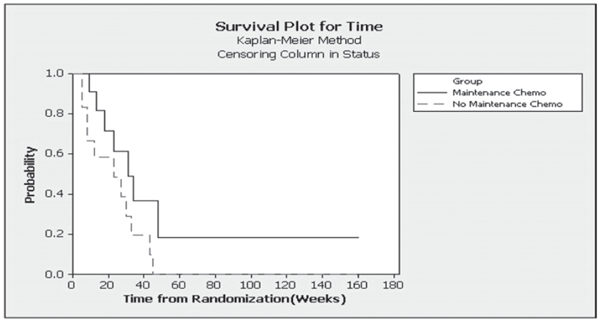
```

  \item Sketch hazard functions that would correspond to the following time-to-event random variables. (You may want to do a little background research.)
  \begin{enumerate}
    \item Lifetime of an individual measured from birth (don’t assume anything about the health or demographics of this person)
    \item Time until death after surgery to remove a cancerous tumor\\
    Be sure to label the time axis, and mark time points appropriately. Briefly explain your reasons for any changes in the shape of the hazard function over time.
  \end{enumerate}

  \item The graphs displayed in Figure 9.19 are population cumulative hazard functions for three distributions of the time-to-event random variable $T$. For each one, sketch a possible corresponding hazard function $h(t)$. Be sure to label the same time points on your sketches as are provided on the graphs of $H(t)$.

```{r fig919, echo=FALSE, out.width="80%", fig.align="center", fig.cap="Population cumulative hazard functions for three distributions of $T$"}
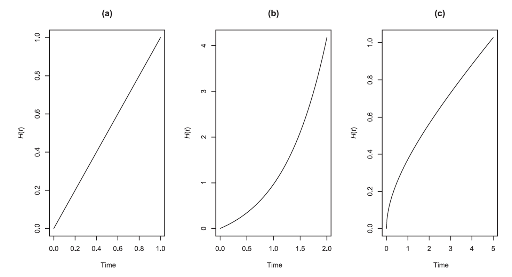
```

  \item \textbf{Male Fruit Fly Longevity}\\
  Data set: \texttt{Fruitfly}

One misconception that some students initially have about survival analysis methods is that they can be applied only to survival data that contain some censored observations. While survival analysis methods are appropriate for incomplete data, they are also perfectly acceptable for noncensored survival data. Earlier we noted that the empirical survival function and Kaplan-Meier estimator are identical when there are no censored event times.

The data set \texttt{Fruitfly}, introduced by Partridge and Farquhar and further analyzed by Hanley and Hanley and Shapiro,$^{20}$ was originally analyzed for the purpose of investigating the relationship between increased sexual activity of male fruitflies and longevity of life (in days) using regression and analysis of covariance techniques. However, survival analysis methods can also be used to study the life durations of male and female fruit flies. Brief descriptions of the variables are provided below:
\begin{itemize}
  \item Partners: number of companions (0, 1, or 8)
  \item Type: type of companion (0 = newly pregnant female, 1 = virgin female, 9 = not applicable (when Partners = 0))
  \item Longevity: lifespan, in days (This is the time-to-event variable.)
  \item Thorax: length of thorax in mm
  \item Sleep: percentage of each day spent sleeping
  \item Censor: censoring status (Note that this variable takes only value 1, since the data are all complete. A censoring status variable is necessary for software implementation.)
\end{itemize}
  \begin{enumerate}
    \item Construct the Kaplan-Meier curve with a confidence interval for the \texttt{Fruitfly} data and describe the survival pattern for the fruitflies over time. Use \texttt{Longevity} as the time-to-event variable.
    \item Construct the Kaplan-Meier curves for the lifetimes of the fruitflies by number of partners, using \texttt{Partners} as the grouping variable. Briefly comment on the observed relationship between survival and number of female partners.
    \item Perform the log-rank and Wilcoxon tests. Report the test statistics and $p$-values for both tests. State the conclusions for both tests. If the tests yield different conclusions, briefly explain why.
  \end{enumerate}

  \item \textbf{Veterans Administration (VA) Lung Cancer Study}\\
  Data set: \texttt{Veteran}

The U.S. Veterans Administration lung cancer trial studied 137 males with advanced inoperable lung cancer. The subjects were randomly assigned to either a standard chemotherapy treatment or a test chemotherapy treatment. Several additional variables were also measured on the subjects. The data in the file \texttt{Veteran} have been investigated in Kalbfleisch and Prentice.$^{21}$ A brief description of the variables is provided below:
\begin{itemize}
  \item trt: 1 = standard chemotherapy, 2 = test chemotherapy
  \item celltype: 1 = squamous, 2 = smallcell, 3 = adeno, 4 = large
  \item time: survival time in days
  \item status: censoring status (1 = complete, 0 = censored)
  \item karno: Karnofsky performance scale index score (100 = good) (This score is used to quantify cancer patients’ functional impairment. The Karnofsky performance score is measured on a 0–100 scale in increments of 10, with 0 indicating that the subject is dead and 100 indicating that the subject shows no signs of the disease.)
  \item diagtime: months from diagnosis to randomization
  \item age: in years
  \item prior: prior therapy (0 = no, 1 = yes)
\end{itemize}
  \begin{enumerate}
    \item Create a graph with both Kaplan-Meier curves to compare the survival time (use the variable \texttt{time}) for subjects with the standard and the test chemotherapy treatment. What do you observe about the survival probabilities for the two groups of subjects?
    \item Conduct the log-rank test and the Wilcoxon test to compare the survival curves of both treatment groups. Interpret the results.
    \item It may be beneficial to incorporate health as a variable in the analysis. Patients with low Karnofsky scores are less healthy than patients with high Karnofsky scores. Create four groups with the \texttt{Veteran} data: \texttt{trt = 1} and Karnofsky score low, \texttt{trt = 1} and Karnofsky score high, \texttt{trt = 2} and Karnofsky score low, and \texttt{trt = 2} and Karnofsky score high. Recall that it is often best to keep sample sizes as equivalent as possible when you determine what is a low or high Karnofsky score. Create a Kaplan-Meier curve for each of the four groups. Conduct the log-rank test and the Wilcoxon test to compare the survival curves of the four groups. (While we have only discussed using these tests to compare two groups, they can easily be extended to more than two groups.) Did incorporating health into your analysis impact your conclusions?
  \end{enumerate}

  \item \textbf{Motorist Reaction Times Revisited}\\
  Data set: \texttt{Hornhonk}

Consider the motorist reaction time data introduced in Section 9.8.
  \begin{enumerate}
    \item Construct the Kaplan-Meier curve with a confidence interval for the \texttt{Hornhonk} data and describe the survival pattern over time.
    \item Estimate the mean and median time until the motorist honked. At what time would you estimate that at least 40\% of motorists will honk?
  \end{enumerate}

  \item \textbf{College Graduation Revisited}\\
  Data set: \texttt{Graduate}

Consider the college graduation data introduced in Section 9.7.
  \begin{enumerate}
    \item Create a plot and compare the survival experiences to investigate whether there are differences in the time required to obtain a bachelor’s degree by gender. What do you observe about the survival probabilities of the genders?
    \item Conduct the log-rank test and the Wilcoxon test to compare the survival curves of the two genders. Interpret the results.
    \item (R software is suggested for this problem.) Plot and examine the estimator of the cumulative hazard function. Discuss the changes in the rate of change of $\widehat{H}(t)_{\mathrm{NA}}$ as each of the following time periods passes, and discuss corresponding changes in the hazard rate of graduation as college students move from one time interval to another.
      \begin{itemize}
        \item 0–3.75 years
        \item 3.75–4.75 years
        \item $>$4.75 years
      \end{itemize}
  \end{enumerate}

  \item \textbf{Time to Rearrest Revisited}\\
  Data set: \texttt{Rearrest}

Consider the time to rearrest data introduced in Section 9.8.
  \begin{enumerate}
    \item Create a Kaplan-Meier curve with a confidence interval for the time until rearrest variable. Describe any patterns you see.
    \item Estimate the time at which half the released inmates have been rearrested.
    \item Do people with property crimes, person crimes, or both have a longer time before rearrest? You will need to create a new variable to answer this question. Use the new variable to create Kaplan-Meier curves as well as conduct the log-rank test and the Wilcoxon test. Interpret the results.
    \item (R software is suggested for this problem.) Plot the estimated hazard function (Kaplan-Meier type) for all the time-to-event data. (Include this graph in your assignment. You can copy and paste R graphs into Word documents.) What do you observe? (Don’t worry about providing an interpretation. Just give your overall impression of the curve.)
    \item (R software is suggested for this problem.) Plot and examine the Nelson-Aalen estimator of the cumulative hazard function. (Include this graph in your assignment.) Discuss the changes in the rate of change of $\widehat{H}(t)$ as each of the following time periods passes:
      \begin{itemize}
        \item 0–3.5
        \item 0–3.5 months
        \item 3.5–8 months
        \item 8–11 months
        \item 11–20 months
        \item $>$20 months
      \end{itemize}
    \item[] Also discuss corresponding changes in the estimated hazard as former inmates move from one time interval to another.
  \end{enumerate}

\end{enumerate}

### Endnotes{-}

\begin{enumerate}

\item “The Future of Data Analysis,” \textit{Annals of Mathematical Studies}, 33.1 (1962): 13.
\item See T. A. Stortz and A. G. Marangoni, “Heat Resistant Chocolate,” \textit{Trends in Food Science and Technology}, 2011.
\item $\widehat{\text{Var}}(\widehat{S}(t)_{KM})$ is commonly referred to as \textit{Greenwood’s formula}. See M. Greenwood, “The Natural Duration of Cancer,” \textit{Reports on Public Health and Medical Subjects}, 33 (1926): 1–26.
\item For alternative confidence interval expressions with limits inside [0, 1], see D. W. Hosmer, S. Lemeshow, and S. May, \textit{Applied Survival Analysis: Regression Modeling of Time to Event Data}, 2nd ed. (New York: Wiley, 2008).
\item For details on confidence bands for $S(t)$, see J. P. Klein and M. L. Moeschberger, \textit{Survival Analysis: Techniques for Censored and Truncated Data}, 2nd ed. (New York: Springer, 2003).
\item Interested readers are referred to textbooks that discuss \textit{contingency table} analysis—for example, W.J. Conover, \textit{Practical Nonparametric Statistics}, 3rd ed. (New York: Wiley, 1999).
\item For details, see R. Latta, “A Monte Carlo Study of Some Two-Sample Rank Tests with Censored Data,” \textit{Journal of the American Statistical Association}, 76 (1981): 713–719.
\item If you are interested in the mathematical details of the log-rank test, Wilcoxon test, and additional tests to compare survival experiences, see J. P. Klein and M. L. Moeschberger, \textit{Survival Analysis: Techniques for Censored and Truncated Data}, 2nd ed. (New York: Springer, 2003).
\item For details on the log-rank and Wilcoxon tests for more than two groups, see, for example, D. W. Hosmer, S. Lemeshow, and S. May, \textit{Applied Survival Analysis: Regression Modeling of Time to Event Data}, 2nd ed. (New York: J. Wiley, 2008).
\item Students currently interested in reading more about regression models for survival data can consult D. W. Hosmer, S. Lemeshow, and S. May, \textit{Applied Survival Analysis: Regression Modeling of Time to Event Data}, 2nd ed. (New York: Wiley, 2008).
\item Readers interested in the calculation and derivation of $h(t)$ for various distributions of $T$ can consult a more mathematically oriented survival analysis textbook, such as J. P. Klein and M. L. Moeschberger, \textit{Survival Analysis: Techniques for Censored and Truncated Data}, 2nd ed. (New York: Springer, 2003).
\item See A. Diekmann, M. Jungbauer-Gans, H. Krassnig, and S. Lorenz, “Social Status and Aggression: A Field Study Analyzed by Survival Analysis,” \textit{Journal of Social Psychology}, 136 (1996): 761–768.
\item See K. Henning and C. Frueh, “Cognitive Behavioral Treatment of Incarcerated Offenders,” \textit{Criminal Justice and Behavior}, 23 (1996): 523–541.
\item The level of mathematics required for adequate coverage of parametric methods is outside the scope of this book, but for an accessible discussion see M. Tableman and J. S. Kim, \textit{Survival Analysis Using S: Analysis of Time-to-Event Data} (Boca Raton: Chapman \& Hall, 2004).
\item See S. L. Kjos, R. K. Peters, A. Xiang, D. Thomas, U. Schaefer, and T. A. Buchanan, “Contraception and the Risk of Type 2 Diabetes Mellitus in Latina Women with Prior Gestational Diabetes Mellitus,” \textit{Journal of the American Medical Association}, 280 (1998): 533–538.
\item See H. Panjer, “Mortality Differences by Handedness: Survival Analysis of a Right Truncated Sample of Baseball Players,” \textit{Transactions of the Society of Actuaries}, 45 (1993): 257–274.
\item Adapted from J. P. Klein and M. L. Moeschberger, \textit{Survival Analysis: Techniques for Censored and Truncated Data}, 2nd ed. (New York: Springer, 2003), p. 16.
\item See G. F. Beadle, S. Come, C. Henderson, B. Silver, and S. A. H. Hellman, “The Effect of Adjuvant Chemotherapy on the Cosmetic Results After Primary Radiation Treatment for Early Stage Breast Cancer,” \textit{International Journal of Radiation Oncology, Biology, and Physics}, 10 (1984): 2131–2137; G. F. Beadle, J. R. Harris, B. Silver, L. Botnick, and S. A. H. Hellman, “Cosmetic Results Following Primary Radiation Therapy for Early Breast Cancer,” \textit{Cancer}, 54 (1984): 2911–2918.
\item See B. W. Turnbull, and L. Weiss, “A Likelihood Ratio Statistic for Testing Goodness of Fit with Randomly Censored Data,” \textit{Biometrics}, 34 (1978): 367–375.
\item L. Partridge and M. Farquhar, “Sexual Activity and the Lifespan of Male Fruitflies,” \textit{Nature}, 294 (1981): 580–581; J. A. Hanley, “Appropriate Uses of Multivariate Analysis,” \textit{Annual Review of Public Health}, 4 (1983): 155–180; and J. A. Hanley and S. H. Shapiro, “Sexual Activity and the Lifespan of Male Fruitflies: A Data set That Gets Attention,” \textit{Journal of Statistics Education}, 2 (1994).
\item J. D. Kalbfleisch and R. L. Prentice, \textit{The Statistical Analysis of Failure Time Data}, 2nd ed. (New York: Wiley, 2002).
\item J. Theios, “Reaction Time Measurements in the Study of Memory Processes,” in H. Bower (ed.), \textit{The Psychology of Learning and Motivation} (New York: Academic Press, 1973), pp. 44–85.
\item R. G. Pachella, “The Interpretation of Reaction Time in Information-Processing Research, in B. H. Kantowitx (ed.), \textit{Human Information Processing—Tutorials in Performance and Cognition} (Hillsdale, NJ: Erlbaum, 1974), pp. 41–82.

\end{enumerate}


<!--chapter:end:07-Survival.Rmd-->

