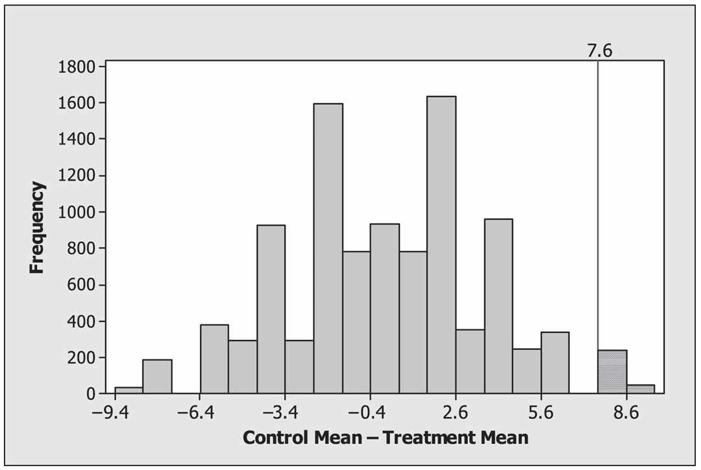
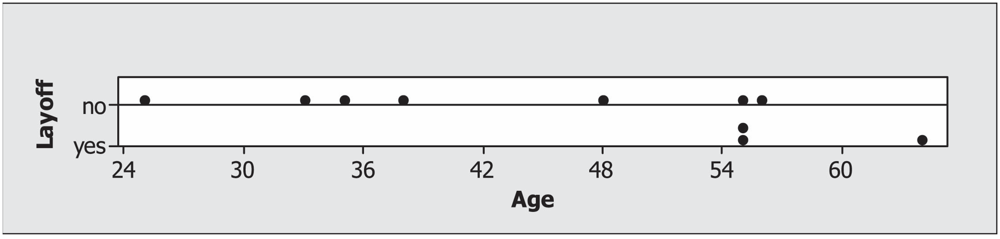
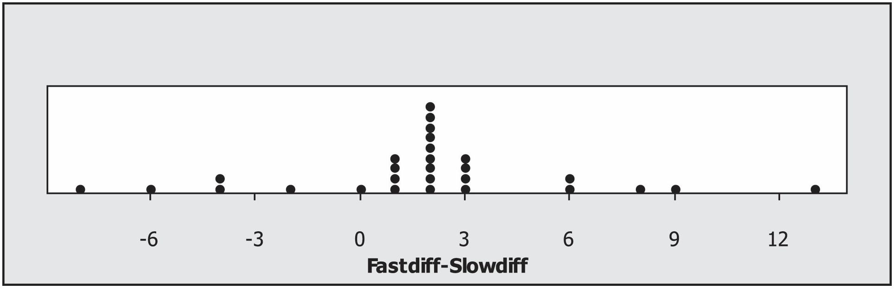

```{r setup, include=FALSE}
library(learnr)
library(tidyverse)
knitr::opts_chunk$set(echo = FALSE)
tutorial_options(exercise.timelimit = 60)

set.seed(2024)

# --- Schistosomiasis worm-count data ---------------------------------------
# Female group means (12.0 control, 4.4 treatment) match the reported study
# summary statistics; male values are illustrative data with the same design.
mice_worms <- tibble(
  sex   = rep(c("Female", "Male"), each = 10),
  group = rep(rep(c("Control", "Treatment"), each = 5), times = 2),
  worms = c(
    8, 10, 12, 14, 16,   # Female control    (mean 12.0)
    2, 3, 4, 5, 8,       # Female treatment  (mean 4.4)
    9, 11, 13, 15, 17,   # Male control
    4, 5, 6, 7, 9        # Male treatment
  )
)

# --- Age-discrimination layoff data -----------------------------------------
age_layoffs <- tibble(
  age      = c(25, 33, 35, 38, 48, 55, 55, 55, 56, 64),
  laid_off = c(FALSE, FALSE, FALSE, FALSE, FALSE, TRUE, TRUE, FALSE, FALSE, TRUE)
)

# --- Music / pulse-rate matched-pairs data ----------------------------------
music_pulse <- tibble(
  subject = 1:28,
  diff    = round(rnorm(28, mean = 1.857, sd = 5), 1)  # Fastdiff - Slowdiff
)
```

## Introduction

<div style="text-align: right;">
*Using statistics is no substitute for thinking about the problem*<br>
- Douglas Montgomery^1^
</div>

Randomization tests, permutation tests, and bootstrap methods are quickly gaining popularity as methods for conducting statistical inference. Why? These nonparametric methods require fewer assumptions and provide results that are often more accurate than those from traditional techniques using well-known distributions (such as the normal, t, or F distribution). These methods are based on computer simulations instead of distributional assumptions and thus are particularly useful when the sample data are skewed or if the sample size is small. In addition, nonparametric methods can be extended to other parameters of interest, such as the median or standard deviation, while the well known parametric methods described in introductory statistics courses are often restricted to just inference for the population mean.

We begin this chapter by comparing two treatments for a potentially deadly disease called Schistosomiasis (shis-tuh-soh-mahy-uh-sis). We illustrate the basic concepts behind nonparametric methods by using randomization tests to:

*	Provide an intuitive description of statistical inference.
*	Conduct a randomization test by hand
*	Use software to conduct a randomization test
*	Compare one-sided and two-sided hypothesis tests
*	Making connections between randomization tests and conventional terminology

After working through the schistosomiasis investigation, you will have the opportunity to analyze several other data sets using randomization tests, permutation tests, bootstrap methods, and rank-based nonparametric tests.

> **TUTORIAL NOTE:** All data in this tutorial are simulated directly in R — there are no external files to download, so every exercise runs entirely inside this sandbox. The tutorial data frames stand in for the chapter's data sets as follows: `mice_worms` (Mice), `age_layoffs` (Age), and `music_pulse` (Music).

This is **Part 1A**, covering randomization and permutation tests. Bootstrap methods, rank-based tests, and multiple comparisons are in **Part 1B**.

## Investigation: Can a New Drug Reduce the Spread of Schistosomiasis?

Schistosomiasis is a disease occurring in humans caused by parasitic flatworms called schistosomes (skis’-tuh-sohms). Schistosomiasis affects about 200 million people worldwide and is a serious problem in sub-Saharan Africa, South America, China, and Southeast Asia. The disease can cause death, but more commonly results in chronic and debilitating symptoms, arising primarily from the body’s immune reaction to parasite eggs lodged in the liver, spleen, and intestines.

Currently there is one drug, praziquantel (prā'zĭ-kwän'těl'), in common use for treatment of schistosomiasis; it is cheap and effective. However, many organizations are worried about relying on a single drug to treat a serious disease which affects so many people worldwide. Drug resistance may have prompted a 1990s outbreak in Senegal, where cure rates were low. In 2007, several researchers published work involving a promising drug called K11777 that, in theory, might also treat schistosomiasis.

In this chapter, we will analyze data from this study where the researchers wanted to find out whether K11777 helps to stop schistosome worms from growing. In one phase of the study, 10 female laboratory mice and 10 male laboratory mice were deliberately infected with the schistosome parasite. Seven days after being infected with schistosomiasis, each mouse was given injections every day for 28 days. Within each sex, 5 mice were randomly assigned to a treatment of K11777 whereas the other 5 mice formed a control group injected with an equal volume of plain water. At day 49, the researchers euthanized the mice and measured both the number of eggs and the numbers of worms in the mice livers. Both numbers were expected to be lower if the drug was effective.

Table 1.1 gives the worm count for each mouse. An individual value plot of the data is shown in Figure 1.1. Notice that the treatment group has fewer worms than the control group for both females and males.

```{r table1, echo=FALSE}
mice_worms %>%
  group_by(sex, group) %>%
  mutate(mouse = row_number()) %>%
  ungroup() %>%
  select(mouse, sex, group, worms) %>%
  pivot_wider(names_from = c(sex, group), values_from = worms, names_sep = " ") %>%
  select(-mouse) %>%
  knitr::kable(caption = "Table 1.1: Worm count data for the schistosomiasis study.")
```

```{r graph1, echo=FALSE, fig.height=3, fig.width=5, fig.cap="Figure 1.1: Individual value plot of the worm count data"}
ggplot(mice_worms, aes(x = sex, y = worms, fill = group, shape = group)) +
  geom_dotplot(
    binaxis = "y", stackdir = "center", stackgroups = TRUE,
    binpositions = "all", position = position_dodge(width = 0.6),
    dotsize = 2, binwidth = 1
  ) +
  labs(x = "Sex", y = "Worm Count", fill = "Type", shape = "Type") +
  scale_fill_manual(values = c("Treatment" = "lightyellow", "Control" = "blue")) +
  theme_minimal()
```

> **NOTE:**
There is a difference between individual value plots and dotplots. In dotplots (such as Figures 1.3 and 1.4 shown later in this chapter), each observation is represented by a dot along a number line (x-axis). When values are close or the same, the dots are stacked. Dotplots can be used in place of histograms when the sample size is small. Individual value plots, as shown in Figure 1.1, are used to simultaneously display each observation for multiple groups. They can be used instead of boxplots to identify outliers and distribution shape, especially when there are relatively few observations.

### Practice: Describing the Data

**1.** Use Figure 1.1 to visually compare the number of worms for the treatment and control groups for both the male and the female mice. Does each of the four groups appear to have a similar center and a similar spread? Are there any outliers (extreme observations that don’t seem to fit with the rest of the data)?

Recreate Figure 1.1 below, then answer Question 1 from the plot.

```{r sec1_ex2, exercise = TRUE}
ggplot(mice_worms, aes(x = ___, y = ___, color = ___)) +
  geom_jitter(width = 0.1, height = 0, size = 3) +
  labs(x = "Sex", y = "Worm count", color = "Group") +
  theme_minimal()
```

```{r sec1_ex2-solution}
ggplot(mice_worms, aes(x = sex, y = worms, color = group)) +
  geom_jitter(width = 0.1, height = 0, size = 3) +
  labs(x = "Sex", y = "Worm count", color = "Group") +
  theme_minimal()
```

**2.** Calculate appropriate summary statistics (e.g., the median, mean, standard deviation, and range) for each of the four groups. For the female mice, calculate the difference between the treatment and control group means. Do the same for the male mice.

```{r sec1_ex1, exercise = TRUE}
mice_worms %>%
  group_by(___, ___) %>%
  summarize(
    mean_worms   = ___,
    sd_worms     = ___,
    median_worms = ___,
    min_worms    = ___,
    max_worms    = ___,
    .groups = "drop"
  )
```

```{r sec1_ex1-hint}
# group_by() takes the two grouping columns; summarize() takes one
# expression per summary statistic, e.g. mean(worms), sd(worms), ...
```

```{r sec1_ex1-solution}
mice_worms %>%
  group_by(sex, group) %>%
  summarize(
    mean_worms   = mean(worms),
    sd_worms     = sd(worms),
    median_worms = median(worms),
    min_worms    = min(worms),
    max_worms    = max(worms),
    .groups = "drop"
  )
```

```{r sec1-quiz}
quiz(
  question(
    "Based on the summary statistics and plot, which group tends to have fewer worms?",
    answer("Control", message = "Look again at the means — treatment mice have lower counts."),
    answer("Treatment", correct = TRUE),
    answer("They look about the same"),
    allow_retry = TRUE
  ),
  question(
    "With only 5 mice per group, is it safe to rely on the Central Limit Theorem to assume the sample mean is normally distributed?",
    answer("Yes, 5 is always large enough"),
    answer("No — sample sizes this small are far below what the CLT usually requires", correct = TRUE),
    allow_retry = TRUE
  )
)
```

The descriptive analysis in Questions 1 and 2 points to a positive treatment effect: K11777 appears to have reduced the number of parasitic worms in this sample. But descriptive analysis is usually only the first step in ascertaining whether an effect is real; we often conduct a significance test or create a confidence interval to determine if chance alone could explain the effect.

Most introductory statistics courses focus on hypothesis tests that involve using a normal, t-, chi-square or F-distribution to calculate the $p$-value. These tests are often based on the central limit theorem. In the schistosomiasis study, there are only five observations in each group. This is a much smaller sample size than is recommended for the central limit theorem, especially given that Figure 1.1 indicates that the data may not be normally distributed. Since we cannot be confident that the sample averages are normally distributed, we will use a distribution-free test, also called a nonparametric test. Such tests do not require
the distribution of our sample statistic to have any specific form and are often useful in studies with very small sample sizes.

> **MATHEMATICAL NOTE:** For any population with mean $\mu$ and finite standard deviation $\sigma$, the **central limit theorem** states that the sample mean $\bar{x}$ from an independent and identically distributed sample tends to follow the normal distribution if the sample size is large enough. The mean of $\bar{x}$ is the same as the population mean, $\mu$, while the standard deviation of $\bar{x}$ is $\sigma / \sqrt{n}$, where $n$ is the sample size.

We will use a form of nonparametric statistical inference known as a randomization hypothesis test to analyze the data from the schistosomiasis study. **Randomization hypothesis tests** are significance tests that simulate the random allocation of units to treatments many times in order to determine the likelihood of observing an outcome at least as extreme as the one found in the actual study.

> **Key Concept:** **Parametric tests** (such as $z$-tests, $t$-tests, or $F$-tests) assume that data come from a population that follows a probability distribution or use the central limit theorem to make inferences about a population. **Nonparametric tests** (such as randomization tests) do not require assumptions about the distribution of the population or large sample sizes in order to make inferences about a population.

We will introduce the basic concepts of randomization tests in a setting where units (mice in this example) are randomly allocated to a treatment or control group. Using a significance test, we will decide if an observed treatment effect (the observed difference between the mean responses in the treatment and control) is “real” or if “random chance alone” could plausibly explain the observed effect. The null hypothesis states that “random chance alone” is the reason for the observed effect. In this initial discussion, the alternative hypothesis will be one-sided because we want to show that the true treatment mean ($\mu_{treatment}$) is less than the true control mean ($\mu_{control}$). Later, we will expand the discussion to consider modifications needed to deal with two-sided alternatives.

## Statistical Inference Through a Randomization Test

Whether they take the form of significance tests or confidence intervals, inferential procedures rest on the fundamental question for inference: “What would happen if we did this many times?” Let’s unpack this question in the context of the female mice in the schistosomiasis study. We observed a difference in means of 7.6 = 12.00 - 4.40 worms between control and treatment groups. While we expect that this large difference reflects the effectiveness of the drug, it is possible that chance alone could explain this difference. The “chance alone” position is usually called the null hypothesis and includes the following assumptions:

* The number of parasitic worms found in the liver naturally varies from mouse to mouse.
* Whether or not the drug is effective, there clearly is variability in the responses of mice to the infestation of schistosomes.
* Each group exhibits this variability, and even if the drug is not effective, some mice do better than others.
* The only explanation for the observed difference of 7.6 worms in the means is that the random
allocation randomly placed mice with larger numbers of worms in the control group and mice with
smaller numbers of worms in the treatment group.

In this study, the **null hypothesis** is that the treatment has no effect on the average worm count, and it is denoted as

<div style="text-align: center;">
$H_0$: $\mu_{control}$ = $\mu_{treatment}$
</div>

Another way to write this null hypothesis is

<div style="text-align: center;">
$H_0$: the treatment has no effect on average worm count
</div>

The research hypothesis (the treatment causes a reduction in the average worm count) is called the **alternative hypothesis** and is denoted $H_a$ (or  $H_1$). For example,

<div style="text-align: center;">
$H_a$: $\mu_{\text{control}}$ > $\mu_{\text{treatment}}$
</div>

Another way to write this alternative hypothesis is

<div style="text-align: center;">
$H_a$: the treatment reduces the average worm count
</div>

Alternative hypotheses can be “one-sided, greater than” (as in this investigation), “one-sided, less-than” (the treatment causes an increase in worm count), or “two-sided” (the treatment mean is different, in one direction or the other, from the control mean). We chose to test a one-sided hypothesis because there is a clear research interest in one direction. In other words, we will take action (start using the drug) only if we can show that K11777 reduces the worm count.

> **Key Concept:** **The fundamental question for inference**: Every statistical inference procedure (parametric or nonparametric) is based on the question “How does what we observed in our data compare to what would happen if the null hypothesis were actually true and we repeated the process many times?” For a randomization test comparing responses for two groups, this question becomes “How does the observed difference between groups compare to what would happen if the treatments actually had no effect on the individual responses and we repeated the random allocation of individuals to groups many times?”

### Practice: Conducting a Randomization Test by Hand

**3.** To get a feel for the concept of a $p$-value, write each of the female worm counts on an index card. Shuffle the 10 index cards, and then draw five cards at random (without replacement). Call these five cards the treatment group and the five remaining cards the control group. Under the null hypothesis (i.e. the treatment has no effect on worm counts), this allocation mimics precisely what actually happened in our experiment, since the only cause of group differences is the random allocation. Calculate the mean of the five cards representing the treatment group and the mean of the five cards representing the control group. Then find the difference between the control and treatment group means that you obtained in your allocation. To be consistent, take the control group mean minus the treatment group mean. Your work should look similar to the following simulation:

```{r graph_CT, echo=FALSE, out.width="80%", fig.align="center"}
knitr::include_graphics("images/Fig1_CT.png")
```

```{r sec2_ex1, exercise = TRUE}
female_worms <- mice_worms %>%
  filter(sex == "Female") %>%
  pull(worms)

set.seed(1)
shuffled <- ___(female_worms)      # randomly shuffle the 10 counts

sim_treatment <- shuffled[1:5]
sim_control   <- shuffled[6:10]

sim_diff <- mean(sim_control) - mean(sim_treatment)
sim_diff
```

```{r sec2_ex1-hint}
# sample(x) with no `size` argument returns a random permutation of x.
```

```{r sec2_ex1-solution}
female_worms <- mice_worms %>%
  filter(sex == "Female") %>%
  pull(worms)

set.seed(1)
shuffled <- sample(female_worms)

sim_treatment <- shuffled[1:5]
sim_control   <- shuffled[6:10]

sim_diff <- mean(sim_control) - mean(sim_treatment)
sim_diff
```

**4.** If you were to do another random allocation, would you get the same difference in means? Explain.

**5.** Now, perform nine more random allocations, each time computing and writing down the difference in mean worm count between the control group and the treatment group. Make a dotplot of the 10 differences. What proportion of these differences are 7.6 or larger?

**6.** If you performed the simulation many times, would you expect a large percentage of the simulations to result in a mean difference greater than 7.6? Explain.

```{r sec2-quiz}
quiz(
  question(
    "If you ran the random allocation again with a different shuffle, would you expect the exact same difference in means?",
    answer("Yes, it should always be 7.6"),
    answer("No — each random allocation will typically give a different difference", correct = TRUE),
    allow_retry = TRUE
  ),
  question(
    "What does the null hypothesis assume is the *only* source of the observed group difference?",
    answer("A true biological effect of the drug"),
    answer("The random allocation of mice to groups", correct = TRUE),
    answer("Measurement error"),
    allow_retry = TRUE
  )
)
```

The reasoning in the previous activity leads us to the randomization test and an interpretation of the fundamental question for inference. The fundamental question for this context is as follows: “If the null hypothesis were actually true and we randomly allocated our 10 mice to treatment and control groups many times, what proportion of the time would the observed difference in means be as big as or bigger than 7.6?”

> **Key Concept:** Assuming that nothing except the random allocation process is creating group differences, the $p$-value of a randomization test is the probability of obtaining a group difference as large as or larger than the group difference actually observed in the experiment.

This long-run proportion is a probability that statisticians call the **$p$-value** of the randomization test. The $p$-values for most randomization tests are found through simulations. Despite the fact that simulations do not give exact $p$-values, they are usually preferred over the tedious and time-consuming process of listing all possible outcomes. Researchers usually pick a round number such as 10,000 repetitions of the simulation and approximate the $p$-value accordingly. Since this $p$-value is an approximation, it is often referred to as the **empirical $p$-value**.

> **Key Concept:** The calculation of an empirical $p$-value requires these steps:
>
> * Repeat the random allocation process a number of times (N times).
> * Record, each time, whether or not the group difference exceeds or is the same as the one observed in the actual experiment (let X be the number of times the group difference exceeds or is the same as the one observed).
> * Compute X/N to get the $p$-value, the proportion of times the difference exceeds or is the same as the observed difference.

> **NOTE:** Many researchers include the observed value as one of the possible outcomes. In this case, N = 9999 iterations are typically used and the $p$-value is calculated as (X + 1)/(9999 + 1). The results are very similar whether X/10,000 or (X + 1)/(9999 + 1) is used. Including the observed value as one of the possible allocations is a more conservative approach and protects against getting a $p$-value of 0. Our observation from the actual experiment provides evidence that the true $p$-value is greater than zero.

## Performing a Randomization Test Using a Computer Simulation

While physical simulations (such as the index cards activity) help us understand the process of computing an empirical $p$-value, using computer software is a much more efficient way of producing an empirical $p$-value based on a large number of iterations. If you are simulating 10 random allocations, it is just as easy to use index cards as a computer. However, the advantage of a computer simulation is that 10,000 random allocations can be conducted in almost the same amount of time it takes to simulate 10 allocations. In the following steps, you will develop a program to calculate an empirical $p$-value.

### Practice: Using Computer Simulations to Conduct a Hypothesis Test

**7.** Use the technology instructions with this text to insert the schistosomiasis data into a statistical software package and randomly allocate each of the 10 female worm counts to either the treatment or the control group.

**8.** Take the control group average minus the K11777 treatment group average.

**9.** Use the instructions to write a program, function, or macro to repeat the process 10,000 times. Count the number of simulations where the difference between the group averages (control minus K11777) is greater than or equal to 7.6, divide that count by 10,000, and report the resulting empirical $p$-value.

```{r sec3_ex1, exercise = TRUE}
female_worms  <- mice_worms %>% filter(sex == "Female") %>% pull(worms)
observed_diff <- 12.00 - 4.40   # control mean - treatment mean

set.seed(42)
null_diffs <- replicate(10000, {
  shuffled <- sample(female_worms)
  mean(shuffled[6:10]) - mean(shuffled[1:5])
})

p_value <- ___
p_value
```

```{r sec3_ex1-hint}
# The empirical p-value is the proportion of null_diffs at least as large
# as observed_diff: mean(null_diffs >= observed_diff)
```

```{r sec3_ex1-solution}
female_worms  <- mice_worms %>% filter(sex == "Female") %>% pull(worms)
observed_diff <- 12.00 - 4.40

set.seed(42)
null_diffs <- replicate(10000, {
  shuffled <- sample(female_worms)
  mean(shuffled[6:10]) - mean(shuffled[1:5])
})

p_value <- mean(null_diffs >= observed_diff)
p_value
```

**10.** Create a histogram of the 10,000 simulated differences between group means and comment on the shape of the histogram. This histogram, created from simulations of a randomization test, is called an empirical randomization distribution. This distribution describes the frequency of each observed difference (between the control and treatment means) when the null hypothesis is true.

```{r sec3_ex2, exercise = TRUE}
set.seed(42)
female_worms <- mice_worms %>% filter(sex == "Female") %>% pull(worms)
null_diffs <- replicate(10000, {
  shuffled <- sample(female_worms)
  mean(shuffled[6:10]) - mean(shuffled[1:5])
})

ggplot(tibble(diff = null_diffs), aes(x = ___)) +
  geom_histogram(binwidth = 1, fill = "steelblue", color = "white") +
  geom_vline(xintercept = ___, color = "firebrick", linewidth = 1) +
  labs(x = "Simulated control - treatment difference", y = "Count") +
  theme_minimal()
```

```{r sec3_ex2-solution}
set.seed(42)
female_worms <- mice_worms %>% filter(sex == "Female") %>% pull(worms)
null_diffs <- replicate(10000, {
  shuffled <- sample(female_worms)
  mean(shuffled[6:10]) - mean(shuffled[1:5])
})

ggplot(tibble(diff = null_diffs), aes(x = diff)) +
  geom_histogram(binwidth = 1, fill = "steelblue", color = "white") +
  geom_vline(xintercept = 7.6, color = "firebrick", linewidth = 1) +
  labs(x = "Simulated control - treatment difference", y = "Count") +
  theme_minimal()
```

**11.** Based on your results in Questions 9 and 10 and assuming the null hypothesis is true, about how frequently do you think you would obtain a mean difference as large as or larger than 7.6 by random allocation alone?

**12.** Does your answer to Question 11 lead you to believe the “chance alone” position (i.e., the null hypothesis that the mean worm count is the same for both the treatment and the control), or does it lead you to believe that K11777 has a positive inhibitory effect on the schistosome worm in female mice? Explain.

```{r sec3-quiz}
quiz(
  question(
    "Roughly 3% of random allocations produced a difference as large as 7.6. What does this suggest?",
    answer("Random chance alone easily explains the observed difference"),
    answer("It is unlikely that random allocation alone produced the observed difference, so the drug likely has a real effect", correct = TRUE),
    allow_retry = TRUE
  ),
  question(
    "Why do we prefer 10,000 simulated allocations over just 10?",
    answer("More iterations give a more precise estimate of the p-value", correct = TRUE),
    answer("It doesn't matter, 10 gives the same precision"),
    allow_retry = TRUE
  )
)
```

Figure 1.2 shows a histogram resulting from the previous activity. A computer simulation of Question 9 resulted in a $p$-value of 281/10,000 = 0.0281. This result shows that random allocation alone would produce a mean group difference as large as or larger than 7.6 only about 3% of the time, suggesting that something other than chance is needed to explain the difference in group means. Since the only other distinction between the groups is the presence or absence of treatment, we can conclude that the treatment causes a reduction in worm counts.

We conducted four more simulations, each with 10,000 iterations, which resulted in $p$-values of 0.0272, 0.0282, 0.0268, and 0.0285. When the number of iterations is large, the empirical randomization distribution (such as the histogram created in Question 10) provides a precise estimate of the likelihood of all possible values of the difference between the control and treatment means. Thus, when the number of iterations is large, well-designed simulation studies result in empirical $p$-values that are fairly accurate. The larger the number of iterations (i.e., randomizations) within a simulation study, the more precise the $p$-value is.

```{r graph2, echo=FALSE, out.width="70%", fig.align="center", fig.cap="Figure 1.2: Histogram showing the results of a schistosomiasis simulation study. In this simulation, 281 out of 10,000 resulted in a difference greater than or equal to 7.6."}

```

Because the sample sizes in the schistosomiasis study are small, it is possible to apply mathematical methods to obtain an **exact $p$-value** for this randomization test. An exact $p$-value can be calculated by writing down the set of all possibilities (assuming each possible outcome is equally likely under the null hypothesis) and then calculating the proportion of the set for which the difference is at least as large as the observed difference.

In the schistosomiasis study, this requires listing every possible combination in which five of the ten female mice can be allocated to the treatment (and the other five assigned to the control). There are 252 possible combinations. For each of these combinations, the difference between the treatment and control means is then calculated. The exact $p$-value is the proportion of times in which the difference in the means is at least as large as the observed difference of 7.6 worms. Of these 252 combinations, six have a mean difference of 7.6 and one has a mean difference greater than 7.6 (namely 8.8). Since all 252 of these random allocations are equally likely, the exact $p$-value in this example is 7/252 = 0.0278. However, most real studies are too large to list all possible samples. Randomization tests are almost always adequate, providing approximate $p$-values that are close enough to the true $p$-value.

> **CAUTION:**
Conducting a two-sample t-test on the female mice provides a $p$-value of 0.011. This $p$-value of 0.011 is accurate only if the observed test statistic (i.e., the difference between means) follows appropriate assumptions about the distribution. Figure 1.2 demonstrates that the distributional assumptions are violated. While the randomization test provides an approximate $p$-value “close to 0.0278,” it provides a much better estimate of the exact $p$-value than does the two-sample t-test. Note that each of the five simulations listed gave a $p$-value closer to the exact $p$-value than the one given by the two-sample t-test. *Be careful not to trust a $p$-value provided by statistical software unless you are certain the appropriate assumptions are met.*

> **Key Concept:** The larger the number of randomizations within a simulation study, the more precise the $p$-value is. When sample sizes are small or sample data clearly are not normal, a $p$-value derived from a randomization test with 10,000 randomizations is typically more accurate than a $p$-value calculated from a parametric test (such as the t-test).

Sometimes we have some threshold $p$-value at or below which we will reject the null hypothesis and conclude in favor of the alternative. This threshold value is called a **significance level** and is usually denoted by the Greek letter alpha ($\alpha$). Common values are $\alpha$ = 0.05 and $\alpha$ = 0.01, but the value will depend heavily
on context and on the researcher’s assessment of the acceptable risk of stating an incorrect conclusion. When the study’s $p$-value is less than or equal to this significance level, we state that the results are statistically significant at level $\alpha$. If you see the phrase “statistically significant” without a specification of $\alpha$ the writer is most likely assuming $\alpha$ = 0.05, for reasons of history and convention alone. However, it is best to show the $p$-value instead of simply stating a result is significant at a particular $\alpha$-level.

## Two-Sided Tests

The direction of the alternative hypothesis is derived from the research hypothesis. In this K11777 study, we enter the study expecting a reduction in worm counts and hoping the data will bear out this expectation. It is our expectation, hope, or interest that drives the alternative hypothesis and the randomization calculation. Occasionally, we enter a study without a firm direction in mind for the alternative, in which case we use a two-sided alternative. Furthermore, even if we hope that the new treatment will be better than the old treatment or better than a control, we might be wrong—it may be that the new treatment is actually worse than the old treatment or even harmful (worse than the control). Some statisticians argue that a conservative objective approach is to always consider the two-sided alternative. For a **two-sided test**, the $p$-value must take into account extreme values of the test statistic in either direction (no matter which direction we actually observe in our sample data).

> **Key Concept:** The direction of the alternative hypothesis does not depend on the sample data, but instead is determined by the research hypothesis before the data are collected.

We will now make our definition of the $p$-value more general to allow for a wider variety of significance testing situations. The **$p$-value** is the probability of observing a group difference as extreme as or more extreme than the group difference actually observed in the sample data, assuming that there is nothing creating group differences except the random allocation process.

This definition is consistent with the earlier definition for one-sided alternatives, as we can interpret extreme to mean either greater than or less than, depending on the direction of the alternative hypothesis. But in the
two-sided case, extreme encompasses both directions. In the K11777 example, we observed a difference of 7.6 between control and treatment group means. Thus, the two-sided p-value calculation is a count of all instances among the 10,000 replications where the randomly allocated mean difference is either as small as or smaller than -7.6 worms ( $\leq$ -7.6) or as great as or greater than 7.6 worms ($\geq$ 7.6). This is often written as |diff| $\geq$ 7.6.

### Practice: A Two-Sided Hypothesis Test

**13.** Run the simulation study again to find the empirical $p$-value for a two-sided hypothesis test to determine if there is a difference between the treatment and control group means for female mice.

```{r sec4_ex1, exercise = TRUE}
female_worms  <- mice_worms %>% filter(sex == "Female") %>% pull(worms)
observed_diff <- 12.00 - 4.40

set.seed(42)
null_diffs <- replicate(10000, {
  shuffled <- sample(female_worms)
  mean(shuffled[6:10]) - mean(shuffled[1:5])
})

p_two_sided <- mean(___(null_diffs) >= ___(observed_diff))
p_two_sided
```

```{r sec4_ex1-hint}
# Take the absolute value of both the null differences and the observed
# difference before comparing: abs(null_diffs) >= abs(observed_diff)
```

```{r sec4_ex1-solution}
female_worms  <- mice_worms %>% filter(sex == "Female") %>% pull(worms)
observed_diff <- 12.00 - 4.40

set.seed(42)
null_diffs <- replicate(10000, {
  shuffled <- sample(female_worms)
  mean(shuffled[6:10]) - mean(shuffled[1:5])
})

p_two_sided <- mean(abs(null_diffs) >= abs(observed_diff))
p_two_sided
```

**14.** Is the number of simulations resulting in a difference greater than or equal to 7.6 identical to the number of simulations resulting in a difference less than or equal to -7.6? Explain why these two values are likely to be close but not identical.

**15.** Explain why you expect the $p$-value for the two-sided alternative to be about double that for the one-sided alternative. Hint: You may want to look at Figure 1.2.

**16.** Using the two-sided alternative hypothesis, the two-sample t-test provides a $p$-value of 0.022.^[When we do not assume equal variances Minitab uses 7 degrees of freedom providing a $p$-value of 0.022 while R uses 7.929 degrees of freedom resulting in a $p$-value of 0.0194.] This $p$-value would provide strong evidence for rejecting the assumption that there is no difference between the treatment and the control (null hypothesis). However, this $p$-value should not be used to draw conclusions about this study. Explain why.

```{r sec4-quiz}
question(
  "Compared to the one-sided p-value (~0.028), would you expect the two-sided p-value to be roughly...?",
  answer("About half as large"),
  answer("About the same"),
  answer("About double, since it counts extremes in both directions", correct = TRUE),
  allow_retry = TRUE
)
```

For the above study, a simulation involving 100,000 iterations provided an empirical $p$-value of 0.0554. Again, because this particular data set is small, all 252 possible random allocations can be listed to find that the exact two-sided $p$-value is 14/252 = 0.0556.

## What Can We Conclude from the Schistosomiasis Study?

The key question in this study is whether K11777 will reduce the spread of a common and potentially deadly disease. The result that you calculated from the one-sided randomization hypothesis test should have been close to the exact $p$-value of 0.0278. This small $p$-value allows you to reject the null hypothesis and conclude that the worm counts are lower in the female treatment group than in the female control group. In every study, it is important to consider how random allocation and random sampling impact the conclusions.

* **Random allocation**: The schistosomiasis study was an **experiment** because the units (female mice) were randomly allocated to treatment or control groups. To the best of our knowledge this experiment controlled for any outside influences and allows us to state that there is a cause and effect relationship between the treatment and response. Therefore, we can conclude that K11777 did cause a reduction in the average number of schistosome parasites in these female mice.

* **Random sampling**: Mice for this type of study are typically ordered from a facility that breeds and raises lab mice. It is possible that the mice in this study were biologically related or were exposed to something that caused their response to be different from that of other mice. Similarly, there are risks in simply assuming that male mice have the same response as females, so the end-of-chapter exercises provide an opportunity to conduct a separate test on the male mice. Since our sample of 10 female mice was not selected at random from the population of all mice, we should question whether the results from this study hold for all mice.

More importantly, the results have not shown that this new drug will have the same impact on humans as it does on mice. In addition, even though we found that K11777 does cause a reduction in worm counts, we did not specifically show that it will reduce the spread of the disease. Is the disease less deadly if only two worms are in the body instead of 10? Statistical consultants aren’t typically expected to know the answers to these theoretical, biological, or medical types of questions, but they should ask questions to ensure that the study conclusions match the hypothesis that was tested. In most cases, drug tests require multiple levels of studies to ensure that the drug is safe and to show that the results are consistent across the entire population of interest. While this study is very promising, much more work is needed before we can conclude that K11777 can reduce the spread of schistosomiasis in humans.

## Permutation Tests versus Randomization Tests

The random allocation of experimental units (e.g., mice) to groups provides the basis for statistical inference in a randomized comparative experiment. In the schistosomiasis K11777 treatment study, we used a significance test to ascertain whether cause and effect was at work. In the context of the random allocation study design,
we called our significance test a randomization test.

In **observational studies**, subjects are not randomly allocated to groups. In this context, we apply the same inferential procedures as in the previous experiment, but we commonly call the significance test a **permutation test** rather than a randomization test.^[This text defines a randomization test as a permutation test that is based on random allocation. Some statisticians do not distinguish between permutation tests and randomization tests. They call simulation studies permutation tests, whether they are based on observational studies or experiments.] More importantly, in observational studies, the results of the test cannot typically be used to claim cause and effect; a researcher should exhibit more caution in the interpretation of results.

> **Note:** The permutation test does not require that the data (or the sampling distribution) follow a normal distribution. However, the null hypothesis in a permutation test assumes that samples are taken from two populations that are similar. So, for example, if the two population variances are very different, the $p$-value of a permutation test may not be reliable. However, the two-sample t-test (taught in most introductory courses) allows us to assume unequal variances.

> **Key Concept:** Whereas in experiments units are randomly allocated to treatment groups, observational studies do not impose a treatment on a unit. Because the random allocation process protects against potential biases caused by extraneous variables, experiments are often used to show causation.

### Age Discrimination Study

Westvaco is a company that produces paper products. In 1991, Robert Martin was working in the engineering department of the company’s envelope division when he was laid off in Round 2 of several rounds of layoffs by the company.^3^ He sued the company, claiming to be the victim of age discrimination. The ages of the 10 workers involved in Round 2 were: 25, 33, 35, 38, 48, 55, 55, 55, 56, and 64. The ages of the three people laid off were 55, 55, and 64.

Figure 1.3 shows a comparative dotplot for age by layoff category. This dotplot gives the impression that Robert Martin may have a case: It appears as if older workers were more likely to be laid off. But we know enough about variability to be cautious.

```{r graph3, echo=FALSE, out.width="80%", fig.align="center", fig.cap="Figure 1.3: Dotplot of age in years of worker versus layoff (whether he or she was laid off)."}

```

### Practice: Is There Evidence of Age Discrimination?

Data set: `Age`

**17.** Conduct a permutation test to determine whether the observed difference between means is likely to occur just by chance. Use `Age` as the response variable and `Layoff` as the explanatory variable. Here we are interested in only a one-sided hypothesis test to determine if the mean age of people who were laid off is higher than the mean age of people who were not laid off.

```{r sec5_ex1, exercise = TRUE}
observed_diff <- age_layoffs %>%
  group_by(laid_off) %>%
  summarize(mean_age = mean(age)) %>%
  pull(mean_age) %>%
  diff()   # TRUE mean - FALSE mean

ages <- age_layoffs %>% pull(age)

set.seed(7)
null_diffs <- replicate(10000, {
  shuffled_labels <- ___(age_layoffs$laid_off)
  mean(ages[shuffled_labels]) - mean(ages[!shuffled_labels])
})

p_value <- mean(null_diffs >= observed_diff)
p_value
```

```{r sec5_ex1-hint}
# Shuffle the *labels*, not the ages: sample(age_layoffs$laid_off)
# keeps the same three TRUEs and seven FALSEs, just reassigned at random.
```

```{r sec5_ex1-solution}
observed_diff <- age_layoffs %>%
  group_by(laid_off) %>%
  summarize(mean_age = mean(age)) %>%
  pull(mean_age) %>%
  diff()

ages <- age_layoffs %>% pull(age)

set.seed(7)
null_diffs <- replicate(10000, {
  shuffled_labels <- sample(age_layoffs$laid_off)
  mean(ages[shuffled_labels]) - mean(ages[!shuffled_labels])
})

p_value <- mean(null_diffs >= observed_diff)
p_value
```

**18.** Modify the program/macro you created in Question 17 to conduct a one-sided hypothesis test to determine if the median age of people who were laid off is higher than the median age of people who were not laid off. Report the $p$-value and compare your results to those in Question 17.

```{r sec5-quiz}
quiz(
  question(
    "Even with a small p-value, why can't we conclude age *caused* the layoffs?",
    answer("Because there was no random allocation to the layoff groups, so other factors could explain the pattern", correct = TRUE),
    answer("Because permutation tests never produce valid p-values"),
    allow_retry = TRUE
  ),
  question(
    "What's the key mechanical difference between this permutation test and the mice randomization test?",
    answer("We shuffle group labels instead of the response values, but the simulation logic is otherwise identical", correct = TRUE),
    answer("Permutation tests don't use simulation at all"),
    allow_retry = TRUE
  )
)
```

Since there was no random allocation (i.e., people were not randomly assigned to a layoff group), statistical significance does not give us the right to assert that greater age is *causing* a difference in being laid off. The null hypothesis in this context becomes “The observed difference could be explained as if by random allocation alone.” That is, we proceed as any practicing social scientist must when working with observational data. We “imagine” an experiment in which workers are randomly allocated to a layoff group and then determine if the observed average difference between the ages of laid-off workers and those not laid off is significantly larger than would be expected to occur by chance in a randomized comparative experiment.

While age could be the cause for the difference—hence proving an allegation of age discrimination— there are many other possibilities (i.e., extraneous variables), such as the educational levels of the workers, their competence to do the job, and ratings on past performance evaluations. Rejecting the “as if by random allocation” hypothesis in the nonrandomized context can be a useful step toward establishing causality; however, it cannot establish causality unless the extraneous variables have been properly accounted for.

In the actual court case, data from all three rounds of layoffs were statistically analyzed. The analysis showed some evidence that older people were more likely to be laid off; however, Robert Martin ended up settling out of court.

## Permutation and Randomization Tests for Matched Pairs Designs

The ideas developed in this chapter can be extended to other study designs, such as a basic two-variable design called a matched pairs design. In a **matched pairs design**, each experimental unit provides both measurements in a study with two treatments (one of which could be a control). Conversely, in the completely randomized situation of the schistosomiasis K11777 treatment study, half the units were assigned to control and half to treatment; no mouse received both treatments.

### Music and Relaxation

Grinnell College students Anne Tillema and Anna Tekippe conducted an experiment to study the effect of music on a person’s level of relaxation. They hypothesized that fast songs would increase pulse rate more than slow songs. The file called Music contains the data from their experiment. They decided to use a person’s pulse rate as an operational definition of the person’s level of relaxation and to compare pulse rates for two selections of music: a fast song and a slow song. For the fast song they chose “Beyond” by Nine Inch Nails, and for the slow song they chose Rachmaninoff’s “Vocalise.” They recruited 28 student subjects for the experiment.

Anne and Anna came up with the following experimental design. Their fundamental question
involved two treatments: (1) listening to the fast song and (2) listening to the slow song. They could have randomly allocated 14 subjects to hear the fast song and 14 subjects to hear the slow song, but their more efficient approach was to have each subject provide both measurements. That is, each subject listened to both songs, giving rise to two data values for each subject, called matched pairs. Randomization came into play when it was decided by a coin flip whether each subject would listen first to the fast song or the slow song.

> **NOTE:** There are several uses of randomness mentioned in this chapter. The emphasis of this chapter is on the use of **randomization tests** for statistical inference. Most introductory statistics courses discuss random **sampling** from a population, which allows the results of a specific study to be generalized to a larger
population. In experiments, units are **randomly allocated to groups** which allows researchers to make statements about causation. In this example, Anne and Anna **randomize the order** to prescribe two conditions on a single subject.

Specifically, as determined by coin flips, half the subjects experienced the following procedure:

 - one minute of rest; measure pulse (prepulse)
 - listen to fast song for 2 minutes; measure pulse for second minute (fast song pulse)
 - rest for one minute
 - listen to slow song for 2 minutes; measure pulse for second minute (slow song pulse).

The other half of the subjects experienced the procedure the same way except that they heard the slow song first and the fast song second.

Each subject provided two measurements of interest for analysis: (1) fast song pulse minus prepulse and (2) slow song pulse minus prepulse. In the data file, these two measurements are called `Fastdiff` and `Slowdiff`, respectively.

```{r graph4, echo=FALSE, out.width="80%", fig.align="center", fig.cap="Figure 1.4: Dotplot of the difference in pulse rates for each of the 28 subjects."}

```

Figure 1.4 shows a dotplot of the 28 `Fastdiff`-minus-`Slowdiff` values. Notice that positive numbers predominate and the mean difference is 1.857 beats per minute, both suggesting that the fast song does indeed heighten response (pulse rate) more than the slow song. We need to confirm this suspicion with a randomization test.

To perform a randomization test, we mimic the randomization procedure of the study design. Here, the randomization determined the order in which the subject heard the songs, so randomization is applied to the two measurements of interest for each subject. To compute a $p$-value, we determine how frequently we would obtain an observed difference as large as or larger than 1.857.

### Practice: Testing the Effect of Music on Relaxation

Data set: `Music`

**19.** Before they looked at the data, Anne and Anna decided to use a one-sided test to see whether fast music increased pulse rate more than slow music. Why is it important to determine the direction of the test before looking at the data?

**20.** Create a simulation to test the Music data. Use the technology instructions provided to randomly multiply a 1 or a -1 by each observed difference. This randomly assigns an order (`Fastdiff - Slowdiff` or `Slowdiff - Fastdiff`). Then, for each iteration, calculate the mean difference. The $p$-value is the proportion of times your simulation found a mean difference greater than or equal to 1.857.

  a. Create a histogram of the mean differences. Mark the area on the histogram that represents your $p$-value.

  b. Use the $p$-value to state your conclusions in the context of the problem. Address random allocation and random sampling (or lack of either) when stating your conclusions.

```{r sec6_ex1, exercise = TRUE}
observed_mean_diff <- mean(music_pulse$diff)

set.seed(11)
null_means <- replicate(10000, {
  signs <- sample(c(-1, 1), size = nrow(music_pulse), replace = TRUE)
  mean(music_pulse$diff * ___)
})

p_value <- mean(null_means >= observed_mean_diff)
p_value
```

```{r sec6_ex1-hint}
# Multiply each subject's diff by its randomly chosen sign: diff * signs
```

```{r sec6_ex1-solution}
observed_mean_diff <- mean(music_pulse$diff)

set.seed(11)
null_means <- replicate(10000, {
  signs <- sample(c(-1, 1), size = nrow(music_pulse), replace = TRUE)
  mean(music_pulse$diff * signs)
})

p_value <- mean(null_means >= observed_mean_diff)
p_value
```

> **CAUTION**: The type of randomization in Question 20 does not account for extraneous variables such as a great love for Nine Inch Nails on the part of some students or complete boredom with this band on the part of others (i.e., “musical taste” is a possible confounder that randomizing the order of listening cannot randomize away). There will always be a caveat in this type of study, since we are rather crudely letting one Nine Inch Nails song “represent” fast songs.

```{r sec6-quiz}
question(
  "Why do we randomly flip signs here instead of shuffling two independent groups, as with the mice?",
  answer("Because each subject contributes one paired difference, and randomization only ever swapped which song was 'first' vs. 'second' for that subject", correct = TRUE),
  answer("Sign-flipping and group-shuffling are mathematically identical in every design"),
  answer("Because pulse rate can be negative"),
  allow_retry = TRUE
)
```

## References

1. Douglas Montgomery, *Design and Analysis of Experiments* (New York: Wiley, 2005), p. 21.
2. Maha-Hamadien Abdulla, Kee-Chong Lim, Mohammed Sajid, James H. McKerrow, and Conor R. Caffrey, “Schistosomiasis Mansoni: Novel Chemotherapy Using a Cysteine Protease Inhibitor,” PLoS Medicine 4.1 (Jan. 2007). Note: Professor Conor R. Caffrey provided the raw data upon request.
3. This data set is from the text by Ann E. Watkins, Richard L. Scheaffer, and George W. Cobb, Statistics in Action (Emeryville, CA: Key Curriculum Press, 2004).
4. Bradley Efron, The Jackknife, the Bootstrap, and Other Resampling Plans, Society of Industrial and Applied Mathematics CBMS-NSF Monographs, 38 (1982).
5. Bradley Efron, “Nonparametric Standard Errors and Confidence Intervals,” Canadian Journal of Statistics, 36 (1981).
6. R. A. Fisher, Design of Experiments (Edinburgh, UK: Oliver and Boyd, 1935).
7. Bradley Efron and Robert Tibshirani, An Introduction to the Bootstrap (New York: CRC Press, 1993), p. 202.
8. Michael D. Ernst, “Permutation Methods: A Basis for Exact Inference,” Statistical Science, 19.4 (2004), 676–685.
9. E. L. Lehmann, Nonparametrics Statistical Methods Based on Ranks (Upper Saddle River, NJ: Prentice Hall, 1998).
10. C. Bellera, M. Julien, and J. Hanley, “Normal Approximations to the Distributions of the Wilcoxon Statistics: Accurate
to What N? Graphical Insights,” Journal of Statistics Education, 18.2 (2010).
11. Douglas Montgomery, Design and Analysis of Experiments (New York: Wiley, 2005).
12. Fred L. Ramsey and Daniel W. Schafer, The Statistical Sleuth (Pacific Grove, CA: Duxbury, 2002).
13. S. Petrellese, “Adelphi Settlement in Sex Discrimination Case a ‘Step in Right Direction,’” Garden City News, March 29, 2009. Retrieved on Jan. 31, 2010.
14. L. W. Perna, “Sex and Race Differences in Faculty Rank and Tenure,” Research in Higher Education, 42 (2001), 541–567: L. W. Perna, “Sex Differences in Faculty Salaries: A Cohort Analysis,” Review of Higher Education, 24 (2001), 283–307.
