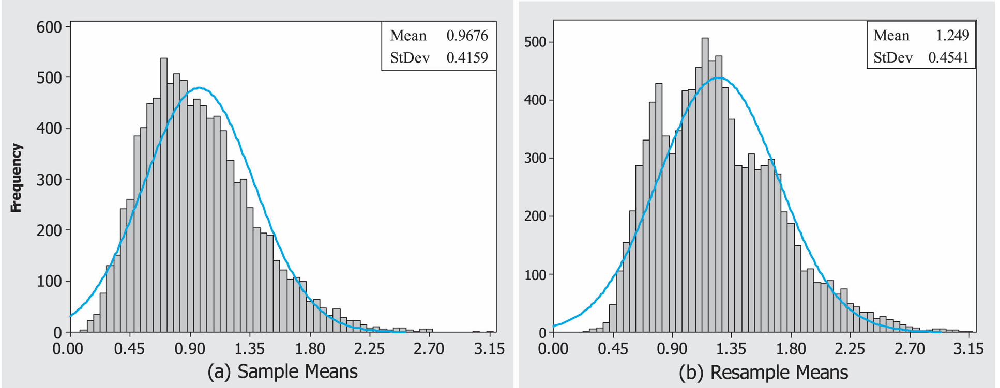

```{r setup, include=FALSE}
library(learnr)
library(tidyverse)
knitr::opts_chunk$set(echo = FALSE)
tutorial_options(exercise.timelimit = 60)

set.seed(2024)

# --- Schistosomiasis worm-count data ---------------------------------------
# Female group means (12.0 control, 4.4 treatment) match the reported study
# summary statistics; male values are illustrative data with the same design.
mice_worms <- tibble(
  sex   = rep(c("Female", "Male"), each = 10),
  group = rep(rep(c("Control", "Treatment"), each = 5), times = 2),
  worms = c(
    8, 10, 12, 14, 16,   # Female control    (mean 12.0)
    2, 3, 4, 5, 8,       # Female treatment  (mean 4.4)
    9, 11, 13, 15, 17,   # Male control
    4, 5, 6, 7, 9        # Male treatment
  )
)

# --- Baseball salary data (illustrative) ------------------------------------
baseball_salaries <- tibble(
  position = rep(c("Pitcher", "First Baseman", "Catcher"), each = 5),
  salary_k = c(
    round(rnorm(5, mean =  800, sd = 300)),
    round(rnorm(5, mean = 3200, sd = 900)),
    round(rnorm(5, mean = 1500, sd = 500))
  )
) %>%
  mutate(salary_k = pmax(salary_k, 300))

# --- Skewed population + faculty salaries for bootstrap demos --------------
chisq_population <- rgamma(100000, shape = 0.55, scale = 1.77)
med_salaries      <- round(rlnorm(100, meanlog = 5.2, sdlog = 0.35))

# --- Car price data for multiple-comparisons section ------------------------
car_prices <- tibble(
  make  = rep(c("Buick", "Cadillac", "Pontiac"), each = 8),
  price = c(
    round(rnorm(8, mean = 21000, sd = 2000)),
    round(rnorm(8, mean = 34000, sd = 3000)),
    round(rnorm(8, mean = 19000, sd = 2500))
  )
)
```

## Overview

> **TUTORIAL NOTE:** This is **Part 1B**, continuing from Part 1A (randomization and permutation tests). All data are simulated directly in R — there are no external files to download, so every exercise runs entirely inside this sandbox. The tutorial data frames stand in for the chapter's data sets as follows: `chisq_population` (ChiSq), `med_salaries` (MedSalaries), `baseball_salaries` (NLBB Salaries), `car_prices` (Car1), and `mice_worms` (Mice).

## The Bootstrap Distribution

Bootstrapping is another simulation technique that is commonly used to develop confidence intervals and hypothesis tests. Bootstrap techniques are useful because they generalize to situations where traditional methods based on the normal distribution cannot be applied. For example, they can be used to create confidence intervals and hypothesis tests for any parameter of interest, such as a median, ratio, or standard deviation. Bootstrap methods differ from previously discussed techniques in that they **sample with replacement** (randomly draw
an observation from the original sample and put the observation back before drawing the next observation).

Permutation tests, randomization tests, and bootstrapping are often called **resampling techniques** because, instead of collecting many different samples from a population, we take repeated samples (called **resamples**) from just one random sample.

### Practice: Creating a Sampling Distribution and a Bootstrap Distribution

Data set: `ChiSq`

**21.** The file ChiSq contains data from a highly skewed population (with mean 0.9744 and standard
deviation 1.3153).

  a. Take 1000 simple random samples of size 40 and calculate each mean (x). Plot the histogram of the 1000 sample means. The distribution of sample means is called the sampling distribution.

  b. What does the central limit theorem tell us about the shape, center, and spread of the sampling distribution in this example?

  c. Calculate the mean and standard deviation of the sampling distribution in Part (a). Does the sampling distribution match what you would expect from the central limit theorem? Explain.

**22.** Take one simple random sample of size 40 from the ChiSq data.

  a. Take 1000 resamples (1000 samples of 40 observations with replacement from the one simple random sample).

  b. Calculate the mean of each resample (x*) and plot the histogram of the 1000 resample means. This distribution of resample means is called the bootstrap distribution.

  c. Compare the shape, center, and spread of the simulated histograms from Question 22(b) and Question 21(a). Are they similar?

```{r sec7_ex1, exercise = TRUE}
set.seed(5)
one_sample <- sample(chisq_population, size = 40)

boot_means <- replicate(1000, {
  resample <- sample(one_sample, size = 40, replace = ___)
  mean(resample)
})

ggplot(tibble(boot_mean = boot_means), aes(x = boot_mean)) +
  geom_histogram(bins = 30, fill = "darkorange", color = "white") +
  labs(x = "Bootstrap resample mean", y = "Count") +
  theme_minimal()
```

```{r sec7_ex1-hint}
# Bootstrapping requires sampling WITH replacement: replace = TRUE
```

```{r sec7_ex1-solution}
set.seed(5)
one_sample <- sample(chisq_population, size = 40)

boot_means <- replicate(1000, {
  resample <- sample(one_sample, size = 40, replace = TRUE)
  mean(resample)
})

ggplot(tibble(boot_mean = boot_means), aes(x = boot_mean)) +
  geom_histogram(bins = 30, fill = "darkorange", color = "white") +
  labs(x = "Bootstrap resample mean", y = "Count") +
  theme_minimal()
```

**23.** Instead of using the sample mean, create a sampling distribution and bootstrap distribution of the standard deviation of the ChiSq data using a sample size of 40. Compare the shape, center, and spread of the simulated histograms and compare the mean and standard deviation of the distributions.

```{r sec7-quiz}
quiz(
  question(
    "Bootstrap resampling draws observations from the original sample...",
    answer("without replacement, like a randomization test"),
    answer("with replacement, so the same observation can appear multiple times in one resample", correct = TRUE),
    allow_retry = TRUE
  ),
  question(
    "What does the bootstrap distribution approximate?",
    answer("The population distribution exactly"),
    answer("The sampling distribution of the statistic (e.g. the sample mean)", correct = TRUE),
    allow_retry = TRUE
  )
)
```

> **Key Concept:** The bootstrap method takes one simple random sample of size n from a population. Then many resamples (with replacement) are taken from the original simple random sample. Each resample is the same size as the original random sample. The statistic of interest is calculated from each resample and used to create a bootstrap distribution.

In many real-world situations, the process used in Question 21 is not practical because collecting more than one simple random sample is too expensive or time consuming. While the approach in Question 22 is computer intensive, it is simple and convenient since it uses only one simple random sample. The key idea behind bootstrap methods is the assumption that the original sample represents the population, so resamples from the one simple random sample can be used to represent samples from the population, as is done in Question 22. Thus, the bootstrap distribution provides an approximation of the sampling distribution.

Most traditional methods of statistical inference involve collecting one sample and calculating the sample mean. Then, based on the central limit theorem, assumptions are made about the shape and spread of the sampling distribution. In Question 22 we used one sample to calculate the sample mean and then used the bootstrap distribution to estimate the shape and spread of the sampling distribution.

The central limit theorem tells us about the shape and spread of the sample mean. A key advantage of the bootstrap distribution is that it works for any parameter of interest. Thus, the bootstrap distribution can be used to estimate the shape and spread for any sampling distribution of interest.

> **CAUTION**: When sample sizes are small, one simple random sample may not represent the population very well. However, with larger sample sizes, the bootstrap distribution does represent the sampling distribution.

Figure 1.5 shows the sampling distribution and the bootstrap distribution when a sample size of 10 is used to estimate the mean of the `ChiSq` data. Notice that the spreads for both histograms are roughly equivalent. The central limit theorem tells us that the standard deviation of the sampling distribution (the distribution of $\bar{x}$ ) should be $\sigma / \sqrt{n}$ = $1.3153/ \sqrt{10}$ = 0.4159. The standard deviation of the bootstrap distribution is 0.4541, which is a reasonable estimate of the standard deviation of the sampling distribution. In addition, both graphs have similar, right-skewed shapes. The strength of the bootstrap method is that it provides accurate estimates of the shape and spread of the sampling distribution. In general, histograms from the bootstrap distribution will have a similar shape and spread as histograms from the sampling distribution.

```{r graph5, echo=FALSE, out.width="90%", fig.align="center", fig.cap="Figure 1.5: (a) The sampling distribution of the sample mean. The histogram is based on the mean of 10,000 samples of size 10 from the `ChiSq` data. (b) The bootstrap distribution of the sample mean. The histogram is based on the mean of 10,000 resamples (with replacement) of one simple random sample of the `ChiSq` data with mean 1.238 and standard deviation 1.490."}

```

The bootstrap method does not improve our estimate of the population mean. The mean of the sampling distribution in Question 21 will typically be very close to the population mean. But the mean of the bootstrap distribution in Question 22 typically will not be as accurate, because it is based on only one simple random sample. Ideally, we would like to know how close the statistic from our original sample is to the population parameter. A statistic is biased if it is not centered at the value of the population parameter. We can use the bootstrap distribution to estimate the bias of a statistic. The difference between the original sample mean and the bootstrap mean is called the **bootstrap estimate of bias**.

> **Key Concept:** The estimate of the mean (or any parameter of interest) provided by the bootstrap distribution is not any better than the estimate provided by the observed statistic from the original simple random sample. However, the shape and spread of the bootstrap distribution will be similar to the shape and spread of the sampling distribution. The bootstrap technique can be used to estimate sampling distribution shapes and standard deviations that cannot be calculated theoretically.

## Using Bootstrap Methods to Create Confidence Intervals

A **confidence interval** gives a range of plausible values for some parameter. This is a range of values surrounding an observed estimate of the parameter—an estimate based on the data. To this range of values we attach a level of confidence that the true parameter lies in the range. An alpha-level, $\alpha$, is often used to specify the level of confidence. For example, when $\alpha$ = 0.05, we have a 100(1 - $\alpha$)% = 95% confidence level. Thus, a 100(1 - $\alpha$)% confidence interval gives an estimate of where we think the parameter is and how precisely we have it pinned down.

### Bootstrap t Confidence Intervals

If the bootstrap distribution appears to be approximately normal, it is typically safe to assume that a t-distribution can be used to calculate a 100(1 - $\alpha$)% confidence interval for $\mu$, often called a bootstrap t confidence interval:

$$\bar{x} \pm t^*\left(S^*\right) \tag{1.1}$$

where $S^*$ is the standard deviation of the bootstrap distribution and $t^*$ is the critical value of the t-distribution with n - 1 degrees of freedom.

The one simple random sample of size n = 10 used to create the bootstrap distribution in Figure 1.5b has a mean of $\bar{x}$ = 1.238 and a standard deviation of s = 1.490. The bootstrap distribution in Figure 1.5b has a mean of $\bar{x}^*$ = 1.249 and a standard deviation of $S^*$ = 0.4541. Notice that Formula (1.1) uses the mean from the original sample but uses the bootstrap distribution to estimate the spread. If we *incorrectly assume* that the sampling distribution in Figure 1.5 is normal, a 95% bootstrap t confidence interval for $\mu$ is given by

$$\bar{x} \pm t^*\left(S^*\right) = 1.238 \pm 2.262(0.4541)$$

where $t^*$ = 2.262 is the critical value corresponding to the 97.5th percentile of the t-distribution with n - 1 = 9 degrees of freedom. Thus, the 95% confidence interval for $\mu$ is (0.211, 2.265).

The bootstrap t confidence interval is similar to the traditional one-sample t confidence interval. The key difference is that the bootstrap distribution estimates the standard error of the statistic with S* instead of $s/ \sqrt{n}$.

When the data are not skewed and have no clear outliers, parametric tests are very effective with relatively small sample sizes (10–30 observations may be enough to use the t-distribution). The following formula uses the t-distribution to calculate a 100(1 - $\alpha$)% confidence interval for the mean of a normal population:

$$\bar{x} + t^*\left(\frac{s}{\sqrt{n}}\right) \tag{1.2}$$

where $s/\sqrt{n}$ is the standard error of $\bar{x}$ and $t^*$ is the critical value of the $t$-distribution with $n - 1$ degrees of freedom. Using the original sample of size 10 with mean 1.238 and standard deviation 1.490, we find that a 95% confidence interval for $\mu$ is  (0.172, 2.304).

However, this confidence interval is appropriate for sample means only when the sampling distribution is approximately normal. If the data are skewed, even
sample sizes greater than 30 may not be large enough to make the sampling distribution appear normal.

With skewed data or small sample sizes (if the original data are not normally distributed), parametric methods (which are based on the central limit theorem) are not appropriate. In Figure 1.5 we see that the sampling distribution is skewed to the right. *Thus, with a sample size of 10, neither the traditional one sample t confidence interval nor the bootstrap t confidence interval is reliable in this example*. However, with a sample size of 40, the histograms in Questions 21 and 22 should tend to look somewhat normally distributed.

### Bootstrap Percentile Confidence Intervals

Bootstrap percentile confidence intervals are found by calculating the appropriate percentiles of the bootstrap distribution. To find a $100(1 - \alpha)\%$ confidence interval, take the $\alpha/2$ * 100 percentile of each tail of the bootstrap distribution. For example, to find a 95% confidence interval for $\mu$, sort all the observations from the bootstrap distribution and find the values that represent the 2.5th and 97.5th percentiles of the bootstrap distribution. The 2.5th percentile of the bootstrap distribution in Figure 1.5b is 0.546, and the 97.5th percentile is 2.282. Thus, a 95% confidence interval for $\mu$ is (0.546, 2.282).

Notice that the percentile confidence interval is not centered at the sample mean. Since the bootstrap distribution is right skewed, the right side of the confidence interval (2.282 - 1.238 = 1.044) is wider than the left side of the confidence interval (1.238 - 0.546 = 0.692). This lack of symmetry can influence the accuracy of the confidence interval.

> **Key Concept:** A bootstrap percentile confidence interval contains the middle 100(1 - $\alpha$)% of the bootstrap distribution. If the bootstrap distribution is symmetric and is centered on the observed statistic (i.e., not biased), percentile confidence intervals work well.^4^

### When to Use Bootstrap Confidence Intervals

Bootstrap methods are extremely useful when we cannot use theory, such as the central limit theorem, to approximate the sampling distribution. Thus, bootstrap methods can be used to create confidence intervals for essentially any parameter of interest, while the central limit theorem is limited to only a few parameters (such as the population mean).^[Theoretical methods allow distributional tests for more than just the population mean. However, for purposes of this text it is sufficient to understand that distributional methods tend to be more complicated and are limited to testing only a few parameters that could be of interest.] However, bootstrap methods are not always reliable.

Small sample sizes still produce problems for bootstrap methods. When the sample size is small, (1) the sample statistic may not accurately estimate the population parameter, (2) the distribution of sample means is less likely to be symmetric, and (3) the shape and spread of the bootstrap distribution may not accurately represent those of the true sampling distribution.

In addition, bootstrap methods do not work equally well for all parameters. For example, the end-of-chapter exercises show that bootstrapping often provides unreliable bootstrap distributions for median values because the median of a resample is likely to have only a few possible values. Thus, confidence intervals for medians should be used only with large n ($\geq$ 100) sample sizes.

It is not easy to determine whether bootstrap methods provide appropriate confidence intervals. The bootstrap t and bootstrap percentile confidence intervals are often compared to each other. While the percentile confidence interval tends to be more accurate, neither of the two should be used if the intervals are not relatively
close. If the bootstrap distribution is skewed or biased, other methods should be used to find confidence intervals. More advanced bootstrap methods (such as BCa and tilting confidence intervals) are available that are generally accurate when bias or skewness exists in the bootstrap distribution.^5^

### Practice: Estimating Salaries of Medical Faculty

Data set: `MedSalaries`

**24.** The file `MedSalaries` is a random sample of n = 100 salaries of medical doctors who were teaching at United States universities in 2009.

  a. Create a bootstrap distribution of the mean by taking 1000 resamples (with replacement). Create a bootstrap t confidence interval and a bootstrap percentile distribution to estimate the mean salaries.

```{r sec8_ex1, exercise = TRUE}
n <- length(med_salaries)

set.seed(9)
boot_means <- replicate(1000, {
  mean(sample(med_salaries, size = n, replace = TRUE))
})

x_bar    <- mean(med_salaries)
boot_se  <- sd(boot_means)
t_star   <- qt(0.975, df = n - 1)

boot_t_ci <- x_bar + c(-1, 1) * ___ * ___
boot_t_ci

boot_percentile_ci <- quantile(boot_means, probs = c(0.025, 0.975))
boot_percentile_ci
```

```{r sec8_ex1-hint}
# The bootstrap t interval is x_bar +/- t_star * boot_se
```

```{r sec8_ex1-solution}
n <- length(med_salaries)

set.seed(9)
boot_means <- replicate(1000, {
  mean(sample(med_salaries, size = n, replace = TRUE))
})

x_bar    <- mean(med_salaries)
boot_se  <- sd(boot_means)
t_star   <- qt(0.975, df = n - 1)

boot_t_ci <- x_bar + c(-1, 1) * t_star * boot_se
boot_t_ci

boot_percentile_ci <- quantile(boot_means, probs = c(0.025, 0.975))
boot_percentile_ci
```

  b. Create a bootstrap distribution of the standard deviation by taking 1000 resamples (with replacement). Create a bootstrap t confidence interval and a bootstrap percentile distribution to estimate the population standard deviation.

  c. Use Formula (1.2) to create a 95% confidence interval for the mean. Compare this confidence interval to those in Question 24(a). Would you expect these intervals to be similar? Why or why not?

  d. Explain why Formula (1.2) cannot be used to create a 95% confidence interval for the standard deviation.

```{r sec8-quiz}
question(
  "Which interval method makes no assumption that the bootstrap distribution is symmetric?",
  answer("The bootstrap t interval"),
  answer("The bootstrap percentile interval", correct = TRUE),
  allow_retry = TRUE
)
```

## Relationship Between the Randomization Test and the Two-Sample t-Test

R.A. Fisher, perhaps the preeminent statistician of the 20th century, introduced the randomization test in the context of a two-group randomly allocated experiment in his famous 1935 book, *Design of Experiments*.^6^ At that time he acknowledged that the randomization test was not practical because of the computational
intensity of the calculation. Clearly, 1935 predates modern computing. Indeed, Efron and Tibshirani describe the permutation test as “a computer-intensive statistical technique that predates computers.”^7^ Fisher went on to assert that the classical two-sample t-test (for independent samples) approximates the randomization test very well. Ernst cites references to several approximations to the randomization tests using classical and computationally tractable methods that have been published over time.^8^

If you have seen two-sample tests previously, it is likely to have been in the context of what Ernst calls the population model, which he distinguishes from the randomization model. In a **population model**, units are selected at random from one or more populations. Most observational studies are population models. One simple case of a population model involves comparing two separate population means. In this case, we can take two independent simple random samples and use the classic two-sample t-test to make the comparison.

In a **randomization model**, a fixed number of experimental units are randomly allocated to treatments. Most experiments are randomization models. In randomization models such as the schistosomiasis example, the two samples are formed from a collection of available experimental units that are randomly divided into two groups. Since there are a fixed number of units, the groups are not completely independent. For example, if one of the 10 male mice had a natural resistance to schistosomiasis and was randomly placed in the treatment group, we would expect the control group to have a slightly higher worm count. Since the two groups are not completely independent, the assumptions of the classic two-sample t-test are violated. Even if the sample sizes in the schistosomiasis study were much larger, the randomization test would be a more appropriate test than the two-sample t-test. However, empirical evidence has shown that the two-sample t-test is a very good approximation to the randomization test when sample sizes are large enough. We are fortunate that, in this age of modern computing, we no longer have to routinely compromise by using the t-test to approximate the randomization test.

Run a one-sided two-sample $t$-test on the female mice data and compare its $p$-value to the randomization $p$-value from Question 9.

```{r sec9_ex1, exercise = TRUE}
female_data <- mice_worms %>% filter(sex == "Female")

t.test(
  worms ~ ___,
  data = female_data,
  alternative = "___"
)
```

```{r sec9_ex1-hint}
# formula is worms ~ group; since we expect control > treatment, and
# t.test alphabetizes "Control" before "Treatment", use alternative = "greater"
```

```{r sec9_ex1-solution}
female_data <- mice_worms %>% filter(sex == "Female")

t.test(
  worms ~ group,
  data = female_data,
  alternative = "greater"
)
```

> **Key Concept:** Historically, the two-sample t-test was used to approximate the $p$-value in randomization models because randomization tests were too difficult to compute. However, now that computers can easily simulate random assignment to groups, randomization tests should be used to calculate $p$-values for randomization models, especially if sample sizes are fairly small.

```{r sec9-quiz}
question(
  "When would you most trust a randomization test over a t-test approximation?",
  answer("When sample sizes are small and/or the data are clearly skewed", correct = TRUE),
  answer("Only when sample sizes are very large"),
  answer("They are always identical, so it never matters"),
  allow_retry = TRUE
)
```

## Wilcoxon Rank Sum Tests for Two Independent Samples

The **Wilcoxon rank sum test**, also called the two-sample **Mann-Whitney test**, makes inferences about the difference between two populations based on data from two independent random samples. This test ranks observations from two samples by arranging them in order from smallest to largest.

Focusing on ranks instead of the actual observed values allows us to remove assumptions about the normal distribution. Rank-based tests have been used for many years. However, rank-based methods (discussed in this section and the next section) are much less accurate than methods based on simulations. In general, randomization tests, permutation tests, or bootstrap methods should be used whenever possible.

The following example examines whether pitchers and first basemen who play for National League baseball teams have the same salary distribution. The null and alternative hypotheses are written as,

<div style="text-align: center;">
$H_0$: the distribution of the salaries is the same for pitchers and first basemen
</div>

<div style="text-align: center;">
$H_a$: the distribution of the salaries is different for pitchers and first basemen
</div>

Table 1.2 shows the salaries of five pitchers and five first basemen who were randomly selected from all National League baseball players. Table 1.3 ranks each of the players based on 2005 salaries. If two players had exactly the same salary, standard practice is to average the ranks of the tied values.

For the Wilcoxon rank sum test, we define the following terms:

* $n_1$ is the sample size for the first group (5 for the pitcher group in this example)
* $n_2$ is the sample size for the second group (5 for the first baseman group in this example)
* N = $n_1$  + $n_2$
* W, the Wilcoxon rank sum statistic, is the sum of the ranks in the first group
(1 + 2 + 3 + 4 + 8 = 18)

If the two groups are from the same continuous distribution, then W has a mean,

$$\mu_W = \frac{n_1(N+1)}{2} = \frac{5(11)}{2}=27.5 \tag{1.3}$$

and standard deviation^9^

$$\sigma_W = \sqrt{\frac{n_1n_2(N+1)}{12}} = \sqrt{\frac{(5)(5)(11)}{12}}= 4.787 \tag{1.4}$$

If W is far from $\mu_W$, then the Wilcoxon rank sum test rejects the hypothesis that the two populations have identical distributions—that is, rejects $H_0$ (no difference in distribution of salaries) in favor of $H_a$ (salary distributions are different based on position). The $p$-value is the probability of observing a sample statistic, W, at least as extreme as the one in our sample. Since 18 is less than the hypothesized mean, 27.5, the $p$-value for the two-sided test in this example is found by calculating 2 * P(W $\leq$ 18).

> **MATHEMATICAL NOTE:** Computer software such as R, S-plus, or SAS tends to use the exact distribution of W, though Minitab uses a normal approximation for this test. If the data contain ties, the exact distribution for the Wilcoxon rank sum statistic changes and the standard deviation of W should be adjusted. Statistical software will typically detect the ties and use the normal distribution (using the adjusted standard deviation) instead of an exact distribution.^10^

### Practice: *Wilcoxon Rank Sum Tests*

Data set: `NLBB Salaries`

**25.** Using a software package, conduct the Wilcoxon rank sum test to determine if the distribution of salaries is different for pitchers than for first basemen.

```{r sec10_ex1, exercise = TRUE}
two_groups <- baseball_salaries %>%
  filter(position %in% c("Pitcher", "First Baseman"))

wilcox.test(salary_k ~ position, data = ___)
```

```{r sec10_ex1-hint}
# Pass the filtered data frame (two_groups) as the `data` argument.
```

```{r sec10_ex1-solution}
two_groups <- baseball_salaries %>%
  filter(position %in% c("Pitcher", "First Baseman"))

wilcox.test(salary_k ~ position, data = two_groups)
```

**26.** Find 2 × P(W $\leq$ 18) assuming W $\sim$ N(27.5, 4.787). How does your answer compare to that from Question 25?

**27.** Use a two-sided two-sample t-test (assume unequal variances) to analyze the data. Are your conclusions the same as in Question 25? Create an individual value plot of the data. Are any distributional assumptions violated? Which test is more appropriate to use for this data set?

```{r sec10-quiz}
question(
  "Does the Wilcoxon rank sum test require the data to follow a normal distribution?",
  answer("Yes, it's just as strict as the t-test"),
  answer("No — it works with ranks rather than raw values, so no distributional shape is assumed", correct = TRUE),
  allow_retry = TRUE
)
```

At first it may seem somewhat surprising that first basemen tend to make more than pitchers. However, in 2005 there were 19 first basemen and 215 pitchers in the National League. Many pitchers did not play much and got paid a low salary, whereas all 19 first basemen were considered quite valuable to their teams.

## Kruskal-Wallis Test for Two or More Independent Samples

The **_Kruskal-Wallis_ test** is another popular nonparametric test that is often used to compare two or more independent samples. Like ANOVA, a more common parametric test that will be discussed in later chapters, the Kruskal-Wallis test requires independent random samples from each population. When the data clearly deviate from the normal distribution, the Kruskal-Wallis test will be more likely than a one-way ANOVA to identify true differences in the population. The null and alternative hypotheses for the Kruskal-Wallis test are:

<div style="text-align: center;">
$H_0$: the distribution of the response variable is the same for all groups<br>
$H_a$: some responses are systematically higher in some groups than in others
</div>

For the Kruskal-Wallis test, we define the following terms:

* $n_1$ is the sample size for the first group (5 for the pitcher group)
* $n_2$  is the sample size for the second group (5 for the first baseman group)
* $n_3$  is the sample size for the third group (5 for the catcher group)
* N = $n_1$ + $n_2$ + $n_3$
* $R_i$ is the sum of the ranks for the ith group ($R_1$ = 35, $R_2$ = 62, and $R_3$ = 23)

The Kruskal-Wallis test is also based on ranks. The ranks are summed for each group, and when these group sums are far apart, we have evidence that the groups are different. While the calculations for the Kruskal-Wallis test statistic are provided here, we suggest using statistical software to conduct this significance test. Continuing the baseball salaries example, Table 1.4 displays salaries of five randomly selected catchers from 2005 National League baseball teams.

The Kruskal-Wallis test statistic is calculated as,

$$H = \frac{12}{N(N + 1)} \sum_{i=1}^k \frac{R_i^2}{n_i} - 3(N + 1) = \frac{12}{(15)(16)}\left(\frac{35^2}{5}+\frac{62^2}{5}+\frac{23^2}{5}\right) -3(16) =7.98 \tag{1.5}$$

The exact distribution of H under the null hypothesis depends on each $n_i$, so it is complex and time consuming to calculate. Even most statistical software packages use the chi-square approximation with I - 1 degrees of freedom to obtain $p$-values (where I is the number of groups).

> **NOTE:** When the chi-square approximation is used, each group should have at least five observations.

### Practice: Kruskal-Wallis Test

Data set: `NLBB Salaries`

**28.** Using a software package, run the Kruskal-Wallis test (use all three groups with samples of size 5 per group) to determine if the distribution of salaries differs by position. Create an individual value plot of the data. Do the data look normally distributed in each group?

```{r sec11_ex1, exercise = TRUE}
___(salary_k ~ position, data = baseball_salaries)
```

```{r sec11_ex1-hint}
# The function is kruskal.test(), used the same way as wilcox.test()
# but for 2+ groups.
```

```{r sec11_ex1-solution}
kruskal.test(salary_k ~ position, data = baseball_salaries)
```

```{r sec11-quiz}
question(
  "What is the general minimum recommended group size when using the chi-square approximation for Kruskal-Wallis?",
  answer("2"),
  answer("5", correct = TRUE),
  answer("30"),
  allow_retry = TRUE
)
```

> **MATHEMATICAL NOTE:** If the spread of each group appears to increase as the center (mean or median) increases, transforming the data—such as by taking the log of each response variable—will make the data appear much more normally distributed. Then parametric techniques can often be used on the transformed data. In the baseball salary example, the data are highly right skewed in at least two groups. While a log transformation on salaries is helpful, there is still not enough evidence that the transformed salaries are normally distributed. Thus, nonparametric methods are likely the most appropriate approach to testing whether there is a difference in the distribution of salaries based on position.

Nonparametric tests based on rank are usually less powerful (less likely to reject the null hypothesis) than the corresponding parametric tests. Thus, you are less likely to identify differences between groups when they really exist. If you are reasonably certain that the assumptions for the parametric procedure are satisfied, a parametric procedure should be used instead of a rank-based nonparametric procedure. Many introductory texts suggest that, in order to conduct a parametric test, you should have a sample size of 15 in each group and no skewed data or outliers.

## Multiple Comparisons

In introductory texts, statistical inference is often described in terms of drawing one random sample, performing one significance test, and then stating appropriate conclusions—analysis done, case closed. However, there are many situations where inference is not that simple. Performing multiple statistical tests on the same data set can create several problems.

Using a significance level of $\alpha$ = 0.05 (i.e., rejecting $H_0$ in favor of the alternative when the $p$-value is less than or equal to 0.05) helps to ensure that we won’t make a wrong decision. In other words, one time out of 20 we expect to incorrectly reject the null hypothesis. But what if we want to do 20 or more tests on the same data set? Does this mean that we’re sure to be wrong at least once? And if so, how can we tell which findings are incorrect? The following activities explore how researchers can protect themselves from drawing conclusions from statistical findings that could be the result of random chance.

### Practice: Comparing Car Prices

Data set: `Car1`

**29.** Open the `Car1` data set and conduct three two-sided hypothesis tests to determine if there is a difference in price. Compare the means: Pontiac versus Buick (test 1), Cadillac versus Pontiac (test 2), and Cadillac versus Buick (test 3). Provide the $p$-value for each of these three tests. Which tests have a $p$-value less than 0.05?

**30.** Assuming the null hypotheses are true, each of the three tests in Question 29 has a 5% chance of inappropriately rejecting the null hypothesis. However, the probability that at least one of the three tests will inappropriately reject the null hypothesis is 14.26%. Assuming that the null hypothesis is true and that each test is independent, complete the following steps to convince yourself that this probability is correct.

  a. Each test will either reject (R) or fail to reject (F). List all eight possible outcomes in the table below.

| Case | Test_1 | Test_2 | Test_3 | Probability |
|:----:|:------:|:------:|:------:|:-----------:|
| 1 | F | F | F | |
| 2 | F | F | R | |
| 3 | F | R | F | |
| 4 | | | | |
| 5 | | | | |
| 6 | | | | |
| 7 | | | | |
| 8 | | | | |

  b. The probability that each test rejects is $P(R) = 0.05$, and the probability that each test fails to reject is $P(F) = 0.95$. For example, the probability that all three tests fail to reject is $0.95^3 = 0.8574$. The probability that the first two fail to reject and the third does reject is $0.95 \times 0.95 \times 0.05 = 0.0451$. Complete the table. Verify the probabilities sum to 1. The probability that at least one test rejects is $1 - 0.8574 = 0.1426$.

**31.** Repeat Question 30 using ( $\alpha$ = 0.10 ). What is the probability that at least one of the three tests will inappropriately reject the null hypothesis?

**32.** To compare all four car makes, six hypothesis tests will be needed. List all six null hypotheses. Assuming independence and that the null hypothesis is true, what is the probability that at least one of the six tests will inappropriately reject the null hypothesis at $\alpha = 0.05$?

### Practice: The Least-Significant Differences Method and the Bonferroni Method

Data set: `Car1`

When the significance level is controlled for each individual test, as was done in Question 29, the process is often called the **least-significant differences method (LSD)**. Notice that using $\alpha$ = 0.05 for all tests has some undesirable properties, especially when a large number of tests is being conducted. If 100 independent tests were conducted to compare multiple groups (and there really were no differences), the probability of incorrectly rejecting at least one test would be 1 - 0.95^100^ = 0.994. Thus, using $\alpha$ = 0.05 as a critical value for 100 comparisons will almost always lead us to incorrectly conclude that some results are significantly different.

One technique that is commonly used to address the problem with multiple comparisons is called the **Bonferroni method**. This technique protects against the probability of false rejection by using a cutoff value of $\alpha$/K, where K is the number of comparisons. In Question 29, there are three comparisons (i.e. three hypothesis tests). Thus, a cutoff value of 0.05/3 = 0.01667 should be used. In other words, when there are three comparisons as in Question 29, the Bonferroni method rejects the null hypothesis when the $p$-value is less than or equal to 0.01667. Using the least-significant differences method ($\alpha$ = 0.05), as was done in Question 29, we would conclude that the prices of Buicks and Chevrolets are significantly different, but using the Bonferroni method we would fail to reject in all three tests.

```{r sec12_ex1, exercise = TRUE}
p_buick_cadillac <- t.test(price ~ make, data = car_prices %>% filter(make %in% c("Buick", "Cadillac")))$p.value
p_buick_pontiac  <- t.test(price ~ make, data = car_prices %>% filter(make %in% c("Buick", "Pontiac")))$p.value
p_cadillac_pontiac <- t.test(price ~ make, data = car_prices %>% filter(make %in% c("Cadillac", "Pontiac")))$p.value

raw_p_values <- c(p_buick_cadillac, p_buick_pontiac, p_cadillac_pontiac)

adjusted_p_values <- p.adjust(raw_p_values, method = ___)
adjusted_p_values
```

```{r sec12_ex1-hint}
# p.adjust() takes a method name as a string, e.g. method = "bonferroni"
```

```{r sec12_ex1-solution}
p_buick_cadillac <- t.test(price ~ make, data = car_prices %>% filter(make %in% c("Buick", "Cadillac")))$p.value
p_buick_pontiac  <- t.test(price ~ make, data = car_prices %>% filter(make %in% c("Buick", "Pontiac")))$p.value
p_cadillac_pontiac <- t.test(price ~ make, data = car_prices %>% filter(make %in% c("Cadillac", "Pontiac")))$p.value

raw_p_values <- c(p_buick_cadillac, p_buick_pontiac, p_cadillac_pontiac)

adjusted_p_values <- p.adjust(raw_p_values, method = "bonferroni")
adjusted_p_values
```

**33.** Repeat Question 30 using the Bonferroni cutoff value of 0.05/3 = 0.016667 instead of $\alpha$ = 0.05. Find the probability that at least one of the tests rejects.

**34.** Using all four groups of cars and $\alpha$ = 0.05 (cutoff of 0.05/6), do any of the six tests reject the null hypothesis with the Bonferroni method?

**35.** If there were seven groups, 21 hypothesis tests would be needed to compare all possible pairs. Using $\alpha$ = 0.05 and the Bonferroni’s method (reject $H_0$ if the $p$-value is less than 0.05/21 = 0.00238) what is the probability that at least one of the tests would reject?

```{r sec12-quiz}
question(
  "With K = 3 comparisons and a family-wise alpha of 0.05, what is the Bonferroni cutoff for each individual test?",
  answer("0.05"),
  answer("0.05 / 3 ≈ 0.0167", correct = TRUE),
  answer("0.05 × 3 = 0.15"),
  allow_retry = TRUE
)
```

> **MATHEMATICAL NOTE:** Other terms that are commonly discussed with multiple comparisons are **family-wise type I error** and **comparison-wise type I error**. Bonferroni’s method is an example of a technique that maintains the family-wise type I error. With the family-wise type I error 0.05, assuming that there really is no difference between any of the K pairs, there is only a 5% chance that any test will reject $H_0$. The least-significant differences method is used to maintain a comparison-wise type I error rate: Assuming that a particular null hypothesis test is true, there is a 5% chance we will (incorrectly) reject that particular hypothesis. Montgomery’s *Design and Analysis of Experiments* text provides more information on multiple comparisons.^11^

### Choosing a Critical Value

The $\alpha$-level represents the probability of a **type I error**. A type I error can be considered a false alarm: Our hypothesis test has led us to conclude that we have found a significant difference when one does not exist. However, it is important to recognize that it is also possible to make a **type II error**, which means our hypothesis test failed to detect a significant difference when one exists. In essence, a type II error can be thought of as an alarm that failed to go off.

Notice that if the Bonferroni method is used with all six tests, the critical value for each individual test is 0.05/6 = 0.00833. Thus, this method often fails to detect real differences between groups, leaving us open to a high rate of type II error while protecting us against type I errors.

Neither the least-significant differences nor the Bonferroni method is ideal. Caution should be used with both techniques, and neither technique should be used with numerous comparisons. The key is to recognize the benefits and limitations of each technique and to properly interpret the results of each technique. Some researchers suggest limiting the number of tests, using both techniques, and letting the reader decide which conclusions to draw. Both techniques are commonly used when there are fewer than 10 comparisons. However, a researcher should always decide which comparisons to test before looking at the data.

## Chapter Summary

This chapter described the basic concepts behind randomization tests, permutation tests, bootstrap methods, and rank-based nonparametric tests. **Parametric tests** (such as z-tests, t-tests or F-tests) assume that data follow a known probability distribution or use the central limit theorem to make inferences about a population. **Nonparametric tests** do not require assumptions about the distribution of the population or the central limit theorem in order to make inferences about a population.

The **null hypothesis**, denoted $H_0$, states that in a study nothing is creating group differences except the random allocation process. The research hypothesis is called the **alternative hypothesis** and is denoted $H_a$ (or $H_1$). The $p$-value is the likelihood of observing a statistic at least as extreme as the one observed from the sample data when the null hypothesis is true. A threshold value, called a **significance level**, is denoted by the Greek letter alpha ($\alpha$). When a study’s $p$-value is less than or equal to this significance level, we state that the results are **statistically significant at level $\alpha$**. Exact $p$-values are often difficult to calculate, but **empirical $p$-values** can often be simulated through a randomization or permutation test. The empirical $p$-value will become more precise as the number of randomizations within a simulation study
increases.

The steps in a **randomization test** are as follows:

* An experiment is conducted in which units are assigned to a treatment and an observed sample statistic is calculated (such as the difference between group means).
* Software is used to simulate the random allocation process a number of times (N iterations).
* For each iteration, the statistic of interest (difference between group means) is recorded, with X being
the number of times the statistic in the iteration exceeds or is the same as the observed statistic in the
actual experiment.
* X/N is computed to find the $p$-value, the proportion of times the statistic exceeds or is the same as the observed difference.

A **permutation test** is a more general form of the randomization test. The steps in both tests are identical, except that permutation tests do not require random allocation. Randomization tests and permutation tests can provide very accurate results. These tests are preferred over parametric methods when the sample size is small or when there are outliers in a data set. Since real data sets tend not to come from exactly normal populations, it is important to recognize that even $p$-values from parametric tests are approximate (but typically accurate as long as the sample sizes are large enough, the data are not skewed, there are no outliers, and the data are reasonably normal). A graph such as a boxplot or individual value plot should always be created to determine if parametric methods are appropriate. Randomization tests are gaining popularity because they require fewer assumptions and are just as powerful as parametric tests.

Bootstrap methods take many (at least 1000) resamples with replacement of the original sample to create a bootstrap distribution. If the bootstrap distribution is symmetric and unbiased, bootstrap t or bootstrap percentile confidence intervals can be used to approximate 100(1 - $\alpha$)% confidence intervals.

The steps in creating **bootstrap confidence intervals** are as follows:

* One sample of size n is taken from a population and the statistic of interest is calculated.
* Software is used to take resamples (with replacement) of size n from the original sample a number of times (N iterations). For each iteration, the statistic of interest is calculated from the resample.
* The **bootstrap distribution**, which is the distribution of all N resample statistics, is used to estimate
the shape and spread of the sampling distribution.
* A **bootstrap t confidence interval** is found by calculating $\bar{x}$ $\pm t^*(S^*)$ where $S^*$ is the standard
deviation of the bootstrap distribution and $t^*$ is the critical value of the t(n - 1) distribution with 100(1 - $\alpha$)% of the area between - t* and t*.
* A 100(1 - $\alpha$)% bootstrap percentile confidence interval is found by taking the ($\alpha$ / 2) * 100 percentile of each tail of the bootstrap distribution.

Bootstrap confidence intervals based on small samples can be unreliable. The bootstrap t or percentile confidence interval may be used if,

* the bootstrap distribution does not appear to be biased,
* the bootstrap distribution appears to be normal, and
* the bootstrap t and percentile confidence intervals are similar.

Simulation studies can easily be extended to testing other terms, such as the median or variance, whereas most parametric tests described in introductory statistics classes (such as the z-test and t-test) are restricted to testing for the mean. Simulation studies are an extremely useful tool that can fairly easily be used to calculate accurate $p$-values for research hypotheses when other tests are not appropriate.

Before computationally intensive techniques were easily available, rank-based nonparametric tests, such as the **Wilcoxon rank sum** test and the **Kruskal-Wallis test**, were commonly used. These tests do not require assumptions about distributions, but they tend to be less informative because ranks are used instead of the actual data. Both tests assume that sample data are from independent random samples whose distributions have the same shape and scale. Each sample in the Kruskal-Wallis test should consist of at least five measurements. Rank-based nonparametric tests tend to be less powerful (less likely to identify differences between groups) than parametric tests (when assumptions do hold) and resampling methods. When the sample sizes are small and there are reasons to doubt the normality assumption, rank-based nonparametric tests are recommended over parametric tests. Randomization tests and
permutation tests are typically preferred over parametric and rank-based tests. Their $p$-values are often more reliable, and they are more flexible in the choice of parameter tested.

One final note of caution: Even though it is possible to analyze the same data with a variety of parametric and nonparametric techniques, statisticians should never search around for a technique that provides the results they are looking for. Conducting multiple tests on the same data and choosing the test that provides the smallest $p$-value will cause the results to be unreliable. If possible, determine the type of analysis that will be conducted before the data are collected.

```{r summary-quiz}
quiz(
  question(
    "What is the defining feature that distinguishes a randomization test from a permutation test?",
    answer("Randomization tests use simulation; permutation tests use exact math"),
    answer("Randomization tests apply to experiments with random allocation; permutation tests apply more generally, including to observational data", correct = TRUE),
    allow_retry = TRUE
  ),
  question(
    "Which of the following requires sampling WITH replacement?",
    answer("A randomization test that shuffles group labels"),
    answer("A bootstrap resample used to build a confidence interval", correct = TRUE),
    allow_retry = TRUE
  ),
  question(
    "A study reports a p-value of 0.85 for a treatment effect. Can we conclude there is no difference between treatment and control?",
    answer("Yes, a high p-value proves the null hypothesis is true"),
    answer("No — failing to reject H0 is not the same as proving H0 is true; we simply lack evidence of a difference", correct = TRUE),
    allow_retry = TRUE
  ),
  question(
    "Which of these is true about Type I and Type II errors?",
    answer("A Type I error is a false alarm (rejecting a true null); a Type II error is a missed detection (failing to reject a false null)", correct = TRUE),
    answer("A Type I error and a Type II error are the same thing"),
    allow_retry = TRUE
  )
)
```

## References

1. Douglas Montgomery, *Design and Analysis of Experiments* (New York: Wiley, 2005), p. 21.
2. Maha-Hamadien Abdulla, Kee-Chong Lim, Mohammed Sajid, James H. McKerrow, and Conor R. Caffrey, “Schistosomiasis Mansoni: Novel Chemotherapy Using a Cysteine Protease Inhibitor,” PLoS Medicine 4.1 (Jan. 2007). Note: Professor Conor R. Caffrey provided the raw data upon request.
3. This data set is from the text by Ann E. Watkins, Richard L. Scheaffer, and George W. Cobb, Statistics in Action (Emeryville, CA: Key Curriculum Press, 2004).
4. Bradley Efron, The Jackknife, the Bootstrap, and Other Resampling Plans, Society of Industrial and Applied Mathematics CBMS-NSF Monographs, 38 (1982).
5. Bradley Efron, “Nonparametric Standard Errors and Confidence Intervals,” Canadian Journal of Statistics, 36 (1981).
6. R. A. Fisher, Design of Experiments (Edinburgh, UK: Oliver and Boyd, 1935).
7. Bradley Efron and Robert Tibshirani, An Introduction to the Bootstrap (New York: CRC Press, 1993), p. 202.
8. Michael D. Ernst, “Permutation Methods: A Basis for Exact Inference,” Statistical Science, 19.4 (2004), 676–685.
9. E. L. Lehmann, Nonparametrics Statistical Methods Based on Ranks (Upper Saddle River, NJ: Prentice Hall, 1998).
10. C. Bellera, M. Julien, and J. Hanley, “Normal Approximations to the Distributions of the Wilcoxon Statistics: Accurate
to What N? Graphical Insights,” Journal of Statistics Education, 18.2 (2010).
11. Douglas Montgomery, Design and Analysis of Experiments (New York: Wiley, 2005).
12. Fred L. Ramsey and Daniel W. Schafer, The Statistical Sleuth (Pacific Grove, CA: Duxbury, 2002).
13. S. Petrellese, “Adelphi Settlement in Sex Discrimination Case a ‘Step in Right Direction,’” Garden City News, March 29, 2009. Retrieved on Jan. 31, 2010.
14. L. W. Perna, “Sex and Race Differences in Faculty Rank and Tenure,” Research in Higher Education, 42 (2001), 541–567: L. W. Perna, “Sex Differences in Faculty Salaries: A Cohort Analysis,” Review of Higher Education, 24 (2001), 283–307.
